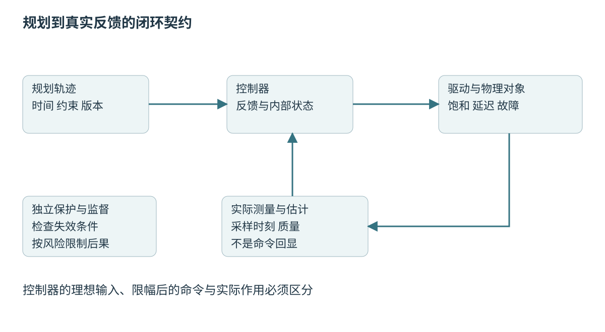
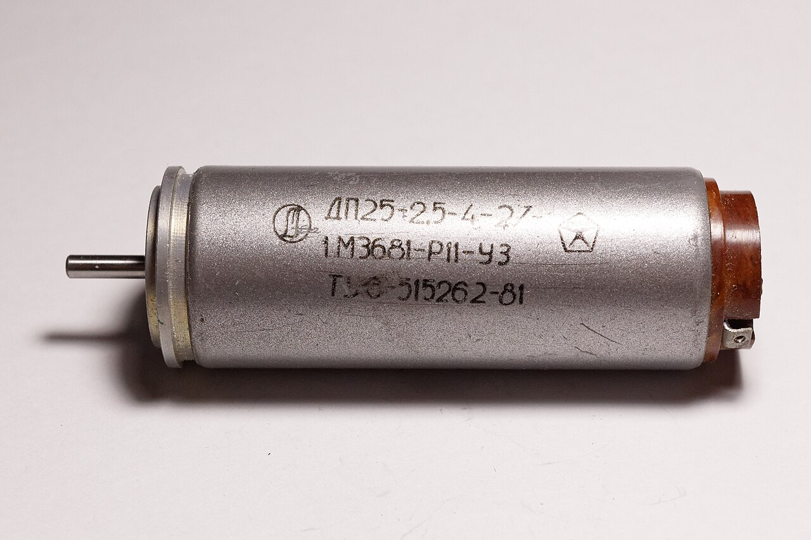
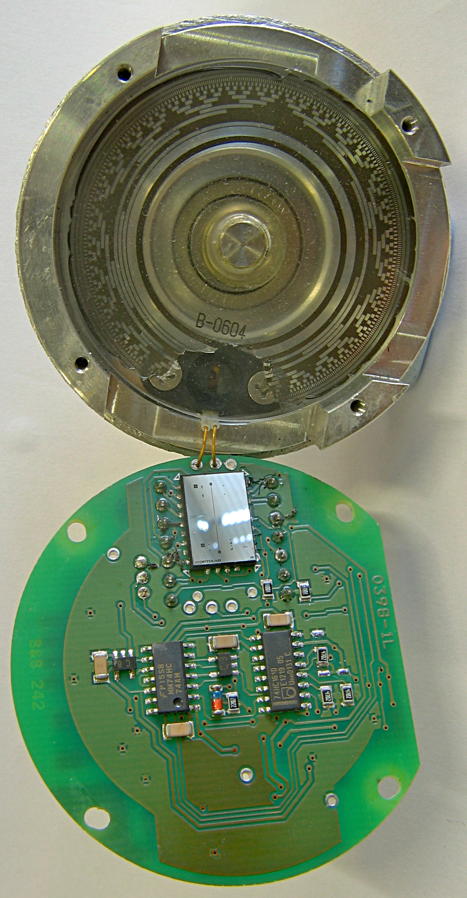
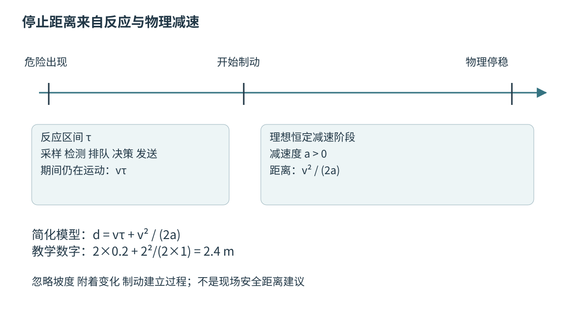

# 第五十一章 规划控制与闭环行为

**规划**选择希望发生的运动或行为，**控制**根据实际反馈持续调整输入，使系统尽可能满足目标与约束。规划给出的路线可能没有碰撞，却无法被车辆转弯半径实现；控制器可能精确跟踪一条轨迹，却把机器人带向已经移动的障碍。两者必须与感知、估计、执行器和保护机制组成闭环。

机器人中的“可行”至少有几层含义：几何上不穿过障碍，运动学上符合关节与非完整约束，动力学上满足力、速度和加速度能力，时间上能在计算与通信期限内执行，风险上有足够证据支持在目标环境中使用。只通过其中一层不能替代其他层。

本章接续第四十八至五十章的时间、坐标与估计约束。算法与公式是教学模型，所有数值用于解释量级，不是现场调参、通电或制动建议。没有运行规划控制代码，没有驱动真实电机；真实执行机构需要经过风险评估的硬件保护与授权测试流程。

## 51.1 Graph Search采样规划与约束

### 51.1.1 配置空间把整个机器人放进规划问题

**配置**是描述机器人姿态所需的一组独立变量。平面刚体可以用位置和朝向，机械臂可以用关节角；**配置空间**由所有可能配置组成。障碍在这个空间中表示“机器人以该配置放置时会发生碰撞”的集合，而不是仅把机器人中心点与障碍点比较。[S1]

圆形移动平台可在一定条件下通过膨胀障碍把自身半径合入地图，但非圆形平台随朝向改变占据区域，机械臂还涉及连杆之间自碰撞。一个末端点无碰撞，不代表整条机械臂无碰撞；一个底盘中心在通道内，也不代表外伸负载能够通过。

配置空间的距离不一定是普通欧氏距离。角度具有周期，四元数有双重表示，不同关节移动成本和允许范围不同。把179度与−179度直接相减得到358度，会误判实际只需小幅跨界的运动。距离与插值都应尊重状态空间结构。

规划输入应包括机器人几何、当前配置、环境版本和允许误差。安装新工具或搬运物体后，碰撞几何已经改变，旧路径未必仍可用。机器人模型需要与实际负载、关节限制和传感状态同步，而不能长期只使用出厂外形。

### 51.1.2 图搜索的最优性依赖图与代价定义

把连续空间离散成栅格、格点或运动原语图后，可以使用Dijkstra、A*等图搜索。Dijkstra在适当非负边权条件下求最短路径；A*利用启发式引导搜索。LaValle的离散规划章节提供这类方法的基本理论背景。[S2]图上的最短不等于连续物理世界中所有路径的最短。

A*的启发式若不高估剩余代价，并配合正确的重复状态和终止处理，可获得相应最优性保证；一致性还能简化闭集处理。若为了速度把启发式乘一个大权重，可能改变最优性保证。工程上可以作此取舍，但应清楚说明算法实际运行的版本和界限。

栅格分辨率影响可表示通道与计算规模。分辨率太粗可能把真实窄通道堵死，太细则增加状态与碰撞检查。斜向移动还要处理“穿角”：两个相邻障碍之间的对角连线可能让机器人穿过实际不可通行区域，不能只检查端点空闲。

代价函数表达任务偏好，如距离、转弯、能耗或靠近障碍的惩罚。不同代价单位与权重需要有解释。把安全相关禁止条件只写成有限罚分，优化器在其他代价足够大时可能选择违反它；应区分硬约束与可权衡偏好。

### 51.1.3 采样方法用有限探索处理高维空间

**概率路线图**（PRM）采样配置并连接可行局部运动，适合复用同一环境中的路线关系；**快速探索随机树**（RRT）从已有状态向采样目标扩展，常用于单次查询。它们避免显式构造高维空间的全部栅格，但仍依赖状态有效性与局部连接方法。[S3]

概率完备性意味着在规定假设下，采样数量趋于无穷时找到已有可行解的概率趋近于一，不代表有限期限内一定找到路径。RRT*等方法的渐近最优性也不能翻译成“这次返回的路径就是最优”。实时任务必须处理搜索超时与无解的不确定区别。

距离度量、采样分布和扩展步长影响探索效率。狭窄通道可能只占很小空间体积，均匀采样难以命中；目标偏置过强又可能让树反复撞向同一障碍。约束流形、接触和闭链问题还需要专门处理，不能仅换一个随机数种子。

OMPL官方规划器说明区分几何规划和带控制的规划类别。[S4]几何路径通常假设后续能转换成满足动力学的轨迹，这个假设必须验证。一个库返回path对象，不等于真实机器人具有执行它的速度、加速度或转矩能力。

### 51.1.4 非完整约束使可达性与瞬时方向不同

**非完整约束**限制瞬时速度，但不一定能积分成仅依赖位置的约束。汽车通常不能直接侧向平移，却可以通过前进、转向与倒车到达侧方位置。这说明“当前不能朝那个方向动”和“最终不能到达那里”是不同问题。[S5]

简化自行车模型把转向角、轴距、速度与曲率联系起来，适用于特定低侧滑范围。高速、低附着或复杂轮胎动力学可能超出模型。规划若允许瞬间改变转向角或曲率，会产生运动学上看似合理、执行机构却跟不上的路径。

机械臂同样有速度、加速度、力矩和奇异位形约束。笛卡尔末端轨迹平滑，不代表关节轨迹平滑；接近雅可比奇异点时，小末端速度可能要求很大关节速度。逆运动学解支之间跳转，也可能使关节目标出现不连续。

因此规划状态有时必须包括速度或其他动态变量，扩展时模拟受限控制输入，而不是只连接几何位置。维度增加带来成本，却可以避免后处理才发现整条路径无法执行。选择模型精度应依据机器人实际工作范围与风险。

### 51.1.5 碰撞检查必须覆盖运动中间过程

状态无碰撞不代表两状态之间的运动无碰撞。离散检查只在有限插值点测试，步长过大可能跳过薄障碍或旋转扫掠区域。OMPL的状态与运动有效性文档明确区分这些层次，检查分辨率是必须设计的参数。[S6]

连续碰撞检测或保守扫掠体可以更直接处理区间内运动，但也受几何类型、运动模型和实现支持限制。不能写上“连续”就宣称绝无漏检。网格缺陷、错误变换、未建模负载和传感盲区都在碰撞算法之外。

机器人与障碍都具有不确定度，几何余量应考虑定位、地图、跟踪和时间误差。简单统一膨胀半径易实现，却可能过于保守或遗漏方向性风险。更精细的方法也需要可信误差模型，不能把未经校准的协方差直接当作绝对保护边界。

诊断时保留候选路径、机器人几何版本、碰撞查询结果和最小距离，而不是只保存规划成功标记。若碰撞发生在轨迹点之间，应先检查插值与扫掠；若实际轮廓超出模型，则再精细的几何查询也无法弥补。

### 51.1.6 可行解 最优解与无解证明不能混淆

规划器返回一条路径，至少需要重新验证起点、终点、约束和地图版本。某些方法可能返回近似目标或部分路径，接口必须显式标记。调用者若把“有返回值”一律当成完整成功，会让机器人在离目标很远或无可靠后续路线时继续行动。

搜索期限到达而没有找到路径，不等于数学上不存在路径。原因可能是采样不足、启发式不适合、模型过于保守或初始状态已经无效。系统应区分输入错误、已证明不可行、预算耗尽与内部故障，以便选择等待、换策略或停止。

最优性也只有相对明确代价和模型才有意义。更短路径可能更靠近障碍，更快轨迹可能消耗更多能量或降低舒适度。多目标通常需要优先级、约束或权重，不能用一句“综合最优”掩盖没有说明的取舍。

深入追问：“为什么换成RRT*仍得到很差路径？”有限时间内样本不足、狭窄通道、代价定义或连接策略都可能限制质量。渐近性质不保证当前预算下的效果，应比较首次可行时间、质量随预算变化和失败分布，而不是只比较算法名称。

### 51.1.7 重规划必须承认计算期间机器人还在运动

规划从某个起始状态和地图快照开始，计算完成时系统已进入新状态。若直接执行旧起点路径，可能产生跳变或与当前速度不相容。应在结果合入时验证时间、当前状态、地图版本与前缀可执行性，必要时重新接续或拒绝结果。

可以保留已承诺执行的短前缀，同时规划后续部分，但承诺范围不能超过可靠感知与停止能力。过长前缀降低反应速度，过短前缀可能使系统对计算抖动敏感。前缀长度应来自闭环时延、动态障碍与执行约束。

重规划抖动还可能让左右绕障选择频繁切换，控制器来不及稳定跟踪。可在代价中考虑轨迹连续性和切换成本，或者由行为层管理明确模式；但迟滞不能让系统继续执行已不安全的旧方案。稳定性偏好应服从有效性检查。

一个教学诊断是规划频率提高后运动反而更晃：可能每次路径从新噪声位置重新开始，也可能目标切换没有速度连续性。应检查相邻规划结果及其生效时刻，而不是立刻加大控制增益。

## 51.2 轨迹优化 碰撞时序与行为决策

### 51.2.1 路径只描述去哪里 轨迹还描述何时到达

**路径**是一条空间或配置空间曲线，**轨迹**把状态与时间联系起来。相同路径可以慢速或快速通过，所需加速度、转矩和与动态障碍的相遇关系完全不同。因此规划输出如果只有离散位置点，还需要明确插值、时间参数化与导数约束。

时间参数化可用路径参数s(t)表达。位置q(s)、速度q′(s)ṡ、加速度q″(s)ṡ²+q′(s)s̈显示几何曲率与时间变化共同决定动态需求。即使ṡ恒定，弯曲路径仍可能需要加速度，不能把匀速误解成无加速度。

速度、加速度和**加加速度**（jerk）约束对应不同执行与舒适性要求。位置连续不保证速度连续，速度连续不保证加速度连续。轨迹拼接应明确所需连续阶数，避免每个段内部平滑而边界突然跳变。

所有时间应基于明确时钟和开始条件。轨迹以“接收后立即开始”还是绝对时间执行，通信延迟下结果不同。暂停、取消和重新开始也需要规则，不能只把时间索引归零而忽略机器人当前速度和积分状态。

### 51.2.2 轨迹优化将运动模型与代价联合求解

轨迹优化把一系列状态、控制或参数作为未知量，最小化跟踪、时间、能量或平滑度代价，同时满足动力学与约束。直接射击法通过控制序列积分状态，直接配点法同时优化状态并施加离散动力学约束；MIT的轨迹优化讲义介绍这些基本形式。[S7]

优化变量越丰富，可以表达的动作越多，但数值规模、非凸性和初始化难度也增加。障碍约束常是非凸的，局部求解器可能停在某一侧绕行的局部解，无法自行穿过障碍换到另一同伦类。全局搜索提供初值、局部优化改善平滑性是一种常见组合。

硬约束与软约束应分清。软约束通过罚项或松弛变量允许有限违反，可帮助求解器处理非理想初值，但最终动作仍需独立验证。若碰撞约束使用松弛，不能因为目标函数有限就认为结果可执行；必须检查允许违反的含义与边界。

优化应有时间预算与失败出口。过期的高质量解可能不如及时的已验证保守动作。需要记录可行性残差、约束余量、求解状态和结果年龄，而不是只判断代价值比上一轮低。

### 51.2.3 动态障碍让碰撞成为时空问题

静态路径避开当前障碍，不意味着未来不会相撞。面向动态障碍的规划需要预测障碍在时间中的占据范围，并与机器人轨迹同步检查。预测可采用运动模型、行为假设或多模态分布，但所有预测都带有不确定度，时间越远通常越难准确。

一个行人可能继续直行、停下或转身；把所有可能性压成一条平均轨迹，平均位置甚至可能落在现实中没人走的区域。规划应根据用途采用占据集合、多假设或其他保守方法，并明确预测失效时反应。

机器人动作还会影响他人行为。仅用固定日志回放无法完全评价这种互动，因为新动作不会改变记录中的行人轨迹。闭环仿真可引入交互模型，但该模型仍须验证，不能把模拟代理总会让路当成真实人类会让路的证明。

教学例子中，两条空间路径相交不一定碰撞，若通过时间不同则可能安全；两条中心线不相交也可能碰撞，因机器人有体积且可能旋转。正确对象是带时间与形状的占据关系，不是一张二维线图。

### 51.2.4 行为层管理模式与承诺

**行为决策**选择等待、跟随、绕行、倒退、对接或停止等较高层模式，再由运动规划生成具体轨迹。有限状态机与行为树都是组织方式；状态机强调显式状态转换，行为树提供组合和反馈机制，但二者都需要清楚的进入、退出与中断语义。

状态转换不能只基于瞬时噪声。例如障碍刚越过阈值就从等待切换绕行，下一帧又切回来，会造成行为振荡。迟滞、持续时间与任务承诺可以稳定选择，但它们引入反应延迟，必须与危险条件下立即退出的规则分开。

行为层应知道动作资源是否被占用，以及取消是否完成。把旧轨迹取消请求发出后立刻激活相反运动，可能使两个控制源重叠。应使用目标身份与确认状态，将“请求取消”“正在停止”“已可重新规划”区分。

面试追问：“行为树是否天然比状态机更安全？”不是。两者都只是组织逻辑的工具。错误条件、未处理的失败返回、异步动作生命期和无界重试都可能制造风险。应评价可验证性、复杂度与故障语义，而不是把一种表示法当成安全属性。

### 51.2.5 约束需要贯穿规划与控制

规划器允许的最高速度、控制器限幅和驱动器实际能力必须一致。若规划要求2m/s而控制只能实现1m/s，时间预测会失真，动态障碍避让也可能失效。控制器跟踪误差不是仅影响平滑度，它会改变未来占据空间。

约束还可能随电量、温度、负载、坡度和地面附着变化。固定出厂参数不能覆盖所有工况。平台应提供当前可用能力或状态，规划与控制据此调整；能力变化过快或无法可靠估计时，需要更保守的范围和降级策略。

规划可以考虑跟踪误差管道或鲁棒余量，但余量必须来自有依据的误差界与模型验证。把所有误差简单相加有时很保守，把它们当独立高斯变量相加又可能过度乐观。选择应与风险分析和证据一致。

深入追问：“控制器能纠正路径误差，为什么规划还要考虑动力学？”反馈只能在执行器、传感与稳定性允许范围内纠正，不能创造缺失的转矩、附着或制动距离。规划超出能力时，反馈越激进可能越容易饱和或失稳。

### 51.2.6 轨迹验证应独立于生成器的乐观假设

生成器为了效率可能使用简化碰撞几何、近似动力学或有限迭代。结果验证可以采用独立实现或更保守模型，检查约束、起始状态、终止条件和有效期限。独立性应落到故障原因，两个模块调用同一错误碰撞函数不形成真正独立证据。

验证失败应保留原因：越界、碰撞、速度不连续、动态不可行、地图过期或数值异常。统一返回false不利于诊断，也容易让上层无限重试同样失败输入。失败出口需要选择已验证停止、保持或其他受限行为，具体取决于物理系统。

轨迹在执行中仍要监控。新障碍、估计跳变、设备能力下降或数据过期，都可能使开始时有效的轨迹失效。周期验证不应仅对剩余位置点做静态碰撞，还要检查时间和当前执行状态。

**追问：“增加一个Collision Monitor是否完成安全验证？”** Nav2官方项目说明明确指出其CPU级碰撞监控不提供硬实时安全认证。[S8]它可以增加软件防护，但其传感、调度、命令路径和硬件仍可能失效，不能替代经过风险论证的保护系统。

### 51.2.7 一个完整规划结果应该怎样交给控制器

规划结果应包含轨迹身份、参考坐标系、开始时刻、有效期限、状态与控制序列或插值规则、适用约束版本和终止条件。控制器接收时验证当前状态是否仍在允许接续范围，避免把旧起点当成真实状态。

可执行前缀与后续候选应分开管理。下一个规划结果到来时，要说明从哪一时刻切换，以及位置、速度和必要导数是否连续。不能只把一个共享数组指针替换掉，让控制线程在一次循环中读到两条轨迹的不同部分。

取消、抢占和完成也使用同一身份。完成意味着达到定义的误差与状态条件，而不仅是时间索引走到数组末尾。若最后仍有速度或偏差，应报告相应状态，不能让上层误以为设备已经静止并允许人员接近。

图 51-1 闭环中的每一段都有时间、所有权与有效性契约。硬件反馈用于确认实际运动，不能由命令回显代替。来源：本章原创。

## 51.3 PID LQR MPC离散化和稳定性

### 51.3.1 PID的三项分别响应当前 历史与变化趋势

对标量误差e=r−y，理想连续PID可写成u=Kₚe+Kᵢ∫e dt+K_d de/dt。比例项响应当前偏差，积分项累计长期偏差，微分项响应变化趋势。它们的单位依被控量与输入而定，不能把另一台设备的三个无单位数字直接复制过来。

比例增益提高可能加快响应，也可能放大噪声或使相位裕度不足；积分有助于消除某些持续扰动造成的稳态偏差，却可能引起饱和积累；理想微分对高频噪声敏感，实际通常需要滤波。将微分作用放在测量通道，并采用与e=r−y一致的负号，可避免直接对目标阶跃求微分造成的冲击；测量噪声与滤波仍须处理。[S15]

**前馈**根据期望运动或模型预先给出部分输入，反馈再修正模型误差与扰动。Modern Robotics的速度输入控制示例说明前馈与PI如何组合。[S9]该推导针对所选简化系统，不能推广为任意机械臂只要正增益就稳定。

PID并不低级，也不万能。简单回路、明确带宽和可靠反馈下，它可能非常有效；强耦合、多变量约束或复杂预测任务可能需要其他方法。工程比较应看任务需求、模型、约束和维护能力，不以算法名称的复杂度判断控制质量。

### 51.3.2 饱和时必须阻止积分器积累不可能执行的命令

设未限幅命令为u_raw，执行器实际能接受的命令为u_sat=sat(u_raw)。目标很远时，比例项可能已经把输出推到上限，而积分仍持续增加。目标接近后，积累的积分还会维持高输出，产生明显过冲，这称为**积分饱和**或windup。

一种**条件积分**策略是在饱和且误差继续推动输出越界时暂停积分，允许有助于退出饱和的方向继续修正。另一种**反算抗饱和**写成İ=Kᵢe+K_aw(u_sat−u_raw)，这里I直接具有控制输出的单位，K_aw>0且单位为时间的倒数；第二项将积分状态拉向实际可施加输入。系数、离散方式和适用范围需要设计。[S10]

反算必须看到真正相关的限幅。如果驱动器内部还有限流、速度斜率或热降额，而控制器只知道自己的表面限幅，积分仍可能追逐不存在的能力。适当反馈实际施加输入或跟踪状态，有助于控制器理解执行约束，但信号时延与噪声也要处理。

停用和模式切换时，积分状态应有明确策略：清零、保持或跟踪当前输出各有后果。简单清零可能引起负载突变，盲目保留可能在重新启用时带来旧命令。抗饱和解决一类非线性问题，不是任意饱和系统稳定性的普遍证明。

### 51.3.3 连续控制器必须经过明确离散化

数字控制器在离散时刻读取数据并更新输出，周期之间输入常由零阶保持器维持。对连续线性模型ẋ=Ax+Bu，在周期h内输入保持常数时，精确离散模型为xₖ₊₁=A_d xₖ+B_d uₖ，其中A_d=e^(Ah)，B_d=∫₀ʰe^(Aτ)B dτ。Euler近似A_d≈I+hA、B_d≈hB只在合适条件下有效。

积分项可近似为Iₖ₊₁=Iₖ+Kᵢh eₖ，微分可用差分加滤波，但采样和滤波会改变相位与噪声。改变h却保留已经含h的离散增益，会改变控制器。应区分连续设计参数与离散实现系数，配置文件明确单位和转换位置。

一个教学反例：连续系统ẋ=−ax，a>0，本来稳定；显式Euler得到xₖ₊₁=(1−ah)xₖ，离散渐近稳定要求|1−ah|<1，即0<ah<2。若a=10s⁻¹、h=0.25s，则系数−1.5，误差幅度增长。它说明稳定连续模型不保证任意采样近似稳定，不是实际设备选周期的公式。

采样周期应结合带宽、时延、传感噪声、算力与执行器能力确定。简单说“十倍带宽采样一定够”缺少模型条件。抖动和丢周期也要进入验证；平均周期正确，偶发长间隔仍可能破坏控制行为。

### 51.3.4 LQR在明确线性模型与二次代价下求反馈

**线性二次调节器**（LQR）针对线性状态模型与二次代价求反馈。对离散模型xₖ₊₁=Axₖ+Buₖ，有限时域代价由k=0至N−1的各项xₖᵀQxₖ+uₖᵀRuₖ之和，再加终端代价x_NᵀQ_f x_N组成；Q与Q_f半正定、R正定。由终端条件P_N=Q_f向后递推Riccati方程，得到通常随k变化的反馈uₖ=−Kₖxₖ。有限段内求得最优，不自动保证把某个增益长期使用后渐近稳定。[S11]

无限时域、时不变、无硬约束的标准问题则把阶段代价求和到无穷。若(A,B)可稳定，且令C=Q^(1/2)后(C,A)可检测，在上述Q、R条件下可得到稳定化Riccati解与恒定反馈uₖ=−Kxₖ，使A−BK的特征值严格位于单位圆内。这里可稳定意味着不可控模态已经渐近稳定；可检测意味着代价输出Cx看不到的模态已经渐近稳定。这个C由代价构成，不必等于物理传感器的输出矩阵；仅有Q半正定、R正定还不足以推出闭环稳定。[S14]

Q与R表达状态偏差和控制代价的相对权衡，但各状态有不同单位和量级。位置用米还是毫米会改变数值尺度，权重应随之转换。没有模型和单位，讨论“Q取100、R取1”没有完整工程含义。

非线性系统可在工作点或轨迹附近线性化，再使用局部LQR或时变LQR。局部线性模型在远离工作点、接触变化或执行器饱和时可能失效。MIT LQR讲义讨论非线性系统附近的局部近似及轨迹稳定思路。[S12]“最优”只相对于所选模型和代价成立。

LQR通常不直接保证硬输入或状态约束。把输出简单截断可能改变闭环，必须重新分析有效区域或使用适当约束方法。状态如果不可直接测量，还需要估计器；线性模型下的分离原理也不应无条件推广到非线性、延迟与饱和系统。

### 51.3.5 MPC把预测与约束放进滚动优化

**模型预测控制**（MPC）在每个控制时刻，根据当前估计预测有限时域内的状态，求满足约束的控制序列，只执行前一部分，然后用新观测重新求解。它能够显式处理输入、变化率和部分状态约束，但计算与模型质量成为闭环的一部分。[S7]

预测时域过短可能看不到即将到来的制动或转弯需求，过长增加规模且远期模型更不可靠。终端代价、终端集合与适当条件可帮助建立稳定性和递归可行性，但并非任意“每次优化一次”都自动稳定。非凸问题还可能陷入局部解或没有及时可行解。

必须定义求解超时、不可行或数值失败时使用什么输入。沿用上一条序列只有在剩余部分仍有效时才合理；重复最后一个非零命令可能危险。可保留经过验证的后备策略，并把当前状态是否仍处于其适用范围作为检查条件。

估计误差、模型误差和外部扰动使预测与实际不同。鲁棒MPC、管状MPC或机会约束有不同假设与代价，不能把概率约束看成绝不违反的硬保证。实际部署需要评估预测误差和求解尾时延，并保留真实执行反馈。

### 51.3.6 稳定 跟踪 鲁棒与安全是不同结论

**稳定性**描述状态在扰动或初始偏差下的行为，**渐近稳定**进一步要求收敛；**跟踪性能**关心误差大小与响应速度，**鲁棒性**关心模型不确定和扰动下性质能否保持。稳定系统可以有很大的暂态偏差，而暂态偏差可能足以造成碰撞。

对离散线性闭环xₖ₊₁=A_cl xₖ，所有特征值严格位于单位圆内可保证相应渐近稳定；连续线性系统的相应条件是所有特征值实部严格小于零。非线性系统需要考虑局部或全局范围，Lyapunov函数可提供某个区域内的证据。[S13]不能把线性化特征值良好解释成任何状态下都安全。

时延会改变相位，未建模柔性或接触会引入额外动态，饱和使系统非线性。原模型的稳定证明必须检查这些现实因素是否落在允许范围。数值仿真只覆盖有限参数与初始条件，不能替代所有模型前提的验证。

安全还涉及不进入危险状态、停止能力、人的存在和硬件故障。即使平衡点稳定，轨迹也可能穿过禁区；即使任务跟踪准确，执行器突然失效仍可能危险。因此控制理论证明是安全证据的一部分，不是完整安全论证。

### 51.3.7 调参首先识别机制 再改变增益

控制响应迟缓可能来自低增益，也可能来自传感滤波、命令限幅、驱动器模式或长延迟。振荡可能来自增益过高、符号错误、结构柔性、离散化或死区。直接反复改PID数值很难区分这些机制，还可能让真实设备进入危险行为。

合理诊断先确认单位、符号、目标与反馈时刻、实际输入和饱和状态，再分析响应。教学记录中应同时画目标、测量、误差、各控制项、未限幅命令、限幅后命令和设备反馈；只有最终位置曲线不足以解释积分饱和或内部限流。

模型验证可使用已有授权数据和离线分析，检查模型是否能解释独立记录。实际激励与调参测试必须在受控安全环境中由授权人员执行，且有明确停止条件。本书不建议通过直接加大增益、关闭保护或让设备撞到限位来寻找参数。

**追问：“C++20实现同一公式就能保证控制一致吗？”** 还要固定采样、数值精度、时钟、线程调度、状态更新顺序和异常路径。NaN、计数器回绕、单位错误与数据竞争都可能使数学模型之外的行为出现；语言标准只提供实现工具，不能代替闭环验证。

## 51.4 执行延迟 饱和 安全停止与故障降级

### 51.4.1 延迟预算从物理采样算到物理作用

从测量发生到控制量产生作用，经历曝光或扫描、传输、排队、估计、计算、总线和驱动响应。控制器使用的状态年龄与执行器响应延迟共同决定闭环效果。只测控制函数耗时，会漏掉可能更大的其他部分。

纯延迟在频域带来随频率增加的相位滞后，因此同一时延对更高带宽回路影响更大。预测或延迟补偿可以帮助，但依赖模型与时间估计，不能无条件消除网络抖动。未知或突变时延尤其需要检测与降级。

命令应携带生成时间、有效期限和序号，接收端避免把迟到旧命令覆盖新命令。设备重启后序号归零也需要会话身份，不能仅比较一个循环计数器。失联时保持最后命令、渐减或立即切换模式，必须由风险分析决定。

当周期超时发生，系统应记录实际间隔并按控制设计处理。补做多次计算可能让软件追上“逻辑步数”，但机械在这段时间已经继续运动；不能像离线仿真一样假定执行器会补演所有遗漏动作。

### 51.4.2 执行器饱和还包括速率 热与供电限制

输出限制不只是一个最大幅值。电流、转矩、速度、位置、变化率、温度和供电都可能限制执行能力；驱动器还可能因保护进入不同模式。规划器和控制器应知道当前可用范围，至少能识别要求与实际输出不一致。

死区、摩擦、齿隙和柔性使输入输出关系不完全线性。某个小命令可能不足以克服静摩擦，积分累积后突然运动；方向反转时齿隙可能使编码器与负载关系变化。用更大增益强行掩盖这些现象可能增加冲击，应在模型与策略中明确处理。

热降额特别容易造成“开始正常，运行一段时间变差”。控制器若继续假定原转矩上限，可能持续饱和并积累误差。应同时记录温度、供电、驱动状态和实际输入，不把所有慢变问题归为软件内存泄漏或调度。

图 51-2 电机把电气能量转换为机械运动，照片中的历史型号仅用于认识外壳、轴和接线端，不代表本书控制模型的具体参数或现代伺服系统性能。摄影：Retired electrician，2023-01-01；[Commons文件页][P1]，采用[CC0 1.0][L1]；使用官方1280像素缩略图，仅等比例缩放。

### 51.4.3 编码器反馈需要量化 时间和机械位置说明

编码器计数转换成角度前，要确定每圈有效计数、倍频、方向、零点和安装轴。电机侧编码器经过减速比推算负载位置，仍不能观测齿隙之后的全部误差。需要高精度负载控制时，可能还要负载侧测量或更完整机械模型。

速度差分会放大量化噪声，滤波降低噪声却增加相位滞后。低速时固定窗口计数常出现零与非零跳变，不一定是电机真实断续运动；高速时计数溢出或漏边沿又可能产生异常尖峰。反馈处理应保留状态与原始计数，便于区分物理变化和测量问题。

绝对式编码器也不是无需校准。它提供自身编码范围内的位置，与机械零位、关节坐标和多圈状态仍需映射。照片中的编码盘可帮助理解“角位置有编码结构”，但不能据其外形推断接口电平、精度或安全等级。

图 51-3 编码器内部的一种真实结构。该照片来自拆开且曾进水的器件，不作为可用设备或接线示例。原作者Mike1024，2009-12-31；文件页当前版由Dicklyon于2018年增强编码可见性；[Commons文件页][P2]声明作者释入公有领域。本稿采用该版原图，仅在排版时等比例缩放，无其他修改。

### 51.4.4 停止距离必须包含反应时间和物理能力

简化直线模型假定反应时间τ内速度保持v≥0，随后以恒定减速度a>0减速至停止，对应停止距离可近似为d=vτ+v²/(2a)。前一项是在开始减速前已经走过的距离，后一项是理想减速阶段距离。该式忽略坡度、附着变化、制动建立过程等，仅用于说明组成。

教学例子取v=2m/s、τ=0.2s、a=1m/s²，则反应阶段0.4m、制动阶段2m，总计2.4m。若把速度翻倍且其他假设不变，制动项变为原来的四倍。它不是现场安全距离建议，实际值需要真实工况、误差与经过验证的保守边界。

停止也不是统一动作。切断驱动力可能导致自由滑行，垂直负载可能下落，急制动可能倾覆或让物体甩出；某些系统需要保持制动力或受控减速。选择必须根据机械结构、储能和人的风险，不能简单规定所有异常都“立即断电”。

停止完成应由合适反馈与安全机制确认。发送零速度、取消Action或退出进程都不证明已经停稳。现场允许人员进入、解除隔离或重新启动，需要依据该系统规定的确认流程，本章不提供通用替代操作。

图 51-4 停止能力是一条物理时间线。公式只适用于所列简化条件，实际保护距离还需覆盖不确定度与系统特有机制。来源：本章原创。

### 51.4.5 保护监控必须能看到普通控制看不到的失效

软件监控可以检查命令年龄、状态越界、传感失效、规划可行性和跟踪误差，但若与主控制共享同一CPU、时钟和错误传感，可能一起失效。**独立性**需要针对共同原因设计，而不只是把代码放到另一个类或线程。

真实执行机构应有与风险相称的硬件使能、限位、急停、制动或其他独立保护。是否使用安全额定设备、需要怎样的诊断与冗余，应由适用标准和系统风险分析确定。普通开发板看门狗或一个ROS停止topic不能自动获得安全等级。

保护触发后的状态需要锁存、确认与恢复条件。自动消除故障标志并重新使能，可能在人员正在处理问题时产生意外运动。软件可以协助收集诊断和准备恢复，但重要恢复动作应遵守现场授权与程序。

面试追问：“如果主控制与监控算法不同，是否足够独立？”还要看共用传感器、电源、时钟、执行通路、库和配置。算法多样性只能降低部分共同错误，不能解决共享硬件失效或同一错误单位导致的共同误判。

### 51.4.6 故障降级要明确保留哪些能力

**降级**是在部分能力失效时，切换到仍有证据支持的受限行为。定位退化后可能限制速度或停止依赖全局地图的任务，某个传感器失效后可能保留有限局部控制；但是否允许继续取决于场景、剩余信息和停止能力。

降级状态应明确速度与空间范围、持续时间、所需输入、退出条件和责任人。一个笼统“低速模式”没有说明多低、能持续多久、靠什么避障，就不能成为可验证策略。低速降低部分风险，但并不自动消除夹伤、重物或窄空间风险。

故障之间可能叠加。第一次失效后使用后备传感器，若后备也失效，系统应进入更受限状态；不能因为已经处于降级模式就忽略第二个故障。恢复也需要验证完整依赖，而不是只等单个topic重新出现。

应通过离线、仿真与适当受控测试覆盖进入、维持、退出和失败路径，记录哪项证据支持哪项能力。第五十二章把这些结果组织成安全论证；本章不把测试次数或模拟成功率直接转换成实际安全承诺。

### 51.4.7 综合闭环诊断与深入面试追问

设教学平台在急转时轨迹误差增加，控制输出持续达到上限，松开目标后仍过冲。优先检查轨迹是否超出执行器能力、控制器是否收到真实限幅反馈、积分是否持续累积，再检查测量延迟与几何模型。单纯提高比例增益可能加重饱和，降低目标要求也需要说明对任务的影响。

**追问：“MPC每次都求得最优解，为什么还可能失稳？”** 最优只相对于有限时域模型与代价；模型误差、错误终端条件、时延、不可行恢复和执行器偏离都可能破坏闭环。需要验证递归可行性和稳定条件，并处理求解预算及真实反馈。

**追问：“仿真里PID非常好，实机为什么振荡？”** 可能未建模采样、滤波、总线延迟、柔性、摩擦、量化或饱和，也可能单位和符号不同。先查契约和实际时间线，再验证模型差异；仿真轨迹相似不是安全通电许可。

**追问：“规划器没找到路，应该立即报告无路可走吗？”** 应报告预算耗尽、输入无效、已证不可行或内部错误中的实际情况。有限搜索失败不能当作无解证明，后备行为要依据当前状态与保护能力决定。

**追问：“控制效果好与安全之间还差什么？”** 还差适用范围、失效机制、独立保护、停止能力、验证覆盖、变更控制和责任确认。闭环能够追踪目标是重要功能，能在前提失效时以可论证方式限制后果，才是可靠自主系统的一部分。

## 本章资料与核验范围

核验日期2026-10-03。LaValle采用2006年《Planning Algorithms》作者公开章节；Stanford采用2008—2009年讲义；Modern Robotics为作者课程说明；OMPL、MIT、MathWorks与Nav2项目资料按核验日解释机制，不声称其当前软件已在本书环境运行。没有执行规划、控制或实物测试。

- [S1] LaValle，Planning Algorithms，Chapter4 Configuration Space
- [S2] 同书Chapter2 Discrete Planning；[S3] 同书Chapter5 Sampling-Based Motion Planning
- [S4] OMPL，Available Planners；[S5] LaValle，Chapter13 Differential Models
- [S6] OMPL，State Validity Checking
- [S7] Russ Tedrake，Underactuated Robotics，Trajectory Optimization
- [S8] Nav2官方项目，Collision Monitor README，明确不提供硬实时安全认证
- [S9] Lynch与Park，Modern Robotics，11.3速度输入下的PI与前馈
- [S10] MathWorks，Anti-Windup Control Using PID Controller Block
- [S11] Stephen Boyd，EE363，Discrete-time finite-horizon LQR
- [S12] Russ Tedrake，Underactuated Robotics，Linear Quadratic Regulators
- [S13] Russ Tedrake，Underactuated Robotics，Lyapunov Analysis
- [S14] Hank Yang，Harvard，Optimal Control and Estimation，2.1离散有限与无限时域LQR
- [S15] MathWorks，Two Degree-of-Freedom PID Control for Setpoint Tracking

[S1]: https://lavalle.pl/planning/ch4.pdf
[S2]: https://lavalle.pl/planning/ch2.pdf
[S3]: https://lavalle.pl/planning/ch5.pdf
[S4]: https://ompl.kavrakilab.org/planners.html
[S5]: https://lavalle.pl/planning/ch13.pdf
[S6]: https://ompl.kavrakilab.org/stateValidation.html
[S7]: https://underactuated.mit.edu/trajopt.html
[S8]: https://raw.githubusercontent.com/ros-navigation/navigation2/main/nav2_collision_monitor/README.md
[S9]: https://modernrobotics.northwestern.edu/nu-gm-book-resource/11-3-motion-control-with-velocity-inputs-part-2-of-3/
[S10]: https://www.mathworks.com/help/simulink/slref/anti-windup-control-using-a-pid-controller.html
[S11]: https://ee363.stanford.edu/archive/lectures/dlqr.pdf
[S12]: https://underactuated.mit.edu/lqr.html
[S13]: https://underactuated.mit.edu/lyapunov.html
[P1]: https://commons.wikimedia.org/wiki/File:ДП-25-2,5-4-27-1М3681-Р11-У3_Soviet_DC_motor_01.jpg
[P2]: https://commons.wikimedia.org/wiki/File:Gray_code_rotary_encoder_13-track_opened.jpg
[L1]: https://creativecommons.org/publicdomain/zero/1.0/

[S14]: https://hankyang.seas.harvard.edu/OptimalControlEstimation/exactdp.html
[S15]: https://uk.mathworks.com/help/simulink/slref/two-degree-of-freedom-pid-control-for-setpoint-tracking.html
