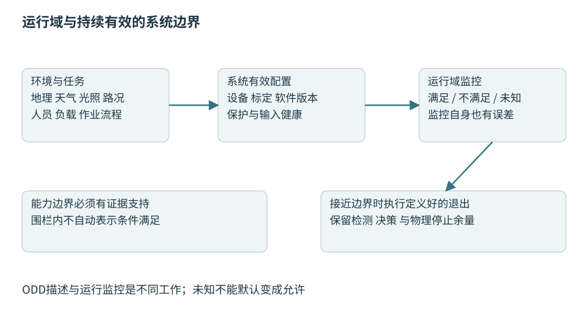
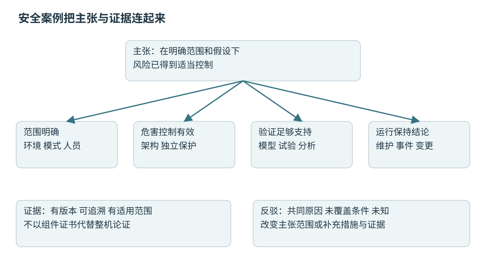

# 第五十二章 自主系统的可靠性与安全论证

自主系统能够感知、估计、规划和控制，并不意味着它已经适合在真实人群、道路或工厂中运行。**可靠性**关注在规定条件和时间内完成规定功能的能力，**安全**关注风险是否得到适当控制，**安全论证**则把关于安全的主张、成立条件、推理和证据组织成可审查的整体。它不是最后阶段补写的一份“没有发现问题”报告。

前四章建立了传感器、软件平台、SLAM和闭环行为。本章把它们放进系统边界与生命周期：什么环境允许运行，哪些失效可能造成伤害，哪些保护真正独立，测试支持了什么结论，变更后哪些证据不再有效。核心原则是把未知和前提公开到工程接口与决策中，而不是用更多成功演示掩盖证据缺口。

本章引用明确版本的标准公开说明与一手资料，用于理解范围和方法；没有购买或逐条审阅完整付费标准，没有进行合规认证、现场风险评估或法律适用性判断。具体产品应由具备相应能力的安全、领域和合规人员依据完整适用文件审查。所有案例和数值均为教学构造，没有运行真实机器人或执行危险试验。

## 52.1 自动驾驶ODD场景和系统边界

### 52.1.1 先定义系统负责什么 再讨论它是否安全

**系统边界**说明哪些硬件、软件、人员、基础设施和外部服务属于分析对象，哪些作为外部依赖。移动机器人可能依赖工厂门禁、无线网络和人工装卸；自动驾驶系统可能依赖车辆执行器、地图更新和维护。把它们画在图外不意味着可以忽略它们的失效。

边界还包括运行模式。正常自动任务、手动操作、维护、运输、充电、故障恢复与报废阶段的危险不同。只分析自动运行而忽略维护时的意外重新使能，可能遗漏真正高风险场景。一个功能在正常模式受保护，不代表调试接口也受同样约束。

责任分配应具体到输入、输出与承诺。云端发任务是否保证目标区域已清空，机器人是否验证此信息，人员何时可以进入，失联后谁负责处置，都需要明确。模糊的“由操作员注意安全”很难形成可验证要求。

系统分解也要维护端到端关系。传感器保证输出有效状态，估计器保证识别数据过期，控制器保证在限定时延内切换行为，硬件保证执行某种停止动作，这些承诺之间如果存在空隙，单个模块的测试通过也不能填补。

### 52.1.2 ODD描述系统被设计为能够工作的条件

**运行设计域**（Operational Design Domain，ODD）是系统设计所覆盖的特定运行条件集合。对自动驾驶，它可能包括道路类型、地理区域、速度、天气、照明、交通参与者和基础设施等条件。ISO34503:2023主要面向3级与4级自动驾驶系统，规定ODD分类与描述格式；其范围不包含ODD属性的基本测试程序及运行监控要求。[S1]

ODD不是一句“园区内低速”或一块地理围栏。园区内可能有坡道、施工、儿童、倒车货车、强反光地面与积水。需要把影响能力的条件写成可理解、可验证的范围，同时说明条件之间的组合限制。

范围必须与证据匹配。只在白天干燥地面验证过的系统，不能因为同一地点夜间仍在围栏内就自动扩大使用。反过来，过度笼统的限制也可能无法执行，例如“不适合恶劣天气”没有说明怎么识别、何时退出以及由谁判断。

ODD是能力边界，不是承诺域内绝不发生事故，也不是把域外所有后果推给用户的声明。系统仍需考虑边界接近、意外越界、传感无法判断条件以及合理可预见的使用偏差，并设计相应风险控制。

### 52.1.3 运行域监控本身也有误差与延迟

ODD文件描述允许条件，运行时监控要判断当前是否仍满足。天气、能见度、路面附着和施工状态不一定可直接可靠测得；不同传感器可能给出矛盾信号。监控应区分“条件满足”“条件不满足”和“无法确认”，不能把未知默认当成允许。

边界变化需要提前量。系统察觉前方进入不支持道路后，仍需要时间完成减速、停车或其他退出行为。若只有到边界那一刻才判定越界，实际已经来不及。监控范围应覆盖感知、决策与物理停止能力，而不仅是当前车体所在点。

误报与漏报有不同后果。频繁误报会影响可用性并可能促使人员绕过保护，漏报则可能让系统在没有证据支持的条件下继续工作。阈值选择应依据风险与测量不确定度，而不是只调到演示过程不打断。

监控还可能依赖与主功能相同的失败来源。相机被强光遮蔽时，主感知与“能见度检测”若使用同一未校验图像，可能同时过度自信。应分析这种共同原因，必要时引入不同证据或采用保守退出条件。

### 52.1.4 动态驾驶任务与后备行为需要明确承担者

自动化等级描述功能与责任划分，不是一般意义上的质量或安全分数。系统执行哪些动态驾驶任务，何时需要人接管，失效后谁承担后备任务，应结合具体功能定义。不能用“支持自动驾驶”概括差异很大的系统。

**后备行为**用于在功能不可继续时降低风险，目标可能是达到某种最小风险状态，但这不意味着总能在任何位置立即安全停车。高速道路、狭窄通道、交叉口或坡道上的停止方式具有不同后果，需要系统能力与场景分析。

若设计依赖人接管，就必须考虑人是否在场、是否保持必要注意、是否能理解提示以及是否有足够反应时间。不能因为界面显示了一个警告，就假定驾驶者已形成正确情境认识。远程操作也受通信延迟、视野和并发任务限制。

NHTSA于2017年发布的ADS2.0自愿指南将ODD、后备、验证和人机交互作为需要讨论的安全设计主题。[S2]本章引用它作为历史方法框架，不把它当作2026年任意地区的完整法律要求。

### 52.1.5 人是系统交互对象 不能只当作障碍点

人在机器人附近可能弯腰、携带物体、突然改变方向，也可能不了解设备工作方式。人的脆弱性、可见性和可预测性与静态箱子不同。风险分析需要考虑身体部位、夹挤空间、逃离条件和设备能量，而不仅是几何距离。

人机界面要表达当前模式、能力限制、即将采取的动作和必要操作。相似指示灯在不同模式中具有不同含义，容易造成误解。报警过多、默认确认和长期无意义提示也会削弱实际注意力，界面设计本身需要验证。

合理可预见的误用与蓄意绕过不是同一概念。维护人员可能为了够到设备自然地进入某区域，普通使用者可能误解自动恢复；这些不应简单以“用户没读说明书”排除。应优先通过设计和保护减少风险，再以信息与培训补充。

人与设备交接的边界尤其重要。机器人把重物放到工位后，是否已经释放、夹具是否锁定、人员是否可以进入，都需要明确确认。仅凭任务软件显示“完成”不足以说明机械能量已进入可接近状态。

### 52.1.6 场地和维护条件是安全假设的一部分

地面摩擦、坡度、通道宽度、照明、无线覆盖和隔离设施都可能是设计假设。场地改变后，即使机器人软件没有更新，原风险控制也可能失效。运营团队需要知道哪些变化必须报告和重新验证，而不能把安全视为研发交付后不再改变的属性。

传感器清洁、轮胎磨损、制动性能、机械紧固与标定状态同样影响长期能力。维护周期和检查方式应有依据，设备健康状态应连接运行许可。若传感器污染已经超出有效范围，继续用算法置信度掩盖物理问题并不合理。

设施措施可以降低风险，例如隔离人车区域或限制交叉口，但它们也可能被临时移动、损坏或绕过。论证应说明设施状态如何保持，以及失效时机器人如何发现或限制后果。图纸上的护栏不等于现场一直存在的护栏。

深入追问：“软件没改，为什么还要重新评估？”因为系统包含环境、人、硬件与维护条件。负载变重、地面变滑、流程变更或新人员进入，都可能改变危害暴露和停止能力，原证据不再覆盖当前用途。

### 52.1.7 发布条件把能力边界变成可执行决定

发布决定需要说明允许哪些设备配置、哪些场地、哪些模式，以及仍有哪些限制。它应连接安全要求和证据，而不是只依据功能列表、平均成功率或项目截止日期。未关闭的问题要有负责人和处理结果，不能靠“现场再观察”无限推迟关键验证。

可以把运行许可视为一组持续成立的条件：硬件身份匹配、标定有效、保护自检通过、必要输入可用、环境在范围内。任一条件变化，都需要按设计触发重新确认或降级。条件应具体到能够被人员或系统检查，而不是抽象的“状态良好”。

发布记录应包含版本、适用范围、证据快照和批准责任。后续更新不能只复用旧版“已通过安全检查”标签。若证据来源或假设改变，结论必须重新审查；这种可追溯性对事故分析和长期维护同样重要。

图 52-1 运行域是持续受到检查的能力范围。无法确认条件时不能默认为满足，退出行为也需要足够物理时间与空间。来源：本章原创。

## 52.2 Safety与Security 风险分析与需求追踪

### 52.2.1 高可靠性不自动等于低风险

一个系统可以非常可靠地执行错误要求，例如每次都按错误单位控制速度；也可以在故障时停止服务而保持某种安全状态。因此可靠性、可用性与安全之间有关联，却不能互相替代。安全目标应从可能的伤害与危险状态出发，而不是仅从软件崩溃率出发。

**Safety**通常关注免于不可接受伤害的风险控制，**Security**关注对恶意或未授权行为的保护。攻击可能造成危险运动，安全保护的失效也可能扩大攻击后果。两者需要协调，但分析的问题、假设与证据并不完全相同。

**危险源**可以是机械运动、储能、电气、热或其他潜在伤害来源；**危险情境**将危险源与人或其他受保护对象的暴露联系起来；风险还涉及发生可能性与后果。把“软件有bug”直接写成危害，往往缺少从故障到伤害的因果过程。

一个有效描述可以是“在人员位于夹挤区域时设备产生非预期运动”，再分析哪些控制、感知或操作条件会导致它。这样才能导出可验证约束，而不只是提出泛泛的“提高代码质量”。

### 52.2.2 风险分析从用途和生命周期开始

风险分析需要先列出预期用途、工作模式、人员与环境，再识别危害及其触发条件。ISO12100:2010公开说明将风险评估与风险降低放在机械生命周期中，并强调相应记录和验证。[S3]本章借其范围解释方法，不复述完整规范条款。

后果严重性、暴露条件、避免或控制伤害的能力等因素，在不同标准体系中有不同定义和分级。不能把几个随意打分的数字相乘，就声称获得客观事故概率。评分可帮助排序，但必须保留依据、分歧与不确定度。

风险降低应优先考虑消除危险或本质设计改变，再考虑保护措施与使用信息。例如限制可释放能量、避免形成夹点，通常比仅增加一条报警更直接。具体层级与适用要求需按行业文件审查，不能让使用说明承担所有设计责任。

风险分析不是一次会议结束的静态表格。新故障、现场事件、设计变更和用途扩大都可能触发更新。每项风险控制需要有人负责、能被验证，并说明残余风险如何处理；“已关注”不是关闭状态。

### 52.2.3 FMEA从局部失效向系统后果追踪

**失效模式与影响分析**（FMEA）从组件或功能的可能失效出发，分析局部影响、上层影响、检测手段与控制措施；NASA的软件安全指南附录D也从这种自底向上的传播关系介绍方法。[S15]例如编码器冻结、时间戳错误、驱动器拒绝命令和地图损坏，虽然都可能影响运动，却有不同传播路径。

分析应包含失效方式而不只是“坏了”。传感器可能无输出、固定输出、缓慢偏移、间歇跳变或输出时间错误；其中固定输出常比完全断线更难发现。检测措施也要说明覆盖哪些模式和检测时间，不能只填“有看门狗”。

FMEA适合系统化检查局部失效，但组合故障、复杂时序和多个正常组件的不安全交互可能不易完整表达。需要与其他分析方法结合，而不是让一张组件清单代替系统危害分析。

风险优先数若用于排序，应谨慎解释。同一个乘积可以来自完全不同严重性和发生条件，不能让低发生评分掩盖严重后果。评审应关注高后果、检测盲区和共同原因，而不是只按一个总分机械排序。

### 52.2.4 故障树从危险结果反推组合原因

**故障树分析**（FTA）从一个顶事件出发，用逻辑关系分解导致它的事件组合；NASA的软件安全指南附录C将其说明为自顶向下的原因分析。[S15]例如“需要停止时设备仍保持危险运动”可能与未检测、未发出停止、命令未到达或执行机构未实现停止有关。顶事件与时间范围必须具体，否则树会变成模糊故障清单。

逻辑门表达组合关系，但事件之间的独立性不能随意假定。两个制动通道共享电源、同一软件配置或同一机械连接时，简单把失效概率相乘会高估冗余收益。共同原因需要显式进入分析，并有证据说明隔离是否有效。

静态故障树对某些顺序相关事件表达有限。先失去传感再进入某模式，与先进入模式再失去传感可能有不同后果；恢复、维修与潜伏故障也影响时间关系。必要时使用适合动态行为的模型，不要把所有时序都压成无时间逻辑。

定量分析需要可信失效率、诊断覆盖、测试间隔与使用条件。缺少数据时可以进行定性分析和敏感性讨论，但不能填入任意行业平均数字后输出精确到小数点的系统风险。计算精度不能弥补输入证据不足。

一个简化冗余例子说明独立假设的重要性：两条通路各自发生某类失效的概率都是p，只有在独立且顶事件确实要求两者同时失效时，相关联合概率才可写成p²。如果两者都因同一供电故障失效，这个共同事件的概率需要单独计入，不能被平方“稀释”。实际树还要区分安全失效与危险失效、检测与未检测，以及分析期间的维修行为。

### 52.2.5 STPA关注不安全控制与反馈结构

**系统理论过程分析**（STPA）从损失、系统危害与控制结构出发，分析控制动作在何种上下文中可能不安全，包括未提供、提供了不应提供的动作、时机错误或持续时间不合适等方向。MIT的2018年STPA Handbook是一手方法参照。[S4]

它特别提醒工程师：事故不一定要求某个组件先损坏。每个模块都按自己的局部规则工作，但反馈延迟、错误过程模型或责任不清，仍可能使系统进入危险状态。例如调度系统认为通道已清空，机器人相信过期状态，现场门禁又认为机器人已停止。

控制结构图应包含人、软件、执行器与反馈，而不是只有数据流。对每条控制动作说明授权者、被控对象、状态认知和信息来源。缺失反馈会使控制者无法知道命令是否实际生效，错误反馈则可能造成更危险的自信。

STPA不自动替代FMEA、FTA或完整标准流程。方法擅长观察不同层面的因果问题，最终都要转化成可实现、可验证的约束与证据。选择分析组合应依据系统复杂性、风险和团队能力。

### 52.2.6 网络安全威胁要连接物理后果

攻击面可能包括远程任务接口、维护口、无线网络、更新服务、传感数据和供应链。威胁分析需要识别资产、入口、信任边界和攻击者能力，再评估未授权行为如何影响运动、隐私或可用性。只列密码算法名称并不是完整威胁模型。

ISO/SAE21434:2021针对道路车辆网络安全工程，公开说明覆盖相关生命周期风险管理。[S5]它不能自动套用成所有机器人产品的唯一要求，也不意味着认证了某个通信组件就完成整车网络安全。应用、配置、密钥管理与运维仍在范围内。

安全更新可以修复漏洞，也可能引入实时或行为变化；为了可用性允许认证失败后自动降级到无认证，可能让攻击者故意触发这条路径。Security策略与Safety后备行为需要共同审查，避免一方的恢复措施破坏另一方的保护。

本章讨论防护设计与风险关系，不提供针对真实系统的攻击操作。测试应在授权范围内进行，保留目标、方法和停止条件，并避免把渗透测试流量直接引入带真实机械运动的生产环境。

### 52.2.7 需求追踪把分析连接到实现与证据

**需求追踪**记录危害、风险控制、安全需求、架构组件、实现与验证证据之间的关系。一项“失去有效定位后限制运动”的要求，应说明如何判定失效、允许反应时间、目标状态、依赖输入和恢复条件，而不只给出一句口号。

教学例子可以分解为：估计器报告数据年龄与退化状态，监督器在约定条件下撤销高层运动许可，控制层进入已验证的受限行为，硬件保护覆盖软件失效。具体时间值必须由停止能力与风险分析推导，本书不给所有机器人统一150ms之类阈值。

验证用例应能回到需求，也应检查需求是否完整。每条需求都有一个测试，并不说明所有危害都已有需求；每个测试都通过，也不说明测试判定条件正确。双向追踪帮助发现遗漏，但不能代替专业审查。

版本变化后，这张关系网用于影响分析。传感器滤波改变可能影响检测时间，地图格式变化可能影响有效性判断，日志增加可能影响实时性。只按修改文件名选择回归测试，容易漏掉跨模块后果。

## 52.3 功能安全 SOTIF验证及标准适用性

### 52.3.1 功能安全关注安全功能是否按要求起作用

**功能安全**涉及依赖系统正确执行安全相关功能而实现的风险控制。它关注的不只是正常功能正确，还包括失效如何被防止、检测和处理。IEC61508-1:2010的公开范围说明针对电气、电子和可编程电子系统承担安全功能时需要考虑的方面。[S6]

安全功能应具体描述输入条件、需要实现的动作、响应时间、适用模式与失效后果。例如“某种危险条件下阻止继续产生驱动力”比“系统要安全”更可设计，但仍需要说明阻止驱动力后是否会滑行、下落或失去保持能力。

硬件随机失效与系统性错误需要不同措施。随机失效可以结合器件数据、架构、诊断与维护进行分析；需求错误、设计错误或错误配置不会因为多运行几次就自然消失。复制两份同样软件也可能复制同一个系统性问题。

功能安全不是只购买安全PLC或安全传感器。组件的能力需要在规定使用条件下被正确集成，包括电源、通信、参数、安装与维护。一个具有某种声明的部件被用在范围之外，不能把声明直接传递给整个产品。

### 52.3.2 ISO26262的道路车辆范围不能无限外推

ISO26262系列所述范围包括量产道路车辆中安全相关E/E系统，排除轻便摩托车（moped），也不覆盖某些特种车辆独有的E/E系统；它并不是一般机械产品的通用安全规范。本文以2018年第二版的术语与概念阶段公开说明为参照，概念阶段包括项目定义、危害分析与风险评估以及功能安全概念等内容，可参阅[S7]与[S14]。具体项目仍需读取适用部分的完整规范。

汽车安全完整性等级ASIL与危害情境、严重性、暴露和可控性等评价有关，不是按代码行数、CPU型号或使用何种语言直接决定。一个软件模块被分配何种要求，来自系统分析和分配，而不是开发者给库贴上一个等级标签。

ASIL也不能直接换算成“每小时发生事故概率”，更不能与其他领域的安全完整性等级SIL或性能等级PL只按字母数字排序。不同体系的对象、模式、指标和流程各有定义。跨领域借鉴方法有价值，但合规结论必须依据本领域适用标准。

面试追问：“C++用了静态分析和单元测试，能否说符合ISO26262？”不能。它们可能提供部分软件证据，完整生命周期、需求、架构、独立审查、工具与配置管理等还需按具体适用要求处理。测试工具报告不是整车合规证书。

### 52.3.3 SOTIF处理功能不足导致的风险

即使所有部件按设计工作，系统仍可能因感知或决策能力不足产生危险。低对比度障碍未被识别、罕见反射造成误检、模型在未覆盖场景中表现不佳，都可能不需要传统意义上的硬件故障。**预期功能安全**（SOTIF）关注这类功能不足相关风险。

ISO21448:2022面向量产道路车辆（不含轻便摩托车）中依赖复杂传感与处理算法、且情境感知对安全至关重要的预期功能。其公开说明涉及规格不足或实现性能不足，以及设计、验证、确认和运行阶段活动；ISO26262覆盖的故障与网络安全威胁被排除在其范围之外。[S8]这些活动需要协调，不能把一种分析的结论当作另一种风险已被覆盖。

SOTIF工作需要寻找触发条件与未知不安全场景，而不是仅证明已知场景表现良好。可以从边界分析、现场事件、参数变化和对抗性场景搜索获得候选，再判断机制、适用范围和风险降低措施。发现一个失败不是只补一张训练图，而要理解为什么失败。

“未知”不能被直接量化成零。减少未知危险需要持续收集与审查证据，同时限制使用范围。域内仍存在不确定时，可以通过设计改变、能力约束或独立保护降低后果；不能只用模型平均准确率作为全部SOTIF结论。

### 52.3.4 工业机器人与无人搬运设备需要各自范围判断

工业机械臂、无人搬运车辆和面向公众的服务机器人，工作场景与危害不同。ISO10218-1:2025公开范围针对工业机器人本体，并与系统集成部分区分；由此不能把工业机器人本体的适用范围直接扩展为所有移动或公众场景要求。[S9]

ISO3691-4:2023针对无人驾驶工业车辆及其系统，官方说明强调运行区域条件，并列出不覆盖的特定用途与危害。[S10]核验时官方页还列有后续DIS草案，草案不能当成已发布替代版本。项目需要跟踪正式版本和当地适用性。

移动底盘搭载机械臂可能同时引入移动、操作、负载与人员接近风险。分别采用两个组件的合格声明，不代表它们组合后的新夹点、重心变化和停止行为已经覆盖。集成者需要分析相互作用和整体运行模式。

标准选择应从产品定义、预期用途、市场与风险出发，由有能力人员确认。不能因为某标准名字含“机器人”就直接套用，也不能只选要求最容易满足的一份。教材提供范围辨识入口，不替代产品合规分析。

### 52.3.5 安全完整性需要架构 诊断与生命周期共同支持

安全功能的可信度来自多个层面：器件与架构、失效检测、共同原因控制、软件过程、验证、维护和配置。冗余能提供额外通路，但如果共享同一个失效电源或同一错误测量，它的收益会大幅降低。独立性要针对具体失效机制证明。

**诊断覆盖**不是“有诊断代码”的比例，而是对相关危险失效的检测能力，且需要在允许时间内发现。传感器断线可检测，不代表缓慢漂移可检测；启动自检通过，不代表运行中所有失效都能被发现。潜伏故障与检查间隔会影响系统在下一次需求到来时的状态。

ISO13849-1:2023公开说明针对执行安全功能的控制系统安全相关部分，包括软件；它覆盖高要求及连续运行模式，不适用于低要求模式，也不直接规定具体应用应采用哪些安全功能或所需性能等级PL_r。[S11]具体PL、类别、诊断与共因要求应依据完整文件和实际架构评价，不能只依据一个器件宣传页计算。

定期检查或验证性测试也需要安全设计。测试本身可能触发运动、切换功率或暂时降低保护，不能随意在生产设备上执行。本章不提供现场测试步骤；实际流程应有授权、隔离、合格人员和恢复确认。

### 52.3.6 验证与确认回答不同问题

**验证**检查实现是否满足规定要求，**确认**检查系统是否适合预期用途与真实需求。软件精确实现了一个错误或不完整要求，验证可能通过而确认仍失败。两者都需要从系统边界和风险出发选择证据，不能只依赖测试数量。

单元测试适合局部逻辑与边界条件，集成测试检查接口与时序，软件在环（software-in-the-loop，也缩写为SIL，此处不是安全完整性等级）可覆盖软件闭环，硬件在环（HIL）可覆盖部分实际计算与电气接口，现场受控试验观察真实物理机制。它们的覆盖范围不同，不能按“越接近实物越能替代前面所有测试”简单排列。

独立审查可以发现作者未意识到的假设和遗漏，但独立程度应符合风险与适用要求。让同一人使用同一模型重复检查，并不自动产生独立证据。测试判定器也可能错误，关键结果应考虑不同证据方式交叉核对。

证据要保留失败与限制。模型不覆盖某种接触，HIL没有真实制动器，现场只测试干地，这些都应进入结论范围。将“不适用”“未测试”和“通过”混成一个绿色状态，会使后续决策丢失关键边界。

### 52.3.7 学习系统需要数据和运行域层面的证据

学习模型的行为来自代码、模型结构、权重与训练数据共同作用。更新权重、修改预处理或更换传感器，都可能改变系统能力。传统软件分支覆盖不能说明模型在所有重要场景都表现合格，数据分布、标注质量和失效机制同样重要。

NIST AI RMF1.0于2023年发布，提供治理、情境识别、测量和管理等风险活动框架。[S12]它是通用、自愿的风险管理框架，不是机器人机械安全认证，也不能替代领域标准和物理验证。

模型置信度需要校准和适用范围。对分布外输入给出高分并不少见，简单设置置信阈值并不能证明未知场景会被识别。可以结合输入健康、几何一致性、独立监控和能力限制，但各措施仍要验证其盲区和共同原因。

对于端到端学习控制，解释不应停在“神经网络输出动作”。需要明确动作空间、硬限制、状态有效性、延迟、回退策略和更新管理。把输出先送进一个约束过滤器有帮助，但若过滤器模型遗漏动态障碍或制动限制，整体仍可能不安全。

## 52.4 仿真覆盖 现场数据 变更影响和安全案例

### 52.4.1 场景覆盖必须有可解释的抽样依据

**场景**包含环境、参与者、初始状态、事件与时间关系。一个“行人横穿”标签还不足以覆盖速度、遮挡、照明、距离、行为和路面条件的变化。测试设计应先识别与危害相关的参数，再选择边界、代表值和关键组合。

均匀抽样不一定有效。危险事件可能位于参数空间的窄区域，如遮挡刚解除而制动余量刚不足的组合；只增加普通场景数量可能很少触及它。基于风险的搜索和边界探索可以提高发现问题效率，但不能未经分布修正就用于直接估计真实发生概率。

覆盖可以包括需求覆盖、故障模式覆盖、参数覆盖、交互覆盖与运行域覆盖，它们回答不同问题。代码覆盖率高，只说明执行过相应代码结构；场景标签齐全，也不说明关键数值边界已经测试。报告应分别说明，避免一个总百分比掩盖空白。

教学矩阵可以把低照度、湿滑与遮挡组合成几类关键情境，并记录每类对应的感知、规划、制动风险。没有证据的一格应标成缺口，而不是默认沿用相邻格子的通过结果。场景组合的合理性需要领域知识支持。

### 52.4.2 仿真可信度必须针对所支持的结论建立

仿真可以高效覆盖稀有和危险条件，避免在真实环境中不必要地产生风险。但传感、动力学、交通参与者和执行器模型的误差决定了结果能支持什么。场景画面逼真、运行速度快或重复次数多，都不是模型有效性的充分证据。

应把模型验证与被测系统验证分开。先说明模型在某些量和工况下与现实证据一致，再使用它评价相应需求。模拟雷达与真实雷达在雨雾下差异明显时，仿真中的感知成功不能证明真实雨雾能力；可以用于接口或逻辑测试，但结论范围不同。

参数随机化有助于观察敏感性，却需要可信范围和相关关系。摩擦、温度、电量与负载可能相关，独立随机会产生不现实组合，也可能遗漏现实共同恶化。应保留参数来源、模型版本和误差范围，而不把随机种子数量当作真实覆盖。

SIL、HIL和现场数据应形成互补证据。HIL使用真实控制计算硬件也不自动验证实际制动、机械断裂或人的反应。仿真发现问题后可以改进设计，但从仿真通过到允许真实设备运行之间仍有独立的风险评估与授权边界。

### 52.4.3 零事故样本不能证明事故概率为零

统计结论必须说明事件定义、样本单位、分布和相关性。连续视频中的一百万帧高度相关，不能直接当成一百万次独立危险场景。重复同一条路线也可能只验证同一组环境假设，而没有覆盖新的失效机制。

一个简化推导：若N次试验独立、同分布，每次事件概率为p，观察到零次事件的概率是(1−p)ᴺ。令其等于0.05，得到事件概率的单侧95%上置信界p_upper=1−0.05^(1/N)，当N足够大时近似为−ln(0.05)/N，约为3/N。这是特定伯努利模型下的统计界，不是自主系统通用安全证明。

例如一万次满足上述条件的试验零事件，上界约为0.0003每次试验；它不能未经换算变成“每小时”或“每公里”风险，也不能外推到未覆盖场景。若样本相关、选择有偏或事件检测不完整，该计算本身就不适用。

安全证据因此不能只依赖无事故里程。需要结合危害分析、设计约束、故障分析、模型验证、关键场景和运行监控。统计量可以支持某一主张，但应把它的假设写进同一论证链。

### 52.4.4 现场事件调查应保留原因而非只消除报警

现场异常、近失事件和保护触发能揭示测试未覆盖的条件。记录需要包括设备与软件版本、标定、环境、操作模式、输入健康、控制命令和实际反馈。只有一段视频，可能无法重建时间因果；只有软件日志，也可能看不到现场遮挡或人员行为。

应区分直接触发与根本原因。设备因超时停止，直接触发是超时，根因可能是网络拥塞、错误重试、磁盘阻塞或热降频。把超时阈值调大可能消除报警，却增加停止延迟，必须重新检查风险和约束。

调查应尽量保护原始证据、时间关联和访问权限。传感日志可能包含个人与场所信息，共享和保留要符合授权与相关要求。不能为方便外包分析就未经许可上传完整现场数据；也不能为了减少存储随意删除关键失败片段。

修复后要验证机制是否被解释，并寻找同类影响范围。某一台设备的异常可能来自所有同型号设备共享配置，也可能是独有硬件损坏。结论应基于证据，而不是过早归因于“偶发”“操作失误”或“环境太复杂”。

### 52.4.5 变更影响分析沿证据依赖传播

自主系统的变更包括代码、模型权重、编译器、库、中间件、标定、地图、固件、传感器与运行域。哪怕只改了日志，也可能改变实时路径；哪怕只清洗训练数据，也可能改变某些少数场景的识别能力。因此变更规模不能用代码行数衡量。

影响分析应从变更触及的假设与接口出发，追踪到需求、危害和证据。换镜头影响视野和成像模型，进而影响感知范围、ODD监控、规划余量与停止策略；更换电机影响转矩与热特性，可能使旧控制和制动证据失效。

回归验证要包含预期改进和可能退化。只测试原来失败的场景，可能让修复在其他模式引入问题。可保留代表性基线、边界场景、故障注入与资源压力测试，并明确哪些旧证据仍有效、哪些必须重做。

回滚也需要验证。新版本改变配置格式、地图或设备状态后，旧二进制可能不能直接恢复。发布过程应考虑数据兼容、可逆性、设备实际模式和现场确认，避免把“文件替换成功”当成系统已经回到受支持状态。

### 52.4.6 安全案例连接主张 推理 证据与反驳

**安全案例**（safety case）是一套结构化论证，说明在明确范围与假设下，为什么认为风险已得到充分控制。它应包含主张、论证逻辑、证据、适用范围和未解决问题，而不是把测试报告压缩成一份文件夹。UL4600第三版于2023年发布的官方说明强调自主产品安全评估与安全案例框架。[S13]

顶层主张可以逐层分解：运行范围明确，重要危害已识别，风险控制已实现，验证覆盖足以支持，运行和变更管理能保持结论。每一分支都需要可审查证据，且说明证据如何支持主张。一个传感器证书不能支持整条分支的所有结论。

好的论证还主动处理反驳：如果共同电源失效怎么办，如果真值有偏怎么办，如果模型遇到未覆盖场景怎么办。对无法排除的问题，应限制主张、增加措施或保留未关闭状态。把反例从报告中删掉会使文档更漂亮，却降低决策可信度。

安全案例需要随系统演进维护。主张、假设与证据都有版本和有效范围，变更后要检查哪些连接断开。它的价值在于让决策者理解“为什么可以在这里这样运行”，而不是提供一个永久通用的“安全”印章。

图 52-2 安全论证不是测试数量的汇总。每条证据必须支持具体主张，未验证假设与反例应改变结论范围或下一步措施。来源：本章原创。

以“失去有效感知后能在剩余空间内限制危险运动”为一条教学主张，支持证据至少涉及感知失效检测时延、监督与通信尾时延、制动能力及其工况范围、当前可用空间估计，以及软件失效时的硬件保护。只提供检测准确率，缺少后半条物理链；只提供干燥平地停止距离，又缺少其他运行条件。把证据按这条因果链组织，能直接看出缺口应由哪项设计或验证补足。

证据之间还要避免循环论证。若制动模型用同一组试验拟合，再用这组试验声称模型完全验证，独立支持不足；若安全监控的正确性仅由被监控算法的输出判定，也可能把共同错误重复计算为两份证据。应明确数据、模型与判定器的独立来源。

### 52.4.7 综合案例与深入面试追问

设教学仓储机器人计划从封闭通道扩展到人车混行区域。软件代码可能完全不变，但人员暴露、遮挡、交互、停止空间和操作流程已经改变。合理结论不是“原系统跑了很久所以直接上线”，而是重新定义使用范围，更新危害与保护要求，并确定需要补充的证据和现场措施。

**追问：“用了符合标准的雷达，整台机器人是不是就符合标准？”** 不是。组件声明有适用条件和范围，安装、配置、控制器、执行器、共同原因和运营环境都可能改变整体能力。需要系统级分配、集成与验证。

**追问：“功能安全通过后还需要SOTIF吗？”** 两者关注的失效来源不同。部件按设计工作但能力不足，仍可能造成危险；同样，SOTIF分析也不能替代硬件故障与网络攻击处理。应按产品范围协调相应活动。

**追问：“测试一百万次没有失败，为什么还不能承诺绝对安全？”** 因为样本分布、相关性、检测能力和模型覆盖有限，零事件也只是支持特定条件下的统计界。未出现的故障机制不会因重复普通场景自动得到验证。

**追问：“如果无法完全证明安全，是否什么都不能部署？”** 工程决策通常依据明确范围内的风险降低与充分证据，而不是无限世界中的绝对无风险。关键是由适当责任方按适用要求作出可审查决定，公开限制、持续监控并控制变更，不能把无法证明绝对安全当成忽略证据的理由。

**追问：“高级工程师在安全评审中最应坚持什么？”** 坚持主张与证据匹配，明确假设与责任，区分未测试和通过，愿意在重要前提失效时收紧范围。复杂算法、漂亮地图和高成功率都很有价值，但只有放进完整系统边界，才能支持真实部署决定。

## 本章资料与核验范围

核验日期2026-10-03。标准版本用于准确说明本文参照，不能替代项目确认现行版本、完整条款与当地适用要求。ISO/IEC条目实际读取的是官方公开范围说明，并非付费标准全文；UL条目为官方第三版发布说明。没有作出产品认证或法规合规结论。

- [S1] ISO34503:2023，ODD分类与描述范围，明确不覆盖属性监控要求
- [S2] NHTSA，Automated Driving Systems2.0: A Vision for Safety，2017年自愿指南
- [S3] ISO12100:2010，机械安全风险评估与风险降低公开说明
- [S4] Leveson与Thomas，STPA Handbook，2018，MIT公开原文
- [S5] ISO/SAE21434:2021，道路车辆网络安全工程公开说明
- [S6] IEC61508-1:2010，安全相关E/E/PE系统通用要求公开说明
- [S7] ISO26262-3:2018，概念阶段公开说明
- [S8] ISO21448:2022，预期功能安全公开说明
- [S9] ISO10218-1:2025，工业机器人本体安全范围
- [S10] ISO3691-4:2023，无人驾驶工业车辆及其系统；核验日后续版本仍标DIS
- [S11] ISO13849-1:2023，控制系统安全相关部分公开说明
- [S12] NIST AI100-1，AI Risk Management Framework1.0，2023-01
- [S13] UL Solutions，UL4600 Edition3发布与安全案例框架说明，2023-07-18
- [S14] ISO26262-1:2018，范围与术语公开说明
- [S15] NASA-GB-8719.13，Software Safety Guidebook，2004年，附录C与D方法说明

[S1]: https://www.iso.org/standard/78952.html
[S2]: https://www.nhtsa.gov/sites/nhtsa.gov/files/documents/13069a-ads2.0_090617_v9a_tag.pdf
[S3]: https://www.iso.org/standard/51528.html
[S4]: https://psas.scripts.mit.edu/home/get_file.php?name=STPA_handbook.pdf
[S5]: https://www.iso.org/standard/70918.html
[S6]: https://webstore.iec.ch/en/publication/5515
[S7]: https://www.iso.org/standard/68385.html
[S8]: https://www.iso.org/standard/77490.html
[S9]: https://www.iso.org/standard/73933.html
[S10]: https://www.iso.org/standard/83545.html
[S11]: https://www.iso.org/standard/73481.html
[S12]: https://nvlpubs.nist.gov/nistpubs/ai/NIST.AI.100-1.pdf
[S13]: https://www.ul.com/news/ul-4600-edition-3-updates-incorporate-autonomous-trucking

[S14]: https://www.iso.org/standard/68383.html

[S15]: https://standards.nasa.gov/sites/default/files/standards/NASA/Baseline/0/nasa-gb-871913.pdf
