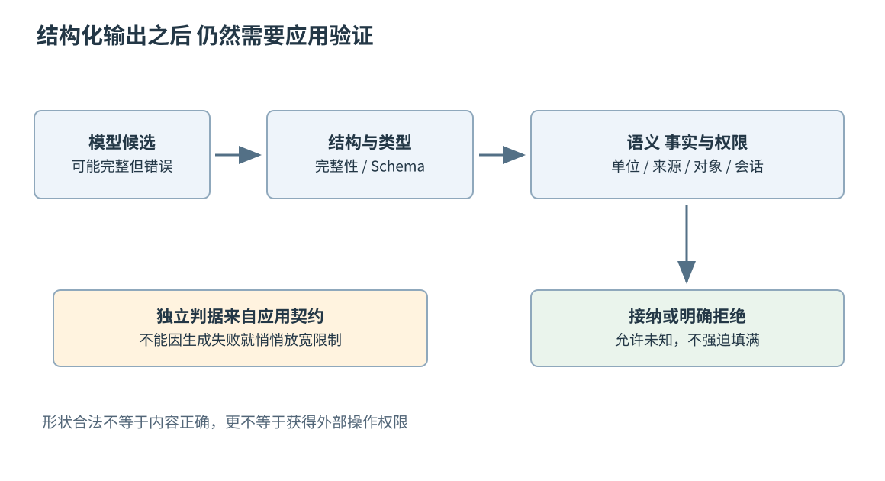
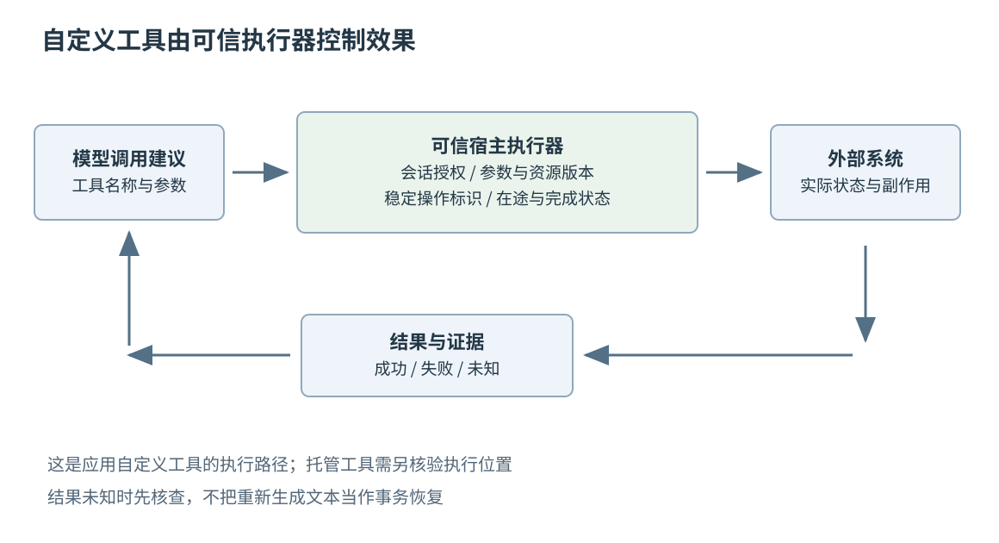
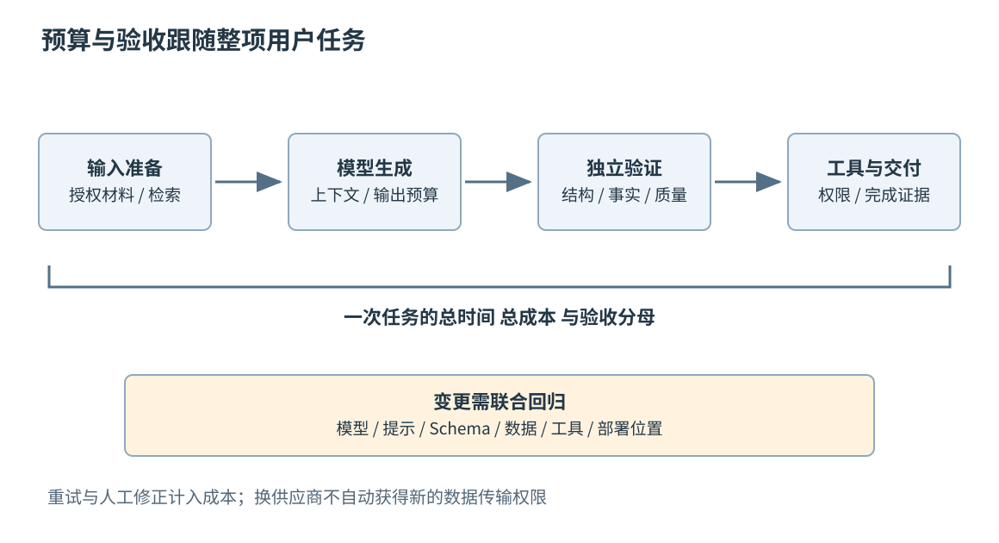

# 第五十三章 模型 API 与 AI 应用边界

大型语言模型（Large Language Model，LLM）可以根据输入上下文生成文本、结构化内容或工具调用建议。模型 API 把这种能力提供给应用，但应用真正交付的不是一段模型输出，而是一条满足用户约束的工作路径：输入如何准备，结果如何验证，权限由谁决定，失败后怎样恢复，成本是否可承担。

一个系统能够回答问题，与能够可靠地改变外部状态，是不同层次的能力。生成了正确形状的 JSON，不表示其中的设备、收件人或数量正确；说“已经完成”，也不表示外部系统真的产生了预期结果。工程边界应建立在可验证的状态与执行证据上，而不是建立在语言表达的自信程度上。

本章以 OpenAI、Anthropic 和 DeepSeek 在 2026-10-03 可读取的官方资料说明接口机制，不把模型名称、价格、上下文上限或能力清单当作永久结论，也不对供应商作无依据排名。所有结构、数字和流程都是教学构造；没有调用付费模型 API、发送真实用户材料、运行工具动作或执行示例。第五十四章讨论检索，第五十五章讨论可恢复 Agent，第五十六章讨论评测、安全与运营；这里先建立一次模型请求与应用边界的基本契约。

## 53.1 LLM API上下文 Token成本和失败模式

### 53.1.1 模型 服务接口与应用是三种对象

**模型**是产生预测或生成结果的计算能力；**服务接口**规定请求格式、认证、模型选择、流式事件、配额与错误；**应用**承担用户状态、权限、数据、工具和交付。一个模型可以通过不同服务部署，同一服务接口也可能路由到不同模型或运行配置。只记录一个产品名称，通常不足以复现一次行为。

应用需要知道实际请求使用的模型标识、接口版本或端点、生成参数、上下文构造和工具定义。若使用可变别名，供应商更新背后模型后，输出可能改变；若使用固定快照，也仍需处理服务实现、工具及外部数据的变化。版本记录降低不确定性，但不是所有生成结果逐字确定的承诺。

接口兼容也有层次。两个服务都接受相似 messages 字段，不表示支持同样的角色、工具参数、JSON约束、流事件或错误代码。更不表示数据保留、计费、限速与地区可用性相同。迁移时应建立能力和行为适配，不能只替换一个 base URL 后宣布等价。

“API 调用成功”还应与“应用任务成功”分开。服务返回有效响应，可以证明一次请求得到了服务层结果；用户需要的内容可能缺少事实依据、遗漏输入或违反业务规则。第二十三章的独立判据在这里尤其重要：接口返回值只是验收材料的一部分。

### 53.1.2 上下文是这次请求实际看见的信息

**上下文**是模型本次生成时可使用的输入范围，可能包括应用指令、用户输入、历史消息、检索材料和工具结果。历史上某条信息曾经出现，不代表它仍在本次请求中；服务保存了一段会话，也不代表每一项历史内容都按同一种方式进入当前计算。

应用可以显式传入必要历史，也可以使用服务提供的会话或响应关联机制。OpenAI 的会话状态文档分别介绍这些组织方式，并讨论上下文窗口限制。选择服务器保存状态，可以减少客户端组装工作，却同时增加对服务生命周期、保留和恢复语义的依赖。[S1]

上下文构造应围绕当前任务保留权威信息。用户刚更正了设备型号，旧摘要仍写另一型号，就不能让两份信息没有优先关系地并列；一份检索文档已经过期，也不能只因为相似度高就覆盖更新的配置。信息应带来源、时间、适用范围和必要权限，应用还要明确冲突时怎样处理。

长上下文不等于所有细节都能可靠利用。某条约束虽然在输入中，却可能被其他材料淹没；重复粘贴相似记录也会提高成本和歧义。应通过任务评测决定保留、提取、检索或分阶段处理哪些信息，而不是把“全部塞进去”当作唯一可靠办法。

### 53.1.3 Token 是模型计量单位 不是汉字或单词

**Token**是模型使用的离散表示单位，文本会被分词器编码为一个或多个 token。它与字符、字节或自然语言单词没有固定一一对应关系。中文、英文、代码、数字和空白的分布都可能影响数量，不能用一个长期固定的“每字多少token”给所有请求做精确预算。

上下文预算通常需要同时考虑输入与可用输出空间，某些模型还有特定推理或多模态计量规则。工具定义、历史工具结果和应用包装也可能占用输入。应使用目标服务提供的计数或实际用量字段核对，而不是只数用户那一句话。[S1]

输出上限不是目标篇幅。把上限设得很大，不能保证模型一定写满；设得太小，则可能使结构化对象或解释在中途结束。应用需要识别截断原因，将不完整响应与完整但内容不足的响应分开。否则半份 JSON 会被误归类为解析器故障，遗漏段落则可能悄悄被当作成功。

多模态输入还涉及分辨率、采样、音频时长和服务的具体计量方式。本文不提供一个通用于所有模型的图片或音频 token 公式。产品预算应在真实输入分布和所选服务规则下建立，并记录无法提前准确计数的部分。

### 53.1.4 提示词应表达任务 契约和材料角色

**提示词**是给模型的任务描述及相关输入。有效提示不只是一句“你是专家”，而应说明要解决的问题、输出对象、约束、可用证据和无法确定时的处理。角色描述可以提供风格背景，不能替代事实或授权。

可以把输入组织成明确部分：应用稳定规则、用户此次目标、经过授权的材料、输出契约。外部材料应被标为待分析数据，而不是可以改变应用权限的命令。把网页中的一句“忽略所有规则”原样作为资料传入，不应使它获得与应用规则相同的信任地位。

示例也会影响模型理解。若所有示例都给出肯定结论，模型可能倾向于在证据不足时也填出答案；若缺失字段的处理没有演示，就容易把猜测混进结构化结果。应覆盖正常、缺失、冲突、拒绝和需要人工判断的输入类别，而不是只展示最容易成功的样本。

提示词是需要版本化的应用材料。修改一段约束、增加工具或替换示例，都可能影响旧任务表现，应与评测和发布记录关联。提示不是无法审查的“魔法字符串”，也不应在代码库里散落几十份互相矛盾的副本。

### 53.1.5 成本应计到一次被接受的任务

模型服务可能分别计输入、输出、缓存、工具、存储或其他资源，规则随服务而异。应用成本还包括检索、验证、重试、人工复核和基础设施。只比较每百万输入token价格，会漏掉不同模型所需输出、失败率和修复次数的差异。

设一个完全虚构的计价模型：每百万输入token为2元，每百万输出token为10元；1000次请求各输入4000、输出500token。模型调用费用的教学计算为400万输入对应8元，50万输出对应5元，合计13元。它不是任何供应商报价，也没有包含工具和其他费用。

若其中20%的请求各额外尝试一次，且额外尝试用量恰好与首次相同，则该项费用约增加20%。现实重试可能携带更多历史，输出也不同，不能总用固定倍率。更有用的口径是“每个通过验收任务的总成本”，并区分自动完成、人工修正和最终失败。

缓存也需要正确分母。输入缓存命中可能降低某些重复计算或计费，但不代表输出一定相同，不代表数据未被保留，也不代表任意不同请求都可以共享结果。语义结果缓存还必须绑定模型、提示、数据版本、权限和有效期，防止把上一位用户的答案交给下一位用户。

### 53.1.6 失败模型要包括完整但错误的输出

传统 API 错误包括网络中断、超时、认证失败、配额不足和服务内部异常。模型应用还要处理拒绝、截断、空内容、格式不符、事实无依据、条件遗漏和工具选择错误。HTTP 成功状态不能把后面这些问题统一变成有效业务结果。

生成结果的不确定性也不能只归因于 temperature。模型版本、输入顺序、工具返回、检索内容、数值运行和服务实现都可能影响输出；某些模型甚至不支持相同参数。即使配置看起来“确定”，也不应承诺每次逐字一致，除非实际接口契约与验证支持这种主张。

重试应对应错误类别。临时传输错误可以在预算内退避；缺少必需输入通常需要补材料；业务校验失败可能需要给出具体错误并限制修复次数；拒绝则需要按产品规则处理，而不是无限换写法直到产生某个答案。若此前已有工具副作用，重试整个应用流程尤其危险。

**面试追问：“模型 API 返回200，为什么产品仍失败？”** 因为服务层完成只说明获得了响应。还需检查终止原因、结构、业务事实、权限和用户验收。成功应定义在用户任务边界，而不是停在网络边界。

**面试追问：“上下文越长是不是越可靠？”** 它扩大可用材料范围，却同时增加成本、冲突和信息利用难度。应评测关键证据是否被正确使用，并保持来源、更新与权限，而不是用长度替代质量。

## 53.2 Structured Output Schema验证与流式交互

### 53.2.1 结构化输出约束形状 不替代事实判断

**结构化输出**让生成结果遵守某种机器可处理的结构，例如对象字段、数组或枚举。它减少下游从自然语言中猜字段的需求，也让错误更容易分类。结构约束的强度取决于服务能力：要求模型“请输出 JSON”、启用 JSON 模式与按受支持 Schema 约束生成，不是同一层保证。

以核验日 OpenAI 文档为例，JSON 模式约束合法 JSON，并不保证字段符合指定 Schema；Structured Outputs 才进一步提供受支持 Schema 的遵循保证。两种模式仍要处理拒绝、不完整输出等接口边界，不能把功能名称理解成每次请求必然得到完整业务对象。[S3]

**JSON Schema**是描述 JSON 值结构与约束的方式，包含类型、属性、必需字段和其他关键字。具体模型接口通常只支持其中一部分，还可能对根对象、可选值或额外属性有要求。应先核查所用模型与接口的支持范围，而不是把任意现有 Schema 原样发送。[S2] [S3]

即使每个字段都符合 Schema，内容仍可能错误。`device_id` 是字符串，不代表设备存在；`sampling_hz` 是正整数，不代表该设备允许这个采样率；`evidence_id` 形状正确，也不代表对应资料真的支持结论。应用仍需验证事实、权限、状态与跨字段关系。

结构化输出因此适合作为“进入验证器的候选结果”，而不是通向外部操作的直接许可证。把格式成功率和任务成功率分开统计，才能看清系统是在改善格式，还是确实改善用户结果。

### 53.2.2 缺失和不确定应能被类型表达

设应用从设备报告中提取状态。报告可能没有温度，也可能温度有效但单位缺失，还可能两段记录互相冲突。若 Schema 强制输出一个没有其他状态说明的数字，模型就受到“必须填满”的压力，容易把未知伪装成测量。

可以将结果状态与值分开，例如 `known`、`missing`、`conflicting`，并保留引用标识和单位。设计时还要约束哪些组合合法：`known` 必须有相应值和来源，`missing` 不能附带一个貌似确定的数值。某些跨字段关系不能由供应商支持的 Schema 子集完整表达，需要在应用层继续检查。

以下为教学结果示例，未调用模型，也未运行校验器；它不是某个服务的请求格式。这里有意用空值表达没有取得温度，避免用0代替未知。

```json
{
  "device_id": "demo-device-17",
  "temperature": {
    "status": "missing",
    "value": null,
    "unit": "degC",
    "evidence_ids": []
  },
  "needs_review": true
}
```

本地验证器可以先用下面的最小Schema检查一个数值结果对象的基本形状。该示例采用JSON Schema 2020-12写法，未运行验证器；它不是完整业务Schema，也不保证任意模型接口接受全部关键字。

```json
{
  "$schema": "https://json-schema.org/draft/2020-12/schema",
  "type": "object",
  "properties": {
    "status": { "enum": ["known", "missing", "conflicting"] },
    "value": { "type": ["number", "null"] }
  },
  "required": ["status", "value"],
  "additionalProperties": false
}
```

`required`要求两个字段出现，`additionalProperties`限制额外字段；这份最小结构仍会接受`known`配空值的组合。因此它还没有证明状态和值相互一致，应用需要继续做跨字段检查，或在本地验证器支持的完整Schema中表达该约束。[S2]

示例中的设备ID只是虚构标识。单位字段也应来自已确认的任务约定，而不是从缺失数据推断设备实际采用摄氏度。若单位同样未知，应在正式类型中表达未知，不能沿用示例常量填充真实数据。

### 53.2.3 验证应按层次给出明确错误

第一层检查是否取得完整、可解析的响应；第二层检查结构与类型；第三层检查值域和跨字段不变量；第四层检查外部事实与用户权限。层次分开以后，应用可以知道是网络未完成、字段缺少、业务不合理，还是当前用户没有权利访问目标。

对于文档提取，还需要检查引用确实来自本次可访问材料，页码或段落标识存在，单位与来源一致。模型生成一个外观合理的引用，不会自动使它变成证据。第五十四章将讨论如何让引用和检索材料形成可追踪关系。

验证失败可以返回受控的错误说明，让模型尝试修正候选结果，但应限制次数与资源。错误信息本身不应泄露秘密或未授权对象是否存在；校验器也不能为了提高成功率，把严格范围悄悄放宽。第二十三章讨论的独立判据，不能在生成循环里被改造成“接受当前输出”。

部分字段可用时，产品可以选择展示已验证部分并标明缺口，也可以要求整体失败。选择取决于业务后果。例如展示一段摘要可以允许缺少非关键字段，写入设备配置则通常需要完整、明确且经过授权的参数集合。不能为了统一交互把所有部分结果都提交。

### 53.2.4 拒绝 截断和空响应是显式状态

服务提供的结构化能力通常还有边界。OpenAI 的结构化输出资料要求应用处理拒绝与不完整输出；拒绝信息未必遵循业务 Schema。DeepSeek 的 JSON Output 文档也提示应考虑输出截断，并说明该功能可能出现空内容。应用应检查响应状态，不能直接把文本字段当成完整 JSON。[S3] [S4]

拒绝与模型无法知道答案不是同一状态，空内容与合法空数组也不同。应用应将它们映射到可解释的产品结果，例如补充材料、显示不可完成原因、提供人工途径或保留稍后重试机会。把所有状态变成“系统繁忙”会隐藏真实原因，也让运维数据失去判断力。

如果结构化响应因为输出上限而截断，不应把前半段字段当成已完成业务对象。解析器碰巧读到了一个嵌套对象闭合，也不证明整个响应结束。应由外层完成状态与完整验证共同决定是否接纳。

### 53.2.5 流式输出先改善等待体验

**流式输出**把生成过程分成多个事件交付，让界面不必等全部结果完成才显示。它可以改善首个可见内容出现的时间，却不直接缩短全部计算，也不保证每个中间片段都能独立理解。应用需要区分网络分块、协议事件和业务结果边界。[S5]

文本可以逐段展示，JSON和工具参数则往往需要累积到相应完成事件以后再解析。一个字符串可能在多个片段中出现，转义与Unicode边界也需要由正确的协议解码器处理。不要按每次底层read返回的内容，直接当作一条完整事件或完整参数对象。

网络连接关闭或字节流结束，也不等于协议已经声明生成完成。应按目标接口核对相应调用或响应的终态，并保留中途错误与不完整状态；显示过的文本不能自动升级为已验收结果。[S5]

界面应区分草拟中与已确认。正在生成的结论可能尚未附上来源，后续验证也可能失败；如果用户看到半句肯定答复就立即采取行动，流式体验可能放大错误。对于高影响结果，可以先展示进度与已验证事实，再在验证完成后呈现可执行建议。

取消流时，也要确认停止的是哪一层。客户端停止读取可能只是断开本地显示，远端任务是否仍在计算、是否收费、是否已有工具执行，取决于服务接口。应用需要明确取消协议和结果状态，不把关掉一个加载动画当作所有工作都已终止。

### 53.2.6 Schema 与提示变更都要进入兼容管理

模型输出结构是应用接口。新增字段、改变枚举、把可空字段变为必需值，都会影响消费者。若后台异步任务在旧提示下开始，新版本消费者只认识新Schema，完成时就可能失败。任务记录应绑定产生它的结构版本和验证方式。

可以在边界适配旧格式，或让不同版本消费者并存，但必须避免无声丢字段与错误默认。未知枚举是拒绝、保留原始值还是降级为明确未知，应该由协议决定。第二十四章和第二十五章的接口演进，在生成式系统里并没有失效。

**面试追问：“严格Schema通过以后还需要校验吗？”** 需要。它主要限制结构与受支持的值约束，不能自动证明引用、资源身份、权限和业务状态。最终执行前的校验必须独立于生成过程。

**面试追问：“流式工具参数到了一半，能否先执行？”** 一般不能据此建立完整调用。应等待相应参数与调用完成信号，再做完整结构和权限检查；并行优化不能把不完整参数变成外部副作用。



图 53-1 从模型候选到业务结果，需要结构、语义、事实与权限多层检查。格式正确是一个检查点，不是全部正确性的替代。

## 53.3 Tool Calling参数 校验 副作用与幂等

### 53.3.1 工具调用把意图变成结构化请求

**工具调用**让模型选择一个已描述的能力，并给出相应参数。对应用自定义工具，宿主程序接收调用、校验、执行，再把结果回传模型。OpenAI 官方流程明确区分模型产生调用与应用侧执行代码。工具描述可以帮助模型选择，但真正权限仍属于执行器。[S6]

并非所有工具都在客户端运行。Anthropic 的官方资料区分由应用执行的 client tools 与由服务提供方执行的 server tools；其他平台也可能有托管搜索或代码工具。接入时应先确认执行位置、可访问数据、网络出口、日志和责任，而不是假设所有工具都在自己服务器上。[S7]

工具定义应围绕有用而明确的能力。与其暴露一个能接受任意shell字符串的入口，不如在适当场景提供参数受限的业务操作，例如查询某设备状态、读取授权文档或创建待审草稿。能力越宽，参数验证、权限和失败恢复的证明范围越大。

工具名称也应准确表达副作用。`preview_config` 不应实际上写入设备，`get_status` 不应悄悄重置会话。模型与调用者都依赖这些语义做下一步选择；名字无害而实现高影响，会破坏整个系统的权限判断。

### 53.3.2 身份和授权不能由模型自行声明

调用参数可以描述目标和业务内容，却不应让模型通过填写 `is_admin=true` 或选择另一个租户ID取得权限。用户身份、允许的资源集合与批准范围应由可信会话和授权系统提供，执行器把模型参数放在这个范围内检查。

例如用户只允许查看设备A，模型提出读取设备B。即使B确实存在、参数符合Schema，也应根据真实授权拒绝。若某工具返回隐藏资源的详细错误，错误信息本身又可能泄露数据。因此权限失败的诊断应同时考虑应用内部审计和对模型/用户可见的最小信息。

需要确认的动作应绑定明确目标与参数。用户批准“把A的采样率设为100Hz”以后，模型若改为B或改成1000Hz，就不是同一项授权。执行前应比较稳定的操作表示，而不是只看对话里曾经出现过一句“同意”。

外部文档、网页和工具输出都是材料，不自动授权新的动作。某工具结果建议继续上传完整目录，执行器仍要核对它是否属于用户任务和既有权限。第五十六章会把这类提示注入与工具滥用单独展开。

### 53.3.3 参数校验要连接真实对象状态

以调整采样率为教学例子，验证器需要检查设备身份、用户权限、设备允许的范围、当前模式、单位和会话。一个在型号X上合法的整数，在型号Y上可能无效；一个在空闲状态允许的设置，在固件更新期间可能被禁止。

验证与执行之间还可能改变状态。设备断开后重新连接到另一对象，或用户切换租户，都会使早先检查失效。可以将请求绑定会话代次、资源版本和必要条件，并在提交时再次核对。只验证字段类型，无法解决这种检查后变化。

工具应返回稳定的结果结构，明确成功、失败、等待、拒绝或未知，以及必要的可查询操作标识。把所有异常转成一段“可能有点问题”的文本，会迫使下一轮模型猜测。第二十六章的错误信息最小化仍然适用，内部堆栈和秘密不应直接回传。

工具输出也需要验证。第三方服务可能返回不完整字段、过期状态或恶意文本；应用应限制大小、解析范围与可见数据。可信的是经过核验的特定事实，而不是因为内容来自“工具”就让它获得无限指令权。

### 53.3.4 副作用应拥有稳定操作身份

**副作用**是对外部或持久状态的改变，例如发消息、写配置、创建记录或启动设备动作。一旦存在副作用，就需要区分调用次数与业务效果次数。模型请求超时后再次提出相同工具调用，不代表用户希望执行第二次。

宿主可以在接纳用户意图时建立稳定操作标识，并把它与目标、参数摘要、授权范围和状态关联。重复尝试继续使用同一身份，不能每次重试都让模型生成一个新键。相同键配不同参数应按契约拒绝或明确处理，而不是任选一份执行。

协议层调用标识与业务操作标识也应分开。OpenAI 的 `call_id` 用来把工具结果对应到具体调用。[S6] 这不构成跨重新生成请求的业务去重承诺；宿主需要维护调用与稳定业务意图的映射，不能把某一轮的新调用标识直接当成再次执行的许可。

幂等保障还需要真正覆盖执行边界。仅在本地表里先记录“准备执行”，再调用远端接口，不能自动让两者形成事务。进程可能在远端成功以后、本地记录结果以前崩溃。若远端支持幂等键或状态查询，应按其作用域和保留期限使用；否则必须保留结果未知并安排核查。这沿用第三十四章的分布式副作用边界，并非模型 API 本身提供了业务恰好一次保证。

第五十五章将讨论检查点与恢复，但原则已经可以确定：一次模型输出不是提交记录，一条本地成功日志不是远端状态，换一个模型重跑更不是补偿。要用执行证据恢复，而不是重新生成一段看起来一致的描述。

### 53.3.5 并行工具调用需要独立性证明

两个只读查询有时可以并行以缩短等待；两个写入若争用同一资源或具有先后语义，则不能只因为模型同时给出就无序执行。应建立依赖关系、资源作用域与并发限额，必要时由宿主串行化。

即使都是读取，也可能需要一致快照。例如先取得文档版本，再读取该版本的内容，两个动作具有依赖；把“当前版本”和“当前内容”分别同时读取，可能得到来自不同更新时刻的组合。并行性来自契约，而不是来自工具名称里都有get。

部分失败也需要保留已完成结果。三项查询两项成功、一项超时，可以只重试失败项，但必须检查成功结果是否仍在有效期内；三项写入两项成功，则可能需要补偿或人工介入。不能简单把整个工具批次重跑，从而重复已经完成的动作。

工具完成顺序还可能不同于提交顺序。宿主应使用调用标识关联结果，检查结果属于哪一次请求和哪个会话，再交付模型。把“第一个返回结果”配给“第一个发出调用”，会在并行情况下制造隐蔽的数据错配。

### 53.3.6 结果叙述必须由执行证据约束

模型可以把工具结果整理成自然语言，但应用应保留能够核验的事实边界。创建草稿成功，不等于邮件已经发出；提交任务成功，不等于任务已完成；取消请求已接纳，不等于外部副作用从未发生。产品用词应与真实状态对应。

可以在结果模型中区分 `proposed`、`approved`、`submitted`、`completed`、`failed` 和 `unknown` 等状态，具体集合按业务定义。用户界面展示可操作状态，审计记录保存身份与证据；模型负责解释，不负责凭语言把未知变成成功。

**面试追问：“工具参数符合Schema，为什么仍然危险？”** 因为它可能指向错误对象、超出用户授权、在错误会话执行，或重复已经完成的副作用。执行安全依赖可信身份、业务校验、操作状态与恢复协议。

**面试追问：“怎样避免模型重试导致重复动作？”** 由宿主管理稳定业务操作身份，使用下游明确的幂等或查询契约，并区分在途、已完成与未知。若下游没有足够保障，就不能声称仅靠本地检查点实现了恰好一次。



图 53-2 自定义工具的宿主执行器控制权限、参数与操作状态。模型产生调用建议，外部系统产生实际效果，成功叙述必须回到可核验的执行结果。

## 53.4 模型选型 隐私 配额和产品可用性

### 53.4.1 先定义任务 再比较模型

模型选型应从任务分布开始。文档抽取、代码辅助、中文客服、长材料问答和多模态设备诊断，需要不同证据。一个公开综合榜单可以提供背景，不能直接代表自己的字段准确率、拒绝策略、延迟和成本。

评测样本应覆盖正常输入、长尾、冲突材料、缺失数据和有风险动作，并保留人工可核验的判据。比较不只看答案是否流畅，还要看遗漏、编造、结构错误、工具选择、需要人工修正的比例以及最终任务是否成功。第五十六章将进一步处理数据集分层与回归。

必须同时比较产品约束：部署区域、支持语言、响应速度、可用上下文、结构化能力、工具接口、版本管理和数据政策。对中国市场中的实际产品，应核对服务的地区可用性、合同、网络与数据处理要求，不从品牌或某个社区教程推导合法可用范围。

自托管也不是天然更便宜或更安全。它改变数据控制与运行责任，同时引入GPU容量、模型许可、更新、监控和故障恢复成本。第四十五至四十七章已经讨论运行时与模型服务，选型需要比较完整拥有成本，而不是只比较一次推理的硬件账单。

### 53.4.2 质量 延迟和成本通常需要共同取舍

较强模型可能减少复杂任务失败，也可能有更高延迟或成本；较小模型可能足以完成受约束分类，却在长材料推理中需要更多重试。应按任务路由，而不是为了统一把所有请求交给同一种配置。

路由规则本身需要验证。简单任务交给较便宜模型，复杂或不确定任务升级，可以降低平均成本，但“复杂度判断器”也会犯错。模型自己输出的置信分数不应未经校准就当作真实正确概率；可以结合结构检查、证据缺口、任务特征和人工复核门槛。

延迟还要拆成排队、输入准备、模型首个结果、完整生成、工具和验证。只优化首token时间，可能让整项任务更慢；允许更长输出，也可能增加用户阅读成本。产品目标应该是用户取得可用结果的时间，而不是某一个接口内部指标。

### 53.4.3 配额控制要在请求进入以后仍能生效

服务可能限制请求次数、输入或输出token、并发、工具调用和其他资源。配额失败与账户余额、权限拒绝、模型不可用并不相同，应用应按当前服务错误契约分类，避免所有错误都立刻重试。

本地需要入口准入、租户预算、有界队列和取消。若每位用户都能启动一个无限工具循环，即使单次模型费用很低，总成本仍可能失控。应在任务级限制总轮次、时间、token和外部操作，而不是只给每次请求设置较小上限。

退避要结合整体截止时间。用户只愿等待五秒，排队已经花四秒，再安排一个十秒后重试没有交互价值。后台可继续任务与前台请求应有不同生命周期；若产品允许稍后交付，应明确保存、查询和通知机制，而不是默默让前台超时的任务永久运行。

限额记录也要处理并发。多个任务同时看到“还剩1000token预算”并各自花掉，会超过总量；应有相应预留或计量协议，并在实际用量返回后核销。预算估计不足、取消后仍计费和服务用量延迟，都需要明示策略。

### 53.4.4 隐私需要沿全部接收方追踪

模型输入可能包含用户文档、代码、身份信息或秘密。发送前应明确哪些数据确实必要、接收方是谁、是否允许第三方工具继续处理，以及日志和存储会留下什么。脱敏应保留任务所需关系，同时避免使用可轻易还原的替代值假装匿名。

供应商政策需要拆开阅读：是否用于训练、是否保留应用状态、是否有滥用监测日志、保留多久、谁可访问、在哪个地区处理，以及特殊数据控制是否适用当前端点。OpenAI 的数据控制资料将多类状态与控制分别描述，这正说明“不会用于训练”与“完全不保存”不是同一句话。[S8]

服务切换也会改变接收方。主服务不可用时，不能仅凭技术接口兼容就把同一敏感输入发给另一个尚未获准的供应商。降级策略应预先限定允许的模型、部署位置与数据类别；超出范围时，需要停止相应传输或取得必要授权。

应用日志可以保存版本、用量、错误类型和去标识化关联信息，全文输入输出则应根据用途、权限与保留期控制。工具结果、异常堆栈和追踪平台也可能形成额外副本。只在主数据库做删除，而日志与评测样本永久保留原文，并没有完成数据生命周期管理。

### 53.4.5 降级要保留核心承诺

服务不可用时，可以选择暂时排队、切换已批准部署、缩小任务范围、返回经核验的缓存，或把任务交给人工。每种降级都改变能力与时效，用户应知道当前获得的结果与正常模式有何差别。

不能为了保持界面有文字，就用一个未验证模型生成貌似完整的答案；不能把旧缓存伪装成当前实时结果；也不能在缺少工具确认时直接让模型叙述“操作已完成”。可用性包含诚实失败和可恢复状态，不只是请求页面永远返回一段内容。

模型版本更新应做回归与渐进发布。输出格式、拒绝、工具选择和成本都可能变化，旧提示未必适合新模型。应保存可回退的应用配置与模型策略，并确认回退是否仍受供应商支持。模型之外的检索索引、Schema、工具和数据版本也应一并记录。

### 53.4.6 产品验收应能回答一次失败之后怎么办

一个完整的模型应用应说明：输入缺失时怎样补，结果无法验证时怎样呈现，配额不足时怎样等待，工具超时后怎样查询，用户取消后还有哪些工作，以及模型升级后怎样确认旧任务仍被支持。这些是工程交付，不是提示词技巧的附加说明。

可以用一个教学验收路径检查边界：提交缺少单位的设备报告，要求提取结构化结果；模型给出格式合法但单位猜错的字段，验证器拒绝；随后用户补足材料；模型建议一项配置操作，执行器发现当前会话已更换而停止提交。合格结果不是系统每一步都成功，而是没有把未知数据或过期授权变成错误动作。

这条路径没有要求模型理解所有底层细节，而是让应用用确定的接口承担可以确定的责任。模型处理语言与候选推理，验证器检查契约，授权系统控制能力，执行器产生证据。各层互相补充，才有机会把演示变成可维护产品。

**面试追问：“怎样比较两种模型的性价比？”** 固定任务、数据与验收标准，比较通过验收的质量、端到端延迟、总调用与人工成本，并计入失败和重试。每token单价只是一个输入。

**面试追问：“备用模型为什么不能随时接替？”** 需要确认能力、接口、质量、地区、数据接收方和权限都在已批准范围内；技术可调用不等于产品契约和隐私条件等价。

**面试追问：“什么区分模型演示与可靠应用？”** 演示证明某些输入可以得到有吸引力的结果；可靠应用还要覆盖状态、验证、权限、失败、恢复、成本与版本变化，并用明确证据支持其承诺。



图 53-3 任务预算覆盖准备、生成、验证和工具，不止一次模型请求。对模型、提示、数据与工具的变更，要重新核对质量、成本、隐私与可恢复性。

## 来源与阅读边界

官方资料实际读取于2026-10-03，均为核验日滚动页面。本文引用机制与限制，不固定商业价格、模型排名、上下文容量或地区政策；实施时应保存实际采用版本与适用条款。所有结果对象、成本算式和验收场景均为教学构造，没有调用模型或执行外部动作。

- S1：[OpenAI Conversation state](https://developers.openai.com/api/docs/guides/conversation-state)，状态组织与上下文窗口
- S2：[JSON Schema：Creating your first schema](https://json-schema.org/learn/getting-started-step-by-step)，结构与类型约束
- S3：[OpenAI Structured model outputs](https://developers.openai.com/api/docs/guides/structured-outputs)，受支持Schema、拒绝与不完整输出
- S4：[DeepSeek JSON Output](https://api-docs.deepseek.com/guides/json_mode/)，JSON模式、截断与空内容边界
- S5：[OpenAI Streaming API responses](https://developers.openai.com/api/docs/guides/streaming-responses)，流式事件与完成状态
- S6：[OpenAI Function calling](https://developers.openai.com/api/docs/guides/function-calling)，模型调用与宿主执行分工
- S7：[Anthropic Tool use with Claude](https://platform.claude.com/docs/en/agents-and-tools/tool-use/overview)，客户端与服务端工具的执行位置
- S8：[OpenAI Data controls](https://developers.openai.com/api/docs/guides/your-data)，训练、日志、状态与数据控制的区别

[S1]: https://developers.openai.com/api/docs/guides/conversation-state
[S2]: https://json-schema.org/learn/getting-started-step-by-step
[S3]: https://developers.openai.com/api/docs/guides/structured-outputs
[S4]: https://api-docs.deepseek.com/guides/json_mode/
[S5]: https://developers.openai.com/api/docs/guides/streaming-responses
[S6]: https://developers.openai.com/api/docs/guides/function-calling
[S7]: https://platform.claude.com/docs/en/agents-and-tools/tool-use/overview
[S8]: https://developers.openai.com/api/docs/guides/your-data
