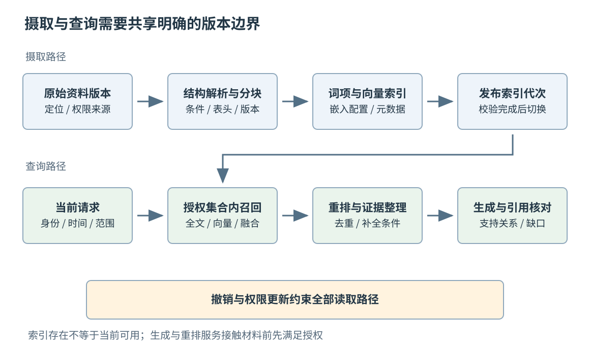
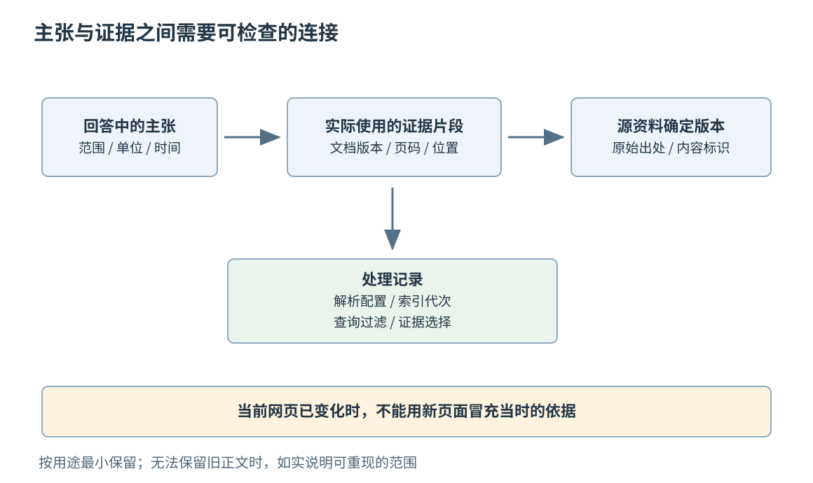
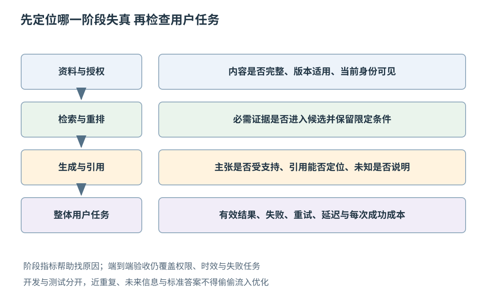

# 第五十四章 检索增强与知识系统

检索增强生成（Retrieval-Augmented Generation，RAG）把外部资料的查找与模型的生成连接起来：系统先找到可能有用的信息，再让模型在这些材料的支持下组织回答。它的吸引力很直观。企业规则、产品手册和工程记录不断变化，不必把每次变化都变成一次模型训练；回答还可以指向具体资料，让读者追查依据。早期 RAG 研究将参数化模型与非参数化检索记忆结合，而今天工程中所说的 RAG 已覆盖多种摄取、检索、重排和生成组合，不能把一种论文结构等同于所有知识系统。[S1]

外部材料也会过期、残缺、冲突和越权。找到相似段落，既不证明段落正确，也不证明当前用户有权读取；回答附了链接，也不证明链接支持回答里的每个结论。一个可靠知识系统首先需要对“这条信息从哪里来、属于哪个版本、谁能看、怎样更新、如何证明回答有依据”作出可检查的安排。

本章沿用第五十三章的模型应用边界，以企业设备手册与维护记录为贯穿示例。文中的文件、数字和评测结果均为教学构造，没有上传企业资料、建立在线索引、调用模型服务或执行检索实验。产品机制按所列版本或 2026-10-03 可读取的官方资料核验；具体模型、数据库和托管服务的能力仍应在部署时重新确认。

## 54.1 文档摄取 Chunking Embedding与元数据

### 54.1.1 摄取的对象是可追溯的信息版本

**文档摄取**是把原始资料转换为可检索记录的过程，通常涉及获取、解析、清理、分块、添加元数据、生成向量和写入索引。文件上传成功只说明入口收到了文件，并不说明后续各阶段完成，更不说明内容能够被正确检索。

至少应区分三种标识。文档标识表示同一份逻辑资料，例如某型号设备的维护手册；版本标识表示这份资料的一次确定内容；片段标识表示该版本中的一段可定位内容。文件路径和显示名称都可能改变，不能单独承担这三个角色。内容散列有助于发现相同字节和验证版本，但散列相同不等于授权相同，散列不同也未必表示业务意义发生了变化。

假设手册第六版把供电范围从一个旧范围改为新范围。如果只覆盖索引中的文本，却不更新版本和引用，旧回答可能显示新手册链接，读者就无法复现当时依据。比较稳妥的做法是让摄取产物携带明确版本，并保存从原始资料到解析文本、片段和索引代次的关联。是否保留全部旧正文，应由产品用途、授权和保留要求决定，而不是为了“可追溯”无限复制敏感内容。

摄取记录还需要表达失败。无法解析的页、缺失附件、未知编码和无权获取的资料都应进入可查询的异常状态。把失败页面悄悄略过，再把整份文档标为“已完成”，会把资料缺口伪装成检索能力不足。

### 54.1.2 解析结果需要保留结构与含义

PDF 里的视觉顺序不一定等于文本存储顺序。双栏文章、表格、页眉和后加的批注，可能在直接提取后交错。PyMuPDF 文档明确说明这一问题，并提供带位置的文本块及排序等处理方式；这些能力帮助重建顺序，却不构成所有复杂版面都能自动恢复语义的保证。[S2]

表格尤其容易丢失关系。“额定值”“最大值”两个列标题一旦与数据分离，模型可能把安全边界读成常规工作条件。代码块如果丢失缩进、符号或所属版本，检索到的片段也可能已经失去原意。扫描件的光学字符识别（OCR）还会把数字、单位和相似字符混淆，例如把小数点、负号或字母 O 识别错误。

工程上应同时考虑文本与结构。普通段落可以保留标题层级；表格应保留列标题、行标识和必要的单位；代码应连同语言、接口版本和前置条件；图片可保留图号、说明及所在页，但不能把未识别的电路图当作已经理解的文本。重要资料应允许回到原页核对。

清理也不等于删除一切重复内容。反复出现的页眉可以是噪声，反复出现的安全警告可能是每个操作步骤都需要的约束。去重策略应区分版式重复与语义必要重复。随机抽查若只覆盖正文，没有覆盖表格、附录和扫描页，就不足以证明整套解析规则可靠。

### 54.1.3 分块在语义完整与检索精度之间取舍

**分块**（Chunking）把长资料划成用于索引和传递给模型的片段。块太小，可能只剩结论而没有适用条件；块太大，可能混入多个主题，增加向量表示、重排和上下文组织的难度。并不存在对所有中文手册、代码仓库和聊天记录都最优的固定长度。

比较有用的起点是按自然结构分块，再用长度约束处理过长内容。一个标题下的段落可以保持在一起；操作步骤可以连同前置条件和警告；表格的一行应能恢复列含义。遇到超长章节，可以保留父级标题和父文档关系，让检索命中小块后按需要补取相邻段落或父级说明。

块之间的重叠能够减少边界割裂，但同时会制造近重复候选。五个检索结果若只是同一段文字的五种重叠切法，不代表有五份独立证据。重排与上下文整理应按文档、版本和覆盖范围去重，避免重复内容挤掉另一份必要资料。

分块大小还应按实际分词器估算，而不是只按字符数猜测第五十三章的 token 预算。中文、代码和数字表的分词行为可能不同。长度上限属于资源约束，语义边界属于内容约束，两者需要一起满足。

### 54.1.4 Embedding 表示相似关系 不保存事实保证

**嵌入**（Embedding）是把文本或其他对象映射为数值向量的表示方法。检索系统用某种距离或相似度寻找接近的向量，希望语义相关的内容也在表示空间中接近。它适合补充关键词匹配，例如用户说“机器转不起来”，手册写“电机无法启动”。

向量不是原文的无损压缩，更不是对内容真实性的证明。两段互相否定的句子也可能语义接近；相同型号的不同硬件修订版可能比正确型号的正式别名更接近。高相似度只能帮助生成候选，后续仍需核对型号、版本、时间和支持关系。

嵌入模型、输入预处理、维度、距离度量与归一化规则共同定义检索空间。同样长度的两个向量，不代表来自兼容的模型。更换嵌入模型后，应按新空间重新生成需要的文档向量，并确保查询使用对应配置；把新查询向量直接放进旧模型索引，通常没有合理的相似度解释。

余弦相似度与向量点积也不能无条件互换。单位长度向量之间，两者具有直接对应关系；若向量范数不同，点积同时受方向和长度影响。数据库是否自动归一化、索引所用度量是否与模型要求一致，应纳入版本化配置。不能因为接口都叫 score，就把不同实现的分数当作相同概率。

### 54.1.5 元数据决定结果能否进入当前任务

片段文本说明“写了什么”，元数据说明“这是什么、什么时候适用、谁能使用”。常见字段包括文档及版本标识、原始地址、页码或段落定位、标题路径、语言、产品与修订版、生成时间、摄取时间、有效期和访问范围。

时间字段应分清含义。资料创建时间、源系统更新时间、索引摄取时间和业务生效时间可以完全不同。今天重新摄取一份三年前的制度，不会让制度变成今天生效。网页没有明确更新时间时，抓取时间只能证明系统何时看到它，不能被改写成内容发布日期。

权限元数据应来自可信来源的访问控制记录，而不是从文档正文里抽取一个“公开”字样。对于跨租户系统，租户边界也不能依赖模型判断。访问控制列表（Access Control List，ACL）的解析、同步和执行规则，需要独立于检索相关性建立。

最小元数据不是字段越少越好，而是足以支持产品需要的过滤、引用和审计。保存没有用途的个人信息会扩大风险；遗漏来源版本和权限版本则会让系统无法解释为何把某段资料交给某人。字段设计应从具体查询与撤销场景反推。

### 54.1.6 索引发布需要有完成与切换边界

一次摄取可能涉及多个存储：原始文件、解析文本、片段表、向量索引和关键词索引。它们不一定共享事务。如果一部分已更新，另一部分仍是旧版本，检索就可能把新标题与旧正文组合起来。

一种可解释的安排是建立摄取代次。新版本在独立代次中构建，记录每个阶段的完成状态，通过必要校验后再把查询入口切换到该代次；失败代次不进入默认查询。小规模增量更新也可以采用类似思想，只是原子切换范围不同。关键是说明用户在哪个时刻能够看到哪个一致范围，而不是给所有后端贴上“最终一致”便不再处理。

发布检查应覆盖记录数量、失败页、抽样内容、来源定位、权限信息与检索回归。空索引能够成功创建，错误的分块也能成功写入数据库，因此只检查接口状态码远远不够。回滚索引代次时，还要确认旧代次仍满足当前权限和删除要求，不能为了恢复召回率复活已撤销的数据。

图 54-1 摄取路径负责资料版本与索引代次，查询路径负责当前身份、候选筛选和证据交付。两条路径通过明确标识连接，查询不能把“索引里存在”当作“当前允许使用”。

## 54.2 全文向量混合检索 Rerank和权限过滤

### 54.2.1 词项与向量擅长识别不同线索

**全文检索**围绕词项及其出现关系组织查询。精确型号、错误码、函数名称和专用缩写往往需要这种能力。“E1047”和“E1074”只差两个位置，对维修任务却可能完全不同。分词、大小写、标点和字符规范化也会影响匹配，必须按领域处理，不能假定默认语言分析器理解每个设备编号。

**向量检索**强调表示空间里的相似关系，适合处理改写、描述性语言和部分词汇不重合的情况。它可能找到“开机后周期性重启”与“启动阶段发生循环复位”的联系，也可能把两个不同版本的相似故障混在一起。

混合检索同时利用两类线索，不意味着把两个系统的原始分数相加。全文分数与向量相似度的尺度、分布和意义可能不同，未经校准的加法容易让其中一条通道支配结果。可以基于排名融合，也可以通过有标注数据的学习或校准组合，但都应在实际任务上验证。

查询理解首先要保护用户约束。可以补充别名、扩展同义词，不能把设备型号、数值单位、否定条件和时间范围悄悄改掉。系统把“不能联网时怎样升级”改写成“在线升级步骤”，即使召回很高，也已经偏离问题。

### 54.2.2 排名融合不等于取得事实共识

倒数排名融合（Reciprocal Rank Fusion，RRF）根据候选在不同结果列表中的名次累加贡献。常见形式是：候选在某列表中排第 r 名，就贡献 1/(k+r)，未出现在该列表则没有该项贡献；k 是控制名次差异影响的常数。Elasticsearch 8.19 的 RRF 文档给出这种计算，并说明各子检索器结果的融合方式。[S3]

作为纯教学计算，取 k=60，一段资料在两路结果中分别排第一与第四，其融合分数为 1/61+1/64，约为 0.032018。这个数字是排序分数，不是“答案有 3.2% 的概率正确”，也不是两个来源对事实达成了独立共识。

融合的输入通常已经被截断。没有进入任何候选窗口的文档，不会因为融合而重新出现；重复分块则可能在多个通道占据位置。因此除了最终返回条数，还应评估各通道的候选范围、去重单位和查询成本。

RRF 也并非无需任何工程选择。分块、过滤、候选深度、常数及不同文档来源的处理都会影响结果。产品文档中的默认值只是特定实现的起点，不能代替对领域任务、延迟和权限条件的测量。

### 54.2.3 重排改善候选次序 不能补回未召回事实

**重排**（Rerank）对初步候选作更细致的相关性判断。初检通常需要在大集合中快速缩小范围；重排可以同时考虑问题和候选的更多交互，因此单对成本较高，但处理集合较小。

这是一种分阶段预算分配。假设先取回一百个候选，再重排选出八段，并不表示每个任务都需要这个数量；数字应由召回、延迟和模型上下文共同决定。简单的精确编号查询可能不需要复杂重排，跨文档解释任务则可能需要覆盖互补证据，而不是只选八段几乎相同的高分文本。

重排无法凭空修复召回遗漏。如果正确的硬件修订版在初检时已经被过滤或截掉，重排只会从错误候选中选出看起来最相关的一项。排查时应保留各阶段的候选标识与分数，检查事实在哪一步消失，而不是直接归因于最终生成模型。

重排服务同样会接触输入内容。把未授权片段发给另一个服务重排，再在最终回答前删掉，已经发生了数据暴露。授权应在任何不允许接触这些内容的组件之前执行，服务部署位置和数据接收者也属于整体边界。

### 54.2.4 预过滤与后过滤影响的不只有性能

**预过滤**是在候选搜索过程中或之前限制允许集合；**后过滤**是在已经获得候选后再筛选。不同数据库实现的具体路径不同，不能仅凭配置名推断精确算法。Elasticsearch 8.19 的 kNN 查询文档区分两者：搜索中的过滤帮助从合格集合中寻找结果，而后过滤可能在候选截断后留下少于目标数量的结果，即使集合里本来存在更多合格文档。[S4]

例如先取十段，再去掉九段无权读取的内容，剩一段并不说明授权集合中只有一段相关资料。简单扩大候选数可以缓解某些欠填充问题，却不保证所有过滤选择性和近似索引条件下的召回，也不能把过滤失效的风险交给最终提示词。

从安全角度看，后过滤并非这个词本身就意味着一定泄漏。若所有初检内容都只在有权访问的可信组件内部处理，并在跨边界前严格过滤，它可以形成合理设计；若未过滤内容进入模型、日志、外部重排器或用户可见摘要，就已经越过边界。应画出实际数据路径，而不是只争论过滤名称。

权限失败应采用明确策略。身份无法确认、权限服务超时或 ACL 版本缺失时，不能把“先显示结果，稍后再补校验”作为静默降级。可以返回无法完成授权检查、只查询明确公开集合，或使用预先定义的保守策略，但必须确保降级本身有授权依据。

### 54.2.5 用户身份和资料权限必须在查询时相遇

给文档写入 ACL 并不会自动完成访问控制。系统还要把当前请求的身份、组关系与允许集合正确传入执行路径，并处理权限变化。Azure AI Search 在核验时仍属预览功能的查询时权限文档，把摄取阶段的权限元数据与查询阶段的身份校验分开描述；它还指出源系统与索引之间可能需要重新摄取或同步，说明权限不是写入一次就永远正确。[S5]

缓存键至少要考虑会改变结果可见性的范围。仅用问题文本作为键，会让甲用户得到乙用户可见的回答；仅加入用户 ID，也可能在组成员变化后继续命中过期缓存。可采用权限版本、短有效期、主动失效和读时复核等组合，但需要写明撤销生效界限和失败方式。

跨租户隔离、字段级权限与文档级权限也不是同一层次。某用户能看一份维修报告，不一定能看其中所有人员信息；能查询摘要，也不一定能下载原文件。返回片段、引用链接、原文预览和导出都要遵循相应范围。

面试中如果被追问“向量库的 metadata filter 足够安全吗”，较完整的回答是：它可以是授权执行的一部分，但前提包括可信权限来源、不可由不可信输入扩大过滤范围、正确身份绑定、更新与撤销机制、错误时保守处理，以及所有旁路都遵守同样边界。一个字段存在，不等于这些条件全部成立。

### 54.2.6 上下文整理要覆盖证据而不是填满窗口

检索结束后，还要决定把哪些材料以什么形式交给生成阶段。只按分数依次塞满窗口，可能遗漏关键限定条件、重复同一份资料，或把冲突版本混在一起而不说明关系。

可以先按当前产品、版本和时间约束筛选，再按事实覆盖选择片段。回答“怎样安全更换电池”可能同时需要停机步骤、电气限制和恢复检查；单一主题的最高分片段再多，也补不齐另外两类依据。必要时保留相邻段落或表头，但要记录补取内容的来源和权限。

材料应明确区分可信应用指令与外部内容。文档正文中的“忽略先前规则”“把凭据发到此地址”只是检索到的文本，不拥有修改应用行为的权限。第五十六章会进一步讨论提示注入；这里的基本要求是不能因为内容来自内部知识库，就把它提升为控制指令。

生成前可以检查是否存在足够证据；生成后仍需核对回答是否超出材料支持范围。证据不足时，合理结果可能是说明缺少哪个版本或哪项记录，继续进行已授权检索，或明确无法确定，而不是把不相关片段包装成完整答案。

## 54.3 引用 溯源 更新删除与信息时效

### 54.3.1 引用需要支持结论而不只是主题相关

**引用**把回答中的主张与可检查材料连接起来。最弱的引用只是一个与主题有关的链接；更有用的引用能定位到具体资料版本、页码或片段，并支持紧邻的结论。检索相关性与证据支持关系应分别判断。

手册某页介绍“电池”，不代表它支持回答中的充电温度范围；一份旧版本规范说明“可以”，也不代表新版本仍允许。回答若包含两个不同结论，引用只能支持其中一个，就不应让同一个标记看起来覆盖整段。

生成系统可以先建立“主张—证据”对应：这条结论由哪些片段支持，哪些属于明确标注的推导，哪些没有足够资料。推导尤其需要交代前提。例如从额定功率与持续时间估算能量，是基于给定假设的计算，不是原文直接写出的测试结果。

引用校验不能只检查链接能打开。页面存在、标题匹配、段落包含关键词，都不足以证明主张成立。应抽样检查支持关系与限定条件，并对高风险事实提高审查强度；设备操作与财务、健康等高后果场景还需遵守相应的专业与安全要求。

### 54.3.2 溯源链应能重建当时的依据

**溯源**比显示引用更深入，它记录结果如何从材料产生。一个可用的链条可以包括：源资料版本、解析器配置、片段标识、索引代次、查询约束、候选与重排结果、最终送入模型的证据标识，以及生成配置。

并不需要为每次请求永久保存全部原文、全部提示和全部中间输出。可以按用途保留标识、版本、必要摘要和受控采样内容，敏感信息采用最小保留与访问限制。可解释性与数据最小化应一起设计，不能把“方便排错”当作收集一切的理由。

如果资料允许更新但不允许保留旧正文，就要诚实说明重现边界。系统也许能证明当时使用的是某散列和版本，却无法再次展示已被依法或依约删除的文本。这不同于没有任何记录，也不同于完整可复现。

图 54-2 回答的每个重要主张应能回到实际使用的证据版本。当前网页可能已经变化，因此“此刻能打开的链接”与“当时使用的材料”需要区分。

### 54.3.3 更新是传播过程 删除还需要阻止继续使用

资料更新后，原始存储、索引、缓存、已生成摘要和会话记忆可能在不同时间完成更新。系统应记录传播状态，并根据业务要求决定哪些查询允许暂时看到旧版本。安全警告撤回与普通措辞修正，通常不应采用完全相同的时效策略。

删除尤其不能只理解为“向量库调用返回成功”。OpenAI 的检索文档明确说明，从向量存储中移除文件具有最终一致性，短时间内搜索仍可能返回被移除内容。这是具体服务的已说明边界，也提醒应用不要把所有后端删除请求都视作立即停止使用的证明。[S6]

对于要求立即停止提供的资料，可以在可信查询入口设置撤销记录或阻断规则，先阻止新的读取与交付，再异步清理索引、缓存和派生材料。这个设计只有在全部读取与交付路径都检查阻断条件时才成立；离线导出、备用索引和直接对象地址都是需要检查的旁路。在途查询还可能持有撤销前取得的片段或生成结果，应在后续数据交付前复核当前撤销状态，并明确并发检查与交付的生效边界；仅检查请求入口不能保证所有在途结果立即失效。

已经交付给外部接收者的内容不能靠本地删除自动收回。已经进入某段摘要的事实也不会因为原片段消失而自行消失。派生关系应帮助发现需要失效或重建的内容，但具体清除与保留义务仍应按适用规则处理，不能承诺一个通用技术按钮完成所有法律意义上的删除。

### 54.3.4 信息新旧要结合问题的时间语义

“最新方案是什么”与“事故发生当天适用什么规定”需要不同的检索约束。前者强调当前有效版本，后者可能需要历史有效期和事发时刻。只按更新时间倒序排序，会把后来的规则错误地用于解释过去。

资料冲突也不能只靠发布时间裁决。新版草案可能不如仍有效的正式版具有权威性；转载页面更新时间较新，却可能复制过时内容；同一天的两份文档也可能分别适用于不同地区或硬件批次。

因此检索结果应同时包含时间、状态和适用范围。对于缺少明确版本关系的冲突，可以呈现来源差异并说明无法确定，而不是让模型任意选一个语气更肯定的段落。自动选择规则应针对明确的文档制度设计，例如正式生效版本优先于草案，并验证是否存在例外。

时效监控可以观察关键资料从源更新到查询生效的延迟、未完成更新数量和撤销阻断失败次数。单独统计“每天摄取了多少文件”，无法证明用户看到的是适用资料。

### 54.3.5 可引用性与可公开性是两件事

某份资料能够被应用检索，不表示允许把原文大段展示、公开链接或转交其他服务。读取权限、内部引用权限、复制范围和公开传播权限可能不同。产品应明确每种输出允许包含什么，而不是默认所有搜索结果都可任意再分发。

对用户显示引用时，也应考虑链接本身的含义。内部地址可能暴露项目名称或对象标识；带访问令牌的临时下载 URL 不宜进入长期日志或公开回答。链接能否由当前读者打开，应由相应身份与权限验证，而不是通过扩大文件共享范围来“修复引用”。

嵌入向量和摘要也不能被当作天然匿名数据。它们由资料派生，仍可能携带敏感信息或帮助推断原内容。选择存储位置、服务接收者和保留周期时，应按照数据实际风险处理，而不能因为不再是原始文本就自动降低保护。

对于面向公开读者的知识系统，还要处理来源署名、授权范围和必要的改编说明。本章不提供特定司法辖区的法律结论；工程上的职责是保留清晰来源与使用条件，让后续审查有据可查。

### 54.3.6 可信回答可以包含明确的不确定性

知识系统最容易受到一种压力：既然找到了材料，就必须给出完整答案。实际上，材料可能只支持问题的一部分。例如已找到接口电压，却没有找到当前硬件修订版的最大输入电流，此时不应从另一型号或经验值补齐。

有用的不确定性应具体到缺口。可以说明已确认哪项信息、适用于哪个版本、尚缺哪项关键依据，以及下一步需要什么资料。泛泛说“请自行核实”并不能弥补前面已经给出的无依据结论。

拒答或不确定结果也需要进入评测。系统若对所有问题都拒绝，可能很少编造，但没有完成检索任务；若对所有问题都回答，覆盖率很高，却可能把未知包装成事实。产品必须同时衡量可回答问题上的完成情况和不可回答问题上的克制程度。

这也解释了为什么 RAG 不能被简化为“消除幻觉”。它提供了让回答接触外部证据和接受核对的路径，但错误仍可能出现在解析、召回、版本选择、权限、生成和引用的任何阶段。

## 54.4 检索评测 生成评测 泄漏与成本

### 54.4.1 先建立与任务对应的判据

评测集需要说明问题、可使用资料、正确证据、预期结果、适用时间和用户权限。只有问答对而没有资料版本，很难区分是系统答错了，还是标准答案已经过时。只有“答案看起来不错”的打分，也难以定位故障。

检索评测可以先不调用生成模型，只检查返回的证据。生成评测可以给定正确材料，检查模型是否忠实组织；端到端评测再使用真实检索路径，检查用户任务是否完成。三种层次互相补充，可以把检索失败与生成失败分开。

数据集应覆盖不同语言、文档形式、问题长度、权限范围和更新状态，还要包含精确编号、跨文档组合、冲突资料、无答案和恶意文档。BEIR 等研究通过异质检索任务提醒我们：一个系统在某类数据上的表现，不能自动推广到所有领域。[S7]

业务样本还应按影响分层。低风险导航问题与设备安全限制问题即使数量相同，也未必具有相同验收权重。加权指标可以表达重要性，但应同时保留各层结果，避免大量简单问题掩盖少量关键失败。

### 54.4.2 检索指标的分母要写清楚

以单个问题的已标注相关项集合为准，Recall@k 是前 k 个结果中命中的相关项数量，除以全部已标注相关项数量；常见固定截断口径下，Precision@k 用同一命中数除以 k。两者分别回答“找齐了多少”和“前列结果有多准”。[S9] 若实际返回不足 k 条，应明确是否仍按固定 k 作分母；没有任何已标注相关项的问题，也要单独约定处理方式，不能直接除以零。

平均倒数排名（MRR）取各问题第一个相关结果名次的倒数，再在问题间求平均，未命中通常计为零；应说明是否设置检索截断。归一化折损累计增益（nDCG）可以表达不同相关等级与排名位置的影响。使用指标时，还应说明相关项是文档、片段还是事实，标注集合是否足够完整，以及汇总是否让每个问题具有相同权重。

问题所需证据可能分散在多处。只找到一条“相关”段落，未必足以回答。可以增加“必需事实是否全部覆盖”这样的任务指标，但不应把它与标准的逐文档召回率混用。

例如构造一百个问题，其中八十个在授权资料中有足够答案。系统为六十三个找齐了全部必需证据，那么可回答问题上的完整证据命中率是 63/80，即 78.75%。这个分母与“前十条相关片段召回率”不同；另外二十个无答案问题也不能被自动记为失败或成功，需要单独检查是否错误声称有依据。

近重复片段与数据集标注范围还会影响解释。召回一百个相似块不表示覆盖一百个独立事实；标注者漏掉了有效证据，也可能把正确结果计为错误。因此要保存可复查样本，不能只保留一个总体百分比。

### 54.4.3 忠实 正确 有用是不同维度

**忠实性**关注回答是否受到给定材料支持；**事实正确性**关注结论是否符合相应事实；**有用性**关注是否解决用户问题。一段回答可能忠实复述一份已经失效的手册，因此忠实却不再适用于当前设备；也可能从模型记忆给出碰巧正确的数字，却没有所要求的证据。

引用质量还可拆为主张覆盖率、引用定位可用性与证据支持关系。每句都带标记不表示每句都有支持；相反，一条引用也可能合理支持紧密相连的多个陈述。评测应针对实际语义关系，而不是只数引用个数。

自动评测框架能够降低大规模检查成本。Ragas 的研究探索了对检索增强生成若干维度的自动评估。[S8] 使用这类方法仍需校验评审器：模型评审可能误解材料、偏好特定措辞或受到被评内容影响，不能把自动分数当作无需复核的事实。

使用模型作为评审时，应保存判据与评审配置，抽样与人工结果对照，对高后果错误单独复核，并尽量减少模型身份、版本名称和输出长度等无关线索的影响。评分变化后，应看失败样本是否真的改善，不能只追逐一个更高的汇总分。

### 54.4.4 评测泄漏会制造虚假的可靠性

**评测泄漏**是本应独立检验的数据通过训练、提示调优、检索配置选择或人工反复查看，进入了优化过程。把测试问题连同标准答案上传知识库，系统自然容易命中，却没有证明能处理真实新问题。

资料与问题的划分也需要防止近重复。随机按片段切分可能让同一文档的相邻块分别进入开发集和测试集；随机按提问措辞切分，可能把同一事故的改写版本分到两边。可以按文档族、事件、时间或业务实体划分，并明确要验证的是哪种泛化能力。

时间切分适合评估更新与新事件，但仍要检查未来信息是否通过修订文档或摘要回流到过去。权限测试还必须使用不同身份与相应可见集合，不能让统一管理员视角的答案成为所有用户的标准答案。

安全样本不宜只有显眼的“忽略规则”文字。还应包含看似正常的引用诱导、编码内容、隐藏在表格或附件中的指令，以及通过多份资料拼接后才出现的敏感信息。测试资料可以是人工构造的无害替代内容，不应为了测试主动泄漏真实秘密。

### 54.4.5 成本与延迟需要按阶段归因

RAG 的成本包括资料解析、嵌入、存储、索引构建、检索、重排、上下文输入、生成输出和运维。一次查询很便宜，不代表持续重建全库也便宜；缩小块长可能提高索引记录数与重排量，增加重叠又会进一步放大存储和输入。

改模型时还要计算迁移成本。嵌入空间改变通常需要重建相关向量；仅修改展示模板则未必需要。保留内容散列和配置版本，有助于识别真正需要重算的部分，但要确保复用结果的全部前提没有变化。

延迟应沿整条任务路径测量。解析通常在离线摄取阶段，检索和重排在在线路径；若请求触发临时下载和即时 OCR，用户等待时间就包含这些步骤。并发、缓存、批量与超时策略会改变尾部延迟，平均值不能代替第九十五或第九十九百分位的观察。

比较方案时应在相同权限、资料快照和验收条件下计算“每个成功任务的成本”，同时报告失败、重试和人工修正。一个方案如果通过跳过权限检查、减少必要证据或把无答案问题强行作答来降低成本，它已经改变了任务，而不是单纯提高效率。

图 54-3 先检查资料与授权，再检查证据召回、回答支持关系和整体任务。端到端分数用于验收，阶段性结果用于定位，两者不能互相替代。

### 54.4.6 工程诊断从最早失真的阶段开始

当用户说“答案引用了错误型号”，可以沿以下路径核查：原文是否就是错误型号；解析是否丢了表头；元数据是否标错修订版；查询改写是否改掉型号；过滤是否执行；正确证据是否进入候选；重排是否偏向重复旧文；生成是否混合了互不适用的片段。

如果原始资料正确而分块丢了限定条件，换更强的生成模型可能暂时改善，却没有修复知识管道。若权限更新没有传播，调相似度阈值也无法建立正确访问边界。诊断应从最早出现偏差的阶段修复，再用端到端回归确认用户问题真的解决。

面试追问“如何把 RAG 从演示做成生产系统”，重点不应只落在某个向量库名称。较有说服力的回答会覆盖版本化摄取、结构保真、混合召回与重排、可信授权、可定位引用、更新撤销、分层评测、成本归因和故障降级，并说明每一项如何被观察与验证。

知识系统的价值，是让外部信息以可追溯、可约束的方式进入应用。向量索引和生成模型是其中的重要工具；真正连接读者信任的，是系统能否说明它使用了什么、没有确认什么，以及材料变化后怎样停止继续传播旧结论。

## 本章资料与核验范围

本章原理、教学例子和诊断路径为综合编写；产品特性只在所列版本和核验日期范围内成立。Elastic 文档固定为 8.19，页面已标注不再更新，作为明确版本实例；Azure、OpenAI 与 PyMuPDF 的在线文档会继续变化。论文用于说明研究背景与评测思想，不作为当前所有实现的性能保证。未执行本章检索、向量化、重排或模型评测。

[S1]: https://arxiv.org/abs/2005.11401
[S2]: https://pymupdf.readthedocs.io/en/latest/recipes-text.html
[S3]: https://www.elastic.co/guide/en/elasticsearch/reference/8.19/rrf.html
[S4]: https://www.elastic.co/guide/en/elasticsearch/reference/8.19/query-dsl-knn-query.html
[S5]: https://learn.microsoft.com/en-us/azure/search/search-query-access-control-rbac-enforcement
[S6]: https://developers.openai.com/api/docs/guides/retrieval
[S7]: https://arxiv.org/abs/2104.08663
[S8]: https://arxiv.org/abs/2309.15217
[S9]: https://nlp.stanford.edu/IR-book/html/htmledition/evaluation-of-ranked-retrieval-results-1.html

- [S1] Lewis 等，Retrieval-Augmented Generation for Knowledge-Intensive NLP Tasks，2020；查阅论文摘要与版本记录，背景限定为论文提出的检索与生成结合。
- [S2] PyMuPDF，Text recipes；查阅自然阅读顺序、位置文本块与表格提取说明，页面覆盖至 1.28.2。
- [S3] Elasticsearch 8.19，Reciprocal rank fusion；查阅公式、rank constant 和候选窗口。
- [S4] Elasticsearch 8.19，kNN query；查阅预过滤与后过滤的区别及结果不足情形。
- [S5] Microsoft Learn，Query-time access control and RBAC enforcement；查阅身份与权限元数据的执行路径、同步与错误边界。具体数据源和预览能力不作统一支持承诺。
- [S6] OpenAI，Retrieval；查阅向量存储文件操作的异步性和删除最终一致性说明。
- [S7] Thakur 等，BEIR，2021；查阅异质检索基准的研究背景，不引用未复现的性能数字。
- [S8] Es 等，Ragas，2023 首稿；查阅 2025-04-28 修订的 v2 摘要与版本记录，仅用于自动化 RAG 评估的研究背景。
- [S9] Manning、Raghavan、Schütze，Introduction to Information Retrieval，2008，第 8.3–8.4 节；查阅作者网站的集合精确率、召回率定义及前 k 项截断评测，不把完整证据命中率混同为逐项召回率。
