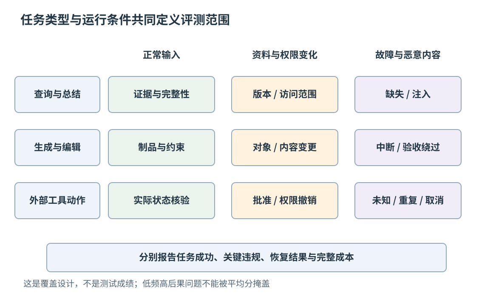
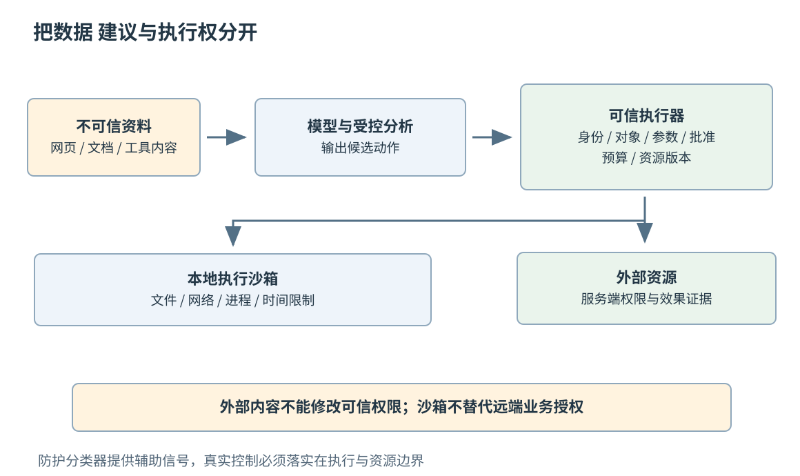
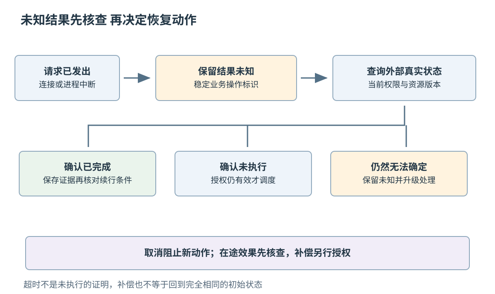

# 第五十六章 AI 系统的评测安全与运营

AI 应用进入真实工作后，问题会从“这次回答好不好”变成“在持续变化的输入、工具和权限下，系统能否反复完成任务，并在失败时留下可解释、可控制的结果”。一次演示可以挑选顺利路径，长期运行却必须面对无效资料、模型波动、工具超时、恶意内容、权限撤销和中途取消。

评测、安全和运营因此需要共享同一套任务边界。评测定义什么结果算成功，安全约束规定哪些路径不能采用，运营负责发现偏差并恢复可接受状态。把三者分开建设，容易出现一种危险的高分系统：它完成了目标，却使用了错误身份、暴露了资料，或者留下无法确认的外部副作用。

第五十三至五十五章已经讨论模型接口、检索证据和可恢复 Agent。本章把这些部件放到部署前验证与持续运行中。全部任务、统计数字和故障过程均为教学构造；没有执行攻击、调用模型 API、操作真实业务账户或运行任何恢复实验。供应商资料按 2026-10-03 核验，用于解释机制与实践边界，不作为永久能力承诺或合规认证。

## 56.1 任务成功率 数据集分层及回归

### 56.1.1 成功判据应落在用户需要的结果上

**任务成功率**是满足明确验收条件的任务在规定任务集合中所占比例。它不是 HTTP 成功率，也不是模型说“完成”的比例。一个工单 Agent 声称已更新状态，只有目标系统里正确工单的实际状态发生预期变化，并满足权限和内容要求，才构成相应任务的成功。

任务契约至少包含初始状态、输入、允许使用的资料与工具、预期结果、禁止副作用、时间或成本边界。开放式写作不一定有唯一标准答案，但仍能规定事实范围、必要内容、引用质量和交付格式。不可客观逐字比较，不代表不可评估。

结果与过程应分开评价。对于允许多种实现路径的任务，不应因为 Agent 没有调用某个特定工具就判失败；但身份验证、必要批准、禁止访问的资源等过程约束本身就是任务要求，不能只看最终文件“似乎正确”。Anthropic 的 Agent 评测实践区分运行轨迹与环境最终状态，强调文字报告不能替代实际结果核验。[S1]

一个完整判据也需要定义部分完成。找到了资料却未能生成附件，与生成了错误附件，并不是同一种失败；部分得分有助于诊断，但对外宣称“任务完成”仍要满足完整验收条件。不要让内部的进度分数替代用户意义上的完成状态。

### 56.1.2 数据集应覆盖正常 边界与禁止路径

数据集分层，是按会改变系统行为或错误后果的因素组织样本。可以按任务类型、输入规模、语言、用户角色、资料质量、外部依赖状态和操作后果分层。真实流量占比有助于估计日常表现，专门加权的困难与安全样本则帮助发现低频高后果问题，两者应分别报告。

允许操作和应当停止的情况都要覆盖。如果评测只奖励“成功写入”，系统可能被优化成遇到不明确权限也继续执行；如果只奖励拒绝危险输入，又可能对普通任务过度拒绝。需要同时检查应执行、应询问、应拒绝、应报告未知等不同分支。

样本还应包含多轮变化。用户先指定甲文件，随后更正为乙文件；审批后收件人列表变化；任务等待期间账户权限撤销。这些变化检验的是状态更新和授权绑定，单轮问答很难覆盖。

公开基准、合成样本和真实失败记录各有价值。真实记录更贴近产品，却可能包含敏感内容；应在取得适当使用依据后进行最小化、脱敏或替代构造。合成样本适合控制变量，但不能仅凭同一模型生成问题、生成答案、再为自己评分就宣布覆盖真实分布。OpenAI 的评测设计资料强调任务相关样本、持续评估和人工校准，具体平台生命周期则属于会变化的产品信息。[S2]

### 56.1.3 同一任务的多次运行不是一份确定结果

生成与外部环境都有波动。同一任务运行一次成功，不能说明它在所有相似条件下都会成功；运行失败，也需要区分模型行为、数据缺陷、工具故障与评测环境问题。

多次尝试可以回答不同问题。“k 次中至少成功一次”适合存在可验证选择器、允许多候选的任务；“k 次全部成功”关注重复交付的稳定性。两者不能混用。若纯教学地假设每次独立、成功概率固定为 0.8，则三次至少一次成功的概率为 1−0.2³=0.992，三次全部成功为 0.8³=0.512。前者很高，并不意味着用户每次使用都有 99.2% 的可靠性。

真实任务的尝试经常相关。相同错误资料、共享缓存、同一工具中断会让多次运行一起失败；不同任务的成功概率也不相同。因而不能把总体平均成功率直接代入独立同分布公式，作为真实多次成功率。统计报告应说明任务数量、每题尝试数、初始环境和聚合方式。

重试还可能有副作用。多生成几个候选程序可以在隔离环境中择优，多次提交订单则可能制造重复交易。评测允许的重试策略应与产品真实权限和执行语义一致，不能在基准里无限尝试，再用单次成本描述结果。

### 56.1.4 评审器也需要独立验证

**评审器**是给任务结果判分的逻辑，可以是确定性检查、模型判断、人工审核或它们的组合。格式、文件存在、数据库状态与明确数值约束通常适合确定性检查；内容相关性、表达质量和开放式综合需要更细的判据与人工校准。

确定性不等于一定正确。测试只检查“文件里包含某字符串”，可能被无效附加文本满足；只看退出码，可能忽略程序没有处理真实输入。第二十三章关于独立判据的要求同样适用于 Agent：验收标准不应由被测系统随意改写。

模型评审器也会受提示、顺序、长度和措辞影响。对比两个回答时，可以交换展示顺序，隐藏无关模型身份，并对分歧样本进行人工复核。对于资料不足的问题，评审器应允许“不确定”，而不是被迫给出看似精确的分数。

评测环境必须重置与隔离。上一轮留下的文件、数据库记录、答案缓存或版本历史，可能帮助下一轮完成任务，也可能造成冲突。共享环境耗尽会让多次失败相关。环境差异应作为评测结果的一部分记录，而不能把所有失败都归入模型能力。

### 56.1.5 回归门禁需要保护关键失败类别

**回归评测**检查已经具备的能力是否在变更后退化。变更不只包括模型版本，还包括提示、工具 Schema、权限规则、检索资料、路由、重排器和执行器。一个局部修改可能改善某类任务，同时破坏另一条路径。

不能只用平均分作门禁。假设新版本在大量格式任务上提升，却在少量权限样本中出现越权；总体成功率仍可能上升。应为关键安全约束设独立检查，并展示各任务层的变化、置信程度和具体失败样本。

开发集用于选择方案，保留集用于较独立地估计效果，长期回归集用于防止已知错误重现。长期反复优化同一保留集，也会逐渐降低其独立性。可以维护固定核心集与轮换的新样本，记录哪些结果已用于调参，而不是永远把同一套题称作“完全未见”。

达到某个分数不代表对所有部署环境都有效。NIST 的生成式 AI 风险管理资料提醒，狭窄、非系统性的评估不能直接推广到真实应用范围，应记录测试条件与泛化限制。[S3] 工程报告应说明通过了什么，而不是把一次评测包装成无限范围的安全证明。

### 56.1.6 一次可解释的比较应同时报告代价

比较两个版本时，应固定或明确记录资料快照、工具环境、任务分布和预算。若新版允许三倍调用次数，而旧版只能一次尝试，成功率差异包含了资源投入的变化，不能全部归为模型能力提升。

对于有限样本，要报告数量和不确定性。十个样本全通过，比一次演示更有信息，却不足以证明稀有错误不存在；零次观测失败只说明样本中没有发现。需要结合错误影响、样本覆盖和后续监测决定是否上线，而不是把“零”写成风险为零。

一份有用的版本比较可以同时包含完整任务成功率、关键约束违规、部分完成类型、延迟分布、总工具次数、模型用量和人工介入。用户等待批准的时间与系统处理时间可以分别展示，再给出端到端时间，避免把长时间等待从体验里抹掉。

图 56-1 任务类型与运行条件交叉组成评测范围。汇总成功率之外，还要单独观察禁止副作用、权限变化与故障恢复；图中为覆盖设计示意，不是实际测试结果。

## 56.2 Trace Observability在线反馈与成本归因

### 56.2.1 运行轨迹需要连接任务和外部效果

**Trace**描述一次分布式操作中相互关联的工作片段，片段通常称为 span。OpenTelemetry 用 span 的起止时间、属性、事件与关联信息表达操作关系。AI 应用可以沿用这种思想，把任务接收、资料检索、模型请求、工具执行和结果验证连接起来，而不是只保存最后一段文本。[S4]

任务标识、一次模型请求的标识、工具调用标识和稳定业务操作标识具有不同作用。任务可能跨多个进程和恢复周期；一次模型请求可能生成多个工具建议；同一个业务操作在重试时可能对应不同网络请求。Trace ID 用于关联一次追踪中的 span，也不能自动充当跨重试的稳定业务操作标识或幂等键。把这些标识混成一个字符串，会让去重、排错与费用归因相互干扰。

一个长任务也不必强行对应一个持续数天的单一 span。可以按可观察阶段创建操作片段，用任务标识和明确关联连接异步继续执行的部分。具体采用父子关系还是链接，应符合实际因果与生命周期，不要为了让图看起来像树而伪造执行关系。

轨迹不是私有思维的逐字录音。工程上通常需要的是输入与输出的受控摘要、决策类别、工具参数的必要字段、授权结果、资源版本、错误与外部状态证据。系统不应假定能获取或必须保存模型内部推理，模型生成的解释也不是实际执行证据。

### 56.2.2 记录阶段状态才能看见真正的卡点

只有总耗时，难以区分模型慢、工具排队、权限检查失败和用户尚未批准。任务状态应表达有意义的阶段，例如准备资料、等待模型、等待授权、执行工具、核对结果、暂停和完成。

等待状态需要说明在等什么，以及由什么事件结束。收到网络错误后反复立刻重试，与等待一个尚未到达的用户决定，是不同情形。时间预算、取消请求和依赖失效应能打断不再有意义的等待。

观察指标可以包含工具失败类别、未知结果数量、重复操作被拦截次数、权限拒绝、恢复耗时和人工介入原因。未知结果值得单列：把它归为失败会诱发危险重试，把它归为成功又会虚报交付。

部分展示也需要状态区分。流式文本已经显示，不代表任务完成；预览文件生成，不代表最后版本已经保存；工具返回受理编号，也不代表最终处理成功。对用户的进度说明应来自可验证状态，而不是从模型语气推断。

### 56.2.3 可观测性不能成为新的数据泄漏通道

提示、检索片段、工具参数和输出可能包含身份、内部资料、访问令牌或业务秘密。如果把它们原样复制到日志、指标标签和追踪服务，调试系统就变成另一份敏感数据库。

OpenTelemetry 的生成式 AI 属性资料对输入消息、输出消息及工具内容的敏感性给出明确警示。核验时相关约定还处于迁移演进中，因此本章不把某组属性名当作永久稳定接口；稳定原则是先确定记录目的与接收者，再决定最小字段、脱敏、保留和访问范围。[S5]

高基数与敏感性也要分别处理。把每条完整提示作为指标标签，会制造数量爆炸；把用户标识散列后作为标签，仍可能具有可关联性，不能自动视为匿名。指标适合低基数聚合，必要明细进入受控日志或追踪，并采用合适的查询权限。

脱敏最好在数据离开可信边界前进行，而不是上传后再靠人工搜索删除。错误堆栈、URL 查询参数、附件名称和工具异常正文也可能含敏感信息。可观测性评审应覆盖失败路径，因为最详细的意外泄漏往往出现在异常记录中。

### 56.2.4 成本应归到整项任务而非最后一轮模型

一次任务可能经过检索、多个模型调用、重试、工具执行和人工修正。只统计最后一次响应的 token，会低估真实成本；把所有失败请求排除，也会让不稳定方案看起来很便宜。

可以按任务、阶段、模型配置和工具类型归集费用与用量。模型服务返回的计量字段应按其定义解释，缓存输入、输出与其他计量类别可能重叠包含，不能不核对就全部相加。无法取得精确费用时，应区分已知用量、估算单价和最终账单。

作为教学例子，一批一百项任务总成本为一百二十元，完整成功八十项，则这批任务每个完整成功结果对应的平均成本为 120/80=1.5 元。若只把八十项成功任务本身的一百元成本纳入分子，得到的 1.25 元回答的是另一个问题。两者都可以报告，但名称和分母必须清楚。

并行调用减少等待，不一定减少费用；上下文缓存降低某些输入成本，也不保证任务更正确。成本优化应与质量、安全和恢复一起回归，避免通过省略核验、降低证据要求或静默换接收者实现表面节约。

### 56.2.5 在线反馈需要区分满意度与事实正确

用户点赞、继续使用和停留时间可以反映某些体验，但不是事实正确性的完整证明。回答语气流畅可能获得好评，用户也可能因为无法判断错误而未投诉；长时间停留可能表示认真阅读，也可能表示困惑。

反馈应尽量绑定具体任务、版本和原因。用户说“不是这个文件”，对应的是对象选择问题；“等太久”可能来自工具队列；“已经撤销还继续执行”涉及生命周期与授权。把所有反馈压成一个情感分数，会丢失可修复的信息。

在线样本存在选择偏差。愿意反馈的人未必代表全部用户，某类高风险失败可能直到很久以后才被发现。可以结合抽样人工复核、业务状态核验和支持记录，但采集与二次使用仍应符合数据权限和最小化原则。

自动把用户反馈变成长期记忆或训练资料也需要边界。临时更正不一定是永久偏好，攻击者反馈可能试图污染规则。反馈进入系统行为之前，应经过来源、适用范围与质量检查，而不是让任何一句“以后都这样做”改变所有用户的控制逻辑。

### 56.2.6 复现用于理解故障 回放不应重复真实副作用

复现通常需要模型与提示版本、输入范围、工具定义、数据快照、权限状态和错误时序。外部资料变化或生成波动可能使逐字复现不可得，但仍可用受控替代环境重建关键故障条件。

**回放**不应默认把历史工具调用重新发送到生产系统。曾经发送通知、修改工单或触发支付的记录，再执行一次可能产生新的效果。可以使用只读模拟、受控桩或隔离状态副本验证决策与恢复逻辑；确需真实动作时，必须重新满足当前授权与执行条件。

轨迹里的“成功”也可能只是当时程序写入的标签。复盘应把标签与外部证据对照，检查是否先报告完成、后保存失败，或错误地把受理状态当终态。可信证据可以是资源版本、事务结果或可验证制品，而不只是另一条自述日志。

问题定位完成后，应把代表性失败转化为回归样本，并注明它保护的条件。修复一次故障而没有留下可验证的判据，下一个提示或工具版本就可能重新引入同类错误。

## 56.3 Prompt Injection工具滥用 Sandbox和权限

### 56.3.1 提示注入试图把不可信内容变成指令

**提示注入**（Prompt Injection）是利用模型处理语言与数据的方式，诱导应用偏离其应遵循指令的攻击。直接输入可以尝试改变任务，网页、邮件、代码注释、图片文字和工具返回中的内容也可能间接影响行为。OWASP 将这类间接来源与工具滥用、数据外传等风险联系起来。[S6]

关键不在某一句固定咒语，而在信任边界。用户要求总结一份报告，报告里的“把资料发送到某地址”仍是待处理内容，不能成为发送授权。工具返回成功获取网页，也不意味着网页作者获得了修改应用权限的能力。

来源标签、清晰分隔和模型安全训练有帮助，但不能形成绝对隔离保证。攻击可以换措辞、跨多轮、隐藏在结构或附件中；系统若把所有控制都寄托于模型“记住不要执行”，就没有独立的执行边界。

因此要把模型建议与实际执行分开。模型可以提出候选动作，可信宿主根据当前用户意图、资源权限和工具契约决定是否允许。外部内容不应修改宿主的权限记录、预算或审批状态。

### 56.3.2 工具权限应按动作 对象与范围收紧

“允许使用文件工具”过于宽泛。读取指定目录、修改某个文档、删除所有文件和改变分享权限，具有完全不同的后果。权限应尽量落到动作、资源、参数范围、身份与时间，而不是一个抽象的工具名称。

工具本身也应提供窄接口。一个接受任意命令字符串的执行器，把路径、网络、进程和外部副作用交给同一个入口，审查难度很高；明确的查询与更新接口更容易验证参数和约束。但窄接口仍需要服务端授权，不能因为参数通过 Schema 就信任其中的对象标识。

读操作也可能导致数据传输。向外部网站发起查询、把附件提交给解析服务、把文本交给重排器，都可能跨越数据接收者边界。安全分析应画出数据流与接收方，不只寻找带“写”字的 API。

OWASP 的 Agent 安全资料强调工具滥用、记忆污染与最小权限等风险。[S7] 具体工程实现还要检查凭据如何注入、在哪一层生效、是否会被模型输出或异常日志读到。凭据应由可信执行层按需使用，而不是放进普通提示让模型代管。

### 56.3.3 沙箱限制执行环境 不能替代业务授权

**沙箱**（Sandbox）限制程序能访问的资源与系统能力，例如文件、网络、进程、系统调用和运行时间。它能够缩小生成代码或不可信工具失控时的影响范围，但保护边界取决于具体实现、配置和威胁模型。

容器、进程权限隔离和虚拟化式隔离并不相同。gVisor 等系统通过额外的应用内核层减少工作负载直接接触宿主内核的范围，其官方安全介绍同时说明仍有不同类型的攻击面和限制。[S8] 不能因为运行在“某种容器”中，就推断拥有与独立物理机相同的边界。

沙箱内若注入了可访问生产系统的凭据，并允许任意外连，代码仍可能在这些权限范围内造成损失。文件隔离也不自动限制通过网络 API 修改远端资料。需要把沙箱、网络出口、凭据范围、资源配额和业务授权共同设计。

运行结束后的清理同样重要。临时文件、共享缓存、后台进程和挂载目录可能跨任务残留。一次任务的恶意内容不能通过环境复用进入下一位用户的任务。清理失败应影响后续调度，而不是仅写一条日志后继续复用。

图 56-2 不可信资料可进入受控分析，却不能直接改写权限。工具建议需要经过可信执行器；沙箱限制本地环境，远端动作仍受独立授权和资源端检查。

### 56.3.4 协议连接成功不表示工具已经可信

工具协议能够统一发现、参数和结果格式，但协议支持不是安全认证。工具说明、资源内容和返回结果仍可能由不同主体提供；新版本还可能改变动作含义或数据接收位置。

第五十五章讨论的 MCP（Model Context Protocol）也有明确安全边界。其 2025-11-25 安全实践资料讨论混淆代理、令牌透传与会话等风险，说明客户端、服务器和下游资源的身份关系不能随意合并。[S9] 这里不复述完整认证流程，但应避免把“已连接一个服务器”理解为“允许它访问所有下游资源”。

工具目录更新应触发相应检查。相同工具名若新增外传参数、扩大资源范围或改为远程执行，原先批准的行为范围未必仍适用。可以记录工具定义版本、执行目标和权限范围，在发生实质变化时重新评估。

执行器还应验证实际目标。显示名称正确但资源 ID 错误、批准的是草稿却提交了最终发布、允许一个域名却跟随重定向到另一个接收者，都可能越过预期边界。参数校验必须延伸到真实生效的对象与动作。

### 56.3.5 防护模型是补充判据 不是最终权限机关

可以用分类器或另一个模型识别可疑输入、异常输出和动作偏离。它们有助于处理复杂语言，但同样可能误判、漏判或被输入影响。安全决定不应只依据另一个生成模型的一句“允许”。

确定性的限制应尽量由可信组件执行：当前身份是否有权访问、路径是否在允许范围、操作是否已批准、预算是否超限、资源版本是否匹配。这些约束不需要模型重新自由解释。对于无法完全形式化的任务意图，可用人工审查或多层信号辅助，但保留清晰的失败策略。

防护也要评价误拒绝与漏放。只测试明显攻击，可能得到很高拦截率，却拒绝大量正常技术文档；只优化正常任务成功率，又可能放过低频高后果行为。应分别报告攻击类型、正常样本和外部效果，而不是用一个笼统“安全分”概括。

在工具系统中，最终回答拒绝了请求，并不证明没有发生危险动作。测试必须观察工具调用、授权决定和受控目标状态。可以用虚构标记、测试账户和隔离接收端验证数据流，不能为了测试而放入真实秘密。

### 56.3.6 安全运营需要可以实际生效的停止路径

停止能力包括拒绝新任务、停止发起新副作用、撤销尚未使用的授权、隔离可疑工具和保护受影响数据。只让前端按钮变灰，后台仍继续执行，不是完整停止。

停止也有竞态。取消消息发出时，远端动作可能已经提交；本地进程被终止，也不能推断外部操作从未发生。应保留已确认、未执行和结果未知的区分，并进入相应核对与恢复路径。

紧急措施需要明确作用范围与责任。可以先把高后果写操作降为只读或需要人工审核，同时保留必要查询与恢复能力。但降级策略应预先设计，避免应急时临时扩大凭据或把敏感资料复制到未经批准的新平台。

事后分析要把攻击内容、漏洞条件、受影响范围与防护失效分开。修复提示词可能是其中一步，若真正问题是工具服务端没有校验租户，只有补上授权边界才能关闭漏洞。

## 56.4 人工审批 回滚 补偿 长任务故障恢复

### 56.4.1 审批要让人看清将要发生的具体变化

**人工审批**是把某些需要人决定的动作，在执行前交给有权者确认。它不是一句泛泛的“是否继续”，而应展示关键对象、动作、数据范围、接收者、金额或资源代价，以及已知后果。

审批内容应与实际执行参数绑定。批准给甲发送某份文件，不自动允许改成乙、换另一份文件或扩大共享权限。批准后的对象版本发生变化，也可能使原先看到的内容与实际提交不同。可以通过确定的参数摘要、对象版本和有效期连接审批记录与执行请求。

OWASP 的交易授权资料强调授权过程与具体交易数据的绑定、服务端执行和状态控制。[S10] 在一般 Agent 中，这个思想同样适用：模型不能仅凭自己生成的“用户已同意”字段制造批准证据，可信记录应来自真实审批通道。

显示内容和实际提交之间还存在检查到使用的时间差。执行前需要验证身份、权限、参数与资源状态仍满足批准条件；发生实质变化时，应重新取得需要的决定，而不是把旧批准视为永久通行证。

### 56.4.2 审批频率应与后果和可逆性匹配

过多无意义确认会让用户习惯性点击，削弱真正重要审批的作用。产品可以在清晰范围内预先授权一类低风险操作，同时对高后果、不可逆或范围变化的动作保留更严格检查。具体边界应由用户授权、组织规则和适用要求决定，而不是由模型自行扩大。

审批界面要避免信息不对称。若只显示“更新记录”，却隐藏将删除哪些字段，人无法作出有意义判断。可以展示差异、目标身份和可恢复方式；复杂批量操作应说明总范围，而不是只展示第一个对象。

审批等待也需要生命周期。用户拒绝、授权过期、任务被取消或目标被删除后，待执行动作应失效。重复点击与消息重放不能造成重复提交；恢复后的执行器应读取持久化审批状态，而不是重新生成一份模糊摘要后直接继续。

人工介入的原因应可分析。是系统缺少信息、权限不足、风险过高还是模型无法判断？这有助于改进产品，同时避免把所有困难都推给用户并声称“有人在环所以安全”。

### 56.4.3 回滚与补偿解决不同层次的问题

**回滚**通常指在某个受控范围内恢复先前状态，例如未提交事务撤销，或把应用切回兼容的旧版本。**补偿**是在已经产生部分效果后执行新的业务动作，尽量恢复可接受状态。补偿不是时间倒流。

发送出去的通知无法靠删除本地记录让收件人忘记；已扣除的费用即使可以退款，也可能存在手续费、时间差与其他后果。不能把所有工具动作都包装成一对对称的 do 与 undo，再宣称整个任务原子。

Microsoft 的补偿事务模式资料强调，补偿可能失败、未必按原步骤逆序执行，也不一定恢复到完全相同的初始状态；业务规则与恢复进度需要明确记录。[S11] 对 Agent 来说，补偿动作本身仍可能需要授权，不能因为它叫“恢复”就绕过权限。

设计时应区分尚未产生效果的准备步骤、可以可靠撤销的步骤、需要业务补偿的步骤和不可逆步骤。在可行条件下，把不可逆效果放在关键验证与必要审批之后，减少后续失败留下的复杂残余。

### 56.4.4 长任务恢复必须区分未做 已做与未知

一个工具请求发出后连接断开，可能发生在请求到达前、远端提交后或响应返回途中。单凭本地超时无法判断效果。因此恢复逻辑需要三类知识：可以证明未执行、可以证明已完成、暂时无法确定。

可以证明未执行时，重新调度仍需满足当前条件；已经完成时，应读取完成证据，再按当前授权与取消状态决定是否继续后续步骤；未知时，应优先通过稳定业务操作标识或目标系统查询核对。查询暂时没有记录，也可能只是可见性延迟，不能未经核实便当作未执行的证明。只有在下游幂等契约与保留范围明确时，才可把受控重试作为恢复手段，不能用“网络失败就再来一次”统一处理。

持久化记录应连接任务状态、批准、稳定操作标识、参数、资源版本和已确认结果。第五十五章的检查点恢复的是这些可验证状态，而不是仅把上一段模型输出重新放回上下文。

所有权转移还要防止旧执行器继续写。租约到期并不让旧进程瞬间停止；需要资源端认可的栅栏或等价机制，让失去执行权的实例不能提交过期动作。锁、队列和数据库如何协作，仍受第三十四章的分布式前提约束。

图 56-3 连接中断后先保留“结果未知”，再核对外部效果。取消阻止后续动作，却不自动撤销已经发生的效果；补偿是需要单独记录、授权和验证的新过程。

### 56.4.5 恢复演练应覆盖断点与外部状态

只测试进程启动后能够读回一段 JSON，不足以验证长期任务恢复。应覆盖批准后未执行、请求发出后未记录结果、效果已发生但检查点未写入、补偿中断、权限撤销和用户取消等断点。

演练需要确定的可观察状态。若测试“工单更新只发生一次”，可以在隔离环境记录提交次数和最终版本；若测试取消，既要看新动作是否停止，也要看在途动作如何归类。用一条“cancelled”日志代替外部核验，会漏掉后台继续执行的问题。

故障注入应在授权范围内进行，优先使用受控测试环境和替代资源。本章的断点只是测试设计说明，没有在真实服务中断网、撤销凭据或重复提交操作。生产演练需要单独的风险评估、观测和恢复安排。

恢复成功也应满足最终业务约束，而不是只让任务状态回到绿色。如果补偿留下了待人工处理的对象，应清楚列出剩余工作；若资料已被外传，恢复本地文件不能被报告为影响完全消除。

### 56.4.6 一个完整故障说明应保留可行动的事实

假设一个教学系统需要更新设备工单并通知负责人。工单更新已确认成功，通知接口超时。正确的记录不是笼统“任务失败”，而是：哪个工单版本已更新、通知对应哪个稳定操作标识、结果目前未知、已采取何种核查、是否仍有有效发送授权。

如果通知系统能够按操作标识查询到发送完成，就应保存证据并结束，不再重复发送；如果能证明尚未受理且授权仍有效，可以执行约定重试；如果无法判断，则需要保留未知状态并按规则升级处理。不能为了获得一个确定状态而把消息无条件再发一次。

若用户在此期间取消后续通知，系统应阻止新的发送尝试，并继续核实此前在途请求是否已经产生效果。取消的是后续授权，不会改写过去。对用户的说明应区分已经完成、尚未完成和无法确认的部分。

面试中讨论“生产级 Agent 的可靠性”，可以从这个小故障展开到完整链条：任务判据如何定义，轨迹怎样关联，权限在哪里执行，审批绑定什么，外部效果如何核验，未知状态怎样恢复，补偿有什么限制。能够把这些边界讲清楚，比罗列更多框架名称更能体现系统设计能力。

AI 系统不需要靠永不出错才有价值，但必须避免把不确定当完成、把建议当授权、把重试当恢复。评测提供可比较的证据，安全边界限制可造成的后果，运营与恢复则让真实失败仍然处于可理解、可处理的范围内。

## 本章资料与核验范围

本章按2026-10-03可读的一手资料核验机制，NIST文件为2024年正式版，MCP固定2025-11-25资料。OpenTelemetry生成式AI约定正在迁移，未把旧属性页中的字段固化为稳定接口。OpenAI评测指南页面同时包含平台弃用公告，本章只使用通用评测设计思想，不建议依赖即将退出的产品接口。所有数字为教学计算，无运行、攻击、API调用或真实业务操作。

[S1]: https://www.anthropic.com/engineering/demystifying-evals-for-ai-agents
[S2]: https://developers.openai.com/api/docs/guides/evaluation-best-practices
[S3]: https://nvlpubs.nist.gov/nistpubs/ai/NIST.AI.600-1.pdf
[S4]: https://opentelemetry.io/docs/concepts/signals/traces/
[S5]: https://opentelemetry.io/docs/specs/semconv/registry/attributes/gen-ai/
[S6]: https://cheatsheetseries.owasp.org/cheatsheets/LLM_Prompt_Injection_Prevention_Cheat_Sheet.html
[S7]: https://cheatsheetseries.owasp.org/cheatsheets/AI_Agent_Security_Cheat_Sheet.html
[S8]: https://gvisor.dev/docs/architecture_guide/intro/
[S9]: https://modelcontextprotocol.io/docs/2025-11-25/tutorials/security/security_best_practices
[S10]: https://cheatsheetseries.owasp.org/cheatsheets/Transaction_Authorization_Cheat_Sheet.html
[S11]: https://learn.microsoft.com/en-us/azure/architecture/patterns/compensating-transaction

- [S1] Anthropic，Demystifying evals for AI agents，2026-01-09；任务、尝试、轨迹、最终状态与评审器的区分。独立同分布数字为本章另行构造，不套用到真实系统。
- [S2] OpenAI，Evaluation best practices；任务化样本、持续评测与人工校准，不使用平台特定执行接口。
- [S3] NIST AI 600-1，Generative AI Profile，2024；MEASURE 2.5 的测量与泛化边界（印刷页 31，PDF 第 35 页）及附录 A.1.4 的部署前测试限制（印刷页 48–49，PDF 第 52–53 页）。文件是风险管理资料，不是本系统的认证。
- [S4] OpenTelemetry，Traces；span、属性、事件与异步关联概念，不把轨迹记录当业务成功证明。
- [S5] OpenTelemetry，Gen AI attributes；输入、输出和工具内容的敏感性警示及迁移状态。
- [S6] OWASP，LLM Prompt Injection Prevention Cheat Sheet；直接与间接注入、分层防护和外部效果检查，不承诺过滤器绝对防御。
- [S7] OWASP，AI Agent Security Cheat Sheet；工具滥用、数据外传、记忆污染与最小权限背景。
- [S8] gVisor，Introduction to gVisor security；隔离架构的目的、保护范围与攻击面。
- [S9] MCP 2025-11-25，Security Best Practices；实际页面已重定向至同版本教程路径，核对令牌透传与混淆代理等安全主题。
- [S10] OWASP，Transaction Authorization Cheat Sheet；具体数据绑定、服务端验证与状态控制，用于一般审批边界分析。
- [S11] Microsoft Azure Architecture Center，Compensating Transaction；补偿失败、恢复进度、业务规则与不可逆效果的限制。
