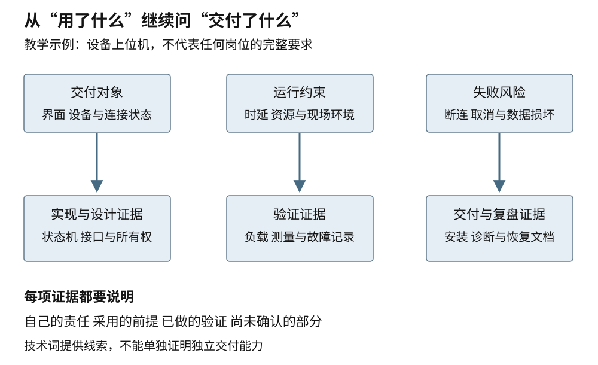
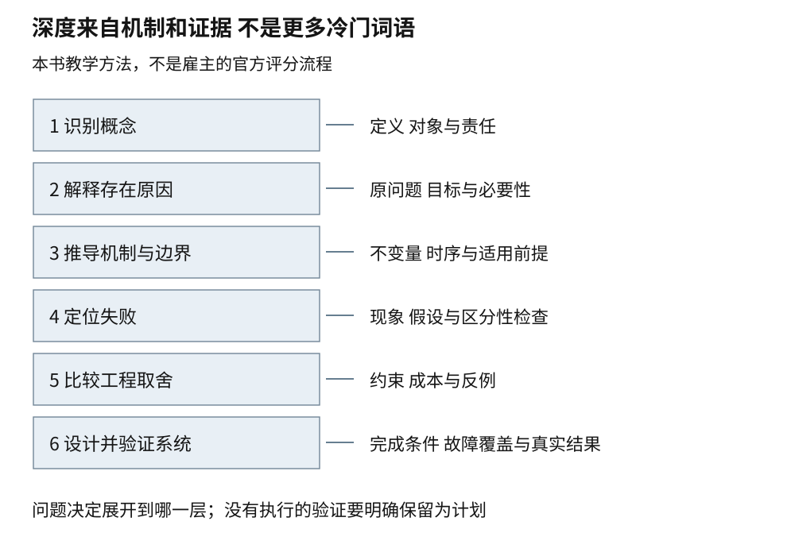

# 第五十七章 从知识点到面试追问与能力证明

技术面试是在有限时间和不完整信息下，观察一个人怎样理解问题、选择方法、检查结果和说明责任。它能够提供部分能力证据，却不等同于完整的工作表现；一次紧张时的卡顿也不能概括一个人的全部能力。对准备者而言，更可靠的目标是让已有知识能够被追问、让项目经历能够被核对，而不是试图记住所有可能出现的题目。

本书前面的章节已经把概念、机制、故障和取舍接在一起。本章把这条线变成一种表达方法：先从岗位实际交付对象确定需要证明什么，再沿六层追问说明理解的深度，最后把编码、调试、性能、系统设计和协作经历组织成可检查的回答。下文所有面试情境和候选回答都是原创教学构造，不是任何公司的真实题库，也不是读者或作者已经取得的工作成绩。

## 57.1 岗位 JD 拆解 能力证据与项目复盘

### 57.1.1 先找交付对象 再找技术词

**职位描述**常写作 JD，即 Job Description。它通常同时包含组织需要完成的工作、岗位责任、必要条件和加分项。只把其中出现的技术名词抄成学习清单，容易漏掉“这些技术最终要交付什么”。

例如一份职位同时出现 C++、Qt、Linux 和设备通信。它可能主要负责设备上位机，需要保证界面不被阻塞、设备断开后状态明确、日志能支持现场诊断；也可能主要负责内部桌面工具，设备只是偶尔接入。两个岗位的技术词重叠，工作对象和失败代价却不同。

拆解时可以先回答四个问题：服务谁，交付什么，在什么环境运行，怎样知道交付成功。随后再问主要风险是什么：响应不及时、计算不准确、数据丢失、设备不可恢复，还是长期维护成本过高。这样得到的能力需求，会比“熟悉十个框架”更具体。

对设备上位机，相关证据可能是完整的连接状态机、断连与取消处理、协议回放和安装交付。对数据库内核，证据可能是查询计划分析、崩溃恢复和性能回归。对模型服务，证据可能是负载分布、队列容量、精度验收和 GPU 资源预算。语言是实现工具，岗位的核心仍然是要持续交付的系统行为。

### 57.1.2 用真实样本说明方法 不假装代表整个市场

2025-01-23 发布的中国科学院国家天文台软件岗位公告，将设备控制上位机、设备联试、数据处理界面和技术文档放在同一职责中，并列出 Python、C/C++、Qt 和 Linux 等要求。该公告的报名期已经结束，本文只把它作为历史岗位内容样本。[S1]

从这份样本可以看出，准备者需要连接“写界面”和“让设备系统可用”：接入时如何确认状态，后台采集如何与界面线程配合，失败日志如何支持联试，最终交付别人怎样安装和使用。这些是本书对职责的工程拆解，不是公告承诺的具体面试题。

另一份计算机网络信息中心公告标注 2025-01-20，岗位面向并行软件实现与性能优化，结合科学应用、Linux C/C++、构建工具、CUDA 和性能分析。[S2] 它提示的准备方向不仅是会写一个 GPU 核函数，还包括解释数值结果、构建环境、数据搬运和测量可信度。本文未核实这个历史岗位目前仍在招聘，不将其作为正在开放的求职推荐。

国家空间科学中心 2025-05-28 的软件研发公告，同时列出设计、文档、运行、测试和维护，并把并行计算、三维可视化作为相关加分方向。[S3] 这说明某些岗位按完整交付过程评价能力；它不能被改写成“所有 C++ 岗位都必须精通可视化”。该公告的报名截止日期同样已过。

这三份样本都来自国内科研机构，组织目标与用工方式具有自身特点，不能代表中国整个软件市场。它们也不能支持薪酬、增长率或人才缺口的结论。阅读 JD 的方法是提取具体责任与证据，而不是从几个样本推出整个行业的排名。

### 57.1.3 必需条件 加分项与学习路径分别处理

职位中的“必须”“熟悉”“了解”和“优先”没有跨公司的统一量表，不能机械换成固定学习小时数。可以先按文字保留必要与加分的区别，再根据工作职责判断哪些能力直接影响进入团队后的交付。

如果岗位每天都要定位设备通信故障，能解释协议、字节序、超时和线程边界，通常比了解一个不参与主要任务的热门框架更相关。若公告把某个工具写成可选项，就不应只因它看起来新，反而忽略基础能力。准备顺序应服从真实目标，而不是技术词出现的视觉位置。

资历也会改变证据要求。初入岗位者可以用一个边界清楚的项目证明基本实现与学习能力；有经验者需要更清楚地交代生产约束、长期维护和跨团队决策。不能把一份高级岗位说明直接变成所有应届者的最低门槛，也不能用一个入门演示替代高级职责的证据。

当自己与岗位存在缺口时，可以区分已能独立完成、需要查资料完成、只理解概念和完全未接触四种状态。这不是给人贴等级，而是让准备计划更具体。把“熟悉 C++”拆成“能独立定位容器失效，但对跨库 ABI 只了解基本概念”，就知道下一次阅读和项目补充应该放在哪里。

### 57.1.4 能力证据要让别人能够追问

**能力证据**是能够支持某项能力判断的可检查材料。它可以是实现、设计记录、测试与实验、问题定位过程，也可以是对一个失败选择的清楚解释。仓库数量、代码行数、证书或技术名词可以提供背景，却不能独立证明自己已经具备某种工程能力。

一份有用证据通常包含任务边界、个人责任、关键决定、验证方法和结果限制。例如“负责缓存优化”过于宽泛；更可核对的说法是“我负责区分活跃数据、容器容量与分配器保留，在固定负载下比较两种回收策略，并记录尾延迟与峰值内存”。如果没有做过最后的比较，就只能说明完成了诊断或设计，不能补写成取得了性能收益。

证据应能向下展开。谈一个设计决定时，能够指出当时有哪些候选；谈一个优化时，能够解释基线与负载；谈一个事故时，能够说清最初观察、排除过程和修复验证。若只能复述项目介绍页，却无法解释其中一个错误路径，项目规模再大也难以转化为可信个人证据。

保密边界必须保留。可以用经过授权的公开项目、脱敏后的结构示意和自行重建的最小案例说明能力，不应为证明参与过项目而泄露客户数据、内部凭证或未公开实现。无法展示原始资料时，可以明确说明限制，并提供可公开验证的相同方法。可信度来自一致的细节，不来自披露越多越好。

图 57-1 从岗位词语到可核对证据。相同技术词可以通向不同交付对象，证据必须对应具体责任。

### 57.1.5 项目复盘重建当时的信息与决定

复盘不只是按时间讲“我先做了 A，再做 B，最后成功”。更有解释力的结构是：当时要解决什么问题，哪些约束已经确定，哪些信息尚不清楚，比较过什么方案，为什么选择其中一个，后来哪些证据改变了判断。

设一个原创案例：设备软件偶发退出卡住。最初怀疑串口驱动，后来线程栈显示主线程在等待工作线程，而工作线程还在等待队列条件。有效复盘应说明怎样把观察转成假设，怎样检查关闭谓词与通知，怎样核对对象销毁顺序。不能只用“最后加了一条 notify_all 就好了”概括，因为还没有解释为什么它覆盖了所有等待者。

如果修复确实只覆盖了空队列路径，就应如实说仍需检查满队列提交、部分启动失败与取消后回调。能够承认一个修复的范围，通常比把它包装成“一次解决所有并发问题”更能支持专业判断。第二十二章与第二十三章中的证据链和验证方法，正可以用于这种复盘。

集体项目还要区分团队成果与个人工作。团队搭建了整个平台，自己可能负责其中的任务队列、指标接入或某次兼容改造。可以先解释整体背景，再准确说明自己作出的判断、实现与验证，避免把团队全部能力归到个人名下；也不必因此贬低自己负责的一小段关键工作。

## 57.2 六层追问链和现场推理

### 57.2.1 六层是展开方式 不是题目难度排行榜

本书采用六层追问：识别概念，解释存在原因，推导机制与边界，定位失败，比较工程取舍，设计并验证系统。这是组织讨论的一种方法，不是所有公司采用的官方面试流程，也不是每道题必须问满六层。

第一层回答“在说什么”，避免双方对同一个词使用不同含义。第二层解释“为什么需要”，把设施接回实际问题。第三层说明“怎样成立”，提供不变量、状态转换或规范依据。第四层进入故障，检查能否把现象与机制联系起来。第五层比较候选方案，第六层把方案放进完整系统并给出验证与停止条件。

更深不等于更生僻。一个普通缓冲区的所有权问题，可以一直追到异步取消、内存预算和故障恢复；背出一个冷门指令名字，却说不清它解决什么问题，仍停留在识别层。准备时应选择与岗位相关的核心概念，练习把它向两边连接，而不是不断增加孤立名词。

图 57-2 六层追问的证据梯度。层次服务于当前问题，不要求所有讨论都完整走一遍。

### 57.2.2 第一层与第二层先建立共同对象

以“把一个批次交给后台处理”为例。面试者被问到 C++20 的 std::span 时，可以先说：它描述一段连续元素的非拥有访问范围，提供位置和长度信息，不负责让来源对象活到以后。这里已经区分了它与复制整个 vector，也给后面的生命周期问题留下入口。[S6]

再问“为什么需要它”，回答可以连接接口设计：接收方只需要遍历已有连续数据，而不需要知道调用者用 array、vector 还是其他合适存储；用范围表达参数可以同时带上长度，避免单独指针失去边界信息。不过 C++20 的 span 下标访问仍要求调用方保证下标小于长度，并不自动提供越界检查。[S6] 这个理由没有承诺无条件安全，也没有把零复制当作唯一目标。

如果问题改成 string_view，还应补充字符范围和零结尾的区别。好的第一层回答可以很短，但短句里要有边界。只说“它很轻量，可以提高性能”，还没有让对方知道它实际拥有和不拥有什么。

这两层也适用于其他方向。谈消息队列，先说明传输、保存或调度的具体对象；谈模型缓存，先说明保存的是哪一阶段的状态；谈机器人时间同步，先明确哪几个时钟和时间戳。名词越常见，越需要防止双方默认的定义不同。

### 57.2.3 第三层用时间线说明机制

接着问：“一个局部 vector 建好后，生成 span，提交到后台队列，函数返回，这个设计有什么条件？”回答应沿时间线展开：span 的复制只复制访问描述；如果局部 vector 在后台真正消费之前被销毁，元素的存储和生命不再受保证，后台访问会悬空。

即使 vector 没有销毁，也要检查生产者是否在后台读取期间重分配、删除或覆写。重分配会使原来指向其元素的指针与引用失效；原地覆写可能让地址仍有效但内容变成另一批；未建立先行发生关系的冲突跨线程访问，在至少一方非原子等条件下会构成数据竞争并导致未定义行为。[S6] 三个机制不同，不能用一句“加个 const”一起解决。

一种合理设计是把拥有批次的对象移交给任务，让任务完成前保持所有权；另一种是在调用方保留存储，并通过可靠的完成协议保证最后一次读取之后才复用。若只需要少量字段，复制快照也可能更简单。此时还没有决定哪种最快，先建立了哪些方案能够正确。

第三层的关键，是指出每个结论来自什么条件。语言保证、标准库失效规则、框架的任务完成语义和业务的复用协议分别承担不同责任。只有把这些接起来，才能说明某个具体执行顺序为什么可用。

### 57.2.4 第四层从现象构造可区分的假设

如果现场出现“偶尔乱码，但没有崩溃”，不能立即断言是 vector 扩容。可以先问：乱码出现时地址是否仍属于有效对象，内容是否被下一批覆盖，下标是否因排序或删除而对应到另一记录，是否有未同步写入。不同假设需要不同证据。

对悬空候选，保留取得地址、所有者销毁和实际读取的时刻；对内容覆写，核对批次 ID 与写入时序；对下标错位，核对记录身份与容器修改；对数据竞争，审查同步关系并使用适当检测工具。工具只能覆盖实际运行过的路径，未报告错误不是正确性的证明。

如果输入增大后才出现故障，容量变化可以提供线索，但还可能同时改变任务耗时、并发重叠和页面压力。把大输入与故障关联起来，只完成了缩小范围，不能直接证明原因。第四层要求准备者能够提出一个可能被实验推翻的解释。

回答也要有调查顺序。先保全现场、确定输入与构建版本，再检查最有区分力的事实，通常比同时换容器、加锁和增加缓冲区更容易定位。一下改动很多层，即使故障消失，也难以知道哪个机制真正起作用。

### 57.2.5 第五层把方案代价说完整

继续追问：“复制一份不就都解决了吗？”复制可以解决某些来源生命问题，但会增加字节移动与存储，也未必覆盖资源句柄或外部状态。若复制过程中与另一个线程同时修改来源，还需要同步。解决一个问题，不等于免除其他前提。

“使用 shared_ptr 呢？”共享所有权可以让多个持有者共同维持对象生命，但不自动同步对象内容，也可能让大量积压任务持续保留大批次。应比较峰值保留量、最后一个持有者在哪里释放，以及引用环等关系，而不是只比较一次指针复制的成本。

“使用对象池呢？”池可以让分配与复用更可控，但必须有容量、归还、取消与最后一次使用的协议。如果消费尚未完成就把槽位还给生产者，池中的地址可能一直存在，错误反而变成更难发现的批次混用。

因此，方案比较可以围绕同一组维度：正确性条件、数据量、单次延迟、峰值内存、取消与失败行为、实现复杂度和维护成本。无需给每项伪造精确分数，重要的是解释哪些约束排除了某方案，哪些需要测量才能决定。

### 57.2.6 第六层必须说明怎样验收

把批次处理放进完整服务，需要同时定义输入上限、队列容量、接收与拒绝语义、后台执行、结果通道、取消和关闭。若目标是关闭后不再访问已释放资源，验收就要覆盖空队列、满队列、任务执行中、提交与关闭竞争，以及启动一部分线程后失败等情况。

性能验收则要先校验输出正确，再固定负载与环境，比较延迟分布、吞吐、峰值内存与拒绝率。为了降低等待而丢掉更多请求，不能只把成功请求的平均耗时作为提升证据。第一章与第二十章的统计口径在这里直接决定结论是否可信。

如果没有条件运行，回答可以明确分成已完成的静态推理与待执行的验证方案。例如：“我已确认所有权沿任务传递，关闭谓词覆盖两类等待者；尚未运行并发故障测试，因此不能声称已验证全部交错。”这个回答保留了进度，也保留了证据边界。

第六层并不要求在面试现场交付一套生产系统，而是观察能否定义完成。画了一张架构图、把类名补齐、甚至正常输入跑通一次，都可能是中间结果。验收条件把“看起来合理”转化为“在这些条件下有依据”。

### 57.2.7 换一个方向 检查推理是否能够迁移

以可恢复工具调用为例，六层可以这样展开。概念层区分工具建议与外部动作；动机层解释为什么需要状态与恢复；机制层记录操作标识、提交与结果保存；故障层分析提交后响应丢失；取舍层比较服务端去重、权威查询与人工核查；系统层验证重复投递、执行者切换和取消后效果。

关键回答是：超时只说明没有及时收到结果，不能独立证明外部动作未发生。检查点保存本地进度，但不自动与远端写入形成同一事务。必须依接口契约核查原操作，安全重试时复用原业务标识；如果缺少足够保证，就保留未知，不把它包装成确定失败或确定成功。

这与前面的批次生命问题表面不同，方法却相同：先区分对象与状态，再沿时间线找边界，最后验证失败路径。迁移能力来自这些共同推理步骤，不是把某个框架名字替换成另一个框架名字。

### 57.2.8 现场表达应暴露可检查推理

面试官通常无法直接看到候选人的所有理解，只能从提问、草图、代码和解释中判断。表达时可以先给一个简洁方案，再说明核心不变量、必要假设和一个关键反例，随后根据追问深入。把所有想过的分支都按原样念出来，可能让真正的决定被淹没。

例如面对有界队列，可以先说：“我会把队列和关闭状态放在同一互斥量下，消费者等待非空或关闭，生产者等待有空位或关闭；关闭要唤醒两边，任务在锁外执行。”这段话让对方能立即追问异常、超时或销毁，而不是先听一长串线程库名词。

有歧义时，先询问会改变方案的条件：是否允许丢弃、是否跨进程、是否要求持久化、数量上限多大。不是所有细节都需要询问；对不影响当前选择的未知，可以说明暂用什么假设，继续推进，再在相关边界回头核对。

## 57.3 编码 调试 性能 系统设计与行为面试

### 57.3.1 编码讨论要交付一个完整契约

编码问题通常有明确输出，但仍可能缺少输入范围、重复值、空输入、错误行为与顺序要求。可以先用一个小例子重述任务，再确认会改变数据结构或复杂度的条件。第三章的二分与 Top K 已展示，少一个“第一个”或“最终分数”的限定，就可能选择错误算法。

实现前，给出一个容易检查的基本方案，并说明成本。随后再优化真正的瓶颈。若一开始就写复杂模板、手动内存管理或难以解释的位运算，可能把时间花在与问题无关的风险上。选择自己能准确说明的语言和接口，比展示尽可能多的新特性更有价值。

完成代码后，应检查边界和不变量，而不只是再看一遍语法。对二分查找，检查空范围、全部小于、全部不小于、重复值与循环是否缩小；对队列，检查空、满、回绕、关闭和失败。若现场支持编译与测试，应遵守面试环境要求实际使用；如果没有运行，就清楚说是手工推演。

Amazon 的官方准备页面把知识应用、编码和系统设计列为关注内容，同时建议与招聘联系人确认具体主题；Microsoft 的官方技术面试说明也明确强调问题澄清、编码及边界测试。[S4]、[S5] 这些是两家公司的公开说明，不是所有团队使用相同流程或评分方式的证明。

### 57.3.2 调试讨论评价的是如何缩小未知

调试题可能只给出日志、崩溃栈、错误输出或性能退化。第一步不是猜一个最熟悉的 bug，而是判断材料能确认什么：哪个版本、哪条输入路径、错误是在何时被观察到、原始现场是否还在。

随后把候选原因排序，并选择能区分它们的检查。一个指针为空、对象已销毁、长度越界和协议版本错位，都可能在同一条读取附近崩溃；查看 fault 地址只能提供其中一层信息。可以先检查对象身份和有效期，再核对索引与映射，最后定位最早破坏条件的地方。

定位过程中应保留反证。若假设是容量重分配，但故障路径从未改变容量，就需要调整解释；不能为了维护最初猜测而忽略证据。必要时构建最小复现，减少无关组件，但也要确认精简后仍保留触发条件，避免把多线程错误简化成一个永远不触发的单线程程序。

修复说明还应分成消除根因、防止回归和改善观测。加一条空指针判断可能防止崩溃，却没有解释指针为什么会空；增加日志有利于下次调查，却不等于修复。一个成熟的回答会明确本次改动解决了哪一层。

### 57.3.3 性能讨论先检查比较能否成立

被问到“优化了多少”时，首先应知道这个数字的分母和范围。比较的是一次函数调用、整批任务还是用户请求，使用什么输入规模，是否保持正确输出，是否包含初始化与错误请求，都会改变含义。

一段代码在热缓存、固定小输入下变快，不一定改善大文件冷启动；平均延迟下降，也可能伴随更差的高百分位。只报告最好一次，或删除超时样本，会把不利结果从统计中拿走。面试表达应把负载、环境、重复方法与不确定性放在结论旁边，而不是等到被质疑才补充。

没有实测数字时，可以给出资源估算和验证计划。例如先算每请求保留多少字节、并发峰值下是否可能超过预算，再说明会测量哪些阶段与分位。不能把这个估算写成“已实现某百分比提升”。设计推导有价值，但它与观测结果属于不同证据层次。

若确有实验结果，还要能解释没有改善的条件。优化只对大批次有效，或者降低 CPU 成本却增加内存，这些限制不是需要隐藏的缺点，而是选择适用范围的重要信息。能说明什么时候不该采用自己的方案，往往使结论更可信。

### 57.3.4 系统设计从失败边界长出架构

系统设计题常见的困难不是不会画组件，而是不知道哪些组件必要。可以从输入输出与成功条件开始：数据是否可丢，动作是否可重复，结果需要多新，用户愿意等多久，谁可以访问，规模和成本上限是什么。没有这些条件，缓存、队列和分片只是任意拼装。

随后沿一条最小请求路径说明数据怎样流动，在哪些地方等待和失败，再引入必要结构。需要保护慢下游时加入有界队列与背压；需要从崩溃恢复时增加持久记录；需要避免重复副作用时定义操作身份与去重。每个组件都应对应一个约束或故障，不是因为它在参考架构图里出现过。

容量估算应有单位。在稳定、长期进入与离开速率平衡且统计边界一致的系统中，平均到达率乘平均停留时间，可以估计平均在途请求数；再结合各类请求的内存占用，形成初步预算。队列持续增长时不能把这条稳态关系当作容量上界，峰值、尾部和故障重叠也仍需额外预算。估算不是为了猜中某个唯一数字，而是暴露哪些参数会让方案改变。

最后讨论演进和降级。初始规模下单实例加可靠存储可能足够，增长后再考虑分片；某个外部服务不可用时，系统是等待、返回旧结果、拒绝还是提供较低质量功能，应与原始契约一致。系统设计的可信度在于条件变化后怎样调整，而不是从第一分钟就画出最大的分布式系统。

### 57.3.5 行为面试仍然需要事实与责任

**行为面试**通过过去的具体经历了解协作、决策、沟通和承担责任的方式。它不应变成背一段完美人物故事。可以按背景、自己承担的任务、采取的行动、观察到的结果和后续反思组织，但每项都应能对应真实经历。

例如谈团队意见不一致，不必把另一方写成不懂技术的人。可以说明双方优先目标不同：一方关注交付期限，另一方关注长期维护；自己怎样提出可比较的方案、收集必要证据、记录决定和回退条件。结果即使没有采用自己的方案，也可以体现清楚的协作与判断。

谈失败时，要区分自己控制的部分与环境条件。承担责任不是把所有系统问题都归到自己身上，也不是把问题全推给别人。可以说明自己当时漏掉哪个假设、怎样发现、怎样补救，以及后来改变了什么检查方式。这样的反思比一句“我以后会更仔细”更具体。

如果没有大规模生产事故经历，可以使用真实课程项目、开源协作或个人工具中的决定，不应虚构线上流量和客户影响。经历规模不是唯一维度，边界清楚、证据真实和反思能够迁移，同样值得表达。

### 57.3.6 工具使用要符合现场约定

面试可能允许查文档、使用 IDE、运行测试或使用某些辅助工具，也可能要求在受控环境中独立完成。应按对方明确规则准备与使用，不能假设日常工作中常用的能力在现场都被允许。

若允许 AI 辅助，也需要能够解释生成内容、检查错误并承担最终判断。若不允许，就不应通过隐藏工具绕过规则。无论采用什么工具，都不要把没有运行的测试描述成已通过，也不要把他人的项目贡献或模型生成结果改写成自己独立完成的历史经历。

对工具约定不清楚时，最直接的方式是在开始前确认。工具可以节省重复输入时间，但不能替代本章强调的任务边界、机制理解与证据核对。真正需要展示的不是离开工具后是否能背完所有 API，而是能否在获准条件下可靠完成工作。

## 57.4 未知问题 假设说明 权衡及评分标尺

### 57.4.1 不知道时先划定已知范围

遇到没用过的技术，直接编造一个听起来熟悉的答案，往往会在后续追问中不断扩大错误。更可靠的起点是说明具体不知道哪一层：“我了解异步任务的生命周期，但没有使用过这个框架的取消接口，因此不能确认它的取消返回是否意味着资源已经可回收。”

随后可以把已知原理用于提出检查方法：需要查接口的完成语义、回调顺序和错误结果，再用一个包含取消与完成竞争的最小例子验证。这样没有伪装成专家，也没有把回答停在“不会”两个字。未知被转化为可推进的问题。

如果题目要求现场推理，可以提出暂时假设，并明确结论依赖它。例如“先假设第三方支持带期限的幂等键；如果没有这项保证，超时后的恢复策略需要改为权威查询或人工核查”。条件被说清以后，讨论可以继续，不必等所有现实参数齐全。

### 57.4.2 假设应该是可见而可修改的

**假设**是为了推进分析而暂时采用、尚未被确认的条件。它与需求、规范保证和观测事实不同。把它们混在一起，会让设计看起来比实际证据更确定。

可以用一句简短说明标记重要假设：输入最多一百万条；单次任务只读；返回结果不需要全局排序；两个参与者处在同一进程。这些条件一旦改变，相关方案就要重新检查。假设不需要占据整场回答，但凡会改变选择的重要条件，都不应藏起来。

当对方补充条件时，应调整受影响的部分，而不是推翻所有已完成推理。例如输入由内存内变成大于内存，排序思路中的比较关系仍然有效，需要改变的是数据分块、外部归并和失败恢复。能指出哪些结论保留、哪些需要重算，比迅速换一个技术名词更能体现理解。

### 57.4.3 权衡不能只有优点列表

比较方案时，至少应说明收益、成本、适用前提与主要失败风险。无锁结构可能减少某类互斥等待，却增加安全回收和验证复杂度；批处理可以提高吞吐，却增加等待；共享内存可能减少复制，却增加跨进程生命周期与恢复责任。

一个好的比较通常先用硬约束排除方案，再在剩余候选中比较目标。例如消息不可丢就排除静默覆盖；必须断电恢复就不能只保留内存队列；延迟预算不允许积攒大批次，就不能只按峰值吞吐选配置。没有满足硬约束的高分方案，仍然不是合格方案。

对需要实测的部分，可以列出预期差异与验证方法，而不急于宣布赢家。若两种实现都满足要求，维护成本更低的一种可能更合适；若性能差距足以影响服务容量，复杂实现则可能值得投入。权衡的尺度来自任务，不来自技术复杂度本身。

### 57.4.4 一份公开的教学评分标尺

下面是本书用于自我审阅和教学讨论的标尺，不是任何雇主的内部招聘评分表，也不能预测录用结果。它把证据分成几个可以观察的维度，让“答得好不好”不只取决于是否说出预期关键词。

| 观察维度 | 基本成立的证据 | 需要继续追问的信号 |
|---|---|---|
| 问题理解 | 能说明输入 输出和主要约束 | 直接写代码却没有确认结果含义 |
| 正确性推理 | 有不变量或状态依据 能处理反例 | 只说通常没问题或某库很成熟 |
| 实现与诊断 | 接口完整 能沿证据定位最早失效点 | 把最后崩溃位置当成唯一根因 |
| 资源与取舍 | 时间 空间和失败成本口径明确 | 只给大 O 或只报最好一次耗时 |
| 验证 | 区分静态推理 计划与实际结果 | 没运行却声称测试通过 |
| 沟通与责任 | 个人贡献 假设和限制可核对 | 夸大团队成果或隐去关键风险 |

同一维度可以观察进展程度：能识别问题，能在提示下解释，能独立形成完整方案，能在条件变化时重新验证。这里的层次用于定位下一步学习，不是把一个人永久归类。岗位对不同维度的权重也会不同，不能把各栏机械相加成普遍“工程师分数”。

评分应基于实际可观察行为。表达简洁、口音、紧张程度或某种特定学校背景，都不能替代技术证据；如果候选人在一种沟通方式中无法充分展示，可以提供合理的澄清与必要的展示方式。最终判断还需要结合岗位职责和完整招聘过程，本书不把一次技术讨论当成对整个人的价值判断。

### 57.4.5 复盘一次讨论要记录可改进的动作

面试之后，能够控制的是自己的复盘，而不是猜测某一个表情是否意味着录用。可以记录哪些问题理解不足，哪些机制推导卡住，哪些例子没能说明个人贡献，哪些证据本来存在却没有及时提供。

改进动作应具体。例如“复习 C++”太宽；“能用时间线解释临时对象绑定、函数返回引用与聚合初始化的三个不同情况”更明确。又如“多刷系统设计”很难检查；“为现有作品补上成功条件、超时未知状态与恢复证据”更接近可交付工作。

同样，不必把每次陌生追问都加入无限增长的清单。先判断它与目标岗位是否相关，自己缺的是基础概念、实践证据还是现场表达，再选择一两个最重要缺口。长期积累来自少量被真正补齐的链条，而不是越来越长的待背题目目录。

### 57.4.6 能力证明回到真实工程

面试准备最有价值的部分，会回到日常工作中：需求更明确，错误路径更完整，性能结论更谨慎，交接资料更可用。反过来，真实工程中的失败、改动和验证，也会为下一次面试提供更扎实的材料。

可以把一项能力看成从概念到证据的闭环。知道设施是什么，只是入口；理解机制和边界，才能解释现象；比较取舍，才能选出适合约束的方案；实际验证和如实记录，才能说明完成到了哪里。这个闭环可以发生在一个很小的项目里，也可以成为大型系统中可明确归属的一项贡献。

下一章将给出跨层项目的设计与验收方式。它们不是必须逐个完成的任务清单，而是帮助读者根据岗位选择一条足够完整的路径。作品集的价值，不在于复刻最庞大的系统，而在于让别人能够从一份清楚的材料中看到：你理解了什么，做出了什么判断，又用什么证据确认它。

## 来源与阅读边界

核验日期为 2026-10-03。本章的六层追问、证据组织、案例和评分标尺是本书的教学设计，不是雇主认证标准。三份国内招聘公告均作为2025年历史内容样本，其中两份明确截止期已过；不用于当前职位推荐或市场统计。公司准备页面仅支持其公开描述，不保证所有地区、岗位和轮次采用相同流程。

- [S1 国家天文台软件工程师历史招聘公告](https://www.nao.cas.cn/news/zp/202501/t20250124_7522497.html)：页面发布时间2025-01-23，报名截止2025-02-05；仅用其职责与技能组合说明岗位拆解
- [S2 计算机网络信息中心历史招聘公告](https://cnic.cas.cn/rcdw/rczp/szyxz/202501/t20250103_7513487.html)：页面标注2025-01-20；并行软件与性能优化职责，未核实当前招聘状态
- [S3 国家空间科学中心历史招聘公告](https://nssc.cas.cn/jrwm2015/202505/t20250528_7792743.html)：页面发布时间2025-05-28，报名截止2025-06-13；用于说明设计、测试、文档和维护的组合
- [S4 Amazon 软件开发面试主题说明](https://amazon.jobs/content/en/how-we-hire/interview-prep/software-development-topics)：核验时可见官方准备页；本文不引用未公开题库或固定轮次
- [S5 Microsoft 技术面试说明](https://careers.microsoft.com/v2/global/en/hiring-tips/technical-interviewing.html/)：核验时可见官方准备页；用于核对问题澄清、编码与测试在其公开说明中的位置
- [S6 C++20 工作草案 N4861](https://www.open-std.org/jtc1/sc22/wg21/docs/papers/2020/n4861.pdf)：核对 [span.overview]、[span.elem]、[vector.capacity] 与 [intro.races]；这是公开工作草案，不冒充正式出版标准或后续版本新增接口

[S1]: https://www.nao.cas.cn/news/zp/202501/t20250124_7522497.html
[S2]: https://cnic.cas.cn/rcdw/rczp/szyxz/202501/t20250103_7513487.html
[S3]: https://nssc.cas.cn/jrwm2015/202505/t20250528_7792743.html
[S4]: https://amazon.jobs/content/en/how-we-hire/interview-prep/software-development-topics
[S5]: https://careers.microsoft.com/v2/global/en/hiring-tips/technical-interviewing.html/
[S6]: https://www.open-std.org/jtc1/sc22/wg21/docs/papers/2020/n4861.pdf
