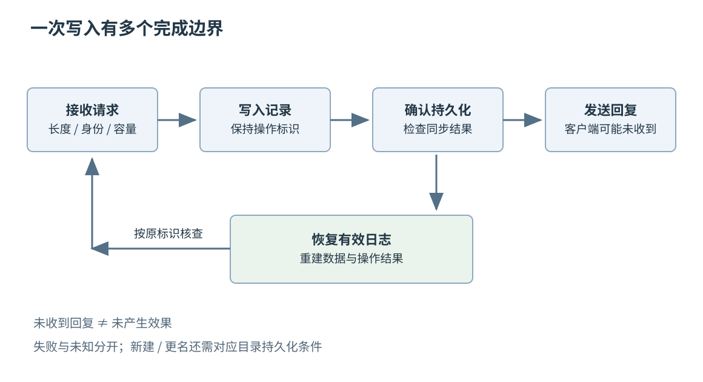
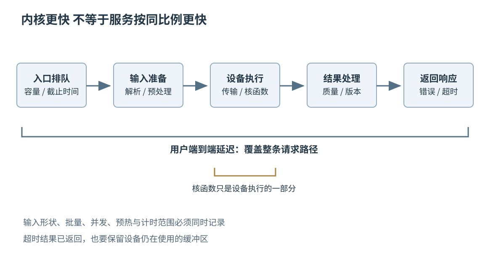
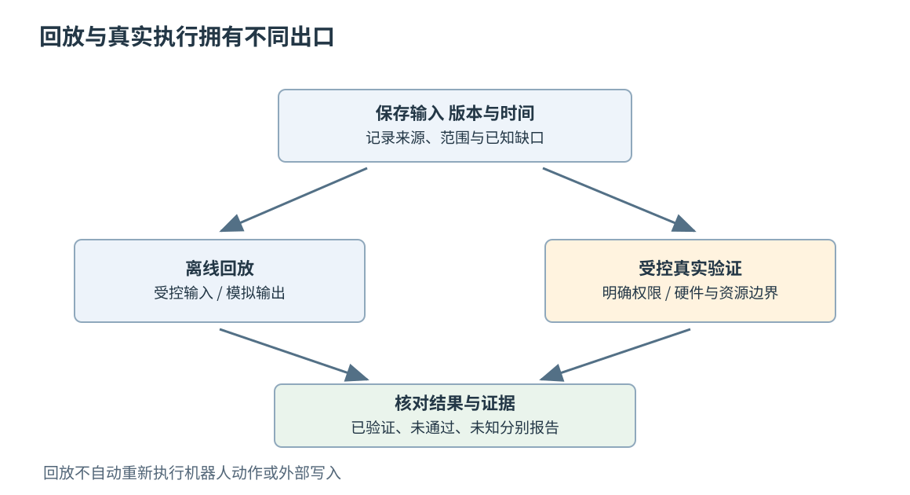

# 第五十八章 跨层工程项目与作品集

一个工程项目的价值，不在于同时列出了多少框架，而在于能否把一个需求沿着数据、控制和失败路径落实到底。事件循环接收了请求，存储是否已经持久化？设备进入低功耗，谁还能够唤醒它？GPU 内核算得更快，用户为什么仍在队列中等待？模型宣布完成，外部动作是否真的发生？这些问题跨越章节，却都要求同一种能力：把每一层的承诺连接起来，并为连接处留下证据。

**作品集**是可供别人检查的工程证据集合。它可以包含源代码、设计说明、构建身份、测试输入、故障记录和实验数据，但不能用漂亮截图代替未完成的验证。设计稿能证明分析能力，实际可复现的实现能增加实现证据，长期运行记录又能增加维护证据；三者有价值，也有不同边界。

本章使用四组原创教学案例，把全书的机制组合成具体设计与验收结论。案例中的约束、数字和故障轨迹都是明确构造的分析材料，没有声称这些项目已经部署、测量或通过测试。它们不是要求读者照做的练习，也不是一套未经运行验证的“生产代码”。一手资料仅用于相应平台机制；项目设计、预算与验收规则由本章给出。

## 58.1 事件驱动服务与崩溃恢复存储

### 58.1.1 从成功回复反推最小系统

考虑一个在单机上保存小型键值记录的服务。客户端可以提交写入，也可以按操作标识查询结果。我们为这个教学版本约定：单个值不超过 64 KiB；同一操作标识重试时只能对应同一份请求内容；服务返回“持久化成功”的写入，应在支持的存储环境发生进程崩溃并恢复后仍可查询。它不承诺机器永久损毁后的数据恢复，也不提供多机共识或跨多个键的事务。

这些限制决定架构。网络层负责分帧、长度和资源检查；请求进入有界队列；一个写入者决定日志顺序；恢复器根据有效记录重建内存索引；响应层只在满足确认条件后发送成功。单写入者牺牲一部分并行度，换取容易解释的顺序与恢复责任，是这个范围内有意的取舍。

最容易犯的错误是把网络 read、日志 write、持久化确认和客户端收到回复都叫作“完成”。本设计分别记录请求已接受、记录已写入、持久化已确认、回复已发送四个阶段。前一阶段成立，不自动推出后一阶段成立；客户端超时，也不能倒推前面阶段没有发生。

事件驱动适用于网络等待，不意味着磁盘持久化必须在同一事件循环里执行。若同步文件调用占住唯一网络线程，所有连接与定时器都会一起停顿。可以由独立存储执行环境承担写入与同步，结果再交回网络层；退出时必须等待这条完成路径，而不是先关掉负责回复的执行器。

### 58.1.2 协议先规定边界 再决定容器

请求包含协议版本、操作标识、键长、值长与负载。解析器先收齐固定头，再验证版本和长度，最后接收有限大小的负载。长度相加必须检查溢出，连接累计缓冲也有独立上限；一万个各自合法的小请求，仍可能耗尽总内存。

操作标识用于识别同一次业务意图，不是每次网络发送随机生成的新编号。服务保存该标识、请求内容身份与结果。相同标识配不同内容应拒绝为冲突；不能复用前一次成功结果来回答另一份写入。内容身份可以使用恰当的摘要和必要原始字段，但摘要方案的碰撞与安全前提也要说明。

去重还必须覆盖尚未提交的请求。本版本由同一写入者串行完成身份查找与登记，并同时检查在途表和已提交表；同内容的在途重试只关联原操作，不能再次追加。否则组提交中两份重复请求可能都在第一次同步前通过“尚未成功”的检查。为保持承诺，本教学版本在规定的数据容量内保留全部操作身份，容量用尽就拒绝新写；将来若引入过期删除，必须同时收窄可重试期限。

写队列达到上限时，可以拒绝新请求或让上游等待明确预算。已经接受的请求则需要有明确的状态查询与恢复途径，包括失败后暂时未知的状态，不能因为连接断开就随意从存储队列移除：它可能已经进入写入阶段。连接生命期与操作生命期因此必须分开，操作状态不应只寄存在 socket 对象里。

内存索引可以采用散列表，但它不是持久化真相。重启后允许从日志重建，索引内的一次赋值不能代替磁盘确认。读者看见的是哪个已提交版本，也需要约定：最简单的方案让读请求只观察已确认提交的索引，不把仍在等待同步的临时状态作为持久化结果返回。

### 58.1.3 日志记录要能够被保守地解释

一种教学日志记录可包含格式版本、记录总长、递增序号、操作标识、键值长度、负载与完整性校验。字段采用明确字节序与宽度，不直接把 C++ 结构体的内存写到文件。恢复器先检查最小头长度与最大记录长度，再解释内部字段，不能先相信损坏长度去分配巨大缓冲。

校验的作用是发现相应错误模型中的不完整或损坏记录，不等于密码学认证。校验通过也不自动证明一条记录已向客户端确认；它只说明这份记录可以按格式解释。恶意篡改、设备谎报持久化以及整个介质丢失，需要不同防护，不能用一个 CRC 的名字包办。

追加写可能只完成一部分。写入者应保存已写偏移，并正确处理后续进展和错误。若一条记录只写了一半后发生失败，不能继续把下一条记录接到未知位置，再希望恢复器“跳过坏记录”。本版本让日志进入需要恢复判定的状态，停止接受新写，确认有效末尾后才允许受控恢复。

单写入者意味着序号与物理追加由同一责任方维护，却不代表一次系统调用会原子写入整条记录。即使文件尾长度看起来已经增长，也可能尚未满足持久化条件。必须把格式可解析、写入接受和持久化完成作为不同证据。

### 58.1.4 确认点必须覆盖真实持久化条件

对已正确创建并建立目录持久化关系的日志，写入完整记录后调用适用的同步接口，并检查返回结果，是一个可解释的确认步骤。Linux 的 fsync 文档区分文件内容与目录项的持久化：同步文件不必然同步新建或更名的目录项。设备、文件系统和错误报告的实际契约也必须属于支持范围。[S1]

本设计只有在约定同步成功后，才更新可见提交状态并允许发送持久化成功响应。如果同步返回失败，不应把它简单解释成“肯定一个字节都没写进去”。结果可能处于未知范围，服务应保留证据、停止相关写入或进入受控恢复，而不是盲目重复产生另一个业务操作。

批量提交可以把多条完整记录放在一次同步前写入，以分摊固定开销。相应代价是早到请求要等后来的提交批次或超时预算。本版本采用“达到数量或时间界限即提交”的双条件；其中数值应通过目标负载确定，不能把论文中的某个最佳批量照搬成常数。

崩溃后还可能恢复出一条客户端没有收到成功回复的有效记录。这不违背“已经确认的不能丢失”，但意味着未确认不等于未执行。服务必须让同一操作标识查询到原结果，才能把重试变成结果确认，而不是重复写入。读写顺序、确认点与幂等记录应由同一日志事实支撑。

图 58-1 请求、提交与回复的不同边界。箭头表示教学设计，不代表已完成故障实验。

### 58.1.5 不同崩溃窗口给出不同结论

若进程在记录写入前崩溃，恢复后没有该操作的持久化事实，客户端可以按原标识重试。若在写入中途崩溃，恢复器可能遇到不完整尾部，不能把残留字节解释成成功。若记录已经持久化但回复尚未发送，恢复后应识别原操作，重复请求返回已有结果。若成功回复已被客户端观察，恢复后缺少相应记录，就违反了本设计的核心承诺。

还有一个必须说清的窗口：整条记录已写完，但同步尚未完成。恢复可能读到完整记录，也可能没有；尤其只发生进程崩溃时，重新读到的字节仍可能来自操作系统缓存。恢复契约不能依靠猜测崩溃前的同步结果。本版本选择接纳通过序号、格式、长度和校验检查的完整日志前缀，包括其中可能尚未回复的操作；处理不完整尾部后，先对保留的日志状态重新同步并检查结果，才发布可见索引、回答持久化成功或开放新写。同步失败仍进入受控修复，不因“能读出来”就宣布持久化成立。

恢复不能不加区分地“遇到任何校验失败就截断”。在明确的追加崩溃模型下，末尾的不完整记录可以按恢复策略处理；若已封存日志段中间出现损坏，后面还存在被确认记录，静默删除剩余数据会扩大损失。应保留原文件、报告损坏位置并进入受控修复路径，而不是为了启动成功修改证据。

假设日志中已有序号 41、42，43 只有半条。恢复器可以确认前两条的格式与校验，按上述接纳和重新同步规则恢复相应键值与操作身份；43 不进入索引。这里恢复的是本版本明确允许接纳的日志事实，不能假装找回了崩溃前不存在的内存确认标志。若截除不完整尾部，也要检查截断与随后同步的结果，避免下一次追加从残留半条记录之后开始。

将来增加压缩或快照时，还要建立新快照、目录切换与旧日志删除的顺序。没有验证新快照足以恢复并持久化之前，不能删除唯一旧证据。这个版本可以选择暂不压缩，以有限数据规模换取较小证明范围；公开容量限制比交付一个偶尔丢数据的“自动优化”更诚实。

### 58.1.6 验收看不变量 不只看接口能通

该项目的验收事实包括：每次已确认写入在恢复后可查询；相同标识同内容不会重复产生新逻辑写入；同标识不同内容被识别；不完整输入不会突破缓冲上限；关闭后没有悬空完成回调；磁盘满和同步失败不会被显示为成功。这些结论分别需要可追溯输入与观察结果。

故障注入应覆盖解析后、排队后、部分写后、同步前后和回复前后。只在空闲时结束进程，再成功启动一次，几乎没有覆盖最危险的窗口。进程强制结束测试与设备掉电测试也不是同一种故障模型；前者不能单独验证控制器缓存与掉电行为。

性能结果应分别给出接收吞吐、持久化提交吞吐、端到端延迟、队列等待和恢复时间，并附数据大小与同步策略。关闭持久化后获得的吞吐，可以用于分析瓶颈，但不能以同名曲线与持久化版本混比。若成功率统计把被背压拒绝的请求排除，也必须公开分母。

作品集中的解释可以很具体：“我选择单写入者，因为当前规模更需要明确提交顺序；瓶颈若经测量落在同步延迟，先评估组提交，而不是先把索引换成无锁表。”这比“用了高性能异步框架与自研数据库”更能说明设计责任。

## 58.2 低功耗设备网关与跨平台上位机

### 58.2.1 设备项目的边界包含电源和真实时间

考虑一个周期采样的电池节点，通过网关上传数据，并由桌面上位机显示设备状态和维护记录。这个教学系统只承担监测，不直接控制危险运动或关键供电。采样时刻、断网保留、固件版本与电量状态是数据契约的一部分，不能只实现“串口窗口能看到数字”。

节点、网关和上位机有不同职责。节点负责采样与有限缓存，网关负责连接管理和批量转发，上位机负责显示、配置与可审计维护。把所有重试放到节点可能增加电池消耗；把全部状态留在上位机又会让电脑关闭后设备失去连续性。部署条件决定责任分配。

低功耗不是一个无限关闭设备的模式。关掉无线电会影响接收命令，关掉时钟会影响时间基准，传感器重新上电可能需要稳定时间。Zephyr 的系统电源管理与设备运行时电源管理分别描述整机状态选择与设备使用状态，具体可用状态仍取决于芯片、板级和驱动支持。[S2]、[S3]

因此先定义允许的响应延迟。若设备每分钟醒来一次，且没有独立常开唤醒通道，就不能同时承诺任意时刻下发命令后十毫秒响应。网关和界面应显示“已排队等待设备醒来”，不能把提交给服务器等同于设备已经执行。

### 58.2.2 用一个完整周期计算能量预算

假设一个纯教学周期为 60 秒，全部电流都按同一电池输入端口径给出：采样与计算 0.12 秒、平均电流 8 mA；无线发送 0.08 秒、平均电流 35 mA；其余 59.8 秒为低功耗状态，电流 0.02 mA。忽略阶段重叠时，周期电荷消耗为 0.12×8＋0.08×35＋59.8×0.02＝4.956 mA·s，平均电流约为 0.0826 mA。这里先算的是电荷；若要算能量，还需要积分电压与电流的乘积。来自不同电压电源轨的电流，不能未经电压和转换效率折算就直接相加。

若仅用 1000 mAh 名义容量相除，得到约 12107 小时，也就是约 504 天。这只是理想算式：电池可用容量、温度、自放电、电源转换损耗、连接建立、失败重传、指示灯和静态泄漏都未计入。它可以揭示哪一阶段值得测量，不能印到产品页当作已经验证的续航。

若设备每次发送需要额外重试一次，增加的不只是空中发送时长，还可能包含等待响应、重新同步和唤醒成本。平均链路顺畅时的测量可能低估弱信号现场。应保存电流随时间变化的轨迹，用操作标记对齐采样、发送与休眠阶段，解释峰值和积分，而不是只读一个万用表平均值。

容量预算也要考虑峰值。电池和供电电路即使能提供足够总电荷，也可能在无线瞬时电流下压降复位。软件重试若再次触发同一峰值，可能形成重复启动环。此时修改睡眠平均电流并不能解决问题，需要把电气供电与启动状态纳入故障分析。

### 58.2.3 时间戳与序号承担不同身份

每条采样记录可以带设备身份、启动代际、单调序号、采样时钟值、测量值、单位和质量标记。序号帮助发现丢失与重复，时钟值帮助恢复时间关系；两者不能互相替代。设备重启后序号归零，如果没有启动代际，网关可能把新记录误认成旧数据重传。

墙上时钟适合显示日期，但校时可能让它跳变。单调时钟适合本次启动内的间隔，重启后又需要重新关联。网关可保存采样时钟与接收时间，附带估计偏差或同步状态，不把网络到达时间冒充真实采样时刻。未同步时应明确标识，而不是凭格式完整的日期掩盖未知。

断网缓存必须有上限及满时策略。可以保留最新采样、优先保留告警、或者停止采样并报告容量不足，不同选择对应不同产品需求。不能既声称无限离线保留，又只给有限闪存；也不能悄悄丢掉数据后仍展示一条连续无缺口曲线。

协议校验、长度上限、单位和版本采用第四章的方法。串口分段读取不等于消息分段，网关重复发送不等于重复采样。服务器的去重身份应与节点记录身份一致，不能每次转发都更换业务编号，然后依赖时间戳大致相近来猜是否重复。

### 58.2.4 上位机把显示状态与设备事实分开

界面至少区分最近连接时间、最近有效采样、待下发命令、设备确认和执行结果。一个绿色连接图标不能代替设备健康证明：连接可以仍在，传感器却已停止更新；最近收到的报文也可能只是心跳，没有新测量值。

Qt 6.8 的线程与 QObject 文档区分线程亲和、事件循环和跨线程连接；QWidget 及其子类只能在主线程使用。[S4] 本案例让通信和解析在明确的工作环境中运行，通过排队连接向界面交付拥有数据的快照或约定消息，再由主线程更新视图。直接连接会在发射信号的线程执行槽，不能仅凭“用了信号槽”就保证线程正确。快照属于哪个设备代际，也应带在消息中。

通信 QObject 的亲和线程、事件循环和销毁次序需要一致。QThread 对象通常仍属于创建它的线程，不会因为启动了线程就自动搬入工作线程；把通信槽随意写进 QThread 子类，可能误判槽在哪里运行。有父对象的 QObject 也不能直接 moveToThread。关闭时应先停止新工作，再让已有完成与清理路径结束；需要排队到工作线程的清理不能等事件循环永久退出后才投递。[S4]

设备断开以后，旧读取任务可能稍后完成。若窗口已经切到另一台设备，旧回调不能仅凭“当前窗口还活着”就把数据填入新设备界面。连接代际与任务身份可以帮助拒绝迟到数据，窗口关闭则要取消或汇合后台工作，最后才释放回调会访问的状态。

界面吞吐也有预算。采样每秒几千条时，逐条触发重绘可能让用户无法点击停止。可以保留完整采集数据，在显示层按窗口聚合或限频；但需要标明图表的聚合口径，不把显示降采样误说成原始采样精度。存储完整性与视觉响应是两项不同验收。

### 58.2.5 升级与回滚必须照顾断电窗口

固件升级至少涉及下载、完整性和来源验证、写入候选区域、启动选择、健康确认与失败回滚。完整下载不等于候选镜像可启动，启动一次不等于业务已经健康。若平台支持双区域或等效恢复机制，应说明每个阶段断电后由谁判断下一步。

版本回滚也受到数据兼容影响。新固件已经迁移持久化配置后，旧固件能否继续读取，不能只看代码镜像可以切回。可采用兼容格式、分阶段迁移或保留可恢复副本；具体安全启动、签名与防回滚策略必须按产品风险和平台资料设计，不能由本章示意替代实际安全评估。

升级操作应与设备身份和目标版本绑定。界面显示“升级完成”需要来自设备侧可验证事实，而不是上传进度到了百分之百。失败后的最后已知阶段、当前运行版本和恢复途径应可查询；不能让用户只能反复点击升级，进一步抹去现场证据。

维护接口也可能改变电源条件。接上调试探针或 USB 后，板子可能持续供电、改变休眠行为或多出漏电路径。实验报告应写明测量时是否连接这些设备，不能把调试台上的结果无条件推广到独立电池运行。

### 58.2.6 验收材料体现软硬件共同责任

一个可信的设备作品集可以把同一条事件串起来：节点序号出现缺口，网关日志记录离线窗口，电流轨迹显示反复唤醒，上位机显示缓存未确认，恢复连接后服务器只接收一份去重结果。每份材料都回答一个具体问题，而不是把逻辑分析仪、示波器和截图当作装饰。

真实硬件测量应记录板卡修订、固件构建、传感器与电源条件；模拟器结果应明确写为模拟。真实硬件照片可以帮助识别接口和测点，但照片本身不证明功耗、时序或电气安全。第三方板卡照片需要保留来源和使用许可，自己的照片也应避免泄露设备密钥和无关人员信息。

故障覆盖可以围绕采样中重启、网关掉线、缓存满、重复报文、时间跳变、升级中断及界面关闭来组织。安全相关操作应先在隔离测试台与适当硬件保护下验证；桌面软件能正常显示，并不构成设备安全认证。

该项目最有力的复盘，不是“完成了嵌入式、网络和跨平台开发”，而是解释一个真正跨层的决定。例如为减少重传唤醒增加本地批量缓存，同时公开最坏数据延迟、闪存写入压力和断电恢复条件。收益与代价一起讲清，才是工程设计。

## 58.3 GPU 算子和可测量模型服务

### 58.3.1 算子规格先于并行映射

考虑一个按行归一化的小算子，用于模型服务的输入处理。输入是 M 行、N 列的浮点数组，输出每个元素减去所在行均值，再除以按约定计算的标准差与稳定项。首先需要确定方差是总体形式还是样本形式，稳定项放在平方根内还是外，是否允许空行，以及 NaN 和无穷值如何处理。

这些区别改变数学函数，不是“实现细节”。CPU 参考实现与 GPU 实现若使用不同公式，即使普通随机输入差别很小，也不能直接认为 GPU 只存在浮点误差。形状、步长、数据类型、别名关系和有效输入范围应成为算子契约。

本案例选择 M、N 为正整数、行主序连续布局、FP32 输入输出且互不重叠，拒绝包含 NaN 或无穷值的请求。对每行 x，数学契约明确为：μ＝Σxⱼ／N，v＝Σ(xⱼ−μ)²／N，yⱼ＝(xⱼ−μ)／√(v＋ε)，其中 ε 是有限且严格为正的配置参数，位于平方根内；若输入有物理单位，ε 的单位应与方差一致。这里没有可学习的缩放或偏置项，也没有采用除以 N−1 的样本方差。单元素行与常数行在精确算术下输出为零，这给独立参照提供了简单的核对点。

输入有限仍不保证有限精度中间运算不会溢出。实现规格还要限制形状与幅值、固定累加精度，并规定发现中间非有限值时返回数值错误，而不是发布“归一化成功”。参考路径可用较高精度的两遍计算，但较高精度仍不是数学真值；候选路径的累加顺序和误差应接受同一契约审查。先缩小范围，再扩展非连续张量、低精度或特殊值，比悄悄计算错误更利于集成。

GPU 线程如何分组，需要服务于这份规格。每行由一个线程块处理是一种候选，长行可能需要分阶段归约，小行又可能由一个块处理多行。没有一种映射天然覆盖所有 M、N；无有效元素的线程可以向求和归约提供零，但是否允许提前退出，要按所选同步原语与算法的参与规则判断。例如 Cooperative Groups 的集体操作要求组内线程共同参与，不能只屏蔽越界访存，却让必需参与者跳过集体操作。[S10]

### 58.3.2 正确性比较需要独立参照和误差规则

参考路径应尽量简单，避免直接复制优化内核的索引和归约代码，否则相同错误可能在两边一起出现。输入集合包括单元素、非整齐长度、常数行、较大与较小幅值、正负抵消，以及符合已约定范围的边界。随机数据补充覆盖，不代替这些有目的的结构。

浮点归约改变运算顺序，结果不一定逐位相同。NVIDIA 的 CUDA 最佳实践说明了参照比较和数值精度的关系。[S5] 误差判定可以采用绝对误差与相对误差组合，但阈值应依据数据类型、问题尺度和下游容忍度确定，不能在看到失败后不断放宽，直到所有版本都通过。

例如检查 |候选值−参考值| ≤ a＋r×|参考值|，其中 a 控制接近零的误差，r 控制相对尺度。这是判定形式，不是给任何归一化算子提供通用 a、r。NaN、无穷、溢出和不支持输入要使用单独规则，因为普通差值比较可能根本不能表达预期结论。

数值正确还不包含全部内存正确。越界线程可能恰好写到未检查区域，错误索引可能在某个整齐形状中碰巧成立。应把地址范围、步长和同步关系分别检查；检测工具发现的问题需要修复，没有报告则只增加相应覆盖范围内的信心。

### 58.3.3 核函数计时与请求延迟不是同一曲线

GPU 提交常是异步的，主机记录一次发起调用的耗时，不等于设备已经算完。适当的事件或同步边界可以测量指定工作区间，测量本身又可能改变流水线。必须记录计时覆盖哪条流、是否包含传输、是否预热及如何等待完成。[S5]

假设一组教学估算中，单请求设备计算为 0.4 毫秒，数据准备与传输为 0.8 毫秒，排队为 2 毫秒，协议与后处理为 0.3 毫秒。串行简单模型的总延迟为 3.5 毫秒。把设备计算缩短一半，只节约 0.2 毫秒，总量变为 3.3 毫秒，约减少 5.7%，而不是整个服务快了一倍。

真实系统可以重叠传输和计算，也会有并发竞争，因此上述加法只适用于明确的简化路径。但它揭示一个重要检查：优化报告中的“二倍”究竟对应内核时间、吞吐、某个形状，还是用户请求？指标名称应把这个范围直接写出来。

吞吐和延迟也不互相替代。扩大批量可能提高每秒样本数，同时让低流量请求等待更久；增加并发可能掩盖单次提交成本，却提高显存占用。每张曲线都应附批量、并发、输入分布、硬件与软件构建身份，不能只展示最有利的一点。

图 58-2 算子性能与服务性能的不同测量范围。图中没有比例长度或实测数字。

### 58.3.4 将算子接入服务时重新检查生命周期

服务入口接收请求，验证形状与内容，获取有限的执行资格，准备设备缓冲，提交计算，再等待结果与返回。每个在途请求都有拥有者，不能在客户端超时后直接释放仍被设备使用的输入输出。取消业务结果与设备真正停止、缓冲可复用，是不同状态。

模型、权重、执行上下文和临时内存也有共享边界。哪些对象可供多个线程共享，哪些对象必须为并发执行分别准备，应按所选推理运行时版本检查。例如 TensorRT 官方架构文档明确区分共享引擎上的允许操作与执行上下文的并发使用；同一个执行上下文不能被多个线程同时用于执行。[S9] 不能把“同一模型”误解成“同一可变执行状态可以任意并发使用”。官方性能资料也把可重复测量、内存边界与运行环境纳入部署检查。[S6]

本案例可以先采用固定模型和有限形状集合，使用预先准备的缓冲池。这样能够明确每种请求需要多少资源，却降低了动态输入的灵活性。将来支持任意动态形状时，要增加构建、缓存与内存上限，不能只放宽入口检查就声称扩展完成。

错误也要按层处理。输入非法可以在入口拒绝，容量不足可以背压；设备执行错误则可能需要隔离相关执行状态或重建进程，不能统一“捕获异常后继续下一请求”。具体可恢复范围来自运行时与设备契约，而不是 C++ catch 的存在。

### 58.3.5 模型更新必须保持结果和版本可追溯

一次响应应能关联模型版本、预处理版本、算子构建与必要配置。仅记录模型文件名不够，同名文件可能已经变化；只有代码提交也不够，权重、精度模式与构建选项可能不同。身份记录应能够重建当时真正使用的组合。

更新模型可以先让新版本独立加载和预热，再将新请求切换过去；旧请求继续由旧版本完成，之后回收旧资源。这是一种候选生命周期设计，要求切换点、内存峰值与失败回退都清楚。若设备放不下两份模型，就需要另一种受控切换方式，不能假定双版本共存免费。

量化或更低精度可能改善性能，也可能改变下游质量。需要保持独立的数据与评价口径，不把调优集上的小误差自动当作所有业务输入都安全。若输出用于高后果决策，更需要领域验证；一个技术作品集的吞吐测试并不能承担这类应用保证。

模型文件和引擎产物也跨越信任边界。应使用可信来源并保存完整性信息，不把任意外部二进制引擎直接反序列化进主服务；TensorRT 的官方说明也明确将引擎反序列化视为原生代码执行的信任边界。[S9] 性能优化不能抵消产物身份、权限和加载路径管理；第二十四章、第二十六章与第四十五至四十七章的相关机制在这里同时发挥作用。

### 58.3.6 作品证据解释为何保留或放弃优化

一个有说服力的优化记录会说明：发现什么瓶颈，用什么参照保证正确，改了哪一层，在什么输入上收益成立，额外成本是什么。若融合两个步骤减少显存读写，却因为寄存器压力使大形状变慢，应保留这份负结果，解释适用边界，而不是只删除不利曲线。

服务验收应包含冷启动、稳态、突发、超时、取消、显存不足、模型切换及关闭时在途请求。负载发生器要记录请求到达计划与真实发送时刻，避免系统变慢时它也自动减少请求，却仍报告漂亮的尾延迟。请求失败、拒绝和超时应与成功延迟一起呈现。

如果没有 GPU 或不具备受控测试环境，可以交付独立参考实现、算子契约、内存访问分析与待验证假设，但必须这样标识。设备规格乘算出来的带宽只是理论预算，不是自己的测量；从别人的图表抄一个数字，也不能变成作品能力证据。

更成熟的项目结论可能是没有采用最复杂的自研算子：现有库已经覆盖所需形状，瓶颈在输入预处理和排队，自研维护成本不值得。能够依据正确性和测量拒绝不必要的优化，与成功优化一样体现工程判断。

## 58.4 机器人回放或可恢复 Agent 的验收与复盘

### 58.4.1 回放重现输入 不自动重现整个世界

机器人系统可以记录传感器消息、坐标关系、参数、软件构建和时间信息，再把记录交给离线处理管线。ROS 2 的 rosbag2 提供带时间信息的通信记录与回放能力；本章参考其 Jazzy 分支资料，不将其视为任意系统确定性重现的承诺。[S7]

同一袋消息再次播放，线程调度、处理速度、随机数、外部服务和未记录状态仍可能不同。回放时间与传感器时间也不必是同一个字段。先确定要重现的是算法输入、消息顺序、时间推进还是整个执行，才能判断还需要保存什么。

例如某次定位突然跳变，记录中既有传感器数据也有坐标变换。若只回放传感器而采用当前机器的新标定，结果不同并不证明原问题已经修复；若处理节点使用真实时钟而回放使用模拟时间，超时逻辑也可能走另一条路径。版本、时间与坐标三者应一起核查。

本案例的离线回放默认断开真实执行器输出，控制命令交给记录或模拟接收端。发布前还应核查允许回放的消息集合与连接拓扑，避免记录中的旧控制命令绕过处理管线直接进入执行器；仅更改一个话题名，不能代替对真实驱动、网络桥接与硬件出口的隔离确认。分析文件不应意外驱动实际机器人；是否进入真实场地测试，应由相应安全流程、人员和设备条件决定。能够回放成功，不等于已经证明闭环控制安全。

### 58.4.2 给机器人故障建立可比较的观察点

可以把处理路径分为输入完整性、同步与坐标、估计结果、规划或控制输出四层。每层保存适当的输入身份与结果摘要，使一个最终轨迹差异能够被定位到首次分歧位置。只比较视频中“走得像不像”，很难区别数据不同、标定不同和算法不同。

若一次时间同步错误使相机与惯性数据错配，后续优化定位算法可能只是掩盖误差。应先比较各消息时间、接收延迟、缺失区间与同步策略，再评价估计变化。记录丢失也必须显式出现，不能用插值后的平滑图让读者误以为原始传感器一直正常。

验收阈值应与用途相符。离线轨迹误差、运行延迟、丢帧率、内存峰值和失败检测时间分别描述不同性质。一个平均轨迹误差很小的版本，仍可能在短暂退化时产生危险输出；一个每次输出都合理的版本，若长期晚于控制截止时间，同样不满足系统需求。

比较新旧版本时，使用相同记录、相同配置与明确评价程序，并保留失败片段，而不是只挑环境最简单的一段。若引入随机过程，要记录相关种子及仍不可控的因素；多次运行的一致性也应作为观察结果，而不是由“用了同一个 seed”直接推定。

### 58.4.3 Agent 回放需要区分模型输出与真实副作用

可恢复 Agent 的案例可以选择“读取资料，形成报告，并在允许范围内创建一次记录”。它包含模型推断、工具读取、可能的外部写入、任务记忆与恢复。与机器人一样，保存输入有价值；与纯算法不同，重新调用外部工具可能再次改变世界，不能把回放默认实现为重做全部动作。

因此将记录分为三类：模型请求与返回、工具请求与已观察结果、业务副作用身份与确认事实。离线评估时可用受控工具结果重放决策，真实执行时则按现时权限与外部状态判断。保存的一句“已批准”不能无限期替代当前操作所需授权，保存的一句“已完成”也不能替代可核验对象身份。

MCP 2025-11-25 的 Tasks 是需要能力协商的实验性机制，可帮助表达长任务状态和取得结果，但不保证业务副作用恰好一次，也不保证永久保留任务档案。[S8] 项目仍需定义操作身份、结果保留、失败恢复和已过期任务如何解释，不能因为有 taskId 就删除自己的业务证据。

一个安全的回放器应默认不访问真实写入端点。若确实需要端到端演练，采用隔离测试数据与明确授权范围，标注哪些结果来自替身、哪些来自真实服务。把模型在固定材料上得到好答案，写成“生产 Agent 自动完成率已验证”，会跨越明显的证据边界。

### 58.4.4 未知结果是需要处理的状态

设系统已发送“创建记录”请求，对方可能已经接受，但响应在途中丢失。恢复后最重要的事实是结果未知，而不是失败。它应先用稳定操作标识或提供方支持的查询接口确认原效果，再决定是否重试；若没有去重或查询条件，就需要保留未知并交由适当流程处理。

“查询没有找到”也需要解释：结果索引可能尚未更新，原执行者也可能仍在完成请求，不能把一次空列表当成确定未发生。重试应服从提供方的幂等作用域、参数一致性与保留期限；执行者切换还要阻止旧执行者继续提交同一意图，或依靠覆盖该竞争的服务端去重。超过去重期限而又没有权威终态时，恢复器应继续保留未知，不更换标识重新创建。

可以构造三条验收轨迹。第一条在外部调用前中断，恢复后继续同一意图；第二条在外部效果已存在、结果尚未记入本地时中断，恢复后应核查到已有对象；第三条在结果已保存后重复触发恢复，不应再次创建。三条轨迹分别验证状态持久化、效果核查和去重，而不是只验证“重启后进程还活着”。

用户中途缩小权限或要求停止时，恢复器还要重新检查当前允许范围。已产生的效果应报告和记录，未发起的后续动作应停止；是否撤销原效果是另一项业务决定，不应擅自把停止理解为删除已经创建的对象。技术恢复与用户意图必须同时成立。

多 Agent 分工增加的是并行处理能力，不增加权限总量。各执行者返回的证据需要核对来源、版本和范围；三个执行者重复引用同一错误材料，不等于三个独立确认。合并者也不能把某个分支的“我成功了”直接当作整个任务的验收结论。

图 58-3 回放、执行与验收的证据边界。机器人执行器与 Agent 写入工具都需要独立的受控出口。

### 58.4.5 评估成功率要保留真实分母

一个 Agent 的任务完成率应先定义什么是任务、什么是成功、哪些条件属于不支持范围。若把需要人工接管的情况全部从样本中删除，再报告很高成功率，就掩盖了系统最需要说明的边界。可以同时报告自动完成、需要澄清、受权限限制、工具失败与结果未知，而不强行压成一个数字。

机器人回放也有类似问题。只统计成功处理的帧，会隐藏因为超时或输入错误被丢弃的部分。需要让输入总数、有效处理、拒绝、丢失和未决结果能够核对，结果质量与覆盖率一起看。一个准确但只回答简单样本的系统，不能仅用准确率代表完整能力。

评估数据应与开发调优材料分开，并保存版本。模型、提示词、工具说明、检索库和权限策略任何一项改变，都可能改变 Agent 行为；标定、参数、时间策略与计算平台改变，也会改变机器人处理。可复现不是承诺永远得到逐字或逐位相同输出，而是让差异可定位、结论可检验。

成本包括运行时间、设备资源、模型调用、外部请求和人工恢复。多试十次取最好的结果，不能与只允许一次的系统直接比较；让用户不断补充信息也属于完成成本。评价应沿用户实际要达到的结果计量，而不是沿某个内部组件最容易取得的指标计量。

### 58.4.6 一份完整复盘让经验能够迁移

复盘先写事实：需求与约束是什么，实际发生了什么，哪些观察支持结论，哪些仍然未知。随后解释原因链，区分触发条件、使错误发生的设计缺口与放大后果的环境。最后给出修复与验证，说明它消除了什么、还保留什么限制。

例如“恢复后重复创建记录”的根因不能只写为“网络不稳定”。网络丢响应是触发条件，恢复逻辑把未知当失败并更换操作身份才是重复效果的关键。修复应涉及状态表示、原效果核查和稳定身份，验证则覆盖响应丢失窗口；增加重试次数反而可能放大问题。

又如“回放时定位变差”不能直接归罪于算法版本。先核对数据、标定、时间与资源预算，确认首次差异在哪一层，才有理由讨论算法修正。一个好的项目复盘会保留当时被排除的假设和反证，使后来者不必重复相同盲查。

作品集的最后一页可以直接给出证据边界：已经实现和验证的功能，已知失败场景，尚未覆盖的平台，以及下一项最有价值的验证。它不是隐藏不足的免责声明，而是别人能够安全理解并继续工作的接口。第五十七章的面试追问，也正应沿这些真实证据继续深入。

从一条字节序规则到一次完整交付，从一个对象的生命周期到一个系统的恢复，工程知识的意义始终在于建立可以检查的关系。工具、标准和平台会继续变化；需求能被说明，机制能被推导，失败能被定位，取舍能被比较，结果能被验证，这些能力使变化中的知识真正成为长期可用的专业判断。

## 来源与阅读边界

核验日期：2026-10-03。全部项目、数字与故障轨迹为原创教学构造，未执行项目代码、硬件实验、模型推理、机器人回放或外部业务动作。本章没有给出未实施测试的通过结果。

- [S1] Linux man-pages，fsync(2)：文件同步、目录项与错误边界
- [S2] Zephyr，System Power Management：系统级电源状态与策略
- [S3] Zephyr，Device Runtime Power Management：设备使用与运行时电源管理
- [S4] Qt 6.8，Threads and QObjects：线程亲和与事件驱动对象
- [S5] NVIDIA CUDA C++ Best Practices Guide：参照验证、数值差异与计时边界；不照搬其中历史设备性能为本项目结果
- [S6] NVIDIA TensorRT，Best Practices：可重复测量、资源边界与部署环境；本章不提供声称兼容所有版本的运行时代码
- [S7] ROS 2 rosbag2，Jazzy 分支 README：记录与回放、模拟时间；分支文档仍需与实际安装版本对应
- [S8] MCP 2025-11-25，Tasks：实验性任务能力及其生命周期边界
- [S9] NVIDIA TensorRT，How TensorRT Works：执行上下文的并发边界与引擎反序列化信任边界；滚动文档，应与实际部署版本核对
- [S10] NVIDIA CUDA Programming Guide，Device-Callable APIs and Intrinsics：Cooperative Groups 集体操作的参与要求；不把它推广为所有同步原语完全相同的退出规则

[S1]: https://man7.org/linux/man-pages/man2/fsync.2.html
[S2]: https://docs.zephyrproject.org/latest/services/pm/system.html
[S3]: https://docs.zephyrproject.org/latest/services/pm/device_runtime.html
[S4]: https://doc.qt.io/qt-6.8/threads-qobject.html
[S5]: https://docs.nvidia.com/cuda/cuda-c-best-practices-guide/index.html
[S6]: https://docs.nvidia.com/deeplearning/tensorrt/latest/performance/best-practices.html
[S7]: https://github.com/ros2/rosbag2/tree/jazzy
[S8]: https://modelcontextprotocol.io/specification/2025-11-25/basic/utilities/tasks
[S9]: https://docs.nvidia.com/deeplearning/tensorrt/latest/architecture/how-trt-works.html
[S10]: https://docs.nvidia.com/cuda/cuda-programming-guide/05-appendices/device-callable-apis.html
