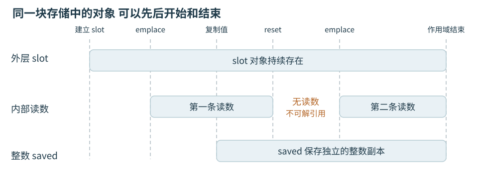
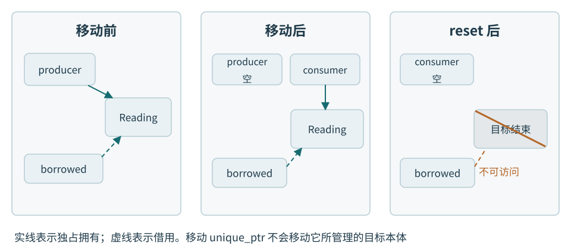
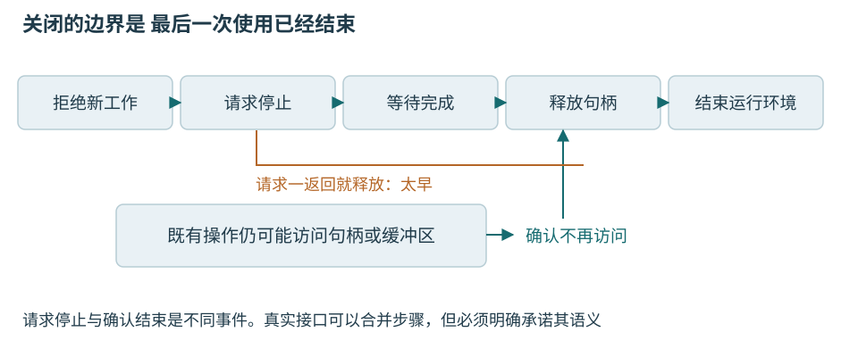

# 第二章 C++程序 对象与资源生命期

温度采集工站会不断建立一条条读数，暂存数据，打开设备连接，再在一次采集结束后清理。读数可以复制，连接通常不能靠复制一个地址就变成两条；界面还要显示结果时，采集函数可能早已返回。这些差别决定了一个程序为什么会正常工作，也决定了它为何在退出、失败或第二次连接时出错。

本章先用短程序说明对象、存储、作用域与生命期，再把同一套规则用于借用、资源所有权、构造析构和设备句柄。重点是判断谁必须活到什么时候、谁负责最后清理，以及失败时这项责任是否仍然成立。语法只讲到读懂这些关系所需的程度，构建工具和后台线程留到后面的章节。

示例按C++20语义讲解，温度节点只作为低压采集设备的背景。本章没有编译、运行代码或连接真实设备；所有输出和故障经过都是教学推演。带有SDK名称的接口是明确约定行为的教学接口，不对应某家厂商的可直接调用代码。

## 一 程序运行起来以后 才有对象的经历

### 源文件不是正在运行的工站

源文件记录类型、函数和操作；编译检查并翻译各部分，链接把它们所需的定义组合起来。桌面系统装载程序后，才出现一次运行实例。相同可执行文件启动两次，并不会因此共享所有局部变量；同一次运行却可能连续处理许多温度节点。这里先把“程序这份文件”和“这次执行中的数据”分开，编译、库和装载的细节在第五章继续说明。

普通桌面C++程序有一个入口函数main，但不能理解成机器的第一条指令就是它。运行环境还会完成必要的启动工作，一些对象可能在进入main以前已经初始化。MCU固件还涉及复位入口、启动代码和运行库初始化，是否采用完整的宿主环境由实现决定。先知道存在这层背景，就不会把所有对象都误画成在main的第一行同时诞生。[1]

下面的记录表示一份已经解码的温度读数。m°C是毫摄氏度，25000表示25.000°C；sequence是本次示例中的采样序号。它是进程内部的数据模型，不是把整个结构体原样发送到串口的报文布局。本章假定目标平台的int能表示示例范围，包括50000；标准并不保证所有实现的int都是32位，迁移时仍要检查数值范围。[1]

```cpp
// 教学片段：类型与函数定义，未编译、未运行。
struct TemperatureReading {
    int temperature_mC{};
    unsigned sequence{};
};

bool within_demo_limit(const TemperatureReading& reading) {
    return reading.temperature_mC >= 0
        && reading.temperature_mC <= 50000;
}

int main() {
    TemperatureReading latest{25000, 1};
    bool accepted = within_demo_limit(latest);
    return accepted ? 0 : 1;
}
```

struct把相关字段放进一种类型。类型说明值怎样解释、允许哪些操作；latest则是这次执行中实际建立的一个对象。latest里的两个成员也是对象，accepted这个布尔值同样是对象。C++中的对象不只指“面向对象编程里的复杂类实例”。函数本身不属于这里讨论的数据对象。[1]

花括号中的25000和1用于初始化两个成员。初始化建立初始状态；以后写latest.temperature_mC = 26000，是修改已有对象的值。两次赋不同温度并不意味着latest被销毁又重新构造。判断生命期时，应寻找创建和销毁操作，而不是每一次数值变化。

例中的const TemperatureReading&稍后会解释为只读借用。函数在这次调用内检查读数，不保存地址。这里的0至50°C只是说明分支的演示范围，不能据此判定真实产品是否合格；生产限值需要来源、版本、测量条件和适用对象。

### 对象存在 不等于值已经准备好

声明局部int count;并不自动给它一个可放心读取的零。在本章C++20基线下，读取这种尚未获得确定值的普通整数会触及未定义行为。写int count{};才在这个例子里把它初始化为零。给记录字段默认值可以减少遗漏，但零是否代表有效测量，仍须由业务说明。[1]

“未定义行为”不是一种允许出现随机数的正常运行模式。它意味着标准不再为相关程序行为提供保证，表现可能随优化、输入和周围代码改变。能编译、刚才没崩溃、调试器里看着像正确温度，都不能证明访问合法。应分别检查对象是否存在、值是否已准备好、访问是否在边界内。

温度读取失败时，用默认零度冒充有效读数尤其危险。后面的例子用std::optional表示“这次有没有一条读数”；这样，缺少结果与测到0°C才不会被同一个整数混在一起。这是在类型里保留状态含义，并非optional会自动识别传感器故障。

## 二 名字 存储与对象生命期是三件事

### 作用域回答在哪里能使用这个名字

作用域是源码中的名字可见范围。普通局部名字通常在所在块内使用，花括号提供了直观边界。生命期则是运行时属性：对象什么时候开始存在，什么时候结束。名字看不见了，并不总表示对象结束；保留着地址，也不表示目标还存在。

```cpp
// 教学函数：仅用于单线程示意，未编译、未运行。
unsigned next_demo_sequence() {
    static unsigned next{0};
    ++next;
    return next;
}
```

next的名字只在函数内部可见，但static使它不在每次返回时销毁。下次调用使用的是同一个对象。这种局部静态对象的动态初始化若有需要，会在控制流第一次经过声明时完成；不是每次调用重新建立。此例中的初始化还可能在更早的静态初始化阶段完成，不应把“首次执行声明”当作所有static初始值唯一可能的准备时刻。[2]

这个例子也有刻意留下的业务边界：计数会受整数范围限制，多线程并发递增需要同步，重启后也不保证序号连续。因此它只能帮助理解名字与生命期，不是生产用的全局唯一编号器。延长一个变量的存续时间，不会自动补齐它的线程安全或业务身份。

### 存储期回答空间按什么规则保留

存储是承载对象所需的空间，还必须满足类型要求的大小与对齐。存储期描述这份存储持续存在的规则。入门阶段最常用三种：

- 自动存储期：普通块内局部对象常属于这一类，在执行经过声明时初始化，按相应退出规则销毁
- 静态存储期：例如命名空间作用域变量、局部static变量，其存储覆盖程序运行期间；对象初始化和销毁仍各有时机
- 动态存储期：通过适用的new表达式等机制建立，销毁时机不能只看创建语句所在的花括号

C++还规定线程存储期，thread_local为每个相应线程提供独立实例。本章暂不展开。以上是语言分类，不是“栈、全局区、堆”三张物理内存图。许多实现确实用调用栈管理局部数据，用分配器管理动态存储，但寄存器和优化也可能参与；标准并未要求每个自动对象必须放在一个名叫栈的区域。[2]

一个局部指针本身可以有自动存储期，它指向的对象却有动态存储期。指针离开作用域只结束指针自己的生命，不会因为曾保存过地址就自动释放目标。反过来，一个局部智能指针也可以有自动存储期，它通过析构规则主动释放所拥有的动态对象。这是管理责任与存储分类的组合，不是矛盾。

### 空间留下来 内部对象也可能已经结束

对本章的普通对象，可以先按“取得合适存储，完成初始化，使用，销毁”理解。精确地说，类对象的生命期通常在初始化完成时开始，在析构函数调用开始时结束；构造和析构阶段另有专门规则。这不妨碍析构函数按规则清理成员，但外部代码不能在此时继续把它当成正常工作的对象。[1]

std::optional<T>表示内部可能有一个T，也可能没有。std::表示名称来自标准库的命名空间；尖括号中的T指定所容纳的类型，换成TemperatureReading就得到用于这种读数的optional。下例能把存储与生命期拆开，而不需要手写原始内存操作。

```cpp
// 教学函数体片段，需 <optional> 及前述类型。
// 未编译、未运行。
std::optional<TemperatureReading> slot;
slot.emplace(TemperatureReading{25000, 1});
int saved = slot->temperature_mC;
slot.reset();                 // 内部读数结束生命
// slot仍存在，但此处不能读取slot->temperature_mC。
slot.emplace(TemperatureReading{26000, 2});
```

reset之后，外层slot仍然可查询、可再次放入读数；原来那一条读数却已结束生命。第二次emplace建立的是新的内部读数。saved保存了自己的整数副本，所以不依赖原读数继续存在。optional在自身内部容纳所含值，并不需要为这个内部值另外动态分配；这里用它表达“暂时为空”，而非展示内存池的实现。[3]



图02-1 存储仍在与读数仍在并非同一回事。上轨表示外层slot，下轨表示内部读数；reset结束内部对象，emplace建立新对象，图中不规定optional的字段布局。

<!-- 图示意图：横轴依次为slot建立、emplace第一条读数、复制saved、reset、emplace第二条读数、离开作用域。slot轨道连续；内部读数轨道分两段，中间明确标“无读数 不可解引用”；saved从复制点向右延续到其自身作用域结束。不要画成reset归还整块slot存储，不要暗示两个内部对象因地址可能相同而是同一条业务记录。 -->

同样的区分也存在于容器：vector的存储容量还在，已经删除的元素也不因此继续活着。一个地址被另一个对象复用，更不能证明它仍代表原来的采样。后面排障时，我们会同时追踪对象、所有者和使用时刻，不能只盯着地址数值。

## 三 复制一份值 还是借用原对象

### 引用和指针都能形成借用

把一条读数按值传给函数，会建立供函数使用的参数对象；把引用传过去，则让函数访问原对象。对于TemperatureReading这样的简单记录，复制后两个对象各自保存字段。对有资源的复杂类型，复制行为的具体含义由类型定义，不能只看赋值号猜测。

```cpp
// 教学函数体片段，未编译、未运行。
TemperatureReading source{25000, 1};
TemperatureReading copy = source;
TemperatureReading& alias = source;
TemperatureReading* pointer = &source;

alias.temperature_mC = 26000;
pointer->sequence = 2;
// source现为26000和2，copy仍为25000和1。
```

这里的&有两个位置、两种用途：声明中的TemperatureReading&表示引用，表达式&source取得地址。pointer->sequence通过指针访问目标成员。引用可理解为已绑定对象的另一个名字；引用建立后不能改绑，给alias赋值是在修改原对象。指针本身是一个可改值的对象，还可以为nullptr，表示目前没有目标。

如果接收方只使用对象，不接管保留和释放责任，这种关系叫借用。现代C++工程通常用普通引用、裸指针或视图表达它。语言没有替每个裸指针实施借用检查，旧式接口也可能通过裸指针转移所有权，因此必须读接口契约，不能看到星号就一概判定谁负责释放。[4]

const引用主要限制通过这条路径修改对象。它没有复制数据，也不是存活保证。如果其他允许修改的路径把温度改成26°C，稍后经const引用观察到的也是新值。确实需要“采集当时的内容”，应保存值的快照；需要“读取当前对象”，才借用当前对象。

### 借用要写明结束点

同步函数可以约定只在调用期间借用，不把地址存进成员或回调。这样，调用方保证目标覆盖这次调用即可。若函数保存地址，真实结束点便可能延后到队列消费、回调注销或设备操作完成。函数返回只是提交结束，不一定是使用结束。

返回局部对象的地址或引用，就是最直接的违约。对象在函数退出时结束，调用方得到的却只是一条访问路径。把返回类型加上const不能补救；给指针加一次非空检查也不能重新建立目标。C++不会在对象销毁时自动找出所有借用者，再把它们一一置空。对已经失效的指针值本身还可能有使用限制，更不应把它当作通用存活探针。[1][2]

临时对象还有另一种容易误判的边界。局部const引用直接绑定某些临时对象，可以按语言规则延长其生命；但把这个引用再从函数返回，不会任意接力延长。一个只保存字符地址和长度的std::string_view也不会保留来源字符串。需要长期保存几个字符时，拥有字符的std::string通常更容易解释。[5]

即使所有者没销毁，借用也可能失效。vector扩容重新分配会使原元素地址、引用和迭代器失效。删除元素也有自己的失效规则。因此“容器还在”和“这一个元素访问入口仍有效”必须分别检查。预留容量只在限定操作与容量条件下减少重分配，不能一概修复删除、越界或跨线程访问。[6]

### 故障推理 温度文字偶尔变成上一台设备的内容

设想工站把最新温度组成一行文本，稍后更新界面。短时间调试看起来正常，重复采集后偶尔出现乱码，或显示一段属于另一台节点的文字。这个现象本身还不能区分字符编码错误、缓冲越界和借用失效，先看“稍后”到底保存了什么。

```cpp
// 反例片段，需 <string> <string_view> <functional>。
// post保存回调并在本函数返回后调用；未编译、未运行。
void post(std::function<void()> job);
void show_text(std::string_view text);

void publish_temperature(int value_mC) {
    std::string text = std::to_string(value_mC);
    std::string_view view{text};
    post([view] { show_text(view); });
}
```

代码中的[view] { ... }建立一个lambda函数对象：方括号说明保存哪些外部数据，花括号是以后调用时执行的内容。std::function<void()>在这里用于保存无参数、无返回值的回调。

需要补充三项事实：post会不会立刻执行，show_text会不会继续保存输入，以及text在回调执行前是否已经销毁。按例中约定，post只把回调保存起来，publish_temperature随后返回，text结束生命。回调按值捕获的是view，这只复制视图的访问信息，没有复制字符。回调后来读取字符时，来源已经不在。

这条时间关系足以解释代码缺陷，不需要靠多跑几次把乱码“跑出来”。若只是编码错误，字符存储仍应有合法拥有者；这里即使全部字符都是数字，借用仍越过了寿命边界。若怀疑越界，应独立检查写入长度，但修复越界也不会延长text。内存被再次使用时，旧地址恰好装入另一段可读内容，才会让错误看起来像读数串台；具体表现不受保证。

修复应把真正需要的字符交给回调拥有，例如post([text] { show_text(text); });。这会把字符串值保存在回调对象里，字符寿命覆盖这次调用；如果show_text也保存视图，还必须继续处理下一层责任。此处没有顺手把所有对象改成shared_ptr，因为任务只需要一份很小的显示数据。

验收时应让回调确定在发布函数返回之后运行，连续提交不同温度，再覆盖队列丢弃与正常消费两条路径。检查保存的是拥有型字符串，及最后一层消费者是否只同步读取。可在目标平台使用内存检测工具辅助发现实际执行中的悬空，但一次没有报错不能替代上述证明。本章未执行这些验证。

## 四 让清理跟着对象走

### 资源不仅是动态内存

打开的设备连接、文件、互斥锁的持有状态和动态缓冲区，都会占用某种有限能力，需要在合适时机归还。资源所有权是保留和释放责任；它不等于“谁能读取”，也不等于业务数据归谁。显示模块有权看温度，并不因此有权关闭采集模块借给它的设备句柄。

手工写open、使用、close的问题，不只在于忘写一次close。每增加一个提前return或可能失败的调用，都要重新检查是否漏掉清理；以后维护者很难一眼看出哪条分支已经接管资源。把责任放进一个有确定析构行为的对象，可以让控制流和清理规则相互配合。

RAII是Resource Acquisition Is Initialization的缩写，常译为“资源获取即初始化”。在实际阅读中，可把它理解为：取得资源后尽快交给一个已建立的管理对象，管理对象析构时释放仍由它负责的资源。这套方法依赖C++对象销毁规则，并不要求使用动态分配，也不要求每个业务类都手写析构。[4]

```cpp
// 教学函数，未编译、未运行。
#include <fstream>
#include <optional>
#include <string>

std::optional<int> read_demo_temperature(
        const std::string& path) {
    std::ifstream input{path};
    if (!input) {
        return std::nullopt;
    }
    int value{};
    if (!(input >> value)) {
        return std::nullopt;
    }
    return value;
}
```

input是自动存储期的局部文件流，内部管理文件资源。打开失败、读取失败、成功返回三条路径，都经过相应局部对象的销毁。已经成功打开的文件由文件流清理，不必在每个出口再写一次关闭。这个函数把多种失败都收敛成“没有结果”，只是为了展示生命期；正式解析器还要区分原因、限制文件大小并检查完整格式。[7]

如果函数调用抛出异常，异常沿调用链寻找匹配处理器时，会对沿途已经完整构造的相应自动对象执行销毁，通常称为栈展开。RAII也覆盖这条路径。但强制结束进程、掉电和程序终止并不普遍保证局部析构完整执行。不能由“析构里有保存”推出“任何崩溃都不会丢记录”。[8]

### 构造先建立可用状态 析构按依赖退出

构造函数负责建立对象可用时必须满足的条件，也称不变量。例如一条会话若对外宣称“已连接”，就不能同时保存无效设备句柄。析构函数负责结束它所承担的责任。构造函数与类同名，没有返回类型；析构函数在类名前加~。两者把“任何函数都可能随意初始化或关闭”收拢成了可检查的边界。

假定采集任务使用连接，连接使用SDK运行环境，那么建立次序应是运行环境、连接、任务；退出时任务先停止使用连接，连接再释放，最后结束运行环境。普通非继承类的成员按声明顺序初始化，按相反顺序析构；构造函数初始化列表的书写顺序不会改写这一规则。[9]

```cpp
// 依赖结构示意，以下三个业务类型未给出实现。
// 假定Task析构返回前已结束对Connection的全部使用。
class StationSession {
    SdkRuntime runtime_;
    Connection connection_;
    Task task_;
public:
    StationSession()
        : runtime_{}, connection_{runtime_},
          task_{connection_} {}
};
```

public标出外部可以使用的接口；class中未标明访问权限的成员默认是私有的，外部不能任意改写这些资源成员。这里的类声明也是依赖说明：先声明被依赖者。若把task_放在connection_前面，即使初始化列表仍先写connection_，也没有改变真实初始化顺序。析构函数体执行后，成员才继续按规则销毁；因此不要在外层析构函数体先手动关闭connection_，再指望稍后的task_析构停止工作。

同一块中独立局部对象也按完成构造的逆序销毁。原因可以从依赖看：后来建立的对象更可能借用前面的对象；逆序退出提供了自然基础，但仍需要程序按正确顺序声明和使用。语言只执行规则，不会推导设备究竟还在不在访问某块缓冲区。

## 五 独占资源与移动

### 先问是否真的需要一个动态对象

一条读数只供当前函数使用，直接声明TemperatureReading就足够；一批读数由容器管理，容器已经管理元素及存储。动态对象适合生命期不能简单绑定当前块、或需要转交管理责任等情形。把所有变量都放进智能指针，会增加间接关系，并不会自动让设计更现代。

std::unique_ptr<T>表达独占所有权：这个管理对象负责其目标的最终清理，默认删除器适用于相应new方式创建的目标。它禁止普通复制，却允许转移责任。独占指只有一个负责者，并非只允许一个读取者；短暂、受控的借用仍然合理。[10]

```cpp
// 教学函数体片段，需 <memory> <utility> 及前述类型。
// 未编译、未运行。
auto producer = std::make_unique<TemperatureReading>(
    TemperatureReading{25000, 1});
TemperatureReading* borrowed = producer.get();

auto consumer = std::move(producer);
// producer为空，consumer拥有原来那一条读数。
int value = borrowed->temperature_mC;
consumer.reset();
// 此后不得再经borrowed访问那一条读数。
```

auto让编译器从初始化表达式推导变量类型，类型仍在编译时确定，并不是运行时随意换类型。producer和consumer是两个管理对象，动态读数是第三个对象。此次移动构造把拥有关系从producer转给consumer，没有搬动目标读数，所以既有借用不会仅因这次unique_ptr移动就失效。它现在依赖consumer继续保留目标；consumer一旦reset，借用便不能再使用。[10]



图02-2 转移的是释放责任。实线是拥有，虚线是借用；图中的目标地址不因这次unique_ptr移动而改变，不能把这一结论推广到任意容器或业务类型的移动。

<!-- 图示意图：三个横向阶段“移动前”“移动后”“reset后”。第一阶段producer实线指向Reading，borrowed虚线指向Reading；第二阶段producer空框，consumer实线指向同一个Reading，borrowed虚线保留；第三阶段Reading以灰色叉掉，borrowed虚线止于红色禁止访问标志。对象框不得画内部控制块，unique_ptr没有在此介绍的共享计数。 -->

get只提供访问入口；reset释放当前目标；release则交出地址并撤去本管理者的责任，不会替接收者销毁目标。把release误当成“释放资源”会造成泄漏。只有目标接口明确接管责任时，才考虑release；只为调用一次读函数，用get或引用即可。[10]

### std::move只是允许后续选择移动

std::move本身是表达式转换工具，不负责搬运资源。后续的构造、赋值或函数调用选择了什么操作，才决定实际发生什么。如果单独写std::move(text);，没有接收方，就不会因此搬走字符串。移动也不等于源对象已经死亡：源对象仍需按自己的生命期销毁。[11]

对unique_ptr，本例可以确切说移后为空，因为它的契约如此。对多数标准库类型，除非另有规定，移动后是有效但未指明的状态：仍可销毁、重新赋值，可使用满足前置条件的操作；不能猜它一定为空，更不能继续依赖旧的业务值。自定义类型还需自己说明移后状态。[11]

复制和移动也不是“旧技术”与“新技术”的替代关系。界面和归档各自需要保留同一温度时，复制一份小记录很清楚；把独占会话交给管理器时，移动才表达原调用者不再负责。是否更快要看类型、分配器与数据量，不能把std::move当成统一的性能开关。

优先让std::string、vector、unique_ptr等成员承担自己的管理责任，外层类常可不手写复制、移动和析构，称为零法则。若手写析构并拥有一个裸句柄，默认复制可能只是复制句柄值，两个对象随后都关闭同一资源。不能仅因编译器接受复制，就认定这个类具有合理的复制语义。

### 共享所有权不是所有借用的升级版

确实有多个独立使用者，谁先结束无法由单一上层确定，并且它们都必须保留同一个对象时，才考虑std::shared_ptr。普通共享拥有方式下，最后一份强所有权释放时销毁目标。它不保护目标字段的并发读写，也不保证析构发生在界面期望的线程或时刻。

若对象保存回调，回调又按值捕获指向它的shared_ptr，就可能形成强拥有环，外部放手后仍到不了析构。std::weak_ptr可以表达依附既有共享关系的弱观察，访问前用lock尝试取得临时强所有权；它不能拿来检测任意裸指针是否存活。是否允许lock失败后跳过任务，仍是业务决定。[4]

对温度工站，复制一条显示快照往往比延长整个设备会话更合适。共享会话可能顺便保留驱动、连接和缓冲区，关窗后设备还占着。正确问题是“这项任务究竟必须保留什么”，而不是“怎样让所有指针都不为空”。

## 六 SDK句柄要配对正确的释放方式

### 先读契约 再写包装

SDK是厂商提供的软件开发工具包。它可能返回一个整数句柄，也可能返回不透明指针；调用方只用厂商函数操作，不应猜它内部结构。句柄变量占几个字节，与背后资源的大小和生命期没有一一对应关系。

包装前至少确认：失败如何表示，成功后谁拥有资源，用哪个函数释放，释放是否有错误、是否允许重复，以及最后一次设备访问如何确认。Windows的CreateFileW失败返回INVALID_HANDLE_VALUE，不能把所有失败都按nullptr处理；CloseHandle也不能关闭所有Windows资源，套接字要用closesocket等对应接口。[12]

本例人为限定一个简单SDK：sdk_open失败返回空指针；成功返回独占设备资源；sdk_close接受有效资源，不抛异常，并在返回前完成释放；sdk_read同步读取，不保存传入读数的地址。实际产品必须用真实文档替换这些条件。

```cpp
// 虚构SDK接口及RAII适配片段，未编译、未运行。
#include <memory>
#include <optional>
#include <stdexcept>

struct SdkDevice;
SdkDevice* sdk_open();
void sdk_close(SdkDevice*) noexcept;
bool sdk_read(SdkDevice*, TemperatureReading&) noexcept;

struct CloseSdk {
    void operator()(SdkDevice* device) const noexcept {
        sdk_close(device);
    }
};
using SdkHandle = std::unique_ptr<SdkDevice, CloseSdk>;

std::optional<TemperatureReading> read_once() {
    SdkHandle device{sdk_open()};
    if (!device) {
        throw std::runtime_error("device open failed");
    }
    TemperatureReading reading{};
    if (!sdk_read(device.get(), reading)) {
        return std::nullopt;
    }
    return reading;
}
```

using为右侧类型取了SdkHandle这个简短别名，没有另建一种资源。CloseSdk里的operator()使该类型的对象能够像函数一样被调用；它作为删除器，告诉unique_ptr应调用sdk_close，而不是默认delete。SdkDevice只有声明，没有暴露定义，也足够借助厂商函数清理。device成功接管之后，读取失败的早退、正常返回和适用的异常传播都由同一份责任覆盖。复制出来的返回读数不再依赖已关闭设备。[10]

这份代码的简洁来自先约束了SDK行为，不是包装器解决了所有困难。如果真实sdk_close需要另一个SDK上下文，必须让上下文比句柄活得更久；如果必须在特定执行环境释放，就要把这一条件交给上层关闭过程。不能把一个会阻塞很久、会回调或会失败的close藏进去，再声称析构没有代价。

### 析构不应把新异常扔到外面

析构可能正在处理另一个失败的退出过程。如果此时又让异常逃出，程序会终止；异常逃出noexcept函数也会调用std::terminate。noexcept的意思是不能以异常逃出，不是编译器保证内部操作永不失败，更不是“捕获所有错误并当作成功”。[8]

若关闭结果关系到业务正确性，例如一批校准结果是否已写入、设备是否确认停止，应提供显式的finish或close操作，让调用方检查结果；析构负责剩余的、不向外抛异常的清理。日志本身也可能分配内存或失败，不能随意把复杂日志当成析构里必然安全的后备动作。

释放资源与完成业务必须分开。文件流析构关闭了文件，不证明断电后所有记录仍能恢复；连接关闭，不证明最后一条校准命令没有执行。RAII减少遗漏释放的机会，不提供远端确认、事务撤销或持久化保证。这些需要明确接口与证据。

### 故障推理 配置失败后设备一直被占用

另一个教学场景中，工站能够首次打开设备，但加载限值配置失败后，再次连接总报设备正在使用。重启程序似乎恢复。可能的原因包括驱动延迟释放、另一个进程占用、SDK引用计数未归零，也可能是构造中途失败漏掉了关闭。先检查会话是否真正建立完成。

```cpp
// 反例结构，沿用虚构SDK；未编译、未运行。
void load_limits();           // 可能抛出异常

class BrokenSession {
    SdkDevice* device_;
public:
    BrokenSession() : device_{sdk_open()} {
        if (!device_) {
            throw std::runtime_error("open failed");
        }
        load_limits();
    }
    ~BrokenSession() { sdk_close(device_); }
};
```

需要补充的事实是sdk_open是否成功、load_limits何时失败、以及之后有没有对应sdk_close。按这条路径，设备先取得，普通非委托构造函数随后抛出，整个BrokenSession未完成构造，因此不能依赖它自己的析构函数善后。device_成员只是裸指针，销毁这个指针不会替它调用sdk_close。这与“析构函数写得对不对”不同，清理根本没有到达那里。[8]

区分假设时，不应只记录整体内存占用。可为每次成功打开赋予一条诊断事件，记录是否被管理对象接管、配置失败发生在哪一步、对应关闭是否执行。驱动延迟释放通常需要“关闭确已调用”的证据；本例先在源码路径上发现根本没有关闭。关闭计数完整也不自动排除驱动问题，但应先修复能被证明的责任空隙。

修复是把成员改为SdkHandle device_，在成员初始化阶段直接接管sdk_open结果。若load_limits随后抛出，已经完成构造的device_会被清理，调用正确删除器；若成功，整个会话最终销毁时仍由它清理。外层不再手写重复关闭。还应禁止不合适的复制，或让unique_ptr成员使复制不可用。

验收应在打开前失败、打开后配置失败、正常读取、读取失败、正常退出这些点分别检查：失败是否保留原因，成功取得的句柄是否只释放一次，失败之后是否还能重新建立会话。这里描述的是应执行的故障注入与观察条件，未宣称已经通过。修复生命期漏洞后仍无法重连，才继续依据真实SDK诊断驱动和设备状态。

## 七 正确关闭要覆盖最后一次使用

析构次序正确，只说明清理函数会按规则被调用；如果任务析构只发出“请停止”的请求，连接仍可能被稍后的回调使用。关闭要回答两个不同问题：已经要求停止了吗，所有使用真的结束了吗。第二个问题需要完成通知、汇合或SDK明示的同步保证。



图02-3 释放点必须晚于最后一次使用。图中阶段是责任示意，实际SDK可能把其中几步合并；不能把“已请求取消”当作缓冲区和句柄已经可销毁。

<!-- 图示意图：上方会话管理者时间线依次为拒绝新工作、请求停止、等待完成、销毁句柄、销毁SDK环境；下方既有操作从请求停止前延伸至“确认不再访问”，结束后才允许画向上的释放许可箭头。红色虚线从请求停止直达销毁句柄，标“过早释放”。不使用Qt线程对象或平台锁图标，以免提前承担第十一章解释责任。 -->

这不是为了线程章节才添加的担忧。异步系统接口本身就可能借用用户缓冲区。Windows的CancelIoEx文档明确说明它不等待所有取消操作完成，关联的OVERLAPPED结构在完成前不能释放或复用。由此可见，取消请求成功只是一个阶段性结果。[13]

回调也要检查保存方式。捕获裸this通常只是保存对象指针，并不保留对象生命；从注册表删掉回调，也不必然删除已经复制进队列的回调。关闭协议必须覆盖所有尚可执行的副本。若任务只需一条温度，给它一份值；若确实必须访问会话，则让会话保留到真实使用结束，或者按接口约定拒绝迟到访问。

Qt还提供QObject父子对象树：父对象销毁时会删除孩子，孩子提前销毁会从父对象移除。这是一套框架所有权规则。不能不加分析地让一个自动存储期QObject在其父对象之后才结束，否则父对象可能先尝试删除它；也不要为同一孩子随意增加互不协调的独占释放者。事件循环、线程归属和deleteLater的条件在上位机章节展开。[14]

因此，读到一个“自动管理”机制时，要继续问它管理的是哪一层。unique_ptr管理所拥有目标的释放；QObject父子树管理对象之间的删除关系；任务的完成协议决定何时不再使用资源。它们可以配合，但任何一个名字都不能替代另外两层的证明。

## 八 这套方法怎样进入嵌入式

RAII的基础是对象与析构规则，并不依赖有完整桌面操作系统，也不强制开启动态内存。固定大小缓冲、在既定时机取得和归还的外设访问权，都可以用局部对象或成员表达责任。不能因此反推“所有MCU都能直接使用本章全部标准库”。语言模式、运行库子集、启动代码和编译选项都需要核对。[1][4]

首先检查启动。静态对象若在硬件时钟、驱动或调度器可用之前构造，就不应在构造函数里随意访问这些尚未准备的设施。把硬件初始化放进明确阶段，比把动作藏进跨文件全局对象的初始化关系更容易审查。固件可能长期不退出，复位或断电也不会等所有静态对象析构，因此关机安全不能寄托在程序末尾。

其次检查资源上限。自动存储期对象仍占用有限空间，过大的局部数组可能造成任务栈预算问题；动态分配还要分析容量、失败和时间行为。在启动阶段一次性分配、固定容量容器、静态存储或专用池之间选择，要由实际需求决定。本章没有测量分配耗时，不把“嵌入式绝不能动态分配”或“智能指针没有成本”当成普遍结论。

再次检查错误机制。有些固件配置禁用异常或运行时类型信息，相关库调用和失败策略必须一致。禁用异常不妨碍正常作用域退出时执行析构，但不能保留一套依赖抛出的恢复设计，又只在编译选项里关闭异常。可通过错误码或明确结果类型表示失败，资源一旦取得仍应立即由管理对象负责。[4]

最后检查执行环境。中断服务程序里能不能调用某个析构或释放函数，取决于其中是否阻塞、分配或依赖不允许的库操作，不能由“只是一行析构”判断。DMA等硬件还可能在CPU函数返回后继续使用缓冲区，借用边界要延长到硬件完成并满足对应同步条件。具体处理放在中断与DMA章节，此处只保留同一个问题：最后的使用者到底是谁。

## 九 面试追问要回答到责任和证据

**局部变量一般放在栈上 所以离开函数就没了 这句话够准确吗**

不够。先区分名字作用域、对象生命期与存储期，再讨论目标平台常用的实现。普通自动对象按退出规则销毁，局部static却跨调用保留；局部指针和它指向的动态对象也各有生命期。用“栈”代替语言规则，容易在这两个例子上得出错误结论。

**把引用改成const 或让回调按值捕获 能解决悬空吗**

要看捕获的到底是什么。const主要限制修改，复制string_view只复制借用信息；复制string或简单读数才可以得到独立内容。若复制的是一个含裸指针的业务类型，还要检查指针指向谁。修复目标是让真实数据覆盖最后一次使用，不是把语法改得看上去更安全。

**unique_ptr移动以后 已有裸指针为什么可能还能用**

本章的移动转交同一目标的所有权，没有移动目标本体。只要新所有者继续保留目标，借用仍可能有效；新所有者reset之后就不再有效。这个结论来自unique_ptr的具体契约，不能推广成所有移动都保留地址，也不能由移动后的旧所有者为空推出其他借用者为空。

**有析构函数为什么还会漏句柄**

可能没有走到该析构路径，也可能取得资源到交给管理对象之间有失败窗口。普通非委托构造尚未完成就抛出时，应依靠已经完成构造的成员清理，而非完整对象析构。还要检查异常终止、强制退出、释放函数是否匹配，以及是否有人调用release后无人接管。

**把所有对象换成shared_ptr 是否更省心**

共享所有权只解决多个独立拥有者共同保留目标的问题。它不替代同步，不切断强引用环，也不决定业务什么时候关闭连接。若只要显示一次温度，复制快照更直接；若要长期共享会话，就必须能说明每份强引用何时释放，最后一份在哪里消失。

**已经请求停止 为什么不能立即销毁设备对象**

因为取消、停止请求返回和使用真正结束可能是不同事件。需要识别排队回调、进行中的操作和硬件借用，并取得最后一次使用结束的证据。只有这样，析构次序才与实际使用次序相容。验证也要覆盖延迟回调、构造失败和重连，不能只看正常点退出一次。

本章形成的判断方法可以带到后面的所有场景：先找出具体对象或资源，再标出拥有关系，最后画出创建、交接、失效和最后一次使用的时间线。关系图解释谁负责，时间线解释何时结束，两者要同时成立。

## 资料与核验范围

核验日期为2026年10月6日。语言解释以C++20公开固定工作草案N4861为基线；正式标准、后续缺陷报告及工具链实际支持需在工程中另行核对。以下为短资料索引，详细条款与原章迁移对应保存在样章修订记录中。全部代码与故障过程是教学说明，没有编译、SDK联调或板上验证结论。

1. WG21 [N4861工作草案](https://www.open-std.org/jtc1/sc22/wg21/docs/papers/2020/n4861.pdf)：对象、初始化与程序入口；可按条款名查找intro.object、basic.life、basic.indet、basic.fundamental、basic.start.main、intro.compliance
2. N4861条款索引：[存储期](https://timsong-cpp.github.io/cppwp/n4861/basic.stc)、[块声明与局部静态初始化](https://timsong-cpp.github.io/cppwp/n4861/stmt.dcl)
3. N4861标准库条款：[optional](https://timsong-cpp.github.io/cppwp/n4861/optional)、[reset](https://timsong-cpp.github.io/cppwp/n4861/optional.mod)
4. [C++ Core Guidelines](https://isocpp.github.io/CppCoreGuidelines/CppCoreGuidelines)：R.1、R.3、R.4、R.5、R.20、R.21、R.24、C.20、E.25；工程建议，不替代规范
5. N4861：[临时对象生命期](https://timsong-cpp.github.io/cppwp/n4861/class.temporary)、[lambda捕获](https://timsong-cpp.github.io/cppwp/n4861/expr.prim.lambda.capture)、[string_view](https://timsong-cpp.github.io/cppwp/n4861/string.view)
6. N4861：[vector修改与失效](https://timsong-cpp.github.io/cppwp/n4861/vector.modifiers)
7. N4861：[文件缓冲析构](https://timsong-cpp.github.io/cppwp/n4861/filebuf.cons)
8. N4861：[异常清理](https://timsong-cpp.github.io/cppwp/n4861/except.ctor)、[终止条件](https://timsong-cpp.github.io/cppwp/n4861/except.terminate)
9. N4861：[成员初始化次序](https://timsong-cpp.github.io/cppwp/n4861/class.base.init)、[析构](https://timsong-cpp.github.io/cppwp/n4861/class.dtor)
10. N4861：[unique_ptr](https://timsong-cpp.github.io/cppwp/n4861/unique.ptr)
11. N4861：[move与forward](https://timsong-cpp.github.io/cppwp/n4861/forward)、[标准库移后状态](https://timsong-cpp.github.io/cppwp/n4861/lib.types.movedfrom)
12. Microsoft：[CreateFileW](https://learn.microsoft.com/en-us/windows/win32/api/fileapi/nf-fileapi-createfilew)、[CloseHandle](https://learn.microsoft.com/en-us/windows/win32/api/handleapi/nf-handleapi-closehandle)
13. Microsoft：[CancelIoEx及完成前的资源限制](https://learn.microsoft.com/en-us/windows/win32/api/ioapiset/nf-ioapiset-cancelioex)
14. Qt：[对象树与所有权](https://doc.qt.io/qt-6/objecttrees.html)；本章只介绍所有权关系，不把滚动文档版本视为已验证部署版本
