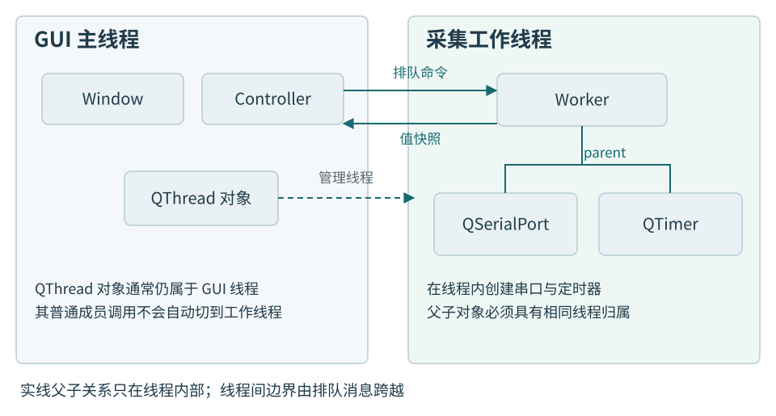
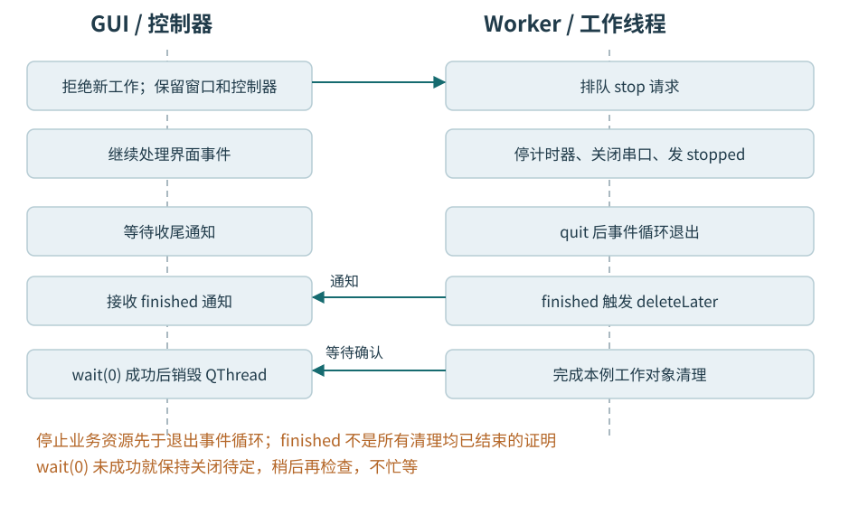
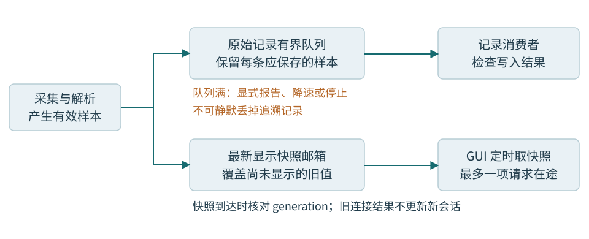

# 第十一章 后台采集与安全关闭

后台采集要同时保证两件事：数据处理不会长时间占住界面，关闭界面时也不会把仍在使用的资源提前销毁。本章把低压温度监测节点接入 Qt 工站，说明线程怎样分工、结果怎样跨线程交付，以及停止、断线、重连和关窗怎样汇合到同一条收尾路径。

案例中的教学板已经确认供电、电平和连接关系，只输出温度数据。工站接收报文并显示当前温度，不控制危险运动，也不写入校准参数。普通 Qt 桌面程序不因此具备硬实时或安全停机能力。这里的“停止”首先指停止本机接收；若产品要求设备停止采样，还要增加设备协议中的停止请求与确认。

读者需要认识函数、类、指针和基本对象生命周期，不需要先学过 Qt 多线程。代码以 Qt 6.8.3 为源码核对基线，解释机制而非提供完整工程；省略的类声明、解析器、界面、构建配置和错误呈现都有文字边界。所有片段未编译、未执行、未上板，不能据此声称某个驱动或平台已通过验证。

## 11.1 线程让工作分开 事件循环让通知前进

线程是程序中的一条执行序列。GUI 线程处理按钮、绘制和窗口事件；采集线程可以处理串口通知与报文解析。两条序列可能交错运行，也可能在多核处理器上同时运行。增加线程并不自动增加设备吞吐，更不会替对象规定谁可以访问它。

**事件循环**反复取得待处理事件，再调用相应处理函数。Qt 中，按钮触发的槽、排队到达的调用、定时器通知和异步串口通知都要获得执行机会。一个槽执行完并返回，循环才能继续分派其他工作。槽只是被调用的函数，不是一条自动独立运行的线程。

假设“开始采集”槽调用 `waitForReadyRead(30000)`。如果它在 GUI 线程运行，没有数据时就可能阻塞很久，绘制和关闭事件也难以及时处理。若它改成等待 `readyRead` 通知，处理时只取走已有字节、做有界工作再返回，就能把等待留给事件机制。异步串口本身不一定需要另建线程；当解析、设备会话或后续处理需要独立管理时，工作线程才成为有用的隔离边界。[Qt 串口接口](https://doc.qt.io/qt-6.8/qserialport.html)

“已经搬到后台”也不意味着取消会及时执行。工作对象的槽如果进入一个十秒不返回的计算循环，后续排队的停止槽仍要等待。应该把计算分成有界小段，处理完一段后让出事件循环；或采用独立、正确同步的协作停止机制，让计算在安全点主动检查。不要在循环里反复调用 `processEvents()` 假装获得并行，它可能让新的调用在旧操作尚未完成时重入，使状态更难解释。

**线程安全**也不等于“这个类可以在任何线程随便调用”。Qt 文档中的可重入通常允许不同线程使用不同实例，不能据此让两个线程同时操作同一个串口对象。本章采用更简单的约定：串口、解析缓冲和采集状态只由采集线程使用；窗口和界面模型只由 GUI 线程使用。跨界传消息，不共享可变成员。[线程与 QObject](https://doc.qt.io/qt-6.8/threads-qobject.html)

采集状态因此不必每个字段都改成 atomic：只要所有读写确实在同一采集线程中发生，就没有来自 GUI 的并发访问。GUI 自己的“正在关闭”状态也只由 GUI 修改。若改成两条线程直接共用一个普通 bool 停止标志，便重新引入同步责任；把它写成 volatile 不能替代原子操作或锁。即使标志是原子的，串口、缓冲与其他字段也不会一并受到保护。

## 11.2 先分清线程对象和工作对象

### QThread 管理线程 但它自己也有归属

`QThread` 是一个 QObject，它代表并管理一条线程。若 GUI 线程执行 `new QThread`，这个 QThread 对象通常仍属于 GUI 线程。调用 `start()` 后，新的执行线程进入 `run()`；默认 `run()` 会运行事件循环。**管理线程的对象与实际执行线程不是同一个东西。**[QThread](https://doc.qt.io/qt-6.8/qthread.html)

因此，把 `readTemperature()` 写成 QThread 子类的槽，不会让排队到这个对象的调用自动去后台。槽的交付看接收对象归属；普通的 `object->method()` 则仍在调用者当前线程执行。`moveToThread()` 也不是给所有成员函数加上自动跳转能力。

这里选择 **worker-object 模式**：用普通 QThread 管理执行线程，把另一个 QObject 工作对象移入它。`Worker` 拥有串口与协议状态；`SessionController` 留在 GUI 线程，管理开始、停止和线程收尾；窗口只呈现状态、提出操作意图。控制器的生命必须覆盖整个会话，不能因为某个窗口被销毁就提前消失。

实现这类 Worker 时，类继承 QObject，并使用 Q_OBJECT 宏声明 Qt 元对象能力；signals 区域声明通知，处理函数接收通知，emit 表示发出信号。emit 不是新建线程的指令。带这些声明的完整工程还需让 Qt 的元对象编译器 moc 参与构建，并链接所用的 Core、Widgets、SerialPort 模块。下面保留关键连接与成员函数，不把省略的类声明伪装成可直接编译的程序。[Qt 元对象编译器](https://doc.qt.io/qt-6.8/moc.html)

### 对象树与线程归属必须一起检查

QObject 的 `parent` 表达拥有关系：父对象销毁时负责删除子对象。父子 QObject 必须属于同一线程；带 parent 的对象不能直接移到别的线程，移动父对象时其子对象也会移动。`Worker` 因而不能先以窗口为 parent，再试图移入后台。[QObject 线程归属](https://doc.qt.io/qt-6.8/qobject.html#thread-affinity)

类的成员并不天然属于 QObject 子对象树。构造函数在 GUI 线程创建一个无 parent 的 `QSerialPort`，再只移动外层 Worker，串口仍可能留在 GUI 线程。一个普通指针字段只是保存地址，不会建立 parent，也不会自动改变线程归属。

本例让 Worker 的构造函数只保存端口名、会话代际等普通值。移动成功、线程启动后，才在 Worker 的初始化槽内创建 `new QSerialPort(this)` 和需要的 `new QTimer(this)`。两者与 Worker 同属采集线程，停止和销毁也在这条线程上完成。定时器的启动与停止必须遵守它的线程归属。[QTimer](https://doc.qt.io/qt-6.8/qtimer.html)

不要再用一个普通 `unique_ptr` 同时负责删除已交给 parent 的对象。QObject 对象树已经规定了释放责任，再叠加未经协调的独占所有者，会产生重复删除或错误线程中的删除。`QPointer` 可以观察 QObject 是否销毁，却不提供跨线程锁，也不让“检查非空后再调用”成为通用安全协议。



图 11-1 对象归属与执行线程。实线父子边不能横跨两个线程；QThread 到工作线程的管理关系另用虚线表示。图为原创机制示意，依据 Qt 6.8 对象与线程契约绘制，不是运行截图。

## 11.3 传过去的是一份结果 不是一条借用

### 连接类型决定在哪里执行

信号表示某件事发生了，槽负责处理。`Qt::DirectConnection` 立即在发射信号的当前线程调用槽；`Qt::QueuedConnection` 保存调用，等接收线程的事件循环处理；`Qt::AutoConnection` 在发射时依据当前执行线程与接收对象归属选择前两者。判断自动连接时，不能只比较两个对象最初在哪里创建。[Qt 连接类型](https://doc.qt.io/qt-6.8/qt.html#ConnectionType-enum)

本章显式使用排队连接传递界面与 Worker 之间的业务消息。这样读代码时就能看到边界：发出停止信号只表示已经提交请求；发出采样信号时，窗口一般还没有显示它。工作线程不能直接设置 `QLabel`，即使给调用加锁也不改变 GUI 的线程约束。

排队连接需要把参数保存到稍后。对于小数据，最容易证明的办法是传递独立值。下面的快照包含接收方需要的温度与身份，不含对解析缓冲的指针。

```cpp
// Qt 6.8.3 教学片段，未编译、未执行。
// 需包含 Qt 类型与元类型头文件。
struct Snapshot {
    quint64 generation{};
    unsigned sequence{};
    int temperature_mC{};
    quint64 sampleTick_us{};
    bool valid{};
};
Q_DECLARE_METATYPE(Snapshot)

// 在建立相关连接之前执行。
qRegisterMetaType<Snapshot>();
```

`temperature_mC` 的单位是毫摄氏度，25000 表示 25.000 °C；`sequence` 来自设备报文，便于识别遗漏；`sampleTick_us` 是本次设备运行中的采样计数时间，不等于电脑日历时间。`generation` 由上位机分配，用来区分连接会话。它们构成进程内数据类型，不能直接按 `sizeof(Snapshot)` 当作线上报文发送。

`Q_DECLARE_METATYPE` 让 Qt 的相关模板机制认识类型，本例在建立连接前显式调用 `qRegisterMetaType`。类型必须完整且满足所用排队传递方式的复制等要求。注册类型只是让 Qt 知道怎样保存和销毁参数，不会验证单位、报文校验或业务状态。[Qt 元类型](https://doc.qt.io/qt-6.8/qmetatype.html#qRegisterMetaType)

### 复制指针并没有复制指针指向的数据

如果信号携带 `const char*`，排队保存的可以只是地址。发送方复用接收缓冲或函数返回后，接收方可能读到新内容或已经失效的存储。加 `const` 只限制这条访问路径，不能保活，也不能阻止别处改写。

温度快照很小，按值交付通常比共享可变缓冲容易审查。大块数据确有复制成本时，可以交付拥有数据的字节数组，或共享不可变块，但必须保证发布后没有其他可变别名继续写它。共享指针只解决一部分存续问题，不自动解决内容的数据竞争。

连接 lambda 时还要提供接收上下文。例如 `connect(worker, signal, window, lambda)` 中的 window 既帮助确定执行上下文，也把连接与窗口生命联系起来。捕获其他裸指针仍需各自证明有效期。没有上下文地捕获一个窗口地址，不能指望窗口关闭时自动替这个捕获解除风险。[QObject 连接](https://doc.qt.io/qt-6.8/qobject.html#connect-4)

## 11.4 串口采集有两条不同路线

### 事件驱动路线每次处理有限工作

本例采用事件驱动路线。Worker 的初始化依次完成：创建串口、设置端口和通信参数、检查每项配置与 `open()` 的结果、安装数据与错误处理、进入运行状态。任何一步失败，都转到同一个结束函数；不能只弹出错误信息，把线程留在无人管理的事件循环里。

数据处理入口由 `readyRead` 触发，它表示有新字节可读，不表示一帧完整温度报文已经到齐。解析器要保存半帧，把多帧拆开，并限制最大帧长、暂存字节数和不完整帧的等待时间。本章只使用“校验通过后产生 Snapshot”这个接口，分帧规则留给设备协议章节。

每次读取和解析也要有预算。假设教学协议的最大帧为 64 字节，可以规定一次处理至多若干帧，剩余工作安排到下一次事件处理机会。若还有已读入的字节，不能只等下一次 `readyRead`，因为它不是“内部缓冲一直非空就持续通知”的保证；应用需要自己安排后续处理，并用标志避免重复排入大量继续任务。[QIODevice 的 readyRead](https://doc.qt.io/qt-6.8/qiodevice.html#readyRead)

预算不是随便写一个循环次数。要说明单帧解析也有长度上限，不调用不可控的慢函数；错误输入不能导致无限扫描。串口内部缓冲可用 `setReadBufferSize()` 限制，应用解析缓冲也要单独设限。限制内存只会把过载变成需要处理的事实，不会凭空保证设备端、驱动层与应用层都不丢数据。[QSerialPort 缓冲](https://doc.qt.io/qt-6.8/qserialport.html#setReadBufferSize)

串口错误信号中的 `NoError` 不能当成故障。其余错误按产品策略分类：当前连接已不可用时停止会话；可恢复情形也要有次数和时间边界。错误处理不能在原调用尚未结束时反复开关同一个端口。先设置停止状态，使随后可能触发的回调知道不能继续采集，再关闭资源。

### 阻塞路线需要自己的停止通道

另一条路线是在专用工作线程中顺序读取，使用有有限超时的 `waitForReadyRead()`。这种路线可以不运行事件循环，适合某些简单协议或只提供阻塞接口的 SDK；Qt 官方也提供阻塞串口示例。它不能与“排队的 stop 槽一定会执行”这个假设混用。[阻塞接收示例](https://doc.qt.io/qt-6.8/qtserialport-blockingreceiver-example.html)

如果重写 `run()`，在其中创建栈上的 QSerialPort 并进行阻塞循环，串口会在同一工作线程结束作用域时销毁。GUI 可以调用文档明确线程安全的 `requestInterruption()`，工作代码在等待返回后检查请求；无限等待 `waitForReadyRead(-1)` 却不提供其他可取消机制，会让检查永远没有机会发生。

`requestInterruption()` 只是请求，不会自动中断阻塞调用，也不会停止事件循环。`quit()` 要求事件循环退出，不能把任意长循环、设备操作或第三方等待强行取消。有限等待只给出再次检查的机会；一次设为 50 ms 的等待，不足以保证整个程序 50 ms 内退出，还要计入解析、调度、驱动和清理时间。

`waitForReadyRead()` 返回 false 还需区分超时与实际错误，不能把“这次没有等到字节”统一当作拔线。阻塞写入同样有“写入一些字节”与“设备已经接受命令”的层次差别。不要从 GUI 跨线程调用该串口的 `close()` 来碰运气唤醒等待；应使用目标接口明确支持的取消路径。

本例不把两条路线揉成一个万能类。事件驱动路线依靠事件循环及时处理停止；阻塞路线依靠有界等待和主动检查。选择完成后，资源的创建位置、取消入口和最终等待方式都要跟着这条路线设计。

## 11.5 安全关闭要一直走到资源不再被使用

### 停止请求与停止完成之间还有工作

用户按下停止，控制器先停止接受新采集操作并关闭刷新请求入口，再向 Worker 发送停止请求。此时界面显示“正在停止”。只有 Worker 停止接纳新字节、结束本章范围内的处理并关闭串口后，才能发出自己的结束通知。

本章有意把三个时刻分开命名：`stopped` 是 Worker 的会话处理结束；`QThread::finished` 是线程进入结束阶段；控制器的 `allStopped` 是线程等待成功、相关线程对象已经回收，允许最后关闭窗口。不同名字对应不同责任，不能让一个“完成”信号同时含糊表示它们。

本例只显示当前温度，因此停止时可以放弃未构成完整帧的尾部数据，并记录放弃原因与数量；已经接纳的完整样本不能偷偷改写成另一会话的样本。若扩展为正式测量记录，则必须增加有界记录队列和记录结果确认，确定已接纳数据是排空保存还是标记不完整。不能把下列短片段的 `stopped` 当成数据库已提交或 MES 已确认。

```cpp
// Worker 的成员函数片段，未编译、未执行。
// 所有调用均在 Worker 所属线程；无外部在途 SDK 操作。
void Worker::finish(const QString& reason)
{
    if (state_ == State::Stopping ||
        state_ == State::Finished)
        return;

    state_ = State::Stopping;
    if (deadlineTimer_)
        deadlineTimer_->stop();
    if (port_ && port_->isOpen())
        port_->close();

    discardPartialFrame(); // 应用函数：计数并清除残帧
    state_ = State::Finished;
    emit stopped(generation_, reason);
}
```

`stop()` 和不可恢复的错误入口都调用 `finish()`。开始、读数据、定时检查等入口必须检查状态：Finished 后不再开端口、不再发布新样本。先改为 Stopping，再调用关闭，可以使关闭间接触发的错误回调不重复进入清理。重复停止不重复发出终态，原因也不会被随后一个无关错误覆盖。

初始化尚未运行就收到停止，也必须能结束：此时指针为空，清理仍成立；后来到达的初始化入口看到状态已变化便直接返回。初始化只允许从尚未开始的状态进入 Opening，不能无条件把状态改回 Running。这解决了“刚点击连接就马上关窗”的竞态。

这里的 `close()` 是 QSerialPort 自己的关闭与取消 IO 接口。本例没有持有裸操作系统异步请求，也没有第三方回调。若换成会在取消返回后继续交付完成回调的 SDK，必须等其契约规定的在途操作收束后才能发 stopped；不能只把函数名替换成 SDK 的 cancel 就沿用结论。

错误也要进入终态，不能只进入日志。端口打不开、配置失败、接收资源错误和解析器发现不可继续的数据，都应带会话身份交给控制器。若应用解析函数可能抛 C++ 异常，应在事件处理边界按项目策略接住并转换，不能让它任意穿出 Qt 的事件分派；清理函数本身也不能依赖会再抛出的操作。内存耗尽等无法可靠构造错误结果的故障，属于另行约定的进程级策略，本片段没有证明它们可恢复。[Qt 异常边界](https://doc.qt.io/qt-6.8/exceptionsafety.html#signals-and-slots)

### 把关键连接在启动前安排好

下面是控制器创建一代会话的连接骨架。控制器和 QThread 对象均属于 GUI 线程；控制器活到所有会话释放以后。Worker 构造函数仅保存普通值，串口与定时器由它的初始化槽创建。骨架以对象分配和操作系统线程创建成功为前提；这里所说的“初始化失败收尾”，指初始化槽开始执行后的端口配置、打开等失败。

```cpp
// SessionController 中的片段，未编译、未执行。
// 前提：上一代已回收；分配及系统线程创建成功。
// generation 不在进程内复用。
auto* t = new QThread(this);
auto* w = new Worker(generation, portName); // 无 parent
if (!w->moveToThread(t)) {
    delete w; // 移动失败，仍属于当前 GUI 线程
    delete t; // 尚未启动
    reportStartFailure();
    return;
}
thread_ = t;

connect(t, &QThread::started,
        w, &Worker::initialize, Qt::QueuedConnection);
connect(this, &SessionController::stopRequested,
        w, &Worker::stop, Qt::QueuedConnection);
connect(w, &Worker::stopped,
        this, &SessionController::rememberOutcome,
        Qt::QueuedConnection);
connect(w, &Worker::stopped,
        t, &QThread::quit, Qt::DirectConnection);
connect(t, &QThread::finished,
        w, &QObject::deleteLater);
connect(t, &QThread::finished, this,
        [this, t, generation] { reap(t, generation); },
        Qt::QueuedConnection);
t->start();
```

唯一显式跨线程直接调用的是 `QThread::quit`。这样安排有明确依据：Qt 6.8 将这个函数列为线程安全；它只请求管理中的事件循环退出。Worker 发出 stopped 时已经完成本例的会话清理，随后当前调用返回，线程才能结束。这个特例绝不意味着其他 QThread 方法或 GUI 方法都能照样直接调用。[QThread 的 quit](https://doc.qt.io/qt-6.8/qthread.html#quit)

`finished → deleteLater` 保留默认自动连接，不能随手改为显式排队。finished 从工作线程发出，Worker 也在这条线程，自动连接使 `deleteLater()` 得到调用。Qt 对这一收尾模式有专门保证：finished 发出时普通事件循环已停止，但仍处理延迟删除事件。若只把“调用 deleteLater 的槽”排入一个已经停止的普通事件队列，便错过了这个区别。[QObject 的延迟删除](https://doc.qt.io/qt-6.8/qobject.html#deleteLater)

Worker 删除时再由对象树删除其串口和定时器。控制器不从 GUI 线程直接 delete Worker，也不在移入后台后通过原始指针调用它。普通对象的析构顺序规则没有失效，而是释放责任需要在正确执行上下文中兑现。

### GUI 不阻塞等待 但仍然确认线程结束

不能在发出 stopRequested 后立刻在 GUI 线程调用无期限 `wait()`。工作线程的退出可能还要 GUI 处理某条消息；即使没有依赖环，界面也会失去响应。本例让 GUI 继续处理事件，在接到 finished 后做零超时的结束检查。

```cpp
// GUI 线程中的回收片段，未编译、未执行。
// t 在本函数成功回收前由控制器持有，无其他删除路径。
void SessionController::reap(QThread* t, quint64 generation)
{
    if (!t->wait(0UL)) {
        QTimer::singleShot(10, this,
            [this, t, generation] { reap(t, generation); });
        return;
    }
    thread_ = nullptr;
    delete t; // 已等待成功；当前是 t 所属 GUI 线程
    emit sessionReleased(generation);
}
```

这不是在 GUI 里忙等。每轮做零超时检查，未结束便由定时器安排下一次检查，期间事件循环仍工作。在本章核对的 Qt 6.8.3 Windows 与 Linux 实现中，结束路径先处理 Worker 的延迟删除，再公布 wait 所检查的结束状态，因此等待成功后可确认本例的工作对象树已清理，再回收线程管理对象。[Windows 实现](https://github.com/qt/qtbase/blob/v6.8.3/src/corelib/thread/qthread_win.cpp)、[Linux 所用实现](https://github.com/qt/qtbase/blob/v6.8.3/src/corelib/thread/qthread_unix.cpp)

这里不能扩大成“任意 `thread_local` 析构和第三方 SDK 回调都已结束”。本例没有这类额外借用，必要收尾明确放在 Worker 及其子对象的生命周期内。Qt 6.8 在线维护文档会随补丁更新，不应把维护页面对操作系统线程完全退出的表述反套到所有旧补丁；换版本或接入 SDK 时，应重新核对实际依赖的结束条件。

回收函数只在启动后的 finished 通知到达后进入，不能用“刚创建时 wait 返回 true”冒充曾经启动并结束。每代只启动一条回收链，只有它删除 t；最后由控制器把 sessionReleased 汇合成 allStopped。若有多个设备，就要分别管理，直到所有会话和必要记录任务均释放。

rememberOutcome 保存的是带 generation 的终态快照。控制器要汇合“会话终态已收到”和“线程已回收”两项事实，才能发 allStopped；若只有线程消失却没有预期终态，应报告异常结束，不能补造一次采集成功。若底层线程创建失败，没有进入工作入口，便不能依赖本骨架的 started/finished 链完成回收。真实工程需要另行监测启动确认并诊断；确认超时本身不证明线程不存在或已结束，不能据此贸然删除可能仍运行的对象。本骨架不宣称覆盖全部系统启动失败。

控制器自身也必须活到这个过程结束。把它设成一个随时可删除的小对话框的子对象，会在 parent 析构时再次引出“删除仍运行 QThread”的问题。本章使用应用级控制器，并要求所有正常退出入口先走停止协议，再退出 QApplication。析构函数不是第一次发起异步清理的地方，`aboutToQuit` 也不能被当成还有充足事件循环时间的保证。

不要把 `terminate()` 当作超时补救。强行终止线程可能打断锁和库内部不变量；调用停止超时也不证明线程已结束。Qt 对普通 QThread 明确要求运行结束后才能删除。Qt 6.3 起 `QThread::create()` 有特定析构行为，那不适用于本例的 `new QThread`，也不是一个通用的快速关窗方案。



图 11-2 安全关闭的先后关系。stopped、finished 和允许关窗分别标示不同的完成层级。图中等待是零超时检查，不占住 GUI 等待；实际耗时取决于驱动、工作预算和清理路径。

### 窗口第一次收到关闭请求时先留下来

关闭窗口的事件可以接受，也可以暂时忽略。本例采用“可操作 → 正在停止 → 可以关闭”的窗口状态。第一次关闭先忽略事件，禁用新的连接和采集操作，启动控制器的停止流程；再次点击关闭不会重复创建线程或清理资源。[QCloseEvent](https://doc.qt.io/qt-6.8/qcloseevent.html)

```cpp
// MainWindow 中的片段，未编译、未执行。
void MainWindow::closeEvent(QCloseEvent* event)
{
    if (mayClose_) {
        event->accept();
        return;
    }
    event->ignore();
    if (closing_)
        return;
    closing_ = true;
    disableNewOperations();
    controller_->shutdown(); // 同属 GUI 线程
}
```

窗口在收到 allStopped 后设置 mayClose，再调用 `close()`；这次关闭事件才被接受。窗口仍在，所以回调有可靠的接收上下文。空闲状态下 shutdown 也应通过排队方式报告完成，避免在第一次 closeEvent 尚未返回时递归关窗。菜单“退出”和正常程序退出都走同一入口。

还应有停止耗时提示。超过预期时间，界面改为“停止尚未完成”，保留线程和资源，显示等待在哪一步，而不是伪装关闭成功。产品可以允许用户取消关窗后继续观察，但已停止的会话不能未经重建就恢复为 Running。进程被操作系统强制终止或机器断电不在这套正常关闭保证内；重要测量数据需要独立的持久化与恢复设计。

## 11.6 重连身份与背压决定结果是否还值得显示

### 同一个窗口还在 不代表旧结果还适用

设第一次连接的 generation 为 41，断线后重连为 42。第 41 代的一份快照可能早已排入 GUI 队列，等第 42 代开始后才被处理。串口号相同、窗口地址相同，甚至设备序号恰好相同，都不能证明它属于新会话。

控制器在 GUI 线程持有当前 generation 和接纳状态。开始停止时，先将接纳状态设为 false；新的会话只有在旧会话按本章协议回收、重新确认目标后才启动，并取得新 generation。每一条数据、错误和终态都携带产生它的代际。接收方先验证身份，再修改界面或会话状态。

`disconnect()` 不会可靠撤回所有已经排队的调用，所以只断开旧信号不够。代际标识使旧数据在交付边界失效；它解决的是业务新鲜度，不能替代对象寿命管理、设备身份核对或跨进程去重。代际在进程内不复用；若计数耗尽，应拒绝复用旧值，而不是悄悄绕回。[QObject 的 disconnect](https://doc.qt.io/qt-6.8/qobject.html#disconnect)

### 刷新限速之外 还要限制在途数量

**背压**是把下游处理不过来的事实反馈到上游，让系统减速、拒绝或按规则合并数据。单纯每 100 ms 发一个显示信号，只限制了平均产生速率：GUI 若停顿一分钟，消息仍会积压。定时器不是队列容量限制器。

温度显示可采用“最新值邮箱”：Worker 在自己线程内只保留最新 Snapshot。GUI 定时请求一份快照，同时用 pending 标志保证最多一个请求在途；收到同代回复后才允许下一次请求。暂停显示不会积累每一个历史温度值，也不需要 GUI 去跨线程直接读 Worker 的成员。

```cpp
// GUI 收到快照的入口；未编译、未执行。
void Panel::onSnapshot(Snapshot value)
{
    if (value.generation != generation_ || !accepting_)
        return;
    pending_ = false; // 旧代回复不能释放新代请求的额度
    if (value.valid)
        showTemperature(value.temperature_mC);
}
```

请求入口只在 accepting 且 pending 为 false 时发送，发送前先置 pending。Worker 的回复即使“尚无有效样本”也带正确 generation，让 GUI 能结束这次请求；停止时关闭请求定时器并清理该代 pending。若某个回复长期不来，GUI 报告会话未响应，不在每次超时后无限追加新请求。该协议有意允许覆盖中间显示值，但没有承诺保留每个原始样本。

单在途还依赖连接只建立一次。若每次重连都给长寿命控制器重复 connect，同一个请求可能得到多次回复：第一份回复清掉 pending 后，新请求已经发出，第二份旧回复又把它清掉，额度便失真。本例每代新建 Worker，并只在启动前连接一次，销毁该代对象解除相应连接；长寿命对象之间的连接应保存句柄并明确断开。Qt 的 UniqueConnection 不能替 lambda 自动去重，不能仅加一个标志就省掉连接管理。[QObject 连接约束](https://doc.qt.io/qt-6.8/qobject.html#connect)

正式记录则需要另一条有界通道。假设回放压力测试输入每秒 1000 条，记录端每秒只处理 800 条，容量为 2000 条的空队列约十秒会满。这是固定速率下的演算，不是实测。增加线程或内存可能暂缓现象，却没有消除每秒净积压 200 条的原因。记录通道应限制条数和字节数；满时按协议降低采样、停止接纳或明确报告数据不完整。

尤其不能让采集线程阻塞在“等待 GUI 消费”的满队列上，同时又要求它靠事件循环接收停止请求。否则背压本身就切断了关闭通路。显示选择合并最新值；必须完整的记录选择可报告失败的有界通道，或由独立执行者管理阻塞等待。策略由数据用途决定，不能用一条无界信号队列承载所有用途。



图 11-3 两种不同的数据去向。显示可以覆盖中间值，原始记录若丢失必须留下缺口或失败证据。图中的速率和容量是教学设计值，不是设备性能指标。

## 11.7 从故障现象还原责任断点

### 关窗一直不退出

设一个待诊断版本平时采集正常，点关闭后窗口不再刷新。代码在 GUI 中发出 stop，再调用 `thread->wait()`；Worker 的 stopped 连接到 QThread 的 quit，使用默认自动连接。直觉上它已经“先停止再等待”，但要补充一个事实：QThread 对象仍属于 GUI 线程。

可以区分三个假设：Worker 卡在驱动调用，Worker 的事件循环被长槽占住，或者退出请求在 GUI 队列里等不到处理。调查需要同一时刻各线程的堆栈、对象归属，以及带 generation 的状态转换记录。仅看到 GUI 停在 wait 无法选择答案，也不能从“串口拔掉后仍卡住”直接断言驱动损坏。

如果证据显示 Worker 已执行清理并发出 stopped，之后返回自己的事件循环，GUI 却仍在 wait，那么默认连接下的 quit 调用要排到 QThread 对象所属 GUI 线程。GUI 等待工作线程结束，工作线程结束又依赖 GUI 处理 quit，依赖环已经闭合。这种死锁没有两把互斥量，也不需要某个线程占满 CPU。

修复应解除整个等待环：GUI 改为异步关闭，Worker 清理后用本章已核对的线程安全 quit 路径请求退出，finished 后再检查和回收。若工作线程还使用 `BlockingQueuedConnection` 向 GUI 索取结果，也要消除这条关闭期间的反向依赖；不能只修正一条连接就宣布所有退出路径安全。

验收要覆盖空闲关窗、读到半帧时关窗、初始化失败、设备拔除、连续点击关闭和故意延迟 GUI 处理。应能证明每代只交付一次终态，Worker 和端口已在正确线程销毁，等待成功后才销毁 QThread。这里给出的是验证设计，没有伪造堆栈、日志或已通过的测试结果。

面试追问：“把 wait 改成五秒就好了吧？”没有。超时返回 false 只是说明还没等到结束；随后照样析构 QThread，会把卡住变成崩溃风险。应保留资源并显示未结束，继续定位是哪项责任未履行。时间限制提供决策时机，不提供资源已安全释放的证据。

### 重连后温度突然回到旧值

另一个版本断线后自动重连，显示先更新到 28 °C，随后短暂回到 23 °C。可以提出设备温度真的变化、报文解析错误、旧结果迟到三种假设。只看曲线不能区分；需要一起记录设备身份、generation、设备 sequence、采样时间和 GUI 接纳时刻。

若 28 °C 属于第 42 代，而随后到达的 23 °C 属于第 41 代，问题就在交付接纳边界。旧结果的数据本身可以完全正确，只是不再适用于当前界面。修复是先检查代际和接纳状态，再更新显示；清空曲线或改成 shared_ptr 都不能表达这条业务规则。

进一步检查请求额度：如果旧代回复先把 pending 清零，再检查 generation，就可能让新一代同时发出多个请求，重新引入积压。因此身份验证必须发生在释放额度之前。验收可以使用离线回放故意延迟旧回复，并安排断线、停止、重连交错；结果应被明确拒绝，新的 pending 也应保持正确。

面试追问：“有代际标识，还需要对象树和等待吗？”需要。代际回答结果属于哪次会话，所有权回答谁保留对象，等待回答执行者是否已结束。旧结果被拒绝不等于旧线程停止；对象还活着也不等于结果新鲜。可靠的后台采集要把这三条关系同时讲清。

## 本章资料与验证边界

Qt API 按 2026-10-06 核对 Qt 6.8 官方文档；线程回收的实现边界另以 Qt 6.8.3 固定源码核对，Windows 为主目标，Linux 为次目标。没有用滚动 Qt 6 页面中新版本的新增能力替代本章基线，也没有将维护文档的更强尾部同步表述泛化到全部 Qt 6.8 补丁。文中的 Worker、SessionController、Snapshot、状态名、代际协议与数值预算均为教学设计，不是 Qt 自带的业务保证。

本章完成的是来源对照、API 契约核对和代码路径的静态审阅。尚未进行编译、Qt 元对象构建检查、线程压力测试、故障注入、串口回环或真实教学板验证。正式示例应补齐工程后分别记录这些证据；文档能正常显示、代码看起来简洁、一次成功关窗，都不能替代它们。
