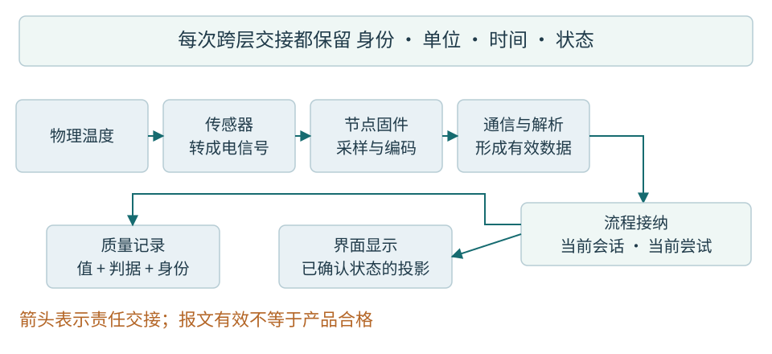
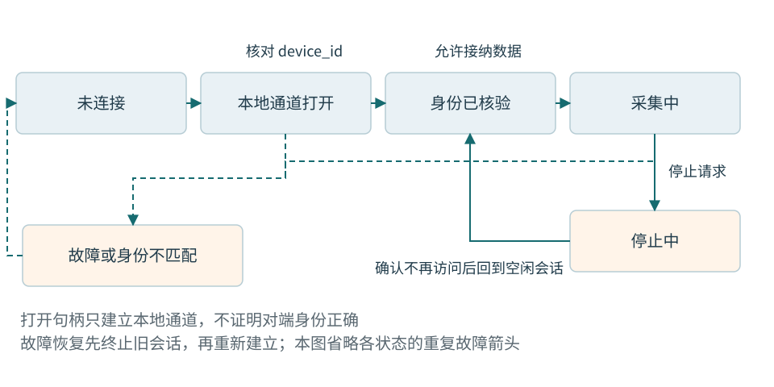

# 第一章 工业软件与设备系统的基本分工

工业软件处理的输入，往往来自一个仍在变化的真实对象。电脑收到25°C，不代表被测物此刻仍是25°C；向设备发出停止，也不代表设备已经停止。程序需要把数值、时间、身份和动作结果放在一起理解。学会使用某个通信函数只是其中一步，先认识系统由谁组成，才能判断一个结果到底证明了什么。

本书采用一个贯穿各章的教学对象：低压温度监测节点，以及对它进行测试和校准的工站。节点测温并发送数据；工站识别节点、取得读数、按既定规则判断并保存结果。这里的设备、报文和工艺条件是教学约定，没有实际生产线、采购清单或已验证硬件。数值例子用于说明推理方法，不能直接当作产品限值。

## 一 从物理温度到屏幕上的数字

### 先分清测量对象和设备

被测物是我们想知道温度的对象，例如一个受控低压教学环境中的金属样块。传感器是对温度产生可测响应的器件。温度节点则是一套小系统，可能包括传感器、微控制器、电源电路、通信接口和固件。固件是为设备硬件编写、通常保存在非易失性存储中的程序；它不会因为被称为固件，就失去版本、缺陷或升级问题。

传感器可能输出电压，也可能通过数字接口交付一个计数。前者通常还要经过模拟调理和模数转换，后者也要按数据手册解释量程、比例和状态位。模数转换器简称ADC，把一定范围内的模拟信号转换成有限位数的数字表示。转换结果不是自动具有摄氏度意义的整数；比例、偏移、参考和有效状态都属于解释条件。

例如，同样的原始数值25000，可以表示25000个计数、25.000°C或250.00°C。仅从数值无法判断。因此本书内部字段使用temperature_mC：mC表示毫摄氏度，25000对应25.000°C。这个命名降低单位混淆的机会，但仍要核对产生该值的转换是否正确。把错误换算后的数值放进名字正确的字段，不会获得正确测量。

节点采集后把结果交给通信部件，工站操作系统和驱动接收字节，上位机程序再按协议解析。协议规定双方怎样组织和解释交换内容。解析成功后，流程程序还要确认样本属于当前节点、当前连接与当前测试尝试，然后才能用于判断。屏幕上的数字只是数据链末端的一种呈现。

图01-1 一条温度记录跨越的责任。箭头表示数据流，不表示各阶段同时完成；图中“判定”只有在身份、时效和测量条件成立时才产生有效结论。

### 传输正确与测量正确有不同证据

报文的校验通过，最多说明按所用算法没有检测到覆盖字节的损坏。传感器安装松动、参考不准确、温度尚未稳定、换算重复执行，都可能产生字节完全正确但测量不可信的结果。反过来，传感器读数正确，若缓存被旧数据覆盖或消息被解释成另一个单位，工站同样会显示错误。

工程上因此保留几类不同的事实：设备原始读数、换算后物理量、传输与解析状态、用于判断的样本集合，以及判断采用的规则版本。它们不是为了把每条日志写得很长，而是使问题能够沿责任边界定位。若只有最终PASS或FAIL，事后几乎无法知道失败来自被测物、工站还是数据链。

“校准”也要在这里澄清。校准依据参考建立示值与相应量值之间的关系；实际工程可能在此基础上调整参数，再用规定条件复核。显示接近某个期望值不等于校准已经成立，更不等于产品已经满足所有合格要求。测试工站必须知道参考来自哪里、适用于什么范围，以及哪些结果仍待确认。本书用这一背景解释软件记录责任，不提供计量认证结论。[6]

## 二 上位机 控制器和操作系统各做什么

### 上位机是一个相对角色

上位机通常指面对操作员或更高层业务、管理设备交互的计算机及其软件。它可以显示状态、编辑参数、启动流程、收集数据和导出报告。“上位”描述系统分工，不表示它在任何问题上都拥有最高控制权。一个Windows工站应用可能负责测试流程，却不能绕过设备内部保护，也不能用界面按钮替代硬件安全措施。

本书以C++和Qt Widgets组织桌面上位机。Qt Widgets提供窗口、按钮、表格等传统桌面界面部件，Model/View机制还可帮助分离数据与显示。[1] 选择它是为了把一条实现路线讲完整，界面框架本身并不提供设备协议、产品质量规则或可靠退出流程。这些仍由应用设计承担。

上位机不一定需要画复杂趋势图，也不一定必须运行Windows。有些工具是命令行程序，有些工站在Linux运行，有些设备用网页作为操作界面。共同问题是设备身份、输入输出、状态变更、资源与失败。本书Windows为主讲环境，Linux为第二验证目标；没有完成实际验证的内容不会被写成两平台已经兼容。

### MCU把程序与外设放得更近

MCU是微控制器，通常在一颗芯片内集成处理器、存储与多种外设。外设不是“外面的所有设备”的统称，在芯片手册里，它常指GPIO、定时器、UART、ADC等可由处理器配置的硬件模块。GPIO是通用输入输出，UART是异步串行通信控制器。具体有哪些模块、引脚怎样复用，取决于确切芯片型号。

在温度节点里，MCU可以安排采样、读取传感器、维护状态，并通过串口发送结果。程序访问外设时，要遵守寄存器、时钟、电源和中断等条件。Arm的CMSIS-Core为Cortex-M软件提供内核与设备访问相关的统一接口，但不因此统一所有厂商外设的寄存器或电气规格。[2] 同属Cortex-M的两块板，不能据此互换引脚和固件。

MCU也不天然等于“没有操作系统”。简单节点可以用主循环和中断组织工作，也可以引入RTOS。主循环反复执行若干工作；中断在特定事件发生时打断正常执行，转入相应处理入口。这两者怎样协作，决定缓冲、响应和共享数据的责任，而不是代码里出现一个while循环就足够说明系统结构。

### RTOS管理任务 但不替你完成时限证明

RTOS是实时操作系统。本书主要讨论FreeRTOS类内核提供的任务调度、队列、同步和时间服务。任务可以正在执行、具备执行条件但等待调度，或等待某个事件。FreeRTOS文档明确区分这些状态：Ready不等于此刻正在Running，Blocked任务则是在等待条件。[3]

“实时”关注在规定条件下是否按时完成。假设节点要求每100ms取得一条样本，关键问题包括传感器转换要多久、任务能否按时运行、通信是否占用共享资源，以及更紧急工作能阻塞它多久。把函数放进RTOS任务，或者提高其优先级，并不能独立回答这些问题。没有明确时间约束，就无法判断所谓实时性是否达标。

RTOS一般比完整桌面系统更接近硬件约束，但具体隔离能力、内存保护和API成本仍依平台与配置。不能把Windows中的线程、文件、动态分配和退出习惯逐项平移到MCU。一个长期运行且靠复位重新启动的节点，也未必会经历普通桌面程序的正常退出路径。

### 嵌入式Linux是一套更完整的软件环境

嵌入式Linux通常出现在资源较丰富、需要网络、文件系统或复杂应用的设备上，例如连接多个温度节点的网关。Linux内核提供调度、内存和设备管理等能力，用户态程序再通过系统接口访问设备。官方内核概述列出多任务、虚拟内存、共享库和网络等能力，同时指出不同硬件移植存在条件。[4]

一台嵌入式Linux设备不只是“烧进Linux就能跑”。它还需要适合板卡的启动程序、内核配置、硬件描述、驱动、根文件系统和用户态服务。C++应用可能只占其中一层。若设备连启动日志都没有，先修改应用串口接收循环通常没有意义；若内核已识别串口而应用权限不足，重新焊接线路也可能偏离证据。

在本书案例里，可以用MCU完成紧邻传感器的采集，由Linux网关汇集记录，再由Windows工站操作和追溯。也可以省去网关，工站直接连接节点。结构由需求决定，不应为了凑齐名词而把每一层都加入产品。

### PLC与工站是协作关系

PLC是可编程逻辑控制器，常用于工业设备的输入输出与控制顺序。它一般带有适合现场的I/O和工程工具。PLC程序可能以扫描周期反复处理输入、逻辑和输出，也可能包含按事件运行的任务；实际执行顺序必须看型号和配置。Siemens S7-1200文档明确描述过程映像与扫描行为，不宜将某一型号的步骤顺序宣称为所有PLC的统一规则。[5]

“过程映像”可以先理解为PLC内存中与某组输入输出对应的状态副本。程序在规定时机读取或更新副本，再由系统在相应条件下与物理I/O交换。这使逻辑在一个阶段内使用一致状态，也意味着某个内存位的变化、通信客户端读到它、物理输出发生变化可能不是同一时刻。

温度工站若与PLC协作，可以让PLC报告治具就绪、工件到位，工站执行采集并报告结果。治具是用于固定、定位或连接工件的装置，不是被测产品本身。软件必须约定谁能够开始、谁保持请求、谁确认完成、超时后谁恢复。一个PLC位名叫Start，并没有自带这些协议。

本书不以这一例子指导危险运动控制。涉及高压、大功率加热、夹紧或其他风险时，必须由合格人员设计独立保护和安全控制。电脑离线、应用崩溃、窗口关闭都不能被默认为现场已安全停止。

## 三 用输入 状态和结果描述一个功能

### 输入不只是一串参数

设工站需要“读取一次温度”。这一句话至少包含四种输入：目标节点身份、当前设备连接、所需测量条件，以及本次操作的时间约束。操作者输入的串口名只是访问入口，不保证连接到的是哪一个实体；上一次接在COM端口上的节点可能已经被替换。

输出也不应只有一个整数。可能得到有效温度，也可能设备明确报告测量无效，或在期限内没有得到足够信息。后两者不同：无效样本证明设备作出了一次带状态的响应；超时只证明当前等待没有得到所需结果。把它们都返回0，会让真实0°C与失败无法区分。

在实际代码中可以用结果类型、枚举和专门字段表达这些状态，后续章节会解释语法。此刻先用完整句子写清：哪种前提成立时开始操作，什么事件构成成功，失败留下了哪些可能已经发生的动作，调用者接下来能做什么。这个约定叫行为契约。

### 状态描述事实 而不是界面颜色

状态是系统当前能够支持哪些操作、已经确认哪些事实的表达。例如未连接、正在连接、已识别、采集中、停止中和故障，需要不同处理。按钮颜色可以反映状态，但颜色不是状态的权威来源；界面上一度显示绿色，也不能证明设备仍然在线。

状态转换必须由事件和条件驱动。连接接口成功返回，可以说明本地连接已打开；读取设备身份并核验成功，才进入已识别。采集命令已发出，不等于采样已经开始；停止请求已提交，不等于最后一条回调不会再到达。把这些阶段合成一个布尔值connected，很容易把本地通道、远端就绪和业务可用混在一起。

图01-2 状态名应代表已经得到的证据。失败和断连可以来自多个阶段；恢复不是不加判断地沿原箭头倒走。

并不是每个应用都要实现图中的所有状态。一次性工具可以更简单，但省略的条件必须真的由接口保证，不能只是没有画出来。若SDK明确在open返回前完成识别，可以合并相应阶段；若它只创建一个本地句柄，就要保留后续核验。状态图应来自实际承诺。

### 三种身份各回答不同问题

设备身份区分“哪一个物理节点”，通常与制造记录或设备序列号有关。sequence是样本计数，帮助观察样本顺序、缺失或设备重启；它有宽度和回绕规则，不是永久唯一身份。generation是工站创建一次连接时分配的会话代际，用于把新连接与尚未处理完的旧连接事件分开。

例如同一个节点重新连接后仍从sequence=100继续采样，也可能重启后从0开始。工站不能仅凭序号判断旧回调属于当前连接。相反，generation变化也不表示换了一台物理设备，只表示工站建立了新的连接上下文。这三项一起使用，才能讲清“同一设备的哪次连接里的哪条样本”。

测试尝试又是另一个层次。一个工件第一次测试失败、第二次复测成功，需要两次独立记录。工件身份相同，不允许后一次把前一次悄悄覆盖。尝试编号属于生产流程，不宜借用采样序号充当。后面的记录与综合章节会继续解释如何把这些身份联系起来。

## 四 资源预算让功能在持续运行中成立

### 容量要看积压怎样形成

程序能够接收一条温度，不代表能够连续接收一整天。假设教学节点每秒产生100条记录，工站每条内部记录估计占32字节。仅记录内容每秒约3200字节；一分钟约192000字节。这是按假定字段大小得到的纸面估算，不包含容器容量、分配器、线程栈、文字日志和界面对象。

如果后台连续产生，界面却停顿2秒，至少会出现约200条待处理记录。给队列设256条上限，只在到达模型、初始积压和恢复处理速度满足约定时才足够。若恢复后每秒只能处理90条，队列仍会每秒增加10条，扩大一次容量只能推迟溢出，不能消除持续过载。

因此每条流都应有容量、满时策略和可观察计数。趋势显示常可丢弃被更新的旧显示快照，只保留最新状态；用于质量判定的必需样本则可能不能丢，应暂停入口或使本次测试转入数据不完整。不同消费者的目的不同，不应共享一个模糊的“队列满就忽略”策略。

### 时间预算沿整条路径相加

“100ms内完成”要先说明起点与终点。从操作员点击开始，到界面出现结果，可能经过事件排队、命令发送、设备处理、回复传输、解析、判定、保存和绘制。若只测其中一次函数调用，会遗漏排队和外部等待。

同样，平均耗时20ms不能证明每次都在100ms内完成。一次偶发的500ms停顿可能对普通趋势显示影响有限，却使某项时间要求失败。评价时至少记录工作负载、样本数量、延迟分布和超限次数，严格时限还需要更系统的最坏情况分析。不能用“电脑性能很高”替代这些条件。

超时的作用是限制等待并触发恢复，不是倒转已经发生的动作。温度读取超时可以丢弃过迟结果；校准参数写入超时则可能已在设备完成，盲目再次写入可能引发重复动作或破坏流程。先区分查询和改变设备状态的命令，再设计重试。

### 功耗 存储和维护也是资源

低功耗节点的预算不只计算处理器平均负载，还包括传感器转换、通信、唤醒和待机。工站的预算也不只包括内存，还包括磁盘增长、日志保留、数据库空间、人工诊断时间以及维护窗口。把诊断信息全部关闭可能降低磁盘占用，却增加一次现场故障的停机时间。

“能恢复”本身需要预留资源。磁盘几乎耗尽时，写一份巨大诊断包可能失败；任务栈溢出后再用复杂字符串记录错误，也不可靠。应识别故障时仍需维持的最小观察与退出能力，选择有界数据并保留余量。预算是正常设计的一部分，不应等到资源申请失败才开始考虑。

## 五 工站结果怎样进入生产记录

工件是正在制造或检测的具体产品，工位是承担某项工序的位置与设备组合，工单说明一批生产任务。工艺路线规定产品需要经过哪些步骤。MES是制造执行系统，用于组织和记录制造过程；ERP更侧重企业资源计划等上层业务。企业实际系统划分各异，本书不假定这些缩写对应一个通用数据库接口。

工站完成一次温度判断，至少有三个可独立变化的结果：测量判定、记录保存和生产系统接纳。某个样本满足限值，只能说明本次测量判据成立；本地记录写入失败，追溯要求可能尚未满足；MES没有返回回执，也可能是已经接纳但回程断开。把三者全部压成“测试成功”，会在断网恢复时制造重复与遗漏。

更好的做法是让结果有明确阶段：判定已形成，本地记录已确认，外部提交待确认，外部已接纳。这里“确认”的具体含义需要接口和存储条件支持，不能只改状态名称。若本地保存只到内存缓存，还不能向操作者承诺断电后可恢复；若外部系统按尝试身份去重，重试才可能安全回到原记录。

工站通常还有固件版本、测试计划版本、限值版本和校准参数版本。版本并非为了增加字段，它回答后来能否重建当时判断：同样的temperature_mC，在另一套限值下可能得到不同结论。记录只有温度和PASS，缺少判据身份，就可能无法解释当年的结果。

## 六 看到异常时先区分哪一层失去证据

### 窗口不动 不等于设备停止

设教学工站的温度文字十秒没有变化，操作员认为节点已掉线。需要补充的事实包括：设备有没有继续产生序号，通信层有没有接收新字节，解析层有没有输出新读数，界面线程是否仍处理事件，以及温度本身是否本来就稳定。

几种假设有不同证据。传感器温度稳定时，temperature_mC可以不变而sequence持续增加；通信中断时，接收时间停止更新；后台仍收到有效记录但界面不变，问题可能在显示队列、模型通知或界面线程阻塞。仅看最终文字，无法把它们分开。

先为各阶段记录相同会话和样本身份，再比较最后一次进展的位置。如果解析持续前进而显示停住，就不应立即重启设备；可检查界面是否在等待一个很慢的同步调用。如果接收也停止，仍需区分设备不发、链路损坏和驱动错误。每一步都用新证据缩小范围，而不是看到“卡住”就统一加线程。

修复与验收也要对应假设。若根因是界面阻塞，应让等待离开界面执行路径，并验证长等待时窗口仍能处理取消；若根因是设备断连，应验证断连状态和迟到数据处理。验收不能只要求数字重新动起来，还要确认旧数据没有被错误接纳、关闭仍能完成、必要记录没有丢失。本章描述的是应有的分析过程，没有执行故障复现。

### 重连后出现一次正常值 也可能是错误

另一种教学现象是更换节点后，界面首先显示了上一台节点的温度，然后才跳到新值。旧缓存、未处理回调、设备端缓冲和身份读取顺序都可能造成这一现象。一个值在物理范围内，并不能排除来源错误。

若旧回调携带generation=4，当前连接已经是generation=5，应在接纳入口拒绝它。若只在连接断开时清空一块显示缓存，已排队回调仍可能在清空之后重新写入。若通信接口连接的是新设备，却还未核验身份，界面也不应把第一条任意数据立即归入当前工件。

正确恢复需要从“重新有字节”走到“新会话已识别且数据可用”。验证应覆盖断开前留下待处理消息、更换设备、重连后旧消息到达、设备序号回到0等条件。序号、会话代际和工件身份要各有判断，不能用一个全局计数器掩盖不同层次。

## 七 面试中怎样解释系统分工

**上位机是不是只负责画界面**

不是。界面只是入口和呈现。上位机通常还承担设备会话、流程、判定、记录和恢复，其中哪些责任由它承担，要看系统设计。回答时应顺着一条真实数据路径解释谁产生、谁验证、谁保存，不能把所有职责都塞进窗口类。

**MCU RTOS和嵌入式Linux是不是三个互斥选择**

它们不在同一分类层次。MCU描述硬件类别，RTOS描述操作系统能力与组织方式，嵌入式Linux描述基于Linux的设备软件环境。MCU可以运行适用的RTOS，复杂产品也可以让MCU与Linux处理器协作。选择要看外设、资源、时限、软件生态和恢复要求。

**协议校验通过 为什么还不能显示PASS**

因为传输完整性没有证明设备身份、测量有效性、样本时效、工艺条件和限值判定成立。即使测量判定已通过，记录和MES接纳还可能待确认。PASS必须对应清楚的业务定义和证据，不能只是收到某种字节的副作用。

**系统慢的时候 先增加线程和缓存可以吗**

可以作为有依据的候选方案，不能当作默认答案。先判断时间花在计算、等待还是排队，计算持续到达与处理能力。缓存只能容纳有限突发，线程也会增加栈、同步和调度成本。修复应说明它改变了哪个瓶颈，并在同一负载与失败条件下验收。

**没有硬件 能把这条路线学到什么程度**

可以理解数据、对象、协议、状态和故障推理，可以准备受控输入与主机侧验证方案；获得授权和环境后还可验证相应软件行为。但电平、供电、传感器响应、中断时序、DMA和功耗必须依赖具体硬件资料与实测。知道证据停在哪里，正是工程能力的一部分。

## 资料与核验范围

资料核验日期为2026年10月6日。本章建立分工和术语，不把某家设备的实现推广为工业系统统一标准。所有资源计算、节点状态和故障过程均为教学假设；本轮没有运行软件、固件或硬件实验。

1. Qt [Qt Widgets 6.8](https://doc.qt.io/qt-6.8/qtwidgets-index.html)：桌面部件与Model/View的能力范围；文档补丁版会滚动，不等于已冻结运行环境
2. Arm [CMSIS-Core Cortex-M概述](https://arm-software.github.io/CMSIS_6/latest/Core/index.html)：内核及设备访问接口的定位
3. FreeRTOS [任务状态](https://compatibility.freertos.org/Documentation/02-Kernel/02-Kernel-features/01-Tasks-and-co-routines/02-Task-states)：运行、就绪、阻塞与挂起
4. Linux [内核概述](https://docs.kernel.org/admin-guide/README.html)：内核能力及移植条件
5. Siemens [S7-1200扫描周期处理](https://docs.tia.siemens.cloud/r/simatic_s7_1200_manual_collection_enus_20/plc-concepts/execution-of-the-user-program/processing-the-scan-cycle-in-run-mode)：型号特定的过程映像和扫描说明

6. JCGM [国际计量学词汇VIM 2012](https://www.bipm.org/documents/20126/2071204/JCGM_200_2012.pdf)：2.39校准及与调整、验证的区别；正文为概念说明，不是官方译文
