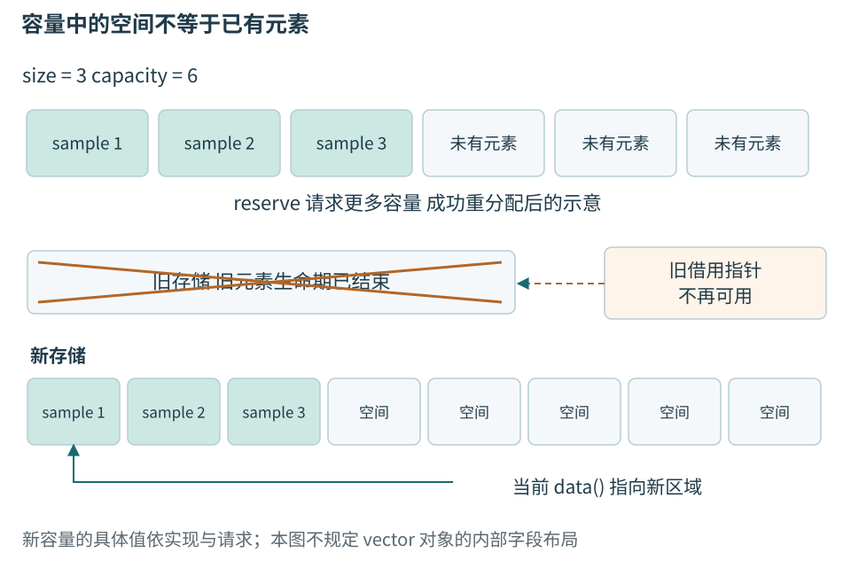
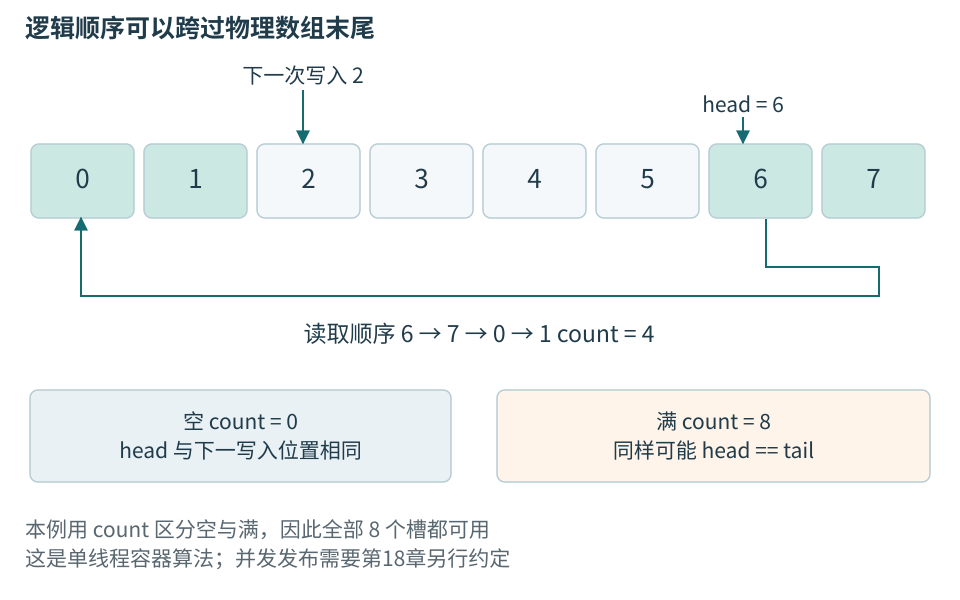
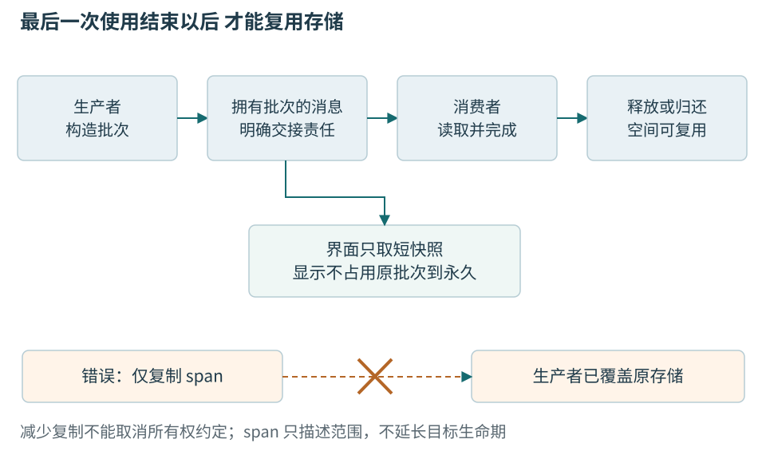

# 第三章 容器 数据布局与有限内存

一条温度记录可以放进一个对象，连续采集的几千条记录却需要共同的组织方式。程序可能按采样次序遍历，按设备身份查找，保留最近一段窗口，或者把整批数据交给后台处理。容器解决的是这些保存和访问问题，同时规定元素何时移动、哪种访问会失效、失败后留下什么。

选择容器的起点应是一条具体数据路径。本章把节点字节暂存、已解析读数、批次计算与设备索引分开，再比较固定数组、vector、字符串、映射和环形缓冲。所有代码是C++20教学片段，没有编译、运行或性能结果；环形缓冲只在单线程或外部互斥保护下解释，不充当可直接放进中断的无锁实现。

## 一 一组读数需要怎样的关系

### 逻辑顺序与内存位置

序列表示先后关系，例如样本1、2、3依次到达；连续存储进一步表示同类型对象在内存里紧邻排列。链表同样可以保持逻辑顺序，却要沿节点链接找到下一项。队列规定先加入的项先取出，不规定必须使用链表还是数组。先分清“允许怎样取”和“实际怎样放”，才不会把一个接口名称当成唯一实现。

数组可按下标定位，是因为元素类型和连续布局确定了每项相对于起点的距离。这个性质只适用于有效数组范围；不能拿一个任意地址，加上看起来合理的偏移，就宣称取得了合法对象。下标从0开始，N个元素的最后一项是N−1，N本身只是结束边界。

对小批次温度，连续遍历通常是很自然的起点。处理器往往按成块数据访问内存，规律访问有机会利用缓存。缓存是保存近期或预期会使用数据的较快存储层次；它不是程序语义的替代品，也不保证任意连续容器都比其他结构快。记录里如果还含指向外部字符的指针，记录对象连续不意味着字符也连续。

### 先把对象数量限定下来

下列Sample是进程内对象。它不定义串口传输布局；第四章会按字节单独说明协议。固定宽度整数类型只有实现提供相应精确宽度时才存在，示例要求目标支持这些类型。[1]

```cpp
// 教学类型，未编译、未运行。
#include <array>
#include <cstdint>
#include <span>

struct Sample {
    std::int32_t temperature_mC{};
    std::uint32_t sequence{};
};

std::array<Sample, 3> batch{{
    {25000, 1}, {25100, 2}, {24900, 3}
}};
```

`std::array<Sample,3>`中的3属于类型，这个对象始终有三个Sample元素，不因本次只测到两条而自动缩短。若用固定数组容纳“最多N条”，还需要一个有效数量，且始终不超过N。默认初始化出的零值只是对象初始值，不能自动当作有效0°C样本。

固定大小不等于一定在栈上。array可以作为局部对象、长期对象或另一个动态对象的成员，存储位置由其所在对象决定。把一个很大的数组改写成array，并不会自动降低任务栈峰值。对MCU尤其要核对数组在哪里、调用是否递归或重入、同时存在几份。

```cpp
// 同步借用函数；调用期间batch不变。未编译、未运行。
#include <optional>

std::optional<std::int32_t> maximum_temperature(
    std::span<const Sample> samples) {
    if (samples.empty()) return std::nullopt;
    auto maximum = samples.front().temperature_mC;
    for (const auto& sample : samples) {
        if (sample.temperature_mC > maximum) {
            maximum = sample.temperature_mC;
        }
    }
    return maximum;
}
```

这个函数只读一段连续Sample，既不保存视图也不修改来源，所以可以接收满足条件的array或vector。optional把空输入与合法最大温度区分开。读取样本是否有效、是否来自同一次测试，是调用前另一层检查；最大值函数没有凭空建立这些事实。

## 二 vector让数量在运行时变化

### 连续批次的常见选择

文件里陆续读出的记录、一次测量得到的温度、等待显示的消息，都可以组织成一组有顺序的数据。程序通常要逐项处理它们，按位置读取某一项，或者在末尾加入新项。这些操作正是 vector 常见的用途：数量不必在编译时确定，又能让整批元素紧邻存放。

在标准库中，vector 属于按顺序组织元素的序列容器。它尤其适合整批遍历、按位置访问和尾部增长。如果长度在编译期已经确定，可以考虑 `std::array`；如果主要按设备编号等键来组织和查找数据，则要比较关联容器。频繁在中间插删、要求对象地址长期稳定时，也需要重新比较选择。数据数量会变，只是选择条件之一。


这些取舍最终要落到具体操作上。先从三个整数开始，看看创建、读取和追加分别改变了什么，再进一步区分容器中的元素与留给后续增长的空间。

### 从追加读数到容量变化

**保存和读取三个数**

`std::vector<int>` 表示保存整数的 vector。尖括号里的 `int` 是元素类型；`std::` 表示这个类型来自 C++ 标准库。容器里的每一个整数叫一个**元素**，例如下面的 18000、21000和后来加入的24000。这里保存毫摄氏度整数，示例要求int能表示63000。记录身份和测量状态暂不进入求和，完整数据模型应保留它们。

```cpp
// C++20 说明示例，未编译、未执行。
#include <vector>

int main() {
    std::vector<int> readings{18000, 21000};
    readings.push_back(24000);
    const auto count = readings.size(); // 元素数量为 3
    const int first = readings[0];     // 第一个元素为 18000
    int total = 0;
    for (int value : readings) {
        total += value;
    }
    return (count == 3 && first == 18000 && total == 63000) ? 0 : 1;
}
```

定义 `readings` 的语句创建容器并放入两个初始值。`push_back` 把一个值加入末尾，所以原来的顺序不变，列表变成18000、21000、24000。`size()` 告诉程序现在有几项；方括号通过**下标**访问某一项，下标从 0 开始，因此三个元素的有效下标是 0、1、2。`auto` 让编译器从表达式推导变量类型。范围 `for` 则逐项取值，这里将三个毫摄氏度数值相加。末尾检查元素数量、首项和总和；条件全部成立时返回 0，否则返回 1。

长度可变并不等于任何下标都可用。此时 `readings[3]` 已越过元素范围，普通下标访问不会替你做边界检查。`readings.at(3)` 会检查范围并在越界时抛出异常，也就是通过语言的错误处理机制中断当前正常路径。接收外部输入作为下标时，仍应明确检查规则，而不能把没有立刻崩溃当成访问合法。

容器也能保存字符串和自定义记录，不过一个 `vector<T>` 的元素类型固定为同一个 `T`。更复杂的类型会带来更复杂的创建、复制和销毁行为。先把整数版本理解清楚，后面再看这些行为怎样影响性能和失败处理。

**连续布局与容量预留**

上面的代码说明了怎样操作元素，但还没有解释容器如何为它们安排空间。运行中的程序需要内存来保存元素。通常的 `vector<T>` 将元素放在一段**连续存储**中：第一个元素之后紧接着第二个，再接着第三个。按下标查找不需要从头逐项走过去；顺序处理时，也能沿相邻位置前进。这样的布局让它适合批量计算、排序和与接受连续数据的接口交换内容。[2][3]

连续不表示“所有有关的数据都挤在一起”。这里用 Record 代表自定义记录类型；`vector<Record>` 中的记录对象连续，如果每条记录还有自己单独保存的长字符串，那些字符仍可能分散在别处。现代处理器通常能从规律的访问中获益，但具体是否更快，还要看记录大小、间接访问和实际负载。C++ Core Guidelines 建议默认考虑 vector，是选型起点，不是普遍的速度保证。[4]

现在回到追加操作。已有三个元素，又来了第四个，容器需要让新元素紧挨着原有元素。如果每次追加都只准备刚好够用的空间，就可能频繁更换整段存储。因此，vector 可以在现有元素之外预留空间。已有多少元素、当前存储能容纳多少元素，是两个不同的数：

- `size()` 是现在已经存在的元素数，也是可访问范围的依据
- `capacity()` 是当前存储在不重新分配的情况下能够容纳的元素数，可能大于 `size()`

`data()` 提供已有元素连续区的起始位置，便于把这段数据交给其他接口。它不会替你检查数量；空 vector 没有可访问元素，无论 data() 返回什么，都不能用它读取第一个元素。容器管理存储与其中元素，不表示标准规定它的内部必须保存某几个字段。[2][3]

把列表想成一排连续的格子有助于理解，但要保留一个区别：预留格子不是已经存在的元素。一个空容器调用 `reserve(100)`，只是请求足以容纳至少 100 个元素的容量；它的 `size()` 仍为 0，不能立刻写 `v[0]`。要逐条追加，用 `push_back`；如果确实需要先有一百个整数元素，再逐项填写，可以使用 `resize(100)`，对这里的整数例子，新增加的元素初始化为 0。[2][3]

文件头已经给出准确记录数时，一次预留通常比反复猜测更合理。若后续代码要逐个构造，也就是创建并初始化完整记录，则先预留再追加；若后续算法需要按下标填写现成元素，则先调整大小。两者表达了不同的工作方式。对复杂类型，提前创建一批随后又被覆盖的元素还可能产生额外成本。

当追加后的元素总数超过容量，原存储便不够用了。vector 会取得一块更大的存储，在那里构造所需元素，成功后释放原来的存储。这叫**重新分配**，日常讨论里也常称为扩容。容量究竟增长多少由实现决定；标准不要求每次都翻倍。




图03-1 元素数量和存储容量不同。图中容量仅作示意，既不规定增长倍率，也不规定vector对象内部字段。

到这里已经能看出 vector 的基本取舍：它提供简单的连续布局和方便的尾部增长，但增长有时会搬迁已有元素，中间插入或删除则可能需要移动后面的元素。对整批数据进行处理时，这常是值得接受的代价；要求对象始终待在同一个地址时，就需要更仔细地设计。

### 修改会影响已有借用

**引用 指针与元素生命**

读取一个整数，可以把它复制到另一个变量，也可以保留对原元素的访问。两者不是一回事。`int first = readings[0]` 保存自己的整数值；`int& first = readings[0]` 中的 `&` 声明了一个**引用**，可以把它理解为原元素的另一个名字。引用不会自动复制元素，也不负责延长元素的生命。**指针**则保存对象的地址，程序可通过它找到原对象。

函数只想临时读取一份大记录时，借用原元素能避免复制。一个对象从开始存在到生命结束的时间，叫作它的**生命周期**。借用的便利带来时间条件：使用指针或引用时，原对象必须仍然存在，访问也必须仍然有效。这里的“借用”是对这种使用关系的描述，不表示 C++ 会自动替所有借用检查有效期。

例如，一个温度趋势界面记住某条记录的地址，打算下一次刷新时读取。同一线程在这期间追加了一批温度读数，触发重新分配。vector 变量还在，记录内容也还在列表中，却已经处于新的存储位置；旧地址不能继续用。C++ 不会登记所有曾交出去的地址，再在搬迁后逐一更新。

下面刻意请求比当前容量更多的空间，用来明确这一边界，不依赖某家标准库的增长倍率：

```cpp
// C++20 说明示例，未编译、未执行。
#include <vector>

int main() {
    std::vector<int> values{10, 20};
    const int* saved = &values[0];
    const auto capacity = values.capacity();
    if (capacity == values.max_size()) return 0;

    values.reserve(capacity + 1); // 成功返回时必定重新分配
    // 此后不能再通过 saved 访问原元素。
    const int current = values[0];
    return current == 10 ? 0 : 1;
}
```

`const int*` 是用于读取整数的指针，`&values[0]` 取得第一个元素的地址。`max_size()` 给出这个容器能够支持的元素数量上限，检查它是为了不在上限处再加 1。预留请求成功后，旧指针失效；从当前容器重新取 `values[0]` 则仍能读到 10。这个例子没有解引用失效指针来制造崩溃，因为规则已经足以判定那样的访问不成立。[2][3]

“成功返回”也有意义：申请内存和构造元素可能失败。后文会讨论复杂元素怎样影响失败后的保证。眼下先记住，vector 的生命、它所管理的存储以及其中某个元素的有效访问期，并不总是一起开始、一起结束。

把地址改成下标能解决一部分问题。若只是重新分配，稍后用下标访问当前容器，可以重新找到相同位置；若前面删掉一项，原来的下标 5 却可能指向另一条记录，排序也会改变对应关系。需要持续跟踪“同一条设备记录”时，通常应该保存不随排列改变的业务 ID，再通过查找找到当前对象。地址稳定、位置稳定和业务身份稳定，是三种不同的要求。

**迭代器与序列修改**

除了下标，C++ 算法还常使用**迭代器**来表示序列中的位置。它像一个可以向前移动的访问入口：`begin()` 指向起点，`end()` 表示最后一个元素之后的位置。`end()` 本身不指向元素，不能读取它；它主要用于判断遍历是否结束。

尾部追加若没有重新分配，原有元素的指针和引用可以继续使用，但原先的 `end()` 已失效，因为序列的终点变了。没有重新分配的中间插入，会使插入点及其后的指针、引用和迭代器失效，包括原来的 end；插入点之前的访问则保持有效。删除也会使删除位置及其后的迭代器和引用失效。若发生重新分配，原有元素的指针、引用和迭代器都失效。[2][3]

最初例子中的范围 `for` 看起来没有写迭代器，但它在循环开始时会取得起点和终点。如果一边范围遍历同一个 vector，一边向末尾追加，即使提前预留了足够容量，也不能仅凭“元素地址没变”判定安全；追加后继续循环会再次使用原先的结束位置。

若任务只是处理最初的一批整数，并把副本附到末尾，可以直接表达这个范围：

```cpp
// C++20 函数体片段，需包含 <vector> 和 <cstddef>。
// 未编译、未执行。
std::vector<int> values{10, 20, 30};
const auto count = values.size();
for (std::size_t i = 0; i < count; ++i) {
    const int value = values[i];
    values.push_back(value);
}
```

`std::size_t` 是用于表达大小和下标的无符号整数类型。`count` 固定了本轮要处理的原始数量，每次从当前容器取值。局部变量 `value` 持有自己的整数，不依赖插入前的地址；新追加的元素不进入本轮范围。若把它改成引用，或让处理过程删除、排序原元素，就要重新分析，不能机械搬用这个循环。

做读数换算或批量清洗时，分别使用输入、输出两个容器往往更直接。删除遍历中的元素时，则可以使用 `erase` 返回的后续有效迭代器，继续正确的遍历。共同要点是让修改方式和遍历方式相配，而不是把所有安全性都寄托在预留容量上。

**视图与消费完成时间**

前面的借用只涉及一个元素。如果函数需要读取整段数据，C++20 的 `std::span` 可以把起始位置和元素数量组合成一个视图。**这种非拥有视图**提供访问已有数据的方式；它不保存一份独立副本，也不负责拥有和销毁这些元素。复制一个 span，复制的是访问入口与范围，而不是整段数据。[2][3]

```cpp
// C++20 函数体片段，需包含 <vector> 和 <span>。
// 未编译、未执行。
std::vector<int> readings{18000, 21000, 24000};
std::span<const int> view{readings};
const int first = view[0]; // 读取 readings 的第一个元素
```

这里的 view 覆盖三个已有元素，const 表示不能通过它修改整数。数据仍由 readings 管理；view 销毁不会销毁这些整数，复制 view 也不会为它们延长生命。如果 readings 重新分配，旧 view 不会自动跟到新存储中。

例如，温度解析模块生成一批采样值，再同步交给批次统计函数，也就是等批次统计函数处理完才继续向下执行。只要使用期间底层数据仍然存活，且没有发生使访问失效的修改，传递 `span` 就很自然。如果改成异步处理，提交后台任务后生产者便继续运行，消费结束时间不再是函数返回时间。后台任务复制了一个 `span`，生产者却可能已经开始复用保存采样值的缓冲区。若只是原地覆写，元素可能仍然存活，任务读到的却已经是下一批数据；若销毁容器或发生重新分配，视图会悬空。不同线程若在缺乏所需同步的情况下读写同一元素，还可能发生数据竞争，违反 C++ 的并发访问规则。这几种错误需要分别处理，复制视图都不能解决。


`span<const Sample>` 中的 Sample 表示采样值类型，const 表示不能通过这个视图修改元素；这个限制不能阻止其他持有者修改原容器，也没有提供线程同步。把类型写成只读，不能代替生产者与消费者之间的时序安排。

接口的选择可以从接收方真正需要什么出发。界面只显示标题和时间，复制这两个字段形成快照，往往比共享整份日志更省心。一个完整批次要交给后台处理，可以转移拥有它的对象，让接收方负责保留到任务完成。多个消费者确实需要同一批不可变数据时，再考虑共享所有权与同步。这里的所有权指负责保留数据并在适当时候销毁它的责任；共享所有权让多个持有者共同维持这段生命，共享的数据能否被安全修改仍需单独设计。

有时要求恰好相反：记录的地址要稳定，记录集合却频繁增长。`std::unique_ptr<Record>` 是独占管理一份 Record 的智能指针，通常在自身销毁时销毁所指向的记录。把这样的指针放进 `vector`，可以将指针自身的迁移与记录的存储分开；仅仅因为这个 `vector` 重新分配，被指向记录的地址不会随之迁移。不过，删除或重置相应智能指针仍会结束记录的生命。这种安排还有间接访问和通常的逐对象分配成本，适不适合需要结合访问模式判断。

### 迁移的是对象而不只是字节

前面通过重新分配解释了旧地址为何失效。接下来再看搬迁本身：它不只是在另一处找够字节。元素是对象，构造和销毁决定它何时可供使用，并负责适当地取得和清理它管理的资源。容器取得原始存储和在其中构造元素，是相关但不同的事情。重新分配的简化过程因此是：取得新存储，在那里构造所需元素，成功后清理旧元素和旧存储。这个过程说明了地址为何改变，也带来一个更深的问题：构造到一半失败，容器该留下什么状态？具体实现可能使用专门优化，构造顺序还会受操作和别名关系影响，不能把简图当成实现源码。

对整数而言，搬迁似乎只是复制一些字节。一个记录类型却可能拥有字符串、缓冲区、文件句柄或其他资源。复制通常要建立可独立使用的新值；移动则允许新对象接管旧对象管理的资源，避免不必要的复制。类型的移动构造函数定义了新对象怎样完成这种接管，它也可能执行用户代码。连续存储没有抹去对象语义，不能对一般类型随意用逐字节复制函数 `memcpy` 代替正确的构造和销毁。

假如前几个元素的资源已转移到新位置，下一个元素的移动构造抛出了异常，想把全部东西原样放回去并不容易。恢复动作本身也可能失败。移动是否会抛出，因而会影响容器能够给出的异常保证。`noexcept` 表达函数不让异常逃出的承诺；它经常出现在相关讨论里，原因就在这里。WG21 的早期设计论文也专门分析过这个冲突。[5]

为容器提供和回收存储的对象称为分配器，元素的创建也通过相关机制完成。就 C++20 的尾部单元素插入而言，满足复制插入要求，或者元素具有不抛出的移动构造时，相关条款提供异常后的无效果保证，也就是操作失败时容器保持本次操作前的状态；对于不满足复制插入要求的类型，如果移动构造抛出，效果可能未指定，不能依赖原内容仍然保持。[2][3]

“复制插入”是包含分配器语义的库要求，不能只凭看到一个拷贝构造函数就判定满足。其他修改操作还要查看各自的条款。

实践中，可以先查看自己的类型是否真的需要手写复制、移动和析构。用合适的资源管理成员表达所有权，常常能减少特殊成员函数里的错误。如果必须自定义，就要把可能抛出的步骤和资源转移顺序说清楚。只有确实不会让异常逃出时，才应承诺 `noexcept`；异常若逃出不抛出函数，会调用 `std::terminate` 终止程序，给声明加一个关键字并不能修好资源设计。

默认分配器通常足够，但自定义分配器还可能影响两个容器之间转移存储的条件。这里谈的是把一个 vector 的内容移交给已经存在的另一个 vector，也就是容器的移动赋值，不是同一个 vector 扩容时搬迁元素。例如，不能不看分配器传播规则和实例是否相等，就断言任何 `vector` 移动赋值都只会交换几个指针。即使可以接管源容器的存储，目标容器原有元素的销毁成本也不能忽略。类型和分配器都是容器成本与失败行为的一部分。判断一次操作的成本，既要看管理存储的方式，也要看元素自身做了哪些工作。

### 容量怎样进入时间和内存预算

现在可以更准确地谈 vector 的快与慢。复杂度描述成本随数据规模怎样增长，不是某台机器上的毫秒数。尾部追加具有摊还常数复杂度：把一长串追加的总成本分摊到每一次上，平均的数量级不随已有元素数线性增长。它允许其中某次追加因重新分配而较慢。因此，离线文件转换关注的总体吞吐，与交互程序关心的一次卡顿，可能对同一实现给出不同评价。

用固定翻倍作简化模型，容量增长时迁移的元素数像 1、2、4、8 这样累加，增长到 N 个元素前的总迁移量仍与 N 同阶。这个推导解释了留出增长余量为什么有用，不表示标准要求两倍增长，也没有计算元素构造、分配器、内存页面或线程调度的真实代价。

可信的规模信息很有价值。文件头给出了记录数，或一帧处理中已经算出结果上限，一次合理的 `reserve` 可以减少后续重新分配。反过来，每追加一个元素就先调用 `reserve(size() + 1)`，可能把原本的增长余量逐步消掉。在按请求量提供容量的实现模型下，反复迁移会产生 1+2+… 的平方级成本。“主动管理容量”本身并不保证优化。

预留也占用内存。为应付极少出现的大批次，给每个连接都保留很大的容量，可能把单次延迟问题换成整体内存压力。调用 `clear()` 会销毁元素而保留容量；`shrink_to_fit()` 只是减少多余容量的请求，不能假定一定生效，若发生重新分配还会使旧借用失效。保留与释放都应服从实际使用周期。[2][3]

要比较自然增长与一次预留，先确认两者产生的内容一致，再观察相同负载下的批次耗时、容量变化和峰值内存。关注偶发卡顿时，还要看慢批次分布，不能只报告平均数。记录工具链、标准库、优化选项、硬件、输入规模和重复次数，才能让结果有解释空间。给元素加计数器或日志会改变成本，这类仪表化结果最好与生产类型的计时分开。

对实时控制循环，预先分配更只是论证的一部分。元素内部还可能分配，其他调用可能阻塞，超限时也需要处理策略。一次 `reserve` 不能替整条调用链承诺最坏延迟。


## 三 用算法时先检查范围

### 起点 终点与算法能力

**迭代器**表示序列中的一个可访问位置，并提供在位置间移动的方法。它有时就是指针，有时是包含节点链接或额外状态的对象。解引用当前迭代器表示访问对应元素；推进迭代器表示走向后续位置。结束位置通常是一个不可解引用的边界，不是一项隐藏的最后元素。

用于写结果的输出迭代器则表达写入和推进能力，不必同时支持读取；例如追加适配器可以只接受新值。

传统算法常接收半开区间 `[first,last)`：first 包含在范围内，last 不包含。空区间可以由二者相等表示。这种约定便于拼接相邻区间，但仍要求从 first 能按照相应规则到达 last。把来自不同容器的两个迭代器随意拼成区间，不会因为类型相同就合法。

迭代器有不同能力。输入迭代器适合单向读取，未必能多次重读相同位置；前向迭代器增加多遍历要求；双向迭代器可以前后移动；随机访问迭代器支持常数复杂度的位置跳转与距离运算；连续迭代器进一步把相邻元素访问与连续对象地址联系起来。能力更强不是说每个操作都更快，而是允许算法依赖更多结构性质。[6]

例如排序需要对元素进行比较、交换和重新组织。经典 `std::sort` 要求随机访问迭代器，因此不能直接把链表的 begin/end 交给它。`std::list` 提供自己的 sort 成员，利用节点连接完成排序。泛型算法与成员算法都合理，接口选择要匹配结构所能提供的操作。

反过来，一个算法做 O(log n) 次比较，不代表它只移动 O(log n) 次。对不支持随机跳转的有序序列进行通用二分查找，比较次数可以很少，却仍需多次推进迭代器，总推进量可能是线性的。对于有自己的树结构的 `map`，成员 lower_bound 能沿结构下降，不应只因为名字相同就换成通用算法。

算法适用性还涉及元素操作。可遍历不等于可修改，可修改不等于可交换。`map` 的键不能通过普通迭代器任意改成另一值，否则会破坏容器次序；`vector<const T>` 也不是把任何数据“设成只读”的通用方法。类型系统和算法约束会拒绝一部分不合法组合，但未被类型表达的语义条件仍需要人理解。

### 排序 查找与删除各有前提

很多算法把重要条件留给调用方。二分查找要求范围相对于相关比较满足分区条件；合并两个有序范围要求两边遵守同一比较关系；把结果写入输出迭代器，要求输出位置可写且空间足够。调用名称并没有隐含完成这些准备工作。

复制算法是一个典型例子。一个空 vector 调用 reserve(100)，仍然没有一百个已存在元素；把 begin() 当成容纳一百项的输出位置不合法。可以先调整元素数量，或者使用 `back_inserter` 这样的输出适配器，让每次赋值转换成追加操作。两种方案的对象构造和容量成本不同，应按需要选择。

**谓词**是返回判断结果的可调用对象；**比较器**定义元素间的次序。算法可能以与直观逐行代码不同的次数或顺序调用它们。若比较器通过计数改变自己的判断，或依赖正在被修改的外部状态，结果可能失去所需的语义性质。需要记录日志或统计时，应保证这些副作用不改变比较关系，并区分仪表化成本与原始性能。

删除算法也需要分清层次。传统 `std::remove_if` 会把保留元素整理到前部并返回新的逻辑结束位置，却不负责改变 vector 的实际 size。随后使用成员 erase 删除尾部对象，才完成容器层面的删除。C++20 的 `std::erase_if` 为相应容器提供更直接的组合接口，但失效与异常规则仍需按容器核对。算法返回一个位置，不等于容器已经完成所有资源管理。

如果选择带执行策略的算法，还需要另外核对允许的并行、向量化、函数对象行为和异常处理规则。不能把普通循环包进并行策略后，继续无保护地修改共享计数或调用依赖顺序的副作用。并行执行是额外契约，不是性能开关。本书在并发与性能章节分别展开其正确性与测量。


## 四 字符串和视图分别保留什么

### 字符内容和字符串对象

`std::string` 管理一串 char 元素，并在其接口约定中提供末尾零字符等能力。它不自动判断内容是否为 UTF-8，也不把 size 转换成用户看到的字符数量。第四章将讨论的字节、码点与字素簇区别，在标准字符串中仍然适用。

普通 string 可以包含中间的零字符。把它的 data 交给只读到第一个零的 C 风格接口，可能丢失后续内容；相反，接收字符串视图的接口通常同时得到长度，可以表达中间零。接口连接处应明确接收的是带长度字节序列还是零结尾字符串，而不是把所有 char 指针视为相同格式。

许多实现使用短字符串优化，把较短内容直接放在字符串对象内部。但阈值、布局和是否采用这种优化，不是可移植接口保证。不能把“我试了十个字符没有分配”写成库级资源承诺，也不能因移动后某次地址没变，就长期保留原有字符指针。

字符串拼接与格式化同样有容量和失败成本。知道可信的最终长度时可以合理预留，但预留不应跳过长度上限与溢出检查。若只需要临时读取一小段已有字符串，可以使用视图；若需要保留到来源销毁之后，就需要拥有副本或另有明确所有者。


### 短文本也有保留责任

设备型号、错误描述和工件编号经常以字符串保存。显示函数若只在当前调用中读取，可以接受string_view；测试记录要保存到以后，则应拥有字符或引用一个明确长期存活的所有者。不要因为编号通常只有十几个字符，就把某家标准库的短字符串优化当成接口保证。

```cpp
// 同步解析片段，输入长度已受上层限制；未编译、未运行。
#include <string>
#include <string_view>

std::string save_device_name(std::string_view input) {
    return std::string{input};
}
```

这段代码建立拥有型副本，使返回值不依赖input的来源。它没有验证编码、业务长度或禁止字符，这些应由设备身份入口完成。复制解决生命期，验证解决含义，二者不能互相替代。string_view截取中间内容时，末尾也不保证恰有零字符；交给要求C字符串的SDK前，要使用明确带长度的接口或建立符合要求的字符串。[7]

## 五 按设备身份寻找记录

### 顺序查找未必需要先优化

若一台教学工站同时只连接四个节点，在vector里逐项比较device_id通常足够清楚。它的成本随记录数增长，称为线性查找；并不意味着在四项上一定慢。建立索引也有存储、更新与一致性责任，不能因为数据有名字就必须引入哈希表。

记录越来越多、查询很频繁时，可以比较map和unordered_map。map维护由比较器确定的键次序，适合按键顺序遍历和范围查询；unordered_map借助哈希缩小候选集合，再以相等关系确认目标。哈希相同不表示键相同，冲突仍需处理。默认遍历次序不构成稳定导出格式。[8]

```cpp
// 教学片段，未编译、未运行；只展示查找，不并发修改。
#include <map>
#include <string>

std::map<std::string, Sample> latest;
const auto found = latest.find("node-A");
if (found != latest.end()) {
    const auto value = found->second.temperature_mC;
    // 在本次访问内使用value；没有找到时不编造零度。
}
```

find不创建不存在的键。若使用latest["node-A"]，不存在时会插入相应条目，这在更新时可能正是需要的行为，在只查询时却可能制造一条看似合法的默认读数。读写接口的差别不能被方括号语法的简短掩盖。

### 比较规则不能在记录存入后随意变化

map的比较器要满足严格弱序。可以先理解为一套前后一致、不会自相矛盾的“排在前面”关系。若比较依赖一个可变的全局开关，元素存入后突然改为另一种规则，容器结构便不再匹配查询依据。希望切换显示排序时，应改变显示索引或重建适当顺序，而不是悄悄改变容器键的含义。

unordered_map的相等规则与哈希也必须一致：被认为相等的键必须得到相同哈希。若相等比较忽略ASCII大小写，哈希却区分大小写，查询便可能去错误桶寻找。设备序列号是否区分大小写应由协议决定，不要为了“用户方便”在某一层单独改写。

rehash是重新组织桶，会使标准unordered_map的迭代器失效，但保持现有元素指针和引用有效；这一保证不能推广到所有第三方哈希表。删除目标仍使目标访问失效。稳定地址没有自动建立业务身份、长期寿命或线程安全。[8]

### 索引要与真实记录一起更新

设vector保存读数，map把设备身份映射到vector下标。删除vector首项后，后续下标全部改变，索引若没有同步更新，就可能合法访问到另一台设备的读数。内存工具不一定报错，因为下标仍在范围内。两个数据结构各自正确，不代表二者关系正确。

可以让主存储按稳定身份组织，或为每次结构修改重新建立索引；也可以避免在索引使用期移动对应位置。选择取决于查询与修改频率。重要的是把“索引项指向同一条业务记录”作为共同不变量，并让失败路径也维护它。先改索引、后追加记录而追加失败，不能留下一个指向不存在对象的入口。

## 六 用环形缓冲承接有界流量

### 固定数组可以循环复用

环形缓冲在一段固定空间里循环写入与读取。逻辑上的下一项不一定在物理上紧邻前一项：到末尾后回到开头。它适合字节暂存和短期读数队列，因为取出一项不必把所有剩余元素向前搬移。

本节选择head表示下一读取位置，tail表示下一写入位置，count表示有效数量。容量N固定且大于0，两个位置都在0到N−1，count在0到N。空和满时head都可能等于tail，所以不能只比较两者；本设计用count区分。另一些实现故意空出一格，它们的可用容量与判满条件不同，不能把两套公式混用。



图03-2 回绕改变物理分段，不改变先进先出顺序。本图为单线程算法关系，不表达内存屏障或中断同步。

下面只保存本章的简单Sample。预先存在N个对象，count决定其中哪些槽位具有业务有效内容；出队后旧字节仍在也不表示还有一条待消费样本。代码拒绝满队列的新项，不覆盖未读项。

```cpp
// 教学类上半部；与下一段组成同一类，未编译、未运行。
#include <array>
#include <cstddef>
#include <optional>

template<std::size_t N>
class SampleRing {
    static_assert(N > 0);
    std::array<Sample, N> slots_{};
    std::size_t head_{};
    std::size_t tail_{};
    std::size_t count_{};

    static std::size_t next(std::size_t position) noexcept {
        return position == N - 1 ? 0 : position + 1;
    }
public:
    bool try_push(Sample value) noexcept {
        if (count_ == N) return false;
        slots_[tail_] = value;
        tail_ = next(tail_);
        ++count_;
        return true;
    }
```

模板参数N使同一写法可形成不同容量的类型。static_assert在编译阶段要求容量合法，这不是已执行的测试。next不用可能溢出的head+count计算目标，只推进一个已知合法位置；回绕前检查末端。Sample由两个固定整数构成，本例赋值不抛出，才使这里的noexcept承诺有依据。

```cpp
// 紧接上一段类定义，未编译、未运行。
    std::optional<Sample> try_pop() noexcept {
        if (count_ == 0) return std::nullopt;
        const Sample result = slots_[head_];
        head_ = next(head_);
        --count_;
        return result;
    }

    std::size_t size() const noexcept { return count_; }
    static constexpr std::size_t capacity() noexcept {
        return N;
    }
};
```

成功入队在原tail写一项，再推进tail并增加count；成功出队先复制当前head的值，再推进head并减少count。每个分支都保持边界关系。空出队没有修改状态，满入队也没有丢弃既有内容。由此能解释每一步为什么保持先进先出，而不是只记模运算公式。

这个实现不适合直接由一个中断写、一个任务读。它们会共同修改count，普通读改写可能相互覆盖，还缺少对槽位内容的发布次序。把count改成volatile不会使操作原子，也不会建立C++线程同步。第十八章会结合具体执行环境解释ISR与DMA；第六章先用互斥保护完整队列操作。

### 满队列是需要被处理的结果

调用者必须检查try_push返回值。若这批样本用于判定平均温度，丢了一部分后继续按原数量计算，结果便有偏差。若只用于趋势预览，可以明确选择覆盖旧显示数据，但应记录丢弃或抽样策略。不能让同一函数在某些调用里静默丢弃、另一些调用里被当成无损通道。

假设节点每100ms产生一条样本，最长消费停顿为1.2秒，停顿开始前队列已有4条。按此构造模型，停顿阶段至少再到达12条；容量16刚好填满，没有突发或时间误差余量。选32是否足够，还要看停顿后的消费是否快于产生、是否有连发和周期抖动。容量计算是带前提的上界分析，实际还需要测量。

环形队列满与协议帧损坏也不能混为一谈。前者说明本地承接能力不足，后者说明某个候选字节序列没有通过格式规则。二者都可能造成sequence间断，但修复不同。日志应分别计数，保留首次发生位置和当时容量水位，避免只记录“丢包”。

## 七 有限内存怎样进入对象设计

### 峰值由同时存活决定

需要估算的不是“一个Sample有多大”这一项，而是所有同时存活的读数、字节缓冲、显示快照、字符串、索引和线程栈。编译器可以在成员之间加入对齐填充，sizeof(Sample)是目标环境的实际对象大小；它不等于线路帧长度，更不意味着vector总成本只有元素数乘sizeof。

数组记录布局把每条样本的字段放在一起，按样本处理很自然；字段分离布局把全部温度与全部序号分开，在只扫描温度的大批运算中可能减少无关访问。但它增加了多个数组长度与位置一致的责任。入门项目通常先用可解释的记录布局，再用真实瓶颈证据决定是否拆分，不为想象中的缓存收益牺牲清晰性。

vector扩容时可能同时存在旧存储与新存储；队列里上一批未处理完，生产者又建立下一批，也会形成重叠。即使最终只有一万条记录，峰值仍可能高于一万条内容量。记录每种对象由谁保留、何时结束，比盯着函数末尾变量数量更能解释内存峰值。

### 分配失败不只发生在new这一行

字符串拼接、容器增长、回调包装和第三方库都可能取得动态存储。给最外层vector预留空间，不能保证元素内部不再分配；`vector<string>`中的每个字符串仍有自己的字符管理。智能指针管理释放，也不能保证申请成功或耗时有界。

桌面软件通常可以接受合理动态分配，并在失败边界给出一致结果。MCU可根据阶段采用启动期集中分配、固定容量或专用池，但不能仅凭“用了C++”断言必须有堆。更不能在关闭异常的构建里，继续依赖捕获bad_alloc来恢复。运行库、分配函数、失败策略和整个调用链必须一致。

分配器负责取得与回收存储，对象构造析构负责对象及其资源。PMR即多态内存资源，让适用标准容器在运行时选择资源；它不是更快的通用容器，也不会接管所有嵌套分配。单调资源适合一批对象共同结束，单独释放通常不回收对应小块，反复扩容可能保留旧块直到整体释放。[9]

```cpp
// 教学函数，使用目标支持的PMR；未编译、未运行。
#include <array>
#include <cstddef>
#include <memory_resource>
#include <vector>

void prepare_bounded_batch() {
    std::array<std::byte, 4096> storage{};
    std::pmr::monotonic_buffer_resource resource{
        storage.data(), storage.size(),
        std::pmr::null_memory_resource()};
    {
        std::pmr::vector<Sample> samples{&resource};
        samples.reserve(64);
        // 先检查真实输入数量，再按既定上限追加。
    }
}
```

null_memory_resource使这条资源链不能继续向普通上游申请，空间不足则按接口失败。4096是教学选择，不保证每个实现都足够，资源还需要满足对齐。内部容器先销毁，随后资源，再到初始缓冲区，依赖顺序才成立。不能返回这个vector到函数外，因为它会继续依赖已经结束的resource和storage。

在没有PMR支持或没有异常恢复机制的固件里，不应生搬这段代码。固定SampleRing反而更容易把容量和失败放在接口上；它依然需要位置、并发和栈预算验证。使用更现代的库名不会自动降低证据要求。

## 八 数据交给别人之后 何时可以再用这块空间



图03-3 缓冲交接必须覆盖最后一次消费。选择复制、转移或共享，取决于谁要保留什么，而不是把“零复制”当成唯一目标。

设解析器用一份vector反复收集样本，再把span加入后台队列。提交函数返回后，它clear并写入下一批。clear结束原元素生命并使原有元素访问失效，即使capacity和地址数值没变，旧span也不能继续使用。另一个不同情形是生产者没有clear，而是原地覆盖仍然存活的元素；这时后台可能合法定位到空间，却读到下一批内容。若并发读写重叠，还可能有数据竞争。元素生命、批次内容和并发合法性必须分别检查。

需要补充的事实是队列保存什么、消费者什么时候结束、生产者在哪个时刻复用以及是否存在其他借用。诊断可在批次封口处记录generation、首尾sequence和样本数量，在消费入口再次记录；若身份变化发生在队列等待期间，就优先审查共享缓冲。仅在显示处复制最后一个温度无法修复已经错用的批次判定。

修复可以让消息拥有整份vector，或让消费者得到一份副本；若使用缓冲池，应由明确的归还动作决定何时再次分配同一槽位。共享不可变批次也可以，但要能解释最后拥有者何时结束。小批次先选择容易验证的方案，再测复制成本，往往比先构造复杂无锁池可靠。

验收应强制延迟消费，连续生产不同sequence范围，检查每个消费批次内容与封口时一致；还应覆盖取消导致消息丢弃、队列满、消费者失败和停止后释放。这里没有执行这些验证，也不把“程序没崩溃”当作批次一致性证据。

标准库调试迭代器模式可以辅助发现部分无效访问，但支持范围和构建兼容必须按所用实现核对。它会改变部分类型布局或成本，不能把诊断构建数据直接当作发布性能。[10]

另一个典型故障是预留后仍在范围for内push_back。预留可能保住元素地址，但原end已经失效，循环仍会使用它。修复应固定原始数量并按当前容器重新取值，或把输出放到独立容器；若本来需要处理不断增长的新任务，应使用有界工作队列并给出终止条件。不能把一次reserve当作对所有修改的许可。

## 九 面试追问把局部性质接回整条路径

**vector为什么经常是默认选择 链表插入不是更快吗**

vector连续、按位置访问简单，适合批次遍历。链表在已经拥有目标节点位置时，可以用局部链接修改实现插入；但找到位置、分配节点、追随指针都可能花费成本。若要求地址稳定或频繁已定位插删，链表可能合理；若逐项扫描温度，连续布局通常更直接。不能只比某一个操作的复杂度。

**reserve和resize最重要的区别是什么**

reserve管理容量，不增加已有元素。resize改变元素数量，新元素按相应构造规则建立。需要按下标写64条时，必须先有64个合法元素；只有reserve(64)仍不能写空容器的第0项。外部数据给出的长度还要先通过上限与溢出检查。

**摊还常数追加能否保证每次延迟稳定**

不能。摊还约束一串操作的总成本，允许某次迁移很多元素。分配、元素内部行为和操作系统也会影响实际耗时。需要单次时限时，应减少运行阶段增长并测量完整路径，不能从复杂度符号推出毫秒保证。

**把指针改成下标能否解决失效**

跨过仅重分配后再定位同一位置，可以帮助；删除或排序会改变位置对应的业务记录。此时需要稳定身份或限制修改。边界内读到错误节点，是逻辑身份问题，AddressSanitizer也未必发现。工具补充证据，不能替代关系判断。[11]

**固定环形缓冲为什么仍可能丢数据**

固定只保证存储容量不随入队增长。产生持续快于消费会填满，满时策略若忽略返回值就丢失；并发使用未同步、空满判断混乱也会破坏内容。应分别验证单线程不变量、并发交接和系统流量，不能用一次正确回绕覆盖全部条件。

**PMR能否保证整个函数零分配**

只能控制接入该资源的分配路径。嵌套普通字符串、日志和外部库可能另行分配；单调资源还可能向上游扩展。要证明限定阶段不向通用堆申请，需要核对所有调用与资源设置，并在目标构建中观察。本文只有设计说明，没有这类运行证据。

## 资料与核验范围

核验日期2026年10月6日。规范基线为WG21公开固定草案N4861，HTML条款镜像仅辅助定位，不将滚动草案新增能力写进C++20。全部代码为教学、未编译、未运行；PMR支持、分配行为、对象大小和MCU时延待目标环境验证。

1. WG21 [C++20公开草案N4861](https://www.open-std.org/jtc1/sc22/wg21/docs/papers/2020/n4861.pdf)：array、cstdint和对象规则
2. N4861 [vector容量](https://timsong-cpp.github.io/cppwp/n4861/vector.capacity)：reserve、resize与重分配
3. N4861 [vector修改](https://timsong-cpp.github.io/cppwp/n4861/vector.modifiers)：失效与尾部插入异常保证
4. [C++ Core Guidelines](https://isocpp.github.io/CppCoreGuidelines/CppCoreGuidelines#Rsl-vector)：容器工程建议，不是性能测量
5. WG21 [N2855移动与异常安全](https://www.open-std.org/jtc1/sc22/wg21/docs/papers/2009/n2855.html)：历史设计动机，不替代C++20条款
6. N4861 [算法要求](https://timsong-cpp.github.io/cppwp/n4861/algorithms.requirements)：迭代器、范围及算法前提
7. N4861 [string_view](https://timsong-cpp.github.io/cppwp/n4861/string.view)：字符视图及非拥有关系
8. N4861 [无序关联容器要求](https://timsong-cpp.github.io/cppwp/n4861/unord.req)：相等与哈希、rehash和稳定性
9. N4861 [单调内存资源](https://timsong-cpp.github.io/cppwp/n4861/mem.res.monotonic.buffer)：资源生命周期与上游分配
10. GCC [libstdc++调试模式](https://gcc.gnu.org/onlinedocs/libstdc++/manual/debug_mode.html)：诊断能力与构建边界

11. LLVM [AddressSanitizer](https://clang.llvm.org/docs/AddressSanitizer.html)：地址检查能力及逻辑边界盲区
