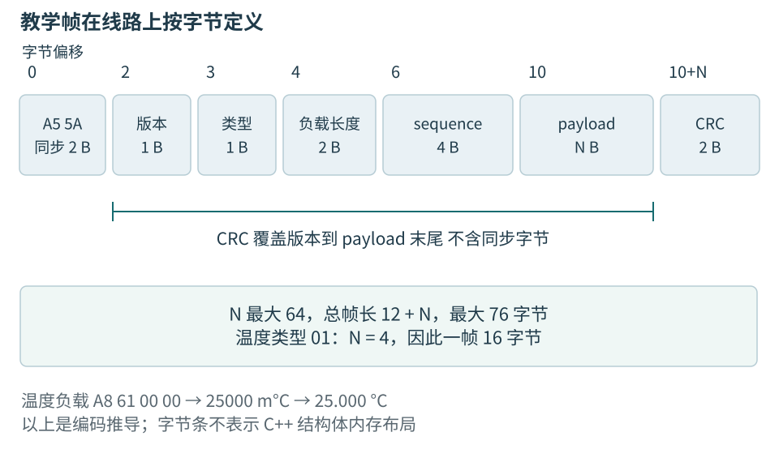
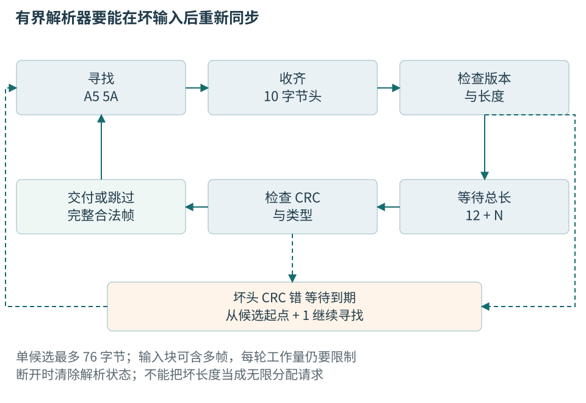

# 第四章 数据表示与可靠协议解析

数据在程序里是有类型的值，在线路上是一段按顺序到达的字节。双方必须共同约定宽度、符号、单位、顺序与边界，接收者才可能还原含义。一个数恰好在合理温度范围内，不能证明这些约定已经一致；两边用了相同C++结构体，也没有自动形成独立于编译器的协议。

本章先解释数值和文本的表示，再完整定义本书的温度教学帧，沿收集、校验、解码、接纳说明流式解析。示例限定八位字节和C++20，全部未编译、未运行。报文是本书明确设计的教学契约，不对应某家真实传感器，也不提供产品安全认证或抗恶意通信能力。

## 一 整数先有值 再有表示

### 值 类型与字节是三件事

整数二百五十八是一个值。十进制的 `258` 和十六进制的 `0x0102` 是这个值的不同写法；把它放进某个 C++ 整数类型，又涉及该类型的范围和运算规则。C++ 把有类型、占用存储的数据实体称为**对象**，一个普通整数或一条复杂记录都可以是对象。对象保存到内存时，还涉及它占多少存储、各部分如何排列。换一种写法不改变值，换一种类型或编码却可能改变可表达的信息。

**位**只有 0 和 1 两种状态。把若干位按约定组合起来，才能表达整数、文字或其他内容。网络规范经常使用 **octet**，明确指八位。C++ 的 **byte** 则是 `sizeof` 使用的存储单位，`sizeof(char)` 等于 1，但一个这样的单位不必恰好八位；其位数由 `CHAR_BIT` 表示。[1] 本章的文件与协议例子都以八位字节为单位，涉及 C++ 代码时也明确这个前提。

类型不仅决定能放多少信息，还决定程序怎样使用它。`unsigned int` 表达非负整数；`int` 可以表达负数。它们即使占用相同大小的存储，运算与转换也不能一概而论。普通 `char` 的有符号性由实现选择，不能把它默认为“小号无符号整数”。处理原始字节时，用 `unsigned char` 或 `std::byte` 表达意图，通常比借用普通文本字符类型清楚。

这里还要区分**对象表示**与**值表示**。对象占用的全部存储属于对象表示，其中实际参与表达值的位属于值表示；二者不一定完全重合。[1] 后面讨论结构体时，还会遇到为布局而留下的填充空间。因此，“两个对象值相等”和“它们占用的每个字节都相同”不是通用的等价关系。

### 整数范围与运算边界

先用一个没有填充位的八位示意模型观察范围。无符号表示可以容纳 0 到 255；补码有符号表示可以容纳 −128 到 127。补码中，全部位为 1 表达 −1，而同一组位按无符号规则解释则是 255。这里的八位模型不表示 C++ 的 `int` 只有八位。

C++20 已规定有符号整数采用补码表示。实际以无符号类型进行的运算按模 2^N 进行，其中 N 是类型宽度；有符号算术结果超出可表示范围，仍会产生未定义行为。[2]、[3] 窄整数在表达式中还可能先被提升，稍后会继续说明。**补码解决表示问题，没有把有符号溢出变成可依赖的回绕运算。**

未定义行为不是“结果未确定但程序还会照常执行”。它意味着语言没有为该执行规定行为，编译器也不必保留程序员想象的机器指令顺序。例如，不能先对最大的有符号整数加 1，再通过结果是否变小判断溢出。到判断时，前一步已经越过了规则边界。

无符号回绕虽然有定义，也不自动符合业务要求。长度从最大值加 1 回到 0，在语言层面有结果，在缓冲区分配中却可能把一个大请求变成小分配。选择无符号类型，只是选择了运算语义，没有代替范围检查。反过来，环形序号有时正需要模运算，但比较新旧顺序时还必须约定最大间隔，不能直接套用普通大小关系。

标准给内置整数类型规定最低能力，并不把 `int` 固定为 32 位，也不保证 `long` 与指针同宽。`std::uint32_t` 这样的精确宽度类型在实现提供时才存在；它适合表达“恰好 32 位”的要求，不能据此推出整台机器的所有类型都遵循同一宽度。[1] 如果某个文件格式必须包含四个八位字节，就把它写成格式要求；程序支持哪些平台，再由平台检查和实现适配来保证。

### 表达式先计算 再赋给目标

看见左边有一个宽类型，容易以为右边也会用宽类型计算。实际需要先看右侧操作数的类型。

```cpp
// C++20 函数体片段，需包含 <cstdint>。
// 前提：int 至少 32 位，且实现提供 std::uint64_t。
// 未编译、未执行。
int width = 50000;
int height = 50000;

// 在 32 位 int 平台上，下面的乘法会发生有符号溢出。
// std::uint64_t wrong = width * height;

const auto area = static_cast<std::uint64_t>(width) *
                  static_cast<std::uint64_t>(height);
```

错误写法不是“赋值时装不下”，而是两个 `int` 已经先做乘法。把结果赋给更宽的变量，不能修复此前的错误。后一个写法在本例给定的正值下先扩大操作数，乘法结果 2,500,000,000 可以被该无符号 64 位类型表示；若输入来自外部，仍应先排除负数并检查业务上限。

混合有符号与无符号类型时，运算之前还会进行整数提升和通常算术转换。**不是只要出现一个无符号数，结果就一定无符号。** 转换需要比较类型等级以及有符号类型能否表示无符号类型的全部值。[1] 不过，一个常见而确定的例子是 `-1 < 1u`：两边分别为 `int` 和 `unsigned int`，前者会转成无符号值，所以这个比较为假。

这种问题经常出现在外部输入与容器长度相遇的位置。输入中的 −1 可能表示“未设置”，容器的大小则使用无符号类型。没有先处理哨兵值，就把二者混着比较，结果可能与数学直觉相反。更合适的接口是把“缺失”和“有一个非负长度”分开表达；确实需要混合比较时，C++20 在 `<utility>` 中提供的 `std::cmp_less` 等整数比较函数可以帮助保留数值意义，但输入的业务合法性仍须单独检查。[1]

转换本身也有边界。C++20 的普通整数到整数转换，除布尔相关特例外，按目标类型宽度取同余值；不能继续把超范围转为有符号整数笼统写成“由实现决定”。[2] 但**浮点转整数不是这条规则**：小数部分被舍去，而舍去后的值若不能由目标类型表示，行为未定义，不能依赖饱和或回绕。[1] 把收到的数字直接强制转换，既不等于验证范围，也不等于四舍五入。

### 在运算前建立可表示条件

协议里的 `offset` 与 `length` 都是非负整数。检查一段内容是否位于总长 `total` 内，看似可以写成 `offset + length <= total`。但若加法先回绕，比较就失去了原意。先确认起点存在，再比较剩余长度，能避免为验证而制造另一个溢出点。

```cpp
// C++20 完整函数，未编译、未执行。
#include <cstddef>

bool range_fits(std::size_t offset,
                std::size_t length,
                std::size_t total) noexcept {
    return offset <= total && length <= total - offset;
}
```

逻辑与运算从左向右判断；如果 `offset > total`，右边不会求值，因此减法在执行时已经有前提。这个函数只回答范围是否能容纳，允许位于末尾的空范围；它不证明底层真的存在一块这么大的可访问存储，也不决定业务是否允许空字段。

同样，对两个已处于同一无符号类型中的量 `count`、`element_size`，计算乘积前可以检查：`element_size == 0`，或者 `count <= limit / element_size`。这里 `limit` 应取相关机器范围与应用预算中更紧的上限，且先处理零，避免除零。用于分配时，还要核对容器容量限制及分配失败。一个数既可能在数学上合理、在机器类型里装得下，又可能远远超出当前服务愿意接受的资源量。

宽类型减少某些溢出风险，但“先转成最大的整数”不是普遍解法。两个 64 位输入的乘积仍可能超出 64 位，负数转无符号也不会保留“非法”的含义。真正需要保留的是操作前可说明的条件，以及超出条件时明确的结果。


## 二 字节序 单位与时间要一起解释

### 小端不是把数字倒过来

十六进制0x12345678按小端写成78 56 34 12，按大端写成12 34 56 78。每一格是一个八位字节，格内位的意义没有被反转。小端与大端改变多字节数值的排列，通信物理层怎样逐位发送则是另一项约定。

本书温度帧使用小端。解码可以逐字节组合，不要求接收地址满足整数对齐，也不把外部缓冲强制解释成一个C++整数对象。每个字节先扩大为无符号32位再移位，避免窄整数提升影响中间运算。

```cpp
// C++20教学函数，未编译、未运行。
#include <climits>
#include <cstddef>
#include <cstdint>
#include <span>

static_assert(CHAR_BIT == 8);

std::uint32_t read_le_u32(
    std::span<const std::uint8_t, 4> bytes) noexcept {
    return std::uint32_t{bytes[0]}
        | (std::uint32_t{bytes[1]} << 8)
        | (std::uint32_t{bytes[2]} << 16)
        | (std::uint32_t{bytes[3]} << 24);
}
```

固定范围span表达这里需要四个元素，调用者仍要先保证这四个字节实际存在。std::endian可以帮助描述平台字节序，不能代替协议解码；memcpy解决一部分对象字节复制问题，也不会替你交换大小端或验证输入。[1]

温度25000的32位十六进制表示为000061A8，按本协议发送A8 61 00 00。负温度−1000按32位二补码表示为FFFFFC18，发送18 FC FF FF。这两条是表示规则的手算，不是从设备抓到的实测报文。

解码有符号温度时，可以先取得完整uint32_t位模式，再按C++20已约定的二补码和精确宽度类型恢复有符号值。本章完整候选解码器用bit_cast复制位表示；这不是把未知地址reinterpret_cast成int32_t指针。bit_cast不验证业务温度，也不接纳截断输入，前置校验仍必须完成。[1]

### 整数刻度不等于测量精度

把温度保存为毫摄氏度，只说明最小表示步长为0.001°C。传感器是否具有相应分辨率、重复性或准确度，取决于测量链。输出25.123°C中的三位小数可以全部是显示格式，不是三位都可靠的证据。

从浮点摄氏度转换到temperature_mC时，应先检查有限性、允许范围和舍入规则，再乘以1000并确认目标整数能表示。直接强制转换会舍去小数，不等于四舍五入；对NaN或超范围值，转换可能不合法。若数据本来已是毫摄氏度整数，再乘1000就是重复换算。单位转换应集中在明确边界，并保留原始值供诊断。

### 浮点表示与测量分辨率

浮点数用有限的有效数字和指数表示数值，适合在较大范围内表示测量与计算结果。这里的“浮动”来自表示尺度可以改变，而不是每个数都拥有任意精度。

以常见 IEEE 二进制双精度格式为例，普通有限值使用 53 位有效精度，存储共 64 位，分为符号、指数和小数部分；它还定义了零、非正规数、无穷大与 NaN 等表示。[4] 这些是指定浮点格式的性质，不能只凭 C++ 类型名 `double` 就断言任何实现都采用完全相同的布局。需要依赖时，应核对目标实现及 `std::numeric_limits` 提供的属性。[1]

有限的二进制小数可以精确表示二分之一、四分之一，却不能精确表示十分之一。原因与十进制不能用有限位写完三分之一类似。于是，输入、计算或输出格式转换，都可能需要把理想值映射到附近的可表示值。这不是某个十进制字符串“写错了”，而是选定表示的能力有限。

数值越大，相邻可表示值的间隔也可能越大。对上述 53 位精度格式，0 到 2^53 范围内的整数都能精确表示，但 2^53 后面的每个相邻整数就未必能区分。因此，账号或消息 ID 即使从不参与计算，也不适合为了方便而统一转成浮点数。两条不同 ID 一旦在转换中合并成同一个值，后来再增加显示位数无法恢复丢掉的信息。

NaN 表示“不是一个数”，并不是业务缺失值的通用替代品。按常见 IEEE 比较语义，NaN 与自身比较相等也为假。[4] 假如验证逻辑只拒绝“小于下限”和“大于上限”，没有另行处理 NaN，就可能漏过它。接收要求有限数值的接口时，应明确检查有限性；允许缺失时，则使用协议定义的缺失形式。

把钱、配额或离散刻度保存为整数，常能避免某些十进制表示问题，但还要写明最小单位、舍入规则与范围。把测量值保存为浮点数，则要明确精度需求和特殊值策略。容差应来自测量与判定需求；数据表示这一层首先要回答的是：准备保存什么、哪些信息会在转换中消失，以及这种损失是否被允许。

### 接收日期和等待期限使用不同时间

**时间点**回答“哪一刻”，**时长**回答“隔多久”。它们可以都存成整数，却不是同一种量。`1500` 可能表示等待 1500 毫秒，也可能表示某个纪元之后的第 1500 秒；缺少单位和基准，数字无法被可靠解释。

墙上时钟用于表达日期时间，可以与日志、人类日程及其他系统对照。它可能因校时而改变。单调时钟用于观察时间向前经过，适合本机耗时和超时预算。[5]C++ 的 `system_clock` 表达系统实时时钟，`steady_clock` 承诺其时间点随物理时间前进不倒退，并以稳定速率推进。[1]

```cpp
// C++20 函数体片段，需包含 <chrono>。
// 未编译、未执行；两次读取之间省略了待计时操作。
const auto begin = std::chrono::steady_clock::now();
// 在这里完成待计时操作。
const auto end = std::chrono::steady_clock::now();
const auto elapsed = end - begin;
const auto elapsed_ms =
    std::chrono::duration_cast<std::chrono::milliseconds>(elapsed);
```

`elapsed` 是时长，不是一个可直接当作日期显示的时间点。转换成整毫秒会丢掉更细的部分；如果原操作只用了不到一毫秒，得到 0 毫秒并不表示没有花时间。时钟分辨率、测量开销和执行噪声还会影响解释，因此代码只说明类型关系，没有给出测量结果。

不要把本机单调时钟的裸计数发送出去，让另一台机器与自己的计数直接相减。两者未必共享起点，重启后的值也不能据此直接比较。跨系统事件关联通常要使用约定的时间表示，并另外处理时钟误差；本机截止时间则可以由单调时钟维护。单调时钟在设备休眠期间怎样计时，也需要按实际平台需求核对，不能仅由名称推出。

C++20 的 `sys_time` 使用从 1970-01-01 00:00:00 UTC 起、排除闰秒的计时方式。[1] “时间戳”本身却不是格式名称：协议仍应明确纪元、单位、精度和时间尺度，不能把任何长整数都默认成同一种 Unix 时间。


### 来源时间不能用接收时间冒充

source_time指来源采样时刻，必须说明设备时钟域和它代表转换开始、结束还是批次标记。received_at在本书指工站接收UTC时间。二者之间可能有采样、设备缓存、线路和主机排队，不能把received_at直接标成测量时刻。

设备自由运行计数与工站单调时钟没有天然共同起点。没有同步与误差条件时，相减得到的“传输延迟”可能没有物理意义。若只判断本地数据多久没更新，可以在接收入口另记本机steady_clock时间。UTC时间便于追溯事件，单调经过时间便于本机期限，两者各自保存用途。

文本时间可选明确受限的RFC3339形式，例如2026-10-06T15:00:00.125Z。Z表示零UTC偏移，数值偏移不是完整地区时区规则。[6] 本基础温度帧不包含时间字段，所以不能声称它提供源时间或跨设备同步；未来扩展必须增添明确定义的消息。

## 三 文本也是协议数据

设备名称和工件序列号常以文本出现。Unicode为文字提供码点编号，UTF-8按一至四个八位字节编码一个Unicode标量值。std::string在八位平台上计算的是字节数量，不是人眼看到的字数。比如A、中和一个四字节编码的表情占用不同字节数。[7]

若厂商规定device_id为最多32个ASCII字符，可以明确限制允许字符与大小写，不需要先引入全Unicode身份规则。若确实允许中文标签，应写明UTF-8、字节上限、非法编码策略和显示截断方法；不能直接截前32字节，因为截断点可能处于一个编码中间。输入块末尾只有半个字符时先等待，输入确定结束后才报告截断。

文字合法与身份相等仍不同。用户看起来相似的两个字符串可能有不同码点；同一个可见字符也可能由不同组合表示。规范化和大小写折叠应按身份契约统一，不能让校验层与查询层各用一套。原始诊断证据也不应在保存前被无记录地替换或清洗。

日志显示接口接受的文本还要限制控制字符与长度。原始字节直接当字符串打印，可能遇到中间零字符、换行或不可见内容，使一条报文看起来像多条事件。排查协议时采用带偏移的十六进制摘要通常更明确，同时限制总量并遮蔽敏感字段。编码合法不是任意公开日志内容的许可。

## 四 温度教学帧的完整定义

### 线路格式独立于进程结构体

本书用一个小型二进制帧解释机制。它以A5 5A两个字节作为同步标记，随后是版本、类型、载荷长度、样本序号、载荷和CRC。载荷是消息的具体内容，CRC是从规定字节计算得到的检错值。长度只计算载荷，不包含帧头和CRC。

| 起始偏移 | 字节数 | 字段 | 约定 |
| --- | --- | --- | --- |
| 0 | 2 | 同步标记 | A5 5A |
| 2 | 1 | version | 当前为1 |
| 3 | 1 | type | 1表示温度样本 |
| 4 | 2 | payload_length | 小端无符号，最多64 |
| 6 | 4 | sequence | 小端无符号采样计数 |
| 10 | N | payload | 含义由type定义 |
| 10+N | 2 | CRC | 低字节在前 |

因此总长为12+N，最大76字节。温度类型1的N必须恰好为4，其载荷是小端32位二补码temperature_mC。即使长度4位于通用上限内，温度类型出现长度5仍属错误。通用边界与类型专属规则应分别检查。



图04-1 教学线帧的字段和覆盖范围。字段宽度仅为示意，以标注字节数与偏移为准；C++结构体、对象填充和主机字节序不参与定义。

一个进程内结构体可以使用int32_t与uint32_t保存解码结果，却不能把sizeof(struct)直接当作帧长度。对象可能有对齐填充，版本改变可能调整成员；若包含string或指针，对象字节更不会自动包含它所指向的内容。pragma pack至多改变部分布局，并不建立单位、版本、校验与恢复规则。[1]

### 这份帧刻意没有承诺什么

sequence按32位无符号计数回绕，帮助判断同一运行段的顺序与缺失；它不是设备身份、命令编号或全球唯一号。设备重启也可能从头计数，需要由boot_id等独立来源确认运行段，不能把序号变小直接解释为网络乱序。

generation由工站为连接创建，属于本地会话身份，不在线路帧中发送。接收操作必须绑定它自己的generation，后续即使重连也不能把旧缓存重新贴成新代际。device_id、boot_id和校准版本需要独立识别协议或已验证会话信息。本温度帧没有状态位，因此不能独立表达传感器断路、过量程或校准有效性。

这不是鼓励真实协议省略这些字段，而是把入门帧边界公开。基础解析得到“格式正确的一个温度数值”，业务接纳仍依赖会话、测量状态与工艺条件。后面的设备和工站章节增加语义责任，不偷偷改变type1的四字节载荷。

### CRC必须规定所有参数

“采用CRC16”不足以互通。CRC以多项式相关的运算压缩覆盖内容，不同初值、反射方向、结果异或与覆盖区间会得到不同值。本例固定width=16、poly=0x1021、init=0xFFFF、refin=false、refout=false、xorout=0x0000，通常称CRC-16/CCITT-FALSE或CRC-16/IBM-3740。维护者资料列出的CRC命名差异也说明，参数比简称更可靠。[8]

覆盖区间从version的偏移2开始，经过type、长度、sequence和payload，止于payload末尾，不含同步标记和CRC自身。算法按最高位方向推进，算出的16位结果在线路上仍按低字节在前保存。这两种方向分别属于位运算和字段编码，不能因为“不反射”就推导出CRC必须大端发送。

```cpp
// 按本章参数构造的教学实现，未编译、未运行。
std::uint16_t crc16_demo(
    std::span<const std::uint8_t> bytes) noexcept {
    std::uint32_t crc = 0xFFFFu;
    for (const auto byte : bytes) {
        crc ^= std::uint32_t{byte} << 8;
        for (int bit = 0; bit < 8; ++bit) {
            const bool high = (crc & 0x8000u) != 0;
            crc = (crc << 1) & 0xFFFFu;
            if (high) crc ^= 0x1021u;
        }
    }
    return static_cast<std::uint16_t>(crc);
}
```

用32位无符号工作寄存器，逐步保留低16位，便于避免不同目标上窄整数提升带来的困惑。用于实现核对的ASCII字节串123456789，对应约定检查值0x29B1；按本协议存储则为B1 29。这里给出参数和已知检查值，没有宣称已经运行此函数取得它。工程验证还要对空输入、单字节、多字节及真实帧用独立实现交叉核对。

CRC不是密码学认证。主动修改者可以改内容后重新计算CRC；偶然错误也有漏检条件。通过校验不证明数据来源授权、没有重放或物理测量正确。若产品需要这些能力，应选择成熟认证机制与密钥管理，而不是把CRC多项式换长便宣称安全。

## 五 输入块怎样变成一条条帧

### 一次读取没有业务边界

串口驱动可能先交回一个A5，下一次才交回5A及后续字段；一次读取也可能含三条完整帧和半条尾部。TCP提供有序字节流，同样不保留应用每次发送的边界。[9] 因此每次readyRead或recv返回后立即把buffer[0]当完整帧起点，并假定剩余全是同一消息，是错误结构。

解析器应跨调用保留尚未完成的候选。它还要在一块输入内循环处理，直到全部已到字节被接纳、丢弃或保留为有限尾部。输入暂时没有数据只意味着现在没有进展，不表示连接永久结束；明确断开或文件结束后留下半帧，才报告截断。

本例可以选固定76字节候选缓冲，也可以用带上限的动态缓冲。固定缓冲方便说明容量，但不免除检查。上游每次可能交来几千字节，应逐段喂入并持续消费，不能先把整次输入无界追加，再说“单帧只有76字节所以安全”。输出队列同样有上限，下游接不住时必须暂停、拒绝或按契约丢弃。

### 状态保存的是还缺什么

寻找同步状态只保留可能构成A5 5A的尾部。如果当前最后一个字节是A5，下一次输入的5A可能与它组成帧头，所以不能在每个块结束时清空。输入A5 A5 5A时，第一个A5不成功，第二个仍可能成为新起点，扫描必须允许这种重叠。

候选头部至少到达10字节以后，才能完整读取长度和sequence。版本不支持、长度超过64或已知类型长度不对，应拒绝这个候选，记录有界诊断，然后从其起点后一字节重新找标记。合法头部确定总长后，等待剩余载荷与CRC；等待期间不按未验证字段修改业务状态。



图04-2 解析器允许等待，却必须限制等待与保留量。每一步消费输入、推进状态、交付结果或返回等待，不能在相同位置空转。

CRC失败时也从候选起点后一字节开始搜索，不直接跳过宣称的整帧，因为长度本身可能被破坏，里面可能存在下一条真实帧头。反过来，完整长度与CRC都通过的未知类型可以按总长跳过，不把它内部恰好出现的A5 5A重新当帧头。两种路径的依据不同。

重新同步不提供绝对正确的消息识别。短标记可能偶然出现在噪声或payload中，长度与CRC降低误接纳机会，但不能消除全部风险。若严格场景不允许这种恢复，应选择关闭会话、重新握手或具有更强分帧约束的正式协议。本书协议用于展示有界恢复，不作为所有通信的推荐格式。

### 合法长度也需要接收期限

一个看似合法的长度64可以让解析器等待并不存在的尾部。应为候选建立期限，并在等待结束时按明确策略放弃当前候选。期限使用本地单调时钟，需结合最低支持速率、最长合法帧、驱动分块与调度余量，不能给出一个脱离线路的通用1ms值。

若噪声或恶意输入持续产生大量错误候选，仅限制76字节仍可能持续消耗CPU。接口还需控制每次处理字节量或工作预算，必要时把剩余输入留给下一轮事件处理；错误日志做计数与限速，避免错误输入制造更大的日志风暴。超过错误阈值可以让会话转为故障，由上层决定重新连接。

## 六 把完整候选解码为内部值

下面的函数只接收已经从流中取出的一个候选，不负责跨块缓存、超时、重同步或输出背压。把职责写在函数前，可以避免短代码被误读为完整串口驱动。函数用nullopt简化表示候选未接受，实际解析层还应保留失败类别；第七章会进一步解释错误结果。

```cpp
// 教学候选解码器，依赖前述read_le_u32和crc16_demo。
// 还需 <bit> <optional>。未编译、未运行。
struct DecodedSample {
    std::int32_t temperature_mC{};
    std::uint32_t sequence{};
};

std::optional<DecodedSample> decode_temperature(
    std::span<const std::uint8_t> frame) noexcept {
    if (frame.size() != 16) return std::nullopt;
    if (frame[0] != 0xA5 || frame[1] != 0x5A) {
        return std::nullopt;
    }
    if (frame[2] != 1 || frame[3] != 1) {
        return std::nullopt;
    }
    if (frame[4] != 4 || frame[5] != 0) {
        return std::nullopt;
    }
```

先检查16字节总长，才访问任何固定偏移；再检查同步、版本、类型和精确长度。对这里固定type1的候选，长度字节直接比较4和0即可。通用解析器仍要解码u16并检查64上限，不能因为这个函数只接16字节就省掉上游边界。

```cpp
// 紧接上一段函数，未编译、未运行。
    const auto stored_crc = static_cast<std::uint16_t>(
        std::uint32_t{frame[14]}
        | (std::uint32_t{frame[15]} << 8));
    if (crc16_demo(frame.subspan(2, 12)) != stored_crc) {
        return std::nullopt;
    }
    const auto sequence = read_le_u32(frame.subspan<6, 4>());
    const auto bits = read_le_u32(frame.subspan<10, 4>());
    const auto value = std::bit_cast<std::int32_t>(bits);
    return DecodedSample{value, sequence};
}
```

CRC覆盖偏移2至13，共12字节；保存值在14、15。只有通过之后才构造结果。这里未设置一个虚构的“真实传感器量程”：int32_t范围内每个值都有编码意义，产品业务层还要按对应型号、测量状态和计划版本检查物理范围。解析有效和测量有效仍然分层。

工程实现中还应让输入输出的所有权清楚。若输出只复制这两个整数，它不再借用候选缓冲，解析器可以在交付后复用空间。若输出保留payload视图，复用点必须延迟到消费者完成；在小型温度帧中，为省四个字节复制而引入异步借用，通常得不偿失。

## 七 升级协议时要保持旧值的含义

版本决定采用哪套字段规则，不能只是把数字从1改2。若把temperature_mC在同一type和版本下改成摄氏度整数，旧程序仍可能成功解析，却会把25理解成0.025°C。这种语义破坏比立即报错更难发现。

可选展示标签与必须应用的校准系数也不同。旧程序忽略标签后可能仍可正确工作；忽略校准系数却继续用原值判定，可能失去业务正确性。能跳过未知字段，只保证能继续定位后面的内容，不保证可以忽略未知要求。

兼容记录应直接写清“旧固件发送、新工站读取”“新固件发送、旧工站读取”，分别检查格式、单位、缺失状态、枚举和恢复。对未知版本，本例拒绝并报告不支持；未知类型只在完整校验后跳过。需要扩展生产能力时，先定义消息、能力与失败行为，再安排升级次序，不能私自把字节追加到固定四字节payload。

## 八 两类错误为何容易藏在正常范围里

### 温度总是相差一千倍

假设节点日志记录temperature_mC=25000，界面却显示25000°C。可能是显示转换遗漏，也可能发送端已经用另一单位，或解析偏移导致偶然相近数值。先取同一generation与sequence的原始四字节、解码整数、换算结果和显示文本，不能比较不同采样时刻的截图。

如果字节为A8 61 00 00，解码得到25000，内部单位也明确为mC，而显示直接附上°C，错误就在显示边界。若内部已变为25又被除以1000，则是重复换算。若字节次序不符，不能靠增加或减少倍率“调到合理”，那会把表示错误藏进业务公式。

修复是让换算只发生在明确边界：内部保持mC，显示转换到°C，判定与记录采用契约单位。验收包含正温、负温、零和非整摄氏度，验证显示精度与舍入一致，并检查原始记录仍能还原。只有25°C一个样本，不足以揭露截断、符号和小数处理问题。

### 小报文正常 连续采集偶尔错帧

需要先问错误是否与输入分块而不是帧本身有关。记录每次读取长度、候选状态、已收字节和总长，再用同一原始字节序列改变喂入位置。若逐字节输入失败、整帧一次输入正常，就要审查跨调用保留；若两帧合在一起丢后帧，就要审查交付后循环和剩余字节处理。

修复不能只是延时10ms“等齐”。等待可能暂时改变分块，却不建立消息边界，在不同速率或系统负载下仍会失败。应让状态机保存进度、按已验证长度消费，并在每次调用处理尽可能多的完整帧。超时负责异常等待，不能承担正常分帧。

纯分块验收应固定初始会话与解析状态，控制时钟使候选不超时，并保持下游接纳条件一致，再对一份独立已知帧逐个枚举所有切分点，组合多帧与半帧，注入头部噪声、错误长度、CRC错误及重叠标记，还要在半帧时断开。每个合法帧应按契约产生一次结果，失败候选不修改业务，保留量和处理预算始终受限。这里是明确的验证方案，本轮未执行。

## 九 面试追问要能说出边界

**固定宽度整数加pack是不是就能跨平台**

仍需字节序、单位、符号编码、版本和校验等契约。pack不是序列化，甚至可能引出未对齐访问。可靠接口先定义偏移与字节规则，再由各平台构造自己的内部值；同一语言不能代替这份定义。

**CRC通过为什么还会错**

可能覆盖区间选错，两边错误一致；可能发生算法漏检；也可能测量、单位、身份或时效错误与传输无关。CRC还不防主动篡改。应根据要证明的性质选择证据，不能从一个检错结果推出全部业务可靠性。

**TCP已经可靠 为什么还要分帧**

TCP的有序字节流没有应用发送调用边界。接收者仍要知道一条业务消息多长、何时完整以及资源上限。连接断开时的半帧、应用超时、业务是否执行也不是TCP替上层解决的内容。[9]

**解析函数返回没有结果 为什么不一定是错误**

输入可能只是暂时不完整，也可能确实非法、未知类型被跳过或下游暂时接不住。实际流式接口应区分这些情况；本章optional候选函数只为展示固定字段解码而简化，不能直接作为全部接收层错误模型。

**怎么证明重同步没有死循环**

每一步必须消费至少一个字节、完成一次状态转换、交付一个结果或返回等待。错误候选起点向前移动，合法帧按总长消费；还限制每轮预算。然后以重叠标记、零长度、最大长度、连续噪声和截断输入验证这些推进关系。证明结构与执行证据相互补充，缺一项就要如实说明。

## 资料与核验范围

资料核验日期2026年10月6日。C++以N4861固定公开草案为基线；CRC参数与帧格式是本书约定。没有编译、CRC程序执行、模糊测试、跨平台抓包或硬件联调。所有输入、输出和失败序列为教学构造。

1. WG21 [N4861](https://www.open-std.org/jtc1/sc22/wg21/docs/papers/2020/n4861.pdf)：整数转换、span、bit_cast、chrono与对象表示
2. WG21 [P1236R1](https://www.open-std.org/jtc1/sc22/wg21/docs/papers/2018/p1236r1.html)：补码与转换的设计背景，最终规则以C++20条款为准
3. WG21 [P0907R4](https://www.open-std.org/jtc1/sc22/wg21/docs/papers/2018/p0907r4.html)：补码不使有符号算术溢出合法
4. Oracle [Numerical Computation Guide](https://docs.oracle.com/cd/E19059-01/stud.10/819-0499/ncg_math.html)：IEEE基础浮点格式，不推广为所有double实现
5. WG21 [N4861 time.clock](https://timsong-cpp.github.io/cppwp/n4861/time.clock)：系统与单调时钟
6. IETF [RFC3339](https://www.rfc-editor.org/rfc/rfc3339.html)：日期时间与UTC偏移
7. IETF [RFC3629](https://www.rfc-editor.org/rfc/rfc3629.html)：UTF-8字节规则与非法序列
8. CRC RevEng [CRC-16/IBM-3740参数](https://reveng.sourceforge.io/crc-catalogue/16.htm#crc.cat.crc-16-ibm-3740)：维护者公开参数、别名及检查值；本文线帧覆盖区间与CRC字节序另行规定
9. IETF [RFC9293](https://www.rfc-editor.org/rfc/rfc9293.html)：TCP字节流服务的边界
