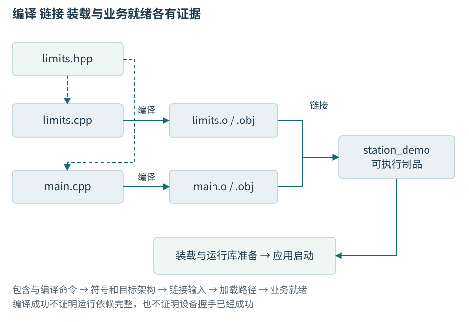
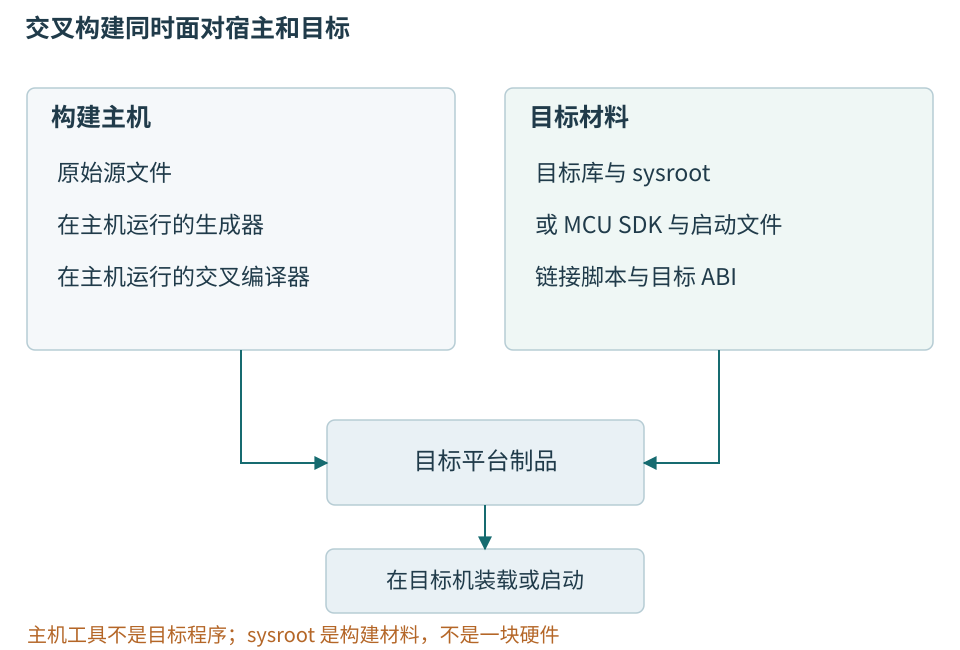

# 第五章 从源文件到可部署程序

编写一个温度判断函数之后，程序还要经过编译、链接和装载，才能在工站上执行。API是源码层的应用程序接口，ABI是已编译模块之间的应用二进制接口。若目标换成MCU，产生的指令、存储布局和启动路径又会改变。构建工具把这些动作自动组织起来，却没有替开发者消除版本、二进制接口和部署条件。

本章沿一条小型温度程序的构建关系，说明头文件、目标文件、库、CMake目标和交叉工具链。Windows是上位机主讲环境，Linux是第二验证目标，MCU固件单独说明。所有代码、CMake和命令都是文稿中的教学片段，未执行；这里不会把一份配置写成已经构建成功的工程。

## 一 构建链路逐步确定信息

### 构建链路是信息逐步确定的过程

典型本机编译链路包含预处理、编译、汇编和链接，之后由操作系统与装载器建立运行映像。**编译器驱动程序**负责按选项组织相关工具；命令名是 `c++` 或 `clang++`，不表示全部工作一定在一个独立“编译器步骤”里完成。

预处理决定参与本次翻译的源文本，编译阶段检查语言规则并产生较低层表示，汇编阶段把指令与指示转换成目标格式，链接阶段组合多个输入并处理相互引用。现代工具链可以把部分步骤集成在同一个进程内，也可以在链接阶段继续进行代码生成。教学分层解释职责，不要求磁盘上必须出现每一种中间文件。

每个阶段都需要上下文。源文件内容相同，但头文件版本、宏定义、目标架构或优化选项不同，结果仍可能不同。构建输入不能只记录一组 `.cpp`；还包括生成代码、工具版本、标准库、链接脚本与关键环境配置。

所以，“在我机器上编译通过”提供的证据很有限。要复现问题，至少需要知道实际编译命令、目标平台、依赖版本与产物身份。本章后文将继续讨论构建系统，先解释这些信息为什么会进入最终二进制，而不是把构建当成黑盒按钮。[1]

### 翻译单元是独立检查的重要边界

**翻译单元**是语言实现进行翻译时的一项基本输入。在常见头文件模型下，可以近似理解为一个源文件加上经过包含与条件处理得到的内容。两个 `.cpp` 分别编译时，不会自动互相读取对方的函数体；它们通过共同声明表达将来可以组合的契约。

头文件不是因为后缀叫 `.h` 就获得特殊链接能力。声明使编译器知道某个实体的类型与使用方式，定义提供需要的实体内容或实现。把函数声明放入头文件，可以让多个翻译单元采用一致接口；相应实现仍需进入最终链接输入。

条件编译会让“同一个头文件”产生不同结果。若一个宏在模块甲中加入某个成员，在模块乙中没有加入，双方可能各自通过编译，却对同名类型得到不同布局。问题不只是 include 路径错误，而是构建配置改变了双方共享的语言契约。

C++20 模块为声明组织与可达性提供了另一套机制，但没有消除目标平台、ABI 和链接责任。模块接口的编译产物还与工具链格式和构建依赖有关，不能当成通用、跨编译器、跨版本稳定的二进制交换文件。采用模块可以改善某些源码组织问题，却不是自动获得 ABI 稳定的捷径。[2]

### 预处理改变参与编译的内容

预处理处理文件包含、宏替换与条件编译等内容。 它发生在后续语言分析所使用的输入形成过程中，因此宏可能改变一个表达式，也可能改变整个声明是否存在。调试宏相关问题时，查看预处理结果通常比只看原始源文件更直接。

例如平台头文件根据配置把一个类型别名定义成不同底层类型。调用位置看起来完全一样，实际编译器看到的参数宽度却已经不同。又如某个头文件被同名旧副本遮蔽，编辑器跳转到新声明，构建实际包含的却是旧声明。判断应以真实构建命令与预处理输入为准。

头文件防重复包含只能防止同一翻译单元中重复展开相应内容，并不意味着整个程序只会得到一个定义。把普通外部变量定义放在有 include guard 的头文件里，两个 `.cpp` 仍可能各自产生一份定义。链接和单一定义规则需要独立处理。

宏也不遵循普通变量的作用域与类型检查方式。能够用常量、函数或模板表达的接口，通常更容易检查；确实用于平台配置时，应把影响 ABI 的宏集中管理，并把它们纳入产物兼容条件。一个未记录的构建宏，足以让“同版本头文件”失去原本期待的意义。[1]

### 目标文件保存代码 也保存尚待完成的关系

**目标文件**通常包含机器代码、数据、符号表、重定位信息以及可选调试信息。它不是必须能够直接运行的小程序，而是供后续链接或装载处理的结构化输入。ELF 是 Executable and Linkable Format，即可执行与可链接格式；它可以表示多种文件角色，而不只表示 Linux 可执行程序。

**节**，即 section，把用途相近的内容组织起来，例如代码、只读数据、可写数据、符号或调试信息。常见名称 `.text`、`.rodata`、`.data` 与 `.bss` 反映惯例，但名称不是语言标准规定的对象分类。编译选项和链接脚本都可能改变组织。

**符号**为函数、对象或其他位置提供链接层可识别的名字与属性。**重定位项**则记录“某个位置的值需要依据某个符号或基址进一步计算”。一个调用可以在目标文件里已经有指令形式，却仍需要链接器为其中的地址相关部分确定最终值。

由此可以解释为什么单文件编译通过，链接仍会失败。编译器已确认调用处存在函数声明，目标文件记录尚待解析的引用；链接器组合输入后仍找不到满足条件的定义，才会报告未解析引用。错误发生在不同阶段，要求的证据也不同。[1]

### 让声明和定义来自同一份契约

下面三个文件只用来观察构建关系。演示范围0至50000mC不是产品限值。头文件提供声明，实现文件包含同一头文件并给出函数体，入口再调用它。

```cpp
// include/station/limits.hpp，教学头文件，未编译。
#ifndef STATION_LIMITS_HPP
#define STATION_LIMITS_HPP
#include <cstdint>
bool in_demo_range(std::int32_t temperature_mC) noexcept;
#endif
```

```cpp
// src/limits.cpp，教学实现文件，未编译、未运行。
#include "station/limits.hpp"
bool in_demo_range(std::int32_t temperature_mC) noexcept {
    return temperature_mC >= 0 && temperature_mC <= 50000;
}
```

```cpp
// src/main.cpp，教学入口，未编译、未运行。
#include "station/limits.hpp"
int main() {
    return in_demo_range(25000) ? 0 : 1;
}
```

防重复包含的宏只限制同一翻译单元内重复展开，不会替所有cpp提供一个函数定义。若没有把limits.cpp编译所得目标加入链接，main.cpp仍可能通过单独编译，然后在链接阶段报未解析符号。实现文件也包含自己的头文件，有助于尽早发现声明和定义不一致。



图05-1 编译通过、链接通过与可以运行是不同观察点。构建系统负责组织依赖，不会把某一步通过升级成整条链通过。

## 二 链接找到名字 还要满足定义规则

### 符号解析把引用连接到定义

**链接**将多个输入中的内容组织成输出，并把符号引用连接到相应定义。一个符号可能在本文件定义，也可能标记为需要其他输入提供；还可能具有局部、全局、弱绑定及可见性属性。ELF 的符号表为这些信息规定了具体表示。

语言中的“这个名字能在何处表示同一实体”，与文件格式中的符号绑定相关，却不能直接画等号。C++ 的内部、外部和模块链接是语言规则；ELF 的 local、global、weak 是具体格式与工具链的表达方式。调试时需要先判断语言上期待的实体是什么，再看实现如何编码。

如果两个目标都定义了一个不允许重复的普通全局符号，链接器通常会报告多重定义。若一个引用没有可用定义，通常报告未解析引用。弱符号、可合并节与动态符号查找规则使实际情况更丰富，所以不能把“链接器没报错”当成整个程序满足所有语言规则的证明。

链接器还会根据输入关系决定内容布局，并可能丢弃未使用内容、合并适当内容或改写某些地址形式。这些功能解释了为什么同一组源代码在不同链接选项下体积不同，也解释了为什么通过静态初始化注册功能时，相关目标若未被选入，注册动作可能根本不存在。[4]

### 名称修饰使重载能够出现在链接层

C++允许函数重载、命名空间和成员函数，工具链用名称修饰把必要区别编码进符号。未解析函数时，应同时比较原始符号与可读签名，注意参数类型、命名空间和成员限定。名字匹配仍不证明对象布局、所有权或单位一致；这些契约不一定全部编码进符号。[3]


### 单一定义规则约束整个程序的一致性

**ODR** 是 One Definition Rule，即单一定义规则。它约束某些实体的定义数量与一致性，不能简单背成“任何东西整个程序只能定义一次”。C++ 对类、模板以及符合条件的 inline 实体等允许特定的多翻译单元定义，同时要求满足相应一致条件。

普通外部函数通常应有一个适当定义，头文件提供声明。允许在多个翻译单元出现的定义，也不是看起来功能相同就足够：需要满足标准对记号序列、名称查找等方面的要求，并考虑模块相关限制。两个定义返回同样数值，不代表它们可以任意不同。

一个危险例子是头文件中的结构体受宏影响，某个翻译单元多了调试成员，另一个没有。双方调用的函数符号可能照样匹配，但字段偏移已经不同。某些跨翻译单元违规不要求实现一定给出诊断，因此链接成功不代表程序合法。

排查 ODR 问题，应比较真正参与编译的头文件和配置，而不是只比仓库里的文件名。统一生成配置、避免公开类型布局依赖隐蔽宏、完整记录工具链，并确保依赖变更触发重编译，都是维护一致定义的工程手段。[2]

### inline 与模板影响定义组织

inline的重要作用之一是允许相应实体在符合规则时出现在多个翻译单元，不是强制每次调用展开。模板通常需要在实例化处看到定义，所以常放在头文件；将模板体移进cpp而没有安排所需实例，会造成使用方找不到实现。两者都仍受单一定义规则约束。[2]


### 静态库是输入集合 不是自动展开的全部程序

传统静态库通常是目标文件的归档，链接器按规则选择其中需要的成员。把某个库写到命令行上，不等于其中所有代码都必然进入最终程序。归档的组织粒度和链接选项会影响哪些内容被选入。

GNU 风格链接器对传统归档的搜索与输入顺序有关。通常应先出现产生未解析引用的输入，再出现提供这些定义的库；循环依赖可能需要重新组织库，或者使用链接器支持的分组重复搜索机制。不能把某一种工具链的处理方式推广为所有链接器，也不应把交换命令行顺序当成永远无需理解原因的仪式。

设 `main.o` 引用 `parse`，`libparse.a` 中的成员定义 `parse` 并引用 `decode`，`libcodec.a` 定义 `decode`。一个符合这种依赖方向的输入安排是先调用方，再 `libparse.a`，再 `libcodec.a`。若两个库互相引用，首先要判断接口依赖是否可以拆开，而不是无限复制同一组库名。

静态链接把选中的实现合入产物，有利于固定一部分部署依赖，但不意味着程序不再依赖操作系统、配置或运行时动态装载。某些库内部仍会读取外部数据或加载组件。安全更新也需要重新构建并部署包含旧实现的产物，而不是只替换主机上的共享库文件。[4]

### 共享库把一部分组合工作留到运行环境

**共享库**是可由多个程序装载使用的二进制模块。链接阶段通常记录对它的依赖及所需符号，运行时再由动态装载机制建立实际联系。不同进程可以共享某些只读代码页面，但各自可写状态、重定位和运行时布局仍需按系统机制处理。

共享库并不等于“更新一个文件，所有旧程序立即使用新代码”。正在运行的进程可能继续持有旧映像，新进程可能按搜索规则找到不同版本；直接覆盖正在使用的文件还可能破坏可靠部署流程。版本化文件、受控名称切换与进程重启策略需要共同设计。

库的逻辑名称、磁盘文件名和版本身份也有区别。ELF 常用 SONAME（共享对象名）表达运行时依赖身份，具体版本管理仍由项目与部署规则保证。只把一个不兼容新库改成旧文件名，不会让旧程序突然学会新的 ABI。

静态与动态链接的选择涉及部署一致性、更新方式、体积、启动时间、符号隔离和授权许可等因素。不存在脱离产品约束的统一最优答案。需要的是明确依赖由谁固定、由谁更新，以及出现版本冲突时如何观察和恢复。[4]

## 三 CMake把依赖放到目标上

### 构建图首先回答哪些结果依赖哪些输入

设一个工站程序接收温度节点报文。程序包含协议库、限值库和入口，另有一个根据协议描述生成头文件的程序。源文件变动可能需要重新编译一个目标；公共头文件变动可能影响多个目标；生成器或协议描述变动，则必须先重新生成头文件，再编译使用它的代码。

把这些关系写成有向图，节点可以是文件或高层目标，边表示必须先具备的输入。构建器据此安排并行和增量工作。漏掉一条边可能导致偶发失败，也可能更危险地使用旧输出；多写一条无关边则扩大重建范围。正确性与速度并不独立：一个依赖不完整、偶尔省掉必要工作的系统，看上去很快，却不能可靠交付。

CMake 的配置阶段读取工程描述、检测环境并决定目标关系；生成阶段输出底层构建系统需要的规则；实际编译和链接由所选生成器对应的工具推进。Ninja 是强调快速执行显式构建图的底层工具，通常由 CMake 等更高层程序生成其输入。它不会因为看到一个目录里有源代码，就自行推断业务的全部依赖。 

因此“CMake 编译失败”至少有三种含义：配置时找不到依赖，生成时不能表达目标关系，或者构建时编译、链接命令失败。先指出失败阶段，才知道应该检查缓存、目标属性、生成规则还是 C++ 源码。把所有失败都归咎于一个工具名称，会让诊断在错误层级兜圈。[8]

### Target把需求附着在真正拥有它的模块上

**Target** 是具有构建属性和使用要求的逻辑目标。可执行文件、静态库、共享库、仅传播接口要求的库，都可以成为目标。目标式配置的价值在于：模块自己说明需要哪些头文件、语言特性和链接依赖，使用者通过连接到该目标取得必要信息，而不是从全局变量里猜测。

`PRIVATE` 表示构建目标自身需要，`INTERFACE` 表示使用者需要，`PUBLIC` 表示两者都需要。判断依据不是“这是不是秘密”，而是使用接口是否依赖它。公共头文件出现了第三方类型，通常就把相关编译需求带给使用者；第三方组件只在实现文件内部出现，则应尽量留在实现侧。

```cmake
# CMakeLists.txt 教学片段，未执行；并非可独立构建的完整工程。
# 前提：src/limits.cpp、include/station/limits.hpp、src/main.cpp 已由工程提供。
cmake_minimum_required(VERSION 3.25)
project(TemperatureStation LANGUAGES CXX)

add_library(station_limits STATIC src/limits.cpp)
add_library(Station::Limits ALIAS station_limits)
target_compile_features(station_limits PUBLIC cxx_std_20)
set_target_properties(station_limits PROPERTIES CXX_EXTENSIONS OFF)
target_include_directories(station_limits PUBLIC
    $<BUILD_INTERFACE:${CMAKE_CURRENT_SOURCE_DIR}/include>
    $<INSTALL_INTERFACE:include>)

add_executable(station_demo src/main.cpp)
target_link_libraries(station_demo PRIVATE Station::Limits)
set_target_properties(station_demo PROPERTIES CXX_EXTENSIONS OFF)
```

这个片段没有安装规则、测试和源文件实现，不能声称复制就能得到一个程序。`cxx_std_20` 表达至少需要相应标准级别的编译模式，不代表所有 C++20 库设施都已实现。`CXX_EXTENSIONS OFF` 是目标属性，不能假定它会像接口需求一样自动传给所有使用者，因此这里分别设置两个实际目标。

构建树中的头文件路径与安装后的路径也不同。把作者机器的绝对路径写进安装接口，会使包离开机器就失效。图中的目标依赖应尽可能指向有名字的组件；硬编码某台机器上的 `.a` 或 `.lib` 文件，虽然可能临时通过链接，却丢失了平台配置和传递需求。

静态库的实现依赖尤其容易误解。`PRIVATE` 不表示最终链接器永远不必看到这个库：静态归档并没有把所有外部符号解析完，最终可执行文件仍可能需要它的实现依赖。CMake 对相关链接传播有专门处理。工程设计时应区分编译使用要求是否暴露、最终链接闭包是否完整，而不是拿一个访问关键字概括两件事。[8]

### Presets保存团队可重复选择的配置

Preset为生成器、构建目录和缓存变量等选择提供有名字的入口。共享CMakePresets.json适合纳入版本管理，个人CMakeUserPresets.json保存本机路径，不应顺带提交秘密。schema版本要与实际CMake匹配。[9]

重要配置分别使用独立构建目录；切换编译器、目标架构或工具链时不要任意沿用旧检测缓存。单配置生成器常在配置时选CMAKE_BUILD_TYPE，多配置生成器通常在构建时选--config。记录实际命令，避免名义上Release却测了Debug。


### 增量正确性需要把生成文件当成一等输入

自动生成头文件、协议代码、资源索引和版本信息都属于构建图。若生成命令只写成每次手动执行的脚本，底层构建器不知道输入变化，也不知道何时可并行编译。正式规则要说明输出、输入、生成工具和必要副产物，使消费者等待真正需要的文件。

例如协议描述 A 生成头文件 H，源文件 X 包含 H。正确关系是 A 和生成器共同决定 H，H 再影响 X 的对象文件。若只写 X 依赖 A，却不写生成动作与 H，并行构建可能先编译 X。若多个目标各自无协调地生成同一个 H，又可能出现并发覆盖。增加等待时间不能修复这类依赖缺口。

依赖文件记录编译器观察到的头文件关系，使修改被包含文件也能触发重建。但编译器不会替自定义脚本记录它读取的任意配置文件；这些输入必须显式说明，或由脚本按受支持协议产生依赖记录。动态依赖支持也是具体工具能力，不是所有生成器对所有任务都等价。

**面试追问：“为什么全量编译成功，增量编译偶尔失败？”** 应先怀疑缺失输入、副产物冲突、并行顺序和配置残留，比较干净构建与增量构建所执行的命令。全量构建碰巧先产生了某文件，并不能证明依赖图完整。把并行度降为一可作为定位手段，却不能把串行成功当作修复证明。[8]

### 配置 构建与安装是三种动作

配置选出编译器、依赖和生成器，并形成构建规则；构建执行必要的编译和链接；安装按规则把运行所需文件放入指定布局。安装完成也不是现场验收，它没有证明目标机上的驱动、权限和插件都正确。

```sh
# GNU风格/Ninja教学命令，全部未执行。
# 假设工具、完整源文件和上述CMake描述已准备。
cmake -S . -B out/linux-debug -G Ninja -DCMAKE_BUILD_TYPE=Debug
cmake --build out/linux-debug
```

```sh
# Windows多配置生成器的命令形式，全部未执行。
# 生成器须换成实际已安装且受支持的名称。
cmake -S . -B out/windows
cmake --build out/windows --config Release
```

这里没有指定一个未经验证的Visual Studio生成器版本，也没有伪造控制台结果。Windows通常还需要在能找到对应编译工具与SDK的环境中配置；Qt应用则要让find_package找到与编译器、架构一致的Qt安装。Qt Creator的套件把这些选择组织起来，但不是用一个下拉框名称替代工具链身份。

同一构建目录不宜在Windows工具链、Linux本机和MCU交叉工具链间反复切换。CMake缓存会保存检测结果，源码目录可以共用，构建目录应按受支持配置隔开。为了排障新建目录是有用的对照，但先保存失败目录的命令与缓存，才有机会解释根因。

## 四 工具链与平台必须成套选择

### 编译器名字不是完整环境标识

“用 Clang 编译”没有说明标准库是 libc++ 还是 libstdc++，链接器是哪一个，描述目标架构与系统等信息的目标三元组是什么，系统头文件来自哪里。GCC 也可能使用不同发行版补丁与运行库；MSVC 需要区分工具集、Windows SDK、运行时与构建模式。构建失败或 ABI 问题常发生在这些组合之间，而不是前端名称本身。

一个实用环境记录至少包含前端版本、标准库及其版本、链接器、目标架构、操作系统或 SDK、语言模式、关键优化与运行时选项。必要时还要记录 CPU 特性、异常和 RTTI 配置、结构体打包、静态或动态运行库、第三方补丁。记录不必让每次构建都手工填写，但应由流水线可靠采集并能与制品关联。

这种记录也决定测试矩阵的边界。若产品承诺同时运行在两种标准库或多个 Windows 工具集上，就必须有相应构建和运行证据；在一个 Linux 容器里尝试三个前端版本，只能覆盖其中一部分差异。编译器多样性很有价值，却不是跨平台验证的替身。[11]

### 语言模式 诊断与优化各自解决不同问题

标准模式选择接受哪些语言规则与扩展；警告帮助发现可疑代码；优化改变生成代码的策略；调试信息帮助把机器状态对应回源码。这些维度可以组合，不能简单地分成“Debug 正确、Release 快”。带调试信息的优化构建常是线上诊断的重要工具。

GCC 的 `-Wall` 并不表示全部警告，Clang 和 MSVC 的警告集合也不是逐项对称。把所有编译器都塞入同一串选项可能直接失败，更可能悄悄丢失希望启用的检查。工程应为具体工具链维护经过验证的诊断策略，解释哪些警告是新增代码门禁，哪些旧问题有临时例外。  

```cmake
# CMake 诊断配置片段，未执行；前提：station_limits 目标已定义。
# 只展示本工程目标的选项，不代表跨版本完整警告策略。
if(MSVC)
    target_compile_options(station_limits PRIVATE /W4 /permissive-)
elseif(CMAKE_CXX_COMPILER_ID MATCHES "^(GNU|Clang|AppleClang)$")
    target_compile_options(station_limits PRIVATE -Wall -Wextra -Wpedantic)
endif()
```

是否把警告当错误，要考虑依赖边界与编译器升级。对项目自己的新增代码建立严格门禁，可以快速阻止退化；把所有第三方头文件的新警告一律当错误，则可能让无关工具升级阻断交付。豁免应限定范围、说明原因和到期条件，而不是全局关闭一类能发现真实问题的检查。

`-O2`、`-O3` 等名称不构成跨编译器的等价实验。它们启用的策略随版本和目标变化，高优化级别也不保证所有程序都更快。第八章的测量原则仍然适用：用目标负载测端到端指标，记录代码大小、内存、延迟分布和构建成本，再决定选项。[11]

### 优化暴露错误不等于优化器制造错误

一个越界访问在调试构建中可能暂时没有破坏关键数据，在优化构建中却产生完全不同结果。数据竞争、悬空指针和未初始化值也可能被布局或调度变化放大。C++ 的未定义行为不能用“我在 Debug 见过它工作”来约束优化器。

诊断时应保留真正失败的优化制品和符号，同时构造可观测性更好的对照版本。若一换成 `-O0` 问题就消失，结论只是症状对配置敏感。下一步可以检查未定义行为、时序、初始化、内存布局和已知编译器问题，不能立刻认定编译器有缺陷。第八章会介绍如何把这些假设变成证据。

特殊优化选项还可能改变语义前提。例如激进浮点选项可允许超出通常严格浮点行为的变换；本来依赖 NaN、无穷值、舍入顺序或有符号零的算法，必须检查选项契约。性能优化若修改了数值允许误差，应在接口和测试中体现，而不是把结果变化藏在构建脚本里。

链接时优化把跨翻译单元信息交给优化器，可能改善内联与消除，也增加工具链一致性、内存峰值和链接时间要求。带中间表示的对象文件不应被当成永远通用的二进制归档。发布库是否分发这种形式，需要核查具体编译器与链接器的兼容承诺。[11]

### CPU基线决定制品能在哪些机器上运行

开发机支持的指令集未必在部署机存在。主程序、依赖库与交叉编译选项必须遵守同一最低CPU基线；不能因为主程序通用就假设SDK也通用。可选加速还需在基线可运行的检测路径上选择，并保持相同数值与错误契约。[11]


### Windows与Linux差异不是斜杠写法

Windows的路径、动态库搜索、文件共享和设备访问与Linux不同。使用Qt可以共享许多界面与事件代码，但厂商SDK可能只提供某种Windows架构和编译器二进制，Linux驱动或权限路径也可能不同。是否跨平台，要逐层看代码、依赖和运行行为，不是只看源码有没有#ifdef。

本书没有冻结并运行一套编译器、Qt补丁、Windows镜像与Linux发行版组合。Qt6.8文档用于说明API，具体支持矩阵需要在真正实施时核对；文档列出支持平台，也不能证明本书工程已通过验证。清单须记Qt精确版本及模块、编译器、标准库、SDK、架构、驱动、构建类型与运行时。[12]

## 五 装载与二进制接口的边界

### 装载把文件表示变成进程映像

装载器按二进制格式准备代码、数据、地址空间与入口，动态链接器再处理适用依赖。普通程序往往还有运行库初始化，不能把main当作机器上第一条指令。装载成功只表示执行已开始，配置、线程、设备识别是否就绪仍需业务确认。[13]


### PE COFF 与 ELF 的差异不能用改后缀消除

Windows 常见可执行映像使用 **PE**，即 Portable Executable，相关目标文件使用 COFF（Common Object File Format，公共目标文件格式）家族格式。PE 具有自身的头部、节表、导入导出、基址重定位和其他目录结构。 `.exe` 或 `.dll` 后缀只是外部名称线索，不是格式本身的全部证明。

**RVA** 是 Relative Virtual Address，即相对虚拟地址，通常用于表达相对于映像基址的位置。它与文件偏移不是同一概念。把某个 RVA 转成文件中的位置，需要找到相应节并依据其虚拟与文件布局计算；不能直接把 RVA 当作文件偏移去读取。

动态库导入也有平台自己的组织。Windows 导入库可以在链接时提供与 DLL 导出关联所需的信息，但它不必包含 DLL 的完整实现。看到一个 `.lib` 文件时，应分辨它是静态代码归档还是导入库，不能只根据扩展名决定是否还需要部署 DLL。

PE 的导入地址表、ELF 的 GOT/PLT 都体现间接绑定思想，却不是字段名称、时机和查找规则完全相同的格式。跨平台分析应保留共同概念，再分别查格式规范。试图仅把一个平台工具输出中的名称替换成另一个平台术语，会遗漏真正影响兼容性的细节。[5]

### 找到哪个动态库取决于运行环境

Linux 动态链接器根据依赖记录、相关路径信息、环境设置、缓存和系统规则寻找共享对象。`RPATH` 与 `RUNPATH` 的语义和传播范围存在差异，安全执行模式也可能忽略某些环境影响。 因此不能把运行时查找简单描述为“总是先看当前目录”或“总是按某个环境变量”。

Windows DLL 查找则受到应用打包方式、已加载模块、系统目录、显式装载选项等因素影响。为顶层 DLL 指定完整路径，也不自动让它所有传递依赖都按同一完整路径固定。 部署问题需要记录实际加载路径，而不只是开发者希望加载的位置。

可被不可信参与者写入的搜索目录，还可能把“找错版本”升级为加载不可信代码。安全部署应采用受控目录、明确依赖与适当装载选项，不把全局扩展搜索路径作为所有报错的默认修复。添加一个目录也可能改变其他程序或插件的查找结果。

诊断时把三件事分开：产物声明需要什么，文件系统中存在哪些候选，运行时实际选择了哪个。只有第三项与故障现场直接对应。检查完一个本地库之后，还需确认进程真的加载了它，尤其在容器、并行安装和多版本插件环境中。[7]

### 调试信息把地址重新关联到源码

**调试信息**描述机器代码与源文件、行号、类型、变量和调用关系之间的联系。DWARF 是常见调试格式之一；Windows 工具链常使用 PDB，即 Program Database，保存相应调试信息。它们帮助调试器解释运行状态，不是程序一般执行逻辑本身。

优化构建可以保留调试信息，但某些源变量可能被消除，多个操作可能合并，调用可能内联，机器执行顺序也未必像逐行源码那样呈现。调试器显示“变量已优化掉”，不一定意味着调试文件丢失；单步跳行也不必然是编译器错误。

发布产物可以剥离部分调试内容，并将完整信息单独保存。GDB 支持通过调试链接或 build ID 等方式关联相应文件。 **构建标识**用于将故障现场与准确产物联系起来；版本字符串相同但编译选项、依赖或代码不同，仍可能需要不同调试文件。

离线符号化时，还要考虑装载基址。崩溃地址属于运行时地址空间，符号文件中的位置可能需要结合模块映射关系解释。使用不匹配的符号文件，有时会得到看起来合理却完全错误的函数与行号，这比清楚显示“未知”更容易误导调查。[14]

### ABI 是已经编译好的双方必须共同遵守的契约

ABI 决定一个调用在机器层面如何成立。它包括参数与返回值位置、寄存器保存责任、栈规则、数据布局、符号命名，以及某些异常和运行时约定。操作系统、处理器架构、工具链与运行时共同影响具体契约，C++ 标准本身不规定一套适用于所有平台的二进制格式。

两段代码支持同一指令集，仍可能使用不同 ABI；同样是 64 位进程，也可能对 `long` 的宽度、结构体布局和参数分类采用不同规则。能够解码彼此的指令，只解决了处理器能力的一部分，不等于能够正确调用彼此的函数。

反过来，不同语言可以通过共同支持的 ABI 交互。C++ 调用一个 C 函数、Rust 或 Python 扩展调用一个本机库，都依赖某种明确的跨语言边界。双方没有必要共享全部内部对象模型，但必须在传递的那部分数据和控制流上达成一致。

因此，发行一个二进制库时，应说明支持的架构、操作系统、数据模型、编译器与运行时范围，并保留测试矩阵。只写“支持 C++20”说明了源码语言要求，尚未定义二进制互操作条件。[6]

### 对象布局使私有成员也可能影响二进制兼容

对象布局受大小、对齐、成员与基类等条件影响。给公开类增加私有成员，旧源代码可能无需改动，旧二进制却仍按旧大小分配空间，新库按新布局访问便可能越界。固定宽度字段也不自动消除整体填充。应限制暴露布局，或清楚要求双方重编译并验证支持组合。[6]


### 源码兼容 二进制兼容与数据兼容分别判断

**源码兼容**表示旧源代码在约定环境下仍能重新构建；**二进制兼容**表示旧的已编译模块可以在约定条件下继续与新模块协作；**数据兼容**表示新旧参与者仍能理解保存或交换的数据。三者可能分别成立或分别失败。

例如给函数增加一个带默认值的参数，很多旧调用源码仍然可以重新编译，但实际函数签名已经改变，旧目标文件仍会引用旧符号或旧调用方式。默认实参通常在调用方编译时参与处理，不是在运行时由新库替旧调用者自动补齐。

又如类布局没有变化，库却把某个字段的单位从毫秒改成微秒。二进制层面可能仍能交换同样宽度的整数，业务含义却已经不兼容。第四章讨论的协议单位与版本条件，不能被 ABI 检查代替。

兼容承诺应写成具体关系：哪些旧版本调用者可以配哪些新库，是否需要重新编译，哪些文件格式仍可读取，哪些功能要通过能力查询启用。只发布一个“主版本没变”的数字，不能替代这些事实；版本号应表达已经验证的契约，而不是制造契约。[6]

### extern C 减少某些差异 但不消除 ABI

extern "C"表达C语言链接，能缩小部分名称规则差异，却不会把std::string等C++对象变成跨语言稳定数据。更窄的接口可使用明确宽度、指针加长度和不透明句柄，仍需规定编码、调用约定、空值、生命周期与失败结果。[2]


### 分配 释放与异常应在同一责任边界内闭合

库分配一个对象，再让调用方用自己的 `delete` 释放，可能要求双方采用兼容运行时、分配器和对象定义。Windows 的 CRT，即 C 运行时库，存在跨 DLL 传递相关对象或由不同运行时释放内存导致错误的官方说明。 类似问题也会出现在自定义分配器和其他平台运行时组合中。

一个常见设计是由创建者提供对应销毁函数：库创建句柄，调用方最终调用同一库导出的销毁入口。对于输出缓冲区，可以由调用方提供容量，或者由库提供配对释放函数。所有权何时转移、失败时谁负责释放，都应写进接口契约。

异常传播也是二进制边界。让 C++ 异常穿过不支持相同展开机制的语言或运行时，不能靠“大家都用 C 接口”解决。库应在边界内捕获允许处理的异常并转换成稳定错误结果；仅给函数加上 `noexcept` 而不处理异常，可能只是把异常逃逸变成终止进程。

错误结果还不能依赖即将失效的存储。例如返回指向临时字符串的错误文本，会在调用者读取之前失效。可以采用调用方缓冲区、受控生命周期的错误对象或线程相关错误状态，但必须说明有效期与并发行为。错误路径本身也属于 ABI，而不是完成正常返回设计后再补的一句说明。[10]

### 插件能够找到 不代表可以任意卸载

温度设备SDK可能注册回调或启动后台线程。只要回调仍可能执行、对象析构仍要进入DLL，主程序就必须保留相应模块。卸载流程应先拒绝新工作，结束在途操作，销毁相关对象，再释放库。关闭一个连接不一定注销所有回调，取消请求也不一定意味着调用结束。

有些系统选择在整个进程生命期保留已装载插件，以降低卸载复杂度。这是有成本的设计选择，不等于不管理设备资源。需要热插拔插件时，必须拥有可证明的最后使用边界；不能只因一个LoadLibrary与一个FreeLibrary看起来配对，就认为整个插件生命期已经正确。

## 六 交叉编译把工具和目标分开

### 交叉编译把构建机器与运行机器分开

**交叉编译**是在一种环境中产生供另一种目标环境运行的程序。构建过程中实际执行工具的机器，与最终程序运行的目标，必须分别命名。代码生成器要在构建机器上运行，生成出来的产品要在目标机器上运行；两者即使都由同一仓库产生，也不能使用同一个架构的可执行文件混过去。

工具链文件让 CMake 在配置早期知道目标系统、编译器和查找策略。**Sysroot** 是目标环境头文件与库等材料的一个根视图，帮助工具链避免无意拾取宿主系统的材料。它不是完整目标设备，更不自动包含启动加载器、驱动、运行配置和真实硬件能力。

假设在 x86-64 Linux 上为 AArch64 Linux 构建解析程序。前端应产生 AArch64 指令，系统头文件与库应来自目标基线，构建时运行的协议生成器却仍需是 x86-64 可执行文件。最隐蔽的错误往往不是编译器完全选错，而是某一条查找路径混入宿主库，或者测试步骤试图直接执行目标程序。[15]

### 工具链文件必须明确查找边界

```cmake
# AArch64 Linux 工具链教学片段，未执行；路径均为占位路径。
# 前提：目标编译器和 sysroot 已由受控 SDK 提供并校验。
set(CMAKE_SYSTEM_NAME Linux)
set(CMAKE_SYSTEM_PROCESSOR aarch64)
set(CMAKE_C_COMPILER /opt/example-sdk/bin/aarch64-linux-gnu-gcc)
set(CMAKE_CXX_COMPILER /opt/example-sdk/bin/aarch64-linux-gnu-g++)
set(CMAKE_SYSROOT /opt/example-sdk/sysroot)
set(CMAKE_FIND_ROOT_PATH_MODE_PROGRAM NEVER)
set(CMAKE_FIND_ROOT_PATH_MODE_LIBRARY ONLY)
set(CMAKE_FIND_ROOT_PATH_MODE_INCLUDE ONLY)
set(CMAKE_FIND_ROOT_PATH_MODE_PACKAGE ONLY)
```

这里对程序采用宿主查找，对库、头文件和包采用目标根查找，是常见设计方向，不是适用于所有 SDK 的万能配方。工程若需要特殊宿主工具，应显式提供其路径或独立构建阶段。`pkg-config` 等辅助工具也可能有自己的搜索变量，必须检查它是否返回目标信息，不能只设置 CMake 就假定整个生态随之改变。

配置测试有的只编译，有的需要运行。交叉编译环境不能直接运行目标程序时，应采用已验证的目标属性、明确的预置结果、模拟器或真实目标执行，而不是为了让配置通过随意填写成功。预置结果也属于交付输入，需要记录出处和适用 SDK，错误结果可能把不存在的功能暴露给源码。

链接通过不等于目标上能运行。动态加载器路径、共享库版本、内核接口、CPU 特性、文件权限和部署位置都可能不匹配。交叉构建至少要分成“产生正确目标格式”和“在支持设备上完成行为验证”两层证据。模拟器能扩展覆盖，但不能替代所有硬件时序、驱动与设备交互测试。[15]

### MCU固件还需要明确的存储与启动安排

裸机或RTOS固件的输出可能仍采用ELF作为调试与链接格式，但设备不会像桌面系统一样自动替应用建立完整进程。链接脚本把代码、只读数据、可写数据和栈等放入对应存储区域；启动代码在复位后完成向量入口、数据复制、零初始化和适用的C++初始化，再进入应用。具体顺序要看芯片、运行库和启动实现。[16]

通常可写初始化数据需要在非易失性存储中保留初值，启动时复制到RAM；零初始化区域不必在镜像里存满零，却仍占用运行时RAM。把固件文件大小当成RAM占用会漏掉这类空间，也会漏掉运行时栈、堆和DMA缓冲。链接映射文件用于观察静态布局，动态峰值仍需另行分析和板上证据。

C++20编译选项不证明目标标准库支持std::thread、完整文件系统或所有时间设施。禁用异常、RTTI或动态分配也是整条调用链的选择；厂商HAL、RTOS移植、启动对象与第三方库必须一致。桌面解析核心若只依赖固定整数和span，有机会复用，但仍需检查支持、对齐、大小与执行限制。

给MCU编译时，还要固定芯片完整型号、浮点单元与调用ABI、链接脚本、启动文件、固件库、RTOS版本和调试器设置。工具名称含arm并不能保证目标一致。生成.hex或.bin只是导出存储内容的一种形式，不证明地址正确、向量正确或已经安全烧录；本轮未执行任何烧录与固件测试。



图05-2 宿主工具与目标程序是两条执行路径。sysroot提供目标材料，不能代替设备、驱动或真实启动验证。

## 七 两种构建故障怎样留下可检查的证据

### 换电脑之后找不到温度函数

先确认是编译、链接还是装载报错。若main.cpp能编译而最终未解析in_demo_range，检查limits.cpp是否参与构建、生成目标的架构、最终链接命令及修饰名。若函数确有定义但名字包含另一个命名空间或参数类型，添加更多搜索目录不会修复签名不同。

如果开发机成功、另一台机器失败，还应检查开发机是否意外链接了全局目录里的旧库。CMake目标有可能漏掉依赖，却因本地环境碰巧得到补偿。把库单独安装后，用仅依赖公开接口的消费者在干净构建目录配置，是验证边界的重要方法；这里给的是应执行方案，没有实际结果。

修复应把真实依赖和编译条件写入拥有它们的目标，清理无意全局输入，再比较两环境命令。验收不仅要求“全量终于过了”，还要求修改公共头文件能触发正确重建、删除生成头能由规则恢复、安装后的消费者不需要作者私有路径。避免以复制整个开发目录作为永久交付办法。

### 替换DLL后在释放对象时崩溃

需要先保全主程序、DLL、符号和实际加载路径，确认新旧组合。释放点崩溃可能来自更早越界、错误对象布局、运行库不匹配或释放者不对，不能仅因为换过DLL就宣布ABI一定是原因。

沿接口查对象由谁创建、由谁销毁，是否把std::string等标准库类型跨越了未经支持的边界，结构大小与构建宏是否变化。若新DLL扩大公开结构、旧主程序仍按旧大小提供空间，函数符号可以完全匹配，却在写新字段时破坏相邻内存。源码重编译后恢复，只说明这个组合变了，不证明旧二进制兼容。

修复可以恢复兼容入口或同时升级双方，并让不兼容版本在初始化时明确拒绝。由库提供配对销毁能缩小运行库边界，但并不自动解决所有布局和回调问题。验收应保留旧已编译调用者测试、跨边界创建销毁、错误返回和停止路径；只重新编译旧源码会漏掉真正的旧ABI。

## 八 面试追问从按钮追到产物

**编译器 CMake和Ninja分别做什么**

编译器按语言与目标规则翻译代码；CMake形成目标与构建规则；Ninja等工具按依赖推进动作。配置、编译和链接失败所需的证据不同，不能统称为同一种编译问题。

**头文件防重复包含为什么挡不住多重定义**

它只防同一翻译单元重复展开。多个cpp仍分别包含，普通外部实体若在头里定义便可能各自产生定义。应按声明与定义、inline或模板的实际规则组织，不能以链接器忽略重复代替正确性。

**都用C++20为什么库不能互换**

语言模式没有固定架构、调用约定、标准库布局、运行库和构建宏。源码兼容、二进制兼容和数据兼容各有条件。具体MSVC工具集有官方限定兼容范围，不能一概说永远兼容或永远不兼容。[6]

**交叉编译通过可以宣布设备可用吗**

只能说明那次工具链接受了输入并产生某种产物，还要核对格式、CPU基线、动态依赖或固件布局。真实设备启动、外设访问、时间和功耗是另一级证据。模拟器和主机测试可以补充，不能替代所有硬件行为。

**为什么发布时保存调试符号**

源码说明意图，二进制说明实际生成内容，符号把故障地址关联到源码和类型。三者必须匹配同一制品。相同版本字符串不足以证明匹配；符号也可能包含内部路径，应按权限保存并保持可检索。[14]

## 资料与核验范围

核验日期2026年10月6日。CMake引用固定3.30文档以说明已存在机制，并非声明已安装版本；代码最低版本字段也不构成全部工具验证。命令全部未执行，没有生成、运行或部署本章程序。本章内容不要求修改现有书稿构建管线。

1. GCC [Overall Options](https://gcc.gnu.org/onlinedocs/gcc/Overall-Options.html)：阶段与驱动
2. WG21 [N4861](https://www.open-std.org/jtc1/sc22/wg21/docs/papers/2020/n4861.pdf)：翻译、ODR与语言链接
3. Microsoft [Decorated names](https://learn.microsoft.com/en-us/cpp/build/reference/decorated-names)：名称修饰
4. GNU ld [链接选项](https://sourceware.org/binutils/docs/ld/Options.html)：归档与链接关系
5. Microsoft [PE格式](https://learn.microsoft.com/en-us/windows/win32/debug/pe-format)：Windows映像与导入
6. Microsoft [C++二进制兼容条件](https://learn.microsoft.com/en-us/cpp/porting/binary-compat-2015-2017)：适用工具集与限制
7. Microsoft [DLL搜索顺序](https://learn.microsoft.com/en-us/windows/win32/dlls/dynamic-link-library-search-order)；Linux [ld.so](https://man7.org/linux/man-pages/man8/ld.so.8.html)
8. CMake [3.30构建系统](https://cmake.org/cmake/help/v3.30/manual/cmake-buildsystem.7.html)：目标与使用要求
9. CMake [3.30预设](https://cmake.org/cmake/help/v3.30/manual/cmake-presets.7.html)：共享/个人配置与schema
10. Microsoft [跨DLL传递CRT对象的风险](https://learn.microsoft.com/en-us/cpp/c-runtime-library/potential-errors-passing-crt-objects-across-dll-boundaries)
11. GCC [警告选项](https://gcc.gnu.org/onlinedocs/gcc/Warning-Options.html)、[优化选项](https://gcc.gnu.org/onlinedocs/gcc/Optimize-Options.html)：工具特定策略
12. Qt [6.8支持平台](https://doc.qt.io/qt-6.8/supported-platforms.html)：环境矩阵，不是本书运行证据
13. System V [ELF格式](https://gabi.xinuos.com/elf/)：目标文件与装载组织
14. Microsoft [调试符号](https://learn.microsoft.com/en-us/windows-hardware/drivers/debugger/symbols)；GDB [分离调试文件](https://sourceware.org/gdb/current/onlinedocs/gdb.html/Separate-Debug-Files.html)
15. CMake [3.30工具链](https://cmake.org/cmake/help/v3.30/manual/cmake-toolchains.7.html)：交叉编译与查找
16. Arm [CMSIS启动文件](https://arm-software.github.io/CMSIS_6/latest/Core/startup_c_pg.html)：Cortex-M启动责任；具体器件仍需厂商文件
