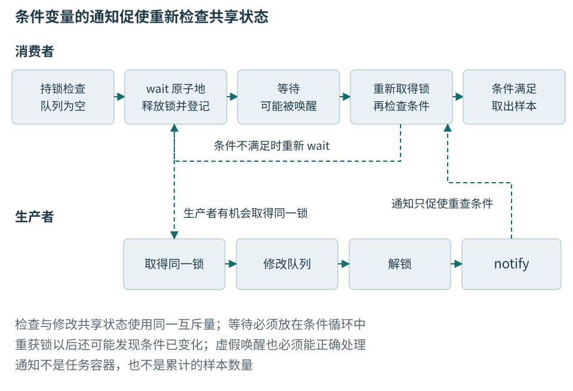
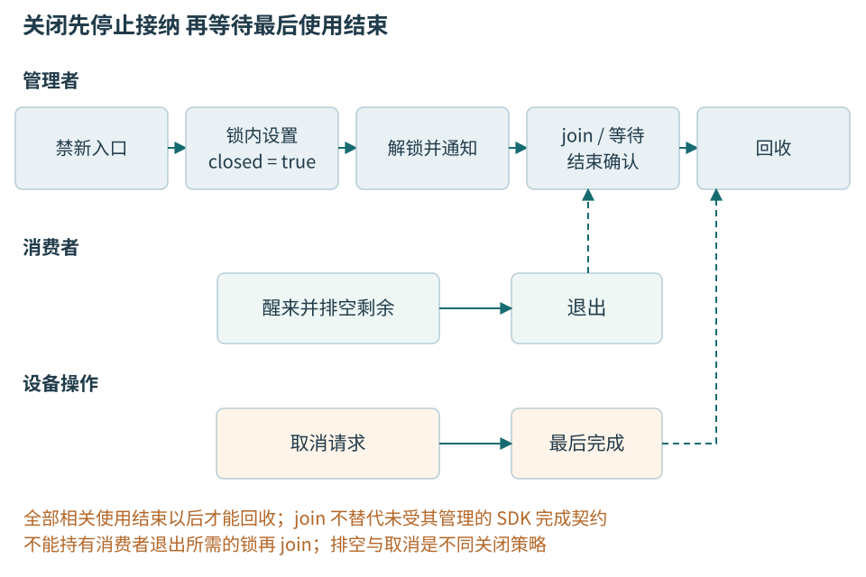

# 第六章 线程 事件与异步操作

温度节点的回复可能尚未到达，工站却还要响应按钮和更新状态。并发让不同工作在时间上交错，异步接口把“发起”与“得到结果”分开；二者都增加了对象被保留、被修改和被销毁的时机。要可靠地组织它们，应先说明共享状态和完成条件，再选线程或事件工具。

本章使用C++20桌面语义，解释线程、锁、条件变量、有界样本通道和关闭。所有代码未编译、未运行。MCU的中断、RTOS以及Qt对象归属另有执行约束，不能把这里的std::mutex或std::thread直接认作任何固件环境都可用的设施。

## 一 执行者 工作和完成结果

### 线程执行任务 任务不等于线程

**线程**是具有自身执行序列的执行实体；**任务**是应用定义的一段工作，例如解析一份文件或计算一个分片。一个线程可以依次执行许多任务，一个任务也可以拆分到多个线程。任务数量反映业务工作量，线程数量反映允许多少执行者同时占用调度与运行资源，两者不应被机械地设为相等。

`std::thread` 对象管理一个线程关联，不代表线程的所有输入都自动归它所有。以值捕获的普通对象通常进入可调用对象自己的存储；以引用捕获的变量仍由原所有者负责。把局部字符串的引用交给后台线程后立即返回，问题首先是生命周期不够长，尚未轮到讨论锁是否正确。第二章的借用规则在这里继续成立。

线程启动、运行结束和线程对象销毁是三个事件。成功 `join()` 等到被代表的线程结束，并提供标准规定的同步关系；它不会自动修复线程运行期间的非法并发访问。对一个仍可连接的 `std::thread` 直接析构会调用 `std::terminate`，因此异常路径也必须有明确的收尾方案。`detach()` 只是切断线程对象对线程的连接责任，不会延长线程借用的对象生命周期，也不会提供以后重新等待它的通用入口。

C++20 的 `std::jthread` 把请求停止与自动连接结合起来。若析构时仍可连接，析构流程请求停止并连接线程。但停止是协作式请求：线程函数需要检查 `stop_token`，或者使用能响应它的等待操作。一个永远卡在外部阻塞调用中的线程，不会因为外层换成 `jthread` 就自动退出。自动连接减少遗漏，并不意味着析构一定快速或不会阻塞。

停止令牌也不会自动唤醒普通 `condition_variable::wait`。C++20 提供接收 stop_token 的是 `condition_variable_any` 的相应等待重载；否则必须另行设计受锁保护的退出状态与通知。尤其不能仅在停止回调里调用普通条件变量的 notify，却让停止状态变化绕过检查与入睡之间的锁协议。通知若落在这个空隙，线程仍可能睡下，使 jthread 析构一直等待。第三节会展开这个空隙的来源。

任务设计应把输入、结果和执行者拆开考虑。例如，温度批次分析任务拥有一份输入缓冲，结果放入共享结果状态，线程池只负责取得任务并调用它。即使以后把执行方式改成异步 IO 加协程，输入所有权与结果责任仍然可以保留。相反，让每个任务随意创建分离线程，会把容量限制、取消和退出责任散落到整个程序。[1]

### 并发不等于每一刻都并行

单核处理器也可以让多个线程轮流推进，形成并发；多核在某些时刻同时执行多条路径，称为并行。线程被唤醒只说明具备继续的条件，还要获得调度。业务任务“已开始”与操作系统线程“正在运行”属于不同层次。

同步接口通常在调用返回时给出此次操作的结果；异步接口先接受请求，以后通过回调、事件或结果对象交付完成。异步不要求每个请求都创建一条线程，也不保证底层调用毫不阻塞。判断时要看接口实际承诺，而不是根据函数名里有没有Async。

事件循环从待处理事件中取出一项，在所属线程调用处理逻辑，再处理下一项。一个很慢的回调会阻塞这条循环之后的事件。多个异步操作可以共享一个循环，直到某一段计算或阻塞等待占住线程。第十章将说明Qt如何组织它；这里先理解排队和处理之间的时间关系。

## 二 共享一条完整读数需要同步

### 数据竞争与逻辑竞争

两个线程访问同一内存位置，至少一个修改，而且没有规范要求的同步时，可能形成C++数据竞争。数据竞争导致未定义行为，不能解释为“偶尔读到旧值也能接受”。现实里先后打印了两条日志，也不会自动为日志之外的数据访问建立合法顺序。[2]

逻辑竞争则可以发生在每次底层访问都合法时。一个线程先检查队列非空，另一个线程随后取走最后一条，前者再执行无保护的取出，组合动作仍然错误。把每个字段分别改成atomic，也可能读到样本20的温度加样本21的序号。需要保护的是一条记录的共同关系。

### 互斥量保护的是不变量

**互斥量**允许同一时刻至多一个执行者持有某种独占访问资格。**临界区**是在这项资格下访问受保护状态的代码区间。它保护的对象通常不只是一个字段，而是一组必须共同成立的不变量。

设最新读数同时含temperature_mC和sequence，业务要求两者来自同一次采样。若只分别保护两次赋值，读取者可能看到新温度与旧序号。接纳样本还要同时核对generation；检查之后释放锁再更新，也可能让重连插入两步之间。需要保护的是核对身份并提交整条快照的完整动作。

锁协议至少写清三件事：哪些字段由哪把锁保护，调用者进入函数前是否已经持锁，函数返回后交出的对象还能否被其他线程修改。一个成员函数内部加锁，只能保护这一次调用。调用者先调用 `empty()`，再调用 `pop()`，两次之间仍可能被其他线程改变状态。需要原子完成的业务动作，应作为同一个受保护操作提供。

锁也建立线程之间的可见性关系。对同一 mutex 的解锁与随后成功取得所有权的锁定之间存在标准定义的同步，使前一临界区内的相应操作能被后一临界区正确观察。不能把 mutex 简化为一个只负责“排队”的布尔值；自己用普通变量模拟锁，既缺少可靠排他性，也没有因此获得同步保证。

只读访问同样要遵守协议。如果写者持锁而读者不持锁，通常并不构成正确的互斥保护。读者写着 `const`，或者只读取一个机器字，也不使它自动脱离数据竞争规则。另一种合法设计是发布不可变快照，让读者持有一份稳定对象；那需要另外证明发布与回收机制，而不是悄悄省去读锁。[3]

### RAII 让锁的释放路径与作用域一致

`std::lock_guard`、`std::unique_lock` 和 `std::scoped_lock` 都能用对象生命周期表达锁的持有区间。RAII 的直接价值是正常返回、提前返回和异常退出都经过同一析构路径，减少手工配对 `lock()` 与 `unlock()` 的遗漏。

`lock_guard` 适合简单、不可中途改变的持锁区间。`unique_lock` 可以延后加锁、显式解锁和重新加锁，并把锁所有权交给需要操作它的等待接口。`scoped_lock` 能同时管理多把锁，配合标准库的多锁获取算法避免某些加锁顺序死锁；它不负责识别业务上所有等待依赖。

```cpp
// C++20 教学片段，未编译、未执行。
// 前提：所有对 value 的访问都遵守同一个 mutex 协议。
#include <mutex>

struct Counter {
    std::mutex mutex;
    int value = 0;

    void add_one() {
        std::lock_guard<std::mutex> guard(mutex);
        ++value; // 例中另行约束 value 不会溢出。
    }

    int snapshot() {
        std::lock_guard<std::mutex> guard(mutex);
        return value;
    }
};
```

这个例子的返回值是独立整数，因此离开临界区后仍可使用。若返回的是内部容器元素的引用，解锁以后其他线程可能修改或删除该元素。局部锁守卫只覆盖当前作用域，并不为返回的借用附带后续保护。设计接口时，可以返回副本、受控快照，或者把回调限制在持锁区间，但最后一种方案又必须审视回调是否会阻塞或重入。

临界区应该足够覆盖不变量，也应避免无必要的慢操作。可以先在锁外准备一个候选结果，再持锁检查版本并提交；也可以先在锁内取走一个独立任务，再在锁外执行任务。这里“缩短锁区间”需要保留重新验证步骤，否则准备期间状态可能已经改变。

特别要警惕持锁调用未知代码。用户回调可能再次调用当前对象，日志接口可能取得另一把锁，内存分配器和对象析构也可能进入其他同步路径。不能只看函数名短就假设它不会阻塞。好的接口把“修改受保护状态”与“通知外部世界”分成可解释的阶段，并明确阶段间允许什么变化。[3]

### 一次快照跨越锁边界

工站界面只需显示最新温度和序号时，可以在同一锁下复制整条读数，然后在锁外格式化。这样避免界面一边绘制、一边持有后台队列锁。复制也让快照的内容固定到取得时刻；它不承诺永远最新，只承诺是一份一致记录。

如果返回内部对象引用，局部锁释放后，另一线程仍可能覆盖或删除它。让调用者记住“用完以前自行加锁”通常扩大接口复杂度。短小读数适合按值，整批大数据可以转移所有权或共享不可变批次；无论哪一种，都要处理发布和最终回收。

std::shared_mutex允许共享读取与独占修改，但不保证每个读多写少场景都更快，也不普遍承诺公平性。非常短的读临界区里，锁自身竞争可能成为主要成本。先用简单mutex建立正确性，再以目标负载比较，不宜为展示原语数量而升级结构。

## 三 等待的对象是状态 不是通知次数

### 条件变量等待状态改变的机会

**条件变量**是一种使线程在条件暂时不满足时阻塞、在收到通知后重新检查状态的设施。它不是条件本身，也不是一个自动记住所有通知次数的消息队列。真正的条件保存在应用状态里，例如“队列非空或者服务已关闭”。

**等待谓词**是对受保护状态进行检查的布尔表达式。它必须准确描述线程何时能够继续，包含正常工作与终止路径。消费者只等待 `!queue.empty()`，关闭时即使被唤醒，发现队列仍空又睡回去，便可能永远无法退出。把 `closed` 纳入谓词，才使关闭事件成为协议的一部分。

典型协议是：等待者先取得 mutex，检查谓词；若不满足，调用条件变量等待，原子地释放 mutex 并进入等待；被唤醒后重新取得 mutex，再检查谓词。写者在同一 mutex 保护下改变谓词所依赖的状态，然后通知可能受影响的等待者。锁与等待的衔接避免了“检查后、睡下前”出现无人再通知的空隙。

“原子地”修饰的是释放锁并登记等待这一步，不是把检查、睡眠、唤醒和重获锁包成一个不可分割的大操作。N4861 将一次等待分为三个原子部分：解锁并进入等待、解除阻塞、重新取得锁；这些部分与通知在同一个条件变量上服从一致的全序。并发等待同一个普通 condition_variable 的线程还必须使用同一 mutex。这个库保证连接了等待与通知，应用状态的可见性仍依靠约定的锁协议。

```cpp
// C++20 协议片段，未编译、未执行。
// mutex、cv、queue、closed 的生命期覆盖所有调用和通知。
std::unique_lock<std::mutex> lock(mutex);
cv.wait(lock, [&] { return closed || !queue.empty(); });
if (queue.empty()) {
    // 谓词为真且队列为空，在此协议下表示 closed 为真。
    return;
}
// 此处仍持锁；取得并移除一个任务之后，才在锁外执行它。
```

谓词版本可以理解为围绕无谓词 `wait` 的循环，而不能理解为“通知肯定意味着条件成立”。等待可能出现伪唤醒；即使唤醒确实来自写者，在当前线程重新取得锁之前，其他消费者也可能先取走任务。循环重新检查既处理伪唤醒，也处理多个竞争者争夺同一份状态。[4]

### 通知不储存工作 共享状态才储存工作

假设生产者先入队，再通知，此时消费者还没有调用 `wait()`。这次通知可能没有唤醒任何人，但任务并没有丢失：消费者以后取得 mutex，看到队列非空，就不进入等待。可靠性来自状态可见且检查与入睡正确衔接，而不是要求每个通知都恰好对应一个已经睡着的线程。

相反，若消费者先在锁外检查一个原子 `ready`，发现为假；生产者将它设真并通知；消费者随后才进入条件变量等待，它可能错过唯一一次通知。把标志换成 atomic 解决了标志访问的数据竞争，却不自动解决条件变量协议中的丢失唤醒。必须让状态改变与等待注册形成正确的协调，最直接的写法是同一 mutex 下改变并检查谓词。

调用 `notify_one()` 本身不要求持有应用的 mutex。在许多简单设计中，先在锁内修改状态，解锁后通知，可以避免刚被唤醒的线程立即争用仍被持有的锁。也有对象销毁、通知者生命周期或特定协议要求把通知放在持锁区间的情形。选择位置之前，要证明通知调用发生时条件变量仍然存在，以及所有相关状态已按协议提交。

`notify_one()` 适合一次状态变化通常只允许一个同类等待者继续的情形。关闭会改变所有消费者和生产者的退出条件，通常需要 `notify_all()`。若同一个条件变量上混用彼此不同的谓词，通知一个任意等待者可能唤醒“条件仍不满足”的那一类，而真正可以继续的那一类仍睡着。可以分开条件变量，也可以在必要时广播并接受额外唤醒成本。

**惊群**指多个等待者被唤醒，却只有少数能取得实际工作，其他线程重新竞争锁并睡眠。广播的正确性可能更容易证明，但代价会随等待者数量增加。应先保证谓词与关闭正确，再依据实际竞争选择更精细的通知策略，不能为了少唤醒几个线程牺牲协议完整性。[4]



图06-1 通知给出检查机会，队列保存工作。原子释放并等待连接了检查和入睡，重获锁后仍要再次检查谓词。

### 超时是一次检查结果 不是绝对时间保证

定时等待让线程在条件成立或期限达到时重新取得控制权。它不承诺线程恰好在指定纳秒得到 CPU；调度延迟、锁竞争和系统负载都可能让实际返回更晚。对业务期限，应该使用单调时间来源表达经过时长，避免把日历时钟调整误当作资源预算变化。

循环中每次都调用相同的 `wait_for(100ms)`，可能使总等待远远超过一百毫秒，因为每次唤醒后又开始新的相对时长。更可控的方式是先计算一个绝对截止时间，再以 `wait_until` 反复等待同一个截止时间。谓词版本在返回时检查状态，可避免把“曾经达到计时条件”误读为“业务条件肯定未发生”。

这里说的是应用自己反复调用无谓词的相对等待。单次调用谓词版本 `wait_for(lock, duration, pred)` 已按同一截止时间组织内部循环，不会因每次伪唤醒而重置完整预算。无谓词版本返回 timeout 之后，业务谓词也可能已经为真，因为线程要先重新取得锁才能返回；谓词版本则在检测到超时后再检查一次 pred，返回值表达最终这次检查，而不是准确记录条件首次变真的时刻。

关闭与超时同时发生时需要明确优先级。例如请求进入队列前截止时间已到，应返回超时；请求已经成功入队以后，即使调用方随后超时，后台任务可能仍会执行。一个等待结果的超时并不自动撤回已提交任务，更不等于外部操作已经取消。接口应分别报告提交结果、执行状态和等待结果。

容量等待也要有期限。生产者在满队列前无限阻塞，可能把网络接收线程、GUI 线程或事务持锁线程一起拖住。给调用者提供立即拒绝、带截止时间等待或明确的异步等待方式，比隐藏一个无限等待更容易组合。哪一种合适取决于业务能否丢弃、重试和保持输入顺序。[4]

信号量则保存可消耗的许可数量，适合表达缓冲池还有多少可借槽位。它不是携带样本的队列，许可与真实槽位仍必须一致。事件通知、条件变量和信号量可有相似用途，但存不存状态、是否带所有者、关闭时怎样唤醒都不同。选择应来自需要维护的关系。

## 四 一个固定容量的样本通道

### 先写清接纳与排空契约

以下SampleChannel保存至多32条简单样本。生产者使用try_push不等待空槽；取得互斥量后判定Accepted、Full或Closed；消费者可等待新样本。close以后拒绝新样本，但让消费者取完既有内容，随后pop返回空。取得互斥量仍可能等待，因此该接口不是无锁，也不承诺调用耗时有界。它只保证接纳与取出关系，不保证取出后的判定、保存或显示成功。

对象拥有者必须先阻止新入口调用，关闭通道，等待所有使用者结束，再销毁通道和它的锁。函数返回Accepted后即使close紧接着发生，该样本仍属于排空责任。多个消费者可以安全取出不同项，却不保证它们处理完成的先后顺序与入队一致。

```cpp
// C++20教学类上半段，未编译、未运行。
#include <array>
#include <condition_variable>
#include <cstddef>
#include <cstdint>
#include <mutex>
#include <optional>

struct QueuedSample {
    std::int32_t temperature_mC{};
    std::uint32_t sequence{};
    std::uint64_t generation{};
};

enum class PushStatus { Accepted, Full, Closed };

class SampleChannel {
    static constexpr std::size_t capacity_ = 32;
    std::array<QueuedSample, capacity_> slots_{};
    std::size_t head_{};
    std::size_t tail_{};
    std::size_t count_{};
    bool closed_{};
    std::mutex mutex_;
    std::condition_variable ready_;

    static std::size_t next(std::size_t pos) noexcept {
        return pos == capacity_ - 1 ? 0 : pos + 1;
    }
public:
    PushStatus try_push(QueuedSample sample) {
        {
            std::lock_guard<std::mutex> guard{mutex_};
            if (closed_) return PushStatus::Closed;
            if (count_ == capacity_) return PushStatus::Full;
            slots_[tail_] = sample;
            tail_ = next(tail_);
            ++count_;
        }
        ready_.notify_one();
        return PushStatus::Accepted;
    }
```

generation是提交到通道之前就绑定好的会话身份，不能在出队时从“当前会话”重新读取并覆盖。通道没有自行核验它；消费者还要将其与当前允许的代际比较。复制这些整数不借用生产者的缓冲，也不为每条记录申请堆内存，锁和等待本身的系统成本仍需另行测量。

```cpp
// 紧接上一段类定义，未编译、未运行。
    std::optional<QueuedSample> pop() {
        std::unique_lock<std::mutex> lock{mutex_};
        ready_.wait(lock, [&] { return closed_ || count_ != 0; });
        if (count_ == 0) return std::nullopt;
        const auto sample = slots_[head_];
        head_ = next(head_);
        --count_;
        return sample;
    }

    void close() {
        {
            std::lock_guard<std::mutex> guard{mutex_};
            closed_ = true;
        }
        ready_.notify_all();
    }
};
```

pop醒来后如果count为0，谓词已保证closed为真；如果还有数据，即使closed也继续取出，体现排空。锁在函数退出时释放，返回的Sample独立存在。close重复调用保持关闭状态，并再次通知；它不会重复消费样本或释放通道。

这里没有等待空槽的生产者，所以只需一个条件变量。若以后增加阻塞push，则必须加入“关闭或有空槽”谓词，取出后通知生产者，关闭时也唤醒全部生产者。不能只复制一个wait调用，然后让原来的close保持不变。若元素从简单整数改成可能抛出的复杂对象，还要重新检查赋值失败与队列索引是否一致。

### 满时处理决定系统是否恢复

Full必须交给业务处理。显示通道可以合并为最新快照；不可丢的测试样本通道则可能需要暂停采集，或把本次尝试标为数据不完整。立即原地重试会占用事件线程，甚至阻止消费者获得推进机会。容量限制要与上游可否降速、设备端缓冲和可接受损失一起设计。

假设每秒到达100条、消费只能完成80条，32条空队列在理想固定速率模型下约1.6秒填满。再扩大到320只是延后到16秒，不改变供需关系。这是教学演算，不是吞吐结果。需要记录队列高水位、拒绝数和样本年龄，避免只报告成功入队吞吐而把丢弃算成加速。

通道是一个局部组件。生产者仍可能卡在设备SDK，消费者仍可能卡在磁盘，close也不替它们结束这些等待。真正的采集服务需要分别管理设备停止、记录完成、消费者退出和对象销毁。不能因这个通道有close成员，就推导服务一定能够关闭。

## 五 原子操作解决有限的共享问题

std::atomic使指定对象的访问满足原子规则。它适合独立计数或明确的发布协议，却不自动保护指针指向的对象、多个字段的一致关系或对象生命期。一次atomic指针读取之后，另一线程仍可能删除目标；指针值没有撕裂，不代表目标还活着。

默认顺序一致的原子操作提供较强的排序模型，但把temperature、sequence各自变为atomic仍不形成一条共同快照。更弱的relaxed只提供相应原子对象的原子性与修改顺序，不用来发布其他普通数据。入门阶段应优先选择锁或拥有型消息，不为减少一个锁就任意组合内存序。[2]

release/acquire的一次性交接可以这样理解：发布者先写数据，再release写标志；消费者的acquire确实读到该发布值以后再读数据，形成规范要求的先行发生关系。条件包括数据发布后不再修改、对象始终存活以及读者确实通过对应发布进入。把标志下一轮改回false，并不自动知道上一轮读者是否已经离开。

volatile主要用于特定可观察访问或平台硬件语义，不能替代线程同步，不让加一变成不可分割，也不延长缓冲生命。中断与DMA还可能有编译器、体系结构和缓存维护的专门要求，第十八章在具体边界里展开，不把桌面atomic模型直接套到每个寄存器。

## 六 结果 取消和最后一次使用

### 结果通道与执行策略是两回事

**future** 代表以后可以取得的结果，**promise** 是写入这个结果的一个入口。二者通过共享状态连接，共享状态可以处于未就绪状态，也可以保存值或异常。它们回答结果如何交付，也不单独决定任务在哪个线程执行、最多并发多少任务。

`future::get()` 可能等待结果就绪，然后取得结果或重新抛出保存的异常。普通 future 是单次取得结果的接口，调用后不能继续把它当成同一份有效结果通道反复读取。`shared_future` 允许多个持有者观察同一共享结果，但它没有使结果对象内部的任意后续修改自动安全。

promise 提供者如果在没有设置结果时放弃仍未就绪的共享状态，观察者可能收到 `broken_promise`。这使“生产者消失”能表现为结果失败，而非无声永远等待。但应用仍应主动区分任务拒绝、取消、计算失败和内部故障，不能把所有正常关闭都委托给 broken_promise 解释。

结果置为就绪与成功等待结果之间存在库规定的同步关系。通过该结果通道发布的相应计算可以被观察者使用；但观察者不能在等待完成前任意访问生产者还在修改的旁路对象。future 不是给所有相关对象盖上“线程安全”印章，而是在特定操作之间建立关系。[5]

std::async的默认策略允许延迟执行，不能看到名称便断言工作已经在后台运行。future::get会等待结果；若所有线程池工作线程都在等待只能由同一池执行的子任务，就会耗尽执行席位。future是结果通道，执行器才决定在哪里运行，二者需要分别设计。

### 关闭是状态转换 不是一个布尔赋值

服务关闭至少需要区分停止接受新工作、处理已经接受的工作、停止执行者和回收资源。一个布尔值可以参与实现，却不足以表达所有对外语义。管理者要先选定关闭策略：排空已接受任务，还是取消尚未开始的任务；正在运行的任务如何处理；最晚什么时候结束。

排空关闭通常沿着“运行中 → 不再接收 → 排空中 → 执行者结束 → 已回收”推进。取消关闭则还需给待处理任务交付取消结果，并向正在运行的任务发送协作式请求。无论哪种策略，都应保证每个已接受任务最终有一个可观察的终态，而不是随着队列析构无声消失。


重复调用关闭一般应有明确的幂等语义：已经关闭后再次请求不应重复取消结果或重复释放资源。与此同时，关闭与提交的竞争必须有线性化边界，让调用者知道任务究竟被接受还是被拒绝。不能先向调用者返回成功，随后发现正在关闭，就把任务丢掉而没有任何终态通知。

外部线程仍然持有对象裸指针时，即使工作线程已经连接，也不代表对象可以销毁。关闭协议还需要阻止新的入口调用，或者以共享所有权、租约或上层作用域确保所有调用者离开。等待线程结束解决一部分执行者，不解决未被纳入管理的访问者。[1]

### 取消是请求与确认的两阶段关系

**取消请求**表达调用者不再需要继续完成工作，**取消完成**表达工作已经停止，或已经进入不会再访问相关资源的终态。两者之间可能经历清理、内核操作完成、撤销注册或提交已无法回滚的结果。收到取消请求后立刻释放任务输入，可能让尚未停止的执行者访问已释放内存。

`stop_token` 是协作式停止机制。令牌可以被检查，停止回调可以在请求发生时参与响应，但它不强行展开任意线程的栈，也不替应用回滚已发生的副作用。首次成功 request_stop 会同步调用已经登记的回调；若构造 stop_callback 时停止已经发生，则回调会在构造它的当前线程中、构造返回之前执行。回调抛出的异常会导致 terminate，因此回调的锁顺序、阻塞行为和所借用状态的生命周期都应被审查。

销毁 stop_callback 也不是无条件的廉价注销。如果它自己的回调正在另一线程执行，销毁必须与该执行的结束协调，可能阻塞；若在正在执行该回调的当前线程内销毁，则不会等待自己。不要持有回调需要取得的锁再请求停止或销毁回调对象，否则同步调用或注销等待都可能形成死锁。停止状态保存到何时、回调借用对象保存到何时，是两份不同的生命周期责任。

对于可分块计算，可以在块之间检查停止请求，这给出可解释的响应粒度。块越小，响应通常越及时，但检查和调度开销可能增加。对于第三方阻塞 IO，则需要查接口是否支持取消、超时或关闭唤醒，并验证取消返回与完成通知的关系。把每个函数都加一个 token 参数，并不证明底层等待真的能被打断。

取消与成功可能竞争。一个任务可能在取消到达之前已经完成计算，甚至已经提交外部副作用。结果状态需要统一决定谁获胜，避免既设置成功又设置取消。应用可以规定“已完成结果优先”“取消截止前尚未提交则取消”等策略，但必须能在实现中找到对应的原子状态转换，而不能靠两个回调各自判断一次布尔值。[6]

Windows的CancelIoEx明确不等待所有取消操作完成，关联OVERLAPPED和缓冲在相应完成前不能提前释放。[7] 这是一个具体接口的证据，不能假设所有SDK都完全相同；真正接入时要问清取消返回、回调结束、资源可复用分别发生在哪个点。



图06-2 关闭要覆盖全部使用者。请求停止只是前段事件，最后使用结束才允许回收。

### 异常传播要保留任务与服务的层次

任务失败不一定意味着线程池失败。解析一份坏文件是任务错误，内部分配失败可能需要限流，队列不变量破坏则可能需要停止整个服务。把所有异常都吞掉，会失去故障边界；把所有异常都升级成进程终止，也可能使一次普通输入错误影响无关请求。

任务结果中可以保存 `exception_ptr`，在调用者取得结果时重新抛出，或者转为业务明确的错误类型。无论选择哪种方式，都应确保成功、失败和取消只有一个终态。日志是一种诊断输出，不是结果交付；写了一条错误日志并不能替代唤醒等待的调用者。

清理阶段也可能失败。关闭连接、刷新缓冲、写审计记录都可能有错误返回。析构路径通常不适合继续向外抛异常，尤其在已经处理另一个异常时。可以把可能失败的收尾提供为显式 `close()` 或 `finish()`，让调用者有机会处理结果，再让析构承担最后的安全释放。这样的接口分工比在析构里隐藏长时间等待与复杂错误更透明。

并发异常还需要保留关联信息。一个聚合任务启动十个子任务，其中两个失败，不能只留下最后写日志的那个错误就声称“所有工作结束”。应记录哪些子任务已终止、哪些仍需取消或等待、是否保留首个错误，以及最终结果如何反映部分完成。这与本章的最后使用点要求一致。[1]

### 构造和异常路径也要能汇合

创建三个线程后第四个创建失败，前三个已经运行，不能因为服务对象尚未构造完成就忽略它们。共享状态应先建立，线程启动逐步进行；任一点失败都要拒绝新工作、唤醒并等待已启动线程结束。第二章的成员所有权在这里与执行进度结合。

线程入口不能让未处理异常直接逃出，否则会终止程序。捕获后只写日志也不够：等待结果的人仍需要一个失败终态。任务失败与服务失效应区分，普通坏报文可以拒绝并继续，队列不变量破坏或基础资源不可用则可能需要停止服务。

## 七 从等待图推理卡住的原因

### 死锁是等待关系中的环

**死锁**指一组执行者彼此等待某些只有组内执行者继续前进才能满足的条件，导致这组执行者无法继续。最容易观察的形式是两把锁：线程甲持有设备状态锁A，等待记录锁B；线程乙持有 B，等待 A。任何一方都没有机会释放对方需要的锁。

预防这一类问题，可以为锁建立全局顺序，例如总按事先规定的锁等级从小到大取得锁。关键是所有路径都采用同一规则，包括异常恢复、查询、迁移与删除路径。仅在正常采集路径里排序，而日志回调里反向获取，仍然可能形成环。对象地址作为顺序键还需要有合法且稳定的排序方式，不能不加审查地比较无关对象的裸指针。

标准库提供的 `std::lock` 和多锁 `scoped_lock` 适合同时取得一组互斥量，但前提包括这些锁对象满足要求，且不能把同一把非递归 mutex 当成两把不同的锁传入。如果两项资源实际上属于同一个对象，应先处理别名关系，避免重复锁定同一把锁。


死锁还可以没有互斥量。容量为四的线程池里，四个工作线程各运行一个父任务，每个父任务提交子任务后调用 `future.get()`。如果子任务也必须在同一线程池执行，所有执行席位都被等待的父任务占住，队列里即使有可运行任务也没有线程执行。这是资源依赖导致的线程池饥饿死锁，单纯“把锁缩短”无法解决。

另一种退出死锁是主线程持有服务锁等待工作线程 `join()`，工作线程结束前需要这把锁写入最后状态。解决方向是先在锁内改变关闭状态，释放锁并唤醒线程，再连接线程；连接完成以后才能回收共享状态。不能在等待别人的时候占住对方完成所必需的资源。[3]

### 从卡住现场还原等待图

诊断卡住不能只问“哪一行在等待”。应记录每个线程当前等待什么、已经持有什么、谁有责任满足它等待的条件。锁等待、队列等待、结果等待、网络调用和线程连接要放进同一张依赖图。多个相隔一段时间的堆栈快照有助于区分固定循环等待与缓慢但仍在前进的操作。

如果一个线程停在条件变量上，它可能正在正常空闲；若队列里已经有任务，却没有任何工作线程能取得任务，才需要进一步检查谓词、通知和锁。如果全部线程都在等待远端，问题可能是外部延迟与容量设计。如果一个线程持续消耗 CPU 却不完成工作，则可能是活锁或重试风暴，而非经典死锁。

高级面试常问：“使用递归锁是否可以解决死锁？”递归锁只允许同一线程按契约重复取得同一把锁，不能消除跨线程、跨锁或跨任务的等待环。它还可能掩盖重入发生时对象不变量尚未恢复的问题。应先解释为什么会重入、重入能看到什么状态，再决定这种访问是否本来就应该发生。

进一步追问“有超时就没有死锁了吗”，答案也是否定的。超时可以让某条等待路径有机会退出，但退出必须能正确撤销已持有资源、传播失败并避免立即重复形成同一环。所有线程同时超时、同时重试，可能把死锁转成活锁；业务操作部分完成后简单重来，还可能重复扣减或重复发送。[3]

### 一个关闭卡死案例的逐层定位

设服务平时运行正常，退出时偶发卡住。第一份线程堆栈显示主线程停在 join，三个消费者停在条件变量，另一个线程停在提交接口。不能据此直接断定“jthread 有问题”。先检查关闭是否在所有等待谓词中出现，以及关闭是否通知了所有相关条件变量。

若消费者谓词只有队列非空，关闭广播后仍会重新等待；修正谓词后，还要检查生产者在满队列时是否能看到关闭。若生产者的等待条件只有“有空槽”，且消费者选择取消关闭不再取任务，生产者依然不会退出。两种等待必须共同服从同一关闭状态机。

随后检查主线程是否仍持有队列锁进行 join。如果持有，工作线程无法重新取得锁观察关闭。最后核查队列和条件变量是否早于线程对象析构，以及外部提交线程是否仍在运行。单独修复某一条通知通常不能替代生命周期审计。

修复后的证据也不能只是“一次退出成功”。应该验证空队列、满队列、提交与关闭竞争、任务抛异常、工作线程启动失败、重复关闭和取消后延迟完成等路径。这里列出的是待验证状态空间的分析，不宣称本章已经运行这些测试。生产实现需要把这些路径转成可重复的测试和故障注入。[1]

### 偶尔少一条样本却没有数据竞争报告

如果生产者分别调用is_open与push，关闭可能在两次之间发生；如果push已返回Accepted却关闭路径清空队列而没有结果，样本就被无声丢弃。两条路径各自持锁，检测器仍可能没有报告，因为问题在业务接纳与终态，不是未同步内存访问。

需要补充的事实是提交返回值、接纳时刻、关闭策略、被取出与被完成的数量。为同一generation与sequence记录接纳、取出、处理终态，检查每个已接纳项最后去向。不能只比较发送总数与界面行数，因为界面可能按设计合并显示。

修复应把接纳与关闭判定放在同一个受保护状态转换中，并选定排空或取消。取消待处理项时仍要交付可解释终态；排空时则不能由析构偷偷清空。验收覆盖提交恰好与close竞争、空队列、满队列、消费者失败和重复close，检查唯一终态与最后访问边界。本轮没有运行此验证。

## 八 面试追问要沿状态和时间回答

**为什么加了锁仍会读错记录**

可能只有写者加锁，读者没有；也可能每次调用各自受保护，但检查与修改之间留了竞态；还可能返回引用后锁已经释放。先找完整不变量和访问期间，再核对所有路径，而不是统计有几个mutex。

**通知发生在等待之前会不会丢任务**

通知可能没有唤醒任何线程，但受锁保护的队列仍保存任务，之后的消费者检查非空便不睡。真正危险的是锁协议之外的检查与入睡空隙。条件变量不储存通知次数，可靠性来自状态与等待的衔接。

**jthread会自动停止 为什么还要设计关闭**

自动析构请求停止并等待，不强制终止任意阻塞操作。线程函数、SDK取消、队列谓词和资源寿命都必须配合。自动等待若遇到无法退出的线程，析构仍会卡住；它减少遗漏，没有替代关闭协议。

**把所有字段改成atomic是否能去掉锁**

独立访问原子化没有形成多字段事务，也不保证借用者结束后才回收。需要说明原子操作之间的同步边、读到哪一代数据、何时复用。复杂关系先用mutex或不可变消息通常更容易验证，性能应由目标负载决定。

**收到取消请求以后还返回成功算错误吗**

不一定。成功与取消可能竞争，操作可能已经不可撤销地完成。接口应明确哪个提交点之前允许取消，之后如何查询真实结果，并确保只交付一个终态。无条件把迟到成功改成取消，会掩盖设备已经执行的事实。

## 资料与核验范围

核验日期2026年10月6日。C++20以固定N4861为准，不将后续原子/并发扩展混入代码。所有队列、时间线和数字为教学构造，未编译、未执行线程、竞争检测或压力测试；Windows/Linux标准库与RTOS支持仍需目标验证。

1. WG21 [N4861线程设施](https://www.open-std.org/jtc1/sc22/wg21/docs/papers/2020/n4861.pdf)：thread、jthread、停止与结果的固定基线
2. N4861 [数据竞争与先行发生](https://timsong-cpp.github.io/cppwp/n4861/intro.races)
3. [C++ Core Guidelines并发建议](https://isocpp.github.io/CppCoreGuidelines/CppCoreGuidelines#S-concurrency)：锁、临界区与未知回调；工程建议非规范
4. N4861 [condition_variable](https://timsong-cpp.github.io/cppwp/n4861/thread.condition.condvar)：等待、通知与期限
5. N4861 [future](https://timsong-cpp.github.io/cppwp/n4861/futures)：结果通道与执行策略
6. WG21 [P0660R10](https://www.open-std.org/jtc1/sc22/wg21/docs/papers/2019/p0660r10.pdf)：jthread与协作停止设计背景；最终规则以N4861为准
7. Microsoft [CancelIoEx](https://learn.microsoft.com/en-us/windows/win32/api/ioapiset/nf-ioapiset-cancelioex)：请求取消与完成前资源限制
