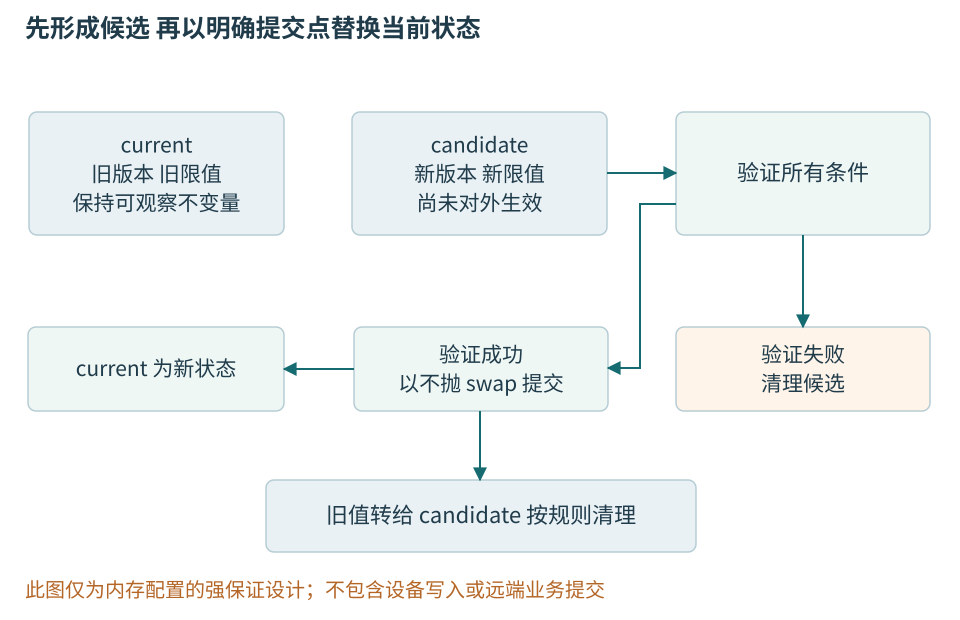
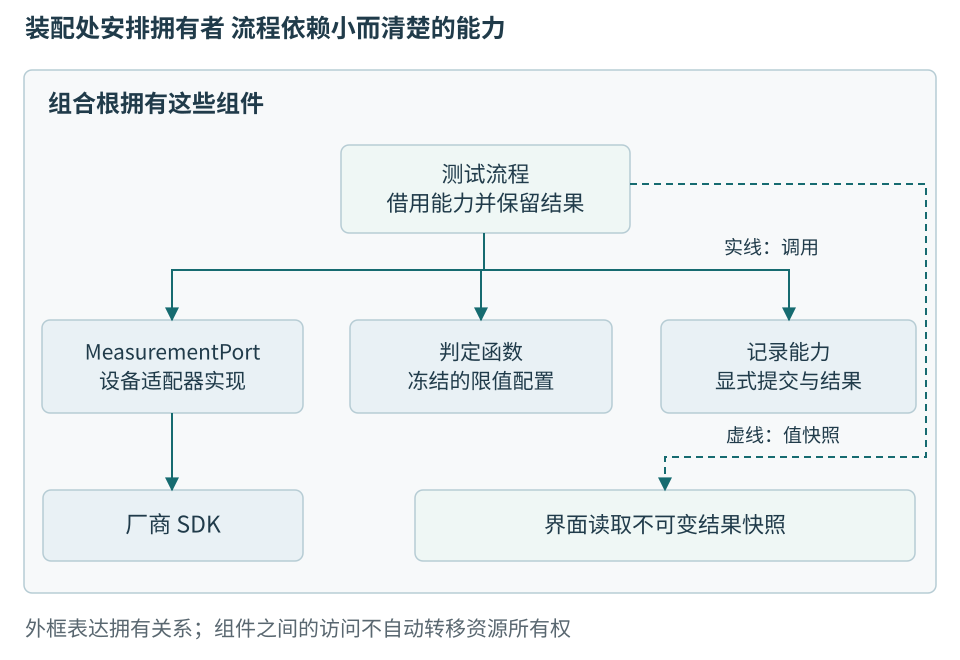

# 第七章 接口设计 错误处理与适度抽象

接口是模块之间可以依赖的约定。函数名称和参数只是它的一部分；读取温度时会不会阻塞、失败后设备是否仍可用、返回的数据归谁、重连后如何识别旧结果，同样决定调用者能否正确使用。把实现藏到类里，并不自动把这些条件写清。

本章从一份温度读取契约出发，说明错误表示、失败后状态、适配器、判定策略和装配责任。设计模式只在解决明确变化时出现，不追求让每个函数都通过继承调用。C++20为主线，所有代码为未编译、未运行的教学片段，SDK接口均为人为规定的示意契约。

## 一 先定义调用者能够相信什么

### 前置条件 后置条件与不变量

**契约**说明调用方与实现各自承担什么。前置条件是调用前必须满足的要求，后置条件是正常或失败返回后接口承诺的状态，不变量则是在约定的可观察边界应始终成立的对象关系。例如一个缓冲区的长度不能超过容量，一条打开连接的句柄必须有效，一份配置中各字段必须互相匹配。

契约可以存在于类型、约束、文档、检查或测试里。span 同时携带位置与长度，比一对无说明的裸指针更清楚；非空类型可以减少空值分支；只允许由验证工厂构造的标识符可以把格式检查集中到入口。但类型不能表达全部动态条件，仍需检查长度、权限、版本和状态转换。

设计时要说清“不满足前置条件”如何处理。某些底层接口把它定义为调用错误并不提供恢复；公共服务接口则应把不可信输入验证失败作为可处理结果。把外部数据直接交给有严格前提的内部函数，再说“用户违反契约”，并不能替代边界防护。[1]

### 一次读取的契约要覆盖正常与失败

本例读取从已识别设备会话取得一条温度。成功值包含temperature_mC、sequence和绑定会话的generation；数据必须满足适配器声明的来源和有效性条件。成功不等于已经按生产限值判定，也不等于结果已保存。接口应说明是取得新样本，还是返回允许年龄以内的最近样本，两者不能由实现随意切换。

失败至少区分暂时没有样本、连接断开、协议错误、不支持的能力和设备明确无效。调用方还需要知道失败后是否仍有在途操作、是否允许再次读取、重新连接前是否需要停止旧操作。超时只描述等待结果，没有自动撤销远端动作。

下列类型把机器决策所需的原因保留下来。ReadFailure中的vendor_code仅用于受控诊断，不要求流程直接识别每家厂商编号。示例不把错误文字用作分支依据。

```cpp
// C++20教学类型，未编译、未运行。
#include <cstdint>
#include <variant>

enum class ReadCode {
    NoSample, Disconnected, Malformed, InvalidMeasurement,
    Unsupported, InternalFailure
};
struct Measurement {
    std::int32_t temperature_mC{};
    std::uint32_t sequence{};
    std::uint64_t generation{};
};
struct ReadFailure {
    ReadCode code;
    int vendor_code{};
};
using ReadResult = std::variant<Measurement, ReadFailure>;
```

variant表示当前容纳所列候选之一。这里两个候选都只有简单字段，适合说明结果分支；对会抛出构造或赋值的复杂候选，variant存在失去活动值的异常状态，需要另查具体保证。类型不能代替消费者分支，不能直接get<Measurement>并期待错误自动变为成功。[2]

```cpp
// 调用方分支片段，未编译、未运行。
void accept_measurement(const Measurement& value);
void handle_read_failure(const ReadFailure& failure);

void consume_read_result(const ReadResult& result) {
    if (const auto* value = std::get_if<Measurement>(&result)) {
        accept_measurement(*value);
    } else if (const auto* error = std::get_if<ReadFailure>(&result)) {
        handle_read_failure(*error);
    }
}
```

这只是分类入口，accept_measurement仍需核对当前generation、测量条件和尝试身份。handle_read_failure由上层按上下文决定等待、断连或报告，不在最低层无条件重试。若以后把结果类型扩展为更多候选，这个分支也要跟着更新；类型中出现一种状态，不表示所有用户自动学会了它。

### optional 错误结果与异常如何选

optional适合“没有值”已经足够完整的情况，例如最新快照尚不存在。若没有值可能意味着断连、输入错误或设备故障，而这些需要不同动作，只返回nullopt就丢失了必要信息。本章variant提供C++20可用的显式二选一；C++23的std::expected<T,E>也专门表达值或错误，但不属于C++20标准库，不能直接填进旧工具链。[3]

显式结果不保证整个函数不抛：值和错误对象本身可能分配或构造失败。异常也不应以“只处理罕见错误”为唯一选用依据。要看环境是否支持、恢复层在哪、接口是否需要立即分支，以及失败传播会经过什么边界。

### 错误码必须保留可行动的含义

**错误码**把失败作为显式值返回，适合调用方需要立即分支、失败属于常规结果集合，或环境不允许异常传播的接口。一个裸 int 如果没有稳定枚举、来源与成功约定，很容易被误读。布尔值只能表达二分状态，不能区分“不存在”“权限不足”“输入损坏”和“暂时不可用”。

`std::error_code` 将整数值与错误类别组合，类别负责解释其来源与意义；`std::error_condition` 还可用于抽象的条件比较。不同类别里的相同整数不必代表同一错误，不能把 value 单独送到上层再丢掉 category。把一个平台原始错误映射为稳定业务分类时，也应保留必要的原始诊断信息。

errno 一类传统接口还有额外约定：只有被调用接口在指定失败情况下才保证它有相关含义，成功后遗留的旧 errno 不代表本次失败。应在失败发生后尽快保存相关状态，避免随后日志或其他调用覆盖它。线程局部机制解决的是不同线程之间的一部分干扰，不解决同线程后续调用覆盖的问题。

错误文本与错误分类应分离。文本方便人理解，可能本地化或改变措辞；代码用于稳定分支，不应靠搜索文本里的“timeout”决定重试。错误还可以携带阶段、位置、重试提示与关联标识，但不应无边界复制用户输入、凭据或巨大缓冲到日志。[1]

## 二 失败后留下什么比错误名更重要

### 失败来源与恢复责任

**异常（exception）**是一种把失败从检测位置传播到适当处理位置的语言机制。被调用函数可以用 throw 表达无法完成约定操作，控制流寻找匹配的 handler，沿途按规则销毁已建立的自动对象。它让成功路径不必逐层携带显式状态检查，但并不替程序选择恢复策略。

判断是否使用异常，不能只问“发生概率低不低”。缺少可选配置文件可能频繁却完全正常，内部必须存在的对象突然缺失可能罕见却代表程序错误；一个高频解析器也可能有意把格式不匹配表达为普通结果。更重要的问题是：失败是否属于接口定义的结果集合，调用层能否立即处理，传播时需要多少上下文，系统是否允许异常运行时。

恢复责任通常分层。底层知道操作为何失败，中层知道这次操作属于哪项业务，上层知道是否重试、降级或向用户解释。把完整恢复策略塞进最低层，会让库悄悄等待、重试或弹窗；只往上抛一个没有上下文的通用错误，又迫使上层猜测。合理接口保留机器可判断原因，同时在恰当层补充操作对象与阶段。

异常也不等于硬件故障、进程信号或所有运行时崩溃。除非特定平台扩展明确规定，不能期待 catch(...) 捕获任意非法内存访问或数据竞争造成的问题。前面介绍的未定义行为不属于“正常抛出的某种异常”，第八章的崩溃证据仍需要专门保全。[1]

### 基本 强 与不抛保证

**基本保证**通常指失败后仍保持组件不变量且不泄漏资源，但业务值可能改变。**强保证**要求失败时，约定保护的可观察状态保持原样，成功时才完成操作。**不抛保证**表示操作不会以异常逃出。它们是讨论异常安全的常用术语，具体标准库操作的实际保证仍须查各自条件与例外。

强保证不是全世界状态都回到过去。为了定位错误记录了一条日志，时钟向前走了，或者尝试分配让分配器统计变化了，都需要在承诺的观察范围内解释。设计接口时，应写明受保护的是当前对象的值、某一组内存结构、数据库事务，还是外部文件。范围不清楚的“绝对事务性”无法验证。

不抛也不等于操作必定成功。一个 noexcept 的查询可以返回错误码；一个析构函数可以记录关闭失败；一个系统可能在不可恢复错误时终止。若把所有失败都藏在内部而继续假装成功，形式上不抛并不代表接口健壮。需要区分不以异常退出与完成业务目标。[4]

### 先准备新限值 再替换当前版本

假设一份工站配置同时含limit_version和上下限。先改版本字符串，再检查上下限，检查失败就会把旧数值贴成新版本。异常被catch住也不会自动恢复它。可先准备完整候选，验证后再一次提交。

```cpp
// C++20教学配置，默认标准分配器；未编译、未运行。
#include <cstdint>
#include <stdexcept>
#include <string>
#include <utility>

struct LimitConfiguration {
    std::string limit_version;
    std::int32_t low_mC{};
    std::int32_t high_mC{};

    void swap(LimitConfiguration& other) noexcept {
        limit_version.swap(other.limit_version);
        std::swap(low_mC, other.low_mC);
        std::swap(high_mC, other.high_mC);
    }
};
```

```cpp
// 单线程替换；候选须独立于current构造，未编译、未运行。
void replace_limits(LimitConfiguration& current,
                    LimitConfiguration candidate) {
    if (candidate.limit_version.empty()
        || candidate.low_mC > candidate.high_mC) {
        throw std::invalid_argument("invalid limits");
    }
    current.swap(candidate);
}
```

这里有一个必要前提：调用方先独立建立候选，不能通过std::move(current)或移动current的成员来构造参数。否则，函数进入前current就可能已改变，后续拒绝无法保护此前的值。在此前提下，候选建立失败不会修改current，验证失败也不提交。通过后，本例默认分配器的string交换与整数交换满足所需不抛条件，candidate随后持有旧值并退出。若替换成员、分配器或提交动作，就必须重新审查条件。并发更新还需要在锁或版本控制下提交，不能把这个单线程函数直接当作原子发布。[1]

强保证只覆盖约定的内存配置，不覆盖设备参数写入。若先向节点写校准系数，再因本地记录失败抛异常，设备不会随栈展开自动复原。更可靠的设计保留操作身份与阶段，查询真实设备状态后恢复；不可确认就报告未知，而不是删掉日志重新执行。



图07-1 准备与提交使失败后的状态可解释。图只覆盖本例内存配置，不能把它扩大为物理设备与文件的共同事务。

### assert 不能承担输入验证

C++20 的 assert 宏用于表达程序员希望在检查开启时验证的条件，受 NDEBUG 等配置影响。检查被禁用时，表达式可能根本不求值，因此不能把必要副作用写在断言里。断言失败的处理也不是普通业务错误返回，不能拿它替代所有用户输入检查。

```cpp
// C++20 断言与检查分工示例，未编译、未执行。
#include <cassert>
#include <cstddef>
#include <stdexcept>
#include <vector>

int checked_at(const std::vector<int>& values, std::size_t index) {
    if (index >= values.size()) {
        throw std::out_of_range("index outside values");
    }
    assert(index < values.size()); // 可作内部事实说明，不承担必要验证
    return values[index];
}
// 不应写 assert(open_resource()); 再依赖其副作用完成打开。
```

实际代码里重复断言可能没有必要，示例只是展示责任分开：必须执行的验证在普通控制流中，断言用于内部假设。若接口已经通过类型和此前逻辑保证索引有效，可以选择内部前提检查；若接收外部索引，则应持续验证，不因发布构建关闭断言而失去防线。

本章所说契约主要是设计概念，不把 C++26 的语言契约特性写成 C++20 已有语法。即使采用语言支持，也仍需定义外部输入错误、内部违反和运行策略之间的关系。[1]

### 不变量应该在发布前恢复

一个对象可以在成员函数内部短暂调整多个字段，但在向外返回、触发回调、释放锁或把对象交给其他线程之前，应重新建立承诺的不变量。异常路径也属于离开边界。若在中间状态调用用户回调，回调可能读取对象、重入同一函数或抛出，把原本局部的更新过程暴露出去。

例如，队列先增加元素计数再完成元素构造，若构造失败且计数未回滚，析构时可能把未构造存储当作对象处理。更合理的提交点是在元素建立成功以后更新可见计数，或用清理守卫可靠回退。容器实现反复出现的“已构造数量”变量，正是在记录哪些对象真的需要销毁，不能只看预留空间大小。

不变量也应区分业务状态。一个已关闭连接不是无效内存，它可以是合法状态，只允许查询和重新打开；一个移动后的对象可以是有效但内容未指明；一个解析失败的结果可以正常保存错误。把所有不再拥有成功值的状态都叫作“坏对象”，会迫使接口使用者进行不必要的规避。[1]

### 让错误难以被忽略 但不要制造假安全

`[[nodiscard]]` 可提示调用方不要随意丢弃重要结果，但通常只是请求诊断，不是强制调用方处理每种错误的证明。调用方仍可有意忽略或错误解释结果。为返回状态的函数加它有帮助，真正的保护还来自清楚的命名、类型和代码审查。

输出参数常隐藏“失败时保留旧值还是写入部分值”的问题。若必须使用输出参数，应明确规定失败后的内容、是否允许与输入别名，以及在何时写入。用返回值封装成功结果，常能减少这种状态组合；但跨 C ABI 或大缓冲区接口仍可能需要输出指针，此时不能省略约定。

默认值也要谨慎。把所有失败映射成 0、空列表或“匿名用户”会让调用方继续处理一个看似合法的值。只有当默认行为本来就在业务契约内，并且不会掩盖应采取行动的错误时，才适合作为降级。日志里记录了错误也不能抵消错误结果继续传播造成的损害。

API 可用性包括让调用顺序容易正确。必须先 init 再 open 再 start 的可变对象，可能产生大量无效中间状态；工厂返回一个已经满足不变量的对象，或用不同类型表达已打开与已关闭状态，常能减少误用。不过类型状态也会增加接口和编译复杂度，应针对真正重要的协议约束使用。[1]

## 三 抽象要保护真正独立的变化

### 用内聚与变化原因检验模块边界

**模块边界**把一组相关责任封装起来，对外暴露必要契约。目录、命名空间和类只是实现手段。内聚关心模块内部的行为、数据和不变量是否共同服务于一个清楚的责任；耦合关心模块需要知道对方多少事情，以及一处变化会向外传播多远。“方法都操作同一张表”可能只是存储上的偶合，“方法名都以test开头”更不能证明它们属于同一责任。

考虑测试站里的一个StationManager：它读设备寄存器、决定合格区间、修改数据库表、生成报告，并处理窗口按钮。更换仪器协议、修订工艺判据、调整报表样式，都要求修改这个类。问题不是它超过某个行数，而是几种独立变化被绑在一起，修改一个职责时必须重新理解其余职责。

**单一职责原则（SRP）**要求识别模块所响应的变化原因。Martin的原作者说明把这种原因联系到提出需求的业务角色或职责群体，而不是机械规定“一类只有一个方法”。[9] 在此教学场景中，采集适配器负责协议与测量语义，判定逻辑负责计划所定义的规则，结果提交负责记录完整性，报告投影负责展示。一个人可能兼任这些角色；同一部门也可能提出几种互不相关的变化。划分依据是责任及变化关系，不是照抄组织架构。

**高内聚不意味着把相关数据拆到最细。** 一次结果的设备身份、计划版本、实测值和判定必须共同保持一致，结果记录可以由一个领域对象维护。为了“职责更少”把它们分别交给几个可以独立写入的服务，反而使合法结果难以建立。保存结果和保存待发送事件虽然属于不同技术表，却可以是同一个提交责任的一部分；记录章节会继续说明这一点。

**低耦合也不等于没有依赖。** 应区分源码依赖、共享表示、时间顺序和发布协同：包含厂商头文件是编译耦合；知道寄存器编号是语义耦合；必须先调用三个隐含初始化步骤是时间耦合；新增字段要求全部站点同时更新是发布耦合。将调用换成消息只能改变部分关系，不能自动消除它们。

可以沿着一个具体变化检查边界：增加一种设备，如果需要改驱动适配和装配配置，但无需改判定算法、历史结果和报告协议，变化已得到合理限制；若所有模块都访问可变的全局当前设备与当前计划，分多少目录也没有真正隔离。文档导入的格式解析、领域验证、存储和进度显示也可这样判断。[5]

### 依赖倒置保护规则所需要的能力

核心规则若直接读取环境变量、创建网络连接、调用具体数据库和写日志，就难以单独验证，也容易被基础设施变化牵动。**依赖倒置原则（DIP）**关注的是依赖关系：高层规则不应为了使用外部能力而了解易变的底层实现，能力契约应表达规则真正需要什么，由具体实现来满足。Martin的原始材料说明了这种依赖方向及其适用背景。[10]

例如测试流程需要“从指定设备取得带单位和有效性标记的测量”，不需要知道某厂商的USB句柄。可以由领域侧定义MeasurementPort契约，流程依赖该契约，UsbMeasurementAdapter也依赖该契约并实现它。编译时，核心不再包含厂商SDK；运行时，流程仍然调用适配器。这就是源码依赖方向与运行时控制流可以不同，不能把“倒置”理解成执行顺序倒过来。

接口的拥有者同样重要。若IUniversalDevice仍暴露readRegister、vendorStatus和厂商结构体，核心必须继续解释寄存器与错误码，增加一个字母I并没有隔离变化。相反，接口若许诺该设备根本无法保证的原子测量或硬截止时间，适配器也无法靠包装实现它。抽象必须既满足使用者，又能由真实设备兑现。

DIP与依赖注入不是同义词。把一个具体SqlResultStore作为构造参数传入，已经用了注入，但核心仍可能依赖其SQL语义；让存储适配器实现由结果提交用例定义的契约，才改变了依赖结构。后文继续讨论如何装配这些依赖；两者可以配合使用，但都不要求框架容器。

这种分离不要求每个函数都有抽象父类。纯判定函数接收值，通常已经足够独立；稳定的标准库值类型也不需要再包一层。依赖环则值得特别关注：若核心为了翻译适配器错误又包含适配器头文件，循环责任仍在。应调整契约或责任，而不只是通过前向声明藏住编译环。[5]

### 先写纯判定 再决定是否需要策略

固定区间判定只需要已确认有效的温度和本次冻结的限值，不需要知道串口、窗口或数据库。把它写成纯函数，输出仅由输入决定，就已经建立一个容易理解和验证的边界。范围采用闭区间还是开区间必须明确，不能把边界比较视为无关细节。

```cpp
// 教学判定，不对应产品限值；未编译、未运行。
enum class Verdict { Pass, Fail, Inconclusive };
struct JudgmentInput {
    std::int32_t temperature_mC{};
    bool valid{};
};
struct Limits {
    std::int32_t low_mC{};
    std::int32_t high_mC{};
};

Verdict judge_interval(const JudgmentInput& input,
                      const Limits& limits) noexcept {
    if (!input.valid || limits.low_mC > limits.high_mC) {
        return Verdict::Inconclusive;
    }
    const bool inside = limits.low_mC <= input.temperature_mC
        && input.temperature_mC <= limits.high_mC;
    return inside ? Verdict::Pass : Verdict::Fail;
}
```

Inconclusive表示无法作有效判断，不是把不合格改成通过。生产结果还应记录缺少哪个前提；这个枚举只是最小表达。限值版本、样本身份和来源检查由流程形成可靠的JudgmentInput，纯函数不会自行补齐这些证据。

若只有上下限数值变化，传不同Limits就够了。若真的存在瞬时区间、稳定窗口、平均偏差等不同算法，Strategy策略模式才有具体用途：把可替换算法交给流程，而不让流程不断判断具体型号。短小无状态算法可用函数指针，固定组合可用模板，需要运行时有状态替换再考虑虚接口。

模板能检查调用形状并提供优化机会，不证明算法符合工艺；一个永远Pass的函数仍可能满足类型约束。虚函数也不自动比模板“慢到不能用”，成本要看调用频率与外部I/O。抽象选择应说明变化发生在构建时还是运行时、是否需要持有状态、代码体积和生命期成本。

一次测试开始后绑定明确算法与limit_version。热更新可以影响下一次尝试，不能让正在采样的同一次尝试中途换判据。如果需要按新规则复核旧测量，应追加带新版本的复核结果，保留原始证据，而不是悄悄改写历史PASS/FAIL。

## 四 设备适配必须保留原有语义

### 里氏替换检查的是可依赖的行为

**里氏替换原则（LSP）**要求使用者依据抽象契约得出的正确判断，在替换具体实现后仍成立。Liskov与Wing的行为子类型论文强调规格中的可证明性质，还讨论了不变量和跨状态的历史约束；仅有兼容的函数签名并不够。

设MeasurementPort承诺：对已声明支持的量程和模式，在同一已确认的设备会话中执行读取；成功结果带明确单位、采集身份与新鲜度；无法建立这些条件时返回约定错误，不伪造样本。契约还要说明线程归属、超时和断线后的会话状态。以此检查替换，比问“这两个类是不是都叫传感器”有效得多。

第一，具体实现不能偷偷增加调用者必须满足的前置条件。原接口允许已声明量程内的输入，某派生实现却要求先调用未公开的prepareVendorX，使用者便无法只依赖原契约。若某设备确有预热或调零要求，可以由适配器在既定操作预算内完成，或者把必要过程明确放进共同会话协议；不能让调用方按型号猜测。

第二，不能削弱后置承诺。超时后返回上次缓存值并把valid置为true，会把“当前测量”变成“某次测量”；将摄氏度值直接装进temperature_mC字段，即使数值类型相同也破坏契约。若缓存有实际用途，应定义允许的年龄和来源，或提供独立的历史读接口，而不是无声降级。

第三，不变量与历史也要保持。会话开始时绑定的DeviceId，不应在热插拔后被透明替换为另一台设备，同时继续沿用原执行身份。即使每次read都返回合法double，整段过程的证据已经失真。失败路径也是行为的一部分：哪些错误可重试，失败是否改变设备状态，超时是否仍有在途IO，都需要共同约定。

这里对截止时间、线程和设备身份的要求是本章场景的工程契约，不是声称原论文证明了实时性。LSP也不保证每种硬件具有相同精度或速度；应通过明确的能力声明与计划校验限定可替换范围。若接口允许所有实现随时回答“不支持”，它可能没有违背一条很弱的文字契约，却也无法满足流程需要。[6]

### 接口隔离由使用者所需能力决定

**接口隔离原则（ISP）**要求使用者不必依赖自己不需要的操作。原作者的讨论以使用者特定的接口来限制变化传播，不要求每个调用者都拥有一套独一无二的接口。[10]

假设一个Device接口包含identify、readTemperature、writeCalibration、flashFirmware和exportCsv。只读温度采集器为了继承它，不得不为写校准与刷固件抛出“不支持”；展示程序只想读取历史结果，却意外得到修改设备的入口。更合理的边界可能是MeasurementPort、CalibrationPort与ResultReader：采集用例只接收采集能力，校准用例另外获得写入能力，报告读取不可变结果。

这不要求三个物理设备或三条连接。一个具体会话可以实现多个小接口，在组合根里把不同视图交给不同使用者，同时共同管理同一个连接的独占与关闭。接口隔离减少了误用面，但本身不是权限隔离：同进程恶意代码、越权工具和网络客户端仍需要真正的认证、授权及进程边界。

也不要把“接口小”理解为“每个方法单独一个接口”。开始会话、执行读取、结束会话若共同维护一个协议不变量，可以放在同一能力契约里。把它们机械拆开，会让调用顺序与所有权流散到使用者。应把一起变化、一起建立合法过程的操作保留在一起，把彼此无关的业务能力分开。[5]

### 一个同步读取接口的最小形状

```cpp
// C++20接口形状，未编译、未运行。
class MeasurementPort {
public:
    virtual ReadResult read_once() = 0;
    virtual ~MeasurementPort() = default;
};
```

virtual允许通过基类引用调用具体实现，=0表示这是由实现方提供的纯虚操作。若使用者要通过基类指针销毁具体对象，公开虚析构使相应派生清理能够发生。override可由编译器检查派生函数是否真的覆盖预期入口，但不能检查测量单位或失败后状态。[5]

本例人为约定read_once为同步调用，完成后不保留调用者缓冲，所有操作由外部串行化；成功只返回已核验会话的新样本。没有给出毫秒硬期限，也没有装作它可以打断任意SDK。若流程需要异步取消，就要设计包含操作身份、完成和最后使用点的新契约，而不是在这里返回默认值。

Adapter适配器把厂商SDK转换为这个契约。某SDK给百分之一摄氏度整数，适配器应按明确范围转换为mC；某错误码表示暂时无数据，不能统一映射为断连；某SDK成功只表示发送请求，则它根本不能直接作为“同步取得新样本”的实现。适配器必须补足可实现的流程，无法补足就收窄能力或拒绝匹配。

例如温度原始值2500、厂商单位0.01°C，转换到mC应为25000；该转换要先验证源范围和整数乘法。若SDK返回的是上一条缓存样本，也必须标明年龄或使用另一查询接口。只给函数改名为read_once不会让缓存变成新测量。

适配层可以隐藏厂商头文件，仍应保留必要原始错误和固件身份供诊断。不要把全部厂家细节泄漏给流程，也不要为了“统一”把每种失败压成Unknown。好的边界让稳定业务容易使用，同时让差异仍可被解释。

## 五 装配对象也要装配生命期

### 依赖注入让构造与使用分开

**依赖注入**是由外部向对象提供其需要的协作者，而不是对象内部自行寻找或创建全部依赖。Fowler的原始文章讨论了构造、配置与使用的分离。它可以通过构造参数、函数参数、模板或工厂实现，不必引入大型容器框架。

```cpp
// C++20依赖注入教学片段，未编译、未执行；不是完整应用。
#include <chrono>

class Clock {
public:
    using time_point = std::chrono::steady_clock::time_point;
    virtual time_point now() const noexcept = 0;
    virtual ~Clock() = default;
};

class Expiry {
public:
    Expiry(const Clock& clock, Clock::time_point deadline) noexcept
        : clock_(clock), deadline_(deadline) {}

    bool expired() const noexcept {
        return clock_.now() >= deadline_;
    }
private:
    const Clock& clock_; // 非拥有引用：clock必须活得比Expiry更久
    Clock::time_point deadline_;
};
```

片段没有提供真实时钟、可控测试时钟和测试框架。它展示过期判断如何摆脱全局当前时间，同时明确被引用时钟的生命期。若需要跨线程修改假时钟，应另外设计同步；`const`成员函数不自动保证对象内部线程安全。

这里用虚接口是为了让过期判断与时钟来源独立装配，并不要求所有调用都这样做。短小纯函数也可以直接传入当前时间值。策略绑定的取舍已在前文比较，注入的关注点则是让依赖可见、可构造、可回收。[7]

### 组合根与工厂管理构造和生命期

依赖被注入以后，仍需要有人创建并销毁它们。**组合根**是在适当入口装配对象图的地方，例如程序启动或请求作用域建立阶段。集中装配有助于看清谁拥有数据库连接池、执行器、时钟和配置，并规定关闭顺序。

若任务依赖执行器，执行器又可能调用存储，关闭时就不能先销毁存储再等待任务完成。可以先停止接收新工作，再请求取消，等待在途操作达到可回收状态，最后释放依赖。第六章的取消与完成规则不会因为采用依赖注入而消失。

服务定位器把依赖隐藏在全局查询中，可能简化调用签名，却让测试和生命期更难观察。它不是绝对禁止，但需要承认代价。显式参数过多则可能提示对象责任过宽，而不是立刻把所有参数塞回全局容器。

当测试站支持多种设备驱动时，可以在这个入口用一个小型**Factory（工厂）**根据已验证配置创建适配器，并以唯一所有权返回。工厂集中了解具体类、连接参数与失败处理，流程只接收所需能力。若只有一个固定实现，直接构造即可；只有需要成套创建相互兼容的多种对象时，才考虑更复杂的抽象工厂。

创建成功应表示对象达到声明的可用状态，而不是“指针非空，稍后自行初始化”。创建过程若打开连接、注册回调或申请句柄，中途失败要由RAII释放已经取得的资源。不能先把半成品放进全局注册表，再要求所有使用者记住调用init。工厂也不是无限重试的位置，设备断开、身份不符和配置错误应保持可区分。

计划校验、能力选择和对象构造应有明确顺序。先判断计划所需能力是否支持，再建立设备会话并核对身份；运行时重连必须重新履行会话契约。退出时先停止新请求，等待设备操作达到可确认状态，注销或排空回调，再销毁会话与执行器。析构函数不应暗中等待尚未结束的异步设备操作。[7]



图07-2 依赖由使用者所需能力决定。实线为调用，外框表示拥有与寿命；增加接口并不会自动产生权限隔离。

一个上位机通常可以先以模块化单进程完成这些边界。把适配器拆到另一个进程可以隔离部分崩溃，却新增序列化、超时、重连和版本成本；增加网络服务还会引入部分成功。只有明确收益足以承担这些责任时才拆分，不把部署数量当成架构质量。

## 六 状态 命令与通知各有边界

状态机记录当前允许发生什么，例如Ready、Running、Stopping和NeedsReview。枚举与集中转换函数足以表达许多工站；只有各状态行为确实复杂且独立变化时，才考虑State模式。把每个状态变成类不会自动防止非法转换，也不会证明某个设备停止事实已成立。

Command命令有价值的场景是排队、重试、审计与操作身份。command_id表示一次业务意图，同一命令因回执丢失而重传应保持身份；重新测试或重新校准则应按流程创建新的意图。sequence属于样本，generation属于连接，都不适合充当跨连接稳定命令身份。

命令不自动可撤销。尚未执行的排队项可以撤回，已经写到设备非易失性存储的校准参数则可能需要读回、独立授权的新操作或人工复核。给Command添加undo函数不会消除物理与持久化后果。状态转换只能依据真实证据，不能仅由用户按下取消就标记设备已停止。

Observer观察者适合让显示和非关键统计订阅变化。订阅意味着回调保留、线程归属、注销与迟到通知责任；慢显示者可以按契约合并，正式记录不能依赖窗口恰好打开。记录保存后如何可靠向外发送，由记录/提交层处理，不由一个“emit completed”自动保证。

当命令超时，恢复层应先确定是未接纳、已执行还是未知。设备支持稳定操作身份和结果查询时，可以据此恢复；不支持时，不能用本地去重表假装证明物理动作只发生一次。未知状态保留证据并请求复核，往往比无条件重试更诚实。第十四章和综合工站章继续解释外部交付。

## 七 错误跨边界时怎样保留原因

### 传播需要保存原因 转换需要说明损失

从底层错误映射为业务错误时，至少保留上层决策所需分类。例如“连接失败”可能包含认证失败、地址不可达和超时；认证失败通常不该通过重复相同凭据立即重试，暂时不可达可能适合带总预算的重试。若转换只剩“unknown”，上层无法作正确选择。

也不应该毫无筛选地把内部堆栈、路径和数据库详情暴露给外部用户。可以对外返回稳定错误分类和关联标识，在受控日志中保存适量内部上下文。可诊断性与最小披露不矛盾，关键是明确不同读者能看到什么。

错误跨线程时不会自动沿创建线程的调用栈传播。可用 exception_ptr、future/promise 或任务系统结果通道转交异常或结果，再在接收线程决定处理。取消也需要单独定义：它可能是预期完成状态，可能与截止时间区分，还可能发生在部分结果已经产生以后。第六章已把传播与关闭协议联系起来。

**面试追问：“错误码一定比异常快吗？”** 不能脱离成功率、调用层数、代码布局、错误构造和 ABI 实现回答。错误码可能增加每层分支，异常可能增加表与失败路径成本；硬实时项目还关心最坏时间。应测量相应负载并遵守平台限制，不拿一种机制的名称替代性能证据。

**面试追问：“为什么 expected 的错误类型不直接用 string？”** 可以用，但字符串只适合人的描述，未必提供稳定分类，还可能分配。一个小枚举加必要位置或上下文可以更适合机器决策，文本由呈现层生成。若确实需要丰富诊断，则要说明其成本与隐私边界。[1]

### 禁用异常是整条调用链的配置决定

嵌入式、硬实时、游戏或特定基础设施项目可能禁用异常，原因包括运行时支持、最坏执行时间、制品大小或项目约定。这通常是工具链配置，不是“选用 C++20”便能自动推导出的语言子集。所有依赖的分配、容器、库包装与回调都需要按实际配置检查。

`-fno-exceptions` 一类选项不意味着标准库本来可能失败的操作都会自动返回 error_code。某些实现会把原来抛出的失败路径改为终止，某些代码含 try/throw 就不能编译，跨异常配置边界的行为还受工具链约定限制。应阅读具体实现文档并建立允许使用的库接口清单，不能只在业务层删掉 catch。

不抛设计仍可充分使用 RAII。析构在正常作用域退出时照样管理资源，错误码路径也可以通过 return 自动清理。真正需要调整的是失败怎样返回、对象如何建立不变量，以及资源获取失败时是否有明确结果。例如工厂返回“对象或错误”，而不是默认构造一个半初始化对象，再要求每个成员函数反复检查内部 flag。

动态分配也是独立问题。禁用异常不等于禁止堆，不使用堆也不等于程序不可能失败。实时接口需要同时约束分配策略、最坏时间、锁等待、缓冲容量和错误报告成本；仅选择错误码不能证明执行时间可界定。[8]

跨C或第三方DLL边界时，不能让未约定的C++异常直接穿越。可以在适当边界捕获可处理异常，转换为稳定结果并保留关联诊断。noexcept只承诺异常不逃出，若里面的异常没处理，结果可能是终止而不是错误码。错误报告本身的字符串分配和日志阻塞也需要预算。

来源不可信的值必须由始终执行的检查处理，不能靠debug断言。相反，内部不变量被破坏时，也不宜为了“高可用”简单返回上次温度继续判定。恢复策略取决于是否仍能建立可信状态，而不是把所有失败都转换成一个看起来合法的默认值。

### 超时适配器返回旧值为何破坏替换

设旧驱动在读取期限内失败时返回NoSample，新驱动为了减少错误率，超时就返回上次温度并标为成功。正常环境的演示都能显示数值，但稳定窗口判定可能把同一个旧样本重复当作多个新样本，错误产生PASS。

需要补充的新旧契约、样本sequence、源时间、缓存年龄与失败后状态。若多次成功读取返回同一采样身份，且上层要求新样本，就已与契约冲突。不能用“温度本来稳定所以相同”解释序号也没有变化；也不能仅检查数值是否在量程内。

修复应恢复NoSample，或引入清楚的历史快照接口并让流程显式决定能否使用。新旧适配器应共享相同契约样本：有效新数据、暂时无数据、身份改变、断连和不支持能力。真实硬件仍需验证来源与时间。错误率升高可能只是终于诚实报告了先前被掩盖的失败，不应反过来要求适配器恢复假成功。

### 新限值加载失败后结果版本错配

若日志称限值版本v2，实际比较仍用v1的数值，检查更新是否先改标签、后构造内容。逐步记录候选创建、校验、提交和本次尝试绑定位置，就能区分半更新与尝试中途读取全局最新配置。两者都可产生版本和值不同步，但需要不同修复。

前者用准备后提交解决，后者让尝试持有不可变配置快照。验收应在字符串分配、解析、校验各阶段失败，确认当前版本与数值一起保持旧值；提交新版本后，旧尝试继续使用旧快照，新尝试按规则选择新版本。没有实际执行时，这些是待验证条件，不能标成已修复通过。

## 八 面试追问以需求和代价收尾

**接口相同为什么不能直接替换**

签名不包含全部行为。单位、样本新鲜度、设备身份、线程、失败后状态与期限可能不同。替换实现不能偷偷提高前置条件或降低成功承诺，应在能力范围内用共同契约验证，而不是只看override是否编译。

**什么时候应该使用策略模式**

算法本身需要独立替换时有价值，只有阈值变化通常传数据即可。运行时按计划选算法、构建时固定类型组合、需要持有状态，是不同选择条件。先用纯函数表达稳定规则，避免为一套算法搭一整套继承框架。

**强异常保证是不是try catch把异常接住**

不是。catch不恢复已修改状态。要限定保护范围，把可失败准备放在提交前，并证明提交和清理条件。它也不撤销外部设备动作；跨设备恢复需要操作身份、查询和明确未知状态。

**没有异常的MCU能否使用RAII**

可以在支持的语言与运行环境中用对象作用域管理资源，错误码返回仍会执行正常退出清理。需要另行设计构造失败、分配失败和调用链错误机制。禁异常不等于标准库自动返回错误，也不等于硬实时已经证明。

**依赖注入是不是多写几个接口方便测试**

核心是把协作者显式交给使用者，使构造、配置与生命期可见。测试是收益之一；一个时间值或函数参数有时已经足够。接口越多越好不是目标，真实变化、所有权和恢复责任清楚才是目标。

## 资料与核验范围

核验日期2026年10月6日。代码使用C++20，expected仅作为明确标注的C++23能力介绍。没有编译、SDK联调、异常注入或契约测试结果。设计原则是分析工具，不是某类实现普遍最优的证明。

1. WG21 [N4861](https://www.open-std.org/jtc1/sc22/wg21/docs/papers/2020/n4861.pdf)：异常、断言、nodiscard和值类型
2. N4861 [variant](https://timsong-cpp.github.io/cppwp/n4861/variant)：候选状态与异常边界
3. WG21 [C++23草案N4950](https://www.open-std.org/jtc1/sc22/wg21/docs/papers/2023/n4950.pdf)：expected，不是C++20设施
4. WG21 [N2855](https://www.open-std.org/jtc1/sc22/wg21/docs/papers/2009/n2855.html)：异常安全设计背景
5. [C++ Core Guidelines](https://isocpp.github.io/CppCoreGuidelines/CppCoreGuidelines)：接口、类层次、资源与责任建议
6. Liskov与Wing [A Behavioral Notion of Subtyping](https://www.cs.cmu.edu/~wing/publications/LiskovWing94.pdf)：行为替换，不提供设备时限证明
7. Martin Fowler [Dependency Injection](https://martinfowler.com/articles/injection.html)：构造与使用的分离
8. GCC [libstdc++异常配置](https://gcc.gnu.org/onlinedocs/libstdc++/manual/using_exceptions.html)：禁异常的具体实现条件

9. Robert C. Martin [Single Responsibility Principle](https://blog.cleancoder.com/uncle-bob/2014/05/08/SingleReponsibilityPrinciple.html)：按变化原因解释职责
10. Robert C. Martin [Design Principles and Design Patterns](https://objectmentor.com/resources/articles/Principles_and_Patterns.pdf)：DIP与ISP的原作者材料
