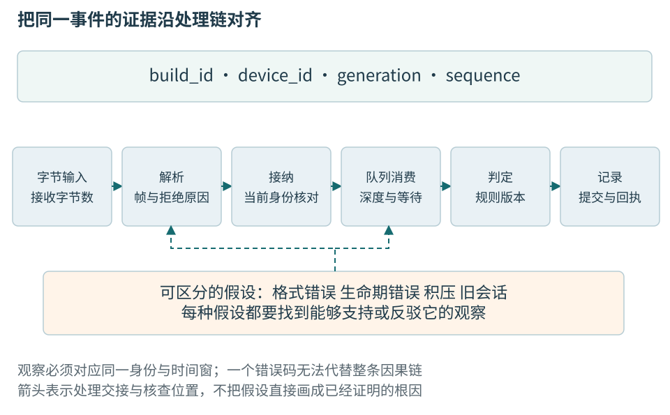
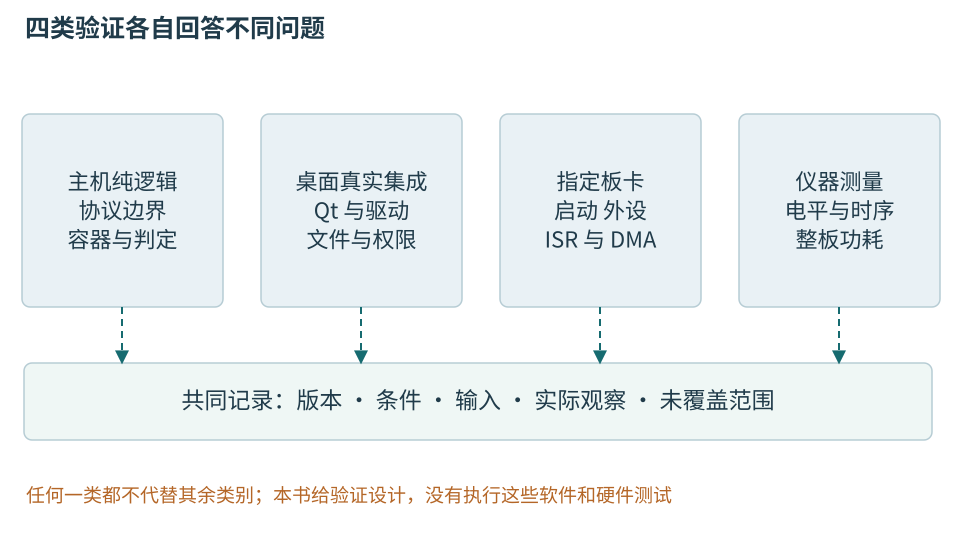

# 第八章 调试 测试与故障证据

调试解释一个失败为什么发生，测试用可重复的输入与判据检查承诺。二者会相互连接：故障提供值得保留的反例，回归测试防止它再次出现；已有测试的盲区又会提示现场还需要什么证据。工具能够扩大可见范围，却不能替我们决定什么算正确。

温度工站中的一条异常可能跨越对象、解析、会话、队列、判定和记录。这个章节把观察安排在这些边界，分别说明主机逻辑、目标板与物理测量可以验证什么。所有命令与测试代码为未执行的教学材料；没有真实崩溃、Sanitizer报告、覆盖率或板上结果，图中的过程也不是实验照片。

## 一 先把失败写成可区分的事实

“温度不对”过于宽泛。更可操作的描述是：在工站构建A、节点固件B、generation=7的一次测试里，sequence=40的原始温度为25000mC，界面却显示25000°C。后一种描述包含对象、环境、关系和差异，可以区分解析错误与显示换算错误。

故障判据应尽量稳定。崩溃是明显判据，却未必是最早错误；设备身份错配、重复结果、被接纳样本没有终态，即使不崩溃也已经失败。先定义需要捕获的契约违反，再做缩减、比较和测量，避免最后修好的是另一个症状。

### 最小复现保留触发机制 而不只是删代码

**最小复现**是保留特定失败所需条件、同时尽量减少无关因素的材料。它可以是一个小程序、一段输入、一组请求顺序或一份配置。最小的目标是让因果更清楚，并不要求把真实分布式事故压缩成十行代码。

删掉一个模块后问题消失，至少有两种解释：这个模块参与根因，或者删除它改变了时序、布局和资源压力。每次缩减都应观察原来定义的失败判据，而不是只看“有没有崩溃”。若判据变了，最后得到的可能是另一个错误。

一个完整复现说明应包含输入与其来源、执行前提、精确构建身份、触发步骤、期望与实际差异、发生频率及失败判据。对偶发问题，还要说明统计口径：进行了多少次尝试、哪些尝试有效、是否有超时或中断。没有实际运行时，只能写计划与预期，不能填入虚构成功率。
### 建立假设表比同时修改五处更有效

假设超时来自连接池耗尽、下游变慢或事件线程被阻塞。三者可能都造成请求等待，但可观察预测不同：连接池耗尽时等待获取连接的时间增加；下游变慢时发送后等待响应的时间增加；事件线程阻塞时多个无关连接的处理都可能推迟。

先把总耗时分解为排队、资源获取、发送、下游等待、解析和回调等阶段，再选择能区分假设的观测。若同时增加连接数、换解析器、改线程数并延长超时，即使症状暂时消失，也不知道哪个变化起作用，甚至可能只把故障推迟到更大负载。

对照实验应尽量一次改变一个有意义因素，保持输入和配置可追溯。现实系统不能总做到完全控制，但仍可记录哪些条件不可控，并降低结论强度。诊断中的诚实不是保守措辞，而是防止把关联当因果。
### 用同一条记录连接观察点

为一个解析到的样本记录generation、sequence、输入偏移、解析完成、业务接纳和记录结果。为设备命令记录command_id及发起、已发送、已确认或未知。诊断不应把这些不同身份统一命名为id，也不应只在显示层补一个当前时间掩盖来源时间缺失。

| 假设 | 预期观察 | 最小取证点 | 能排除什么 |
| --- | --- | --- | --- |
| 数据尚未收到 | 接收计数不前进 | 驱动读取入口 | 不能单独区分线缆与设备 |
| 解析拒绝 | 字节在增长但有效帧不增长 | 候选长度与错误分类 | 缩小到解析或输入格式 |
| 后台积压 | 接纳增长 消费年龄增加 | 队列水位与时长 | 显示变化慢不必是设备慢 |
| 旧会话混入 | 接收所属代际不同 | 会话绑定与接纳入口 | 数值正常也不能接纳 |

表中的观察用于区分假设，不是自动诊断器。接收计数没有变化还可能是记录通道失效，计数增长也可能只收到噪声；必要时用另一层证据交叉检查。缺少证据应标明未知，不能由一个看起来合理的故事替代。

### 日志需要连接状态转移

有效日志描述事件、身份和状态变化。对于异步请求，可以记录请求关联标识、操作阶段、连接代际、制品版本、结果分类与适当耗时。仅打印“开始”“结束”“出错”，在并发环境里几乎无法知道哪一对属于同一操作。

关联 ID 不等于随意把个人信息当键。可以使用不暴露业务内容的标识，并限制生命周期和访问。日志字段的高基数会影响存储与查询，完整负载则可能泄露秘密。应保存解释故障所需的最少内容，而不是认为“日志越多越可观测”。日志不应承担无限制的全部运行记录。

错误记录也要避免重复放大。底层记录一次、每层重新打印同一堆栈、网关再打印完整请求，可能让一次失败产生几十条看似独立的事故。可以保留稳定错误分类与原因链，由适当边界输出上下文，其他层用关联标识连接。

时间关系需要谨慎。不同主机的墙上时钟存在偏差，时钟校正也会影响比较；同一进程测量持续时间通常应使用适合测间隔的单调时钟。跨进程事件排序需要结合请求因果关系，不能仅把所有日志按毫秒时间戳排序就当成绝对执行历史。


图08-1 证据要沿同一事件连接。相同文件名、PID或温度数值都不足以证明来自同一次运行。

## 二 调试器把当前机器状态映射回源码

### 调试器通过映射把机器状态还原成源码线索

程序运行时拥有指令地址、寄存器、内存和线程状态。源码中的函数名、局部变量和行号不是机器执行必需的信息。**调试符号**保存二者之间的映射，使调试器能够把一个程序计数器解释成函数与源码位置，把某一段存储解释成一个变量。

这种解释需要匹配实际制品。相同源码经不同选项、链接顺序或工具链构建，地址和优化结果都可能改变。给崩溃转储加载“差不多同版本”的符号，可能比没有符号更危险，因为它会产生看起来很具体却不可靠的答案。构建身份、模块身份与符号身份应共同核对。 

GDB 和 LLDB 都能控制程序执行、设置断点、查看线程与变量，但命令模型和平台集成不同。学习重点应是每个操作要回答什么，而不是机械把两套缩写逐字互换。界面再友好，也不会自动告诉你某个变量已经被优化消除，或某个栈帧来自内联展开。[1]

### Windows先看匹配模块 再看当前线程

在Windows主线中，可以用Visual Studio调试器观察断点、调用栈、线程与变量，WinDbg也适合转储及更低层分析。首先核对实际模块路径、构建与符号，再检查异常停在哪条调用链。编辑器打开的源码并不保证就是现场二进制的源码。[2]

断点应放在两种解释分歧的位置。例如长度在入口已经非法，还是验证后被覆盖，可以在验证完成与使用前分别观察。不应只在最终memcpy或析构处反复停下，因为那里可能已经处于破坏之后。条件断点能降低无关停顿，但复杂表达式求值可能执行代码，应优先简单、无副作用的字段比较。

Linux可用GDB完成相同层级观察。以下只展示命令含义，没有启动进程、附加或取得任何实际输出；函数名要由真实工程提供。

```text
GDB教学会话示意，全部未执行。
break decode_temperature
run
bt
info threads
thread apply all bt
frame 1
info args
info locals
```

run会执行程序本来的动作，附加和断点也会影响时间关系，不能把调试一概当只读。真实工站需要在获准、隔离的环境中操作；设备可能在主机暂停时仍继续运行。暂停软件不等于停止物理过程，危险设备不能依赖调试器控制安全状态。

### 栈帧给出当前路径 不给出完整历史

**栈帧**表示一次活动调用的执行上下文。回溯从当前帧向调用者展开，帮助确定当前调用链。它通常不是程序从启动以来的历史，也不会自动包含异步操作的发起链。一个回调被线程池执行时，栈上可能只有调度器与回调，看不到数秒前提交任务的业务函数。

优化可以内联函数、合并调用或消除变量；尾调用也可能改变可见帧。栈损坏、缺少展开信息或模块卸载会进一步影响回溯。面对截断或奇怪帧，应先评估回溯可信度，而不是把每一行都当成事实。寄存器、栈内存和模块映射可以支持交叉检查，但手工猜帧同样必须标成推断。

变量显示为 optimized out，表示当前调试信息与机器状态不足以提供该值，不等于变量运行时一定是零，也不等于编译器漏掉了必要工作。可以尝试从仍可观察的派生状态推断，但要明确不确定性；若重编译对照版本，应保留原失败配置，因为改变优化可能改变症状。

异步系统需要额外的逻辑关联信息。任务 ID、父任务 ID、连接代际和请求阶段能够连接发起与完成。异步框架不一定向调试器提供完整提交链，具体支持仍需核对。[3]

### 卡住的程序需要查看所有相关线程

程序没有崩溃但不再推进时，单看当前线程往往只看到一个正常等待。应获取相关线程的调用栈，标出谁持有资源、谁等待什么、哪些队列仍有工作，以及负责唤醒的执行者是否还能运行。第六章的同步与进展概念在这里变成诊断语言。

两个线程分别等待对方持有的锁，是较直观的等待环；更隐蔽的是线程池全部被阻塞任务占满，而解除阻塞的任务也排在同一池里。此时没有传统“两把互斥锁相反顺序”，系统仍可能无法推进。诊断应画出资源与执行资格关系，不要只搜索函数名里有没有 mutex。

一次快照不能区分长等待与永久停滞。可以在获准环境中间隔采集多次状态，比较指令位置、等待对象、队列长度和完成计数是否变化。若一直停在同一位置，也要检查外部服务是否仍有可能回应；若位置变化却业务无进展，可能是活锁或反复重试，而不是死锁。

**面试追问：“崩溃在标准库里，是否说明标准库有问题？”** 不一定。非法迭代器、损坏对象、跨运行时释放和数据竞争都可能在标准库内部显现。先核对参数、对象生命期和最早破坏证据；只有排除调用契约问题并得到可靠复现，才有依据提出库缺陷。

**面试追问：“为什么加断点以后问题消失？”** 断点会改变时间和线程交错，也可能改变外部超时关系。应保留原配置，改用适合假设的低扰动观测或受控复现，而不是把消失当成修复。[3]

观察点可以帮助找出谁改变了一个已知字段，但必须确认对象在观察期间仍存活。同一地址被复用后命中，可能属于另一对象。硬件观察点数量、大小与对齐受平台限制，软件观察又可能很昂贵。单步与观察改变调度，所以“加断点就好了”只能提示时序敏感，不能当修复。

## 三 崩溃之后仍要保留正确身份

### 转储保存某一时刻的状态范围

**Core dump** 与 **crash dump** 是进程或系统状态的转储形式。它们让程序结束以后仍能离线分析线程、寄存器、模块和部分内存。保存哪些内容取决于平台、转储类型、配置与权限，不是所有文件都含完整地址空间，更不一定含有所有外部环境。

Linux 的 core 生成受资源限制、可写位置、进程属性和系统处理方式等影响，转储可能被交给系统服务而不是出现在当前目录。Windows 的用户态转储也需要相应收集配置，且有不同内容与大小选项。因此“崩溃一定有一个 core 文件”是错误预期。 

本章不提供修改生产系统转储策略的即用命令。启用收集会影响磁盘、隐私与运行行为，应先明确授权、容量、保留期限和受影响应用。诊断流程应在测试环境演练，确认转储真的可以收集、读取和匹配，而不是等事故发生后才发现目录无权限或磁盘已满。[4]

### 保全应早于可能破坏证据的操作

重启、覆盖发布、清空缓存或删除日志，可能缓解症状，也可能永久丢失现场。在紧急事故中，恢复服务与保全证据需要权衡，可以先保存成本可控的最小集合，再执行已批准的恢复动作。不能为了无限收集而扩大用户损失，也不能把所有恢复前的观察都省掉。

最小集合通常包括发生时间与时区、应用制品身份、进程启动时间、模块列表、异常或信号信息、相关线程状态、近期配置变化和请求关联标识。若允许获取转储，再附上其摘要、生成方式、原始存放位置与访问控制。日志和转储的复制过程应保持原件不变，分析使用副本。

一个文件名叫 `service_latest.dmp` 不足以区分多次事故。应以稳定事件标识关联材料，记录哪个实例、哪个启动代际、哪个构建、哪次收集。进程 ID 会复用，主机名会重建，容器也可能重启；把这些短期标识与时间、制品和实例身份组合，才能避免把不同事故拼成一条假链。
### 符号匹配是分析的入口门槛

Linux 生态常通过 build ID 或独立调试文件关联符号；Windows 使用与模块匹配的符号文件和符号路径机制。具体格式不同，但基本要求相同：符号属于这个二进制，模块映射属于这次运行。 

发布后重新用同一标签编译得到的符号，不一定对应当时制品。构建输入可能变化，优化和链接也可能不同。最可靠的来源是当次发布保存的符号及身份记录，而不是事后“尽量还原”。若无法匹配，应明确降级为地址、模块偏移和有限机器状态分析，不应隐藏证据缺口。

符号服务器提高查找便利，也带来访问和内容信任问题。调试器可能支持自动加载脚本、扩展或从外部源获取材料，应在受控分析环境中配置可信来源。来自外部的转储、二进制和调试脚本不能因为用于排障就获得无限执行权限。[1]

### 从异常现场向前寻找因果

转储中的故障指令告诉我们哪一次访问或操作最终不能继续。若它解引用一个明显不合理的地址，需要进一步区分：调用方传入坏指针，对象已经释放，指针字段被覆盖，还是对象类型解释错误。仅把访问前加一个空指针判断，通常只能覆盖其中很小一部分。

以析构期间崩溃为例，可以先核对对象身份和所有权：谁创建、谁移动、谁释放，是否可能重复销毁，所在动态库是否已卸载，成员是否被越界写覆盖。崩溃时刻的堆状态可能已很严重，真正首个错误在更早路径。动态检查器的价值之一就是把观察点提前到非法访问发生时。

若栈顶是主动终止函数，应查看触发原因。断言失败、未捕获异常、`noexcept` 违约和显式终止可能走到相似底层位置。需要结合错误消息、异常状态和调用路径区分。把所有终止归类为空指针，会丢掉接口契约失败的重要信息。
### 转储也是敏感数据

进程内存可能含有口令、会话令牌、个人信息、业务文档或解密后的内容。全量转储的风险往往高于普通日志。采集者应知道哪些数据可能被带入、谁有权限查看、保存多久、是否允许传给供应商，以及分析结束后如何按规则处理。

脱敏会改变证据。直接把所有字节清零可能让结构失真，无法继续定位；毫无筛选地上传又会扩大暴露。可采用受限环境分析、选择性转储、严格访问控制和必要字段提取等方式，但应说明每种方式牺牲了哪些诊断能力。敏感原件与可分享结论最好分开保存。

故障单中可以写“某长度字段越过约定上限”“某句柄已释放”，通常无需粘贴整个用户负载。确需分享输入样本时，先确认授权并构造保留触发条件的脱敏最小样本。对外协作需要传递足够技术证据，不等于传递全部运行内存。
报告中将直接观察、当前解释和待验证动作分开。可以写“转储显示线程A等待某锁”，再写“结合另一个线程栈怀疑等待环”，最后说明怎样核对持有者。若没有匹配符号，应保留模块偏移与可信机器信息，不把手头源码行号当成已知事实。

## 四 检查器各自看见哪一类问题

### 动态检查把某些非法行为变成更早的报告

不少内存错误在普通运行中会长期潜伏，直到损坏关键状态或触发硬件、操作系统的检查才显现。越过一个数组末尾的写入，如果仍位于映射内存中，可能暂时成功。**动态检查**通过编译插桩或运行时监视，增加对访问、值和同步关系的观察，力求在错误接近发生点时报告。

这些工具不是同一个“大安全开关”。它们观察的状态不同，要求的构建方式不同，能运行的平台也不同。选择前应先问怀疑什么：越界或释放后使用、数据竞争、某些未定义操作、未初始化值，还是资源泄漏。工具覆盖与测试输入共同决定发现能力。

动态工具只观察实际执行到的路径。没有报告可能意味着没有相应错误，也可能是没有执行到、相关组件未插桩、工具看不懂自定义机制，或该问题根本不在检测范围。把一次绿色运行写成“证明内存安全”超出了证据。
### ASan关注地址有效性的一部分

**AddressSanitizer** 通常在编译阶段插入访问检查，并以运行时元数据追踪可访问区域。它适合发现多种堆、栈、全局越界和释放后使用等问题，具体子功能受平台与选项约束。报告常同时给出非法访问与相关分配释放路径，比最终崩溃地址更接近因果。

ASan 不会自动理解所有业务边界。一个分配了容量 100 的缓冲区，逻辑上只允许访问前 20 个元素，访问第 30 个位置未必触碰工具所知的无效区。容器注解、标准库支持和其他检查可以补充部分情况，但“地址位于分配内”仍不等于“程序语义允许访问”。

```bash
# Clang 构建命令教学示意，未执行；不会在本书编写时编译或运行。
# 前提：受支持的本地测试平台、匹配运行时及 parser_test.cpp 已具备。
# 实际多目标工程还需为相关目标和最终链接一致配置。
clang++ -std=c++20 -O1 -g -fno-omit-frame-pointer \
  -fsanitize=address,undefined parser_test.cpp -o parser_test_asan
```

这不是完整项目配置，也不承诺任意 Clang 版本、操作系统与库组合都支持。编译插桩和最终链接都需要正确设置运行时。对独立构建的依赖还要检查插桩覆盖，不能只给主程序一个选项就假定全部内部访问可见。

ASan 会改变内存布局、分配回收和执行成本。它适合测试与诊断，但不能未经评估就把带诊断运行时的制品当普通生产加固版本。官方文档明确区分错误检测工具与生产安全保证。Windows 上的 MSVC ASan 有自己的支持范围，应读取相应文档，不把 Clang 某平台行为直接照搬过去。[5]

### TSan检查数据竞争 不证明并发算法正确

**ThreadSanitizer** 记录内存访问和它能识别的同步关系，用于发现数据竞争。第六章介绍的语言规则说明：普通冲突访问缺乏必要的 happens-before，可能构成数据竞争。TSan 的报告应结合读写位置、线程创建和同步路径理解，而不只是把其中一行换成 atomic。

原子操作使用错误可以没有数据竞争。例如先原子读取计数，再独立原子写入加一结果，仍可能丢失更新；两个原子字段组成的业务不变量也可能被破坏。无锁队列可能存在 ABA、生命周期或线性化错误，TSan 无报告不证明这些性质成立。

自定义同步、汇编、未插桩依赖和特殊运行时会影响可观察关系。有的遗漏会造成漏报，有的会让工具无法看见真实同步而报告可疑访问。处理报告时应先建立可解释的同步证明，再决定是否需要工具注解；不能因为代码“运行多年没事”就把报告直接屏蔽。

截至核验日，本章打开的 Clang TSan 支持列表列出特定的 Linux、Darwin、Android、FreeBSD 和 NetBSD 环境，没有提供对称的原生 Windows 支持承诺。测试计划因此不能写成“Windows、Linux 同样开启 TSan 即可”。Windows 专属路径需要另外的并发验证与工具方案，并明确剩余覆盖差距。

ASan 与 TSan 通常需要不同诊断构建，不能把所有 sanitizer 名字任意拼成一组。具体兼容组合应按编译器文档核对，保持独立构建目录和结果标识。否则一个配置失败后被脚本静默跳过，流水线仍可能给出误导性的全绿状态。[6]

### UBSan检测指定类别的未定义操作

**UndefinedBehaviorSanitizer** 提供多种检查，例如某些整数、移位、对齐和类型相关问题。实际启用集合由选项决定，名字里的 undefined 不表示穷尽 C++ 所有未定义行为。运行时恢复、终止或 trap 模式也会改变报告与后续执行方式。

有符号整数溢出与无符号模运算需要按语言语义区分。某些工具也提供对有定义但可疑行为的额外检查，这些诊断有工程价值，却不能把所有报告都称为标准层面的 UB。读报告时应确认检查名称和触发条件，再回到算法允许范围。

对解析器，长度先相加再比较很容易让检查本身失真。若无符号加法回绕，结果可能重新变小而通过上限判断；若有符号加法溢出，语言语义问题更严重。修复应改成先证明剩余空间或使用受检运算，而不是仅屏蔽 sanitizer 的报错。第四章已解释这类边界设计。

UBSan 没有报告同样不说明生命周期、资源协议和所有并发关系都正确。不同检查工具分工明确，最好把它们映射到风险清单，而不是用工具名称代替测试目标。[7]

未初始化值使用是另一类问题。ASan主要关注访问有效性，并不是通用未初始化读取检测器；Clang MemorySanitizer和Valgrind Memcheck各有相应能力和平台/依赖条件，选择时应核对实际工具文档。不要只给变量随意赋零让报告消失，而应补足它在每条合法路径上的产生规则。[8]

检查器会改变内存布局和成本，性能测量与诊断构建应分别标识。未插桩的库、自定义分配器、特定汇编或平台路径可能构成盲区。出现多个报告时先处理最早可信错误，后续崩溃可能只是结果；抑制应限定具体原因和范围，不能为得到全绿而全局关闭一类检查。

## 五 测试判据从承诺出发

测试判据也称oracle，决定怎样区分正确与错误。执行一万次没有崩溃不是温度准确性判据，编码器和解码器互相往返成功也可能共同用了错误字节序。关键判据应来自已确认的需求、协议和独立样例，而不是把现有程序输出原样当作期望。

### 测试层级由边界与责任决定

**单元测试**在受控边界内检验较小模块，力求快速定位逻辑错误；**集成测试**检验真实组件组合，关注接口、配置与资源交互；**系统测试**从较完整的产品入口观察用户可见行为。三者不是简单按文件大小命名，一个几千行库的纯函数测试仍可能比跨网络的小函数测试更隔离。

划分的关键是哪些依赖真实存在、哪些被替代，以及失败能说明什么。测试解析函数的长度检查时，可以使用内存输入，不必启动数据库；验证客户端是否正确处理服务器返回的编码和错误时，则需要足以代表协议的交互。选择较低层级可以减少成本，但不能因此漏掉跨边界事实。

所谓测试金字塔是帮助讨论成本与反馈速度的模型，不是所有工程都必须遵守的固定比例。编译器、驱动、GUI、数据管道和云服务有不同风险。合理组合从失败后果出发：哪些错误在纯逻辑中可检验，哪些只能由真实硬件或多组件环境揭示，哪些上线后仍需要观测。
### 检查失败也检查失败后的状态

对第七章replace_limits的承诺，至少检查非法候选被拒绝，并且limit_version、low_mC与high_mC保持原值。只检查抛异常会漏掉半更新，只比较版本又会漏掉数值改变。若契约包含资源释放，还需对应的计数或替身观察。

```cpp
// GoogleTest教学片段，未编译、未运行。
// 测试工程头文件提供第七章配置类型与替换函数。
#include <gtest/gtest.h>
#include "limit_configuration.hpp"

TEST(LimitUpdate, InvalidCandidateKeepsActiveValue) {
    LimitConfiguration active{"demo-v1", 0, 50000};
    EXPECT_THROW(
        replace_limits(active, {"demo-v2", 60000, 10000}),
        std::invalid_argument);
    EXPECT_EQ(active.limit_version, "demo-v1");
    EXPECT_EQ(active.low_mC, 0);
    EXPECT_EQ(active.high_mC, 50000);
}
```

GoogleTest的致命与非致命断言作用不同。后续必须依赖对象存在时，应使用能停止当前测试函数继续的检查；若检查放在辅助函数中，仍要显式让外层知道不能继续。测试代码也可能越界、悬空或具有数据竞争，不能因为用于验证别人就省略自己的前提。[9]

### 替身要替代依赖行为 而不是复制实现

**测试替身**包括预设返回值的 stub、具有简化真实行为的 fake、记录交互的 spy，以及验证调用预期的 mock。名称在框架间可能略有差异，实际重要的是替身承诺什么。一个总返回成功的存储替身无法验证磁盘满，一个立即执行回调的替身无法充分覆盖真实异步生命期。

过度模拟内部调用会把实现细节冻结成测试契约。若合法重构只是合并两次查询，却让数十个“必须调用两次”的测试失败，测试可能检查了错误层级。应优先验证外部可观察结果，只有调用顺序、次数或资源交互本来就是契约时，才把它们写成严格预期。

替身与真实实现还会漂移。内存存储可能区分大小写，真实数据库按另一排序规则工作；假时钟允许任意倒退，真实接口却只提供单调时间；假网络一次返回完整消息，真实 TCP 会分段。应为依赖抽象建立一组共同契约测试，同时对关键真实组合保留集成测试。
### 测试隔离使失败可以被解释

测试不应无意依赖执行顺序、前一个测试残留的文件、固定端口或全局随机状态。每个测试需要拥有可识别的临时资源，并在结束时按规则清理。并行执行会放大隐藏共享：同一个临时文件名、同一数据库记录或共同环境变量，都可能使无关测试互相污染。

隔离并不意味着必须重建整个系统。可以共享不可变材料或成本较高的只读环境，但要明确每个用例的状态边界。对数据库测试，可采用独立命名空间、事务或一次性实例；选择哪一种取决于它是否保留真实提交、约束和并发行为。事务回滚测试不能替代需要验证提交后可见性的场景。

时间也应被抽象到适当边界。为了验证十分钟后过期，测试不必真的等待十分钟，可以注入受控时钟并推进时间；但定时器和事件循环集成仍需少量真实时间测试。直接用长时间 sleep 等待后台任务，是慢且不稳定的同步替代品，最好等待明确事件并设置合理失败期限。
契约测试可让真实MeasurementPort适配器和假实现接受同一组行为检查：单位、新样本含义、错误分类、generation保持、断连和取消后的状态。它不一定需要专门网络框架。系统测试再核对真实Qt事件循环、驱动、设备、记录和部署是否共同兑现完整流程，不能用一个全部立即返回成功的假设备替代。

## 六 协议解析需要覆盖结构而不只是普通值

第四章的type1帧总长16字节，payload长度恰好4；通用载荷上限64、最大帧76。边界验证应围绕这些实际约定。检查空输入、1字节同步前缀、2字节同步、9字节未完整头、10字节完整头、15字节半帧和16字节完整温度帧；还检查非法长度65、已知类型长度错误和CRC失败。

这些不是给读者留空的练习列表，而是由结构推导出的证据要求。例如15字节输入应该等待更多数据，明确结束后应报告截断；长度65必须在分配或复制超预算内容前拒绝；两帧相连必须输出两条各自正确身份的结果。每个条件都对应一个后置判断。

### 往返性质需要语义等价关系

编码后解码相等，看似自然，却需要说明什么是相等。浮点文本格式可能不保留原始拼写，JSON 对象字段顺序可能无意义，路径规范化可能改变冗余分隔符。应比较协议允许的语义，而不是无条件比较所有字节。

反向往返“解析后重新编码等于原输入”通常只对规范编码成立。若解析器允许多种等价写法，重新编码可能统一成一种；如果格式要求保留未知字段，则又要检查不能在往返中丢掉它们。性质来自规范，不应为了让现有实现通过而临时放宽。

更重要的是，编码器与解码器可能共享同一个错误。双方都把大端写成小端，往返仍然成功，跨系统通信却失败。因此还需要独立规范样例、外部兼容实现或手工推导的边界值。往返是一种强关系，但不是协议正确性的完整证明。
### 分块不变性直接检查流式责任

这项纯分块测试固定相同解析器与会话初始状态，使用受控时钟在候选期限内喂完，并保持非字节事件和下游接纳条件等价。在这些前提下，对同一串完整字节，按一块、逐字节、每个可能切分点以及多帧混合输入，合法输出序列应相同。这里比较temperature_mC与sequence及输出数量，不比较由不同喂入时刻产生的received_at。时间与分块策略不能被误写成字节协议的固定输出。

还要覆盖A5 A5 5A这样的重叠前缀，噪声后接合法帧、CRC坏候选中包含新候选、合法未知类型内部包含sync。错误候选按规则向前一步搜索，合法未知类型按全长跳过，二者不能使用同一恢复动作。候选到期、断连与下游背压另行测试，不把它们的差异误归为分块错误。输入结束、候选到期和连接清理应有独立入口，测试才能说明半帧最后去了哪里。

一套完整性质还包括：候选保留量不超过上限，输出只来自已校验帧，每轮处理有进展或返回等待，下游拒绝不被误报成功。只检查“没有崩溃”会漏掉重复交付、静默丢帧和无界等待。

### 模糊测试补充人为想不到的组合

模糊测试生成或变异大量输入，以崩溃、超时、资源超限和性质违反为失败判据。覆盖引导工具根据实际执行反馈寻找新路径，但覆盖反馈不决定业务正确性。任意字节可能大多在sync检查就被拒绝，因此应同时提供合法短帧、最大帧、历史反例及保留结构的变异。[10]

对这个小协议，可以先建立合法对象、独立编码，再破坏一个指定约束；也保留完全无结构输入检查防御。错误输入被拒绝是正常结果，不应该全部变成测试崩溃。相反，把所有异常吞掉并返回0也会掩盖真实错误。

libFuzzer提供进程内入口形式，AFL++等工具有不同执行方式。工具版本和目标支持须单独核验；本书只解释测试目标责任，没有给出完整可运行模糊测试工程。连续进程里，每轮必须重置解析状态或明确验证跨输入状态，否则某个失败可能依赖此前大量输入而无法由一个文件复现。

报告应记录入口、输入范围、生成规则、语料、工具与检查器、资源上限和未覆盖区域。仅说“跑了一夜”不能说明是否触及长度和类型分支。保存最小失败字节及事件序列比只保存随机种子更可靠，因为工具升级可能改变种子对应的输入。

## 七 并发与失败要控制发生的位置

### 并发测试要检查历史而不仅是最终数值

一个并发队列最终取出了所有元素，仍可能在中途违反顺序或重复交付后又被测试清理掉。应记录操作开始、完成、参数与结果，检查是否能解释为满足契约的合法历史。并发接口的线性化概念提供一种判据：每个操作仿佛在调用与返回之间的某个时刻原子发生，并尊重不重叠操作的先后关系。

线性化检查并非所有对象都需要或都适用。弱一致缓存、近似计数和最终一致服务可能有不同契约，测试应按其承诺构造模型。把本来允许近似的结果强行判成错误，会产生噪声；把要求精确的对象用“最终差不多”检查，则会漏掉缺陷。

记录本身也可能影响调度。高频同步日志会改变竞争窗口，测试驱动最好采用受控、低干扰的记录方式，并对记录丢失给出明确处理。若轨迹不完整，不能把检查器无法找到反例写成通过，应标为不可判定或无效试验。
### 取消与完成适合用状态机枚举

以异步操作为例，至少考虑未提交、在途、终态确定、结果交付和资源可回收。取消请求不是终态，也不意味着外部执行者立即停止使用缓冲。测试应让完成先于取消、取消先于完成、两者同时竞争，以及关闭发生在不同阶段。

每条路径都要检查相同不变量：结果最多交付一次，所有在途访问结束后才释放资源，计数最终归零，等待者不会永久挂起。仅检查回调次数等于一还不够，因为回调可能引用已失效内存；仅检查没有崩溃也不够，因为资源可能永远不释放。

测试接口可以提供“已完成提交但尚未派发完成”的屏障点，使竞态稳定重现。这样的接口应限制在测试或明确诊断边界，避免生产逻辑依赖它。测试调度器必须保持真实接口允许的顺序，不能制造被底层契约明确禁止的情况后指责上层不健壮。
### 故障注入验证失败后的行为

**故障注入**在受控位置制造失败，用来检查系统是否按预期恢复或安全终止。可以让某次分配失败、文件读取只返回部分内容、连接在提交后断开、下游响应延迟或依赖暂时不可用。重点不是制造混乱，而是检验一个明确假设。

假设配置更新承诺失败不改变旧值，可以在读取、解析、验证和提交前的每个可失败点注入错误，检查旧值仍有效，临时资源被释放。提交后的外部副作用则可能不能回滚，需要另一套补偿或幂等契约。把所有失败统一模拟成入口返回错误，会漏掉部分完成状态。

资源故障必须符合现实语义。短读不是 EOF，超时不证明服务端未执行，连接关闭不保证磁盘事务回滚。测试替身若把这些关系简化错了，会验证出一种现实中不存在的“可靠性”。第九章的发布恢复与后续工站交付会继续使用这些区别。
### 故障实验仍需独立安全边界

在软件替身里模拟NoSample、断连或写入错误，适合先验证流程。真实断电、通信干扰、强制进程结束可能影响设备与数据，应有获准目标、备份、停止条件和恢复步骤。不能为了复现而对仍在运行的生产工站随意拔线，也不能把低压教学范围扩展到高能或危险运动设备。

回放不应该重新触发真实校准写入。把保存的字节与事件送入解析和纯流程模型，可以重建软件判断；涉及设备副作用的接口用明确替身承接。若问题根因依赖真实驱动时序，软件回放只能覆盖其中一部分，应保留这一限制。

并发测试宜在提交、取消到达、完成交付和资源回收处建立可控暂停点，枚举允许顺序。固定随机种子不能控制操作系统所有调度，完全串行模型也看不到真实弱内存和驱动竞争。模型、原生并发、动态工具和目标测试互相补充，不能互相冒充。

## 八 主机通过与板上通过各证明什么

主机上可把协议解码、环形缓冲、纯判定和流程转换从硬件访问中分离，使用确定输入检查边界。这有利于更快地定位逻辑问题。Windows与Linux还应各自验证实际标准库、线程、路径和SDK边界；只在Linux主机编译一个算法，不证明Windows驱动路径可用。

板上验证需要确切芯片、板修订、固件、时钟、供电、调试器和测量条件。它可以检查启动、外设、中断、DMA和RTOS调度是否符合假设。逻辑分析仪看到串口位序，不证明模拟电平余量；示波器看到电平，不证明工站正确保存版本。仪器证据与软件证据应通过同一事件身份联系。

硬件在环测试让真实控制器与受控设备或仿真对象交互，适合部分系统验证，但其被替代部分仍有模型边界。仿真温度数据不能证明传感器安装、转换时间、校准不确定度或功耗；单次板上正常采集也不能替代断线、溢出和停止竞态验证。

本书当前只交付文稿。读者看到“预期应输出25000”“应拒绝长度65”“应在最后一次DMA使用后复用”时，应识别它们分别是格式推导、接口契约和待硬件验证条件。没有对应命令、环境与实际观测的项目，一律不能标成已测通过。



图08-2 验证层级按责任划分。箭头表示证据关联，不表示主机测试通过后便自动获得板上结论。

## 九 性能结论也需要独立判据

先定义计时起点和终点。串口接收函数本身只用了几十微秒，不表示从节点采样到工站结果保存同样快；队列、驱动、判定与磁盘等待可能占据大部分时间。使用本机单调时钟记录阶段间隔，跨设备时间差则需要同步前提。

比较两版时固定输入、正确性、错误策略、构建类型与环境，记录冷启动还是稳定运行。新版本少做校验或更早拒绝请求，平均时间可能改善，却改变了服务。成功、失败、超时和待完成应分开报告，不悄悄把最慢请求从样本中删掉。

平均值无法揭示慢端。95条耗时20ms、5条耗时420ms的样本，均值为40ms；100条都耗时40ms，均值也是40ms，体验却不同。这个教学手算只证明均值可相同，不提供真实延迟结果。百分位也必须说明样本和计算规则，p99达标不表示每一次都达标。

内存性能同样分清元素内容量、容器容量、分配器保留与进程驻留。clear以后RSS不立即下降，不足以证明泄漏；仍可达的无限缓存却可以违反预算。修改容器前先找出增长来自何种对象，修复后比较同样负载与生命周期范围。

## 十 从首个错误走到可保留的回归

设温度采集只在快速重连后偶发崩溃，栈顶位于解析器访问payload。候选原因至少有候选长度错误、vector失效、旧SDK回调和跨线程覆盖。先核对同一制品与符号，再记录接收操作所属generation、缓冲创建/释放和回调开始/结束，不能只在崩溃处添加空指针判断。

若源代码路径表明disconnect立刻释放缓冲，SDK契约却允许取消后仍产生完成，这已经构成明确寿命漏洞；若只有现场地址不合理，还不能断言根因。可用受控替身延迟完成，保留同样的取消与回调顺序，检查是否能够稳定触发旧代际访问。

修复把缓冲保留到完成确认，并让迟到结果不能进入新会话；两者缺一不可。仅检查generation后返回，若检查自身需要访问已经销毁的对象，仍然过晚。身份拒绝负责业务正确性，所有权负责访问合法性。

回归应在旧有缺陷版本失败，在修复后通过，并覆盖正常完成、取消先到、完成先到、断连重连、重复停止。还要检查资源最终释放、结果不重复及UI仍能响应。若当前只能限制重连频率，这可以是缓解，但要明确它没有证明寿命问题消失。

### 覆盖率描述执行到哪里 不说明检查得多好

行覆盖看某行是否执行，分支覆盖看分支结果是否出现，区域覆盖可以更细地对应源码结构。工具对模板、宏和优化的映射也有具体规则。Clang 的源码覆盖文档说明了其计数与报告机制，项目需要说明自己使用哪一种口径。

一个函数所有行都执行了，如果测试没有验证返回值，覆盖率仍可很好看。一个条件的真假都出现，也不保证所有条件组合、循环次数和状态迁移都被检查。覆盖缺口可以提示未探索区域，高覆盖则只是减少某类未知，不能证明需求正确。

可以用**变异测试**评估测试敏感性：人为引入受控小错误，例如反转比较或删去边界检查，观察测试能否失败。未被发现的变异提示判据可能太弱，但等价变异和工具限制需要人工解释。变异分数也不应成为新的唯一指标，尤其不能为了杀死变异而写死实现细节。

需求覆盖与代码覆盖需要互相对照。权限检查、失败后不改变状态、旧版本兼容等承诺可能跨越多处代码；代码多出一条分支也不一定对应新需求。用需求到测试的可追踪关系解释关键保证，比单独展示一个百分比更有价值。[11]

## 十一 面试追问最后落在证据边界

**崩溃在标准库里是不是标准库有错**

先检查传入对象、迭代器、生命周期、并发与运行库边界。库函数常是先前内存破坏的受害者。需要匹配制品、最早可信报告和最小复现，才能判断是调用违约还是库缺陷，不能由栈顶名字归责。

**ASan和TSan都没报告 能否说程序正确**

不能。工具只覆盖已运行路径和支持的检查。ASan不能自动识别全部业务边界，TSan不证明接纳与唯一终态、死锁或所有权算法。应说明平台、插桩覆盖、输入、检查类别以及仍需要模型与业务判据的部分。

**同一个编码器和解码器往返成功有什么价值**

能检查一类内部一致性，但两端可能共享同一错误。还要对照独立字节样例和正式字段规则。对流式解析还需改变分块、截断、错误恢复与资源上限，单次完整帧往返没有覆盖这些条件。

**测试偶尔失败 重跑成功能否忽略**

重跑是新证据，不能抹掉首个失败。先区分产品竞态、测试自身等待错误、共享资源和环境故障。临时隔离需记录覆盖损失与修复责任；把期限无限放大或跳过检查只会让门禁失去意义。

**没有硬件 怎样写可信验证报告**

准确列出已审阅机制、已执行的主机项目与未执行项目，说明板卡、驱动、电气、时序和功耗仍无证据。规范推理能发现必然错误，不能冒充真实部署结果。诚实的缺口使下一步验证可计划，比“全面测试通过”更有用。

## 资料与核验范围

核验日期2026年10月6日。工具支持来自该日官方文档，不等于本书已经安装或运行这些工具。没有启动被测程序、附加进程、收集转储、Sanitizer、模糊测试、性能基准或板上实验；代码与预期均为教学说明。

1. Microsoft [Windows符号](https://learn.microsoft.com/en-us/windows-hardware/drivers/debugger/symbols)；GDB [分离调试信息](https://sourceware.org/gdb/current/onlinedocs/gdb.html/Separate-Debug-Files.html)
2. Microsoft [Visual Studio调试器概述](https://learn.microsoft.com/en-us/visualstudio/debugger/debugger-feature-tour)：断点、栈与变量工具
3. GDB [Backtrace](https://sourceware.org/gdb/current/onlinedocs/gdb.html/Backtrace.html)：栈与优化限制
4. Microsoft [用户态转储](https://learn.microsoft.com/en-us/windows/win32/wer/collecting-user-mode-dumps)；Linux [core](https://man7.org/linux/man-pages/man5/core.5.html)
5. LLVM [ASan](https://clang.llvm.org/docs/AddressSanitizer.html)；Microsoft [MSVC ASan](https://learn.microsoft.com/en-us/cpp/sanitizers/asan)：分别核对支持
6. LLVM [TSan](https://clang.llvm.org/docs/ThreadSanitizer.html)：数据竞争、平台与插桩限制
7. LLVM [UBSan](https://clang.llvm.org/docs/UndefinedBehaviorSanitizer.html)：各检查类别
8. LLVM [MSan](https://clang.llvm.org/docs/MemorySanitizer.html)；Valgrind [Memcheck](https://valgrind.org/docs/manual/mc-manual.html)：未定义值和相关边界
9. GoogleTest [Primer](https://google.github.io/googletest/primer.html)：断言与测试组织
10. LLVM [libFuzzer](https://llvm.org/docs/LibFuzzer.html)：覆盖引导测试目标、语料及运行边界
11. LLVM [源码覆盖](https://clang.llvm.org/docs/SourceBasedCodeCoverage.html)：覆盖口径，非正确性证明
