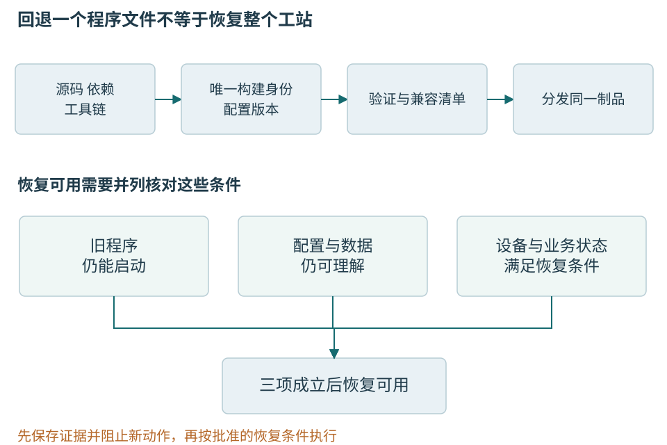

# 第九章 工程协作与可恢复交付

可以在开发机启动的程序，还需要变成别人能够安装、识别、诊断和恢复的一份交付。温度工站同时涉及应用、Qt与运行库、设备驱动、节点固件、测试计划和限值。只记一个“软件版本1.0”，往往不足以重建当时行为。

协作让变更得到复核，版本让证据找到对象，恢复让失败有可走的路径。本章从Git中的工作与提交关系，走到依赖、配置、诊断包和发布回退；不展开云平台运维。本轮没有执行Git恢复、提交、推送、软件部署或设备升级，文中的命令只是未执行教学材料。

## 一 先让修改有可理解的历史

### Git历史是快照关系而不是文件名清单

Git 的提交记录一个项目快照及其父提交等元数据，分支是指向提交的可移动引用。日常操作经常显示差异，但理解历史时要记得：一条提交不只是聊天式的“修改说明”，它还处在一个明确的祖先关系中。

工作区保存正在编辑的文件，暂存区表示下一次提交准备记录的内容，当前提交提供已有快照。三者可以不同。只看编辑器里的文件，不一定知道将要提交什么；只看提交差异，也可能漏掉未跟踪文件。提交前应检查暂存内容与工作区剩余差异，避免把本地调试配置、生成物或秘密混进去。

一个有意义的提交应尽量包含一个可解释的逻辑变化。它不一定只有几行，但应能说明目的、前提、行为变化与验证方式。把格式化、依赖升级和行为重构塞进同一巨大提交，会让评审、二分和回退同时变难。过碎而无法独立理解的提交也有成本，关键是保存有用的因果边界。[1]

### Merge与Rebase保存不同的历史关系

**Merge** 将不同历史合并。若一条分支只是另一条的后代，可能直接快进引用；若双方都有独立提交，则通常产生保留多个父关系的合并提交。**Rebase** 把一组提交的变化重新应用到新的基线，形成新的提交身份。两者都需要处理语义冲突，不能靠历史图形判断最终代码正确。 

在个人尚未共享的工作中，rebase 可以整理基线与提交结构；对于别人已基于其继续工作的共享历史，改写会影响协作者的引用和后续合并。是否允许重写、怎样协调与恢复，应遵守团队明确规则。不能因为工具允许强制推送，就把它当作普通同步手段。

文本冲突只是 Git 无法自动合并某些位置的提示。没有冲突也可能错误：一方把参数单位从秒改成毫秒，另一方新增调用却仍传秒；一方改变返回值语义，另一方把旧语义写进条件。合并后需要针对组合结果重新验证，而不只是相信两个分支分别测试通过。[2]

### 恢复操作先区分要恢复哪一层

**Restore** 主要用于把文件内容恢复到指定来源，**reset** 可以移动引用并按模式影响暂存区与工作区，**revert** 通过新提交抵消既有提交的变化。它们不是同义的“撤销”。选择前应明确：要丢弃未提交编辑、调整暂存、移动本地分支，还是在共享历史中公开撤回某个变更。  

```bash
# Git 只读检查示意，未执行；前提：位于已授权检查的仓库。
# 这些命令用于判断当前状态，不包含恢复或推送动作。
git status --short
git diff
git diff --cached
git log --oneline --decorate -n 12
git reflog -n 12
```

这里不列一个可以随手复制的破坏性恢复序列，因为正确动作取决于工作区与共享状态。尤其是会覆盖工作区或清理未跟踪文件的操作，应先保留所需材料并获得相应授权。把“我只是修复 Git”当作删除工作成果的理由，是协作事故而不是技术能力。

Revert 保留原历史与撤回记录，常适合共享分支，但它只抵消代码层变化。已经执行的数据库迁移、外部消息和用户数据不会自动倒流。回退合并提交还涉及选择相对于哪个父提交解释变化，影响后续再次合并；必须理解历史，不能把一个数字参数当作通用答案。[3]

### 恢复线索需要真正保存过内容

reflog记录本地引用移动，有助于找到变基或重置前的提交，但有保留期与清理条件，也不是天然同步到远程的永久审计。未保存、未暂存、未提交的编辑，Git未必曾经拥有，不能承诺一切都能找回。正式发布与重要工作仍需要受控存储和备份。[4]

短期功能分支便于评审，维护分支可支持仍在现场的旧固件或离线客户。哪种策略适合，要看集成频率与支持范围。分支长期分离，即使没有文本冲突，也会积累接口、配置和测试语义的距离。合并应该检验新组合，而不是把两条分支的绿色结果相加。

### 单位变化展示了文本之外的冲突

假设甲把内部接口统一为temperature_mC，并修改已有调用；乙基于旧接口新加显示模块，仍把输入当作摄氏度。两边修改位置不同，Git可以自动合并，程序也可能编译通过，温度却出现千倍差异。没有冲突标记，不表示契约没有冲突。

评审应先确认共同单位、输入边界和转换责任，再检查新增调用与历史路径。若回退甲的接口却保留乙后来按mC修正的部分，组合又可能再次错误。回退单位有时跨越多个提交，要恢复的是完整行为，而不是机械逆转某个文件差异。

历史的价值在于让这些关系可找。提交说明写明“内部统一mC、显示边界转换、协议version不变”，比“整理代码”更有帮助。测试覆盖正负、零和带小数的摄氏度显示，并将判据连回接口说明，才有机会把语义冲突提前发现。

## 二 评审和文档保存共同判断

### 评审首先建立共同理解

代码评审不是寻找尽可能多的格式问题，也不是让作者证明自己没有失误。它让另一位有责任的工程师理解变化是否满足需求、保持契约，并能由团队长期维护。自动格式与静态检查可以先处理机械问题，把人的注意力留给语义、风险和设计。

作者应提供足够上下文：为什么改、影响哪些接口、哪些选择被放弃、如何验证、哪些部分未验证，以及怎样发布或回退。评审者不应被迫从几百行差异反推需求。对于较大变更，可以先评审设计与迁移路径，再评审实现细节，减少方向错误后的返工。

有效评论应指出可检验的问题及后果，例如“失败路径仍发布了部分配置，违反旧值不变保证”，而不只是“这样不好”。纯偏好可以明确标为建议；阻断项则应说明对应契约或风险。把风格喜好伪装成正确性要求，会降低团队对真正风险的注意。
### 评审要看到差异之外的边界

一个补丁只改两行，也可能改变整个系统的错误语义。评审应跟踪调用者、数据生命周期、并发访问、配置和测试；涉及安全或持久数据时，还要看信任边界与迁移路径。小差异不等于低风险，大差异也可能只是机械生成，需要按内容分配关注。

测试变化必须与实现一起审查。作者修复失败时，究竟修了代码，还是删掉断言、扩大超时、接受新的错误输出？若需求确实改变，应该有对应说明；若只是让门禁变绿，则验证证据已经被削弱。第八章的独立判据在评审中需要由人守住。

对生成代码和第三方更新，人工不一定逐行审查全部字节，但应检查来源、生成输入、版本差异、配置和可重复生成关系。不能把“自动生成，请忽略”变成任意逻辑进入产品的通道。大体量内容需要不同审查策略，而不是没有审查。
### 文档记录稳定契约与操作知识

代码能说明当前实现，却不总能说明为什么这么做、哪些行为是承诺、哪些异常可恢复。接口文档应解释前后置条件、所有权、错误、线程安全和版本；运行手册应解释如何识别状态、恢复服务、验证结果及操作风险；入门文档应帮助新成员建立正确构建与测试环境。

文档越接近相关变更并纳入同一评审，越容易保持一致。若接口改了而说明没有变，使用者可能按过时契约调用；若恢复命令只存在个人聊天中，值班人员也无法可靠执行。不是所有知识都适合塞进 README，应按使用场景安排位置并链接到权威来源。

注释最有价值的是解释非显然约束。重复代码“将i加一”通常帮助不大，说明“这里不能提前释放，因为完成事件仍可能到达”则保存关键推理。注释中的承诺也会过期，涉及实现变更时应同步检查，不能把旧注释当作永远正确的规范。
评审的范围还包括硬件与工艺假设。改了UART速率，就要看节点、适配器与工站是否共同支持；改了限值，应提供批准的计划来源与版本，不能凭几个已有样本调整到通过。软件代码正确与工艺规则正确是不同责任。

较大的决定可用一份短记录保存背景、候选、选择、代价和重新考虑的条件。例如先采用进程内适配器，是因为只有一种受控SDK且需要较简单部署；未来若SDK不可信或频繁崩溃，则重新评估进程隔离。不必为每个变量名写文档，值得保存的是后来无法仅从代码看出的约束。

## 三 一份制品背后有完整依赖组合

### 依赖版本是一张图而不是一串名字

温度工站直接使用组件A和组件B，A 又使用 C，B 也使用 C。两个上游可能提出不同约束，最终解析到哪个 C，取决于包管理器规则、注册表内容、版本约束与覆盖设置。只在 README 写“A 版本 1”并不能说明最终图，更不能解释某天重新构建为何选中了新传递依赖。

**清单**描述希望使用什么；**解析结果**说明这次实际选择什么；**锁定机制**尽量把该选择保存下来；**缓存**保存已获取或已构建的材料。四者用途不同。缓存命中不证明内容可信，清单稳定也不证明解析结果稳定，锁文件存在则不代表工具链、系统包和所有下载内容都被它覆盖。

Conan 2 的锁文件用于约束依赖图中的配方版本与修订等信息；包二进制的选择还由设置、选项和包 ID 模型参与。vcpkg 的 manifest mode 用清单描述工程依赖，其版本选择涉及 baseline、最低版本约束与 overrides 等机制。两套系统不应被概括成同一种“锁文件语义”。[5]

### Debug Release和运行时选择要贯穿依赖闭包

同一库的调试构建可能启用迭代器检查、不同分配器诊断或额外字段。某些环境允许在限定条件下混用，某些接口则不允许。工程不能仅凭文件后缀猜配置，更不能在找不到调试库时悄悄回退到发布库而不说明风险。

静态与动态运行时链接也不是简单的体积选择。内存、文件句柄包装、区域设置、错误状态及异常支持可能跨越模块边界。若一个模块分配、另一个模块释放，需要有受支持的共同约定；不具备时，应把释放操作送回拥有资源的组件。

一个合理的二进制包矩阵先由产品支持范围决定，而不是把所有选项做笛卡尔积。可以明确只支持某几种架构、运行时和编译模式，要求超出范围的消费者从源码构建或采用稳定边界。支持范围越宽，构建存储和验证责任越大，应把成本说清楚。[6]

### 固定版本的范围要讲清楚

工站发布记录应包括源提交、编译器和标准库、Qt精确版本及模块、平台SDK、架构、构建类型、第三方SDK和补丁。固件还需芯片/板修订、启动文件、链接脚本、HAL与RTOS。配置包再记录协议、计划、限值和校准兼容范围。各项不必用同一个版本号，但必须能找到相互关系。

锁文件约束它所管理的依赖图，不自动固定操作系统头文件、编译器、环境变量或本地补丁。下载缓存也不是来源证明：缓存今天命中，只说明找到一份材料，不说明另一台机器取得的是同一份，也不说明许可证与安全审查完整。

更新依赖应说明直接和传递组件、补丁、API/ABI及行为变化。解析库可能改变输入接受范围，SDK可能改变取消完成语义。升级后能编译是第一层，历史报文、错误路径、关闭与部署仍要验证。紧急修复可以缩短等待，却不能把未运行项标成通过。

### 可重复流程与逐字节可复现需要分开承诺

“别人按说明也能构建”是重要起点，但**可复现构建**通常要求在定义的输入与环境条件下得到逐字节相同的指定产物。是否比较未经签名的二进制、压缩包或最终安装器，应事先说明；不能在结果不同后临时挑一部分相同文件宣布成功。Reproducible Builds 项目提供了这一概念的明确定义。

非确定性可能来自时间戳、绝对路径、文件枚举顺序、随机种子、区域设置、时区、压缩元数据、并发生成顺序和工具版本。相同源码与锁文件只是输入的一部分。容器镜像若只用可变标签选择，基础系统内容也可能随时间变化；即使固定镜像摘要，外部下载与宿主能力仍可能影响结果。

`SOURCE_DATE_EPOCH` 是让支持它的工具使用约定时间来源的机制之一，不是一个让所有软件立刻确定化的魔法变量。需要确认哪些工具遵守它、时间含义是什么、哪些输出仍含其他动态信息。路径归一化、稳定排序和受控归档参数也要按具体工具核验。

签名与时间戳服务常会给最终分发物引入不同字节。可以把确定构建的有效载荷与后续签名封装分开验证，记录两层摘要及关系。这样既能证明源码到程序的可复现性，也能保留发行身份。把签名文件随意去掉再比较，若未事先定义范围，就不足以证明完整交付流程可信。[7]

独立重建比同一目录反复命中缓存更能发现隐藏输入。若两个制品摘要不同，应区分调试路径、时间戳、归档元数据与机器码变化，再决定哪一种属于预先定义的允许差异。不能在比较失败后临时挑相同文件宣布“完全可复现”。本轮没有进行可复现构建实验。

## 四 配置也是运行版本的一部分

### 把程序参数与工艺内容分开

串口入口、记录目录、界面语言属于应用运行配置；采样数量、稳定条件、允许区间属于测试计划与限值；节点校准参数又属于设备测量关系。这些内容的修改者、验证和恢复后果不同。把它们全放进一个随手编辑的ini文件，会使普通维护操作无意改变质量判据。

加载配置要先确认版本和完整性，再在候选对象中检查字段、范围与相互关系，最后按明确边界替换。生产尝试开始时冻结对应版本，途中发现新文件也不随意切换。文件正在写入、目录权限不足或格式未知，应有可区分错误，不用默认值掩盖问题。

相同二进制配不同限值可以产生不同PASS/FAIL。因此正式结果要保存实际plan_version和limit_version，不能只存“当前计划名称”。配置更正也不应覆盖历史记录，必要时追加复核说明并关联原结果。第七章的候选提交负责内存一致，第十四章再处理可靠记录。

### 参数恢复不等于设备状态恢复

把旧配置复制回来，并不能证明节点已经重新采用旧校准系数。写入命令可能在断开前完成，也可能未完成，必须通过设备支持的版本或读回证据核对。工站配置、节点非易失性参数和质量记录是三个对象，需要各自的身份与恢复条件。

若新版本配置经过不可逆迁移，旧程序可能不再能读取。更新前应保留被授权范围内的旧材料和迁移记录，明确新写入开始后还能否回退。默认“旧程序总能读新配置”与默认“删掉配置会自动生成正确值”都不可靠。

## 五 诊断包让下一位维护者能够继续

一个最小诊断包可以包含应用与固件身份、配置版本、设备身份及会话代际、问题发生时间与时区、相关错误类别、有限日志窗口、必要报文摘要、崩溃材料索引和复现步骤。它不需要无差别复制整个磁盘，也不应把所有原始测量与客户信息自动上传。

内容要足以区分事实和解释。例如“generation=12关闭之后仍接到旧完成”是事件关系；“怀疑SDK没有完成取消”是解释；“拟在指定测试机延迟完成观察”是下一步。应同时记录已排除项和反证条件，接手者才不必重走所有弯路。

转储可能含凭据、会话内容和业务数据，原始报文也可能包含工件序列号。收集、留存、分享与删减各有权限边界。先按最小必要范围提取，并保留受控原件；脱敏后确认仍能重现或支持判断，不能把结构破坏后的样本当作原始证据。给供应商提供诊断包前，应确认允许的数据、接收方与目的。

日志本身需要容量与故障策略。正常运行按事件记录，异常风暴可限速并累计计数；磁盘满时不能继续宣称结果已可靠保存。诊断级别临时提高要有结束条件，避免长期记录大量原始内容或影响采集时序。

## 六 发布要使用已经验证的那份字节

### 持续集成要让组合错误尽早出现

**持续集成**强调频繁把变化整合到共同基线，并快速验证组合结果。仅安装一个每晚跑任务的服务器，不自动实现这种工作方式。若各分支长期隔离，最后仍会一次性承担大量集成风险。

**持续交付**通常指让软件保持可按需发布的状态；**持续部署**进一步自动将符合条件的变更部署到目标环境。不同组织可能对术语有约定差异，应先说明审批与实际部署边界。自动化可以执行检查和推广，但发布权限与风险接受仍需明确。

流水线应记录它验证的是哪一个提交、哪套依赖与配置、什么制品。测试后又从可变分支重新构建一个包，再把它当作已测产物，会切断证据链。较稳健的方式是构建一次，按身份保存并在后续环境推广同一制品，环境差异通过受控配置注入。
### 制品是发布的基本单位

**制品**可以是可执行文件、库、容器镜像、安装包或固件。它应有不可混淆的身份、摘要、来源和验证记录。同一个版本标签指向不同字节，会让用户反馈、缓存、符号和回滚都产生歧义。

制品仓库应区分候选、已发布和撤回状态，不应悄悄覆盖已发布内容。若发现错误，可以发布新身份并记录替代关系，或按流程撤回有问题版本。撤回也不意味着已下载或已安装的副本自动消失，仍需面向实际部署范围处理。

配置同样属于运行版本的一部分。相同二进制配上不同功能开关、限额、证书或依赖地址，行为可能完全不同。审计记录应能说明哪个制品与哪版配置在什么时间作用于哪些实例。秘密值本身不应进入普通日志，但秘密版本或引用身份可以受控记录。
### 版本号表达兼容承诺 不是正确性证书

Semantic Versioning 2.0.0 以公开 API 为前提，用主、次、补丁版本表达不兼容变化、向后兼容功能与修复等关系。它是一项需要团队遵守的约定，不能靠三个数字自动保证兼容，也不能替代测试。

对 C++ 库，源代码兼容、二进制兼容和行为兼容可能不同。为函数新增一个带默认值的形参，可能让普通旧调用仍能重新编译，却会改变函数签名，不能据此宣称保留 ABI；改变错误类型或时间复杂度也可能影响使用者。版本策略应说明公开 API 包括什么，哪些配置组合受支持，以及弃用周期如何安排。

服务端接口、数据格式、客户端应用和部署制品可以拥有不同版本轴。把它们硬塞成一个数字，有时会造成无意义的同步升级；完全不关联又让排障困难。可以分别管理，并通过发布记录说明兼容组合。本章后文用记录格式说明这种分离。[8]

### 把支持范围写成可检查清单

| 交付对象 | 应能确定的身份 | 关键使用条件 | 相应证据 |
| --- | --- | --- | --- |
| 工站程序 | 构建与制品摘要 | OS 架构 Qt SDK | 构建与真实启动记录 |
| 节点固件 | 镜像与板卡适用范围 | 芯片 启动 存储布局 | 指定板上验证 |
| 计划与限值 | 不可变版本与内容 | 产品型号 测量条件 | 校验及批准依据 |
| 恢复材料 | 旧制品与配置身份 | 新旧读写兼容方向 | 恢复验证记录 |

这份表是交付责任，不是本书已经取得的结果。某项没有证据就标未验证，并说明影响。Windows主线与Linux目标不能共用一句“跨平台已测”；特定USB驱动、权限、字体DPI和插件仍需要各自部署验证，第十五章具体展开。



图09-1 发布和恢复都依赖身份。切换旧程序只是恢复路径中的一步，数据、配置与设备不能被遗漏。

## 七 回退前先画出已经改变了什么

### 回滚必须包含数据与协议的方向

应用代码可以切回旧版本，数据却可能已经被新版本重写。若旧程序不能理解新字段或新含义，回滚反而扩大故障。发布前应明确哪些步骤可逆，哪些需要前向修复、补偿或数据恢复，不能把“有旧镜像”当作完整回滚方案。

一种常见迁移思路是先扩展兼容能力，再迁移使用者和数据，最后收缩旧接口。新增字段先允许旧读者忽略，新写入保持旧路径可理解，等所有消费者升级并验证后才删除旧结构。具体实现仍取决于数据一致性和业务语义，不能把双写当作自动正确的万能阶段。

回滚触发条件应提前定义，执行者需要知道怎样识别完成。恢复部署以后还要观察错误率、积压、数据一致性和依赖状态；控制台显示旧版本已启动，只证明部署动作到达某阶段。若恢复失败，应有后续升级路径和责任人，而不是反复执行同一按钮。


### 温度记录新增来源状态之后怎样退回

假设旧记录只有temperature_mC，新记录增加measurement_status，允许温度字段仅作诊断而不能判定。若旧程序忽略新状态并继续将所有数值当有效温度，即使字段仍可读取，回退也会改变业务含义。不能因为“只是加可选字段”就认为安全。

可在过渡阶段先升级读者，让它认识已知状态并对未知状态拒绝判定；随后再让写者生成新语义。若仍需支持旧读者，则输出给它的记录必须满足旧承诺，无法满足时不能强行转换。新旧表示同时存在时，要明确权威来源与一致更新方式，双写本身不保证一致。

回退窗口由写入行为决定。新版本尚未产生旧版不能理解的状态时，旧制品和配置可能足够；一旦产生，就要保留兼容读取能力、前向修复或受控恢复方案。删除旧字段与迁移旧数据之前，还要检查离线工站、历史报告工具和定期任务，不能仅看在线主程序。

备份存在也不证明能恢复。需要知道备份身份、完整性、适用软件、所需密钥和恢复权限，并在授权隔离环境中检查真实数据关系。恢复旧备份可能丢失之后的合法结果，不能为解决一个界面错误就未经判断覆盖整个质量记录。

### 灰度的边界应与风险一致

先在有限测试工站部署，观察采集、停止、记录、外部提交和资源，再决定扩大，有助于发现真实环境差异。但一台工站如果连接共享数据库并写入不兼容格式，也可能影响其他旧工站。小比例安装不自动等于小影响，需要核对共享数据与设备。[9]

暂停或回退条件应提前写清：新版本出现身份错配、正式记录缺失、停止无法确认等高后果问题，不能仅凭平均速度提升继续扩大。恢复后要观察关键路径与积压是否回到预期，不能以“安装器返回0”代表业务恢复。

## 八 来源 完整性与许可分别核对

SBOM是软件物料清单，用来说明组件、版本和关系。它应绑定实际制品；源码清单可能漏掉打包加入的运行库，二进制扫描又可能无法还原准确补丁。两类证据可以互补，单独有SBOM并不能证明没有漏洞。[10]

摘要检查内容是否改变，签名需要进一步核对可信发布身份，来源记录说明怎样构建，测试说明在什么条件下观察到什么。它们回答不同问题。从同一不可信位置下载程序和一份哈希，不能仅凭两者匹配就建立可信来源；可信签名也不证明业务逻辑没有缺陷。

依赖、字体、图标和厂商SDK可能有不同许可与分发条件。工程应保存实际版本、许可原文、修改和分发形态，并把所需通知带入交付包。具体法律与合规判断由有资格人员依据实际材料完成，不能把“免费”“开源”或“动态链接”当作无条件许可。这里不对任何未审阅依赖作可商用结论。

构建与发布脚本也是受信任执行路径。它们可能读取源码、运行安装脚本并取得发布权限；外部贡献验证不应自动获得同样秘密。第三方脚本来源、固定身份、最小权限与缓存隔离都属于交付责任，不能因任务名叫test就信任其中全部行为。[11]

## 九 一次恢复失败怎样定位

设更新后工站启动正常，却无法读取昨天的结果；维护者退回旧程序，今天新写入的结果又显示错误状态。需要收集两个制品身份、两版数据格式、配置版本、迁移记录和实际文件，而不是继续来回切换软件。

可能的原因是新读者不兼容旧格式，也可能是迁移只完成一部分、配置指向另一个目录，或旧程序误读新状态。先取一条旧记录与一条新记录，分别核对字段、单位、必需状态和版本，再用只读受控工具验证每个读者的接受行为。不要在调查时让程序自动再次迁移唯一副本。

若确定新增状态已改变旧字段可用条件，单纯回退二进制不可行。应由负责方选择兼容读取补丁、前向修复或有损范围明确的数据恢复，保留原始材料。恢复验收要覆盖旧记录、新记录、未完成迁移、配置定位以及不重复外部提交；同一attempt_id和submission_id的去向需可核对。

这个教学案例没有执行实际迁移。它说明发布事故的根因可能在兼容承诺，而不在某一条安装命令。安全恢复依赖事前保留的身份、清单与证据，事后不能靠更果断地重复按钮补齐。

## 十 面试追问以可恢复的交付收尾

**有Git为什么还需要保留发布制品**

Git主要保存版本化输入，重建还受依赖、工具和环境影响。现场二进制与符号必须准确匹配，不能以“同一标签重编译”替代当时那份字节。制品、源提交、符号和配置共同支撑追溯。

**revert是不是安全的通用回滚**

它在历史中增加抵消代码变化的提交，不自动恢复数据库、配置、设备参数或外部效果。先明确想恢复的契约和当前数据，再判断代码撤回是否足够。共享历史保留撤回记录有价值，却不能替代运行恢复。

**锁文件和固定Qt版本是否就能复现**

还要明确编译器、标准库、SDK、系统材料、构建选项和生成步骤。可重复流程与逐字节相同是不同承诺。锁文件覆盖范围由工具决定，不是万能的环境快照。

**为什么新版本只加字段也可能不能回退**

新字段可能改变旧字段的解释，例如测量状态决定温度能否判定。旧程序忽略它仍能解析，却不再正确。兼容应比较读写方向、数据和行为，不能只比较字段数量。

**怎样判断交付完成**

使用者能安装并识别准确版本，关键承诺有相应环境证据，问题能留下诊断材料，恢复路径与不支持范围清楚。没有验证的硬件或平台明确列出，不将文档完备写成实测通过。交付是别人可以接手的能力，而不只是作者机器上的一次成功。

## 资料与核验范围

核验日期2026年10月6日。Git命令、发布流程和迁移均为未执行教学解释；本轮未修改任何仓库历史、构建管线或设备状态。许可段只解释应收集的事实，不作具体法律结论。

1. Git [git-status](https://git-scm.com/docs/git-status)与[git-diff](https://git-scm.com/docs/git-diff)：工作区与暂存观察
2. Git [merge](https://git-scm.com/docs/git-merge)与[rebase](https://git-scm.com/docs/git-rebase)：历史关系
3. Git [restore](https://git-scm.com/docs/git-restore)、[reset](https://git-scm.com/docs/git-reset)、[revert](https://git-scm.com/docs/git-revert)：恢复范围
4. Git [reflog](https://git-scm.com/docs/git-reflog)：本地引用记录与过期
5. Conan [锁文件](https://docs.conan.io/2/tutorial/versioning/lockfiles.html)；vcpkg [版本选择](https://learn.microsoft.com/en-us/vcpkg/users/versioning)
6. Microsoft [二进制兼容](https://learn.microsoft.com/en-us/cpp/porting/binary-compat-2015-2017)：工具集和运行时限制
7. Reproducible Builds [定义](https://reproducible-builds.org/docs/definition/)与[时间来源](https://reproducible-builds.org/docs/source-date-epoch/)
8. [Semantic Versioning 2.0.0](https://semver.org/)：版本语义依赖明确公开接口
9. Google SRE [Canarying Releases](https://sre.google/workbook/canarying-releases/)：有限推广与观察条件，本文转用于工站需另验风险
10. SPDX [概述](https://spdx.dev/learn/overview/)：组件和相关信息，不提供无漏洞保证
11. GitHub [工作流安全使用](https://docs.github.com/en/actions/reference/security/secure-use)：权限与第三方执行边界
