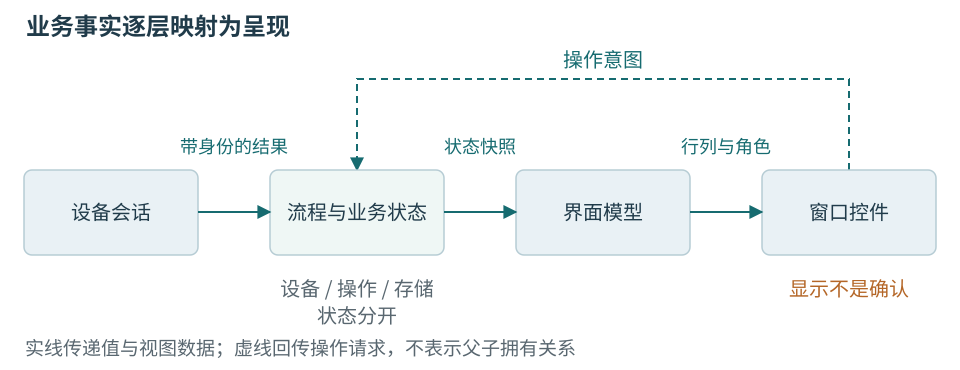
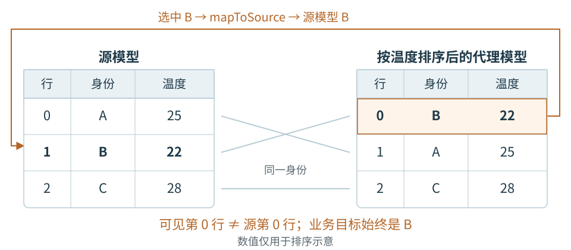

# 第十章 Qt应用结构与界面模型

上位机界面负责把设备和流程变成操作员能够理解、能够正确操作的信息。Qt 是用于构建这类应用的框架：它提供窗口、按钮、表格、事件、网络和设备访问等基础设施。框架可以告诉程序“按钮被点击了”，却不会知道这一次点击是否允许开始校准，也不会替程序证明屏幕上的绿色结果已经保存。把这些责任安排清楚，是学习 Qt 应用结构的起点。

本章选择 Qt Widgets。Widget 是桌面控件，既可以是按钮、文本框，也可以是容纳其他控件的窗口。温度监测节点的教学工站需要设备列表、参数表、趋势和明确的操作状态，Widgets 足以承载这些需求。Qt Quick 与 QML 更适合某些动画、触摸和声明式界面场景，但它们不会改变业务身份、生命周期和结果确认的责任；本书不同时建立第二套界面实现。

所有代码是 Qt 6.8 API 范围内的教学片段，省略处不是已经完成的工程。Windows 是主讲目标，Linux 是第二验证目标，二者都没有在本轮编译和运行。数字、设备名和画面均为说明机制而设，不是某台工站的实测记录。后台线程的创建和安全关闭在第十一章完整展开，本章先把界面能够稳定依赖的数据结构建立起来。

## 10.1 从窗口到业务事实

### 控件显示信息 业务对象解释信息

先想一块温度面板：上方选择设备，中间显示当前温度，下方列出测量记录，右侧有连接、开始和停止按钮。最直接的写法是把串口、解析缓冲、当前工件和全部判定都塞进窗口类；收到温度后设置标签，点击开始就给端口写字节。这样的程序容易演示，却会让“窗口正在看哪一件”与“设备实际正在处理哪一件”成为同一个可变变量。

这两个问题有不同答案。窗口可以随时切到历史记录，设备会话却仍在接收当前节点的数据；操作员可以修改下一次测试的参数，正在执行的尝试却应使用开始时冻结的参数。关闭一个设置对话框也不应删除尚未留档的测量。业务事实需要独立于当前可见控件存在。

**业务模型**保存对工作有意义的事实，例如设备身份、当前尝试、步骤状态和判定依据。**界面模型**把这些事实转换成当前画面需要的组织形式，例如表格的行列、中文状态文字和哪些操作可以请求。**视图**负责显示与交互。三者可以共享少量值类型，但职责不同；一个 QAbstractTableModel 也未必就是全部业务模型。

本章的只读采集面板采用四个角色。DeviceSession 代表设备会话，负责得到已验证的采样结果；StationState 保存当前设备、会话和操作状态；SampleTableModel 将可显示的记录变为行列；StationWindow 将按钮意图交给控制器，并显示状态快照。它们是教学设计名称，并非 Qt 预先实现的工业类。

| 角色 | 接收什么 | 对外承诺什么 |
| --- | --- | --- |
| 设备会话 | 字节、超时与设备事件 | 带身份的消息或明确错误 |
| 流程与业务状态 | 操作意图、消息与存储回执 | 当前允许状态及业务结果 |
| 界面模型 | 被接纳的快照与记录 | 行列、角色与变化通知 |
| 窗口和控件 | 用户输入与界面模型 | 显示事实、提交受约束意图 |

这样拆分并不要求每一行都实现一个抽象基类。小程序可以用一个控制器对象、几个值结构和一个表格模型。判断拆分是否有价值的办法，是把窗口隐藏后，是否还能解释同一份输入应产生什么业务结果。若判断温度合格必须读取某个标签的文字，说明显示已经倒过来支配业务。



图 10-1 工站界面的事实与呈现。实线是结果流，反向虚线是操作意图。图中没有把 UI 更新画成设备动作确认；原创机制图，不是已运行系统截图。

### 相近的状态也要分别表达

“已连接”至少可能指端口已打开、传输链路建立、设备身份通过握手，或当前会话可以接收业务命令。它们不是同一事实。教学面板使用 Closed、Opening、Identifying、Ready、Recovering 等连接状态；运行流程另有 Idle、Running、Stopping、Finished 等状态。实际项目可以简化名称，但应保留必要区别。

显示状态又不同：用户可能暂停曲线滚动，后台记录仍继续；用户看历史数据时，设备可能断线。屏幕应同时呈现“当前查看的记录”和“实际连接状态”，避免历史曲线上最后一个值被误看成此刻读数。不能为了让状态栏简洁，就用一个 connected 布尔值承载所有事实。

控件是否可用由状态推导。例如连接成功但身份尚未确认时，可以允许“断开”，不能允许“写入校准”；正在停止时，可以查看已有数据，不应再提交新的开始请求。禁用按钮只减少误操作，控制器入口仍要校验状态，因为快捷键、脚本入口、重复信号和迟到事件同样能发起请求。

这里的设备 ready 也不是安全许可。普通桌面程序和普通设备通信不能代替独立的安全控制。共同案例限于受控低压温度节点，不包含危险运动；如果以后接入加热器、夹紧机构或高能设备，允许动作的条件必须由适用的硬件、控制器和风险评估决定，不能只由按钮是否可点决定。

## 10.2 QObject把身份 通知和拥有关系放在一起

### Qt对象不是普通可复制的数据包

QObject 是 Qt 对象体系的重要基类。它在普通 C++ 对象之外提供元对象、信号槽、事件和父子对象管理。元对象系统使框架能够识别某些方法、属性和类型信息。需要声明自定义信号等能力的类通常使用 Q_OBJECT，并由 moc 生成相应辅助代码；这属于构建过程，不能把宏看作能够独立工作的语言关键字。[10-1]

一个温度值适合复制，一个拥有连接、事件和子对象的控制器则有明确身份。Qt 的 QObject 不按普通值对象方式复制。把 QObject 和测量结果分开，会让代码更容易解释：控制器留在自己的位置，跨边界交付的温度、设备号和状态是独立的值。

```cpp
// C++20 / Qt 6.8 教学类型；未编译、未执行。
struct DisplaySample {
    QString device_id;
    quint64 boot_id{};
    quint64 generation{};
    quint32 sequence{};
    int temperature_mC{};
    bool valid{};
};

class StationController : public QObject {
    Q_OBJECT
public:
    explicit StationController(QObject *parent = nullptr);

signals:
    void stateChanged();
    void sampleAccepted(DisplaySample sample);
    void operationRejected(QString reason);

public slots:
    void requestStart();
    void requestStop();
};
```

device_id 表示设备身份，boot_id 区分设备重启前后，generation 区分上位机连接会话，sequence 表示该运行段中的样本序号。温度以毫摄氏度保存，25000 代表 25.000 °C。valid 在本章只表示当前样本是否可显示，不承担完整的计量有效性判定；正式工站还要保存质量原因、参考条件和数据缺口。

这段声明也不定义线上数据包。QString 是进程内对象，整数的内存布局也不是协议契约；不允许把整个结构按 sizeof 直接发给设备。第四章和第十二章分别处理字节表示与会话接纳，界面只消费已经解码的数据。

### parent确定谁负责销毁

QObject 的 parent 建立拥有关系。父对象销毁时会删除其子 QObject；对象析构也会从父对象中解除相应关系。对于由窗口创建并完全服务于该窗口的按钮、布局及显示模型，这使收尾更清楚。对象树回答“谁最终删除谁”，不回答业务数据是否已经保存。[10-2]

```cpp
// 教学片段：由同一个窗口对象管理界面子对象。
auto *table = new QTableView(this);
auto *model = new SampleTableModel(this);
table->setModel(model);
```

table->setModel(model) 表示视图使用模型，并不等价于把模型所有权交给视图。这里的释放责任来自构造时传入的 this。明确两种关系后，就不会误以为关闭任意视图必然删除共享模型，也不会因另一个视图仍在用模型而让局部对象提前析构。

父子关系要遵循正常 C++ 生命周期。不能把一个先构造的栈上子对象，后来才挂到寿命更短的栈上父对象，使父对象先析构并尝试删除它。最容易审查的界面做法，是顶层窗口按清楚的作用域管理，动态创建的子对象由 parent 统一管理；需要不同生命期的业务控制器单独拥有，不强行塞进窗口对象树。

普通成员指针不会自动成为子对象。类里写了 QTimer *timer_，只是保留地址；它是否属于当前对象，取决于创建或设置 parent 的操作。反过来，已由 parent 管理的 QObject 也不应再由一个不协调的 unique_ptr 独立删除。同一资源应只有一条清楚的最终回收路径。

QPointer 可以观察 QObject 是否已经销毁，适合某些非拥有关系；它不是共享所有者，也不是跨线程访问许可。对于本章同一 GUI 线程中的短调用，观察窗口是否仍存在有实际价值；跨线程存在“检查后被销毁”的交错时，还要用正确的消息与生命周期协议，不能只检查非空。

### 对象树 连接图和业务依赖图不是同一张图

一个按钮可以向控制器发出信号，而控制器不必是按钮的 parent；一个窗口可以显示数据库结果，而数据库连接不应因此成为其随意访问的子对象。把所有关系都画成“包含”，会隐藏谁拥有、谁观察、谁调用和谁等待的区别。

审阅一个界面对象时，可先问最终由谁销毁，再问它在哪个线程使用，最后问外部是否仍可能投递事件。前两项相同也不能省掉第三项。第十一章会建立工作对象和线程对象的独立生命周期；本章先保持所有窗口、表格模型和控制器的界面部分在 GUI 线程中。

## 10.3 信号槽和事件循环怎样让界面前进

### 一个点击怎样变成业务请求

信号表示事件发生，槽是接收调用的函数。使用函数指针式 connect，编译器能够检查较多签名关系。下面把“点击开始”连接到控制器的请求入口，而没有直接连接到串口写入。

```cpp
// 窗口、按钮、控制器在 GUI 线程；未编译、未执行。
connect(startButton, &QPushButton::clicked,
        controller, &StationController::requestStart);

connect(controller, &StationController::operationRejected,
        this, [this](const QString &reason) {
    statusLabel->setText(reason);
});
```

第二个连接显式提供 this 作为 lambda 的上下文。这帮助框架把连接与窗口寿命及执行上下文关联；但 lambda 捕获的其他对象仍需各自证明可用。上下文窗口存活，不代表它捕获的局部引用或另一个裸指针也存活。[10-3]

信号不自动创建线程。直接连接在当前调用中执行槽；排队连接保存一次调用，等待接收线程的事件循环处理；自动连接在发射时根据当前执行线程与接收对象归属作选择。在同一 GUI 线程中，按钮槽通常直接执行，因此耗时工作会立即影响界面响应。[10-4]

`emit` 是表达发信号意图的写法，不是“异步”的同义词。理解这一点才能判断一个槽是否会重入。控制器发出 stateChanged 后，直接连接的视图更新可能在发射语句返回前完成；如果视图更新又引发其他信号，控制器也可能被再次调用。先建立一致状态再通知，比先通知、最后才补齐状态更可靠。

### 事件循环需要处理函数及时返回

QApplication 通常在 main 中建立，窗口 show 后进入 app.exec。事件循环分派输入、绘制、定时器和排队调用；它能够继续工作的条件，是当前处理函数没有无限占据线程。把等待串口、读大文件或数据库重试放进按钮槽，界面就无法及时重绘和处理停止意图。[10-5]

```cpp
// 程序入口骨架；省略构建配置与完整窗口实现。
int main(int argc, char *argv[])
{
    QApplication app(argc, argv);
    StationWindow window;
    window.show();
    return app.exec();
}
```

这个骨架只展示谁维持主事件循环，不证明程序能够连接设备。需要包含头文件、设置正确的 Qt 模块、启用元对象构建，并提供窗口实现。应用名、配置目录、异常处理和退出协调也需要在完整工程中补齐；没有这些条件，不能把短骨架当作发行版。

“每隔一段时间调用 processEvents”通常不是解除阻塞的好办法。它会在一个尚未完成的操作中重新分派事件，可能再次进入开始、停止或关闭逻辑。程序不再只是顺序执行一个长函数，而是长函数暂停时有其他业务访问其半成品状态。把工作切成状态转换，或者交给有明确结果交付的后台执行者，更容易证明正确性。

模态对话框也可能带来嵌套事件处理。假设程序读取当前设备 A，打开确认对话框，期间设备断开又连接 B，确认返回后若只读取“当前端口”，就可能把对 A 的意图用在 B 上。确认时应绑定设备身份和 generation，执行前再次验证这份上下文，而不是把一个 yes 当作所有未来状态下都有效的许可。

定时器负责安排“以后再获得一次执行机会”，不保证绝对准点，也不替代设备采样时钟。若 GUI 槽阻塞，定时通知会受影响。界面刷新 100 ms、设备采样 10 ms 是两个不同预算；前者可以合并，后者是否允许丢失由采集与记录契约决定。

## 10.4 用Model/View表达测量表格

### 行列位置和记录身份要分开

Qt 的 Model/View 把数据访问与显示分开：模型给出行数、列数及各位置的数据，视图负责布局和选择，delegate 负责单元格绘制与编辑等细节。QTableView 本身不要求每个单元格都是一个长期存在的控件，这比为大量记录逐个创建 QLabel 更便于控制成本。[10-6]

一个 QModelIndex 描述模型中的位置，通常包括行、列和所属模型等信息。它不是数据库主键。排序以后，第三行可以变成另一条记录；删除或重置以后，保存的普通索引可能失效。长期业务操作应使用稳定 ID，在需要时重新定位，而不是把 row() 当成永远不变的身份。

本章在有限显示窗口内用 device_id、boot_id、sequence 关联一次样本；generation 还表明哪一次连接接纳了它。这个组合不是永久唯一标识，因为sequence可能在同一次boot_id中回绕。长期存储和服务器去重还需有约束的保留/迟到窗口，或设备协议提供的扩展采样身份，不能用主机generation代替跨重连身份。若设备允许序号回卷，必须由协议规定顺序比较与有效窗口，不能在界面中简单认为较大整数一定更新。正式尝试中的样本还要绑定 attempt_id；本章只做连续观察，不提前伪造完整质量记录。

**角色**回答“同一单元格要提供哪一方面的数据”。DisplayRole 可给出格式化文本，UserRole 以后可以提供原始整数或业务 ID，ToolTipRole 可解释质量和时间，TextAlignmentRole 可给出对齐方式。视图显示 25.000 °C，并不意味着模型必须把“25.000 °C”字符串作为唯一保存值。

把原始数值和格式分开还有一个直接好处：按温度排序时比较整数，不会把字符串“100”排在“20”前；导出时可以使用指定格式，不必从带单位的屏幕文字中反向解析。小数点使用逗号的地区设置也不应改变线上协议和数据库的工程量含义。

### 一个只读表格模型的最小责任

下面的模型片段展示行列和角色。为了保持四列，它显示序号、温度、状态和设备；完整身份保存在记录中。该类型只服务于有限的显示窗口，不保存整班次原始数据。

```cpp
// Qt 6.8 教学片段；未编译、未执行。
class SampleTableModel : public QAbstractTableModel {
    Q_OBJECT
public:
    enum Role {
        RawValueRole = Qt::UserRole + 1,
        DeviceIdRole,
        SequenceRole
    };

    using QAbstractTableModel::QAbstractTableModel;

    int rowCount(const QModelIndex &parent = {}) const override
    {
        return parent.isValid() ? 0 : rows_.size();
    }

    int columnCount(const QModelIndex &parent = {}) const override
    {
        return parent.isValid() ? 0 : 4;
    }

    QVariant data(const QModelIndex &index,
                  int role = Qt::DisplayRole) const override;

private:
    QList<DisplaySample> rows_; // 容量由接纳入口限制
};
```

平面表格没有子表，因此 parent 有效时返回零行、零列。rowCount 的返回类型是 int，而容器大小可能是更宽的类型，完整实现应在插入入口限制容量并进行明确转换；不能等到出现数十亿行才考虑整数范围。本书显示窗口有固定上限，因此不会把不可控历史直接装入控件。

```cpp
// 接前一片段；越界、未知角色统一返回空 QVariant。
QVariant SampleTableModel::data(const QModelIndex &i,
                                int role) const
{
    if (!i.isValid() || i.model() != this)
        return {};
    if (i.row() < 0 || i.row() >= rows_.size())
        return {};
    if (i.column() < 0 || i.column() >= 4)
        return {};

    const auto &r = rows_.at(i.row());
    if (role == DeviceIdRole)
        return r.device_id;
    if (role == SequenceRole)
        return r.sequence;
    if (role == RawValueRole && i.column() == 1 && r.valid)
        return r.temperature_mC;
    if (role != Qt::DisplayRole)
        return {};

    switch (i.column()) {
    case 0: return r.sequence;
    case 1:
        return r.valid
            ? QString::number(r.temperature_mC / 1000.0, 'f', 3)
            : QStringLiteral("无有效值");
    case 2:
        return r.valid ? QStringLiteral("有效")
                       : QStringLiteral("无效");
    case 3: return r.device_id;
    default: return {};
    }
}
```

温度列标题必须含单位，例如“温度 / °C”。三位小数只是显示分辨率，不声明传感器有千分之一摄氏度准确度。无效值没有被变成零度；零度是完全可能的有效测量，拿零表示缺失会污染均值、曲线和限值判定。需要更完整的状态时，用枚举加原因，而不是继续增加含义模糊的布尔标志。

QAbstractTableModel 的基本实现包括 rowCount、columnCount、data，并通常提供 headerData；可编辑模型还需相应 flags 和 setData。模型与视图连接时，模型相关 API 要在它所属的 GUI 线程中调用，后台不能直接修改它再要求视图“自己同步”。[10-7]

### 变化通知有严格的先后关系

视图会维护选择、索引和缓存。如果后台增加了容器元素却没有按协议通知，表格可能仍认为旧行数有效。插入时要先 beginInsertRows，再改变存储，最后 endInsertRows；删除也有对应边界。数据内容变化而结构不变，则用 dataChanged 指明范围和角色。通知是模型契约，不是可有可无的刷新提示。[10-8]

```cpp
// 有界显示模型的教学入口；所有调用都在 GUI 线程。
void SampleTableModel::appendOne(DisplaySample value)
{
    constexpr int maxRows = 2000; // 教学显示预算
    if (rows_.size() == maxRows) {
        beginRemoveRows({}, 0, 0);
        rows_.removeFirst();
        endRemoveRows();
    }

    const int next = static_cast<int>(rows_.size());
    beginInsertRows({}, next, next);
    rows_.append(std::move(value));
    endInsertRows();
}
```

这段片段假定插入和相关分配能正常完成，没有提供内存耗尽时在模型通知区间内的恢复机制。正式实现可预留容量、构造好批次、限制资源，并按应用的异常政策处理失败，不能让异常穿出 Qt 分派边界。它也不是高频日志容器的最优实现；删除首项的移动成本在大列表中应评估，可用环形显示存储或批次裁剪，但映射和通知必须保持一致。

如果一次到达几十个样本，逐条 begin/end 会反复触发更新。可以先准备有界批次，一次插入一个连续区间；这减少通知开销，但不能用一个覆盖全模型的 reset 代替所有更新。reset 会使不少视图状态失去依据，用户刚选中的故障记录、滚动位置或编辑动作都可能被打断。



图 10-2 行号变化而记录身份不变。图中记录按温度排序后，原第二行移动到第一行；业务动作仍绑定记录 ID，不能绑定表面行号。

## 10.5 排序 筛选和编辑需要第二层身份检查

QSortFilterProxyModel 可以在不改动源数据的情况下，为视图提供排序和筛选。它建立代理索引与源索引的映射；操作员点击的是代理行，业务数据通常仍在源模型里。使用 mapToSource 或通过数据角色取得稳定身份，是把选择转回业务对象的必要步骤。[10-9]

```cpp
// 教学片段：当前选择来自代理模型。
const QModelIndex shown = table->currentIndex();
if (!shown.isValid())
    return;

const QModelIndex source = proxy->mapToSource(shown);
const QString device = source.data(
    SampleTableModel::DeviceIdRole).toString();
// 后续还须读取 boot_id、sequence 或完整记录身份。
// 不得用 shown.row() 直接索引源容器。
```

即使取得身份，也要在执行前核对这份记录是否仍然适合操作。用户右键某设备打开菜单，设备列表随后变化，点击菜单时必须按菜单建立时的目标解释请求。不能重新读取“当前行”，把用户对旧设备的意图变成另一个设备的写命令。对于只读详情，可以按稳定身份加载历史；对于写入，必须再次确认实时连接与权限。

**编辑**至少包含三层校验。输入层检查字符串能否解释为数值；领域层检查单位、允许范围和字段间关系；提交层检查目标身份和当前状态。QValidator 或数值控件能改善输入体验，却不知道某型号是否支持这个采样周期，也不知道一个新参数是否会使正在进行的尝试失效。

假设允许设置下一次采样周期。界面先保存一份 draft 配置，用户确认后形成请求；设备确认生效前，屏幕应显示“待设备确认”，保留旧的已生效值。若直接把文本框新值写进当前有效配置，超时以后就无法回答设备究竟使用哪一套参数。

配置版本也应与运行快照分离。正在执行的尝试拿到的是冻结的 plan_version 和参数副本，编辑器保存的是下一次可用配置。用户点击保存不应悄悄改变当前测量窗口的限值。改变重要参数后是否允许继续、重开尝试或需要特定角色批准，由流程规定，而非 setData 的返回值决定。

setData 返回成功只表示模型接纳了本次编辑，不能让视图把“请求已形成”画成“设备已执行”。可以为待确认、已确认和被拒绝分别显示状态；模型拥有的是呈现事实，业务控制器仍拥有参数提交和结果接纳。对于复杂设备，先编辑草稿再显式提交，比每改一个单元格就立即写硬件更容易控制错误。

筛选也会影响操作员对数据完整性的理解。表格只显示有效样本时，界面应说明筛选条件和被隐藏的无效条数，不能让“看不见错误”变成“没有错误”。导出当前视图和导出全部原始记录应使用不同名字，并把筛选条件写入导出说明。

## 10.6 趋势图表示时间关系而非替代原始记录

### 采样时刻 接收时刻和绘制时刻不同

一个样本可能在设备计数时间 t1 产生，经过缓存和串口后在主机 t2 接收，最后在 t3 绘制。t1、t2、t3 对应不同事件，也可能来自不同的时钟。若把所有点横坐标写成绘制时刻，GUI 卡顿后积压的样本会挤成一团，看上去像设备在那一刻突然剧烈变化。

设备单调计数适合描述同一次启动中的相对采样间隔，电脑 UTC 时间适合关联文件和外部系统，主机单调时钟适合计算本地延迟。要跨设备精确比较采样时刻，需要时间同步及误差说明，不能仅凭两个格式相同的日期字符串假定同时。本章趋势优先展示同一 boot_id 内的相对时间，跨重启处画出分段。

数据缺口应保留可见痕迹。sequence 跳跃、缓冲溢出或会话断开时，不能简单用直线把前后两个点连接，好像中间连续测量过。可以断开线段、标出缺口区域，并在提示中给出原因和范围。插值可以作为某种显示选择，但必须标明，不能输入正式判定器冒充采样值。

### 数据量与屏幕像素有不同预算

一幅宽 1000 个逻辑像素的趋势图，不能让人看清一百万个独立横向位置。将全部点在每帧重新绘制，只增加工作量，未必增加信息。教学实现可以按可视窗口聚合，每个像素桶保留最小值和最大值，让异常峰值有机会被看见；必要时再放大查看原始片段。

这种聚合也有边界。只有最小值和最大值，可能丢失桶内先后次序；若直接把 min、max 连成时间序列，会引入并不存在的锯齿。更诚实的画法是范围条，或同时保留产生极值的时间与顺序。用于测量判定的数据仍从原始记录读取，不从趋势聚合结果反推。

界面可以每 100 ms 获取一份快照，记录却可能每 10 ms 接纳一个样本。前者合并旧显示值合理，后者能否丢弃取决于方案。第十一章用单在途请求实现有界最新值显示，避免“定时刷新”仍积累无限排队消息。此处只强调：显示端不应成为唯一原始数据仓库。

### 绘制只读一份一致的显示状态

QWidget::update 安排重绘请求；框架可能合并多次请求，最终在 paintEvent 中绘制。需要立刻重画的接口并不适合无节制地在每个样本上调用。自绘控件应从已经建立的显示状态重画，不能依赖上一次留在屏幕上的像素长期存在。[10-10]

```cpp
// 自绘趋势的职责示意；未编译、未执行。
void TrendWidget::setDisplayPoints(QVector<QPointF> points)
{
    points_ = std::move(points); // GUI 线程中的有界快照
    update();
}

void TrendWidget::paintEvent(QPaintEvent *)
{
    QPainter painter(this);
    painter.fillRect(rect(), palette().base());
    drawAxes(painter);
    drawVisibleData(painter, points_);
    drawGapMarkers(painter, gaps_);
}
```

drawVisibleData 还需处理坐标变换、剪裁、非有限数值和空窗口；这些辅助函数在片段中没有实现。更新 points_ 时相关 gaps_ 也应属于同一份快照，否则曲线来自新数据、缺口标记来自旧数据，会产生不一致显示。可以封装成一个 DisplayFrame 值对象一次替换，而不是分别修改多个独立字段。

高 DPI 环境下，逻辑尺寸与物理像素不同。直接把传感样本下标乘一个固定像素宽度，会在缩放和窗口尺寸变化后失效。坐标变换应依据当前绘图区和数据范围计算，文字和单位由布局留出空间；缓存图像也需考虑设备像素比。部署章会把多屏缩放作为真实验收项目，而不是截图外观检查。

## 10.7 用可解释的快照更新整个画面

一个页面往往同时显示设备名、温度、状态、操作按钮和错误原因。如果每个控件分别响应不同信号，事件交错时可能出现“设备 B 的名字、设备 A 的温度、上一轮的完成标志”。这不一定是数据竞争；在同一个 GUI 线程中，也能形成逻辑上不一致的画面。

较容易理解的办法，是由控制器生成一次完整的 StationViewState，包含设备身份、generation、连接状态、操作状态、最新有效值和提示。窗口在一个短槽中应用它。需要多页共享时，各页可使用同一修订号；旧修订不得覆盖新修订。修订号与设备样本 sequence 不同，它标识界面状态发布次序。

```cpp
// 教学数据结构；字段仍需按完整产品约束扩展。
struct StationViewState {
    quint64 revision{};
    quint64 generation{};
    QString device_id;
    QString connectionText;
    QString operationText;
    QString temperatureText;
    QString detail;
    bool mayStart{};
    bool mayRequestStop{};
};

void StationWindow::applyState(const StationViewState &s)
{
    if (s.revision <= revision_)
        return;
    revision_ = s.revision;
    deviceLabel->setText(s.device_id);
    connectionLabel->setText(s.connectionText);
    operationLabel->setText(s.operationText);
    temperatureLabel->setText(s.temperatureText);
    statusLabel->setText(s.detail);
    startButton->setEnabled(s.mayStart);
    stopButton->setEnabled(s.mayRequestStop);
}
```

这里假定 revision 在控制器寿命内严格增加，初始值和回卷策略由实现定义。若控制器重建，需要同时更换其身份，不能沿用旧页面缓存的修订号而把新状态永久拒绝。完整实现还要避免设置控件时反向触发新的编辑提交，可使用区分用户编辑与程序更新的信号，或在适当范围使用 QSignalBlocker，但不能把阻断所有通知当作常规掩盖手段。

窗口文案要承认未知。例如断开后保留最后一个温度时，应标注“最后有效值，接收于……，当前已断开”；写参数超时，应显示“设备结果未确认”，而非“未写入”；结果已判合格但尚未落盘，应显示“满足限值，等待留档”。第十四章会把这些维度建成正式记录，本章先避免把它们压成一个红绿灯。

颜色可以帮助扫描，却不应是唯一语义。文字、图标形状和可访问名称应共同表达状态。错误信息需要持续存在于可查位置；每次刷新覆盖状态栏，会让操作员尚未读完就失去处置依据。高频数值也不必每次都触发屏幕阅读器播报，应让用户能够选择关注的状态变化。

报警确认同样不是消除原因。用户确认“我看到了温度失效提示”，不代表参考条件已恢复，更不代表本次数据可以重新参与判定。界面可以消除闪烁或记录确认时间，但业务有效性必须由新的证据更新。这条区别在 PLC 告警和 MES 处置中也成立。

## 10.8 从显示异常追到模型契约

### 排序以后操作了另一台设备

设列表同时显示节点 A 和 B，按温度排序。用户选择可见第一行，点击“查看详情”，程序却打开了另一台设备。首先需要知道选择来自哪个模型、排序何时发生、代码怎样从行号取得记录，不能只凭“偶发”就归因于线程。

可区分三个假设：数据源给错身份，代理排序后的行号被当成源行号，或菜单打开到执行之间目标发生变化。保留选择时的代理索引、映射后的身份和实际查询身份，便能区分。若可见行是 B，而代码直接用 row() 访问源容器得到 A，责任就在索引映射，不在设备协议。

修复应把操作目标固定为稳定身份，并在动作执行前检查当前会话。查看历史可接受设备已经离线，写参数则必须验证同一 device_id 与 generation。验收应在选择后立即改变排序、筛选、删除其他行以及让设备断开；应证明操作仍指向明确目标，或者因目标失效被拒绝。

面试追问：“换成 QPersistentModelIndex 就够了吗？”它可以在模型正确维护的某些结构变化中保持索引关系，但不能替代业务身份，也不能使已删除记录继续存在；reset 和目标切换仍需处理。设备命令更不能把一个 GUI 索引序列化成长期请求 ID。应分别解决视图位置和业务目标两个问题。

### 表格越跑越慢 但串口并不忙

需要观察样本接收率、模型行数、每次通知范围、GUI 排队延迟和绘制耗时。可能是原始数据全部保存在表格、每个样本重置全模型，也可能是代理每次变化都对全部历史重新排序。增加采集线程不会自动减少这些界面工作。

假设输入每秒 100 条，八小时累积 288 万条，若每条只按 100 字节估算也已接近 288 MB，尚未计入字符串、容器、索引和事件开销。这是规模演算，不是 Qt 的实测内存指标。界面应该使用有界窗口，历史查询分页，正式记录独立持久化。否则长时间运行只是把未定义的容量预算推迟暴露。

修复后应检查用户能否发现显示窗口只保留最近一段，以及完整记录是否仍可查询。把行数限制为 2000 如果同时删除唯一原始记录，虽然内存下降，却破坏了数据责任。验收不仅看帧率，还要比对输入、记录与显示三条路径各自的完整性策略。

面试追问：“直接每秒 reset 一次是不是最简单？”短小只读数据集可能可以接受，但需要承认选择、滚动和编辑状态被重建。对于操作员正在追查的一条异常，频繁 reset 会破坏工作。应根据真正变化选择范围通知、批次插入或受控刷新，而不是把视觉上更新了当作模型协议正确。

### 按钮已禁用 仍然开始了第二次采集

禁用按钮发生在第一条请求返回后，两个点击事件可能已经到达；也可能存在重复 connect，使一次点击调用控制器两次。检查连接建立时机、requestStart 入口状态和 attempt 创建点，能够区别两类原因。只在槽末尾 setEnabled(false) 不会撤销已经提交的请求。

控制器应在接纳第一次开始时立即改变状态，再发出通知或调用外部对象；第二次请求根据同一状态被拒绝或合并。连接应在对象生命周期中只建立一次，不能每次显示页面都新增相同 lambda 连接。Qt 的 UniqueConnection 也不能替 lambda 普遍去重，连接句柄和明确的创建位置更值得审查。

面试追问：“界面线程只有一个，为何还有这种竞争？”因为多个事件可以顺序到达，却都依据尚未及时更新的业务事实行动；直接连接还可能在一次调用尚未结束时重入。串行执行排除了某些内存并发，不自动建立业务上的唯一接纳点。先更新一致状态，再通知外部，是这里的关键。

## 本章资料与验证边界

[10-1] Qt，[The Meta-Object System](https://doc.qt.io/qt-6.8/metaobjects.html) 与 [moc](https://doc.qt.io/qt-6.8/moc.html)。元对象构建责任；2026-10-06 核对。

[10-2] Qt，[QObject](https://doc.qt.io/qt-6.8/qobject.html) 与 [Object Trees and Ownership](https://doc.qt.io/qt-6.8/objecttrees.html)。parent、不可复制身份和对象树边界。

[10-3] Qt，[Signals and Slots](https://doc.qt.io/qt-6.8/signalsandslots.html)。连接、上下文与应用端生命周期。

[10-4] Qt，[Threads and QObjects](https://doc.qt.io/qt-6.8/threads-qobject.html)。连接类型与线程归属；完整后台回收以第十一章的 Qt 6.8.3 静态核对为准。

[10-5] Qt，[QApplication](https://doc.qt.io/qt-6.8/qapplication.html)。GUI 应用对象和主事件循环。

[10-6] Qt，[Model/View Programming](https://doc.qt.io/qt-6.8/model-view-programming.html)。模型、视图、delegate、索引和角色。

[10-7] Qt，[QAbstractTableModel](https://doc.qt.io/qt-6.8/qabstracttablemodel.html)。最小接口与模型线程约束。

[10-8] Qt，[QAbstractItemModel](https://doc.qt.io/qt-6.8/qabstractitemmodel.html)。插入、删除、重置和数据变化通知。

[10-9] Qt，[QSortFilterProxyModel](https://doc.qt.io/qt-6.8/qsortfilterproxymodel.html)。代理与源索引映射。

[10-10] Qt，[QWidget::update](https://doc.qt.io/qt-6.8/qwidget.html#update)。重绘调度；绘图聚合算法是本章教学设计。

[10-11] Qt，[QAbstractItemModelTester](https://doc.qt.io/qt-6.8/qabstractitemmodeltester.html)。可用于检查一部分模型不变量；它不能证明测量、设备身份或业务判定正确。

在线 Qt 6.8 维护页面在核对时部分显示 6.8.9，不将该标记写成已经部署 Qt 6.8.9，也不引入高于 6.8 的新 API。正文完成了机制和资料核对；没有执行 moc、编译、模型测试器、压力回放、跨平台 GUI 或真实设备测试。正式工程还需补齐完整类声明、头文件、异常边界和有界存储，并用上述故障条件验证。图、计算和代码共同解释一种实现方法，均不能冒充已经通过验收的软件。
