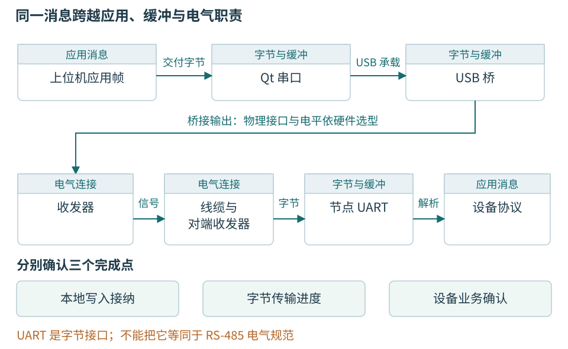
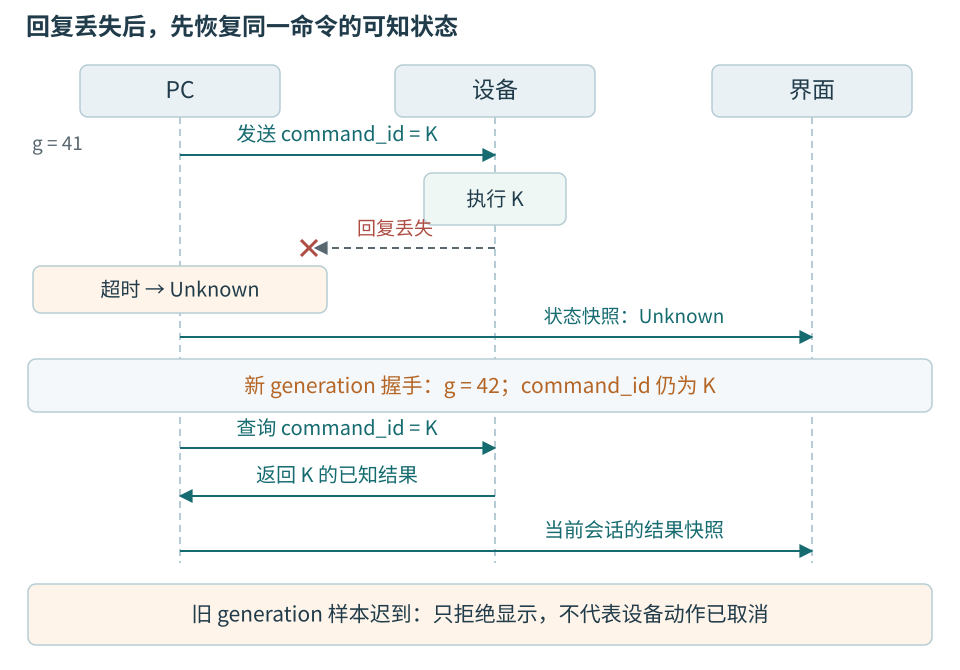

# 第十二章 串口 网络与设备会话

设备通信把电脑里的对象连接到一个独立运行的世界。温度节点可以在电脑忙于绘图时继续采样，可以在串口仍存在时重新启动，也可能已经接受写入命令却没有把回复送回来。因此，通信程序不能只回答“有没有读到字节”，还要回答字节来自谁、属于哪次运行、表达什么消息，以及当前流程是否应该接纳。

串口和网络提供的能力不同，最终都需要一层设备会话。**会话**是应用对一次已经识别、协商并受状态约束的交互关系的描述，不等于操作系统中一个仍然打开的句柄。本章沿受控低压温度节点建立这层关系：先认识接口的物理条件，再接入 Qt 字节流，最后处理身份、期限、重连和未知结果。

代码使用 Qt 6.8 API，全部是未编译、未执行的教学片段。线路格式与第四章相同，不另造一套“串口专用结构体”。没有连接真实串口、CAN、USB 或网络设备，也没有测得任何吞吐和超时数字。真实设备的电气连接、驱动安装和命令授权必须在实际实施前另行确认。

## 12.1 同一个插头后面可能是完全不同的接口

### UART描述字符的传输方式

**UART** 是通用异步收发器。它通常按照约定的波特率、数据位、校验位和停止位，把字节转换成串行电平变化。所谓异步，是收发双方不通过一条共同的位时钟线同步每一位，而靠起始位和约定速率识别字符；这与软件中的异步 IO 不是同一个概念。

例如常见的 8N1 表示八个数据位、无奇偶校验、一个停止位。加上起始位，一个字节一般占十个位时间。在理想连续发送、忽略帧间空隙和其他开销的教学演算中，115200 bit/s 对应约 11520 字节每秒，而不是 115200 字节每秒。真实吞吐还受设备处理、USB 桥接缓存、驱动调度和协议开销影响。

UART 外设引脚通常是相对于电路地的逻辑电平信号。芯片支持的电压和输入阈值取决于具体器件，不能从“UART”三个字推出一定是 3.3 V，更不能认为任何 5 V 适配器都可接。一个标着 TX 的针脚也要先确认是“本端发出”还是厂商按对端连接方式标注，不能仅凭标签习惯接线。

RS-232 和 RS-485 则描述另一层电气接口。RS-232 使用与普通逻辑 UART 不同的电气信号条件；RS-485 常用差分线对并支持适当拓扑下的多点连接。UART 字节可以经过对应收发器在线路上传输，但逻辑引脚、RS-232 端口和 RS-485 端口不能直接混接。电气标准、字符格式和应用协议是三件事。[12-1]

### RS-485还需要方向 拓扑和总线访问约定

两线半双工 RS-485 常由收发器在发送与接收之间切换。同一时刻谁允许驱动总线，如何控制发送使能，最后一个字节真正离开移位寄存器后何时释放线路，都需要设备和适配器支持。仅收到“数据已放入软件缓冲”的通知，不足以据此立即切换电气方向。

终端匹配用于抑制特定线路条件下的反射，偏置用于形成规定的空闲状态，它们的作用不同。应依据拓扑、线缆和收发器资料决定位置与参数，不能给每个节点都随意加终端电阻。差分传输也不是“不需要考虑地和共模范围”；隔离、参考关系和保护由硬件设计确定。[12-1]

本书不提供面向未知工业端口的通用接线口诀。低压教学节点也必须先断电核对供电方向、电平、地参考、引脚和适配器能力，再按板卡资料连接。需要示波器观察时还要遵守第十六章的探头参考与仪器限制。发现端口资料不完整，应停在识别环节，而不是通过试插和软件重试寻找“能通”的组合。


图 12-1 USB 转 UART 适配器实物。作者 Sunmist，2016-08-31，[原始文件与作者声明](https://commons.wikimedia.org/wiki/File:UART_to_USB_adapter.jpg)，[CC0 1.0](https://creativecommons.org/publicdomain/zero/1.0/)。采用已有来源图，未把照片作为本书实验记录；外观不能证明针脚定义、目标电压、隔离或供电能力。

照片一端是插入电脑的 USB 插头，电脑通过 USB 协议与桥接芯片交换数据。另一端是连接目标电路的线缆和小连接器，目标侧输出何种电气信号需要查具体适配器资料。桥接电路把两侧不同的通信机制连接起来，并不把未知目标的全部接口差异自动处理好。

线色只是这件产品的装配信息，不是跨厂商通用标准。即使两件适配器外形相同，目标侧也可能有不同的供电脚、电平选择或握手线。Windows 出现 COM 端口，只说明相应驱动暴露了一种串行访问入口，不能据此证明已经连接了温度节点，更不能证明可以安全供电。

### 数据路径应画出每层缓冲

电脑中的应用先把消息交给 Qt，Qt 和系统驱动可能缓冲字节，USB 桥可能再批量交付，节点 UART 最后接收字节。每层都可能产生延迟和容量限制。“应用一次写了一个完整帧”不意味着线路或接收回调也以同样大小分批。



图 12-2 消息、电气接口与完成层次。图中依次区分本地写入接纳、字节传输进度和设备业务确认；原创机制示意，不表示所有适配器具有相同内部结构。

## 12.2 枚举端口以后 仍要识别设备

QSerialPortInfo 可列出系统可见串口及可取得的描述、制造商、序列号、供应商或产品标识等信息。这些字段是否存在和是否唯一取决于设备与平台，不能假定每个适配器都提供可信唯一序列号。[12-2]

COM7、/dev/ttyUSB0 是访问位置，device_id 是产品身份。更换 USB 插孔、重装驱动、接入多个相同桥接器，可能改变访问位置。即使通过操作系统规则创建了稳定名称，它通常仍标识某个适配器或物理连接位置，而不必标识适配器另一端的工件。

界面应展示足够信息让用户区分候选端口，并允许查看握手后确认的设备型号、电子身份和固件版本。不要为了“自动识别”向所有串口广播写配置或复位命令。经过批准的只读识别查询也应限定协议和目标范围；不认识的设备保持未识别状态。

下面的枚举只准备显示条目，没有打开端口或发送命令。

```cpp
// Qt 6.8 教学片段；未编译、未执行。
struct PortCandidate {
    QString system_location;
    QString label;
    QString adapter_serial;
};

QList<PortCandidate> enumeratePorts()
{
    QList<PortCandidate> result;
    for (const auto &p : QSerialPortInfo::availablePorts()) {
        result.append({p.systemLocation(), p.description(),
                       p.serialNumber()});
    }
    return result;
}
```

真实应用不能将 result 的数组下标保存为长期设备选择。下一次枚举顺序可能变化，设备也可能在选择后、打开前被拔出。打开失败是正常需要处理的结果，应保留原始系统错误并给出“端口不存在”“被其他程序占用”“权限不足”等能够区分的解释，而不是全部提示“检查波特率”。

设备识别过程可以先读取协议版本和能力，再校验型号、device_id、boot_id、固件和当前配置。能力表示设备支持什么操作，不表示当前用户有权执行。若固件不支持结果查询，工站就必须公开这种恢复限制，不能靠主机自己生成 command_id 假装设备已经具备去重功能。

boot_id 必须按产品规定具有足够区分能力。只把上电后计数器从零开始而不给出运行身份，主机无法辨别“序号回到零”究竟是复位、新设备还是字段解析错误。一个真实实现可以采用持久启动计数或具有合适冲突概率的随机启动标识，但持久写入寿命、随机源和异常行为都需要固件设计；本书不把某一种方法冒充通用硬件保证。

## 12.3 QSerialPort提供字节访问 不提供设备协议

### 先配置 再打开 再进入识别

QSerialPort 提供读写和错误通知，也提供阻塞等待接口。本书主线使用事件驱动方式，串口对象在其所属线程中使用，相关槽每次做有限工作并返回。异步串口可以在 GUI 线程使用，只要工作确实足够短；当会话、解析或处理需要独立隔离时，采用第十一章的工作对象模式。[12-3]

```cpp
// 在串口对象所属线程执行；未编译、未执行。
bool Session::openPort(const QString &location)
{
    port_->setPortName(location);
    const bool configured =
        port_->setBaudRate(QSerialPort::Baud115200) &&
        port_->setDataBits(QSerialPort::Data8) &&
        port_->setParity(QSerialPort::NoParity) &&
        port_->setStopBits(QSerialPort::OneStop) &&
        port_->setFlowControl(QSerialPort::NoFlowControl);
    if (!configured)
        return failOpen(port_->errorString());

    port_->setReadBufferSize(4096); // 教学预算，非推荐默认值
    if (!port_->open(QIODevice::ReadWrite))
        return failOpen(port_->errorString());

    state_ = State::Identifying;
    beginIdentityExchange(); // 教学接口，需补齐实现
    return true;
}
```

这里的参数必须与节点约定一致，4096 只是解释有限缓存的示例。设备不支持硬件流控时，不能只在电脑设置 HardwareControl 就期待它降低发送速率；软件流控还可能占用特定字节值，与二进制协议的转义规则发生关系。通信参数是双方契约，不能把设置成功等同于对端支持。

打开串口可能影响 DTR、RTS 等控制线，某些板卡把这些线连接到复位或下载电路。因此“只是打开端口”也可能改变目标状态；资料核对和设备身份重读仍然必要。本书不假定所有串口适配器都具有相同行为，也不自动切换控制线探测未知目标。

readyRead 只说明有新数据可读。一次 readAll 可能得到半帧，也可能得到多帧。errorOccurred 的 NoError 不应被当作故障终态；真正的错误则应按会话状态处理，避免同一个拔除事件触发多条相互冲突的关闭路径。第十一章已给出统一停止入口，本章不重新建立另一套线程回收代码。

### 写入进度不能冒充设置已生效

QIODevice 的 write 返回本次接纳的字节数量，错误时可能返回负值。一般 IO 包装要处理部分接纳与剩余数据，保留发送缓冲的所有权；QSerialPort 的内部写缓存和 bytesWritten 通知仍不是对端业务确认。[12-3][12-4]

```cpp
// 只展示本地发送偏移管理；未编译、未执行。
void Session::pumpWrite()
{
    if (state_ != State::Ready || tx_.isEmpty())
        return;
    auto &head = tx_.front();
    const qint64 left = head.bytes.size() - head.offset;
    const qint64 n = port_->write(
        head.bytes.constData() + head.offset, left);
    if (n < 0) {
        onTransportError(port_->errorString());
        return;
    }
    head.offset += n;
    if (head.offset == head.bytes.size())
        tx_.pop_front(); // 仅结束本地待提交缓冲责任
}
```

片段中的 tx_ 只表示尚未被 Qt 接纳的字节，不能同时兼作“等待设备确认的命令表”。完整实现还需限制 Qt 内部 bytesToWrite 与 tx_ 的总字节预算、安排 n 为零或部分写入后的继续机会，并避免在错误后重新发送已接纳前缀。等待命令确认的记录仍要独立保留 command_id、期限和内容摘要。

flush 只尝试推进缓冲写出，不是一条“设备已经应用”的屏障。waitForBytesWritten 也不是远端业务完成通知，放在 GUI 槽中仍可能阻塞界面。设置成功应由设备协议回应，必要时还要回读实际配置。仅看到 bytesToWrite 归零，最多能解释本地发送进度，不能解释校准参数是否已经进入非易失存储。

若应用关闭端口，后续未传出的字节可能被取消，但已经到达设备的字节无法收回。更危险的是半条命令留在设备解析器里，重新连接后剩余或新字节被错误拼接。协议需要明确重同步、帧边界和会话重新识别规则，不能把“清空主机缓冲”当作双方状态都已复原。

## 12.4 将字节流变成有界的消息流

### 统一帧格式与输入边界

共同案例的数据帧使用两个同步字节 A5 5A，随后是 version、type、两字节小端 payload_length、四字节小端 sequence、payload 和两字节小端 CRC。固定开销为十二字节，负载最多六十四字节。version 为 1、type 为 01 的温度帧负载恰好四字节，表示有符号 32 位小端 temperature_mC。

CRC 使用全书约定的 CRC-16/CCITT-FALSE 参数，覆盖 version 到 payload 的全部字节，不含同步字节和 CRC 自身。CRC 能帮助发现某些传输错误，不提供身份认证或防恶意篡改保证。device_id、boot_id 由已完成的识别会话绑定；generation 由主机分配，不在这条温度帧里。若设备在连接中重启，会话必须失效并重新识别，不能继续把新帧套在旧 boot_id 上。这要求设备提供可核对的重启通知、运行身份查询或等价会话保证；基础温度帧本身没有这些能力。仅观察sequence归零不能可靠证明或排除重启，缺少相应证据时只能降低接纳保证，不应把基础帧直接用于正式质量判定。

帧内容与解析算法的逐字节说明在第四章；本章新增的责任是如何把解析器嵌入持续运行的 IO。每层都要限制容量：驱动缓冲不是无限的，Qt 读缓存不是业务队列，应用解析暂存也不能因长度字段而无限增长。声称“最大帧长六十四字节”还要区分负载与总帧长，本例总帧长最多七十六字节。

下面仅给出调度外壳，不复制第四章解析器。feed 接收字节并执行有界扫描，takeFrame 在现有缓冲中取出一帧，needsWork 表示还有内部可处理内容。它们的错误策略、CRC 及长度验证由既定解析器实现。

```cpp
// 教学接口示意；Parser定义与错误处理需按第四章补齐。
void Session::onReadyRead()
{
    if (!acceptsInput())
        return;
    constexpr qint64 readBudget = 1024;
    const QByteArray bytes = port_->read(readBudget);
    if (!parser_.feed(bytes)) {
        failSession(QStringLiteral("接收缓冲超限"));
        return;
    }
    drainParsedFrames();
    if (port_->bytesAvailable() > 0 || parser_.needsWork())
        scheduleOneContinuation();
}
```

scheduleOneContinuation 必须保证最多一个继续任务已排队，而不是每个字节都再排一次。内部缓冲还有完整帧时，即使不再有新字节到达，也应继续解析；仅等下一个 readyRead 可能让剩余帧永久滞留。每轮字节预算和帧数预算也要配合，避免某一轮不停处理垃圾输入，挤掉停止和超时事件。

### 半帧期限和请求期限不能混用

半帧超时回答一帧是否在允许时间内拼齐；请求超时回答一个业务请求是否在期限内得到结果；空闲超时回答会话是否长时间没有有效通信。三者可同时存在。收到一个无关字节可以影响半帧接收状态，却不能无限延长写校准的业务截止时间。

串口速率给出最短传输时间的估算，但不能据此规定严格的最大回调间隔。USB 桥和操作系统可能批量交付，GUI 或后台线程也可能暂时调度不到。若协议依赖严格的字符间隔，必须明确计时观察在哪一层可用；不能用用户态 readyRead 到达时间假装每个 UART 字节的精确线上时间。

同步恢复还要有策略。长度非法时可以按既定规则丢弃部分前缀并继续寻找同步；CRC 失败时也不能直接信任负载中看起来像命令的内容。持续错误应累计错误计数，达到会话策略条件后停止接纳并报告，而不是无限丢字节、让用户看到一条偶尔更新但没有完整性说明的曲线。

解析完成之后仍需语义校验。版本不支持、类型不认识、温度负载长度不是四、样本序号属于已结束窗口，都不能因 CRC 正确而接纳。CRC 证明不了温度来自正确传感器，也证明不了设备使用正确校准版本。字节有效、会话有效、业务有效是逐层增加的条件。

## 12.5 TCP UDP和安全通道各提供什么

### TCP保持字节顺序 不保存写调用边界

TCP 向应用提供有序字节流。一次发送一百字节、再发送两百字节，对端可能分三次读到，也可能一次读到三百字节。所谓“粘包”通常是应用误把写调用当成消息边界，不是 TCP 把消息弄坏。串口解析器中对半帧、多帧和长度上限的要求，在 TCP 上仍然成立。[12-5]

QTcpSocket 提供异步连接、读取和错误通知。连接 established 后还要进行设备协议识别；connected 信号不等于用户认证通过、设备型号正确或所有功能可用。连接断开也不代表先前发送的命令没发生。TCP 保证的传输顺序不跨越新建连接变成业务上的“只执行一次”。[12-6]

网络延迟可能来自本地排队、名字解析、连接建立、握手、远端执行和返回处理。日志应保存阶段，而不是统一记为“网络慢”。温度节点若经过网关，主机连接到的是网关端点，网关还可能缓存设备值；界面应区分“网关在线”和“节点数据新鲜”。

IP 地址是位置，不是足够的设备身份。动态地址、代理和替换设备都可能让同一地址对应不同对象。TLS 可以在正确配置下保护通道并认证相应对端，但它不替应用决定哪个用户可以写哪一台节点，也不赋予命令幂等性。证书验证失败应报告并修复信任或身份问题，不能把关闭校验作为正常重连方案。[12-7]

### UDP保存数据报边界 但不补齐丢失历史

UDP 让应用接收数据报，保留这一级消息边界；它不提供 TCP 那样的可靠有序字节流。数据报可能丢失、重复或乱序，接收缓冲和应用容量仍有限。QUdpSocket 可用 pendingDatagramSize、receiveDatagram 等接口处理数据报，应用仍需限制允许尺寸并检查读取结果。[12-8]

UDP 适合某些允许最新值覆盖的遥测或设备发现，但不意味着任何温度采集都可随意丢样。若测试方案依赖连续窗口中的全部样本，应用要设计缺口检测、补传或失效规则。给每包加 sequence 只能发现部分缺口，不能自动恢复内容；发到对方端口也不等于对方已经保存。

网络发现与正式控制应分开。收到广播回复后可展示候选，正式会话仍要验证身份、能力和权限。多个节点同时回复会形成突发，发现频率、回应退避和列表去重也应有预算。不要把来自局域网的一条自报名称当作可信设备身份，更不能根据它立即写固件。

对于固定低速、点对点的教学温度节点，串口足以解释主体机制。网络只是另一种传输适配，不能通过一个共同接口抹掉 TCP 字节流和 UDP 数据报的差异。好的 Adapter 保留上层真正需要的错误和完成语义，而不是把所有失败压成一个 false。

## 12.6 会话身份把重连与重做分开

### 三种序号属于三种不同事实

sequence 表示设备样本的序号，generation 表示主机连接的代际，command_id 表示一次业务命令的稳定意图。设备重启还需要 boot_id。它们可以同时出现，因为各自回答不同问题：哪个样本、哪次连接、哪个动作、哪次设备运行。

主机断线重连时推进 generation，即使仍然连接同一设备。已经排队的旧代快照到达 GUI 时应被拒绝，不影响新代的显示请求额度。设备 boot_id 若改变，则需要重新确认配置和未完成命令；不能只清零主机样本计数，就把设备运行连续性补造出来。

command_id 则不能随着重连自动改变。一次写校准在旧连接上超时，新连接首先询问同一命令发生了什么。新分配 command_id 通常意味着新的业务意图，设备可能合理地再次执行。能生成 ID 和能在设备端持久去重是两回事，必须通过协议共同实现。



图 12-3 连接更新与命令身份连续性。旧样本可以因显示代际失效而被丢弃；仍有业务意义的命令结果则需要进入恢复记录。两者不能共用“旧消息一律丢掉”的策略。

### 状态机决定哪些消息现在有意义

一个只读会话可以按 Closed→Opening→Identifying→Ready 推进，失联后进入 Recovering 或 Closed。准备关闭时先停止接纳新的业务请求，再结束本地 IO。哪些状态允许处理温度帧，哪些允许读取身份，哪些只接受终态，应该在入口显式表达。

```cpp
// 教学状态与接纳逻辑；不是完整会话实现。
bool Session::mayAccept(const DecodedTemperature &m) const
{
    if (state_ != State::Ready)
        return false;
    if (!identityConfirmed_ || !measurementWindowOpen_)
        return false;
    return sampleOrder_.canAccept(m.sequence);
}

void Controller::onSample(SessionSample sample)
{
    if (sample.generation != currentGeneration_)
        return;
    if (sample.device_id != expectedDevice_)
        return;
    publishToDisplay(std::move(sample));
}
```

sampleOrder_ 需要依据协议处理首帧、重复、缺口和回卷，不是一个已经实现的黑箱保证。measurementWindowOpen_ 也只是接纳条件的一部分；正式工站还需核对 attempt_id、步骤、质量、校准版本和完整性。将这些条件放在控制器而非标签槽里，才能避免页面切换改变测量判定。

迟到命令结果与迟到显示结果应分流。一个已结束页面不需要旧温度快照，但校准写入的终态可能对工件恢复至关重要。它应按 command_id 存档或进入对账流程，再决定当前页面是否显示。只检查 generation 并把所有旧消息直接丢弃，会保护画面却毁掉业务证据。

### 重连先恢复认识 再恢复工作

自动重连应先退避，避免设备掉线后高速占用端口或网络。成功打开后重新读取身份与能力，校验设备是否更换、boot_id 是否变化，再处理在途动作。不应把旧发送队列原封不动重放到新连接；队列里可能含有已经执行过的写入，也可能针对刚被换走的工件。

如果产品只提供 Start 位而没有 command_id、结果查询或可确认的最终状态，主机无法仅靠日志恢复“动作到底发生几次”。应停止自动副作用并要求受控核查。把超时延长可以减少某些误判，却不会填补丢失的业务证据；把串口换成 TCP 也不会自动解决。

重连还有配置污染风险。串口参数看起来相同，设备可能已回到出厂配置；网关地址没变，后端节点可能已替换。流程应重新验证所依赖的配置版本，不能只看 device_id 相同就沿用旧的温度转换参数。身份回答是哪件设备，版本回答它当前怎样工作。

## 12.7 超时 重试和取消必须保持原来的问题

**截止时间**规定本次等待到何时失去业务价值，适合用单调时钟计算本地经过时间。不同阶段可以有各自预算，但总体期限不能因为每次收到一点进度就无限刷新。时钟跨机器比较、电脑休眠和设备低功耗唤醒都要按具体环境核对，不能拿日历时间简单相减定义所有超时。

读取当前状态通常可以重试，但仍需保证请求的是正确设备和允许的新鲜度；把参数设置为同一完整值可能接近幂等，却还要考虑版本、写入磨损和附带事件；“增加一次计数”“执行一次动作”则明显不能盲目重发。可重试性来自动作契约，不来自错误码里出现 Timeout。

同 command_id、同内容的重复请求，可以由支持去重的设备返回原结果；同 command_id、不同内容必须视为冲突。只用内容哈希做命令身份也不够，因为两次完全相同参数可能是用户明确要求的两次独立操作。去重记录的保留时间还应覆盖允许的恢复窗口，设备重启后若记录丢失，就要公开保证已经变弱。[12-9]

```text
教学语义，未规定这些命令的线上编码
第一次：command_id=CAL-A0092-1，参数摘要=H1
超时后：查询 command_id=CAL-A0092-1
允许重传时：仍为 CAL-A0092-1，仍为 H1
真正获准重做：产生新 attempt_id 和新的 command_id
```

取消也有层次。“停止本机等待”可以立刻改变 UI，“停止再提交新命令”可以由控制器实现，撤销已被设备接受的写入则必须有设备支持。某些固件写入阶段不允许安全中断，界面需要说明正等待安全完成点，而不是显示一个无条件有效的取消按钮。

重试应由一层主要负责，限定总时间、次数、退避和在途数量。若串口层、设备会话和测试流程各自动尝试三次，一个业务意图可能形成远超三次的请求。恢复查询不应和新执行共享一个含义模糊的 retry()；可分别命名 queryExistingResult、resendSameCommand 和 startNewAttempt，使调用者看到责任差别。

## 12.8 USB与CAN入口如何保留设备差异

USB 是主机控制的总线体系，设备通常经枚举、驱动或设备类接口被应用访问。USB 转串口只是一条路径；其他设备可能使用标准类、厂商 SDK 或通用用户态库。接口号、端点、权限和驱动绑定各有含义，不能看到 USB 插头就用 QSerialPort 尝试打开。[12-10]

厂商 SDK 的回调可能来自内部线程，返回的缓冲可能只在回调期间有效。接入 Qt 时，应按 SDK 契约复制或转移数据，再投递给正确上下文；不能在回调中直接更新 QWidget。取消函数返回是否意味着回调全部退出，也要逐接口核对。第十一章对 QSerialPort 的收尾推理不能无条件移植到任意 SDK。

更换驱动可能影响设备其他功能或其他软件，不能作为默认排障步骤。先确认官方支持路径、应用架构、驱动版本和访问权限；接口被其他程序占用、设备拔除、SDK DLL 位数不匹配都可能表现为“连接失败”，应保存可区分的错误证据。

CAN 将节点通过总线连接，帧标识符常表达消息优先级和协议含义，并不自动等于某个唯一设备号。经典 CAN 与 CAN FD 的负载、速率等能力不同；适配器、驱动、Qt 后端和目标网络都必须支持所需模式。QCanBusDevice 提供帧和设备状态接口，但具体后端支持的配置并不一致。[12-11]

CAN 链路 ACK 说明总线上相应接收条件，不等于目标业务已经处理，更不代表某台指定设备完成了校准。上层协议仍需要节点身份、对象或命令含义、超时和结果确认。bus-off 等错误状态也不应简单自动清除后立即重放所有待发动作，需要结合网络维护规则和业务恢复流程。

监听与主动发送有不同后果。接入真实车辆或工业网络时，不能默认允许发送测试帧或改变波特率。教学可以通过离线日志或受控虚拟后端验证解析和显示，真实线路测试则需要明确授权、资料和安全条件。接口适配层的价值，是把这些差异清楚地交给会话层，而不是把它们藏进“连接成功”的单一返回值。

## 12.9 三类相似故障有不同的修复方向

### 每隔几分钟出现一次错帧

先补充现象：CRC 失败发生在哪个设备、多少字节后、哪次 boot_id；错误前是否有接收队列增长、端口错误或供电异常。候选原因包括电气干扰、参数不匹配、缓冲溢出和解析器错误。只看到乱码截图，不能确定是硬件还是软件。

可先用同一原始字节流离线回放解析器，改变分块边界而保持字节内容不变。若只改变回调分块就改变解析结果，问题在接收累积或解析状态，尚不需要更换线缆。若原始字节已经缺失，继续核对驱动错误、sequence 缺口和采集负载；若设备日志与线上观察也出现电气问题，才沿硬件链验证。每一步的观察位置必须清楚。

修复验收应覆盖每个字节位置拆分、连续多帧、同步字节跨块、非法长度、错误 CRC 和停止时的半帧。电气修复则必须在指定线缆、供电、速率和仪器条件下验证。回放通过不能证明接线可靠，换线后暂时没错也不能证明解析器正确。

面试追问：“把 readAll 换成每次固定读十六字节呢？”固定读取长度不能制造线上消息边界，数据暂时不足或多帧到达时仍需累计。正确接口是字节流进、完整消息出，并在资源和时间上有界，而不是祈求每次读到的大小正好相同。

### 写入超时后重试 设备参数变化了两次

应检查首次写入是否到达设备、回复是否丢失、重试是否换了 command_id，以及设备是否持久保存去重记录。若两个命令 ID 不同，设备执行两次可能完全符合现有协议；责任在主机把“原结果未知”变成“新请求”。若相同 ID 仍执行两次，则继续检查去重范围、重启和原子接纳。

修复不是把超时改成更长，而是建立可查询的稳定动作身份与内容约束；在无法增加设备能力的旧系统中，停止自动重发并进行受控核查。验收需要在“设备提交后、回复前”定点中断，而不仅是在请求发送前拔线。只有故意制造最危险窗口，才有机会验证恢复语义。

面试追问：“TCP 已经可靠传输，为什么还要去重？”TCP 管理当前连接中的字节；客户端重连后重新提交一次应用请求，是新的字节流。网络可靠性不定义这两个请求是否代表同一业务意图，设备应用必须参与判别。

### 能不断收到心跳 但温度数据不再更新

心跳可能由通信任务回答，采样任务却已经停止；网关也可能回应自己的在线状态，同时转发最后一个缓存值。需要核对 sample sequence、源采样时间、质量状态和设备 boot_id，而不只是最后收到任意字节的时间。

如果心跳包含采样进展计数，可以明确它证明了什么；如果只有 ping/pong，界面就应分别显示通信在线与测量陈旧。恢复动作也应针对采样链、配置或数据源，而不是无条件断开正常网络。验收应主动暂停采样而保持通信运行，确认工站不会把旧温度当作新证据。

面试追问：“只要温度没变就判断线？”不行，真实温度可以稳定不变，某些订阅也只在值变化时报告。必须依据协议承诺的采样进度、质量和健康证据判断，不能把一个不变的数值当作设备死亡的充分条件。

## 本章资料与验证边界

[12-1] Texas Instruments，[The RS-485 Design Guide](https://www.ti.com/lit/an/slla272d/slla272d.pdf)。差分接口、拓扑和终端条件；本文不替具体板卡给出接线参数。

[12-2] Qt，[QSerialPortInfo](https://doc.qt.io/qt-6.8/qserialportinfo.html)。端口枚举和可获得属性。

[12-3] Qt，[QSerialPort](https://doc.qt.io/qt-6.8/qserialport.html)。参数、缓存、读写与错误接口。

[12-4] Qt，[QIODevice](https://doc.qt.io/qt-6.8/qiodevice.html)。字节读写与完成语义。

[12-5] IETF，[RFC 9293 TCP](https://www.rfc-editor.org/rfc/rfc9293.html)。字节流和传输层边界。

[12-6] Qt，[QAbstractSocket](https://doc.qt.io/qt-6.8/qabstractsocket.html)。异步连接、缓冲与 socket 状态。

[12-7] IETF，[RFC 8446 TLS 1.3](https://www.rfc-editor.org/rfc/rfc8446.html)。通道认证与保护；业务权限、去重是应用责任。

[12-8] Qt，[QUdpSocket](https://doc.qt.io/qt-6.8/qudpsocket.html)。数据报读取；UDP机制参见 IETF [RFC 768](https://www.rfc-editor.org/rfc/rfc768.html)。

[12-9] AWS Builders Library，[Making retries safe with idempotent APIs](https://aws.amazon.com/builders-library/making-retries-safe-with-idempotent-APIs/)。稳定意图身份、重复和内容冲突；设备实现是本文另行设计。

[12-10] USB-IF，[USB 2.0 Specification](https://www.usb.org/document-library/usb-20-specification)。主机、设备和接口机制；没有声称所有设备均采用这一代速率或驱动路径。

[12-11] Qt，[QCanBusDevice](https://doc.qt.io/qt-6.8/qcanbusdevice.html) 与 [Qt CAN Bus Plugins](https://doc.qt.io/qt-6.8/qtcanbus-backends.html)。后端能力与配置限制。

资料按2026-10-06核对。全书统一帧、状态名、身份和恢复路径为教学设计，Qt 不自动提供这些保证。尚未进行串口回环、驱动安装、插拔、TCP/UDP 故障注入、CAN 总线或板上验证；示例配置和容量不能直接作为生产默认值。
