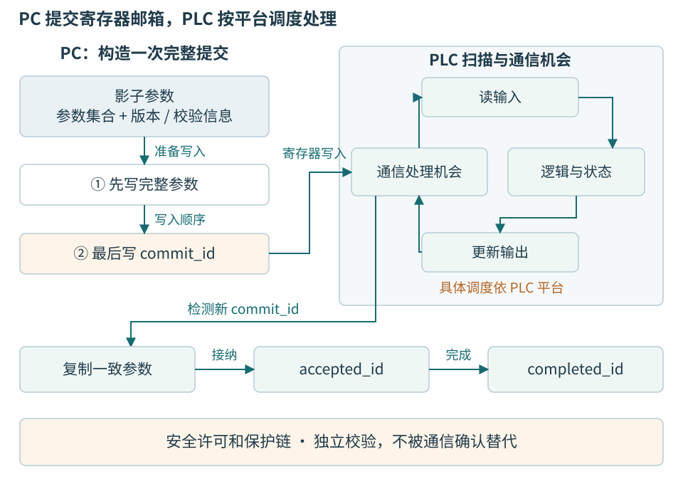
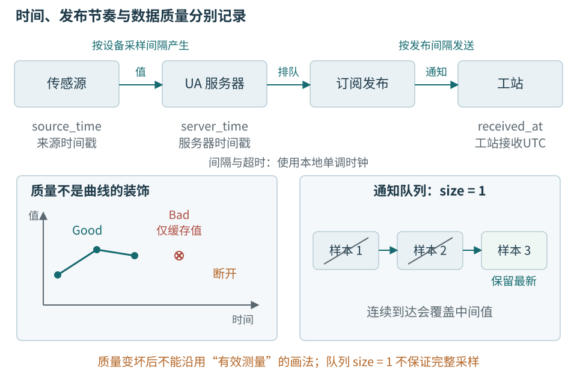

# 第十三章 PLC与工业数据交互

PLC 是可编程逻辑控制器。它通过输入模块了解开关、传感器等现场状态，通过程序执行控制逻辑，再经输出模块与现场设备交互。上位机通常承担配方、操作界面、记录和生产系统连接；PLC 更接近机器的周期控制。两者交换的不是普通页面数据，而是对现场状态和动作的共同解释。

共同案例中的温度节点可以直接接入电脑；当它进入测试工站时，还可能由 PLC 管理工位就绪、工件存在和受控的流程握手。本章只设计无危险运动的教学交互，不提供真实夹紧、加热或安全控制程序。普通 PLC、Windows 和 Qt 都不能因名称或连接方式而自动承担安全功能。

工业数据协议帮助不同程序交换位、数值和状态，但不替双方定义“这一件工件已经完成”。本章用 Modbus TCP 说明一条可理解的读写与握手链，再比较 Modbus RTU 和 OPC UA。所有地址、编号、时序和代码都是教学设计，未连接 PLC、未执行通信，也未验证任何品牌的实时性或扫描原子性。

## 13.1 PLC程序怎样观察现场

### 扫描是一种周期执行方式

常见 PLC 周期任务围绕输入、逻辑和输出反复执行。**过程映像**是控制程序使用的一份输入或输出状态表示，使程序在某个阶段能够基于相对一致的数据工作。具体什么时候更新输入、什么时候写物理输出、通信任务怎样调度，取决于 PLC 型号、任务配置及访问方式，不能把一个品牌的顺序推广成全部 PLC 的固定规则。[13-1]

例如输入模块刚检测到“工件存在”，上位机不必在同一微秒读到它。信号需要经过输入滤波、过程映像更新、PLC 逻辑处理、通信服务和主机轮询，才成为界面上的一个状态。若界面每 200 ms 更新一次，只能描述监督刷新预算，不代表输入模块或控制程序也每 200 ms 才运行。

某些系统还提供周期中断、事件任务或直接外设访问。它们使“一个扫描周期内所有值绝对不变”的简化说法失效。接口设计必须知道哪些变量由哪个任务写、通信何时可见，以及是否存在跨任务更新。PLC 程序员和上位机程序员要共同确定数据契约，而不是一方只给地址，另一方只按地址读。

周期任务也有执行预算。额外通信、复杂运算或过多诊断可能影响扫描时间，具体影响由平台调度决定。主机提高轮询频率之前，应核对控制器允许的请求率、同时连接数和数据更新周期。如果数据每 50 ms 才产生一次，主机每 1 ms 读取通常只得到重复值，却增加通信与处理负担。

### 输入 输出和业务状态不同

“工件存在”是一个现场观察，“允许开始”是控制逻辑根据多个条件形成的决定，“测试完成”是某次业务尝试的结果。把三个状态都放进同一个 Done 位，会失去因果关系。例如工件传感器正常，并不证明扫描的序列号与治具内工件一致；PLC 许可为真，也不证明参考仪器校准条件有效。

信号应保留来源和有效性。一个常闭触点断线可能与某种真实状态相同，需要相应电路和诊断设计；上位机不能仅通过软件命名把电气歧义消除。对于需要安全等级的功能，应采用适用的安全硬件、逻辑和验证，本章握手只是生产流程信息，不代替保护链。

可以将 PLC 对上位机的输出分为现场事实、业务接纳、动作结果和诊断四类。上位机请求启动时，PLC 根据当前许可决定是否接纳；接纳之后的实际执行还可能失败。上位机必须分别显示“请求已写入”“PLC 已接纳”“PLC 已完成”，而不是在写寄存器成功时立刻进入下一个测试步骤。

## 13.2 先设计握手 再选择寄存器地址

### Start和Done两位为什么不够

假设上一件工件已经完成，Done 保持为 1。电脑重启后重新连接，写 Start=1，随后读到 Done=1。单从这两个位无法判断，Done 属于上一件还是本次请求，也不知道 PLC 是否看到新的 Start。把开始信号做成一个很短的脉冲，还可能在通信、扫描与重连交错中被漏掉。

握手需要稳定的动作身份。上位机为本次意图生成 command_id，PLC 接纳时回显 accepted_id，完成时回显 completed_id 与结果；PLC 重启后还提供 boot_id。完成结果应在主机明确收到前保持可查询，避免后续请求覆盖唯一证据。

这里的 command_id 与 attempt_id 不同。一件工件的一次尝试可以包含多个步骤，每个可能有独立命令；重新连接不产生新意图，真正获准复测才增加 attempt_id。标识在双方可实现的字段宽度内编码，但不能只在主机日志里写一个长字符串，PLC 仍只执行无身份的 Start。

```text
教学握手，不是任何品牌PLC的寄存器表
PC  -> PLC  Prepare(command_id=317, attempt_id=A0092, digest=H1)
PLC -> PC   Accepted(command_id=317, boot_id=9)
PLC -> PC   Completed(command_id=317, boot_id=9, result=Ready)
PC  -> PLC  Receipt(command_id=317, boot_id=9)
```

Prepare 可以被拒绝，例如当前已有在途请求、参数版本不匹配或工件条件不满足。Accepted 说明 PLC 已按约定接管请求，不说明动作已经结束。Completed 则必须说明具体完成条件；如果只是输出位已经置位，上位机不能把它解释成“物理对象已经到位”。Receipt 表示主机已按约定接纳结果，也不能倒过来改变现场事实。



图 13-1 寄存器邮箱与 PLC 执行。扫描和通信的实际调度随平台而异，图只表示必须协调的职责。安全许可独立存在，不由一次网络写成功替代。

### 一组参数怎样被同时接纳

多个寄存器可能通过多次通信写入。若 PLC 在中间读取，就可能看到新的命令类型、旧的参数和上一次的工件标识。即使某个功能码一次写多个寄存器，是否与 PLC 任务中的读取形成原子快照，也要由具体接口实现确认，不能凭“同一个请求”推断所有观察者都同时切换。

教学设计采用影子参数区。主机先在该区域写完整内容和摘要，最后写 commit_id。PLC 只在发现新的 commit_id 且参数校验通过后，将内容复制到私有执行上下文，再发布 accepted_id。主机发布commit_id之后不得再改写该影子槽，直到收到属于同一命令的accepted_id或明确终态拒绝；超时结果未知时也不能复用槽位。PLC接纳前先完整复制，之后主机才可准备下一份内容。commit_id的发布和PLC读取需有目标平台已确认的原子性与顺序，不能让提交先于参数可见。该方案不是 Modbus 自动提供的事务。

对于读取状态，可以采用明确的奇偶版本协议：只有一个串行写者，修改数据之前先发布奇数版本表示正在更新，全部状态写好并可见以后再发布新的偶数版本。读者先读版本、再读状态、最后再读版本，只在两次相同且为偶数时接纳；否则放弃并有界重读。若写者只在修改末尾加一，前后版本相等仍可能读到半份新数据，因此不成立。版本字段的读写原子性、各次可见顺序和通信缓存行为必须由PLC实现与平台证据确认，不能由TCP有序性推导。还要限制读窗口内的最大更新次数，避免版本回绕成同值；后面示意16位版本尤其不能无条件长期复用。

更简单的目标可在 PLC 中建立一块专门供通信读取的快照区，只有完整复制后才切换可见版本。代价是增加存储和一次拷贝，但更容易说明一致性边界。不要为了避免几个寄存器，就让上位机猜测哪些位恰好来自同一扫描周期。

### 主机与PLC都可能重启

PC 重启后，应从本地记录找回在途 command_id，再读取 PLC boot_id、accepted_id 和 completed_id。若 PLC 仍保留相同命令的完成结果，主机可以恢复原尝试。若 PLC 已重启且没有持久化历史，空白状态不能证明旧动作从未发生，应进入结果未知和受控核查。

PLC 重启后也不能仅凭主机当前保留的 Start=1 再执行旧动作。启动时的命令接纳规则、已确认记录的保留和新旧代际校验必须明确。设备端若资源有限，至少应公开“重启后不保证原命令历史”的边界，让工站采取符合风险的恢复策略，而非隐藏这一限制。

握手双方的时钟不必精确同步才能比较命令身份，但超时预算仍要符合扫描和通信条件。主机“等了两秒”只证明主机没有在自身期限内取得完成证据；它不能让 PLC 取消已经进行的事情。若需要取消，必须增加有明确接受窗口和终态的取消协议。

## 13.3 Modbus把数据组织成什么

### 四类数据区与地址约定

Modbus 定义请求与响应中的功能码以及数据访问模型。常见四类数据是线圈、离散输入、保持寄存器和输入寄存器；位与十六位寄存器承担不同访问语义。设备怎样把实际变量映射到这些区，由设备接口文档规定，不能从地址猜测物理含义。[13-2]

工程文档可能把保持寄存器写成 40001 起的传统参考编号，也可能直接写协议中的零起始地址。上位机配置必须注明是哪一种编号，不能一律机械减一。地址 100 在某手册中可能已是协议地址，在另一手册中可能是人用序号。错一位仍能读到“看起来像温度”的数字，比直接报错更容易造成隐患。

十六位寄存器内的字节编码由协议规定，但跨寄存器的三十二位整数、浮点和字符串布局需要双方另行约定。一个三十二位温度可以占两个寄存器；高字在前还是低字在前、是否有符号、单位是 0.1 °C 还是 1 m°C，都不能由 Modbus 功能码推导。[13-2]

下面是教学状态表，只用于本章握手机制。协议地址全部从零计，状态区以保持寄存器方式只读给主机；即使传输层允许写，应用权限也应拒绝未授权写入。

| 协议地址 | 字段 | 教学解释 |
| --- | --- | --- |
| 100至101 | boot_id | 高十六位在前的32位运行标识 |
| 102至103 | accepted_id | 已接纳命令号 |
| 104至105 | completed_id | 已完成命令号 |
| 106 | result_code | 0未完成，1就绪，2拒绝，3错误 |
| 107 | snapshot_version | 状态快照修订 |

这张表不是全书温度节点线路帧。Modbus 寄存器属于 PLC 适配层，第四章 A5 5A 帧属于教学节点协议，两者在会话层转换成一致的业务类型。不能把 A5 5A 同步头塞进保持寄存器读响应，也不能把 Modbus 的端点地址当成节点 device_id。

### 正常响应和异常响应都要解释

读保持寄存器、读输入寄存器、写单寄存器和写多寄存器是不同功能。正常写响应只确认相应协议操作；异常响应表示该协议请求遇到错误，需保留具体异常信息。它们都不自带“整件产品合格”的含义。[13-2]

对于读请求，客户端应验证响应对应当前请求、数量和字段结构合理，再解释业务值。对于写请求，还需要等 PLC 的 accepted_id 或 completed_id。错误地址、非法值、设备忙与传输超时不是同一类问题，自动重试规则也应不同：非法地址通常要求修复配置，超时则可能需要查原命令状态。

读取到零值也不应默认理解为状态未发生。它可能是启动默认值、未映射地址、实际计数为零或旧缓存。接口版本和 valid 标志可以帮助解释，但只有双方真正维护这些字段才有效。工站连接时应先确认寄存器映射版本，再使用相应表；错误的映射版本不能靠数值范围“看起来合理”通过。

### 字序错误为什么会伪装成测量异常

设两寄存器 0x0000、0x61A8 按高字在前表示整数 25000，即 25.000 °C。若把顺序反过来，得到的数值会相差很大；若又误按 IEEE 浮点解释，可能出现非常小的量或非有限值。解析过程应有明确类型与缩放，不应在显示前试几个组合，选一个最像室温的值。

可以为字段建立独立转换函数，并用规范给定的正值、负值和边界样例核对。样例只证明某组编码解释，不证明设备实际测量准确。真实接入时还要读取已知设备状态，检查映射和固件版本，必要时与厂商测试数据对照。

```cpp
// 教学转换：已约定高16位寄存器在前。
std::int32_t decodeSigned32(quint16 high, quint16 low)
{
    const std::uint32_t bits =
        (std::uint32_t{high} << 16) | std::uint32_t{low};
    return std::bit_cast<std::int32_t>(bits);
}
```

这段 C++20 片段需包含 cstdint 与 bit，并确认使用的精确宽度类型可用；std::bit_cast 在这里表达相同位模式的有符号解释，避免靠超范围整数转换含糊处理。它不是浮点解码器，也不处理寄存器字节接收；Qt Modbus 已把协议寄存器解析为数值，适配层只按设备映射组合它们。

## 13.4 RTU与TCP保留不同的传输条件

Modbus RTU 在串行链路上传输，使用地址、功能和数据及 CRC 等字段，并依赖规定的帧间与字符间时序。地址和串口参数需要与总线约定一致；同一总线通常由请求方协调访问，不能让多个程序随意同时发送。[13-3]

RTU 的字符间隔是在串行传输层解释的条件。USB 转串口适配器可能批量向用户态交付字节，因此 Qt readyRead 的时间差不能天然当作真实字符间隙。采用成熟 RTU 实现时仍需核对适配器和驱动行为；自写解析器更要说明如何获得所需时序信息，不能只把 TCP 长度分帧代码换个端口名。

Modbus TCP 通过 MBAP 头提供事务标识、长度和单元标识等信息，不采用 RTU 的串行帧 CRC。事务标识用于配对请求与响应，不是设备业务去重键；连接重建以后，旧事务号也不自动代表旧动作历史。网关场景下，单元标识还可能用于定位后面的设备。[13-4]

TCP 通道仍是字节流，消息可能拆分；库负责协议分帧不代表应用无需限制请求数量和期限。串行总线上的一个在途请求、TCP 设备支持的并发窗口、PLC 内部通信资源是不同限制。为了简化教学，本章只允许每个读轮询一个请求在途，不并发猜测 PLC 的最大能力。

两者均不应被直接暴露给未经控制的网络或设备使用者。基础 Modbus 报文不自行提供完整的身份认证、授权和保密保证，实际部署需结合网络隔离、访问控制或明确支持的安全方案。不能因为协议常见，就把“知道地址”当作拥有写入权限。

## 13.5 用Qt读取一次完整的PLC状态

QModbusClient 的读取接口返回一个 QModbusReply 对象，用于观察协议操作结果。请求可能无法创建而返回空指针，也可能在检查时已经结束；异步路径则等待 finished。应用必须在结果处理后按 Qt 生命周期规则回收回复对象，并区分协议错误与传输错误。[13-5][13-6]

下面只读取前述八个寄存器，不写现场状态。client_ 已在自己的线程中建立连接，控制器也在同一线程。generation 捕获的是请求发出时的会话代际，不能在回调到达时从当前状态补填。

```cpp
// Qt 6.8 教学片段；未编译、未执行。
void PlcSession::readStatus()
{
    if (readPending_ || !ready_)
        return;
    const quint64 requestGeneration = generation_;
    const QModbusDataUnit query(
        QModbusDataUnit::HoldingRegisters, 100, 8);
    QModbusReply *reply = client_->sendReadRequest(query, unitId_);
    if (!reply) {
        reportReadError(client_->errorString());
        return;
    }
    readPending_ = true;

    auto finish = [this, reply, requestGeneration] {
        const bool current = requestGeneration == generation_;
        if (current) {
            readPending_ = false;
            if (reply->error() == QModbusDevice::NoError)
                acceptStatus(reply->result());
            else
                reportReadError(reply->errorString());
        }
        reply->deleteLater();
    };

    if (reply->isFinished())
        finish();
    else
        connect(reply, &QModbusReply::finished, this, finish);
}
```

片段假定回复与当前控制器的结束路径受到同一归属线程协调，断开时会清理当前代的 pending 并结束相关 client/reply 生命周期。若控制器先销毁，带上下文连接会失效，但仍需由明确的拥有者回收回复，不能把“槽不会再调用”误认为资源已完整清理。完整工程应记录取消、错误和 reply 销毁，不把这段短片段冒充关闭实现。

这段单次读取骨架只展示Qt请求与生命期管理，不能独立完成前述三次读取的版本协议。它作为可接纳快照的前提，是PLC明确提供本次批量读取的一致发布快照；若没有该能力，必须把读取扩成版本前读、数据读、版本后读的有界状态机，不能直接据此推进业务。acceptStatus 要验证返回类型、起始地址、数量、映射版本和数据一致性，再建立 PlcSnapshot。这里一次读取八个寄存器只是减少交互次数，并没有替 PLC 证明快照原子性；前后版本校验或控制器提供的快照协议仍然需要。若结果只包含上次 completed_id，就不能推进当前 command_id。

readPending_ 限制当前代一个读取在途。旧代回调不会清掉新代额度，否则新代请求可能还没返回，就又发出第二个请求。每次轮询结束后再按预算安排下一次，而不是定时器无论前次是否完成都持续创建请求。这样设备变慢时，系统表现为状态陈旧而非内存持续增长。

Qt Modbus 的超时和重试参数属于协议请求层。正式命令还要设置更高层的业务截止时间和明确的副作用恢复。某些写请求在协议层自动重传是否安全，必须依据 PLC 邮箱设计决定；不能把库默认重试值当作任意动作的安全策略。

## 13.6 OPC UA将值 质量 时间和结构一起提供

### 一个数值还需要可信条件

OPC UA 是一套工业信息交换体系，可以描述对象、变量、方法和它们的关系，并提供读取、订阅和其他服务。它比裸寄存器具有更丰富的语义表达能力，但是否提供完整的对象模型、历史或告警，取决于服务器与支持的能力配置，不能只看“支持 OPC UA”四个字。[13-7]

DataValue 包含数值及 StatusCode，并可包含源时间戳和服务器时间戳。Good、Uncertain、Bad 等质量层级影响这个值能否用于当前用途。OPC UA的sourceTimestamp按数据源语义标记值或状态的相应最后变化时间，并不普遍等于传感器每次采样的时刻；serverTimestamp表达服务器侧相应状态时间。存在的时间戳按规范采用UTC，缺失应保持缺失；它们与工站本地收到通知的 received_at 不是同一时刻。[13-7]

适配层不能只取 toDouble 后丢弃其余信息。参考温度值为 25.0 °C 但质量是 Bad，不能被当作新的有效参考；源时间缺失也应保留缺失事实，而非用本机当前时间补齐成“刚采样”。如果数值不变时源时间的更新规则与周期采样不同，应按数据源契约判断陈旧，不能给所有变量套一个绝对年龄阈值。

**命名空间与节点身份**帮助客户端定位数据项，但显示名称通常不是稳定主键。服务器更新、命名空间索引变化和模型版本变化，都可能影响客户端保存的路径。应按服务模型规定保存和解析可稳定定位的信息，并在连接时核对类型与权限；不能根据页面上同名“Temperature”自动绑定到新的节点。



图 13-2 工业数值的时间与质量。队列大小为一的订阅可以覆盖中间变化；图中断线表示缺少有效连续证据，不表示真实温度突然变为零。

### 采样 发布和本地保存是三条节奏

MonitoredItem 管理监视项的采样、过滤与队列，Subscription 组织通知的发布。客户端请求的采样间隔可能被服务器修订，队列大小也影响中间变化保留。每 500 ms 发布一次，并不等于每个变量在这段时间只采样一次；队列大小为一时，更不保证期间每个变化都能送达客户端。[13-8]

例如工站要判断一个短时间窗口内是否出现异常温度峰值，而订阅只保留最新值。峰值发生后又回到正常，最终通知可能只有正常值。提高界面刷新率无法追回服务器从未保留的峰值；应选择有明确完整性条件的采样路径，或让数据源在受验证条件下提供峰值和窗口统计。

订阅通知序号、确认和可支持的 Republish 能帮助恢复部分丢失通知，但重传队列有限。客户端断线时间过长、服务器重启或配置变化后，可能无法补齐历史。恢复当前值与恢复完整记录是不同结果，应分别显示，不能在重新连接成功后删除缺口标记。[13-9]

本地程序收到通知后还要持久保存。协议确认了通知，不意味着工站数据库已经提交；如果先确认后崩溃，数据可能只留在已消失的内存中。是否需要本地持久化后再推进相应处理位置，取决于客户端接口与业务要求，不能声称使用订阅就获得了端到端不丢数据。

### 安全通道仍需业务权限

OPC UA 的安全配置可以包含应用身份、证书信任和用户身份等机制。实际项目需选择批准的安全策略、维护信任与证书生命周期，并对变量写入或方法调用设置适当授权；一条加密连接并不意味着客户端有权对所有对象操作。[13-10]

证书不被信任时，应核对预期服务器、证书来源和管理流程，不应在程序里无条件自动信任所有新证书。服务器迁移也不应让客户端在名称相似时悄悄接入另一套系统。用户登录身份、应用身份和设备身份各有范围，需要在记录和审计中保持关系。

对于本书教学工站，OPC UA 主要用于带质量的监督数据与状态集成，不把它设为必需的全功能栈。Modbus 主示例让读者看清原始握手责任，OPC UA 则说明更丰富的协议仍不能免除这些责任。协议选择应根据目标设备、信息模型、部署维护和恢复需求，而不是按名称判断先进与落后。

## 13.7 趋势 历史和告警有不同的证据用途

实时趋势展示近期变化，历史访问查询服务器保存的数据，告警则包含条件状态及操作员处理关系。三者可能共用相同温度源，但不应被合成一条无状态曲线。历史库可能经过死区、压缩或其他保存规则；所谓原始历史读取，是读服务器按其规则保存的原始记录，不自动等于传感器产生的全部样本。[13-11]

工件追溯需要保存本次 attempt_id 对应的原始测量或不可变引用。事后从 SCADA 中找出相近时间的一条温度，最多提供关联线索；没有采集窗口、源身份和时钟关系，就不能补造当时的校准证据。时间接近也不能替代工件和命令身份，尤其在多工位并行和时钟偏差存在时。

告警的 Active 表示条件是否仍活动，Acked 表示是否已经确认相关通知；这两件事可以不同。一个条件已恢复但尚未确认，仍可能需要保留；操作员确认后条件仍存在，也不能把它从业务判断中删除。重连后还需同步相关条件状态，避免只显示新通知而遗漏断线期间已存在的活动告警。[13-12]

例如“参考温度数据质量不合格”触发告警。操作员点击确认，软件记录其已知悉，可以停止闪烁；但本次测量仍为无效，直到新的有效参考满足方案条件。清除列表行既不能恢复参考链，也不能将已结束的无效尝试悄悄改成合格。

同一故障可能产生很多重复通知。可以按告警身份和条件分支聚合，保留开始、变化、确认与结束记录，而不是每秒新增一行相同错误。聚合不能删除首次发生和恢复期间的重要事件；显示降噪与审计证据各有独立策略。

## 13.8 沿握手和数据质量定位故障

### 写成功了 但工站一直等待

需要确认“写成功”的来源：Qt 返回了 reply，Modbus 正常响应，还是 PLC 已回显 accepted_id？这三个层次越往后，证明的业务事实越多。候选原因包括写错地址、PLC 尚未接纳、参数一致性校验失败、命令已接纳但完成条件未满足。

若读到 accepted_id 等于当前 command_id，而 completed_id 仍是上一条，就应查看 PLC 的执行状态与拒绝或错误原因，不再重复提交相同参数。若 accepted_id 根本没变，则检查 commit_id、映射版本、影子区完整性和控制器任务。重复写 Start 可能让原本可解释的等待变成重复动作。

验收应分别模拟“寄存器写入已回应但逻辑延后接纳”和“PLC 已完成但回复丢失”。前一种应显示等待接纳，后一种通过原 command_id 查询恢复。只验证正常路径中从按钮到绿色需要多少毫秒，无法证明这些状态没有被混淆。

面试追问：“Modbus Transaction ID 不就是命令号吗？”不是。它用于一轮协议请求响应配对，多个请求可以组成同一业务命令，重连后也可能重新分配事务号。业务 command_id 必须进入 PLC 能解释并保存的契约，才能支撑恢复。

### 重启PLC以后立刻显示上次完成

观察 boot_id、completed_id、主机恢复日志和当前工件身份。若主机只看到 Done=1 就推进，很可能接纳了残留状态；若 PLC 启动时自动处理主机保留请求，还可能实际重复执行。必须分别核查错误显示与重复副作用，不能从最终画面正常排除后者。

修复包括启动代际、稳定命令身份、结果保持与主机 Receipt，必要时还要设备持久化去重。对不支持这些能力的旧 PLC 程序，主机应进入人工核查而不是假定初始状态安全。验收应在接纳前、执行中、完成后未确认三个点重启，记录各状态如何恢复。

面试追问：“启动时把所有寄存器清零是否最保险？”清零可能消除旧界面状态，却也抹掉恢复所需证据。若物理动作已经发生，零并不把它撤销。启动初始化必须服从接口契约，不能拿删除事实当作恢复策略。

### OPC UA连接恢复后曲线连续 记录却有缺口

先检查订阅队列、溢出指示、通知序号、Republish 结果和本地保存水位。曲线可能把恢复前后两点直接连线，服务器队列也可能只保留最新值。连接成功说明通道恢复，不说明丢失期间每个样本都已找回。

正确处理应标记无法补齐的区间，按业务需要查询受支持的历史，再核对历史保存规则是否符合测试完整性。若不能补足判定证据，该次测量应保持 Invalid 或相应不完整状态，而不是让一条看上去平滑的曲线替代原始记录。

面试追问：“StatusCode是Good，就能用来校准吗？”Good 只是数据源或服务对相应值质量的表达，还需要参考仪器身份、校准条件、适用量程、时间关系和本次方案。工业协议提供信息，计量与质量规则决定这些信息能否支持放行。

## 本章资料与验证边界

[13-1] Siemens，[Processing the scan cycle in RUN mode](https://docs.tia.siemens.cloud/r/simatic_s7_1200_manual_collection_enus_20/plc-concepts/execution-of-the-user-program/processing-the-scan-cycle-in-run-mode)。S7-1200 文档示例，用于说明过程映像与周期执行；不推广为全部 PLC 的调度顺序。

[13-2] Modbus Organization，[Modbus Application Protocol V1.1b3](https://www.modbus.org/file/secure/modbusprotocolspecification.pdf)。四类数据、功能码、数据编码与异常响应。

[13-3] Modbus Organization，[Modbus over Serial Line V1.02](https://www.modbus.org/file/secure/modbusoverserial.pdf)。RTU 串行帧与时序。

[13-4] Modbus Organization，[Modbus Messaging on TCP/IP V1.0b](https://www.modbus.org/file/secure/messagingimplementationguide.pdf)。MBAP 与事务配对。

[13-5] Qt，[QModbusClient](https://doc.qt.io/qt-6.8/qmodbusclient.html)。请求、重试和超时 API。

[13-6] Qt，[QModbusReply](https://doc.qt.io/qt-6.8/qmodbusreply.html)。完成与对象生命期。

[13-7] OPC Foundation，[Part 4 DataValue](https://reference.opcfoundation.org/specs/OPC-10000-4/7.11)。值、状态和时间。

[13-8] OPC Foundation，[Part 4 MonitoredItem model](https://reference.opcfoundation.org/specs/OPC-10000-4/5.13.1)。采样、过滤、队列和修订参数。

[13-9] OPC Foundation，[Part 4 Subscription model](https://reference.opcfoundation.org/specs/OPC-10000-4/5.14.1)。发布、通知确认及恢复范围。

[13-10] OPC Foundation，[Part 2 Security Model](https://reference.opcfoundation.org/specs/OPC-10000-2/full)。安全能力与部署责任。

[13-11] OPC Foundation，[Part 11 Read raw functionality](https://reference.opcfoundation.org/specs/OPC-10000-11/6.5.3.2)。历史所保存数据的边界。

[13-12] OPC Foundation，[Part 9 Concepts](https://reference.opcfoundation.org/specs/OPC-10000-9/4)。告警条件与确认。

以上资料于2026-10-06核对，OPC UA在线规范为1.05系列维护内容，具体设备能力仍需按产品版本确认。寄存器表、状态机、ID和时序均为原创教学契约。未进行PLC编程、在线写寄存器、真实扫描测量、Qt编译或OPC UA互操作验证，也没有建立任何安全控制认证结论。
