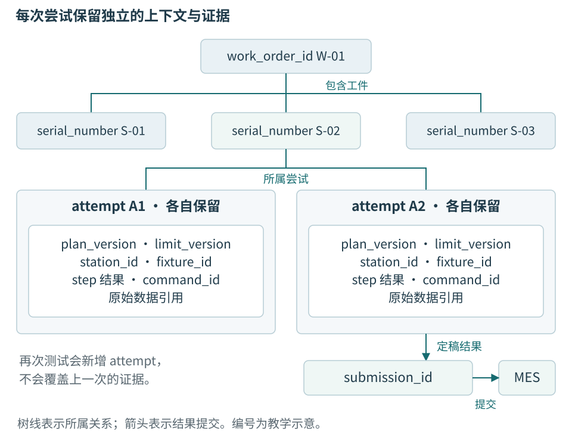
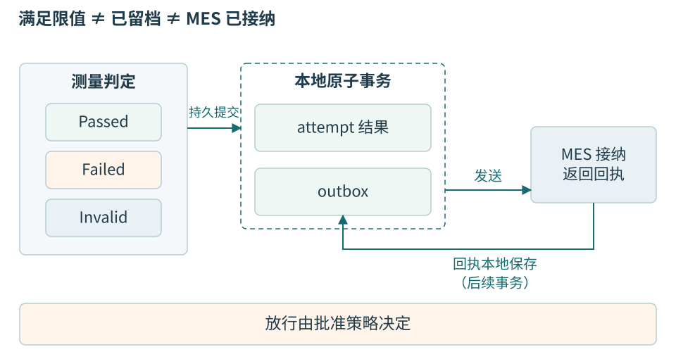

# 第十四章 测试流程 质量记录与追溯

一次测试不只是把测量值与上下限比较。工站必须知道测的是哪件产品、为什么现在允许测、采用哪一版方法、参考条件是否有效，以及结论怎样在故障后仍然找得到。**追溯**就是沿这些身份和证据重建一件产品经历过什么，而不只是搜索到一张写着 PASS 的报告。

温度监测节点进入制造流程后，同一台工控机可能每天处理很多工件。电脑关闭、参考器失效、网络断开和操作员复测都不会让已发生的事实消失。本章把这些事实组织成有版本的流程和记录，特别区分测量判定、本地可靠留档、MES 接纳及实际放行。

下面的工单、数据表、事务和接口均为原创教学设计，不对应真实企业系统。SQL 与 C++ 未执行，未创建数据库，未提交 MES，也没有完成计量或生产验证。正文讨论如何建立可检验契约，不给出可以直接替代质量程序的通用放行标准。

## 14.1 生产语境从工单和工件开始

### 工单安排工作 工艺路线规定经过哪里

**工单**是制造组织安排生产的一份工作依据，通常包含产品型号、数量、批次或相关要求。它可能由企业资源计划系统 ERP 产生，再进入制造执行系统 MES。ERP 更关注企业范围的计划、物料与业务资源；MES 在本书语境中提供现场执行上下文、工序和结果接纳。实际企业的边界会重叠，不能把缩写当作统一产品规格。

**工艺路线**规定产品应经过哪些工序及其条件。例如节点可能先装配，再烧录，之后校准和终检。当前工单存在，不代表任何序列号都能在任何工站执行任意步骤；前序未完成、工单关闭、方案撤回或型号不匹配，都可能使本次请求不被接纳。

**工站**是完成特定作业的一套工作单元，可能包含工控机、软件、治具和仪器。**工位**强调工作位置；本书用 station_id 标识被管理的工站实例，并在需要时增加位置字段。换了一台电脑但继续使用原工位，不应未经记录就认为全部软硬件身份都没变。

**治具**用于定位、连接或保持工件，使每次作业具有可重复的条件。它可能只是温度节点的低压连接底座，也可能包含复杂机构。fixture_id 标识治具，治具修订、维护与接触状态可能影响测量。良好的软件不能补偿未知接线或磨损触点，更不能把夹持成功当作工件电气连接正确的充分证据。

**仪器**提供测量、激励或参考，例如参考温度计、受控电源或数据采集装置。其身份、量程、配置和校准条件属于结果证据。工站知道仪器在线，还需知道它能否支持当前量值与不确定度要求；一个通信正常的仪器可以给出不适用于本次判定的数据。

### 一个条码可以关联多个不同身份

serial_number 是工件外部标记的追溯序列号，通常来自标签或扫码；workpiece_id 是系统内部稳定的工件记录身份。不同产品、厂区或供应商可能使用相同外部字符串，因此序列号还需明确命名空间与格式。系统应建立经核对的绑定，而不是把任何扫描文本直接当作全球唯一主键。

device_id 是通过电子接口读取的节点身份。它可能与标签序列号对应，但两者不是天然相等；标签贴错、主板替换或重新装配都可能使关联改变。工站应核对预期绑定，并按批准流程处理差异，不能自动把读到的 device_id 覆盖为条码文本，让不一致证据消失。

attempt_id 标识工件的一次测试尝试。一件产品可以有多次尝试，每次都保存自己的方法、输入和结果。command_id 标识一次设备业务意图，submission_id 标识一次定稿结果向 MES 递交的身份。这些身份贯穿重连和重启，不能由当前表格行号、端口号或秒级时间戳替代。



图 14-1 追溯关系。serial_number 是外部标记，workpiece_id 是内部工件记录，device_id 是电子身份。复测增加尝试，不覆盖原尝试；图中关系均为教学设计。

## 14.2 开始一次尝试就是冻结一份上下文

### 计划是可执行规则 不是文件路径

**测试计划**说明步骤顺序、允许的设备与仪器、参数、稳定条件、计算方法、限值、重试、取消和错误处理。plan_version 标识计划版本，limit_version 标识判据版本，calibration_version 标识设备校准参数版本。它们可能一起发布，也可能分别管理，记录必须保存当时的确切关系。

只保存“计划文件在某路径”不够。文件后来被覆盖，历史记录就失去原判断依据。可以保存不可变内容副本或有受控存储保证的引用，并保存内容摘要帮助核对一致性。摘要不是审批证明，也不证明文件来自可信发布者；发布授权、版本状态和签名等管理责任另行建立。

开始按钮先提出意图，控制器确认身份、路线、资源和方案，再建立 TestContext。只有接纳点之后才创建正式 attempt_id 并占用相应治具位置；具体何时记录被拒绝的开始请求可另设事件，不应把尚未实际开始的每次点击都算成一次产品测试。

```cpp
// C++20教学数据契约；未编译、未执行。
struct TestContext {
    std::string workpiece_id;
    std::string serial_number;
    std::string device_id;
    std::string attempt_id;
    std::string work_order_id;
    std::string station_id;
    std::string fixture_id;
    std::string plan_version;
    std::string limit_version;
    std::string firmware_version;
    std::string calibration_version;
};
```

完整上下文还需路线、仪器、操作者授权角色、配置摘要和时间信息。这里只展示稳定字段，不把长列表误写成成熟标准。字段之间要有校验：station_id 必须被允许执行该计划，设备型号要匹配，仪器适用量程要覆盖步骤，外部序列号要绑定当前 workpiece_id。

冻结意味着本次运行使用不可变快照。操作员在 UI 中选择下一工件，MES 发布新计划或管理员改了限值，都不能悄悄改变当前尝试。若旧版计划必须撤回，系统要记录明确的停止与处置事件，再按政策决定如何结束当前尝试，不能让一半步骤按旧版、一半按新版却只存一个版本号。

### 接纳前检查会影响恢复

工站在开始前检查磁盘容量、待上传积压、仪器状态和占用关系，能减少做到一半才发现无法保留证据的概率。这些检查不能证明未来永不失败，因此执行路径仍需处理磁盘满和设备断开。检查是接纳条件，不是之后忽略错误的许可。

一个治具位置同时只能归属一个已接纳尝试。本地锁可阻止同一进程重复开始，但另一台工站是否同时处理同一工件，需要 MES 或受控协调服务提供相应路线占用机制。不能因为数据库 attempt_id 唯一，就声称全厂不会重复测试同一序列号。

扫码后工件被更换也是实际风险。开始前和关键阶段应按流程核对电子身份、工件在位或人工确认；如何检测换件取决于设备与治具能力。上位机记住了上一次扫码，并不能证明现在治具中的仍是同一件。自动恢复尤其要重新确认物理对象，不能只恢复内存中的名字。

## 14.3 步骤执行和质量决定分开

### 执行器返回证据 判定器解释证据

步骤执行器负责与设备或仪器交互，返回原始值、单位、时间、质量和执行错误。判定器在冻结上下文中应用转换和比较规则。流程层根据必需步骤及前置条件推进整次尝试。报告生成器和界面只消费这些结果，不反过来决定质量结论。

这样的分工不要求复杂插件框架。一个明确的函数可以完成纯判定，一个设备 Adapter 可以返回测量结构。把可控输入与可观察结果分开，才能离线回放同一数据检查判定变更，也才能证明报告模板改版没有改变工件合格逻辑。

NI TestStand 的公开结果架构将执行中的步骤结果收集与报告、数据库等结果处理分开。这为职责划分提供了真实工具参照；但其内存结果列表不是天然持久记录，使用相似类名也不会给自研 Qt 工站增加未实现的能力。[14-1]

测量原值和显示值也应分开。temperature_mC 是整数工程量，UI 可以显示三位小数；如果内部还有更细的参考或计算值，判定应按批准的精度与修约规则执行，而不是读取标签“30.0”再与限值比较。修约会改变边界附近的结果，所以必须是计划中的明确规则。

### Failed Invalid和Unknown回答不同问题

有效测量不满足判据，可得到 Failed。关键样本缺失、参考条件失效或量程溢出，使本次结果不能用于合格判断，可得到 Invalid。某个带副作用动作是否已经完成无法确认，则是 Unknown。请求因路线、权限或内容冲突被拒绝，是接纳状态 Rejected。

这些状态不应被强行塞进一个互斥枚举。一次尝试可以“执行已中止，已有一个有效失败步骤，另一个写入动作结果未知，已保存部分记录，MES 尚未提交”。若只允许选择红或绿，重要事实就会丢失。可以分别建执行状态、数据有效性、质量决定和提交状态。

| 维度 | 例子 | 不能据此推导 |
| --- | --- | --- |
| 执行 | 运行、停止中、已结束、已中止 | 产品合格或不合格 |
| 数据有效性 | 有效、缺样、参考失效 | 设备动作未发生 |
| 质量决定 | Passed、Failed、未判定 | 结果已经留档 |
| 同步与处置 | Pending、Accepted、Rejected、保持 | 原测量数值应被改写 |

Unknown 应保留在哪一项动作或提交上。写校准未知可能阻止继续采样，因为不知道设备使用哪套参数；MES 回执未知却不一定阻止查询已经保存的本地测量。把两个 Unknown 统一转为“重测”，会把纯通信恢复变成新的物理工作。

缺失值应使用明确的存在性表示，例如 std::optional 或数据库 NULL，并保存原因。用 0 表示缺失会把真实零度与无测量混在一起；用某个巨大数值当错误码也可能被统计程序当成异常产品值。类型和状态要让错误不能悄悄进入正常数值计算。

### 纯判定函数也要携带规则版本

```cpp
// 仅示范已批准的闭区间整数比较；未编译、未执行。
enum class Decision { NotEvaluated, Passed, Failed };

struct Evaluation {
    Decision decision{Decision::NotEvaluated};
    std::string reason;
    std::string limit_version;
};

Evaluation evaluateError(std::optional<std::int64_t> error_mC,
                         bool evidenceValid,
                         std::int64_t lower_mC,
                         std::int64_t upper_mC,
                         std::string version)
{
    if (lower_mC > upper_mC)
        return {Decision::NotEvaluated, "invalid limits", version};
    if (!evidenceValid || !error_mC)
        return {Decision::NotEvaluated, "invalid evidence", version};
    const bool inside = *error_mC >= lower_mC &&
                        *error_mC <= upper_mC;
    return {inside ? Decision::Passed : Decision::Failed,
            inside ? "within inclusive limits" : "outside limits",
            std::move(version)};
}
```

这个函数没有建立测量不确定度、保护带、有效样本数或参考器状态，它只在调用方已经确认 evidenceValid、限值已经批准的前提下做闭区间比较。第23章会展开这些前提。不能把一个正确的比较函数当作完整校准系统，也不能让一个没有证据的 true 布尔值掩盖所有计量责任。

相减时还要处理范围。两个32位整数直接在32位类型中相减可能溢出，计算误差前可先提升到足够范围的64位整数，再依据允许物理范围检查。整数单位减少某些浮点修约问题，但不消除物理不确定度，也不能让不合理的输入变得可信。

## 14.4 一条结果怎样保留形成过程

### 原始证据 转换和判据同时保存

步骤记录至少需要输入来源、原始值或不可变引用、转换版本、单位、质量、限值及比较规则、决定和原因。还应关联工件、尝试、命令、设备、仪器、配置与时间。不是所有字段都要重复复制在每行，但关系必须能在历史查询中恢复，不能依赖“当前配置”解释过去。

下面的 JSON 只是缩小后的示意。reference_mC 与 error_mC 是该步骤的语义字段，基础温度帧仍只有 temperature_mC 负载；没有把这些字段暗中追加到线上帧里。

```json
{
  "schema_version": "station-result/1",
  "workpiece_id": "WP-00017",
  "serial_number": "N240017",
  "device_id": "NODE-0017",
  "attempt_id": "A0092",
  "station_id": "CAL-03",
  "plan_version": "NODE-CAL/7",
  "limit_version": "TEMP-LIMIT/3",
  "step_id": "independent-verification",
  "command_id": "A0092:verify:1",
  "measurement": {
    "temperature_mC": 30040,
    "reference_mC": 30000,
    "error_mC": 40,
    "validity": "Valid"
  },
  "comparison": {
    "lower_mC": -350,
    "upper_mC": 350,
    "rule": "inclusive-with-approved-guard-band"
  },
  "decision": "Passed",
  "evidence_ref": "A0092/verify/raw",
  "evidence_digest": "symbolic-H1"
}
```

symbolic-H1 明确是占位摘要，不是已经计算的哈希。这个条目也不能独立作为校准证书，因为仪器、稳定条件、完整原始窗口和不确定度等字段在示意中省略。它说明记录结构的关系，不能伪装成真实产品通过数据。

原始证据不一定是巨大的波形文件。对低速温度节点，可以保存有界测量窗口内每个样本、序号、质量和参考值。数据量很小时放进同一数据库事务更容易解释；数据量大时使用独立文件，则必须承担文件和数据库之间的恢复协议。

### 时间用于解释 不能单独充当身份

source_time 应说明时钟域和含义，是设备采样计数还是已同步 UTC；received_at 是工站接收 UTC；本机等待时长由单调时钟计算。日志顺序还可带本地事件序号。三者共同帮助诊断，不能未经同步直接将两个不同设备时间相减，声称得到精确单向延迟。

设备重启后 boot_id 改变，sequence 从新运行段继续解释。电脑时间校准可能影响 received_at 的间隔，但不应让历史记录重新排序成另一次尝试。主链仍靠 workpiece_id、attempt_id 和 command_id，时间帮助缩小范围而非取代身份。

如果数据来源不提供采样时刻，记录应写明未知或仅有接收时间。用当前系统时间填一个字段，让格式看起来完整，是在新增未经证实的事实。报告可以解释“该时刻由工站接收”，不能把它改称“传感器采样时刻”。

## 14.5 本地提交要能抵御明确的故障

### 内存中有结果不等于已经留档

程序算出 Passed，表示某份有效证据满足指定判据。写日志函数返回，可能只表示内容进入进程或系统缓存。数据库事务提交，则提供在具体引擎、配置、文件系统和设备条件下的承诺。不同完成点不能共用一个“保存成功”布尔值。[14-2]

本书可用 SQLite 作为单工站本地存储的教学选择，它是嵌入进程的数据库库，不需要另建数据库服务器。事务帮助把一组相关写入组织成整体；其断电行为仍依赖日志模式、同步配置、VFS、文件系统和设备是否兑现相应请求。不能说“使用 SQLite 就永不丢数据”。[14-2][14-3]

WAL 是预写日志模式中的一种实现机制。提交可能先进入 WAL，再经检查点合入主数据库，不能只复制主数据库文件就假定获得一致备份。不同同步配置对进程崩溃和机器断电的保证不同；项目应固定并验证配置，不能为改善测试数字擅自降低同步级别。[14-3][14-4]

Qt SQL 的数据库连接也有线程使用约束。拷贝一个 QSqlDatabase 值不等于新建独立连接，更不意味着可以跨线程任意使用同一底层连接。教学结构让 ResultStore 在自己的执行上下文创建、使用和关闭连接，界面通过值消息接收提交结果。[14-5]

### 结果和待发送意图在同一事务里

工站既要保存结果，又要告诉 MES。如果先保存再在内存里安排发送，程序可能在两者之间崩溃，留下“有结果、没有待办”；如果先发 MES 再保存，可能留下“远端已接纳、本地没有依据”。交换顺序不能消除这个双写窗口。

**事务发件箱**或 outbox，把业务结果与待发送记录写入同一个本地事务。事务提交后，后台发送者从持久 outbox 找到应递交的结果；即使 UI 从未收到成功通知，重启也能继续发送。这个模式解决本地两份状态的一致存在，不把本地数据库和 MES 变成同一事务。[14-6]



图 14-2 三个确认边界。Passed 不等于已持久化，已持久化不等于 MES 已接纳，MES 已接纳也不自动决定现场处置；放行须按批准策略组合所需事实。

```sql
-- 教学模式片段，未创建数据库、未执行SQL。
CREATE TABLE attempts (
  attempt_id TEXT PRIMARY KEY NOT NULL,
  workpiece_id TEXT NOT NULL,
  plan_version TEXT NOT NULL,
  limit_version TEXT NOT NULL,
  result_payload TEXT NOT NULL,
  payload_digest TEXT NOT NULL
);

CREATE TABLE outbox (
  submission_id TEXT PRIMARY KEY NOT NULL,
  attempt_id TEXT NOT NULL UNIQUE,
  payload_digest TEXT NOT NULL,
  state TEXT NOT NULL,
  FOREIGN KEY (attempt_id) REFERENCES attempts(attempt_id)
);
```

这只是两张核心表的关系，省略了步骤表、事件、回执、更正、索引和模式迁移。SQLite 外键检查是否启用及当前连接设置必须核对，不能仅凭写出 FOREIGN KEY 就假定运行中已经执行约束。状态取值也应由约束或受控代码验证，不允许任意拼写产生隐藏状态。普通SQLite rowid表中的非整数PRIMARY KEY仍可能接受NULL，因此上例对文本身份显式声明NOT NULL；空字符串、命名空间和格式还需独立校验，唯一约束不代替这些要求。[14-8]

```text
教学提交顺序，非可直接执行的事务脚本
1  验证结果完整，生成固定 submission_id 和规范化内容
2  开始本地事务
3  插入 attempt 和全部必需步骤结果
4  插入相同内容身份的 outbox 记录
5  提交并检查成功返回及错误状态
6  只在约定提交成功后发布“本地已留档”
```

重复调用提交入口时，应先按 attempt_id 查已存在内容。相同身份、相同定稿内容可以返回原提交事实；相同身份、不同内容必须报告冲突，不能使用无条件 replace 把旧结果覆盖。摘要帮助比较，但摘要算法和规范化编码要固定，且必要时还需核对完整内容。

### 原始文件在事务之外怎么办

大块原始数据放在独立文件时，数据库事务不能自动包括该文件。可先将数据写到不可变候选文件，检查完整写入、长度和摘要，按目标文件系统契约完成所需同步，再在事务中引用它。事务失败可能留下无引用的孤儿文件，但不会留下已经承诺结果却无原始证据的主动设计窗口。

这条顺序还不能无条件推广到任何网络盘或移动介质。原子重命名、文件关闭和断电持久性不同；Windows 和 Linux 的具体同步与目录元数据行为需要适配和验证。若没有这类证据，文稿只能称它为待实现的存储协议，不能称“跨平台原子保存”。[14-2]

孤儿回收应晚于对事务和引用的核查，并保留足够恢复窗口。不能根据“文件创建超过十分钟”就删除，某个长尝试或中断恢复可能仍需要它。反过来，数据库引用的文件缺失或摘要不符时，结果应标记证据不可用并阻止依赖它的放行，不能偷偷重新计算摘要接受当前内容。

## 14.6 MES接纳需要应用层回执

### 网络成功和业务成功不同

MES 在本书中接收整次工序结果，并核对工件、工单、路线、版本和结果内容。HTTP 返回或消息队列确认只说明某一传输或服务阶段；具体是否表示业务已经持久接纳，必须由接口契约说明。有的接口返回“任务已接受处理”，之后还需查询终态。

一个有恢复能力的接口应支持稳定 submission_id。同 ID 同内容的重复提交，返回相同业务结果或可核对的原回执；同 ID 不同内容，报告冲突；按 ID 查询应在约定保留期内可用。若对方只有每次新增一行的接口，没有查询或去重，客户端单独使用 outbox 不能保证不重复计数。[14-6]

发送者从 outbox 读取已经定稿的内容，不能每次上传时重新读取“当前限值”拼装。否则同一 submission_id 在隔天重试时可能带上新版本，触发冲突甚至污染历史。发送的字节表示若需签名或摘要，也要确定规范化和版本，不依赖任意 JSON 字段顺序恰好一致。

MES 已接纳但回执丢失时，outbox 仍 Pending 是可以解释的状态。恢复应查询或同 ID 重传，取得原回执后在本地记录 Accepted。换一个 ID 也许能消除接口报错，却可能把一次尝试变成两次生产数量；这个“修复”改变了业务事实，不能自动采用。

### 业务拒绝不能靠无限重试消失

网络暂时不可达、工单已经关闭、路线不允许、版本被撤回和内容冲突有不同处置。临时网络错误可以按预算退避；确定业务拒绝要保存原因和回执，进入质量或生产处置。不能把工单号改成另一个仍开放的工单，只为让上传通过。

outbox 也需要容量策略。记录积压数量、最老待确认时间和磁盘余量比一个“网络在线”图标更有用。达到批准上限时，应停止接纳新工件或进入特定离线模式；删除最旧未确认结果再继续生产，会破坏系统承诺。

离线生产不是程序员临时添加的默认便利。它需要规定允许使用哪些缓存计划、最长离线时间、工件是否可离开工位、如何隔离、恢复后如何对账，以及重复工件怎样控制。能够离线完成有效测量，不等于允许该件进入下一工序。

## 14.7 复测 更正和良率要保存真实分母

### 新尝试不会洗掉旧尝试

复测为同一 workpiece_id 产生新的 attempt_id，并记录前次关系、原因和处置依据。一次无效参考造成的 Invalid，与有效测量超限造成的 Failed，有不同的复测前提。不能不加区别地自动测到通过，更不能删除不理想样本只保留最后一次绿色结果。

同一尝试内部是否允许重取某步骤，也应由计划规定。需要固定最多次数、聚合规则、舍弃条件和原因记录。若计划规定取十个样本平均，程序不能看见前九个不理想就重新开始窗口，直到偶然通过；这改变了统计和质量含义。

**更正**用于修复已发现的记录错误，应追加原值、新值、原因、依据和授权信息。更正不等于重测，也不应覆盖原始测量。可以维护“当前有效结果”投影视图，方便操作员查询，但投影必须能链接回全部尝试与更正历史。

一项此前 Unknown 的命令后来得到确认，也应追加解析事实，说明何时、凭什么知道。不能悄悄把原日志改成“当时成功”，因为恢复过程中的等待和处置本身也是重要证据。最终确定与当时已知是两条相关但不同的时间线。

### 良率必须先说明统计对象

“良率”常用于表示某个质量口径下通过的比例，但分母可以是工件、尝试、首次有效执行或最终完成件数。定义不同，数字不可直接比较。工站应保存原始分类，再按批准口径生成指标，不在收集时提前删除 Invalid、Aborted 或复测。

设有100件进入工站，首次尝试80件有效通过、10件有效失败、10件因仪器问题无效。若报告“全部首次尝试通过比例”，是80/100；若另报“首次尝试有效样本中的通过比例”，是80/90。两者都可计算，但后者必须公开排除了10件无效，不能把88.9%写成无条件的首次通过率。

后来十件失败中八件返修通过，十件无效重测都通过，最终通过件数可能为98。这个98%不能替代最初的80%，因为它回答的是经过不同处置后的最终结果。返修、无效和总尝试数应分别报告，才能看见制造问题与测量系统问题各自的影响。

同理，设备通信重传不一定增加测试尝试，MES 同 ID 重发也不增加产量。只有清楚区分 command_id、attempt_id 和 submission_id，统计才能不被网络错误改变。将“接口成功次数”当成“合格工件数”，会在网络越差时产生越多的虚假产量。

## 14.8 从一件产品查到受影响的一批产品

追溯入口通常从 serial_number 或 workpiece_id 开始，展示身份绑定、全部尝试、计划与限值、关键步骤、原始证据、MES 回执和当前处置。用户不应猜报告文件名，也不应只能看到最后一次结果。一个摘要可以写为：“A0091参考无效；A0092有效通过且本地留档；MES待确认，当前保持。”

反向查询同样重要。后来发现某参考仪器在一段时间内可能失准，需要按仪器身份、校准版本、量程、使用窗口和步骤查出受影响记录，再展开相关工件。关联表示需要调查，不自动宣布全部产品不合格；质量人员要根据原始数据、影响范围和批准规则决定复核或其他处置。

文件摘要可检查内容是否变化，不证明数据真实性、仪器准确度或合法计量溯源。审计日志能帮助追踪操作，也不能替代角色权限和受控发布。敏感生产信息、设备凭据和操作者资料应按必要范围保存与访问，诊断包不应默认包含所有数据库内容。

备份与复制也不同。实时复制可能把误删同步过去，备份提供不同时间点的恢复材料。工站应按明确恢复目标保存并演练恢复，核对数据库、原始文件、方案和密钥是否组成完整集合。能启动应用不等于能够查回此前承诺的每一份质量记录。[14-7]

## 14.9 记录系统的故障怎样证明修好了

### 内存显示Passed 但磁盘已经满

需要分别观察判定完成、文件写入、本地事务提交和界面状态事件。若界面在判定函数返回后直接亮“工序完成”，磁盘错误就被隐藏。修复应保留“满足限值，留档失败”的真实组合，并按批准策略保持工件、阻止依赖留档的后续操作。

验收在原始文件写入、事务插入和提交等不同位置注入容量错误。应证明没有未提交结果被标为已留档，已提交的历史仍可读取，失败尝试保留足够恢复身份。不能只清空磁盘后再测一次通过，就宣布最初那件工件已经有记录。

面试追问：“先写CSV，再慢慢入库行吗？”可以设计双层记录协议，但 CSV 必须具有明确边界、完整性、持久化和恢复规则，并与数据库去重关联。一个随手追加的文本文件不自动成为可靠日志，反而增加另一份要维护的一致性关系。

### MES里出现两条相同工件结果

先检查两条记录对应的 attempt_id 和 submission_id。如果是两次获准复测，重复工件并不等于重复提交；如果同一次尝试因为重传换了 submission_id，就是身份错误。若同 ID 仍新增两行，则要检查服务端唯一约束和并发去重，而不是只在客户端加一个内存布尔值。

修复后需要在 MES 已提交但回执前断开连接，并让两个发送者同时提交同一身份。应确认远端业务效果符合约定，返回内容冲突能够被识别，本地保存原回执。一次正常上传成功只验证顺畅路径，不能证明重复窗口受控。

面试追问：“outbox保证恰好一次吗？”它保证的是本地结果与发送意图在所述事务边界内共同存在。发送可能重复，远端是否只接纳一次仍需服务端协作与保留策略。需要把保证画到具体边界，而不是把模式名称当作端到端结论。

### 限值更新以后历史报告结论变了

检查报告生成是否读取当前限值而非记录中的 limit_version，原始测量是否被显示修约后再比较，或者历史计划文件被覆盖。正确做法是按当时冻结规则呈现原决定；若需要用新标准重新分析，应产生明确标注的新分析，不改写当年的事实。

验收可以让同一原始数据处于两个限值版本边界之间，分别生成历史报告和重分析报告。前者必须保持原版本，后者必须写明新规则和目的。报告版式变化不应改变结果内容身份，也不应重新生成 submission_id 再计一次生产。

面试追问：“只存原始值，以后重新算不是最灵活吗？”原始值重要，但如果没有当时的单位、转换、质量、限值和方法，就无法知道当时为什么作出决定。可重算与可追溯不是互相替代，应该同时保存事实与解释所依赖的版本。

## 本章资料与验证边界

[14-1] NI，[TestStand Report Generation and Customization](https://www.ni.com/en/support/documentation/supplemental/08/teststand-report-generation-and-customization.html)。步骤结果收集与结果处理分层；本文的存储和MES设计不是NI默认保证。

[14-2] SQLite，[Atomic Commit](https://www.sqlite.org/atomiccommit.html)。原子提交及文件系统和设备假设。

[14-3] SQLite，[Write-Ahead Logging](https://www.sqlite.org/wal.html)。WAL、检查点及部署约束。

[14-4] SQLite，[PRAGMA synchronous](https://www.sqlite.org/pragma.html#pragma_synchronous)。同步配置和故障保证的区别。

[14-5] Qt，[QSqlDatabase](https://doc.qt.io/qt-6.8/qsqldatabase.html)。连接、事务和线程使用边界。

[14-6] AWS，[Transactional outbox pattern](https://docs.aws.amazon.com/prescriptive-guidance/latest/cloud-design-patterns/transactional-outbox.html) 与 [Idempotent APIs](https://aws.amazon.com/builders-library/making-retries-safe-with-idempotent-APIs/)。本地双写、重复与稳定意图；工站实现为本文教学设计。

[14-7] SQLite，[Online Backup API](https://www.sqlite.org/backup.html)。一致备份机制；没有执行备份或恢复。

[14-8] SQLite，[CREATE TABLE的PRIMARY KEY约束](https://www.sqlite.org/lang_createtable.html#the_primary_key)。文本主键的NULL边界，本文显式加NOT NULL。

资料按2026-10-06核对。本章只建立数据和确认契约，未选定最终SQLite二进制版本、同步配置、文件系统与存储介质组合，未运行SQL、事务故障注入、断电或MES互操作测试。所有示意数值和记录均不可作为实际生产或校准证据。
