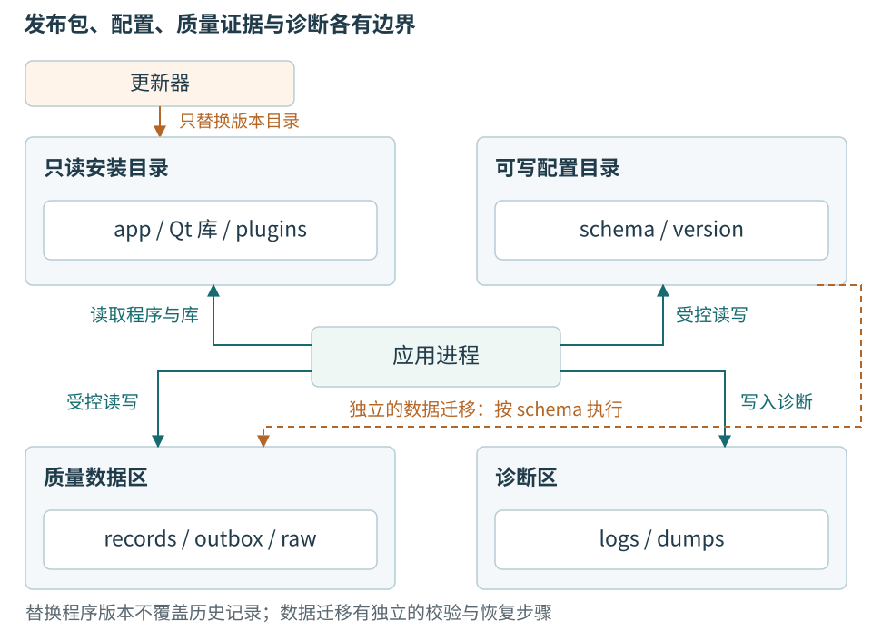
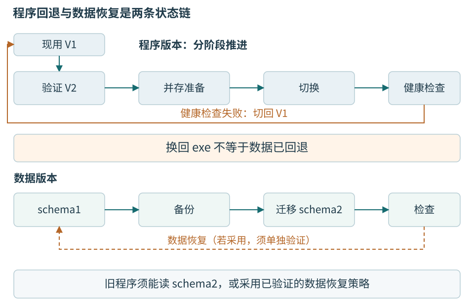

# 第十五章 Windows与Linux部署维护

部署是把程序交到另一台机器上，并使它在那里的用户、权限、设备和数据条件下履行原有承诺。开发机能运行，只证明开发机已有的某组环境支持它；正式工站还需要明确的依赖、安装、升级、故障收集和恢复办法。交付物因而包括程序，也包括别人能够解释和维护它所需的材料。

Qt 可以共享大量界面和业务代码，但不会让 Windows 与 Linux 的动态库、驱动、权限和显示系统变得相同。本章以 Windows 为主讲，Linux 为真实的第二验证目标；“目标”不代表已经验证通过。所有命令只作为阅读示例，没有安装运行库、修改系统权限、部署应用或运行跨平台测试。

温度工站尤其要保护三类内容：已经认可的程序版本，现场使用的配置，以及不可随意覆盖的质量记录。一次更新即使成功换了可执行文件，若旧记录无法读取或未确认命令被重复发送，也没有完成可靠交付。

## 15.1 发布身份必须比文件名更具体

一个名叫 Station.exe 的文件，不能解释它来自哪次源码、使用哪个 Qt 补丁、链接哪套编译器运行库，也不能帮助恢复相应崩溃符号。**构建标识**把二进制与源码、依赖、编译选项和制品联系起来。发布版本面向用户，构建标识面向可追溯实现，两者可以相关但不应混成一个不断覆盖的文件名。

本书 C++20 是语言概念基线，Qt 6.8 是 API 文档范围。实际交付还要固定编译器及架构、Qt 精确补丁、第三方 SDK、操作系统版本与驱动组合。第十一章的退出结论按 Qt 6.8.3 部分实现静态核对，不能因为在线文档当前显示 6.8.9 就声称整套程序已经升级并验证。

发布清单应同时记录功能与能力边界。Windows 支持某个 CAN 后端，不说明 Linux 同名插件一定可用；厂商 SDK 提供 x64 DLL，不说明 ARM Linux 有等价库；Qt 编译成功，不说明串口热插拔、休眠恢复和仪器校准流程已经通过。

```text
教学发布清单字段，非真实构建结果
application_version: station-0.9
build_id: example-build-identifier
source_revision: example-source-revision
target_architecture: x86_64
qt_api_family: 6.8
qt_runtime_patch: 待实际构建冻结
compiler_and_runtime: 待实际构建冻结
supported_protocol: node-frame/1
record_schema: station-result/1
validated_platforms: 无，本轮未执行
```

最后一行不是形式上的免责声明，而是区分文稿与软件交付的必要事实。正式版本应以实际证据替换这些占位字段，不能让打包脚本自动填写“通过”。代码静态审阅、编译、主机回放、实际驱动和硬件测试分别记录，任何一项都不能代替全部。

### 兼容性具有方向

“新版能读旧记录”不代表“旧版能读新版记录”。“旧设备能被新软件识别”不代表“新固件可以被旧工站校准”。每个方向都要列出：协议版本、参数模式、记录模式、限值及算法版本。只有一个兼容布尔值，会把需要不同处置的情况藏起来。

例如软件 V2 新增一种 Invalid 原因，V1 如果把未知枚举默认当 Passed，就破坏质量语义。兼容策略应让旧读者明确拒绝不支持的数据，或保留未知状态而不作错误判断。能够解析 JSON 并不等于理解所有新增业务含义。

## 15.2 Windows部署从依赖集合开始

### DLL 运行库和插件各有位置

动态链接程序依赖 Qt 库、C++ 运行库及可能的厂商库。应用自己的 EXE 并不包含所有这些内容。Debug 与 Release、x86 与 x64、不同编译器 ABI 也可能不兼容，不能在缺 DLL 时随便从另一台电脑拷一个同名文件。

windeployqt 可以帮助收集 Qt 相关依赖及插件，形成部署目录；它并不自动发现和审计所有第三方库，也不替项目验证驱动、许可或运行结果。应使用与构建匹配的 Qt 环境调用工具，并保留其输出作为清单线索，最终仍在干净目标环境验收。[15-1]

```text
教学命令，未执行；路径和工具版本需实际冻结
windeployqt --release --dir package Station.exe
```

这行命令表示准备应用目录，不表示已经制作完整安装包。TLS 后端、SQL 驱动、图像插件、厂商 SDK 和运行时按路径动态加载的组件，可能需要另外明确。仅测试程序启动画面会漏掉“点开某功能才加载”的依赖，例如第一次连接 MES 时才出现 TLS 错误。

**平台插件**把 Qt 的窗口系统能力接到操作系统。Windows 部署中常见 platforms 子目录及对应插件；插件找不到、版本不匹配或插件自身依赖缺失，都可能表现为平台插件无法初始化。文件存在只是一个观察，不能排除加载器在更下层失败。[15-2]

编译器运行库也有受支持的再分发方式。使用 MSVC 时，应按 Microsoft 的架构和版本兼容条件提供适当的 Visual C++ Redistributable，不把开发机上的任意运行库 DLL 当成可随意复制的完整替代。实际安装方式和权限由组织部署策略决定。[15-3]

### 安装目录不应同时充当数据目录

程序和库适合放在受控、普通运行用户不可随意改写的安装目录。用户设置、日志、原始测量和本地数据库需要各自可写位置。若把数据库放在 EXE 旁边，开发目录中可能一切正常，安装到受保护目录后却因权限失败；以管理员身份运行只会掩盖设计问题。

QStandardPaths 提供平台适当的常见位置查询，例如应用数据和配置目录。它帮助减少硬编码用户名和系统盘路径，但仍要明确是每用户还是机器共享数据、由哪个账户运行、备份覆盖哪里。工站多用户轮班时，如果每个用户各有一份数据库，界面可能看似“历史突然丢了”，实际只是读到了另一个目录。[15-4]



图 15-1 发布包与现场数据的责任分区。位置名称为逻辑职责，并非要求所有平台采用同一绝对路径；访问权限和保留规则按目标环境建立。

```cpp
// Qt 6.8 教学片段；未编译、未执行。
const QString root = QStandardPaths::writableLocation(
    QStandardPaths::AppLocalDataLocation);
if (root.isEmpty())
    return reportConfigurationError();
if (!QDir().mkpath(root))
    return reportStorageError(root);
// 实际程序还需检查权限、剩余容量及组织批准的数据位置。
```

目录创建成功不保证后续空间充足，也不证明介质满足质量记录持久性。应用启动可进行有限的可写检查，并在每次实际保存时处理错误；不能创建一个测试文件成功后，就永远忽略磁盘满或权限变化。目录名也不应包含未经清理的扫码内容，以免路径字符被当作层级或特殊名称解释。

### 插件加载是代码执行边界

插件和 DLL 是可执行代码，不是普通配置文本。允许当前工作目录或任意用户可写目录进入可信搜索路径，会增加错误或不可信库被加载的风险。部署时应控制插件来源，避免依赖开发机全局 PATH 恰好指向正确版本。[15-2]

qt.conf 等路径配置可以帮助限定部署布局，但必须与实际目录、平台和启动方式一起验证。不能为了消除一次错误而全局设置 QT_PLUGIN_PATH 指向某个混合 Qt 安装，让其他应用也受到影响。诊断环境变量适合受控调查，正式包应有可解释的默认查找行为。

应用配置也不能无条件接受一个任意动态库路径。若产品确实支持可插拔驱动，需要清楚的安装、签名或批准流程和兼容检查；普通操作员修改文本配置不应自动获得加载任何代码的能力。最小权限在桌面工站同样重要。

## 15.3 Linux部署不只是换一个可执行文件

### 共享库和显示后端仍需匹配

Linux 目标通常使用 ELF 二进制和共享库，编译器运行库、glibc 等系统 ABI 与发行版版本有关。在较新系统构建的程序，可能依赖旧系统不存在的符号。不能只把源码写成标准 C++，就认为它能在任意 Linux 上运行。[15-5]

Qt Widgets 还依赖适当的窗口系统后端和相关库。X11、Wayland、桌面会话、图形驱动与远程显示环境会改变可用能力。无显示会话的 system service 与登录用户桌面程序不是同一种部署，不能让 GUI 服务在后台启动后，因无法显示窗口而被误判为程序逻辑崩溃。

部署方案可以是组织批准的发行版软件包、受控应用目录或其他明确形式。选择时需考虑更新、依赖安全维护、设备权限和支持成本。本书不推荐一个跨所有发行版的万能包，也不在没有测试的情况下声称某个容器或打包格式自动解决串口与桌面集成。

检查动态依赖时应使用可信构建制品与受控工具。对来源不明的可执行文件，不能为“看看缺什么库”就随意运行它；诊断命令本身也有安全边界。正式发布清单由构建和打包过程生成，再在隔离环境中核对实际加载内容，比现场临时猜依赖更可靠。

### 设备节点 权限和持久名称

Linux 常通过 /dev 下的设备节点暴露串口等接口。设备节点存在，不表示当前用户有访问权；用户属于某个设备组，也不表示已经取得本次会话所需权限。发行版可能采用不同组名、udev 规则或桌面会话访问机制，应检查实际设备、账户和策略，而不是照抄一种发行版的命令。

udev 根据设备事件和属性管理设备节点权限及符号链接等信息。可以按受核对的设备属性建立较稳定的访问名称，但缺少唯一硬件序列号的多个相同适配器仍可能难以区分。稳定适配器路径也不代替设备协议的 device_id 握手。[15-6]

不应把所有串口设备改成任何用户可写，也不应让 GUI 长期以 root 运行来绕过权限。正确目标是给需要的账户访问批准设备的最小权限，明确规则来源及变更影响，并按组织程序部署。权限问题影响的是访问能力，不会因为应用升级而自动变成硬件故障。

设备拔除后重新出现，旧文件描述符和旧 QSerialPort 对象不应被当作新设备已经在线。会话重新识别、generation 更新和在途 command_id 恢复仍按第十二章执行；平台适配只改变如何找到入口，不改变业务身份规则。

### 后台服务与桌面会话要有清楚分工

若采集必须在用户退出桌面后继续，可把受控后台服务与 GUI 分开。这样新增了跨进程通信、服务启动顺序、权限和版本兼容责任，不能只为了“永不退出”把整个 QWidget 程序塞进服务。服务可以拥有采集和存储，GUI 作为客户端展示，但双方仍需稳定身份和有界消息。

自启动不等于恢复正确。服务重启前的设备命令可能已经执行，重启后的第一件事应是恢复记录与识别设备，而不是重放所有未标成功的动作。自动拉起频率也要限制，配置损坏或驱动永久失败时应给出可诊断状态，避免无限重启写满日志。

本书主实现保持普通桌面工站，后台服务是有需求时才采用的部署选择。是否把职责拆进进程，应由无人值守、账户和恢复要求决定，不把额外进程视为天然更专业的结构。

## 15.4 配置迁移首先保护可解释性

配置至少有四类：用户显示偏好、设备连接设置、已批准测试计划、工站身份与权限。它们不能共用“恢复默认”按钮。窗口大小可以重置，工站身份不能随意变化，测试限值不能因配置读取失败而静默改成宽松默认值。

配置文件应带模式版本。新程序读取旧格式时，先验证，再按明确迁移规则生成新格式；原文件应保留可恢复副本。遇到未知新版本，应拒绝不支持的字段或进入有限只读状态，而不是只忽略解析错误继续生产。

```json
{
  "schema_version": 2,
  "station_id": "CAL-03",
  "device_profile": "node-frame/1",
  "display": {"temperature_decimals": 3},
  "approved_plan_ref": "NODE-CAL/7",
  "data_location_policy": "managed-station-storage"
}
```

这是教学配置，真实 station_id 应来自受控配置，不由用户任意复制到第二台机器。配置中的计划引用仍需验证对应批准内容；字符串存在不证明文件真实、未撤回或适合当前工件。凭据不应明文混入这个文件，实际密钥存储与访问要使用批准机制。

QSaveFile 可帮助通过临时文件与提交避免某些保存失败时直接破坏旧文件，调用方仍要检查 open、write 和 commit 结果。其 direct-write fallback 会改变失败时的保护条件；对重要配置，应明确是否允许这种回退，而不是为了“总能写进去”牺牲原文件保护。[15-7]

```cpp
// 配置保存教学片段；不是通用断电持久化协议。
QSaveFile file(path);
file.setDirectWriteFallback(false);
if (!file.open(QIODevice::WriteOnly))
    return reportSaveError(file.errorString());
if (file.write(encoded) != encoded.size())
    return reportSaveError(file.errorString());
if (!file.commit())
    return reportSaveError(file.errorString());
```

这个片段有意不称“断电绝不丢”。原子可见性、文件同步、目录元数据和设备保护仍是独立条件。测量数据库和大块原始文件应按第十四章的事务与恢复设计保存，而非因为 QSaveFile 名字里有 Save 就把它当成所有存储的统一事务。

配置损坏时，启动程序可以保留原文件并提供诊断或只读历史查询。是否允许加载默认连接设置，要看它是否可能自动向错误目标发送命令。一个安全的受限默认通常不自动写设备，也不宣称工站已经具备生产资格；具体行为由产品批准。

## 15.5 更新要同时管理程序和数据

### 更新过程有多个确认点

更新包下载完成后，要验证来源、完整性、目标架构和适用版本；随后准备候选程序，停止接纳新尝试，协调当前流程收尾，再切换版本。程序能启动以后还要检查必要能力和数据兼容，不能把安装器返回零当作工站全部可用。

签名或摘要验证失败，应停止并说明，不能作为“网络问题”绕过。摘要用于检测内容一致，可信签名或批准分发链用于建立来源，两者也不能混淆。更新器本身的来源、权限和回退责任同样需要管理，不能成为未经审查的任意文件执行通道。

已运行进程可能仍持有库和数据库，直接覆盖部分文件会形成混合版本。比较清楚的设计是候选版本在独立目录准备，确认旧进程已停止到允许切换的阶段后，再按目标平台的可靠机制切换。具体原子性和文件锁行为需要平台验证，不在书中凭一个 rename 命令声称跨平台完成。

### 程序回退与数据回退必须一起设计

新程序可能将记录模式从一版迁移到二版，旧程序即使重新启动，也未必能读新版数据。若新版已经产生生产记录，简单恢复更新前的数据库备份还可能删除更新后的有效事实。因此回退策略必须明确新数据怎样保留、旧程序能读什么、何时需要只读或对账。



图 15-2 更新的两条状态链。上行管理程序，下行管理数据。只有两条链的条件都满足，才能承诺恢复到可用工站，而不是仅承诺旧进程能够启动。

可以选择一段时间内保持旧格式可读，或采用向后兼容扩展、双阶段迁移、验证后的回退导出等策略。每种方案有成本，不能一律要求复杂双写，也不能一律忽略数据。设计从真实兼容需求和允许停机时间出发，保留可证明的恢复点。

测试计划和校准参数也具有版本关系。程序更新若改变温度换算或取样规则，即使数据库模式没变，也可能改变结果含义。应通过明确的算法或计划版本承载变化，不能悄悄让同一个 NODE-CAL/7 在新程序里执行不同方法。

### 更新时怎样处理未确认动作

工站准备更新时停止接纳新工件，当前尝试按允许的停止窗口结束或保持。写校准或烧录若处于不可安全取消阶段，更新器不能仅因“超过十秒”就杀进程。UI 可以说明更新等待什么证据，管理员根据批准流程处置，但程序不能凭等待期限补造动作终态。

关闭路径遵守第十一章：取消请求不等于完成，finished 不等于任意外部清理都结束；Qt 6.8.3 示例中等待所支持的工作对象子树回收结论，不扩张为任意 TLS 或厂商 SDK 尾部副作用已经结束。接入新 SDK 后必须重新核对结束协议。

强制断电或系统更新造成无法正常收尾时，下次启动恢复原 attempt_id、command_id 与 outbox，重新识别设备并对账。一次可靠更新不要求世界永不失败，而是让失败后仍知道哪些事实成立、哪些未知、接下来允许做什么。

## 15.6 DPI 字体和操作方式也是功能验收

DPI 与设备像素比影响逻辑尺寸怎样映射到物理像素。Qt 6 的高 DPI 支持减少了应用手工缩放负担，但固定像素假设、自绘缓存、原生控件混用和不同显示器之间移动仍可能出现问题。不能在框架已经缩放后再统一乘一次系统比例。[15-8]

温度工站的单位、限值、负号和错误原因必须完整可读。输入框只剩“25000”而“m°C”被裁切，可能导致真实配置错误；按钮文字被截断也可能使停止与关闭难以区分。测试应覆盖长设备名、中文、较大系统字体、不同缩放和多屏移动，而不是只拿开发机的一张截图验收。

布局应基于内容与约束，重要字段不要依赖刚好够用的固定宽度。表格列太多时，可以将详情放在选中记录的侧栏或下方，保持列表中的身份、状态和关键量清楚。不能把所有技术字段塞进一条横向滚动到看不到单位的记录，然后称作“完整信息”。

键盘操作、焦点顺序和可访问名称也要验证。扫码器常模拟键盘输入，焦点误落在另一个字段时可能把序列号写进参数框。应用应明确扫码入口、结束符和输入模式，必要时将扫描流程与普通编辑分开，不能把一次回车无条件解释为“开始测试”。

状态不能只靠红绿区分，操作确认也应显示目标身份与影响。确认对话框期间设备可能切换，执行时仍需核对同一 device_id 和 generation。视觉确认不是业务一致性的替代，它只帮助用户表达清楚的意图。

## 15.7 诊断材料要能对应同一个发布版本

### 崩溃符号与二进制一一对应

优化后的程序地址不能仅凭源文件行号解释。Windows 常使用匹配的 PDB，Linux 可保存相应调试信息与构建身份；具体工具链方式不同，核心是符号与实际二进制精确对应。文件名相同、版本文字相同都不足以证明匹配。[15-9]

发布时应保留原始制品、符号、依赖清单和构建记录。现场导出诊断包时附带程序构建标识、平台、Qt 和 SDK 版本、设备固件及会话身份。否则开发者可能拿 V2 的符号解释 V1 的地址，得到看似具体却错误的调用栈。

崩溃转储可能含内存中的测量数据、路径、凭据或个人信息。默认收集应最小化，明确访问权限、保留期和用户或组织批准范围；不能为排障直接上传整盘数据。普通日志也应避免访问令牌、完整密钥和无关人员信息。

### 日志要能串起责任 而不是只写错误码

一次设备操作可记录 attempt_id、command_id、generation、device_id、boot_id、阶段、错误类别和本地事件序号。墙钟时间便于关联外部系统，单调时间用于本地耗时。原始报文可按授权做有限采集，但不应无界长期记录每个字节并压垮存储。

日志轮转应有条数、大小或时间策略，质量结果却不能按同样规则随意删除。诊断日志帮助排查，正式测量记录承担追溯，两者的保留依据不同。删除老日志不能同时删除尚未确认的 outbox，清理缓存也不能清理唯一原始证据。

错误提示可以面向操作员写明阶段与下一步，例如“端口已打开，请核对设备身份与目标连接”，而不是只显示代码 5。详细错误码和加载路径保留给诊断包，但应避免泄露不必要系统信息。用户需要知道是否可以重试、是否可能已有副作用，而非只知道程序“不成功”。

### 恢复能力必须实际演练

备份文件存在只是准备材料。恢复演练还要检查数据库一致性、原始文件引用、计划版本、回执和未确认命令。在隔离环境验证，不让恢复出的工站自动连接生产设备或重新上传真实结果。恢复数据应可读取，但副作用入口保持受控，直到身份与用途确认。

不能把“修复工具自动截断损坏尾部”作为默认生产操作。截断可能删除已承诺记录，应该保留原始材料并按数据库文档及批准流程判断范围。无论是用户数据还是现场证据，诊断应尽量先读、先复制保护，再决定是否需要改变。

## 15.8 一份可核验的交付应回答什么

交付清单可以短，但必须覆盖真实失败方式。每一项都要有目标环境和证据位置，不能只勾选“已考虑”。对于本书尚未执行的内容，状态应明确为待验证，而不是靠文字完整性假装发布成熟。

| 交付对象 | 应核对的事实 | 常见遗漏 |
| --- | --- | --- |
| 程序包 | 架构、依赖、插件、签名与构建标识 | 依赖开发机PATH |
| 设备接入 | 驱动、权限、稳定入口与身份握手 | 端口名当设备身份 |
| 现场数据 | 目录、容量、模式、备份与恢复 | 更新覆盖数据库 |
| 运维材料 | 符号、日志、回退与未验证范围 | 只有安装成功截图 |

Windows 验收至少在没有开发 SDK 的受控环境中进行，以普通授权用户运行，覆盖平台插件、运行库、串口或所需后端、数据目录、DPI 与更新失败。Linux 则记录发行版、架构、显示后端、库版本、账户与实际设备权限，不把“同一份源码能编译”写成全功能互操作。

共同的故障矩阵包括端口占用、设备拔除、断线重连、电脑休眠、磁盘满、损坏配置、数据库不可写、MES 离线、旧版本回退和退出时仍有后台活动。每项需要定义允许行为，例如显示最后值但标陈旧、保持工件、禁止新尝试或进入对账，不应要求所有错误都自动恢复为绿色。

性能验收还要确认长时间运行。显示缓存有界、outbox 积压受控、日志能轮转、资源退出后释放、历史查询不会阻塞采集。测量时记录设备速率、窗口规模与存储条件；本章不给未经实测的“支持二十四小时稳定运行”结论。

## 15.9 从交付故障回到可区分的证据

### 开发机正常 现场提示平台插件失败

候选原因包括插件缺失、插件自身依赖缺失、架构不符、Qt 版本混用以及搜索路径错误。先保存完整加载日志、程序构建标识和实际目录，确认现场是否从预期路径启动。仅看到 platforms 中有一个 DLL，不能排除它加载时找不到其他运行库。

在受控诊断环境可使用 Qt 的插件调试输出查看尝试路径与拒绝原因；修复应回到打包清单和可重复构建，而不是从开发机不断复制 DLL 直到能启动。后者形成的目录可能混合版本，下一次更新更难解释。

验收在干净环境重新安装相同制品，确认不依赖开发机 PATH，并实际进入使用相关插件的功能。面试追问：“静态链接就不会有部署问题？”静态链接可以减少部分动态依赖，却不消除系统库、驱动、资源、许可与数据迁移责任；是否采用要综合维护和分发条件决定。

### Linux只有root能打开串口

需要查看实际设备节点、当前用户、权限和规则，而不是立刻改成所有用户可写。可能是用户不在批准组、会话尚未应用新权限、设备匹配规则错误或选错节点。应用错误信息应保留系统拒绝原因，不能全部解释为端口不存在。

修复目标是经批准的最小访问范围，并重新验证普通用户路径。面试追问：“让程序开机就用sudo最省事？”这会扩大整个 GUI、插件和第三方 SDK 的权限，掩盖本来局部的设备访问问题。需要特权的有限管理步骤与日常采集应分开，不能把提升权限当作普遍兼容层。

### 更新成功却找不到昨天的结果

先检查使用的数据目录和用户账户是否改变，再检查模式迁移、数据库文件及原始引用。不要立即创建一个新空数据库覆盖现场，更不要将缺失结果解释为昨天没有测试。相同程序不同运行账户、工作目录变化或设置迁移失败，都可能读到另一份数据。

修复应恢复正确数据定位和版本关系，保留迁移前材料，并核对更新后是否已产生新记录。面试追问：“直接恢复昨天备份可以吗？”若今天已有有效结果，直接覆盖会丢掉它们。需要保留当前副本，确定恢复点与合并或对账策略，再按批准流程执行；回退不是随意把时间倒回去。

## 本章资料与验证边界

[15-1] Qt，[Qt for Windows Deployment](https://doc.qt.io/qt-6.8/windows-deployment.html)。windeployqt 与第三方依赖边界。

[15-2] Qt，[Deploying Plugins](https://doc.qt.io/qt-6.8/deployment-plugins.html)。插件布局、查找与兼容。

[15-3] Microsoft，[Latest supported Visual C++ Redistributable](https://learn.microsoft.com/en-us/cpp/windows/latest-supported-vc-redist?view=msvc-170)。架构和工具链运行库要求，实际发布须固定当时适用版本。

[15-4] Qt，[QStandardPaths](https://doc.qt.io/qt-6.8/qstandardpaths.html)。平台数据位置接口。

[15-5] Qt，[Qt for Linux/X11 Deployment](https://doc.qt.io/qt-6.8/linux-deployment.html)。共享库与目标环境；不是任意发行版兼容承诺。

[15-6] systemd，[udev官方手册源文](https://raw.githubusercontent.com/systemd/systemd/main/man/udev.xml)。设备事件、规则、权限与符号链接；具体策略由发行版决定。

[15-7] Qt，[QSaveFile](https://doc.qt.io/qt-6.8/qsavefile.html)。提交与直接写回退边界。

[15-8] Qt，[High DPI](https://doc.qt.io/qt-6.8/highdpi.html)。逻辑坐标、设备像素与多屏。

[15-9] Microsoft，[Symbols and Symbol Files](https://learn.microsoft.com/en-us/windows-hardware/drivers/debugger/symbols-and-symbol-files)。符号与二进制匹配；Linux具体工具链另行固定。

资料核对日期2026-10-06。没有执行部署命令、安装驱动或运行库、改变权限、升级、回退或恢复。Qt许可及第三方分发义务须按实际使用组件和协议核查，本章不提供法律结论。交付与验收清单是待实施标准，不是已经通过的测试报告。
