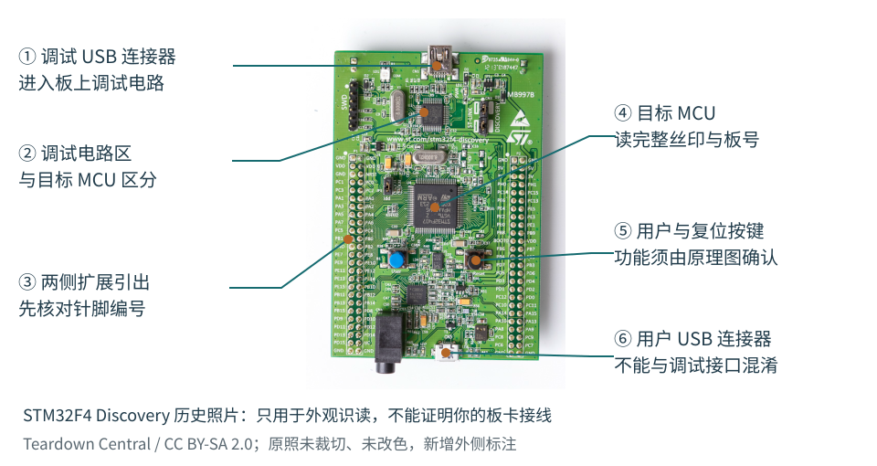
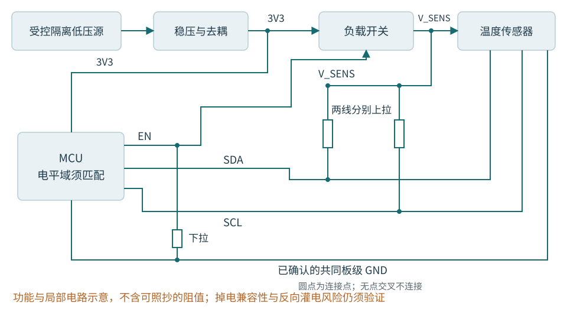
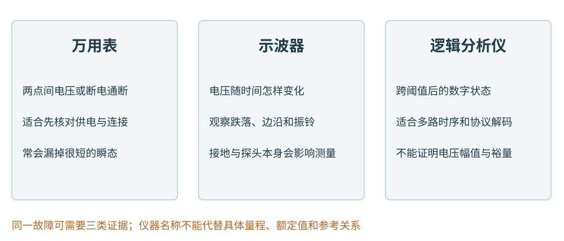
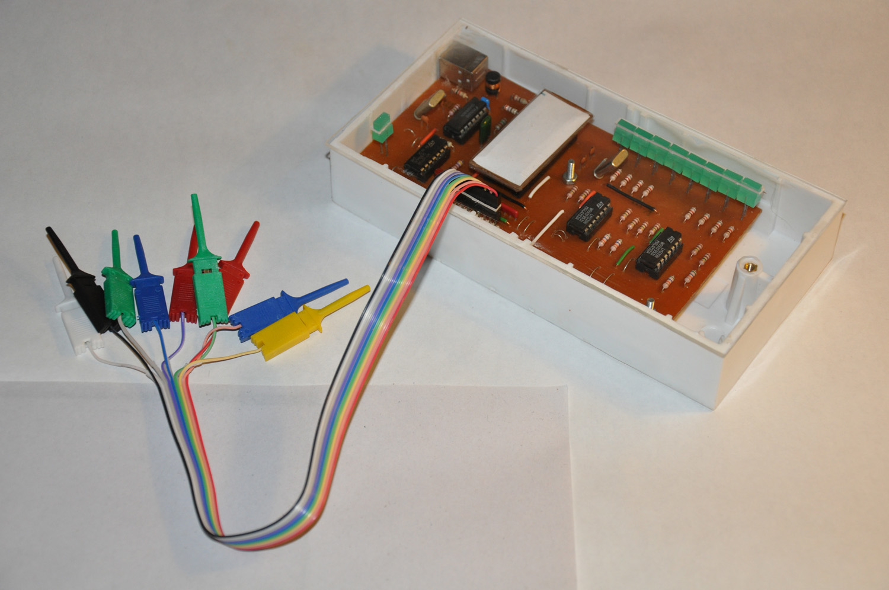
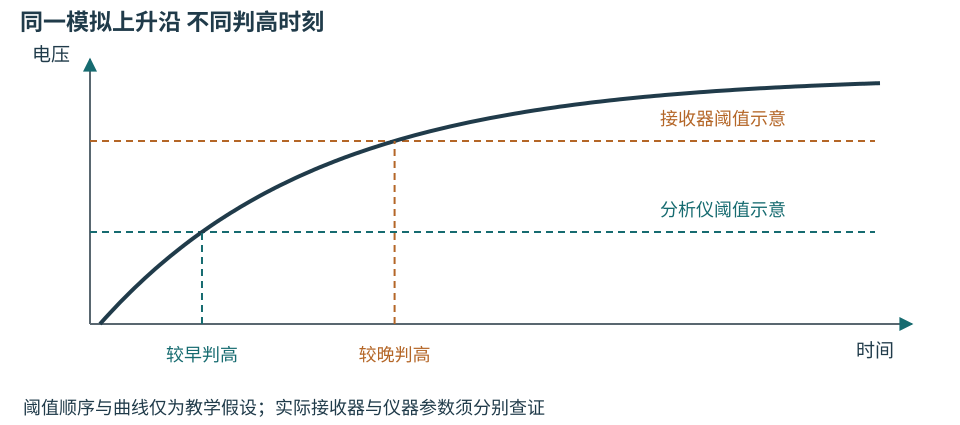

# 第十六章 看懂板卡 电路与测量工具

温度监测程序显示“设备在线”，只能说明某条通信路径给出了回应。传感器可能还没有供电，读数可能来自上一次采样，板上的电源也可能在某个瞬间跌落。程序要解释这些现象，就得越过变量和函数，认识电压、连接与时间。

本章把一块低压温度节点分成可理解、可查证的几部分：先由照片找到器件，再用位号、物料表和原理图确认职责，最后选择能回答问题的测量工具。读完应能说明“这个软件判断需要哪些硬件前提”，并在证据不足时知道下一步该查什么。

本章所有电路与故障数据都是教学构造，未接线、未上电、未做板上测试。操作范围只限资料完整、供电与参考关系已确认、与危险能量源隔离的低压教学板。遇到未知设备、市电、高压、大电池或可能产生危险运动的负载，应停止，交由具备相应能力的人建立安全方案。不能把“只有几伏”当作整套连接安全的证明。

## 16.1 用三份资料认识一块板

### 16.1.1 照片建立位置感 料号确定能力

**微控制器**（MCU）把处理器核心、存储器和外设集成到一颗芯片。**封装**把芯片内部连接引出为管脚或焊球；**开发板**在芯片之外增加供电、连接器、按键、时钟和调试电路。核心、芯片、封装、板卡是不同层次。“这是一块 Cortex-M4 板”尚未说明引脚、电压、存储容量和接线方式。

图16-1 用真实板卡建立位置感。标注区分目标MCU、板载调试区、两处USB连接器、排针和按键；不据照片认定具体供电跳线或器件额定值。照片：Teardown Central，2013-06-18；[原始文件及授权记录](https://commons.wikimedia.org/wiki/File:STM32F4_Discovery_(9067300323).jpg)，[CC BY-SA 2.0](https://creativecommons.org/licenses/by-sa/2.0/)。本版增加中文标注和引线，改编图沿用同一图片许可；照片不是本书实验记录。

照片中的两处USB连接器服务于不同路径。板载调试器能被电脑识别，不代表目标MCU已经执行用户程序，更不代表目标的USB功能已经正常。ST的板卡手册分别列出调试、用户外设和供电配置；阅读时必须匹配板号与修订，不能拿现售版本的配置直接套在一张历史照片上。[板卡资料][S16-1]

辨认外观时，可先找外部连接器、较大的芯片封装、按键与指示灯，再寻找旁边的丝印。相似外形可能对应完全不同的器件。小长方体既可能是电阻，也可能是电容；金属外壳不能证明里面是无源晶体还是有源振荡器。外观回答“它在哪、可能是哪一类”，额定电压、引脚功能和允许电流则要靠准确料号查证。

### 16.1.2 位号把实物 原理图与BOM连起来

**位号**是器件在设计中的身份，如R12、C7、U3、J2。**BOM**是物料表，记录某个位号应该装什么料号、数值、封装及装配选项。**原理图**说明器件各引脚如何连接。三者合起来才能回答“这颗器件是谁、做什么、是否装对”，单独看其中一份都不够。

| 常见器件与位号 | 在温度节点中的作用 | 还要核对的资料 |
| --- | --- | --- |
| 电阻 R | 上拉、下拉、限流或分压 | 阻值、容差、功率、是否允许不装 |
| 电容 C | 在芯片附近去耦、储能或滤波 | 容量、耐压、介质、极性及连接节点 |
| 芯片 U | MCU、传感器、稳压器或收发器 | 完整料号、封装、引脚与工作条件 |
| 二极管 D或LED | 指示、反向保护或钳位 | 类型、方向、允许电流与电压 |
| 晶体或振荡器 Y或X | 为时钟提供参考 | 有源或无源、频率、负载及供电要求 |
| 连接器 J或CN | 连接电源、信号或调试器 | 针一、视图方向、针序与配套线束 |

这些前缀是常见习惯，最终以图纸图例为准。R12不是“12欧姆”，U3也不是“第三代芯片”。BOM里的“DNP”或“不装”意味着该位置可能只留下焊盘；空焊盘不一定是漏焊。零欧姆电阻常用于装配选择或连接，它也不等于不受电流限制的理想导线。

本章使用的**I2C**是一种常见的板内串行通信总线，SDA是数据线，SCL是时钟线；两条信号线如何被驱动将在16.2节解释。

**网络**是电气上相连的一组节点，网络名让它们跨页面仍能对应。原理图中的SDA标签和另一页的SDA标签是否相连，取决于图纸的网络作用域与层级规则；相似名字不是连接证据。线条相交也不必然接通，要看连接点和绘图约定。器件引脚号、MCU端口名、连接器针号是三套编号，不能把“GPIO 5”直接当作“排针第5脚”。

可以沿一条路径练习阅读而不动手接线：从温度传感器U2的电源脚找到V_SENS网络，沿图纸回到负载开关U3，再查U3的输入、使能和默认状态；最后用BOM确认U3究竟是哪种器件。若版本B把传感器改为可关断供电，而固件仍按版本A直接读总线，“程序没有修改”就可能正是问题所在。

## 16.2 让软件成立的电路条件

### 16.2.1 电源有路径 地是参考

**电压**是两个节点之间的电势差，必须说清参考点。**电流**沿闭合回路流动；电源线送到芯片并不算完成连接，还需要设计规定的回流路径。板上写着3V3通常表示一个名义电源网络，并不保证任意时刻、任意位置都恰好是3.300 V。

稳压器把允许范围内的输入变为目标电源。其输出成立还依赖输入余量、负载、使能及外围器件。芯片旁的去耦电容为快速电流变化提供局部路径，降低相应频段的供电扰动；它不能替代容量足够、连接正确的电源。电源入口正常而传感器脚电压异常时，应沿路径查开关、连接和压降，不该仅在程序里多等一会儿。[供电设计资料][S16-2]

图16-2 教学温度节点的功能连接。3V3供给MCU和受控负载开关；使能EN默认下拉，开关输出V_SENS供给传感器与两只总线上拉电阻。所有地符号仅表示本图已确认的板级参考。没有给出可直接接线的引脚号或元件值；掉电时的引脚兼容性与上电顺序仍须按选定器件验证。

**地**首先是电路的参考与回流网络，不自动等于大地。数字地、模拟参考、机壳和保护地可能按特定方式连接，隔离两侧则可能有意不相连。万用表COM、示波器探头地夹、逻辑分析仪USB地和电脑地也未必相互独立。随手增加一根“地线”可能改变回路，甚至短接本应隔离的部分。

因此，通电前先列出所有可能供电的路径，包括USB、外部电源、调试器和信号接口。资料没有明确允许的USB与外供组合，一律不要试插。有些调试口的目标电压脚只是电平参考，不是电源输出。只有板卡手册、仪器手册和接线方案彼此一致，才进入测量阶段。[板卡供电说明][S16-1]

### 16.2.2 复位与时钟决定何时能够执行

**复位**使处理器与规定范围内的电路进入已定义状态。以常见低有效复位信号NRST为例，低电平表示复位被保持；但具体极性、脉冲宽度、释放条件及复位覆盖范围，必须查目标芯片。电源灯亮只说明对应指示支路工作，不能证明MCU已退出复位。[复位资料][S16-2]

**时钟**为内部状态变化提供时间基准。MCU可能具有内部振荡源，也可能使用外部晶体或振荡器；没有外部晶体不等于不能运行。**时钟树**把时钟源经过选择、倍频和分频送到核心与外设。主核频率正确，也不能直接推出UART波特率或采样周期正确，因为它们可能来自不同分支。

这形成一条依赖关系：供电满足条件，复位正确释放，所选时钟可用，程序才可能按预期执行；访问外设还可能需要开启该外设时钟。若有启动日志，至少能证明一段代码执行过，但无法证明所有外设都已就绪。若没有日志，也不能直接认定CPU没运行，因为串口引脚复用、收发器和主机配置都可能挡住输出。

测时钟时同样要考虑仪器的影响。晶体振荡节点可能对探头电容很敏感，探头接上后停振不一定意味着原来就坏了。优先使用芯片支持的时钟输出或专用测试点；需要测晶体引脚时，应遵循厂商推荐方案，由具备相应经验的人完成。

### 16.2.3 上拉不是软件中的一个布尔值

GPIO引脚是可配置的电路端口。**推挽输出**能够主动驱动高、低电平；**开漏输出**通常只主动拉低，释放之后由上拉形成高电平。两个推挽输出若被直接连接且输出相反，会互相争夺电平，不能靠应用程序“正常时不会这样”来保证安全。

在常用双向I2C中，多个器件可以共享两条信号线，主控制器发送地址，目标器件在规定位置用确认位回应；具体事务格式留到下一章。这里先认识它依赖的开漏与上拉条件。

**上拉电阻**把信号通过电阻连接到允许的电源域，**下拉电阻**则把它连接到参考地，为未主动驱动的节点提供偏置。图16-2的EN下拉使传感器在MCU尚未配置时保持关闭；SDA、SCL上拉则让开漏总线在设备释放线路时返回高电平。相同器件因为连接位置不同，承担完全不同的责任。

电阻限制电流，线路与引脚又具有电容，因此“释放线路”到“高电平有效”需要时间。上拉太弱会让上升过慢；上拉太强则增加拉低时的电流，可能超出器件驱动能力。多个模块各带一组上拉时，等效阻值会因并联而变小。选值要同时满足上升时间和低电平条件，不能背下一个阻值到处使用。[上拉选值资料][S16-3]

数字1和0也不是精确的电压点。数据手册用输入高、低阈值及输出保证值定义兼容范围，两个范围之间可能存在未定义区。“都是3.3 V”只说明名义电源相近，还须检查输入允许范围、输出负载、上拉电源、掉电行为及噪声余量。绝对最大额定值是损坏风险边界，不是推荐工作点。

### 16.2.4 控制器 收发器与连接器各做一件事

控制器决定字节、帧和时序；**收发器**把芯片侧逻辑信号转换成线路所需的电信号；连接器提供机械接触。MCU的UART TX/RX通常不能直接接传统RS-232接口，CAN控制器的TX/RX也不是CANH/CANL。收发器还可能有使能或待机脚，程序在发送而线路安静时，这些引脚就是必须检查的前提。[CAN物理层资料][S16-4]

同样的USB插头可以连到不同功能的适配器，目标端可能是逻辑电平UART，也可能是RS-232或RS-485。接线要查准确型号、针序、电平和隔离要求，不凭线色、接口形状或“串口”两个字判断。认识这些层次后，才能把“驱动说发送成功”与“连接器上出现兼容的波形”分成两个待验证的事实。

调试器则通过SWD（串行线调试）等专用通路访问处理器状态、存储器或调试功能。它与传送温度的业务通路可以彼此独立：调试器连得上，不证明传感器可用；业务日志正常，也不证明调试接线正确。

## 16.3 为问题选择测量工具

### 16.3.1 首次供电先约定停止条件

首次供电前，应对照正确修订的原理图和BOM确认极性、跳线、器件方向与可用测点。教学板使用设计认可的隔离低压电源，并预先确定允许电压、电流限值和停止条件；这些值来自板卡需求与审核，不能由本章提供一个适用于所有板的默认数值。

仪器、表笔、探头与附件还要逐一核对输入额定、测量类别、接地方式和完好状态，并受整条测量链中最严格的限制约束。低压板上的接口如果接到了未知外部设备，本章的教学前提就不再成立。

**限流台式电源**能在负载需求超过设定值时进入恒流区，降低输出电压；这与正常恒压供电不同。限制值过低可能让启动失败，过高又可能失去所需保护。持续限流必须按既定规程停止检查，不能不断调高上限去“冲过启动”。限流也不保证保护所有器件，电源输出储能、瞬态响应和板上其他供电路径仍会影响结果。[电源工作模式][S16-5]

异味、异常发热、反向灌电迹象、参考关系不明或接近输入额定边界，都要求停止并按台架规程断电。改变接线前先关闭输出并确认板上储能已按规程处理。不要让“再试一次”变成逐步放宽边界。

图16-3 同一条信号可以有不同证据。万用表确认稳态电压或断电连通性，示波器观察模拟波形，逻辑分析仪观察数字事件；调试器补充处理器内部状态。图中区分各自的问题边界，不是仪器接线图；任何一层通过都不能自动替代下一层。

照片16-1 实验台上的仪器外观。上方带屏幕和通道输入的是示波器，左侧橙色手持仪器是万用表，下方中间可见台式电源。照片由Radarvector拍摄，Pittigrilli在来源站点裁切；本版保留原JPEG内容，仅等比例排版。许可为[CC BY-SA 4.0](https://creativecommons.org/licenses/by-sa/4.0/)，[来源与作者](https://commons.wikimedia.org/wiki/File:Keysight_InfiniiVision_DSOX_4024A_and_digital_multimeter_and_power_supply_in_laboratory_use.jpg)。画面中的波形、读数和接线不是本书实验结果，也不是可照抄的安全接法。

同一张桌面上会出现多种仪器，不表示它们可以互相替代。电源提供能量并可在规定条件下限制电流；万用表给出所选模式下的读数；示波器记录随时间变化的电压。认出面板上的旋钮、通道和端子只是开始，真正接线以前仍需阅读相应型号的输入范围、隔离关系和探头要求。不能只看照片上的数值，推断本章教学板应采用怎样的供电。

### 16.3.2 万用表先分清电压档与电阻档

万用表测量直流电压时，将表笔跨接在两个已确认的测点之间。通电前检查黑表笔在COM、红表笔在电压输入口，功能与量程正确，表笔和绝缘完好。红表笔若遗留在电流口，却跨接电源与地，可能形成低阻通路。本章不要求初学者拆线串表测流；电流测量需要另外审核保险丝、接法、量程及负担电压。

**电阻、通断和二极管检查必须在断电条件下进行**，同时断开USB、调试器及其他可能供电的路径，并按设备规程确认电容已放电。电阻档会向被测对象施加测试激励，带电电路会干扰测量并可能损坏仪表或被测电路。不要用带电电阻测量寻找短路。[万用表电阻测量说明][S16-6]

通断蜂鸣只表示读数进入这台表规定的范围，不等于“绝对短路”。在路测量还会包含并联支路，电容充电可能使读数变化，半导体结可能使交换表笔后的结果不同。需要判断单件阻值时，应先理解这些路径，再由合适人员按维修规程隔离器件；不能因为读数小于BOM标称值就直接换件。

记录电压时也要写测点和状态。“电源3.3 V”太含糊，应写清是板输入、稳压输出还是传感器电源脚，以及节点正在启动、空闲还是采样。万用表稳定显示正常电压，可以缩小稳态供电问题的范围，但通常不能排除很短的跌落。

### 16.3.3 示波器把幅度与时间一起留下

示波器显示测点相对参考端的电压随时间怎样变化。观察之前先确认仪器结构：普通接地式台式示波器的探头地端通常与保护地相连，各通道参考端通常互通。把两个地夹接到不同电位，可能直接把那两点短接。**不得断开保护地，不得把普通探头地夹接到未知电位，也不得靠把台式示波器浮地来绕过问题。**只在已确认兼容的板级参考点连接；其余情形停止，选择经审核的测量方案。[示波器连接与安全说明][S16-7]

探头与示波器组成一条测量链。使用可切换衰减的探头时，探头档位与通道设置必须一致，否则显示幅值可能成倍出错。被动探头还应按手册在仪器补偿输出上检查补偿：欠补偿使方波顶部显得圆钝，过补偿可能出现过冲。补偿是匹配探头与输入，不是为了把被测信号“调漂亮”。短而正确的参考连接能减少引线带来的假振铃，但不能改变安全接地。[探头设置说明][S16-7]

| 设置或指标 | 它约束什么 | 容易产生的误判 |
| --- | --- | --- |
| 模拟带宽 | 输入链能保留多快的变化 | 带宽不足把尖峰或快速边沿抹平 |
| 采样率 | 记录中相邻采样点的时间间隔 | 采样稀疏漏掉短脉冲或产生混叠 |
| 记录长度 | 在给定采样率下能覆盖多久 | 放大时间窗后实际采样率降低 |
| 触发 | 按什么事件对齐并保留记录 | 触发条件不对，故障发生却没捕获 |
| 探头与输入量程 | 电压范围、负载与显示比例 | 衰减不匹配、输入过载或探头改变电路 |

带宽看模拟通路，采样率看时间离散化，二者不能互相代替。一个重复频率很低的脉冲仍可能有很快的边沿；仅按总线频率选仪器，可能看不到决定可靠性的细节。采样需求取决于最短事件、波形和重建方式，不能把“高于信号频率两倍”当作任意数字波形的充分条件。[带宽与采样资料][S16-8]

检查偶发复位时，可以在已确认的电源测点设置下降沿触发，并保留触发前记录，观察跌落与复位的先后。触发电平应根据实际允许范围和诊断目标决定。用另一路同时观察复位时，要重新检查两路共地条件。报告应保留衰减、耦合、量程、时基、实际采样率、记录长度和是否启用带宽限制；只留一张截掉坐标的波形图，无法复核结论。

### 16.3.4 逻辑分析仪读的是阈值之后的世界

照片16-2 一台八通道USB逻辑分析仪的实物示例。多根探头线把待观测信号送入采集硬件，USB接口连接上位机。作者Dilshan Jayakody，2010年，许可[CC BY-SA 2.0](https://creativecommons.org/licenses/by-sa/2.0/)，[原图与说明](https://commons.wikimedia.org/wiki/File:8_Channel_USB_logic_analyzer_(5172098012).jpg)。本版未裁切或改色。照片只建立外观认识，不证明采样率、输入电压、隔离能力或与本书教学板的兼容性。

逻辑分析仪把输入电压按阈值转换成高低状态，再记录跳变和解码。它适合检查I2C是否出现确认位、UART位宽是否合理、某个控制信号是否早于通信开始。连接前须核对输入允许电压、数字阈值、通道配置和USB地参考；能承受某个电压，不代表能正确识别更低电压的逻辑。[阈值说明][S16-9]

仪器与目标芯片的阈值可能不同。逻辑分析仪能解出字节，只证明自己的输入条件与解码设置得到了这个结果，不能证明目标端噪声余量、上升沿和过冲合格。部分仪器的所有数字通道共享阈值；部分型号具有固定阈值，不能凭软件界面外观推断能力。USB仪器也不自动隔离于电脑。[连接参考说明][S16-10]

捕获时保存原始数字边沿、实际采样率、通道映射、触发和解码参数，给最短脉冲留足辨识余量。看到NACK（非应答）时，应先确认事务阶段、地址表示和解码设置，再结合供电与模拟波形判断，不能直接断定地址写错。读事务末尾，主控制器也可以主动用NACK结束接收，因此并非每个NACK都是故障。[I2C确认位规范][S16-11] 软件毛刺过滤可以帮助观察，但开启后必须记录，因为它会改变被呈现的事件，不能把过滤后的整齐波形当成电路已改善。

## 16.4 两个故障怎样逐步缩小范围

以下是未实测的完整教学推理，数值仅用于解释证据关系。假设图16-2的低压范围、参考地、器件掉电兼容性和测点已经审核通过；不把这组记录当作任何具体开发板的接线指导。

### 16.4.1 有启动日志却读不到温度

**现象。** 主机不断收到启动后的状态日志，但温度采集报告总线忙。复位程序、延长通信超时都没有改变现象。

**补充事实。** 先确认板修订、固件构建标识和上电方式。教学节点的版本B增加了受控传感器电源，SDA与SCL上拉接在V_SENS；固件仍使用版本A初始化流程。还需确认总线没有被其他器件拉低，传感器启动等待时间来自准确手册，而非随意添加的延时。

**区分假设。** 传感器未供电、某条线路短接、引脚复用错误和驱动状态错误，都可能造成类似超时。如果只修改地址，并不能区分这些假设。首先验证电源，信息量比盲目扫描地址更高。

| 教学证据 | 当前能够支持的判断 |
| --- | --- |
| MCU供电测点3.29 V，V_SENS仅0.03 V | MCU稳态供电存在，传感器供电前提不成立 |
| EN测点保持低电平，原理图有默认下拉 | 负载开关尚未获得开启条件 |
| 构建标识对应旧初始化，未配置传感器电源使能 | 支持板修订与固件初始化不匹配的假设 |
| 上电后SDA、SCL没有形成预期高电平 | 与受控电源未开相容，不能单独证明两线短路 |

这些证据把首要问题缩小到电源使能路径，但仍要核对EN极性、实际器件和连接，不能看到一条遗漏语句就宣告结案。修正应按版本B先设置不会向未供电域灌电的引脚状态，再配置电源使能，等待电源与传感器达到规定就绪条件，最后初始化和使用总线；掉电时同样要先处理引脚状态。

**验收。** 独立冷启动、软件复位和允许的掉电再上电，都应出现正确供电顺序及新温度样本；传感器不可用时应超时并报告无效，不显示上次值为新结果。保留电源与EN波形、原始总线捕获和版本身份。“终于读到一次”只证明一次路径可行。

**追问 为什么有日志还要测电源。** 日志来自MCU，而传感器位于另一受控电源域。程序执行是局部证据；只有把它需要的电源、复位、时钟和接口条件逐个落实，才能解释端到端结果。

### 16.4.2 低速能读 高速偶发失败

**现象。** 同一教学节点在100 kbit/s下能够通信，改为400 kbit/s后偶发错误。逻辑分析仪能解出多数事务，因此有人判断“硬件没问题”。

**补充事实。** 先确认所选器件确实支持对应模式、实际SCL频率正确、地址与上电等待不变，并记录线长、连接模块、探头和上拉装配。降低速率既改变数字时序，也改变电路能够恢复高电平的时间，因而不能只指向软件或硬件中的某一方。

**区分假设。** 候选原因有上升过慢、设备时序限制、软件处理不及时和解码条件错误。示波器若在接收端观察到低电平释放后缓慢爬升，而逻辑分析仪过早把它判断为高，便解释了两件仪器为何给人不同印象。

图16-4 同一上升沿跨过不同阈值的时刻不同。曲线、阈值和判高时刻标记均为教学示意；不把接收器实际阈值画成所有器件通用的固定数值。I2C上升时间使用规范规定的测量区间，与某台逻辑分析仪何时判高不是一回事。

作量级校验时，假设等效上拉为10 kΩ，总线电容为100 pF。简单RC模型在30%到70%电源电压间的上升时间约为0.8473RC，即0.85 μs；这已经超过I2C Fast-mode规定的300 ns上限。电容是此处的教学假设，真实板上必须评估线路、器件及探头的合并负载，并用合适测量核查。[I2C规范6.1节表11及7.1节][S16-11]

**修正与验收。** 先排除探头负载、参考引线或补偿造成的测量失真，再评估减小总线电容、调整上拉或采用经支持的较低速率。减小上拉阻值会增加拉低电流，必须同时验算所有参与器件的低电平保证值和允许吸收电流，不给出一个可盲换的阻值。改动后检查接收端上升时间、有效高低电平和规定时序，并在约定电源、温度、线束及通信负载范围内复核失败率。只在室温短线上连读成功，证据仍不够。

**追问 降速后成功能否算修好。** 如果较低速率满足系统时限，且在约定边界条件下验证通过，可以成为正式方案；若只是让问题暂时少发生，则只是诊断线索。设计选择需要说明约束和验收，不能用波形看起来还行代替。

## 16.5 温度读数属于整条测量链

温度传感器首先感受到自身敏感部位的温度，安装与热传递决定它多快接近待测对象。之后，信号经过转换、数字处理、总线、固件、主机换算与显示，才成为用户看到的数值。通信校验通过不能证明热接触正确，也不能证明量程、单位与补偿系数正确。

**分辨率**是能够区分的读数步进，**重复性**关心相同规定条件下多次结果的离散程度，而与参考值接近的程度又是另一问题。显示0.01 ℃步进，不等于误差只有0.01 ℃。一条平滑曲线也可能来自强滤波或重复显示旧样本。记录应至少保留设备身份、原始值、单位、采样时刻、有效状态和校准版本；主机接收时刻另行记录，不能拿它冒充测量发生的时刻。

**校准**建立示值与参考量之间的关系；**调整**改变系统响应；**检验**按规定限值决定接受与否。三者会在测试工站相遇，但不能混为“测一下”。工站是按既定流程连接、测试和记录产品的设备与软件组合；治具则提供可重复的定位、接触与激励。接触不良或参考器具异常，也可能造成整批“产品不合格”。

例如，假设教学节点在参考读数20 ℃与40 ℃处分别示值20.6 ℃与40.8 ℃，可拟合线性修正T＝20＋(x－20.6)×20/20.2。若独立参考读数30 ℃时节点示值30.72 ℃，修正后约30.02 ℃，仍有约+0.02 ℃偏差。这个检查点没有参与拟合，因而能检验模型在两点之间是否仍适用；两个拟合点对得上，本来就是计算的结果。

上述数字不是实测，更未给出合格结论。还要考虑参考器具、环境稳定性、温度梯度、重复性和模型残差带来的不确定度，并采用项目规定的判定规则。不能靠放宽系数范围掩盖错料、焊接或安装问题。计量溯源需要可说明的校准链及不确定度贡献，“用了名牌温度计”本身不能建立这条链。[温度计量溯源说明][S16-12]

工业记录应能从一台节点的序列号回到板修订、固件、治具、参考器具、原始读数、修正系数和判限版本。这样，偏差出现在现场时才能区分器件变化、接触问题、算法变更与参考链变化，而不是直接覆盖旧系数后宣布恢复。

## 16.6 把下一步交给可核查的条件

读懂板卡不要求先成为电路设计师，但需要形成一个稳定顺序：确认对象和文档版本，建立电源与参考关系，检查复位和时钟，再沿控制器、引脚、线路到传感器查证。工具也按问题选择，不能用更多截图替代更清楚的假设。

一份最小而有用的测量记录，应包含板号与修订、固件标识、供电与接线、测点、仪器与探头、关键设置、原始捕获、观察条件，以及结论仍未覆盖的范围。没有观察到故障，应写清捕获窗口和条件，不写成“故障不存在”。

后续MCU章节以NUCLEO-F446RE和STM32F446RET6的官方资料作为文献主线，并在第17章说明板图、参考手册和环境身份。这只是文献参照的选定，未采购或确认实物板修订，也未冻结外接温度器件和可执行工具链组合。图16-1的STM32F4 Discovery仍只用于识读，不能与后续参考板混同。实际实施前必须核对完整料号与板修订、官方原理图/BOM、勘误、引脚复用、供电与掉电行为、调试连接，并补齐编译、烧录、独立启动和测量证据。下一章把这些硬件条件映射到启动流程、GPIO和外设配置。

## 本章资料与核验范围

技术网页与手册核验日期为2026-10-06。文献支持机制和安全边界，不构成本章硬件实测；具体型号操作仍须阅读对应版本手册。

- [S16-1 ST STM32F4DISCOVERY产品页与板级资料][S16-1]；[UM1472 Rev 9](https://www.st.com/resource/en/user_manual/um1472-stm32f4-discovery-stmicroelectronics.pdf)，用于板卡层次、调试区及供电配置
- [S16-2 ST AN4488 Rev 7][S16-2]，用于STM32F4供电、复位与时钟条件；不把其中单一型号参数推广到全部MCU
- [S16-3 TI SLVA689 I2C上拉电阻计算][S16-3]；[S16-4 TI SLLA270 CAN物理层要求][S16-4]
- [S16-5 Keysight E361xA电源手册][S16-5]；[S16-6 Fluke电阻测量说明][S16-6]
- [S16-7 Tektronix示波器与探头设置][S16-7]；[S16-8 Tektronix带宽与采样率说明][S16-8]
- [S16-9 Saleae输入阈值与允许电压][S16-9]；[S16-10 Saleae安全与隔离说明][S16-10]
- [S16-11 NXP UM10204 Rev 7.0][S16-11]，2021-10-01，6.1节表11及7.1节上拉计算
- [S16-12 NIST温度计量溯源说明][S16-12]，用于参考链及测量不确定度的区别

[S16-1]: https://www.st.com/en/evaluation-tools/stm32f4discovery.html
[S16-2]: https://www.st.com/resource/en/application_note/an4488-getting-started-with-stm32f4xxxx-mcu-hardware-development-stmicroelectronics.pdf
[S16-3]: https://www.ti.com/lit/an/slva689/slva689.pdf
[S16-4]: https://www.ti.com/lit/an/slla270/slla270.pdf
[S16-5]: https://www.keysight.com/gq/en/assets/9018-01077/user-manuals/9018-01077.pdf
[S16-6]: https://www.fluke.com/en-us/learn/blog/digital-multimeters/how-to-measure-resistance
[S16-7]: https://www.tek.com/en/documents/primer/setting-and-using-oscilloscope
[S16-8]: https://www.tek.com/en/documents/primer/evaluating-oscilloscopes
[S16-9]: https://www.saleae.com/support/specifications-hardware/electrical-characteristics/supported-voltages
[S16-10]: https://www.saleae.com/support/specifications-hardware/product-comparison-and-selection/safety-and-warranty
[S16-11]: https://www.nxp.com/docs/en/user-guide/UM10204.pdf
[S16-12]: https://www.nist.gov/pml/sensor-science/thermodynamic-metrology/mercury-thermometer-alternatives/mercury-thermometer-8
