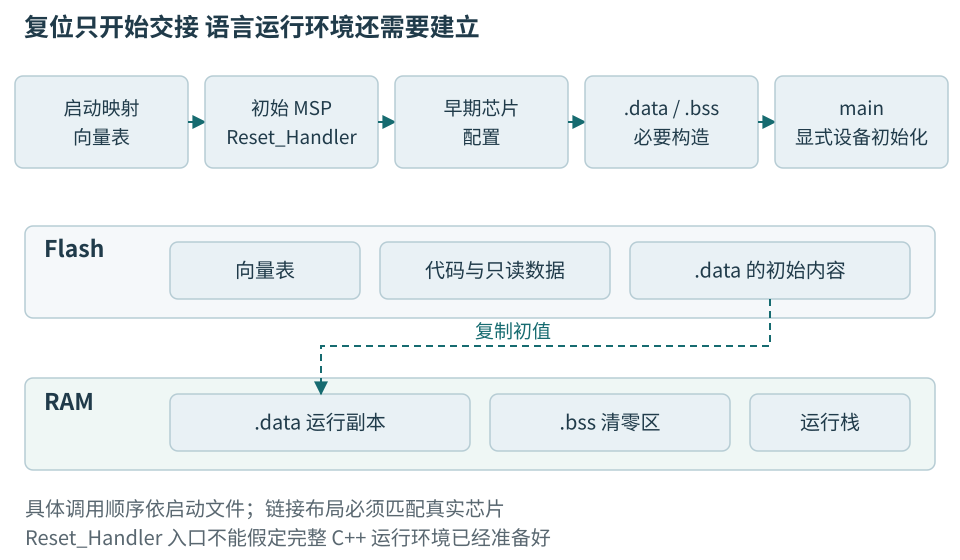
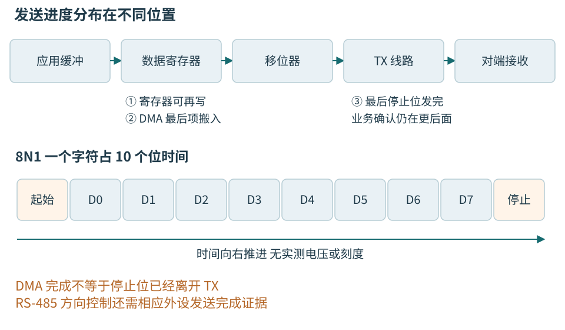
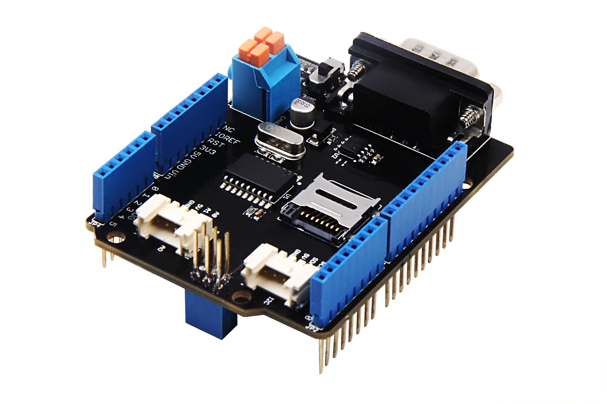

# 第十七章 MCU启动 GPIO与外设通信

微控制器的程序从复位入口开始，而不是从电脑替它调用的main开始。代码要先获得可用的栈、正确的初始数据和必要的时钟，再让一个外设工作。外设内部产生信号后，还要经过引脚复用器、焊盘和板上线路，才能被另一端收到。理解这条路径，才能解释为什么同一份“发送成功”的返回值，有时对应完整报文，有时连接器上什么也没有。

本章把低压温度节点的MCU文献主线确定为NUCLEO-F446RE开发板与STM32F446RET6芯片，处理器为Cortex-M4。这里确定的是教材解释寄存器、存储和外设的参照对象，不是采购、实物确认或板上验证。板级资料采用UM1724 Rev 17，解释时以MB1136-F446RE-C04资料分支为参照；实际板号、焊桥、硅修订仍须逐项核对。芯片参考手册是RM0390 Rev 9，数据手册为DS10693 Rev 11，发布于2026-05，勘误为ES0298 Rev 8（2025-02）；不能用另一款STM32F4的RM0090替换它。Cortex-M7的数据缓存放到下一章作为另一类系统说明，不能安到本章芯片身上。

代码均为未编译、未运行的教学片段，缺少可直接烧录工程的启动文件、链接脚本、完整板级初始化与错误出口。本章所说的实际测点只适用于供电、电平、参考关系已审核的隔离低压教学板，不涉及动力输出。连线与更改跳线前断电，并断开其他供电路径；GPIO不直接驱动电机、继电器或任何未经确认的外部负载。

## 17.1 从芯片资料找到程序的起点

### 17.1.1 四种手册回答四种问题

**数据手册**告诉我们准确料号有什么能力，以及在什么电压、温度和负载条件下保证这些能力。引脚表、复用表、存储容量、输入阈值和时钟限制通常从这里找。**参考手册**解释片上模块怎样配置，例如某个状态位何时置位、怎样清除、复位值是什么。**内核编程手册**解释处理器异常、寄存器与指令行为。**板卡用户手册和原理图**则告诉我们芯片外面实际接了什么。最后还要读**勘误**，它记录某些硅修订已知的行为限制和规避条件。

这几份资料不能互相替代。参考手册说某个UART支持某种功能，不代表选定封装引出了所需引脚；芯片支持外部晶体，不代表开发板焊了晶体；板卡照片有USB插座，也不表示目标芯片的USB应用已经实现。针对一个问题，先把依赖写完整，再去对应资料中找证据，效率通常高于从第一章逐页背寄存器。

本书使用的STM32F446RE具备512 KiB片上Flash和128 KiB普通SRAM，另有独立条件下使用的备份SRAM。普通SRAM分为SRAM1和SRAM2，并不是原书另一款F4中用于说明的CCM组合。容量和总线可达性要查准确料号；不能看见“F4”就复制整个内存图。[芯片数据手册][S17-1] [RM0390文献入口][S17-2]

对温度节点，一份可复查的身份记录应同时写板号与修订、MCU完整料号与硅修订、传感器模块与修订、工具链、厂商库、链接文件和构建选项。教材目前没有确定一套经过构建和烧录验证的工具链镜像，也没有把某个外接温度模块定为通用接线方案。传感器返回原始值后的单位转换属于驱动边界，应用使用temperature_mC表达毫摄氏度。这样，后文无需把某个器件寄存器格式误当作全书协议。

### 17.1.2 地址相同的形式具有不同的访问含义

**内存映射**规定处理器发出的地址由哪块存储器或哪个外设响应。Flash保存程序和常量，SRAM保存运行数据，外设寄存器则把读写变成控制动作或状态观察。它们在C++里都可能表现为一次加载或存储，但行为完全不同。

从SRAM同一地址连续读两次，通常只是取得两次内容；读取串口数据寄存器，可能取走一个字符并改变接收状态；读取某个状态寄存器，再读取数据寄存器，还可能构成规定的清标志序列。向普通变量写一个值是在保存数据，向GPIO的置位寄存器写掩码则是在请求改变输出。寄存器还可能只允许某种访问宽度、禁止对保留位写任意值。一个“合法地址”不是充分条件。

厂商头文件把寄存器映射为有固定布局的类型，减少手写地址和位移的错误。这是工具链、头文件和芯片接口共同建立的约定，不是ISO C++单独赋予任意整数地址的能力。业务代码不应到处散布地址；板级驱动集中承担映射、时钟与访问顺序，向温度应用暴露“开始一次采集”“取得有效样本”这样的有限接口。



图17-1 复位后依次建立执行前提。Flash中的初值与RAM中的运行副本属于不同位置；向量表、启动代码、链接安排和C++初始化共同决定main是否能够按语言规则工作。图为逻辑关系，不表示所有工具链采用完全相同的函数调用顺序。

### 17.1.3 向量表先交付栈和入口

在本章Cortex-M4参照中，复位时处理器从启动映射下的向量表取得初始主栈指针和复位处理函数入口。随后异常入口也通过向量表寻找对应处理函数。芯片的启动配置决定哪片存储器映射到初始启动位置，因此“应用写到了Flash”与“复位后实际选择这份应用”是两个问题。[Cortex-M4用户指南][S17-3]

**栈指针**指向用于函数调用现场、局部对象和异常现场的存储范围。初始值必须落在允许的RAM位置，并满足架构和工具链要求的对齐。它不是随意选择的“大地址”。若链接配置使用了比实际芯片更大的RAM，第一次函数调用或异常入栈就可能越界，失败甚至早于串口初始化。

复位处理函数通常要完成数据区初始化。对于链接安排在RAM中运行的已初始化可写静态数据，常见做法是把初值随镜像保存在Flash，启动时复制到RAM；链接器指定的零初始化区域则由启动代码清零。工具链常把它们称为.data和.bss。只读常量可以直接留在Flash，特殊保留段也有独立规则，不能仅凭变量初值是否为零判断段归属。真正重要的是装载地址、运行地址和初始化动作一致。[链接地址说明][S17-9]

例如，一个运行时计数器初值为3，它在Flash中需要保存一个可复制的初值，在RAM中需要一个可写位置。一个1024字节的零初始化接收数组则主要增加RAM预算，不必在原始二进制里存1024个显式零。仅比较.bin文件大小，会漏掉.bss、栈、堆和运行期缓冲；仅比较.data大小，又会漏掉它在Flash中的初值副本。

C++还要求执行必要的静态对象动态初始化，然后才能进入正常应用。具体启动文件可能先调用SystemInit，再建立某些运行库状态，或通过运行库入口完成构造；顺序要以选定工具链启动文件为准。不能在一个全局对象构造函数里默认UART、RTOS和调试输出已经可用。让构造函数只建立内存内状态，再在main内显式初始化设备，通常更容易说明依赖和失败出口。

### 17.1.4 链接布局是一份必须兑现的空间安排

**链接脚本**把代码、常量、数据、向量表和保留区放到目标地址。它不能创造硬件不存在的空间，也不会自动知道哪些区域被引导程序、校准参数或更新状态占用。若产品预留前部Flash给引导程序，应用的链接地址、向量表位置、升级包元数据和引导交接必须一起改变。

假设教学镜像包含80 KiB代码常量、4 KiB已初始化数据、12 KiB零初始化数据、6 KiB任务与异常栈、4 KiB通信缓冲。若这些项目互不重复，Flash至少需要80+4＝84 KiB，RAM至少需要4+12+6+4＝26 KiB，尚未加入对齐、运行库、内核对象和诊断预留。这是空间清单，不是本章工程实际输出。某个接收数组已经在.bss内时，不能又把它单列加一次；内存预算要从链接映射核对归属。

栈与堆也必须有边界。堆是运行期分配器管理的存储，栈由调用与上下文使用，两者的增长不一定在越界前发出可恢复错误。MCU上常见的“偶发变量变成奇怪值”，可能来自早前的栈覆盖。对齐、保护区和未使用余量要真正进入布局，不能只存在于设计文档。

烧录工具使用的格式又是另一个层次。ELF通常带段、地址、符号和调试信息，原始.bin没有这些完整元数据；Intel HEX等格式表达地址和记录校验。选对文件名不代表写对地址。验证应区分传输成功、写入成功、回读匹配、复位启动正确版本和业务握手通过，每一步都留相应证据。

## 17.2 时钟和GPIO把软件意图送到引脚

### 17.2.1 外设频率从时钟树推导

**时钟树**把内部或外部振荡源，经锁相环和分频器送到处理器、总线和外设。主核频率不是所有模块的频率。一个UART通常从规定的外设时钟分频得到波特率；某些定时器时钟还具有特定的倍频规则。切换主频后UART失准，可能不是UART寄存器随机损坏，而是旧分频值仍对应旧输入时钟。

本章最小启动的文献策略是先理解复位后的内部时钟路径，再按需要切换，不把某块板的外部晶体频率当成默认事实。NUCLEO板上时钟可能来自板载调试区的时钟输出或其他装配选项；脱离调试区后的启动条件必须重新核对。实际时钟源与焊桥由相应板修订的原理图决定。[NUCLEO板级手册][S17-4]

改变时钟应从允许范围倒推顺序：电源工作条件、Flash等待周期、振荡源就绪、总线分频和实际切换状态都要成立。提高时钟前若Flash等待条件不足，处理器可能无法稳定取指。只写“启用PLL”不能证明它已经锁定；等待就绪必须有超时和失败策略，不能让设备永远卡在一个没有诊断的while中。

总线时钟门控又是局部开关。GPIO端口与UART外设各自可能需要开启时钟，外设复位状态也要正确释放。开启时钟后何时允许继续访问，应使用厂商认可的顺序和接口。初始化并不是给寄存器填一组数，而是从已知状态建立一串依赖。

### 17.2.2 GPIO端口内部包含配置和读写通路

GPIO的“输入”“输出”“复用”“模拟”是焊盘连接方式，不只是枚举名称。输入模式把外部电平送到输入通路；输出模式让软件控制驱动器；复用模式把驱动或输入交给UART、SPI等外设；模拟模式用于相应模拟功能，并可能关闭部分数字输入电路。推挽或开漏、上拉下拉、输出转换速度又分别约束电气行为。

对本章参照板，板载用户LED与PA5关联，USART2常见教学通路使用PA2/PA3并经板载ST-LINK虚拟串口到主机。实际装配、焊桥与扩展板占用仍必须以准确板图核对，不能让另一块扩展板同时驱动这些信号。这里提供的是读图定位，不提供带电接线指导。[UM1724的LED及USART段][S17-4]

输出初始化要避免暴露不需要的瞬态。若某个低压使能信号要求默认关闭，应先按器件规则准备输出锁存值，再切换为输出模式，并确认复位期间外部偏置能够维持安全状态。程序最终写了低，不表示在它执行之前线路从未变高。软件不能替代上电和复位阶段的硬件偏置。

STM32F446 GPIO提供置位/复位寄存器BSRR，允许一次写入相应掩码改变选中的输出位。与对ODR执行读改写相比，它避免了为改变一位而把其他位的旧快照写回。下面只表达已经完成初始化后的LED写入，初始化责任故意留在板级层。

```cpp
// 教学片段；未编译、未执行；使用目标芯片CMSIS头文件。
// 前提：PA5确属本板LED，GPIOA时钟和输出模式已配置。
#include "stm32f446xx.h"
#include <cstdint>

void set_board_led(bool on) noexcept {
    constexpr std::uint32_t pin = 1u << 5;
    GPIOA->BSRR = on ? pin : (pin << 16);
}
```

这个函数没有证明任何GPIO都允许相同电流，也没有让“配置模式并写多个引脚”的整个过程变成原子事务。它的接口名限定为本板LED，避免业务代码把它误用于控制任意负载。若使用厂商HAL写入接口，也要能解释它最终执行的寄存器语义；抽象的价值是集中责任，而不是让读者不再了解责任。

### 17.2.3 读输入要处理漂浮和抖动

输入读数由芯片阈值决定，而不是由理想的零伏和供电电压两点决定。未连接输入可能随噪声变化，上拉下拉为它提供弱偏置。偏置是否来自内部、外部或其他器件，要在板图中确认；不能同时启用一个内部下拉又假定外部很弱的上拉一定获胜。

机械按键闭合和释放会产生多个边沿。一个简单的时间去抖方法是周期采样，只有输入在约定窗口内持续相同才接受新状态。窗口由按键、采样周期和响应需求决定，没有一个适合所有接点的万能常数。只在第一次边沿后盲目延时再读一次，可能碰巧读到另一段抖动；在ISR中阻塞等待又会拖延其他事件。

更完整的去抖状态应分开保存“当前接受状态”“候选状态”和“候选开始时间”。候选连续稳定后才改变接受状态，并只发布一次变化。温度节点的维护按钮可以用这种逻辑触发一个软件请求，但危险动作不能仅靠一个未去抖GPIO直接决定。输入开路、接地异常、长期抖动也应有可解释结果。

**追问 把GPIO速度设最高是否更可靠。** 通常不能这样推断。速度设置往往影响输出边沿和驱动特性，边沿更快可能增加振铃、串扰和电磁辐射。满足接口时序所需的配置才有意义；慢速LED与按键不会因为最快边沿获得更准确的业务行为。

## 17.3 UART从一个字符走到一条温度报文

### 17.3.1 异步串行如何约定采样

**UART**是通用异步收发器。发送端依次输出起始位、数据位、可选校验位和停止位，接收端根据起始边沿建立本字符的采样节奏；双方没有另外传送一根连续时钟。因此必须约定波特率、数据位数、校验和停止位。每个字符重新获得起始参考，仍需考虑双方时钟误差、采样方式、线路边沿和噪声，不能用一个随意的误差百分比保证所有配置。

本书串行教学例采用115200 bit/s、8数据位、无校验、1停止位，简称115200 8N1。每个数据字节占10个线路比特，理想吞吐上限为11520字节/秒。16字节温度帧仅串行化约需1.389 ms；若每100 ms产生一帧，平均负荷约160字节/秒，远低于该上限。平均富余不代表不会溢出，启动日志、批量读取和主机阻塞可能形成突发。

UART的TX、RX是芯片逻辑信号，不是RS-232电气接口。优先使用已由板级资料确认的板载虚拟串口路径，避免初学阶段增加未知电平转换。使用外部适配器时，必须先确认逻辑电平、掉电容忍、参考关系和针序；在断电状态更改连接，不能把适配器供电脚随意与USB供电并联。



图17-2 应用缓冲、UART数据寄存器和线路移位器不是同一个位置。数据寄存器可写、DMA搬运完成和最后停止位离开引脚是三种事件。图中字符时序按教学8N1表达，不作为任何测量截图。

### 17.3.2 初始化需要打通完整通路

UART可工作的前提至少包含正确外设时钟、引脚复用、波特率与字符格式、收发方向、状态清理及使能。若采用USART2，必须查它的时钟来源和PA2/PA3对应的复用编号；不能把主核频率直接填给波特率计算，也不能把其他系列的寄存器位名照搬过来。

初始化完成后，先只让一项小而有界的动作可观察。例如发送固定的启动标识，再发送由明确函数产生的短报文。固定内容用于验证字节路径，不等于已验证温度传感器。在传感器尚未选定和初始化时，可以发送带明确测试身份的教学数据，不能把它显示成真实测量。

接收路径还要考虑开机已有残留字符、噪声和对端先启动。初始化时怎样处理接收状态，需符合该外设手册。应用解析器应从“尚未同步”开始，不能假定第一字节一定是帧头。主机打开端口有时会触发板级复位或控制线变化，这同样要观察准确硬件路径后判断，不能推广为所有虚拟串口的行为。

### 17.3.3 轮询是一种有边界的等待方式

**轮询**是软件反复检查硬件状态，条件满足后继续。它适合解释最小路径，也适合有严格短上界的操作，但CPU在等待期间难以承担其他工作。若串口因配置错误永远不就绪，一个无期限轮询就会使整机停止进展。

下面用一个板级适配接口表达发送一个字符的逻辑。适配器负责读取准确芯片状态、写数据、提供不会被此等待阻断的单调时基；片段不伪装成完整HAL工程。

```cpp
// 教学片段；未编译、未运行。只演示有界轮询契约。
#include <cstdint>

enum class SendStatus { accepted, timeout, hardware_error };

struct UartPort {
    bool has_error() const noexcept;
    bool data_register_empty() const noexcept;
    void write_data(std::uint8_t value) noexcept;
};

std::uint32_t monotonic_ms() noexcept;

SendStatus put_byte(UartPort& port, std::uint8_t value,
                    std::uint32_t timeout_ms) noexcept {
    const auto start = monotonic_ms();
    for (;;) {
        if (port.has_error()) {
            return SendStatus::hardware_error;
        }
        if (port.data_register_empty()) {
            port.write_data(value);
            return SendStatus::accepted;
        }
        if (std::uint32_t(monotonic_ms() - start) >= timeout_ms) {
            return SendStatus::timeout;
        }
    }
}
```

无符号差值可在一次计数回绕附近表达短的经过时间，但前提是实际等待和两次检查间隔不跨越无法区分的完整计数周期，timeout_ms也受接口范围限制。若时基靠被禁止的中断递增，等待内部又长期关中断，“带超时”仍可能永远不超时。时钟来源是这段函数的实质前提。

返回accepted只说明数据寄存器接受了这个字符，不说明线路已发完，更不说明主机接受了一个完整应用帧。需要等待线路空闲时，应按USART的传输完成条件处理。若用RS-485收发器方向控制，过早撤销驱动使能可能截掉尾部停止位；本书不提供具体收发器接线，原因正是该条件必须与硬件绑定。

### 17.3.4 一个帧需要哪些字节

UART只提供有序字符流，不提供“温度消息”的边界。全书教学协议使用两个同步字节A5、5A，随后是1字节版本、1字节类型、2字节小端载荷长度、4字节小端sequence、载荷和2字节小端CRC。载荷上限64字节，整帧为12＋载荷长度。温度类型为01，载荷恰好4字节，按有符号32位小端编码temperature_mC；25000表示25 ℃。

CRC使用CRC-16/CCITT-FALSE参数组，覆盖版本到载荷末尾，不覆盖两个同步字节或CRC自身。CRC算法、初值、反射和输出规则必须遵循全书协议定义，不能只写“CRC16”就宣称双方一致。协议版本1的温度帧总长16字节。sequence是采样序号，主机generation是一次连接会话的本地代际，不上线路，也不能冒充设备启动身份。

业务结构体不能直接memcpy到串口。编译器可能插入填充，本机端序可能不同，字段大小和有符号解释还需约定。编码器逐字段写入字节，接收器在长度、版本、类型及CRC通过后再形成进程内对象。字段检查顺序也有意义：不能先按不可信长度分配内存，再检查是否超过64。

接收一次得到7字节，再得到9字节，可以正好组成一个温度帧；一次得到32字节，也可能是两帧；一次得到16字节却从中间开始，则不是完整帧。解析器需要累积有限数据，并在非法长度或校验失败后按协议重新找边界。同步字节也可能出现在载荷中，因此不能每遇见A5、5A就无条件丢弃当前已知长度的帧。

启动日志和二进制帧共用一个串口，会让协议复杂化。教学节点若需要调试文本，应在独立通路输出，或把诊断设计成明确的协议类型；不能让任意printf混入二进制数据后再要求上位机“自动识别”。printf自身还可能使用锁、分配和阻塞输出，中断中调用尤其需要谨慎。

### 17.3.5 错误检测发生在不同层

UART的奇偶校验、帧格式错误和过载错误，是接收硬件对字符过程的判断；应用CRC检查一组字节是否符合所选检错规则；sequence用于观察样本缺口；设备身份和握手用于确认当前对端及语义。没有哪一层能够代替全部其他层。

例如硬件过载意味着接收数据没有及时取走，至少一部分字符可能丢失。继续把当前累积缓冲当完整帧解析是不安全的，应记录错误、让解析器回到可恢复状态，并在后续合法帧中重新建立边界。只增加CRC重试次数可能使链路更忙，反而扩大过载。

温度值即使CRC正确，也可能超出传感器有效范围、来自旧配置或是重复样本。驱动与业务应保留有效状态、采样序号和校准版本；协议1的简单温度帧没有携带全部元数据，不应偷偷赋予它没有的含义。设备启动身份、能力与配置关联由握手和控制协议承担，后续产品扩展应显式升级协议。

## 17.4 其他总线各自承担什么责任

### 17.4.1 SPI用时钟和片选组成事务

**SPI**通常由控制器产生时钟，通过片选选择目标器件，发送和接收线在每个时钟周期交换位。全双工只说明两方向可以同时移位，不表示同时收到的每个字节都有业务价值。读取传感器寄存器时，命令阶段收到的内容可能无意义，真正结果可能在后续虚拟发送字节期间出现。

时钟极性描述空闲电平，时钟相位描述采样与变化边沿，通常组合为四种模式。应从器件时序图同时核对采样边沿、建立保持时间、片选到首个时钟的间隔和最后时钟到片选释放的间隔，不能只背“模式0”。一个器件要求片选覆盖命令、地址和全部数据时，把每个字节拆成独立片选就改变了协议。

多个器件共享SPI时，事务所有者要同时拥有总线配置和片选。假设温度采集与外部Flash由两个任务使用，温度器件需要一种模式，Flash需要另一种模式；保护单个字节无法阻止任务在事务中间更改模式。锁或总线服务器应覆盖完整事务，同时限制最大长度和等待时间，避免一个长Flash操作无限拖延采样。

SPI通常没有统一的地址发现、链路确认或应用检错。线路有波形而读回全FF，可能是目标未选中、MISO悬空、器件忙或读命令错误。速度降低后成功只说明时序或电气余量相关的假设更值得检查。真实连线仍限已审核板内或配套低压连接，不把短排针接口直接延伸为任意远距离总线。

### 17.4.2 I2C把地址与确认放在共享线上

**I2C**使用SDA和SCL，常用模式以开漏线路实现共享。START、地址、读写方向、数据、ACK/NACK和STOP共同构成事务；读取一个寄存器可能先写寄存器地址，再用重复START切换到读方向。是否允许在两阶段之间STOP，须按器件协议，不是驱动开发者随意选择。[I2C规范][S17-5]

七位地址不含读写位。若手册写七位地址0x48，线上地址字节的高七位来自它，最低位表达方向；某些API却要求调用者提供已经左移的数值。合理适配层把I2cAddress7这样的语义集中到边界，而不是业务各处遇到失败就左移试一次。转换规则必须来自所用库的文档。

ACK说明某个阶段得到了确认，不证明温度转换已完成。NACK也不总是故障，控制器可在读完最后字节后用NACK结束接收。地址阶段未确认、数据阶段未确认、总线忙和仲裁丢失，应保留不同诊断原因。它们需要不同恢复，不能统一执行“再发九个时钟”。

总线恢复先问谁把线路拉低。短路、掉电器件钳位、目标停在半个事务、另一个控制器正在工作，都可能使线路忙。只有在独占关系、电气条件和规范允许时，才设计受控的时钟恢复或器件复位。恢复之后重新检查外设状态和传感器配置，不能把旧事务结果当成新采样。

第十六章已经解释上拉与电容决定上升速度。软件参数正确不代表模拟条件满足，而反复加大延时也不能修复掉电域灌电。温度器件供电或复位动作必须与总线引脚状态协调，避免通过信号线向未供电器件注入电流。

### 17.4.3 CAN解决总线竞争但保留业务确认责任

**CAN**把报文放到共享总线上，标识符参与仲裁。高紧急度报文可以在仲裁中优先继续，已经开始传输的帧、错误与重传仍会占用时间。名义速率除以有效载荷长度只给出很粗的下界，还需要计算协议开销、位填充、竞争和最大负载。

本章STM32F446的CAN能力不能写成CAN FD能力。经典CAN、CAN FD控制器和所选收发器需要分别确认；外设TX/RX仍需适当物理层才成为CANH/CANL。终端和拓扑必须来自目标网络设计，不能把开发板插进车辆或运行中的工业网络作入门练习。[芯片能力][S17-1] [CAN物理层][S17-6]



图17-3 Seeed CAN-BUS Shield V2实物。板上的控制器、线路收发器和连接器承担不同职责；它是外部扩展板识读例，不是F446主线必需硬件，也不保证与本书板卡直接兼容。照片：Seeed Wiki，2017-07-28；[原始文件及授权](https://commons.wikimedia.org/wiki/File:CAN_BUS_Shield_V2.jpg)，[CC BY-SA 4.0](https://creativecommons.org/licenses/by-sa/4.0/)。沿用原始照片字节，未裁切、未改色，仅等比例排版，图像保留原许可。

CAN ACK只证明总线上有接收节点确认该帧，不证明指定应用完成动作。设置校准参数这样的操作还需要目标身份、command_id、参数版本、响应和明确重试语义。把“设置为某值”重复执行通常可设计为幂等；“再加一次”若没有去重则可能重复产生副作用。

总线关闭等错误状态意味着控制器已经进入限制错误传播的状态。无限立即重启可能制造复位风暴。产品应限制重试，记录错误计数和当前配置，必要时停止业务输出并等待受控恢复。温度节点即使只有监测功能，也不能在失联后继续把旧数值标成刚测得的新结果。

### 17.4.4 USB先完成枚举再谈业务

**USB**由主机发现、枚举和配置设备，设备用描述符声明接口和端点，传输由主机调度。端点是协议中的数据通道，不是连接器上的某根针。控制、批量、中断、等时传输有不同目的和恢复规则，“中断传输”也不是设备任意时刻直接打断主机CPU。[USB规范入口][S17-7]

本章板载ST-LINK的USB接口与目标MCU自己的USB外设属于不同路径。主机识别到ST-LINK，能够支持调试或虚拟串口，不意味着温度固件实现了USB设备栈。改成目标USB CDC虚拟串口时，需要额外处理描述符、类驱动、枚举、时钟和连接生命周期。

设备复位可能导致端口消失并重新枚举，端口名也未必保持。上位机通过身份和握手建立新的generation，清理旧缓冲和未完成请求。USB传输可靠也不能取消应用消息长度、版本和状态检查，更不能把打开端口成功解释为设备业务就绪。

## 17.5 C++与厂商C接口怎样配合

C++在固件中最直接的价值是把不同责任放进不同类型：GPIO驱动拥有特定引脚，UART会话拥有发送状态，温度驱动输出带单位的值。它不要求每个对象都动态分配，也不要求开启异常、RTTI或使用桌面线程库。每项语言和库能力都应与工具链、运行库、内存和时限预算一起决定。

厂商库常使用C接口和全局回调。C++调用它们时，按头文件提供的extern "C"声明维持链接约定，不要手工重新声明一套不一致签名。由中断向量引用的函数名也必须与启动文件精确匹配；如果C++名字改编使链接器找不到实际处理函数，程序可能落入默认弱处理函数。

包装类可以禁止拷贝，避免两个对象都认为自己有权关闭同一UART；但RAII析构是否能阻塞等待DMA结束，需要接口明确。有的对象只能在任务上下文销毁，有的必须先调用stop并等待完成，再析构释放。不能把所有清理都塞进析构，随后允许对象在ISR或错误栈展开中任意离开作用域。

全局构造、局部静态首次初始化、new/delete、标准库格式化和异常传播都可能引入看不见的运行库路径。关闭异常并不证明任何函数都不会失败，只是失败需要用状态返回、受控故障处理或其他方式表达。关闭RTTI也不等于不能使用虚函数，二者机制和配置相关但不同。选择应由需要的语义与工具链支持决定，不由“嵌入式绝不能用C++”或“C++所有特性都免费”这样的口号决定。

对一个小型节点，常见的稳妥边界是：启动阶段建立有界对象，采样和传输关键路径不做无界分配；驱动接口返回明确结果；中断只做允许的有限工作；复杂诊断放到普通任务；每项缓冲都有容量、所有者和结束条件。下一章将把这些条件落实到中断与DMA。

## 17.6 没有串口输出时怎样建立证据

假设一个未实测的教学版本更新后没有启动文字。候选原因至少有供电或复位异常、启动选择错误、向量表或栈地址错误、早期初始化卡住、异常处理死循环，以及UART时钟或引脚错误。它们的共同表象是“安静”，处理方法却完全不同。

先保存镜像、符号、链接映射、烧录范围和工具记录，再确认板号、供电路径与复位来源。在经过审核的低压测点检查电源和复位时，遵守第十六章的仪器额定及参考要求，不断开保护地，不把普通示波器地夹接到未知节点。没有硬件连接条件时，只能检查资料和镜像，不凭空宣称电源正常。

若调试器能够按授权连接并停核，程序计数器可以帮助确定执行阶段。反复停在复位入口，提示检查复位循环和早期看门狗；停在故障处理，保存异常现场并核对访问地址；主循环计数确实推进而串口安静，再沿UART时钟、状态、复用和板级通路查。读取具有副作用的寄存器可能改变现场，调试器自动刷新同样需要控制。

假设教学证据显示main中的进展计数增加，USART数据寄存器持续被写入，而PA2上没有对应位宽。当前证据把问题缩到外设使能、引脚复用和板级通路附近，尚不能认定芯片坏了。若随后发现使用了另一个芯片的复用配置，应修正准确目标的板级初始化，并重新验证冷启动、软件复位、脱离调试器以及收发两方向。一次日志出现不能证明接收错误、长消息和超时恢复都正确。

另一个常见差异是单步成功、连续运行失败。断点给振荡器或外设增加了等待，也可能让DMA、定时器和外部发送者继续推进。应检查缺失的就绪等待、未定义行为和并发协议；不能把现象直接归为“优化器有问题”。版本、观察手段与时间线一起保存，才能解释一次修改究竟修了机制还是只改变时序。

**追问 会写GPIO寄存器是不是已经会固件开发。** 它是重要起点，但工程判断还包括启动环境是否正确、引脚条件是否成立、等待是否有界、报文是否有完整语义、失败后是否可恢复。能够沿语言对象、链接布局、处理器、外设和真实线路解释同一个结果，才使“程序跑起来”变成可审查的结论。

## 本章资料与核验范围

核验日期为2026-10-06。官方资料支持文献主线，所有代码、时间和容量均为教学表达；没有实际构建、烧录或测量。RM0390整本在线抓取超过工具限制，已核对官方索引与相关可检索段；实施前仍须保存完整手册与适用勘误。

- [S17-1 STM32F446xC/E数据手册][S17-1]，存储、封装与外设能力
- [S17-2 RM0390 STM32F446xx参考手册][S17-2]，存储总线、GPIO、RCC与USART；[ES0298勘误][S17-8]须按硅修订检查
- [S17-3 Arm Cortex-M4 Devices Generic User Guide][S17-3]，向量表、栈和异常入口
- [S17-4 UM1724 Rev 17][S17-4]，2025-09，板级身份、时钟、LED和USART；不代表实物已匹配
- [S17-5 NXP UM10204 Rev 7.0][S17-5]，I2C事务与地址确认
- [S17-6 TI SLLA270][S17-6]，CAN控制器和物理层；不作为CAN FD性能依据
- [S17-7 USB 2.0规范入口][S17-7]，角色、枚举与传输分类

[S17-1]: https://www.st.com/resource/en/datasheet/stm32f446re.pdf
[S17-2]: https://www.st.com/resource/en/reference_manual/rm0390-stm32f446xx-advanced-armbased-32bit-mcus-stmicroelectronics.pdf
[S17-3]: https://documentation-service.arm.com/static/5f2ac76d60a93e65927bbdc5
[S17-4]: https://www.st.com/resource/en/user_manual/um1724-stm32-nucleo64-boards-mb1136-stmicroelectronics.pdf
[S17-5]: https://www.nxp.com/docs/en/user-guide/UM10204.pdf
[S17-6]: https://www.ti.com/lit/an/slla270/slla270.pdf
[S17-7]: https://www.usb.org/document-library/usb-20-specification
[S17-8]: https://www.st.com/resource/en/errata_sheet/es0298-stm32f446xcxe-device-errata-stmicroelectronics.pdf

[S17-9]: https://sourceware.org/binutils/docs/ld/Output-Section-LMA.html
