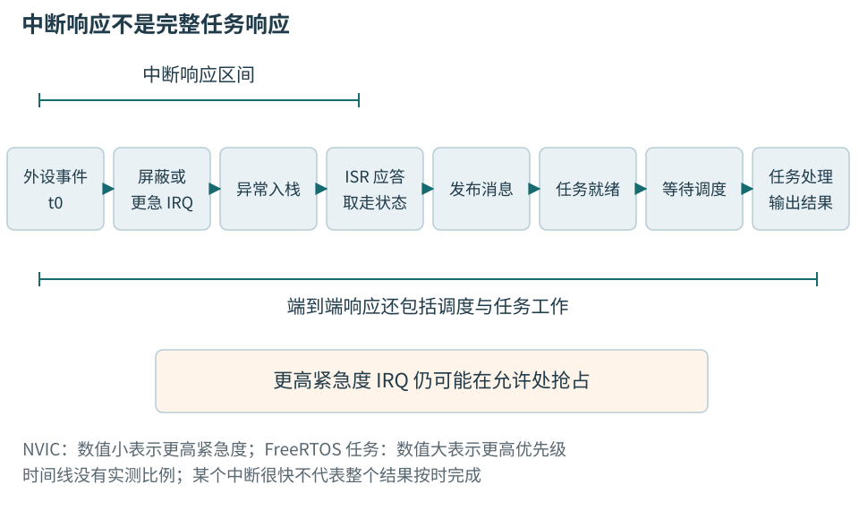
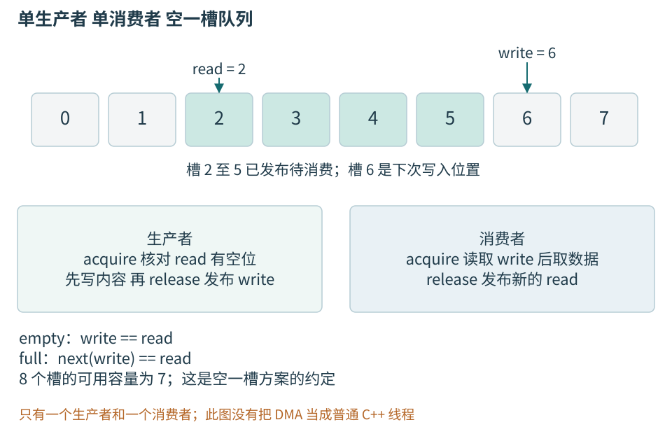
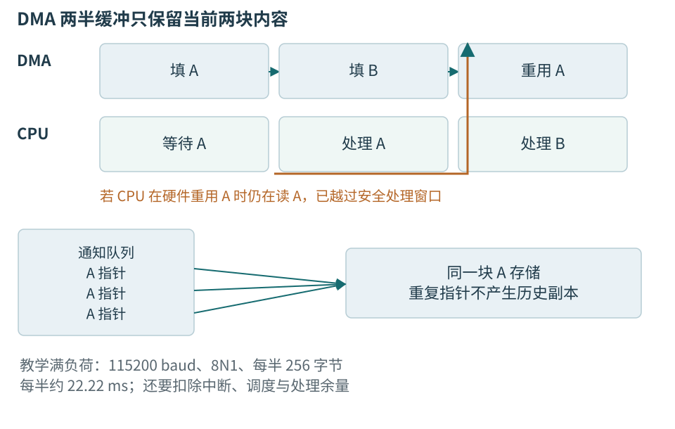
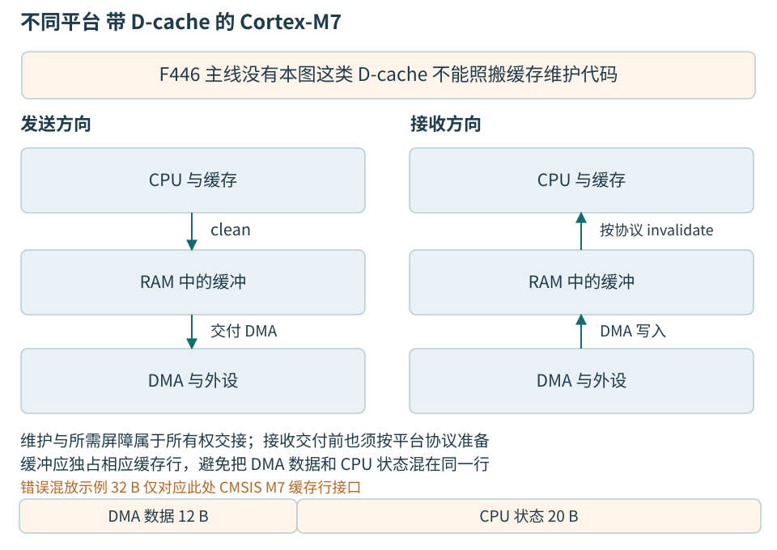

# 第十八章 中断 DMA与缓冲区所有权

外设不会等待程序走到某一行才发生事情。UART可以在主循环计算时收到字符，定时器可以在日志输出时到期，DMA可以在处理器停在断点上时继续写RAM。中断与DMA让CPU不必一直守着外设，却把一个新的问题交给软件：谁在什么时候可以修改这块状态，谁能证明一次使用已经结束。

中断负责把事件引入执行流，DMA负责让另一个总线参与者搬运数据，队列和缓冲负责把速度不同的阶段接起来。三者没有任何一种自动保存无限历史。可靠实现必须同时说明事件怎样被观察、数据怎样被发布、容量耗尽怎样处理，以及停止过程中怎样收回控制权。

本章仍以STM32F446RET6的Cortex-M4和普通SRAM作主线，以FreeRTOS Kernel V10.6.2原生GCC ARM_CM4F端口解释ISR到任务的交接条件。带D-cache的Cortex-M7只在18.5作为另一平台讨论。所有代码和时间线未编译、未执行，没有连接硬件、烧录或测量；示例服务于隔离低压温度节点，不用于运动或安全关键控制。

## 18.1 中断建立的是受约束的执行入口

### 18.1.1 外设请求 NVIC挂起与函数执行不同

**中断请求**来自外设或片内功能，例如UART收到数据、定时器到期。Cortex-M的**嵌套向量中断控制器**，简称NVIC，管理可屏蔽中断的使能、挂起、活动和优先级。**中断服务程序**，简称ISR，是请求满足执行条件后进入的处理函数。外设请求存在、NVIC已经挂起、ISR实际开始，是三种状态。

一个UART接收中断没有进入，应先检查外设接收是否发生、外设中断使能是否打开、NVIC通道是否启用、优先级是否被屏蔽、向量是否指向正确函数。只凭ISR首行断点没有命中就断言中断没有发生，会混淆不同层的失败。反过来，NVIC挂起位存在，也不保证该事件还对应一份未消费数据。

Cortex-M在异常入口保存一部分执行现场，并从向量表取得处理函数地址；异常返回按架构约定恢复被打断的状态。普通C函数能用作许多ISR，依赖的是处理器异常模型和编译器ABI的配合，不是ISR可以随意调用任何普通函数。额外的寄存器保存、浮点现场和嵌套都会影响栈与延迟。[Cortex-M4异常模型][S18-1]

本章使用的FreeRTOS端口通常让任务使用进程栈PSP，异常处理使用主栈MSP。但异常入口的硬件现场压到被打断上下文当时使用的栈，后续处理程序自身再使用相应异常栈。不能简单把“中断都用MSP”解释成任务栈完全不需要预留异常入栈空间。准确预算要查启动配置、FPU使用和端口实现。

### 18.1.2 优先级数字必须带上所属系统

NVIC数值越小通常表示越高紧急程度。FreeRTOS任务优先级则数值越大越高。写“优先级5比3高”而不说明是哪种优先级，在同一固件中就可能产生相反解释。芯片只实现部分优先级位，优先级分组还决定抢占优先级与子优先级如何划分。[CMSIS NVIC接口][S18-2]

CMSIS的NVIC_SetPriority接收逻辑优先级值并按实现位数编码，不能把已经左移到寄存器位置的数值再次交给它。RTOS配置中的某些宏则使用寄存器对齐后的编码。两种表示外观都是整数，错误却可能让本应受内核临界区约束的中断处于更高紧急度。

STM32F446文献主线的芯片头文件给出4个实现优先级位。教学配置若把这4位都用于抢占，并选择逻辑优先级5作为可调用内核API的最高紧急度边界，那么逻辑0到4的中断不得调用内核服务，5到15可在满足其他条件时调用指定FromISR接口。这只是解释边界的配置例，实际项目必须核对宏值、分组和所用端口，不能只复制数字5。[目标头文件][S18-3] [FreeRTOS端口][S18-4]

高紧急度中断仍然可以记录少量独立状态，或通过合适的低紧急度中断把工作交给内核，但共享缓冲和发布顺序仍需证明。不能为了让编译通过，把普通队列函数改名为FromISR后就认为所有中断都获准调用。允许范围来自内核保护其数据结构时作出的屏蔽假设。

### 18.1.3 响应时间包含等待 不是宣传的入口周期

**中断响应时间**应先定义起止点。对于温度节点，可以从外设完成事件出现算到ISR开始保存必要状态；对于另一项需求，也可能从引脚边沿算到实际输出变化。不同定义给出的数字不可直接比较。

等待可以来自当前临界区屏蔽、更高紧急度ISR、外设同步、总线竞争和异常入口保存。处理器手册中的理想入口周期只覆盖规定条件，不能当作整机最坏响应。若应用一次关中断2 ms，UART每86.8 μs就可能到达一个字符，入口再快也补不回没有及时处理的历史。



图18-1 外设事件、中断进入、任务就绪和任务执行是不同时间点。端到端时延还包含缓冲、解析与下游等待。时间线为教学示意，没有实测比例。

日志也是等待来源。在ISR中轮询发送一段长文本，可能把低优先级中断堵在后面；若格式化函数内部取得一个被任务持有的锁，被打断任务又无法继续释放，就可能死锁。问题不在printf这个名字，而在它实际调用链是否有锁、分配、阻塞和无界工作。

对中断而言，最有用的工作通常是保存本次必要状态，按硬件协议取得或应答事件，发布有限数据，并通知普通执行上下文处理。这个边界还需要容量与时间预算：通知任务之后，如果它不能在缓冲被重用前运行，中断再短也不能保证数据有效。

### 18.1.4 应答顺序必须来自具体外设

外设的事件标志可能通过读数据清除、先读状态再读数据清除、写零清除或写一清除。NVIC清挂起只改变中断控制器一侧；如果外设仍保持请求条件，退出后可能再次进入。因此“进中断先清所有标志”不是通用模板。

应答过早会丢证据，应答过晚又可能让请求持续。某个UART错误要求按规定读取状态和数据时，驱动应保存状态快照，并决定该字符是否可交给上层。不能让调试器自动刷新数据寄存器，再期待ISR读取到同一字符。观察动作也属于参与者。

一个共享中断向量可能覆盖多个来源。处理函数需要确认哪些条件真正成立，避免因某个来源反复触发却没有处理而形成中断风暴。循环处理多个事件时也要有预算，不能在持续到来的输入下永远留在ISR。超过预算可记录溢出或交给后续上下文，策略必须保证硬件不会无声丢失关键状态。

默认弱处理函数通常用于捕获没有实现的入口，可能停在无限循环。若C++函数没有按启动文件要求使用正确C链接名，真正处理函数虽然存在于源码里，却没有替换该默认入口。检查实际向量地址和链接符号，比只看函数名拼写更可靠。

## 18.2 共享变量需要的是协议

### 18.2.1 单核也有并发参与者

**并发**并不只意味着两个CPU同时执行指令。任务可能在更新一半状态时被ISR打断，DMA可能在CPU读取时写同一缓冲，外设可能在读改写之间改变状态位。单核只让普通CPU指令流在同一瞬间通常只有一条，不会让多步业务操作不可分割。

假设任务先写temperature_mC，再写sequence；ISR在两次写之间读取两者，就可能看到新温度和旧序号。两个字段各自都是自然对齐的32位值，也不能自动组成一份一致快照。需要规定一次更新怎样被发布，以及读取者怎样判断自己得到的是同一代数据。

另一个例子是任务读出count，准备加一时被ISR打断，ISR也加一并写回，任务恢复后再写入旧值加一。最终只增加一次。问题发生在读、算、写三个动作之间；给count加volatile不会把三个动作合成一个协议。

最简单的设计改进常是减少共享写者。让UART驱动唯一负责寄存器，让一个采集任务唯一形成Sample，让通信任务只消费不可变副本。只有真正需要跨上下文发布的数据才使用队列、短临界区或经验证的原子操作，比所有变量都加限定符更容易审查。

### 18.2.2 volatile不提供互斥和发布关系

厂商通常用volatile表达可能由硬件改变的MMIO访问，要求编译器按目标实现保留相应读写。但它不提供线程间同步，不保证复合操作原子，不延长指针所指对象的生命期，也不自动完成DMA缓存维护。普通内存的语言规则与硬件访问规则需要分别说明。[C++20公开参照][S18-5]

对“写一清除”的状态寄存器，读改写尤其危险。假设第0和第1位都置一，软件只想清第0位，却先读取整个寄存器再按位或1写回，结果把第1位也写一清除了。正确动作通常是按手册直接写选中掩码，而不是选择一个看似更强的volatile类型。

同理，GPIO的BSRR解决某种位设置操作的硬件原子性，不保证“选择模式、设置方向、输出电平”这一串配置整体不可见。原子性必须指明操作和观察者：CPU一次存储、ISR不插入的区域、设备一次事务、完整业务命令，分别是不同层次。

有时读者会问“优化关闭后就好了，是否证明要加volatile”。没有。优化改变了变量保存、访存顺序和执行时序，可能暴露数据竞争、越界、未初始化或错误生命周期。应先找出哪个参与者在修改状态，以及语言和平台为它提供了什么同步方式，再决定使用何种接口。

### 18.2.3 短临界区保护有限不变量

**临界区**是为了保持某个共享不变量而暂时排除特定并发的区域。在单核裸机上，短时间保存并屏蔽相应中断，再恢复原状态，可以保护任务与这些中断之间的共享更新。关键是恢复进入前状态，而不是离开时无条件打开中断，否则嵌套调用可能提前解除外层保护。

保护范围应尽量只包含几次必要内存操作。将串口等待、Flash擦除或协议解析放进全局关中断区，会把它们的最坏时长加到其他事件响应上。即使平均只占很少CPU，也可能违反UART接收或定时器期限。

FreeRTOS的临界区和中断屏蔽取决于端口。ARM_CM4F常用BASEPRI保护内核允许范围内的中断，并非禁止所有异常；比边界更紧急的中断仍可运行。因此，内核临界区不能保护一份同时被这些高紧急度ISR访问的共享数据。两者若必须交接，需要另外设计匹配的协议。

临界区也挡不住DMA。CPU把中断都关掉时，硬件搬运仍可能继续。因此禁止中断后读取DMA正在写的结构体，仍可能读到混合状态。要么停止并确认DMA静止，要么只读取硬件已经交还且暂不复用的部分。

### 18.2.4 原子操作仍有目标条件

C++原子类型可为普通内存建立不可分割访问和发布关系，但ISR适用性不能仅从ISO C++语法推出。编译器可能用运行库锁实现某些宽度的原子操作；若ISR打断了持锁任务又尝试同一个锁，会无法推进。需要确认目标工具链的该原子类型始终无锁，并核查生成实现、对齐、内存区域及平台对中断的约定。

自然对齐的32位访问在某款MCU上是单次总线操作，不等于64位计数器也如此。读取64位时间戳可能需要临界区、专门硬件锁存或经证明的高低位读取方法。不能因为“这颗CPU是32位”就假定所有32位地址处的数据都可任意宽度访问，尤其不能推广到设备寄存器。

原子操作适合有限的共享状态，未必适合把复杂对象都变成atomic。任务间用内核队列复制一个小Sample，往往更直接；DMA使用厂商规定的设备协议；ISR中只维护单写者计数与有限队列。工具选择来自参与者，而不是把某个关键字当作全局安全开关。

## 18.3 环形缓冲怎样发布和回收一个槽

### 18.3.1 两个索引描述的不是完整历史

**环形缓冲**在固定数组末尾回到开头，用生产位置和消费位置避免不断移动数据。生产者负责放入，消费者负责取出。若只保存两个模N位置，当它们相等时，可能是空，也可能是生产者已经追上并覆盖一圈；设计必须消除这类歧义。

一种容易说明的办法是空出一个槽：数组有N个元素，最多保存N−1个。write等于read表示空，write的下一个位置等于read表示满。它牺牲一个元素换取简单判定。另一类办法使用单调计数和受限差值，但要解释回绕、最大距离和并发读取条件，不能只把索引换成更大的整数就说问题消失。

UART字节流适合环形暂存，但缓冲中的字节不等于完整帧。解析器可能在取出若干字节后仍需等待其余部分。环满时的策略应与协议对应：丢弃新字节、丢弃最老数据或停止输入，都有不同后果。对本书温度遥测，允许报告丢失并重新同步；对需要逐条执行的命令，不得把丢弃藏起来。



图18-2 生产者先完成槽内数据，再发布write；消费者确认已发布后读取，读完再发布read允许复用。空一槽方案容量为N−1。图中只有一个生产者和一个消费者，不包含DMA生产者。

### 18.3.2 单生产者单消费者的发布顺序

下面是普通内存中单生产者、单消费者的教学队列。它使用固定数组、一个生产索引和一个消费索引。仅当目标工具链确认32位原子实现可用于本ISR场景、对象初始化已完成且整个使用期有效时，才可以把生产者放在ISR中；这里没有声称该代码已经构建或通过中断验证。

```cpp
// 教学片段；未编译、未执行。不是DMA环实现。
#include <array>
#include <atomic>
#include <cstddef>
#include <cstdint>

template<std::size_t N>
class ByteRing {
    static_assert(N >= 2 && (N & (N - 1)) == 0);
    static_assert(N <= 65536);
    static_assert(std::atomic<std::uint32_t>::is_always_lock_free);

public:
    bool try_push(std::uint8_t value) noexcept {
        const auto w = write_.load(std::memory_order_relaxed);
        const auto next = (w + 1u) & mask;
        if (next == read_.load(std::memory_order_acquire)) {
            return false;
        }
        data_[w] = value;
        write_.store(next, std::memory_order_release);
        return true;
    }

    bool try_pop(std::uint8_t& value) noexcept {
        const auto r = read_.load(std::memory_order_relaxed);
        if (r == write_.load(std::memory_order_acquire)) {
            return false;
        }
        value = data_[r];
        read_.store((r + 1u) & mask, std::memory_order_release);
        return true;
    }

private:
    static constexpr std::uint32_t mask = N - 1;
    std::array<std::uint8_t, N> data_{};
    std::atomic<std::uint32_t> write_{0};
    std::atomic<std::uint32_t> read_{0};
};
```

生产者对自身write使用relaxed，因为只有它修改这个索引；它以acquire读取read，确认消费者已经结束对要复用槽位的读取。生产者先写data，再以release发布write。消费者对write的acquire观察到相应发布后，才读取槽中数据；读完以release推进read，交还槽位。这里的同步目标是普通内存中的两个CPU执行上下文，不是给DMA发命令。

data本身不需要每字节都是原子，因为协议保证一个槽在消费者读取期间不被生产者覆盖。原子索引的目的不是“每个变量都能并发乱写”，而是建立槽位的排他使用时期。如果增加第二个ISR也调用try_push，或者任务重置索引时ISR仍运行，单生产者假设立即失效。

对象也不能在中断仍可能访问时析构。停止时应先让生产入口不再产生新访问，等待或确认在途ISR结束，再处理剩余数据和销毁对象。重连后清零索引是一次状态切换，需要与生产者协调；直接在任意时刻memset整个对象既破坏原子对象规则，也可能与当前写入冲突。

### 18.3.3 满队列的返回值是一项业务决策

try_push返回false时，数据没有进入队列。调用者必须计数、标记解析流可能有缺口，并执行明确策略。若忽略返回值，后续CRC失败只会告诉人们“数据坏了”，却失去最早的容量证据。错误计数本身也有并发规则，不能为了诊断又制造一个共享读改写竞态。

对温度遥测，可以丢弃当前不完整帧并等待下一个合法帧，同时报告丢字节计数和sequence缺口。若业务关心每个样本的完整历史，则需要证明缓冲容量、最大阻塞时间和输入背压，不能简单改成“队列满就覆盖最老”。覆盖策略还会改变消费者正在读取槽位的所有权，不能直接加在上述实现里。

“只保留最新值”是另一种数据模型。它适合界面显示当前温度，但必须保持温度、sequence和有效状态的一致快照，并记录被跳过的历史不再存在。若后续要做生产校准或审计，每个采样点可能都有价值，不能沿用界面刷新时的丢弃策略。

容量应按最坏到达量估算。115200 8N1下20 ms最多约到达230.4字节，向上取整为231；256元素空一槽队列可用255，只有24字节量级的余量，还要容纳消费者开始时已有的数据。若任务可能连续50 ms不服务，约576字节将到达，换一个更快的入队函数也解决不了容量不足。

### 18.3.4 通知不能代替队列内容

一个布尔ready只能表达“至少发生过一次”，无法表达发生几次。任务读取ready前发生三次中断，三次写true仍只留一个true。计数通知能保留次数，但不自动保存每次对应的数据；保存指针的队列能保留多个地址，也不自动延长地址指向缓冲的有效期。

因此通知应与数据结构共同设计。ISR把字节按规则放入ByteRing后，可通知任务“可能有新数据”；任务醒来后持续消费到空。通知可以合并，因为实际字节数量由队列决定。若任务在检查空与重新等待之间可能错过通知，必须利用内核通知的保存语义或受保护的等待协议，不能用一个无同步的标志加sleep。

块级采集则常把块编号、完成代次、有效长度和状态放入消息。消费者据此取得一块仍归它所有的数据，再交还。若消息已经过时，必须丢弃并记录，不得因为消息队列成功保存了“完成事件”就认为硬件会永远保留相应块。

## 18.4 DMA让搬运独立于CPU继续

### 18.4.1 DMA配置是一份给另一个参与者的合同

**直接内存访问**，简称DMA，让控制器按外设请求或规定触发，在存储器和外设之间传送元素。CPU设置方向、源地址、目标地址、元素宽度、数量、递增方式和完成通知。DMA不会理解C++对象，也不会判断指针是否仍然有效。

USART接收的典型关系是外设数据寄存器地址固定，RAM目标地址递增；发送方向反过来。数量可能以传输元素为单位，不总是字节。把32个半字样本配置为64个元素，会超出原来64字节缓冲。配置接口使用字节数还是元素数，必须落实到对应驱动版本。

本章F446具有DMA流与通道选择等器件特定映射，外设请求不是可以任意连接到任意流。准确映射、FIFO与突发限制由RM0390规定，本文不提供未经构建的完整寄存器配置清单。普通SRAM1/2是否可由目标DMA通路访问，要看该芯片总线矩阵，不能把其他F4的CCM规则搬来。[RM0390][S18-6]

开始DMA前，缓冲必须已经分配并满足可达性、对齐和宽度要求，旧传输必须真正停止，相关状态按手册清理。缓冲在传输期间归设备使用，CPU不能把它当空闲内存复用。传输出错后，也不能直接释放：先进入取消或恢复过程，确认DMA不再访问，再回收资源。

### 18.4.2 生命周期必须覆盖最后一次硬件访问

下面的错误很容易出现在桌面程序员的第一次固件封装中：函数创建局部数组，把地址交给异步DMA，随后返回。局部对象生命期结束了，栈位置可能被下一次函数调用使用，而DMA还在从那里读取或向那里写入。把指针保存到全局变量，不会延长原数组生命期。

发送缓冲应由一个覆盖传输全程的对象持有，直到真实完成或取消完成后再释放。静态缓冲可以提供长存储期，但仍需要所有权协议，否则下一条消息会提前覆盖上一条正在发送的数据。存储期足够只是必要条件，不是允许同时修改的许可证。

接收更需要防止“边写边解释”。CPU读取一个DMA仍在写的温度帧，可能前半来自旧帧、后半来自新帧，恰好形成一个看似合理的长度或数值。CRC降低某些未检测错误的概率，却不能作为允许数据竞争的理由。先建立硬件完成边界，再解析稳定字节。

DMA完成也有范围。USART发送DMA完成通常说明DMA已经把最后一个元素写入外设，并不等于线路最后停止位已经发完。缓冲是否可复用通常由DMA结束其读取决定，而外部线路方向或电源是否可关闭，往往要等待USART自身传输完成。这两个释放条件属于不同资源，不能共用一个笼统的done。

### 18.4.3 循环DMA有一个必须兑现的消费窗口

**循环DMA**在完成设定范围后重新从起点开始，适合持续UART接收。它不等消费者同意，时间到就可能覆盖旧字节。CPU观察剩余计数、半传输和全传输事件，推断哪些区域已完成；推断必须处理计数仍在变化、回绕和事件合并。

用一个512字节缓冲分成A、B两半，每半256字节。在115200 8N1满负荷输入下，一半填满约需要256/11520＝22.22 ms。A完成时DMA开始B，CPU只有约22.22 ms才能在DMA回到A之前处理或复制完A。实际余量还应扣除中断延迟、调度、解析和总线竞争。这是满线路输入的教学推导，不是温度传感器实际采样率。



图18-3 A和B交替接收不等于自动保存所有历史。消费者必须在对应半区重用前结束访问，或者先复制到独立存储。多个指向A的通知仍只指向同一份会变化的内存。

只读取“当前写位置”，再与上次位置相减，无法检测任意多圈覆盖。硬件回到同一位置可能表示没有新数据，也可能已经写了一圈甚至多圈。通过半/全完成计数可帮助区分，但若相关中断被屏蔽太久，多次相同事件可能在一个标志位里合并，计数仍可能少算。因此系统必须给观察间隔上界，或使用确实能保留所需历史的硬件和软件结构。

UART空闲线事件可以帮助在短消息后及时处理数据，但空闲间隔不是应用帧的万能边界。连续两帧可能没有足够空闲，单帧也可能因发送停顿出现空闲。协议仍按版本、长度和CRC解析，空闲事件只用于降低交付延迟或触发一次位置检查。

### 18.4.4 双缓冲 消息池与复制的取舍

“零拷贝”通常只表示省掉某一次数据复制，不表示没有管理成本。若DMA双缓冲完成后任务直接解析，优点是少复制，代价是必须在硬件复用前完成。若先把完整块复制到消息池，CPU多做一次复制，却换来独立存储和更宽的调度窗口。对几十字节温度帧，复制往往值得考虑。

一个有界块池可把状态分为FREE、DMA_OWNED、READY和CPU_OWNED。FREE表示没有活动使用者；DMA_OWNED表示设备可以写；READY表示完成且待取；CPU_OWNED表示消费者可以读。名字没有同步能力，状态转换仍需平台协议、临界区或内核原语，并与真正完成证据关联。

池中没有空闲块时应怎样处理，取决于设备是否支持停采或背压。可以丢弃最旧的尚未消费块、丢弃新块、降低采样，或进入受控错误状态；不能抢走CPU正在使用的块后假装它仍稳定。若“不许丢样”是需求，必须证明长期输入速率不超过服务能力，并且所有短时突发都被有限容量覆盖。

块的身份宜包含池索引与复用代次。索引3今天和几毫秒后可能是同一地址中的不同数据；消费者若保留旧索引，代次可以帮助发现过期借用。这个设备内部缓冲代次与主机连接generation不是同一个字段，也不自动上线路。命名相似不能替代作用域说明。

### 18.4.5 取消请求以后仍要等静止证据

停止接收通常至少涉及阻止新业务请求、关闭或协调外设DMA请求、停止DMA流、确认硬件状态、处理在途完成通知、复位软件索引。具体顺序由芯片决定，例如某些控制位需要等待硬件清除。不能把一条“disable”写入当作设备此刻已经停止。

如果ISR已经挂起，关闭外设后它仍可能进入，读取旧状态或向已经重建的队列投递旧消息。停止协议需要决定如何排空或失效这些通知。设备重启后新的采集状态不能接受上一轮的完成消息，内部代次可以帮助验证，但首先要保证旧硬件活动真的不再写入新对象。

等待停止也要有截止期。若硬件不能在允许时间内静止，应进入明确故障状态，并保持仍可能被访问的存储有效。超时不是可以释放缓冲的证据；有时只能采用经过设计的外设复位或整机恢复路径，不能在尚有DMA时把内存交回分配器。

**追问 发了取消为什么还收到回调。** 因为取消是请求，完成事件可能已经在外设、NVIC、驱动或消息队列中。接口应说明成功取消的范围和结束证明。调用者只有在确认不会再有访问后，才能销毁回调目标；仅检查一个stop标志无法让历史事件消失。

## 18.5 带数据缓存的系统增加了可见性责任

### 18.5.1 F446主线没有M7式D-cache

本章F446的Cortex-M4主线没有此处讨论的Cortex-M7数据缓存，不能把SCB_CleanDCache_by_Addr之类接口作为其DMA初始化步骤。F446的Flash ART加速相关缓存，也不等价于CPU对普通SRAM采用M7式写回D-cache。ES0298还列有Flash读写相关的数据缓存勘误，因此“没有M7式D-cache”不能简化成“芯片里没有任何叫数据缓存的机制”。[F446勘误][S18-11]芯片型号和存储路径是判断缓存维护是否需要的第一项信息。

改到具有D-cache且DMA不保持硬件一致性的Cortex-M7系统后，CPU与DMA可能观察不同副本。CPU写了发送数据，数据仍在脏缓存行里，DMA读RAM时看到旧值；DMA写入接收结果，CPU随后命中旧缓存行，读到旧结果。这时程序顺序看似正确，物理观察却没有完成交接。

**缓存行**是维护粒度，不是C++对象边界。CMSIS的M7按地址维护接口要求相应对齐，并以32字节边界说明该接口条件；这不是所有处理器通用的缓存行大小。[CMSIS M7数据缓存接口][S18-7]

### 18.5.2 clean和invalidate不能随意互换

**clean**使脏缓存数据按平台规则写回到下层可见存储，**invalidate**使缓存不再使用原有副本。发送时，CPU准备好数据后，可能需要clean并满足规定屏障，再交给DMA读取。接收时，CPU必须在DMA拥有期间停止访问相关缓存行，完成后按平台要求invalidate再读取新内容。

接收方向还可能要求交付前维护，避免交付前留下的脏行在DMA写入后又被写回，覆盖新结果。具体维护组合由内存属性、缓存策略、DMA协议和芯片文档确定。不能只记“收完就clean”：若缓存仍是旧脏数据，这个动作恰好把旧内容写回RAM，破坏DMA成果。



图18-4 本图专门说明带D-cache的非一致性Cortex-M7系统，不能套用于F446。缓存维护、屏障和所有权共同建立交接；准确调用顺序必须来自该平台资料。

假设32字节缓存行的前12字节属于接收缓冲，后20字节是CPU正在修改的状态。为了读DMA结果而让整行失效，可能丢掉后20字节的脏更新；清理整行又可能覆盖前12字节的新接收结果。更好的设计通常是让DMA缓冲独占维护粒度并正确对齐，而不是在混放布局上不断增加缓存调用。

非缓存内存可以简化这一层责任，但不是免费选项。它可能影响性能、可访问范围和MPU配置，仍要符合总线、对齐、所有权与屏障要求。把区域改为非缓存不解决“DMA还在写，CPU已经读”的竞态。

### 18.5.3 DMB DSB ISB各自约束什么

**DMB**用于约束规定内存访问之间的可观察顺序；**DSB**具有更强的完成等待语义；**ISB**影响后续指令取得和执行上下文的同步。它们作用不同，也不等于一次缓存清理。CMSIS提供对应处理器指令接口，适用范围仍由架构和具体使用场景决定。[CMSIS处理器指令接口][S18-8]

例如准备一个设备描述符时，先写地址和长度，再设置“设备可用”位。所需关系是设备看到可用位时，之前字段已经以协议要求的方式可见。随后写门铃寄存器，又涉及MMIO通知何时到达。描述符发布与外设通知是两种关系，不能只在函数尾加一个屏障就宣告全部完成。

C++的release/acquire帮助普通线程建立语言层发布关系，设备并不是ISO C++线程。正确DMA代码应使用平台支持的缓存和MMIO协议，并让编译器也遵守相应顺序。反过来，随意插入DMB也不能修复普通C++数据竞争或悬空指针。每个屏障都应能够回答“哪个观察者必须先看到什么”。

## 18.6 把ISR事件交给普通任务

以FreeRTOS为例，ISR使用允许的FromISR接口把小消息送入队列，或通知任务有工作。调用应携带被唤醒高优先级任务的结果，在端口规定的位置请求切换。退出ISR不代表一定切到某个任务，实际仍按调度规则和更高紧急度活动决定。[队列API固定源码][S18-9]

```cpp
// 教学片段；未编译、未运行。
// 前提：合法的内核可调用IRQ优先级，队列已建立且仍有效。
#include "FreeRTOS.h"
#include "queue.h"
#include <cstdint>

struct BlockEvent {
    std::uint32_t block_index;
    std::uint32_t reuse_epoch;
    std::uint16_t size;
    std::uint16_t status;
};

extern QueueHandle_t completed_blocks;
void note_event_drop_from_isr() noexcept;

void publish_completed_block(const BlockEvent& event) noexcept {
    BaseType_t wake = pdFALSE;
    if (xQueueSendFromISR(completed_blocks, &event, &wake) != pdPASS) {
        note_event_drop_from_isr();
    }
    portYIELD_FROM_ISR(wake);
}
```

该函数故意不读取DMA寄存器，也不负责清标志。调用前，准确外设ISR必须已经按手册保存状态，并确认event代表的完成范围。队列复制的是BlockEvent本身，不是块中数据。消费者还要核对reuse_epoch，并保证取得的块仍归它使用；队列成功不能替代这个证明。

note_event_drop_from_isr也必须是有限、无阻塞的诊断操作，不能在里面printf、写Flash或取得普通互斥量。错误路径与成功路径一样要有时限。开发时开启合适的configASSERT，有助于及早发现错误优先级或配置，但断言通过并不证明没有遗漏的外设时序。

任务收到消息后，把稳定字节交给协议解析器，解析成功才生成temperature_mC与sequence。采集时间、处理时间和传输时间分开记录；DMA完成时间通常不是物理温度转换开始时间。若传感器没有提供准确采样时刻，应说明时间语义的不确定范围，不给一个软件接收时间加上“硬件采样”名字。

## 18.7 偶发错样怎样追到第一处失约

设一个教学节点在长时间连续输入后偶发出现温度跳变，CRC也偶尔失败。当前没有实测，本节展示怎样组织调查。候选原因包括线路误码、UART过载、DMA覆盖、解析越界、旧消息重用以及消费者把不同时刻的数据拼成一帧。不能因为CRC失败就先认定电磁干扰。

首先补齐构建标识、芯片和板修订、串口格式、DMA长度、输入速率、消费者最大处理间隔与所有队列容量。区分硬件错误计数、软件环满次数、DMA半/全完成计数、消费者收到的块代次和解析失败位置。若错误只在开启调试日志后出现，日志是可能改变服务间隔的变量，不是结论。

假设记录表明UART硬件错误计数未增长，DMA完成序号连续，但任务曾因Flash日志停顿30 ms；接收半区在满速下只保留22.22 ms。随后同一A指针被排队两次，而A已开始新一轮写入。这组证据支持“消费者超过重用窗口”的解释，不能单靠硬件无错误计数排除所有线路问题，但已经找到一个确定不满足的内存使用条件。

修正可以选择把日志移出关键路径、限制阻塞时间、在完成后及时复制到独立有界池，或在协议允许时对发送端背压。简单把完成消息队列从8项改为64项并没有增加DMA数据存储，反而可能让更多过期指针迟到。增大DMA缓冲也只有在最大服务间隔确实有上界时才有意义。

验收应同时看数据正确性和失败可见性。规定输入速率、突发、日志压力和恢复操作后，确认消费者不再访问重用区；故意让容量不足时，应出现明确丢弃计数、sequence缺口和重新同步，不能输出混合数据。停止再启动后，旧事件不能进入新一轮采集；取消超时不得提前释放缓冲。所有结论都要绑定真实测试条件，本文没有完成这些测试。

另一个追问是“把所有共享数据改成volatile能不能修复”。不能。此处问题是DMA已取得再次写入的权利，而CPU还在读取；volatile可能让CPU更频繁地看到正在变化的内容，反而更清楚地暴露混合状态。修复必须改变所有权和处理窗口。

**追问 中断优先级调最高能否避免丢数据。** 它可能减少某段等待，却可能使ISR不能调用内核API，并增加其他活动延迟。若真正瓶颈是任务在Flash操作中停顿，或输入长期超过服务能力，提高中断优先级不会增加真实存储。应先定位第一处到达量超过服务或保留期限的边界，再调整架构和预算。

## 本章资料与核验范围

2026-10-06核验。主线为F446无M7式D-cache，FreeRTOS V10.6.2 ARM_CM4F文献接口；没有构建、运行、烧录或板上验证。CMSIS滚动网页只用于机制和接口边界，不能视为已经固定一套SDK。

- [S18-1 Cortex-M4 Devices Generic User Guide][S18-1]，异常现场与栈
- [S18-2 CMSIS NVIC][S18-2]，优先级编码与控制器状态
- [S18-3 ST stm32f446xx.h][S18-3]，准确芯片声明；滚动源码，未作为可复现SDK版本
- [S18-4 FreeRTOS V10.6.2 ARM_CM4F port.c][S18-4]及[portmacro.h][S18-10]，屏蔽、上下文和端口宏
- [S18-5 C++20 N4861][S18-5]，volatile与普通内存原子边界
- [S18-6 RM0390][S18-6]，DMA与总线；整本在线抓取受大小限制，不能声称逐页核验
- [S18-7 CMSIS M7 D-cache接口][S18-7]，不同平台的缓存维护
- [S18-8 CMSIS CPU指令接口][S18-8]，DMB、DSB、ISB
- [S18-9 FreeRTOS V10.6.2 queue.h][S18-9]，ISR队列与复制语义

[S18-1]: https://documentation-service.arm.com/static/5f2ac76d60a93e65927bbdc5
[S18-2]: https://arm-software.github.io/CMSIS_6/latest/Core/group__NVIC__gr.html
[S18-3]: https://raw.githubusercontent.com/STMicroelectronics/cmsis-device-f4/master/Include/stm32f446xx.h
[S18-4]: https://raw.githubusercontent.com/FreeRTOS/FreeRTOS-Kernel/V10.6.2/portable/GCC/ARM_CM4F/port.c
[S18-5]: https://www.open-std.org/jtc1/sc22/wg21/docs/papers/2020/n4861.pdf
[S18-6]: https://www.st.com/resource/en/reference_manual/rm0390-stm32f446xx-advanced-armbased-32bit-mcus-stmicroelectronics.pdf
[S18-7]: https://arm-software.github.io/CMSIS_6/latest/Core/group__Dcache__functions__m7.html
[S18-8]: https://arm-software.github.io/CMSIS_6/latest/Core/group__intrinsic__CPU__gr.html
[S18-9]: https://raw.githubusercontent.com/FreeRTOS/FreeRTOS-Kernel/V10.6.2/include/queue.h
[S18-10]: https://raw.githubusercontent.com/FreeRTOS/FreeRTOS-Kernel/V10.6.2/portable/GCC/ARM_CM4F/portmacro.h

[S18-11]: https://www.st.com/resource/en/errata_sheet/es0298-stm32f446xcxe-device-errata-stmicroelectronics.pdf
