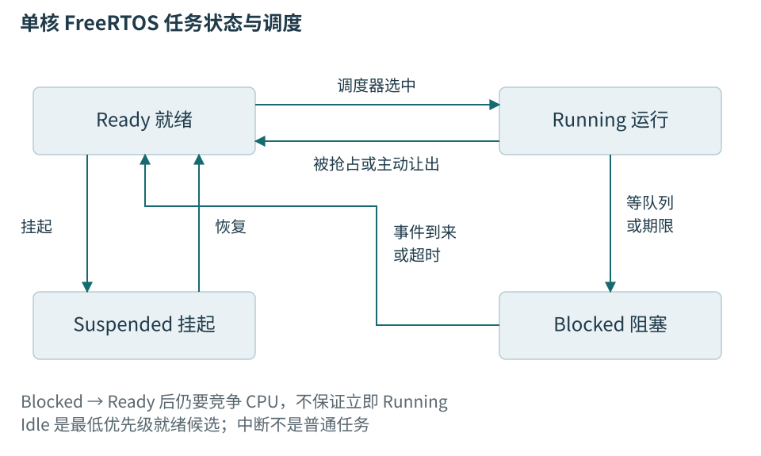
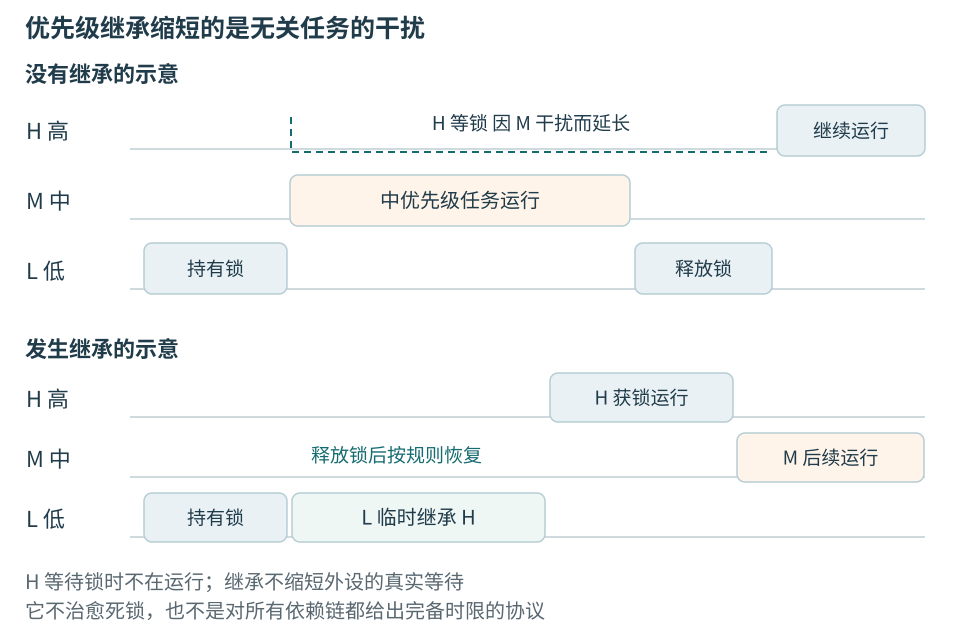
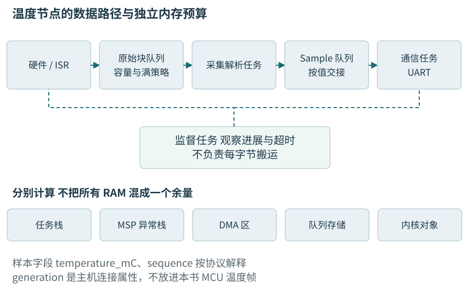

# 第十九章 RTOS任务 调度与资源预算

实时操作系统为多个持续活动分配处理器时间，并提供等待、通知和资源协调机制。它让采样、通信、诊断可以分别表达执行过程，但不会替我们确定截止期，也不会自动防止队列堆满。使用RTOS之后，原来主循环中的等待关系只是变得更明确，硬件时间、内存容量和失败恢复仍然需要设计。

温度节点至少有三个不同节奏：传感器按约定产生测量，通信按链路能力交付结果，监督逻辑检查是否仍有进展。若把三者写在一个阻塞循环里，慢串口可能拖慢采样；若简单拆成三个任务又不约束共享总线、队列与优先级，同样可能失败。任务划分应服务于不同的等待条件和责任，而不是让每个函数都获得一条独立执行流。

本章采用FreeRTOS Kernel V10.6.2原生单核GCC ARM_CM4F端口作为文献API基线，解释性配置为抢占调度、启用静态分配。它不是ESP-IDF的修改版，也不混入其他RTOS的优先级和栈单位。选定版本只为使接口解释可追溯，不表示它是当前最新版本或本书已经完成安全评估。所有代码、内存和时限数值均为教学设计，未编译、未运行，更没有取得实板时序证据。[版本参照][S19-1]

## 19.1 任务是带有独立上下文的执行活动

### 19.1.1 就绪与运行之间还有调度

**任务**拥有入口函数、执行上下文、栈和内核控制信息。单核同一时刻只能让一个普通任务使用CPU，其他任务可能就绪、阻塞或挂起。**运行**表示此刻正在执行；**就绪**表示具备执行条件却尚未轮到；**阻塞**表示等待某个事件或期限；**挂起**通常表示被显式暂停，需相应操作恢复。

例如采集任务等待DMA完成时是阻塞；ISR发布消息后，它变为就绪；若更高优先级通信任务仍在运行，采集任务还没有开始。日志中只有“已唤醒”不足以说明实际响应，必须另有任务开始和完成的证据。把所有没运行的任务都称为“阻塞”，会分不清CPU竞争和资源等待。



图19-1 事件或超时使阻塞任务重新具备运行资格，实际获得CPU还要经过调度。图按本章单核FreeRTOS配置说明，不能推导所有RTOS或多核端口行为。

FreeRTOS默认语境中，较大的任务优先级数字表示较高优先级，这与前章NVIC方向不同。调度器在符合配置的时刻选择最高优先级就绪任务。高优先级任务若一直保持就绪且不阻塞，低优先级任务可能长期得不到运行机会。taskYIELD通常不能用来保证低优先级任务获益，因为让出之后仍可能选中同一最高优先级就绪任务。[任务与调度源码][S19-2]

同优先级任务是否按tick时间片轮转，受configUSE_TIME_SLICING等配置影响；抢占又受configUSE_PREEMPTION控制。时间片不是按业务事务切换，一个持有资源的任务可能在中间被切走。设计应固定这些配置，而不是依靠“RTOS应该差不多”的印象。

### 19.1.2 上下文切换保存了什么

切换任务需要保存旧任务继续执行所需的状态，并恢复新任务的状态。Cortex-M端口利用异常机制和软件保存配合完成，其中PendSV常承担切换，SysTick等时基推动时间相关等待，SVC用于特定启动或服务入口。准确寄存器和浮点现场由端口与配置决定。

每个任务的栈保存其调用链和局部对象；控制块保存调度与状态信息。栈不是把函数入口复制一份，也不是每个任务各有一份全局变量。普通全局变量仍共享，多个任务访问时必须建立同步和所有权。把一个模块改为任务并不会自动让它的内部静态变量变成私有。

切换有开销，但任务数本身也不是唯一成本。频繁唤醒、很短的工作片段、过多小消息、日志和浮点现场都可能提高调度与管理比例。若一个任务只在每个字节到达时做一次很小转发，合并为块或让现有任务批量处理可能更合理；但批量又增加等待，要在吞吐和时限之间取舍。

ISR与任务不在同一套普通调度队列中。任务优先级最高仍可能被更高紧急度中断打断；关调度也不等于关中断；某些端口临界区只屏蔽一部分中断。分析时必须把任务、ISR、DMA和外设都放到同一条时间线上，而不是只看任务列表。

### 19.1.3 等待让出CPU 但仍占有其他资源

任务等待队列可以让CPU运行别的任务，因此优于在高优先级任务里忙等标志。但等待时仍可能持有内存、锁、设备句柄和协议事务。若采集任务持有I2C互斥量后等待一个依赖通信任务的事件，而通信任务也需要这把锁，就可能形成死锁。

每个等待点都应说明等待对象、最长时间、超时后的状态，以及等待期间保留了哪些资源。一个函数返回超时只代表本次等待结束，不保证底层DMA已经停止，也不保证远端命令没有执行。资源回收仍遵循前章的完成证明。

portMAX_DELAY在相应内核配置下可能表示无限等待，不能机械解释为“一个很长但总会返回的超时”。用于必须可停止的任务时，要设计能够唤醒它的停止消息、通知或有限检查机制。若事件永远不来而外部又无法解除等待，所谓优雅退出就只是愿望。

## 19.2 时间要从采样事件算到规定的完成点

### 19.2.1 周期 截止期与执行时间各回答一个问题

**周期**是相邻工作释放之间的时间；**释放**表示一份工作具备处理资格。**相对截止期**从释放开始计算允许完成的最长时间。**执行时间**只计算该工作实际使用CPU的时间；**响应时间**则包含等待、抢占、资源阻塞和执行。某段算法只运行0.2 ms，结果仍可能在20 ms后才交付。

温度节点若要求“每100 ms取得一次测量”，还要区分触发温度转换、转换完成、驱动读出和上位机显示。RTOS周期任务开始调用读取函数，不等于物理采样恰好在该时刻发生。需要精确采样相位时，应考虑传感器自身触发与硬件定时能力，并定义采样时间戳的语义。

**最坏情况执行时间**，简称WCET，是在明确硬件、代码和环境假设下的执行上界。运行一小时见到的最大值是“已观测最大值”，并不会自动升级为WCET。罕见错误分支、格式化、Flash等待、总线竞争和更深调用链可能尚未发生。建立上界常需静态分析、覆盖测量和有理由的保守预算共同支持。

实时性也不是越快越好。对有硬截止期的活动，重点是规定条件下不会迟到；对显示温度，偶发迟到可能只降低体验，但不能继续把陈旧值标为新鲜。产品应写明迟到的后果和允许策略，单写“实时采集”无法验收。

### 19.2.2 相对延时会把工作时间积进周期

若任务先处理5 ms，再vTaskDelay等待100 ms，下一轮从开始算起约为105 ms，还会受tick量化和调度干扰。工作时长变化时，节拍也变化。若目标是相对某个计划时间每100 ms释放，应使用绝对节拍思想，而不是每轮完成后重新睡相同时间。

FreeRTOS V10.6.2提供xTaskDelayUntil，根据上次计划释放点推进下一次期限，并返回本次是否实际发生延时。它在返回时并不证明任务恰好按期运行，更不证明本轮业务截止期已满足。任务被解除阻塞后，仍可能等待更高优先级活动。[xTaskDelayUntil声明与契约][S19-3]

```cpp
// 教学片段；未编译、未运行。周期是计划释放间隔。
#include "FreeRTOS.h"
#include "task.h"

void acquire_and_publish_once() noexcept;
void record_schedule_overrun() noexcept;

void acquisition_task(void*) {
    const TickType_t period = pdMS_TO_TICKS(100);
    configASSERT(period > 0);
    TickType_t planned = xTaskGetTickCount();

    for (;;) {
        const BaseType_t delayed = xTaskDelayUntil(&planned, period);
        if (delayed == pdFALSE) {
            record_schedule_overrun();
            planned = xTaskGetTickCount();
        }
        acquire_and_publish_once();
    }
}
```

片段选择的过载策略是发现下一计划点已经过去时记录一次，并把后续相位重新锚定到当前tick，不无限补跑所有过期轮次。它没有精确计算漏掉多少周期，也没有断言一次pdFALSE必然等于某个业务截止期违反。真实项目若要求保持原相位、跳过若干周期，应明确计算和记录规则。不能把示例策略藏在API选择里。

pdMS_TO_TICKS把毫秒换算成tick，结果受tick频率、整数范围与舍入影响；太短间隔可能变成零。tick为1 ms也不意味着任何等待都精确到1 ms，更不意味着任务最晚1 ms后执行。对很短的硬件定时要求，应使用恰当的硬件时基，RTOS负责后续处理。

超时最好相对单调计数表达，避免网络校时或日历时间变化影响等待。计数器回绕在内核API中有相应处理，但应用自行比较时必须限制时间差范围。深睡后的时间补偿、停tick和外部时钟精度还会影响实际节拍，下一章会把它们接到功耗设计。

### 19.2.3 CPU利用率只是第一轮容量判断

假设三个教学任务的执行预算分别为0.4、1.0、2.0 ms，周期分别为2、5、20 ms，总利用率为0.4/2＋1.0/5＋2.0/20＝0.5。它表示这些预算平均占用一半CPU，不表示每个截止期都满足。若某个低优先级任务关闭中断3 ms，而最高紧急度事件只允许1 ms响应，平均富余没有帮助。

资源阻塞也可能支配延迟。一次低优先级Flash操作阻止同一存储体取指，或者持总线锁等待一个没有回应的器件，都不反映在简单周期利用率求和里。调度分析必须把这些路径变成有界假设，不能让公式只计算容易统计的CPU时间。

队列稳定还要求长期服务能力足够。若每秒产生100个结果而通信任务最多消费80个，任何有限队列最终会满。扩大容量只延后失败。即使平均消费更快，短时突发仍需缓冲，容量和最大排队年龄必须一起计算。

### 19.2.4 一个固定优先级上界怎样推出来

在单核、固定优先级、可抢占、约束截止期、没有未建模释放抖动或自挂起的简化模型中，可以从执行预算C、低优先级有界阻塞B和高优先级干扰计算响应时间。所有中断、调度开销与共享资源影响都必须已经纳入相应预算；离开这些假设不能套同一结论。

令目标任务初始R＝C＋B，再反复计算R新＝C＋B＋Σ向上取整(R旧/Tj)×Cj，其中j遍历更高优先级任务，Tj是最小到达间隔，Cj是执行预算。意义很直接：在一个长度R的响应窗口内，可能到达多少份更高优先级工作，就要让出多少时间。收敛且不超过截止期，才说明模型内满足要求。[响应时间分析参照][S19-4]

取C＝1 ms、B＝0.2 ms，上方只有T＝4 ms、C高＝0.6 ms的任务。起点1.2 ms，下一步为1.8 ms，再算仍为1.8 ms。若目标截止期2 ms，模型留0.2 ms余量；若遗漏了0.4 ms中断干扰，原结论就失去依据。这个例子的价值在于迫使我们写出等待来自哪里，不在于制造一个看似精密的小数。

多个锁、任意截止期、多核、动态优先级、自挂起和非抢占段会改变分析。项目可采用更适合的模型，但仍需把假设写出来。面试里说“利用率不到70%，所以满足实时”不完整，因为百分比界限总有适用前提；说明目标任务、干扰和阻塞才是可检验的回答。

## 19.3 队列把数据和等待关系一起表达

### 19.3.1 先决定保存每份数据还是只保存最新值

本书温度节点的进程内样本至少包含temperature_mC和sequence，驱动还可能附带有效状态和采样计数。全书线路格式由独立编码器负责，不把RTOS队列结构体当报文。主机generation属于主机连接会话，不应加入MCU发送字段冒充设备身份。

如果每次测量都要用于校准和追溯，队列应保存每一份独立样本，并在丢失时报告；如果只是刷新当前显示，可能允许覆盖尚未显示的旧值。两种模型不是性能优化的两个开关，而是不同的业务承诺。后者不能在需要完整历史的路径里悄悄使用。

FreeRTOS普通队列按创建时指定的元素大小复制数据。保存一个小的平凡可复制结构，可以避免指针寿命不清；保存一个指针，只复制指针值，所指缓冲仍需要独立所有权。std::string、vector或拥有资源的C++对象不能直接按字节塞进这种队列，因为队列不会调用其拷贝、移动和析构语义。[队列创建与收发契约][S19-5]

下面建立8项静态Sample队列。成员是进程内表示，不规定字节序；填充是否存在不影响同一固件内按完整对象大小复制，但不能把填充带到网络或持久化格式。

```cpp
// 教学片段；未编译、未运行。需启用静态分配配置。
#include "FreeRTOS.h"
#include "queue.h"
#include <cstdint>
#include <type_traits>

struct Sample {
    std::int32_t temperature_mC;
    std::uint32_t sequence;
    std::uint32_t sampled_tick;
    std::uint32_t valid;
};
static_assert(std::is_trivially_copyable_v<Sample>);

constexpr UBaseType_t sample_count = 8;
static StaticQueue_t sample_control;
static std::uint8_t sample_storage[sample_count * sizeof(Sample)];
static QueueHandle_t samples = nullptr;

bool create_sample_queue() noexcept {
    samples = xQueueCreateStatic(
        sample_count, sizeof(Sample), sample_storage, &sample_control);
    return samples != nullptr;
}
```

队列建立应先于可能使用它的任务和中断。存储数组和控制块的生命期覆盖整个使用期，不能把它们放在create_sample_queue的局部栈上。删除队列后，所有句柄借用和等待者必须已按协议结束；静态分配也不允许删除后继续通过旧句柄访问。

### 19.3.2 队列满时不要无界阻塞采样

采集任务若在队列满时无限等待，可能停止从DMA或传感器读取，最终把下游通信慢变成上游硬件覆盖。若选择有限等待，超时后必须说明样本是否丢弃、是否计数和是否触发降级。对本书遥测，可以拒绝新样本并记录缺口；对生产工站正在执行的校准序列，通常应让该步骤失败而不是悄悄缺点后仍判合格。

消费者慢的原因也要区分：串口发送带宽不足、等待远端确认、持锁日志、优先级过低或任务已停滞。单看队列深度不断增长，只知道到达暂时超过服务，不能直接归因于调度器。队列高水位、最老样本年龄、入队失败次数和任务进展组合起来更有解释力。

固定容量8不等于最多延迟8个周期。若消费者还持有一项、DMA有在途数据，或者消息包含指向更少真实缓冲的指针，系统容量不同。预算应分别列已排队、处理中、设备拥有和可复用数量，不能把同一份存储在几个表里重复计算。

xQueueOverwrite适合明确长度1的邮箱语义，不是向任意长队列自动丢最老数据的通用替代。若只要最新温度，应把接口直接命名为最新快照，并另外记录新鲜度与缺口，防止消费者误认完整历史。

### 19.3.3 通知 信号量 事件位与互斥量各有语义

**任务通知**把有限状态或计数附在某个任务上，适合对指定任务的轻量唤醒；**二值信号量**表达一个可获取事件；**计数信号量**表达有限个许可或累计次数；**事件位**表达若干条件组合；**队列**保存独立消息。选择时先问能否合并重复事件、需不需要负载、谁会等待、容量如何饱和。

布尔通知适合“接收环可能有数据”，因为任务醒来后可以从环中取尽；它不适合精确统计每次脉冲。计数通知保留次数，却没有每次脉冲的时间和数据。事件组的某一位被置三次，也不会自动变成三份记录。接口形式应匹配信息量。

互斥量用于有所有者的资源保护，通常由取得它的任务释放。二值信号量常用于一方通知另一方，发送者不必是取得者。FreeRTOS互斥量带基本优先级继承，普通二值信号量不带这一所有权机制；不能因为两者都使用SemaphoreHandle_t就认为可以互换。[互斥与信号量源码契约][S19-6]

ISR不能使用普通互斥量。任务在持锁时可能被ISR打断，ISR若等它释放会形成不可推进的关系。ISR应通过适合的FromISR通知或队列交接，任务再在普通上下文取得资源。即使函数签名相似，也必须核对它是否明确支持中断和当前优先级。

### 19.3.4 把节点拆成有明确边界的几个活动

一种教学分工是采集任务拥有传感器读取与样本形成，通信任务拥有UART发送与协议事务，监督任务查看各关键活动的有效进展。中断只维护必要的硬件完成和接收缓冲。这样每个外设有明确所有者，任务之间传递受限消息。

不必为每个传感器都建立任务。若多个传感器共用总线且等待模式相近，一个采集任务可以按状态机服务它们，减少栈和锁。反过来，一个慢设备不能让其他短时限活动无界等待，就可能需要独立调度或总线服务器。任务数取决于阻塞和责任，不取决于源文件数量。

通信任务也不能无限持有整个系统。它从队列取得Sample后编码为固定上限报文，等待有限发送或确认；失败时记录当前command_id或sequence，并执行协议允许的重试或断线恢复。不能在拿着总线锁时等主机数秒回应，更不能把未确认请求静默改为成功。

## 19.4 互斥保护资源 继承限制部分阻塞

### 19.4.1 优先级反转来自等待链

设低优先级任务L持有SPI锁，高优先级采集任务H需要同一锁而阻塞；中优先级日志任务M不需要这把锁，却不断抢占L。H虽然比M优先级高，仍间接等待M结束，因为只有L能释放它需要的资源。这叫**优先级反转**。

把H再调高不会让锁自动释放。若H改成高优先级忙等，还可能让L永远无法运行。解决方向是减少长持锁、规定有限事务和锁顺序，必要时使用合适优先级协议，而不是一味增加优先级数字。



图19-2 持锁者临时继承等待者优先级后，中优先级任务不能继续按原关系拖延它；外设真实等待和临界区本身仍存在。这是关系示意，不是内核跟踪记录。

**优先级继承**让持锁者在条件满足时临时提高到等待者相应优先级，以便完成临界区并释放资源。FreeRTOS的机制是基本继承，不能当成完整优先级上限协议，嵌套多锁和解除继承细节应查固定版本实现。它不能修复死锁，也不能让不回应的外设突然回应。

### 19.4.2 锁应覆盖事务 但事务必须有上界

SPI事务可能需要锁覆盖配置切换、片选、命令、数据和结束，若只保护每字节则两个设备的操作会交错。但把整段业务流程都放进锁里也危险：等待用户命令、网络确认和长日志并不属于必须独占SPI的阶段。

应把临界区拆成硬件确实需要连续拥有的最小事务，并为其长度、外设超时和错误恢复建立上界。一个DMA事务可以释放CPU，但如果锁仍由发起任务持有，其他任务依然在等资源；“用了DMA所以不会阻塞”混淆了CPU忙碌和资源占用。

多把锁需要一致的获取顺序，或者避免同时持有。若采集先拿传感器锁再拿日志锁，而日志任务反向拿，任何优先级继承都不能打破循环等待。错误路径尤其要审核，不能正常路径释放完，超时分支却遗漏一把锁。

C++可以用短作用域RAII封装已取得的互斥量，保证普通返回路径释放。但封装必须区分取得失败，不能在未持有时give；也不能从另一个任务或ISR析构后释放。其对象生命期是锁所有权的表达，不是跨上下文随意转移的许可。

### 19.4.3 资源服务器改变依赖形态

让一个任务独占I2C总线，其他任务提交有界请求，是减少共享寄存器和锁的一种办法。服务器选择请求、执行事务并返回结果，所有外设状态集中在一个所有者处，错误恢复也更容易保持一致。

然而队列先来先服务时，一个长低优先级请求仍可能阻塞后来的高紧急度请求。服务器的优先级、请求排序、最大长度和超时必须参与时限分析。把mutex换成消息队列没有自动消除优先级反转，只是把等待链显式放到了消息路径。

请求还需要身份和取消语义。调用者超时离开后，服务器可能仍在执行；响应缓冲不能指向调用者已经结束的局部变量。可使用固定请求池和状态机，在取消完成或正常完成后再归还。若操作产生外部副作用，超时不能被解释为没有执行，重试必须按command_id和幂等规则处理。

## 19.5 静态内存把容量变成可审查的安排

### 19.5.1 一个任务不仅占入口函数那么多空间

任务需要栈和控制块，队列需要控制信息与元素存储，定时器和事件对象也有内部状态。除此之外，驱动、DMA、日志、协议和升级会同时使用RAM。静态分配让数量和存储位置提前确定，减少关键路径的分配失败和碎片风险，但不会自动证明栈够用或对象不会被提前复用。

FreeRTOS V10.6.2原生xTaskCreateStatic的栈深度按StackType_t元素数表达，而不是字节。ARM_CM4F中该元素通常为32位，768个元素对应3072字节。不能把ESP-IDF某些API的字节语义套到这里，更不能只复制“768”而不记录单位。[任务创建接口][S19-3] [端口类型][S19-7]

```cpp
// 教学片段；未编译、未运行；省略完整配置和启动顺序。
#include "FreeRTOS.h"
#include "task.h"

static StaticTask_t acquisition_control;
static StackType_t acquisition_stack[768];
static TaskHandle_t acquisition_handle = nullptr;

void acquisition_task(void*);

bool create_acquisition_task() noexcept {
    acquisition_handle = xTaskCreateStatic(
        acquisition_task, "acquire", 768, nullptr, 3,
        acquisition_stack, &acquisition_control);
    return acquisition_handle != nullptr;
}
```

静态数组必须保持到任务确认结束以后；控制块也不能在任务运行时复用。任务入口按接口约定不能普通return，应持续运行或通过已设计的结束路径退出。这个片段没有创建空闲任务和定时器服务任务所需的静态存储回调，也没有提供FreeRTOSConfig.h，所以不能直接拿来声称静态系统已完整启动。

若启用configSUPPORT_STATIC_ALLOCATION，还应按内核配置提供Idle和软件定时器服务所需存储。关闭动态分配意味着相关动态创建API不可使用，不意味着C++运行库或第三方库绝不分配。要核查整个调用链，包括格式化、异常支持、局部静态初始化和驱动内部工作区。

### 19.5.2 栈预算要同时考虑深调用与异常

每个任务的栈深度取决于最深调用链、大局部对象、库函数、编译优化和异常现场。把一个4 KiB临时数组放进栈为3 KiB的任务，静态分配也救不了它。递归深度不受限、格式化错误路径和多个回调叠加，是容易漏掉的来源。

运行高水位记录能够显示已执行路径中最少剩余栈空间，但它不是所有未来路径的证明。某个局部数组预留却没有完全写入时，基于填充值扫描的水位还可能低估真实栈指针曾达到的深度。应把静态栈使用分析、调用关系和覆盖运行记录结合，并保留合理余量。

configCHECK_FOR_STACK_OVERFLOW等检查有助于发现部分越界或边界破坏，但检测发生在特定时刻，可能在邻接数据已经被损坏以后。钩子本身不能再依赖大栈、复杂日志或普通堆分配。具备MPU等硬件时可增加保护，但保护粒度和任务权限仍需要准确配置。

主栈与各任务栈分开预算。异常嵌套、FPU保存、内核启动和早期中断都可能使用不同区域。不能只把所有任务栈加起来，再把剩余空间称作“系统栈够了”。链接文件应清楚保留区域，启动向量也要指向正确栈顶。

### 19.5.3 把RAM预算投影到真实区域



图19-3 队列保存什么、满时怎么办和谁拥有设备，应同时写在任务图中。监督任务检查有意义的完成，不参与每字节搬运。图中所有容量是设计参数，未代表已测系统。

下面是一组独立的教学容量安排，不是F446工程链接结果。以128 KiB普通RAM为总量，假设各项互不重复，列出同时可能存在的工作区。校准、升级和通信若共享某个区域，必须由状态机保证不会同时使用；不能只在表里写“复用”便节省内存。

| 项目 | 教学预留 | 必须说明的条件 |
| --- | --- | --- |
| 全局数据和静态对象 | 24 KiB | 从链接映射核对，不重复计入下方独立区 |
| 应用任务栈 | 14 KiB | 每任务分别给深度与单位 |
| MSP及内核服务栈 | 6 KiB | 包含配置对应的异常和系统活动 |
| DMA与接收工作区 | 8 KiB | 总线可达、宽度、生命周期正确 |
| 消息与诊断存储 | 8 KiB | 有界，满时策略明确 |
| 更新与校准工作区 | 10 KiB | 核对是否与正常采集并存 |
| 对齐和保留余量 | 4 KiB | 真正进入链接安排 |

合计74 KiB，算术剩余54 KiB。总量有余，不代表每个栈有余，也不代表某一特定RAM区满足DMA可达性。实际占用还要纳入运行库、内核控制块、链接填充及遗漏的厂商对象，以真实map文件替换教学数字。

时间也应与内存一起记。某个工作区占2 KiB但永远不释放，会造成长期容量损失；一个块池有16块却都被远端确认占住数秒，会阻断采样。每项资源应同时说明最多多少、最长持有多久、失败时谁归还。

## 19.6 软件定时器和C++封装的隐藏执行环境

### 19.6.1 软件定时器回调共享一个服务任务

FreeRTOS软件定时器让应用在指定tick期限后请求执行回调。回调通常运行在定时器服务任务上下文，不是硬件ISR，也不是每个定时器各有一条独立任务。一个回调执行很久，会延后其他回调和定时器命令处理。[软件定时器接口][S19-8]

因此回调应做短而有界的操作，例如向工作任务发送不阻塞通知。不要在其中等待同一服务任务才能处理的命令，也不要长时间等待设备或持有全局锁。队列满时带阻塞的调用尤其需要审查，因为阻塞的是整个定时器服务任务。

定时器到期也只是在相应服务条件下安排回调，不保证准确的物理边沿。产生精确采样触发或测量脉宽，应使用合适硬件计数器；软件定时器适合业务超时、维护节奏等允许调度误差的事情。名称里都有“定时”不意味着可互换。

### 19.6.2 C任务入口可以调用C++对象

一个常见封装是提供与TaskFunction_t匹配的静态入口，参数指向C++对象，入口再调用run成员。这样可以集中状态和依赖，但对象必须在任务可能访问期间一直存在，且启动前已经完成初始化。把this传进去以后立即销毁对象，会产生与异步回调相同的悬空访问。

对象的析构也不能简单调用vTaskDelete强杀任务并释放成员。目标任务可能持有互斥量、拥有DMA缓冲或正在执行厂商调用；内核删除任务不等于自动运行它栈上所有C++析构，也不会替应用释放所有外设事务。更清楚的过程是请求停止，让任务到达可停止点，完成取消和资源归还，再发结束确认，最后销毁拥有者。

任务函数不能让C++异常穿过不支持该传播的C入口或内核边界。若工具链启用异常，应在合适的应用边界捕获并转换为受控故障；若关闭异常，所有可能失败的接口就要采用相应显式结果。noexcept只承诺不传播异常，不证明函数必定成功或时间有界。

厂商C回调也有同样约束。回调在哪个上下文执行，比它定义在class外还是class内更重要。一个被普通任务调用的回调可用某些阻塞接口，而从IRQ链进入的同名回调不可随意照搬。封装文档应把上下文和所有权写进接口契约。

### 19.6.3 停止协议应覆盖永久等待和在途消息

温度节点关闭采集时，先拒绝新请求并标记目标状态，再唤醒等待中的任务，使其停止启动新转换。已经开始的事务按规则完成或取消，DMA确认静止，消息队列中的旧样本选择排空或丢弃并记录。任务交付结束确认后，外部才可以重建对象或切换配置。

队列被删掉不是通知所有任务优雅退出的通用方式。等待者、ISR生产者、定时器回调和句柄借用者都需要先退出相应访问范围。可以使用明确停止消息、独立通知或状态机，但必须考虑队列已满时停止消息如何到达，不能让退出依赖一格永远腾不出的普通队列空间。

停止也有业务含义。若工站正在等待某个校准command_id结果，节点不能在退出时悄悄丢掉它并返回成功；应告诉上层是完成、拒绝、已取消还是状态未知。恢复后新一轮采集不得消费上一轮未处理的块。设备启动身份与内部采集代次用于不同边界，不能拿主机generation代替全部判断。

## 19.7 用时间线解释一次截止期违反

假设教学节点规定，从一个完整数据块产生到形成有效Sample不超过5 ms，正常计算约0.6 ms。压力情境下偶尔超过8 ms，而CPU平均利用率仍低于50%。这些数字是分析模型，不是测量记录。

需要补充的事实包括：完成事件到ISR的时间，ISR发布到任务真正运行的时间，任务等待各资源的区间，算法执行区间，以及结果入队是否阻塞。还应记录优先级、tick配置、最大关中断段、DMA保留窗口和日志模式。只有任务入口与出口两点，无法区分中间等待来自哪里。

假设按教学时间线，ISR在0.05 ms内发布，采集任务0.2 ms开始，随后等共享SPI资源7 ms。检查发现，故障版本误用不带优先级继承的二值信号量充当锁；低优先级日志任务持有它，在等待Flash就绪的可运行区段又被中优先级通信任务抢占。当前问题同时包含过长资源占用与缺少继承造成的额外干扰。真正的FreeRTOS互斥量已有基本继承，不能用同一简单抢占关系解释它。

修正首先缩短总线事务，把不需要占总线的格式化和等待移出锁，规定Flash事务最大长度和忙等待策略；在适合时改用带继承的原生互斥量，或采用有时限策略的资源服务器。继承只减少无关任务干扰，不缩短Flash真实忙碌时间。若采集与Flash存在不可避免的硬件冲突，应调整硬件通路、采样窗口或产品期限，而不是靠一个优先级掩盖不可能的时间关系。

验收要重建同样负载和最坏等待情境，确认块保留期限与5 ms业务期限都满足；队列满和设备超时路径也要覆盖。若选择允许丢弃过时块，就应明确显示缺口和失约计数，并确认不会把旧温度当成当前测量。平均CPU降低不是这次修复的充分证据。

**追问 为什么不用所有任务最高优先级。** 同优先级并没有表达不同截止期，长工作仍会占用时间片或持有资源，关键任务无法获得所需区分。应根据释放模式、期限和依赖配置优先级，并为不可抢占与共享资源建立上界。

**追问 静态分配是否意味着确定性。** 它确定部分存储数量，减少分配器不确定性，但等待设备、锁、调度、Flash操作和数据相关计算仍可变化。确定性来自所有关键路径的约束和证据，不来自一种分配方式。

**追问 看门狗能否证明任务满足实时。** 看门狗可以发现某些失去进展，但喂狗可能来自与业务无关的任务；任务也可能一直有进展却总是迟到。需要同时监控每项关键工作的完成窗口、数据新鲜度和资源状态，再决定是否允许继续运行。下一章把这种监督接到复位和更新恢复。

## 本章资料与核验范围

2026-10-06核验FreeRTOS固定版本官方源码。所有API片段均为本书教学写作，未构建、未运行。使用其他厂商分支、多核端口或不同配置时，应重新核查栈单位、调度、通知与临界区语义。

- [S19-1 FreeRTOS Kernel V10.6.2发布][S19-1]，文献基线，不宣称最新
- [S19-2 V10.6.2 tasks.c][S19-2]，调度与任务状态实现
- [S19-3 V10.6.2 task.h][S19-3]，任务创建、延时、栈和通知契约
- [S19-4 Burns与Davis响应时间分析论文][S19-4]，基础固定优先级模型；本文数值为独立教学推导
- [S19-5 V10.6.2 queue.h][S19-5]及[queue.c][S19-9]，队列复制、容量与互斥实现
- [S19-6 V10.6.2 semphr.h][S19-6]，二值信号量与互斥量不同语义
- [S19-7 ARM_CM4F portmacro.h][S19-7]，端口类型；[port.c][S19-10]，上下文与优先级边界
- [S19-8 V10.6.2 timers.h][S19-8]，定时器服务上下文

[S19-1]: https://github.com/FreeRTOS/FreeRTOS-Kernel/releases/tag/V10.6.2
[S19-2]: https://raw.githubusercontent.com/FreeRTOS/FreeRTOS-Kernel/V10.6.2/tasks.c
[S19-3]: https://raw.githubusercontent.com/FreeRTOS/FreeRTOS-Kernel/V10.6.2/include/task.h
[S19-4]: https://www.cs.york.ac.uk/rts/static/papers/Burns2017b.pdf
[S19-5]: https://raw.githubusercontent.com/FreeRTOS/FreeRTOS-Kernel/V10.6.2/include/queue.h
[S19-6]: https://raw.githubusercontent.com/FreeRTOS/FreeRTOS-Kernel/V10.6.2/include/semphr.h
[S19-7]: https://raw.githubusercontent.com/FreeRTOS/FreeRTOS-Kernel/V10.6.2/portable/GCC/ARM_CM4F/portmacro.h
[S19-8]: https://raw.githubusercontent.com/FreeRTOS/FreeRTOS-Kernel/V10.6.2/include/timers.h
[S19-9]: https://raw.githubusercontent.com/FreeRTOS/FreeRTOS-Kernel/V10.6.2/queue.c
[S19-10]: https://raw.githubusercontent.com/FreeRTOS/FreeRTOS-Kernel/V10.6.2/portable/GCC/ARM_CM4F/port.c
