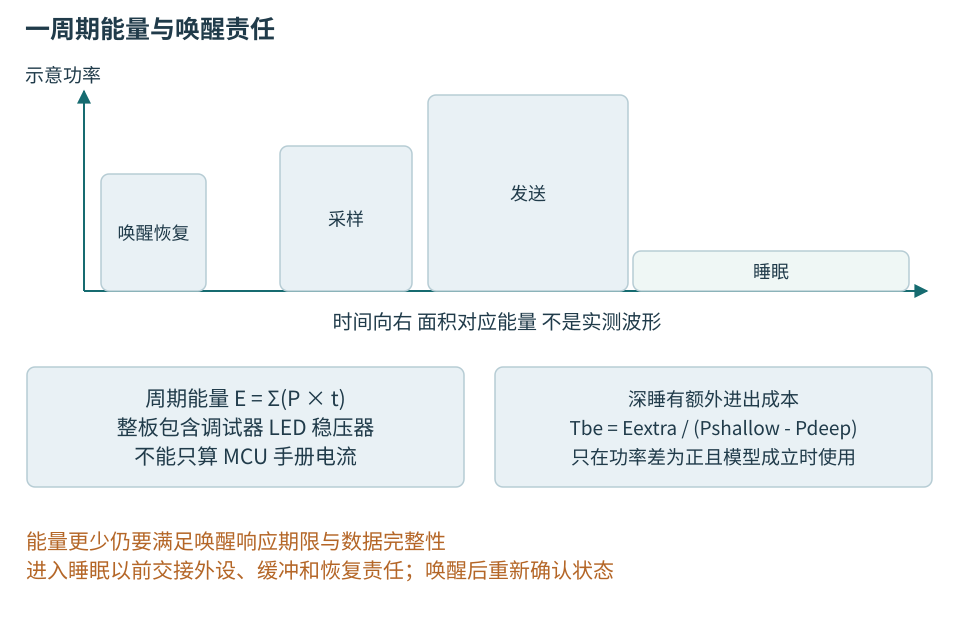
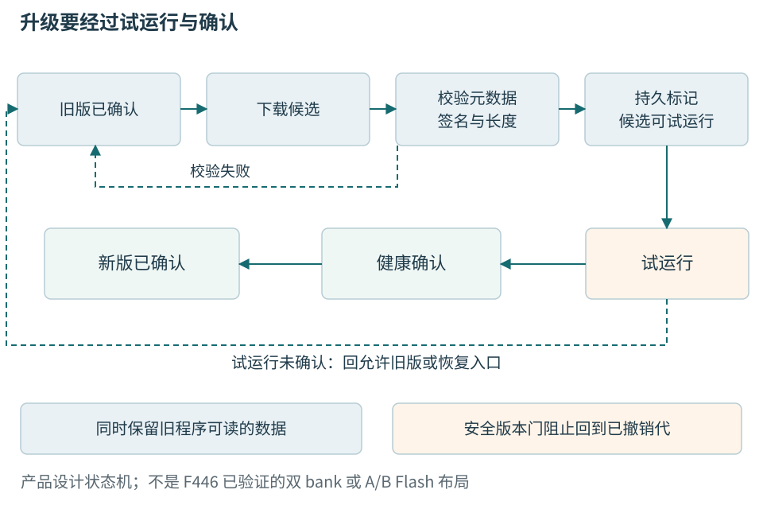

# 第二十章 低功耗 更新与现场恢复

设备长时间运行时，正确性不只发生在一次函数调用里。它可能睡眠后丢失部分状态，电压下降时中断写入，在更新后运行一份尚未确认的新镜像，也可能在现场经历主机断连和重复复位。低功耗和维护设计要回答的是：下一次醒来或启动时，设备凭什么知道自己处于什么状态，哪些数据还能使用，怎样重新提供可信结果。

温度节点没有动力输出，但仍不能把失效当成无所谓。反复显示旧温度可能误导工站判断，更新擦掉校准会破坏测量记录，设备身份混乱会把两台产品的结果串到一起。本章把能量、监督、更新和追溯放到同一产品生命期中讨论，同时区分“设计可恢复”与“已经验证可恢复”。

MCU文献主线仍为STM32F446与FreeRTOS V10.6.2。更新状态机借鉴MCUboot官方机制，但没有将MCUboot移植到本板，也没有确定可烧录的Flash分区。所有电流、时间、容量和故障过程均为教学构造，未进行电流测量、断电、烧录或安全配置。实际供电与故障注入仅能在额定、参考和隔离条件已审核的低压台架上按批准方案进行，不以临时短接或拔插替代测试设计。

## 20.1 睡眠状态改变的不只是CPU是否执行

### 20.1.1 先列出保留状态与唤醒条件

**低功耗状态**可以停止核心时钟、停止部分总线、关闭振荡源、降低稳压器功耗，或者切断某些电源域。睡得更深，通常保留得更少，恢复工作也更多。名称中的Sleep、Stop、Standby只有结合准确芯片手册才有意义，不能跨系列按字面比较。

在本章F446文献参照中，Sleep、Stop和Standby具有不同的时钟与状态保留行为。理解上可以先区分：只暂停核心执行、保留主要运行状态但停止更多时钟，以及从较深状态醒来需要按复位启动路径重新建立应用。具体RAM、备份域、唤醒源和引脚行为须查RM0390与数据手册，不能从“RAM保留”推出所有外设仍按原配置工作。[低功耗能力参照][S20-1]

休眠前列出仍需工作的功能：哪个定时源决定下一次采样，哪条外部信号能够唤醒，UART接收是否仍可检测，DMA是否还有在途访问，看门狗是否继续计时。关闭某个功能的时钟后，不能仍把它当作唤醒来源。别的STM32系列支持某种串口唤醒，不代表F446在同一状态也支持。

温度传感器可能位于独立受控电源域。关断前要结束总线事务，处理引脚和上拉所在电源域，避免由信号线向未供电器件灌电；恢复后等待器件规定的上电就绪，重新检查配置和第一份有效数据。实际更改连接前仍要断电，不能靠软件休眠当作板卡已安全断电。

### 20.1.2 入睡前的最后一次检查防止丢事件

假设任务判断“没有工作”，准备执行等待中断指令，恰好中断在检查后发生并完成，随后任务又睡下。如果事件只是一个瞬时信号，没有保留在队列或受保护状态中，可能直到下一次事件才醒来。睡眠入口因此需要把“检查是否可睡”和“进入睡眠”按架构和内核规定协调。

FreeRTOS的tickless路径会在允许条件下估计空闲时间、检查是否需要中止睡眠，并补偿经过的tick。移植层负责具体定时源与进入退出动作。应用不应在旁边另写一套绕过内核时间管理的深睡循环，否则任务期限可能失去对应关系。[ARM_CM4F低功耗端口实现][S20-2]

DMA未结束、传输最后停止位未离开UART、Flash仍在编程时，都可能不适合进入某个深睡状态。忙碌状态应由拥有该资源的驱动提供，电源管理不能只检查任务队列是否空。任务阻塞有时意味着正在等外设完成，恰恰不是外设空闲。

唤醒后同样有顺序：恢复必要时钟，确认稳定与分频，恢复丢失的外设状态，重新建立时基，再允许依赖它们的任务继续。若UART分频仍对应休眠前时钟，而恢复路径临时使用另一时钟源，首个启动报文就可能乱码。恢复流程应有自己的失败状态，不把它隐藏在一个“wake”回调中。

### 20.1.3 Tickless减少无意义唤醒 不替外设省电

周期tick会定期打断空闲核心。**无滴答空闲**，即tickless idle，在没有近期任务需要运行时抑制一部分周期唤醒，利用合适定时源在需要时恢复，并把经过时间反映给内核。它不意味着系统没有时间，也不意味着外设、传感器和板载调试器自动掉电。

例如下一项任务在500 ms后到期，内核可以考虑更长空闲，但外部通信若要求20 ms内响应，实际可选状态还受接收和恢复时间限制。低功耗时钟精度、最大计数范围、提前唤醒余量和中途外部事件也影响结果。

长时间睡眠后的tick补偿并不等同于高精度物理采样同步。若采样相位很重要，需确认硬件触发和所用时钟在睡眠期间怎样运行。主机收到帧的时间仍包括唤醒、读取、调度和传输，不能将其冒充传感器实际转换时刻。

## 20.2 从一轮活动计算能量

### 20.2.1 比较完整周期 而不是最低电流

电流是某时刻流过电路的量，电荷是电流对时间的积分；在电压近似恒定时，平均电流可以帮助估算周期消耗。若不同阶段电压和转换效率显著变化，应改用功率和能量，并把稳压损失一起计入。

设一组虚构的温度节点参数：每60 s工作一次，采样5 ms使用8 mA，通信200 ms使用40 mA，其余59.795 s休眠使用0.05 mA。三段电荷分别为0.04、8、2.98975 mA·s，总计11.02975 mA·s，平均约0.18383 mA。这里的通信可以代表额外无线模块，不是本书NUCLEO板的实测电流，也没有宣称它已安装。

若把采样计算时间减半，只减少0.02 mA·s；通信重试一次却可能增加约8 mA·s，量级相差很大。先优化最显眼的算法循环未必最节能，应该先看一周期能量分布。另一方面，通信时长也不能无限缩短，它受协议、信号质量和发送功率条件约束。

用名义1000 mAh容量除以上述理想平均电流，约为5439.8小时，即226.7天。这只是算术示例，不是电池续航承诺。温度、老化、自放电、截止电压、稳压效率、重试和实际可用容量都会改变结果。这里不安排电池连接或充放电操作，也不涉及大电池。

图20-1 进入和退出深睡具有额外成本，整板消耗还包含稳压器、指示灯和调试电路。状态高度与时间仅表示教学关系，不是测得电流波形。

### 20.2.2 深睡需要足够长的空闲窗口

假设浅睡与深睡的功率差为4 mW，每次进入和恢复深睡额外消耗0.8 mJ，那么额外成本需要约0.8 mJ/4 mW＝0.2 s才能补回。预计空闲只有10 ms时，反复深睡可能比浅睡更费能量。这是简化盈亏平衡模型，真实系统还需考虑不同电压、恢复路径与外设状态。

时间约束可能比能量先排除方案。若外部事件要求5 ms内得到响应，而深睡恢复需要最坏4 ms，只剩1 ms给协议和业务。若只测常温一次最快唤醒，就会低估电压、时钟稳定和调度影响。选择状态应同时满足能量收益与最坏响应预算。

降低CPU频率也不一定减少每轮能量。执行变慢时，传感器、电平转换器或通信模块可能更久保持活跃；较快完成再休眠可能更省。相反，提高频率需要更高电压或更高动态功耗时也可能不划算。比较对象始终是完成同一任务和满足同一期限所需的总能量。

### 20.2.3 测量点决定数字代表谁

测芯片电源、目标板输入、整个开发板USB入口，得到的范围不同。NUCLEO板载调试器、LED和稳压器可能支配整板待机消耗。不能把数据手册中的MCU低功耗值与USB口实测值直接对照，再认定固件没有进入睡眠。[板级供电与测量范围][S20-3]

实际电流测量会改变回路。仪器负担电压、量程切换、带宽和采样可能影响供电或漏掉峰值。本章不要求初学者拆线串表；如需实施，应由合适人员核对仪器额定、保险、接法、隔离、参考与板级测量点，先断电安排连接，再按批准低压台架流程测量。绝不能把留在电流口的表笔跨接电源。

报告应保留测点、供电方式、板修订、调试器连接、固件、温度、通信状态、仪器及采样设置。平均值用于周期预算，峰值和最低电压用于检查瞬态供电。平均不到1 mA的设备仍可能因通信峰值造成电压跌落，增加休眠时间不能修复瞬时供电能力不足。

### 20.2.4 持续监听与长睡眠需要明确取舍

关闭接收链路后，设备不能凭空知道主机何时发来命令。可以周期醒来查询、保留低功耗唤醒线路，或由网关缓存命令等候窗口，每种方案都改变最长等待时间和能量。若每10 s查询一次，刚错过窗口的命令可能等待接近10 s，再加通信与处理时间。

网络故障时频繁重连尤其容易破坏预算。可等待的遥测应有最大尝试窗口、退避、抖动和离线缓存上限；有严格时限的事件则要单独设计。本书温度节点允许报告失联和缺测，不把无限重试当可靠性。队列已满时继续下载、重连和写日志，可能同时耗尽能量与存储。

## 20.3 看门狗监督有意义的进展

### 20.3.1 喂狗证明的只是刷新动作发生过

**看门狗**是需要在规定条件下刷新，否则触发复位或其他动作的监督机制。独立看门狗与窗口看门狗的时基和限制不同；有的还要求不能过早刷新。具体超时范围、误差、低功耗和调试冻结行为必须查准确芯片，不提供一个适用于所有板的默认时间。

若系统定时器每10 ms无条件喂狗，即使采集任务死锁，看门狗仍可能永远被刷新。它证明的只是喂狗路径在推进，没有证明业务正常。让所有任务都随意喂同一看门狗也有类似问题，一个健康任务会掩盖另一个失效任务。

更清楚的设计是监督者在规定窗口检查关键活动的**进展证据**。采集任务报告完成了哪次有效采样，通信任务报告处理了哪项发送或确认，存储任务报告哪次提交已结束。监督者只有在本轮必要条件满足时才刷新。条件应反映任务当前状态，空闲时不要求它凭空完成不存在的工作。

进展计数也不是越频繁越好。一个错误循环可能不断增加“运行次数”，而真正Sample.sequence不再推进。应选与业务完成相关的事件，并同时核对新鲜度、错误状态和活动期限。计数器回绕、任务重启和软件更新时还要重新建立观察基准，避免把旧计数当本轮进展。

### 20.3.2 复位之后先保存原因再恢复服务

复位来源可能包含上电、软件请求、独立看门狗、窗口看门狗、低功耗退出或欠压相关条件。某些标志会累积，读取和清除又有特定规则。启动早期应在适当位置保存来源，再按手册清理，避免后续初始化覆盖唯一证据。

一个故障包至少应关联设备身份、启动身份或启动计数、固件构建、板修订、复位标志、最近状态和有限错误计数。计数持久化有磨损成本，不能每次心跳都写Flash。无法可靠保存墙钟时，保留本次启动的相对时间和序号，并明确时间未同步。

反复复位可能需要进入受限维护状态。若同一候选镜像连续无法通过健康检查，继续每秒重启只会消耗电源和覆盖日志。温度节点可以停止发布有效测量、保留通信诊断或恢复入口，并等待受控处理。安全状态取决于产品风险，不能把“任何设备都断电”写成通用结论。

### 20.3.3 看门狗与错误处理不能互相掩盖

驱动超时应先给出可解释的错误和有限恢复，再由系统决定是否继续。每遇到一次I2C NACK就重启整机，会使定位困难，也可能把正常上电等待误判为故障。反之，无限重试又持续喂狗，则会让系统永久失去业务功能。

监督窗口应覆盖允许的最长正常活动，但不能任意放大到“再也不会误触发”。Flash编程、更新校验和深睡可能需要特殊状态，监督者知道这些活动的上界，并在完成后重新收紧正常窗口。暂停监督本身也必须有期限和退出条件。

调试器可能冻结某些计数器或改变执行时序，连接调试器时不复位，不能证明脱机不会触发看门狗。验证应区分调试模式、独立启动和真实低功耗状态。这里没有执行这些测试，只规定能够支持结论的证据范围。

## 20.4 更新是一组可恢复的持久状态

### 20.4.1 下载完成不等于更新完成

**OTA**通常指通过通信链路获取并安装设备软件，不局限无线。一次更新至少要识别目标、获取候选内容、验证完整性与授权、确认硬件适配、安排切换、试运行、健康确认，并处理任何阶段的重启。仅把新文件写进Flash再修改一个地址，漏掉了多数失败窗口。

镜像元数据应绑定硬件适用范围、组件类型、长度、版本、配置兼容范围、摘要和签名所保护的信息。合法签名的镜像仍可能属于另一块板；长度正确也可能超出分区；版本号较大不保证数据迁移兼容。解析必须先做范围与算术溢出检查，不能用不可信长度直接擦写。

“已下载”“已验证”“已标记候选”“正在试运行”“已确认”是不同状态，服务器与工站都应区分。长期离线设备没有报告失败，不能计为成功。成功率分母也要明确，是所有目标、已接触、已切换还是已确认设备。

### 20.4.2 双槽位不是双bank的同义词

**双槽位**指保留当前镜像和候选镜像的布局思路，**双bank**是某些Flash硬件组织能力，二者不能互相推出。本书F446没有建立已验证的A/B布局，更不能因为概念图画了两块，就声称可以从任意槽直接执行或一边擦写一边无影响运行。

更新策略可能把候选交换到固定执行地址，可能允许分别链接后从不同槽运行，也可能从外部存储加载。MCUboot官方设计区分多种模式，并为状态尾部、擦除单元和恢复安排提供具体机制。采用它仍需固定版本、端口、Flash驱动、链接地址和配置，不能只引用名字。[MCUboot设计][S20-4]

Flash通常按扇区擦除，写入粒度也受电压与器件规则限制。应用、校准和身份若共享擦除单元，一次更新可能连同独有数据一起消失。布局应先为引导程序、镜像、状态、校准、配置与恢复材料划清擦除边界，再讨论剩余应用大小。容量不能只按“应用小于Flash一半”估计。

保存两份镜像也没有保证引导状态可靠。标记候选的一个Flash字可能在掉电时部分编程；交换中途某个扇区可能已改变而后续未完成。恢复算法必须识别合法旧状态、合法新状态、未完成状态和损坏，而不是把任意非零值当成有效。

图20-2 更新需要保留可启动程序和可解释数据。图为产品设计状态机，不是F446已实现的分区图；允许回退的版本还受安全版本策略限制。

### 20.4.3 试运行确认必须验证产品需要的能力

新固件进入main就立刻写“确认成功”，只能证明走到很早的一行。温度节点的本地健康条件可以包含配置可读、校准版本可解释、传感器初始化完成、若干周期有效采样、队列没有失控，以及通信基本能力可用。每项都有时间上限和失败说明。

确认条件也不能完全依赖外部云端此刻在线。网络临时故障可能使正常固件反复回滚。可把本地必需能力和外部可达性分开，按产品需求决定有限延期或降级，但延期不能无限保持试运行。确认前后的监督条件应写明，避免“只要没死机”成为唯一标准。

若试运行卡死，看门狗可能复位，引导阶段看到未确认状态后选择允许的旧版或恢复入口。这里要求引导程序本身能够可靠读取状态，旧镜像仍完整，并且旧版能解释当前持久数据。缺少任一项，两个槽都在也未必能恢复。

确认前尽量避免不可逆外部副作用。新固件若已经改写工站数据库、发布了新的校准系数或改变远端设置，软件回退无法把现实世界撤销。应把可重复动作、事务身份和不可逆迁移安排清楚，而不是以“支持回滚”覆盖全部副作用。

### 20.4.4 数据格式与固件版本要分别管理

设版本A读配置格式1，版本B启动后立即原地改成格式2，随后因传感器驱动问题回退A。A镜像仍在，却读不懂格式2，恢复失败发生在数据兼容层。版本回退与数据回退是两个事务。

可以在试运行期间保留格式1副本，将新字段写入独立区域，或采用向后兼容的扩展；不可逆迁移可推迟到确认后，但这会缩小之后的回滚范围。每种办法都需要空间、校验和清理策略。配置模式版本、普通固件发布版本、安全版本和calibration_version不能压成同一个数字。

校准尤其不能随应用升级随意重算。它关联具体设备、参考器具、原始测量和适用范围。算法变更可能需要重新验证，而不是对旧系数偷偷改变解释。旧日志应仍能找到当时的系数和单位，新的软件不能让过去记录失去含义。

### 20.4.5 小配置也需要掉电一致性

一种教学思路是用两个独立可恢复记录区域，每份带格式版本、序号、长度、内容校验和提交状态。写新记录时不先破坏最后一份有效旧记录，内容完整并验证后才建立可识别的提交；启动时在合法记录中选择符合序号规则的一份。实际提交粒度、擦除状态和寿命必须按Flash实现设计。

校验和帮助发现随机损坏，不提供授权认证。攻击者若能改内容也能改普通CRC，就不能靠它证明配置可信。计数器回绕、两份都损坏和写入耗尽需要明确处理，不能随便选第一份继续运行。

该思路也不是无条件掉电原子保证。Flash供电规范、编程中断后行为、驱动返回语义和引导恢复都要由受控实验建立证据。掉电测试须使用经过审查的低压台架和可控时序，不能在重要设备上反复拔电源，更不能用带电短接制造跌落。

## 20.5 信任链与恢复能力要一起设计

### 20.5.1 签名 TLS和安全启动承担不同责任

镜像签名让设备验证内容及发布授权，TLS保护传输通道的一部分安全属性，安全启动在执行前验证下一阶段满足信任策略。Flash加密又主要针对存储内容的保密，运行时内存安全处理程序执行中的错误。具备一种不等于其余全部成立。

信任根如何保存、引导程序能否被改写、调试接口有什么能力，取决于芯片和产品设计。F446文献主线不能因为软件校验签名就被描述为拥有现代带隔离安全域芯片的全部能力。读写保护、选项字节和调试限制可能影响恢复并伴随不可逆或擦除后果，本章不提供设置操作。

发布私钥不应存在普通固件、仓库配置或诊断日志中。设备通常只需要验证材料；设备认证私钥若存在，也与发布签名权不同。制造注入、轮换、撤销和报废需要受控流程，不能让一台泄露的设备代表所有产品。[设备安全能力基线][S20-5]

### 20.5.2 功能回滚不能绕过安全版本下限

功能回滚用于恢复可用旧版，防回滚用于阻止已撤销或存在已知严重问题的旧版重新运行。可以把普通发布号与单调安全代分开，在同一允许安全代内进行兼容回退；提高下限后，旧槽镜像即使完整，也可能不再被允许。

提高下限的时机非常重要。新镜像还未确认就撤销唯一旧版，可能同时失去回退路径。恢复镜像也要符合新下限，否则“工厂恢复”会成为安全策略的洞或直接无法启动。硬件单调资源的容量与不可逆性质又需要单独预算，不能每次普通构建都消耗一次。

文稿没有烧写熔丝或保护位，没有接受任何降低调试可恢复性的设置。真实产品的安全配置必须先经过威胁模型、恢复评估和专用样机验证，再按授权流程执行。安全能力与可维护性不是互相排斥，而是需要明确允许谁在什么条件下恢复什么。

### 20.5.3 序列号用于关联 认证用于证明

设备报告一个公开序列号，可以让工站关联测试记录；它不能单独证明通信者确实拥有该设备身份。芯片唯一ID、MAC地址和标签都可能被读取或复制。认证需要相应凭据和协议，授权再决定认证后的主体能做什么。

主机generation只区分本地连接会话。设备重启但串口未重新枚举时，主机仍需通过设备启动身份或握手变化发现重启，不能仅靠generation不变就继续沿用旧请求。反过来，主机重连也不意味着设备一定重启，不能随意把sequence归零。

制造记录保存必要标识、注入状态和公有认证材料关联即可，普通可下载报告不包含私钥、无线密码或维护令牌。维修更换主板后，要按流程重新处理身份、校准和绑定，不能把旧板全部秘密当普通配置克隆到新板。

## 20.6 制造与现场记录把恢复结果变成证据

工厂烧录与现场更新目标不同。工厂面对新器件，可以按批准清单建立布局；现场更新必须保留已有身份、校准和用户配置。两种流程不能共用一个无差别整片擦除脚本。芯片ROM下载入口也只是恢复能力的一部分，其启动条件和可用接口按准确料号核查。[ST系统内存启动说明][S20-6]

工站应记录被测设备身份、板修订、批准镜像、擦写范围、编程工具、校验结果和独立复位后的版本握手。回读一致不等于应用工作正常，绿色烧录进度条也不证明校准区未受影响。最终放行要核对生产模式退出、标签与电子记录一致、关键测试齐全。

夹具接触失败与产品失败应分开。多台产品在同一工位出现相同通信异常，先保存接触重试、自检和参考件状态；跨工位同批失败，再结合物料与固件查。参考件本身也会老化，不能永远当作正确标准。第23章的综合工站会把这些步骤组织成完整流程。

现场故障包保留有界状态：版本组合、复位原因、最近更新阶段、最后成功采样、错误计数和配置版本。尽量保存第一次异常，而不是让自动重启反复覆盖循环日志。长期写Flash需要磨损与容量预算，不能为了诊断把每个正常循环都持久化。

“未复现”只说明本次条件下未出现，不能否定用户曾遇到故障。维修报告应写收件状态、复现条件、替换件和重新放行证据。设备退出支持或报废时，还需处理数据、服务器授权和凭据，避免已退役设备继续代表可信身份。

## 20.7 更新失败后如何判断恢复到了哪里

假设教学节点更新后反复重启，工站偶尔读到版本B。先保留更新包、设备与板卡身份、引导状态、复位原因及配置；不要整片擦除，破坏证据和校准。以下仍是教学推演。

候选原因包括镜像不适配、看门狗、配置迁移、外设等待、供电瞬态和引导状态损坏。读到B已进入试运行但未确认，随后看门狗复位，说明至少到达应用阶段；回退A后读不懂配置，则检查B是否改写了A不支持的数据。

设A只支持配置1，B在健康确认前把唯一配置改成2，又因等传感器超时；回退后A报告配置不支持。这里既有未妥善界定的外设等待，又有破坏回退前提的数据迁移。延长看门狗或重复下载A，都不能同时修复两处缺陷。

修正设计保留旧格式副本，让B试运行读取兼容数据或写新区域，确认前不销毁A所需材料；同时给传感器初始化规定就绪、超时和诊断。若当前设备已无有效旧配置，恢复必须走有依据的维修或重新校准流程，不能用通用默认系数冒充原厂校准。

验收覆盖下载中断、候选验证失败、提交中断、首次启动未确认、配置迁移中断和确认后再次更新。各状态写清允许启动的版本、保留的数据、恢复有效温度的条件及工站状态。只有按批准的低压台架计划执行并保存原始记录，才能形成恢复验证证据；本书未执行。

**追问 签名正确为什么仍会回滚。** 签名说明内容来自获准发布者且未检测到被篡改，不保证程序无缺陷、适合板修订、满足时限或能读配置。健康确认和兼容验证承担的是另外几层责任。

**追问 看门狗复位以后设备还会自动恢复吗。** 只有启动路径、持久状态、外设重新初始化和业务握手都能成立才会。复位是一个动作，恢复是有进入条件、完成证据和失败出口的流程。

## 本章资料与核验范围

2026-10-06核验。低功耗与更新没有实物测试；MCUboot仅为设计资料，未声称本书主板已支持某种交换或直接执行模式。文献基线与具体产品的安全和认证证明不同。

- [S20-1 STM32F446数据手册][S20-1]及[RM0390][S20-7]，状态保留、Flash与看门狗适用条件
- [S20-2 FreeRTOS V10.6.2 ARM_CM4F port.c][S20-2]，tickless相关实现；网页动态正文不可读取时以固定官方源码核对
- [S20-3 UM1724 Rev17][S20-3]，开发板供电与目标电流测量范围
- [S20-4 MCUboot Bootloader design][S20-4]，滚动资料，槽位、交换、试运行与确认的区别
- [S20-5 NISTIR8259A][S20-5]，设备识别、更新和安全状态能力，不构成认证
- [S20-6 ST AN2606][S20-6]，按型号核对系统内存启动；不提供保护位或擦除命令

[S20-1]: https://www.st.com/resource/en/datasheet/stm32f446re.pdf
[S20-2]: https://raw.githubusercontent.com/FreeRTOS/FreeRTOS-Kernel/V10.6.2/portable/GCC/ARM_CM4F/port.c
[S20-3]: https://www.st.com/resource/en/user_manual/um1724-stm32-nucleo64-boards-mb1136-stmicroelectronics.pdf
[S20-4]: https://docs.mcuboot.com/design.html
[S20-5]: https://csrc.nist.gov/pubs/ir/8259/a/final
[S20-6]: https://www.st.com/resource/en/application_note/an2606-introduction-to-system-memory-boot-mode-on-stm32-mcus-stmicroelectronics.pdf
[S20-7]: https://www.st.com/resource/en/reference_manual/rm0390-stm32f446xx-advanced-armbased-32bit-mcus-stmicroelectronics.pdf
