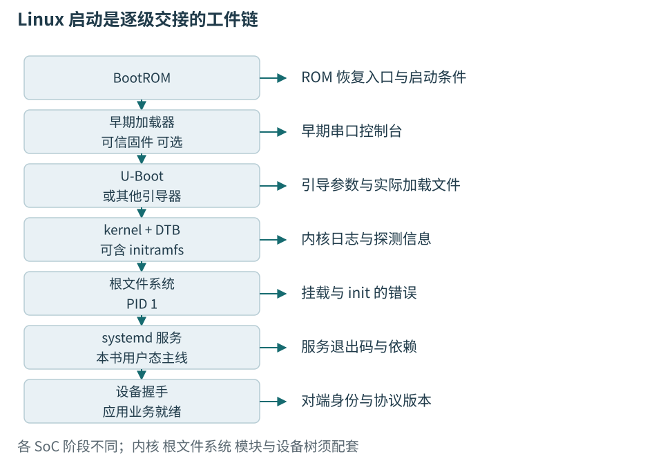
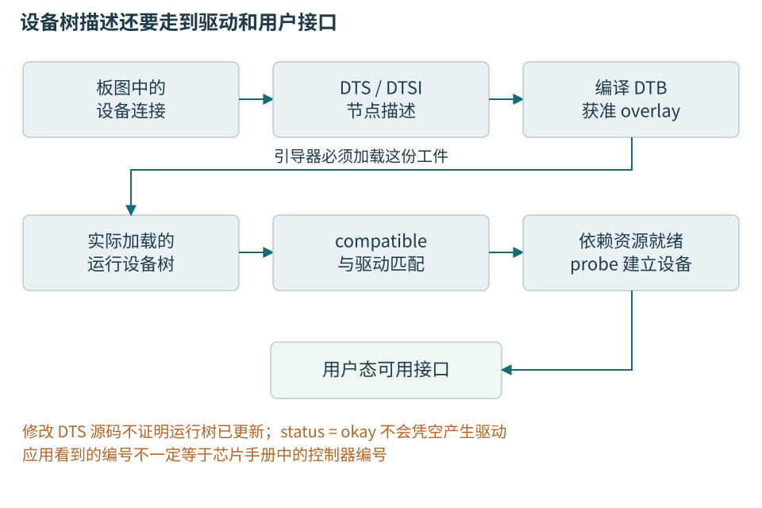

# 第二十一章 嵌入式Linux启动与用户态应用

嵌入式Linux把一台专用设备组织成有进程、文件系统、驱动和服务的系统。它适合承担网络、界面、日志、升级和较复杂的协议，代价是启动与交付不再只是一份固件。内核、硬件描述、根文件系统、动态库和服务配置必须形成可解释的组合，应用才能从“文件已经复制过去”走到“设备确实提供功能”。

本书的Linux主例是温度节点旁边的假设网关：外置F446负责本地采集，网关通过串口接收同一教学协议，保存状态并向测试工站提供数据。网关不是F446上运行Linux，也没有把NUCLEO改成通用计算机。另一种产品可以让Linux直接访问板上传感器，本章用一个受限设备树片段解释这种形式，但不把它作为已经选定的实际硬件。

文献参照为Linux6.12、U-Boot v2024.07、Yocto5.0.4的BSP说明和systemd v256官方手册源码。它们用来固定概念和接口，不是经过配装验证的板卡镜像。本章没有选定真实Linux SoC与载板，没有构建、部署、启用服务或运行任何命令。所有命令和配置都是教学文本；上板控制台、电源和外部接口仍仅限经过审核的隔离低压环境。

## 21.1 BSP把硬件条件组织成软件目标

### 21.1.1 一个产品镜像包含哪些不同工件

**板级支持包**，简称BSP，是让某块硬件获得可维护软件支持所需的配置、描述、驱动、补丁、构建及安装安排。它不是“内核源码加压缩包”的同义词。正确BSP应能说明启动介质、内存布局、控制台、时钟、引脚和外设，以及怎样重复产生相同版本组合。[Yocto BSP概念][S21-1]

**系统级模块**，简称SoM，把处理器、存储和部分供电做成可安装模块；**载板**连接外部接口和产品电路。购买现成SoM可以减少部分硬件工作，但自定义载板的电源、复位、引脚复用和设备描述仍需验证。厂商演示镜像在评估板上启动，不证明它已经支持另一块载板。

Linux设备常见的交付物包括早期启动固件、Bootloader、内核镜像、内核模块、设备树、可能的initramfs、根文件系统、应用和配置。若还有实时核，则它的固件、资源表和协议也进入清单。它们各自有版本和生命周期，不能只给整个产品一个“v3”标签就失去内部组合信息。

| 工件 | 主要职责 | 配套证据 |
| --- | --- | --- |
| 早期固件及引导器 | 初始化和选择下一阶段 | SoC/载板、存储布局、启动策略 |
| 内核与模块 | 调度、内存和设备驱动 | 源码、配置、补丁与构建身份 |
| DTB及获准覆盖 | 描述板级连接和资源 | 基础树、应用顺序与硬件修订 |
| rootfs与应用 | 用户态运行、服务和业务 | 库、权限、配置模式和内容标识 |

镜像是封装形式，可以是一个文件系统、一整个磁盘分区组合，也可以只含一个内核。刷入“新镜像”究竟替换了什么，必须从安装清单判断。保留下来的Bootloader环境、身份、校准和数据，有时比新复制文件更能解释故障。

### 21.1.2 启动链是一系列交接

常见Arm系统从SoC中的Boot ROM开始，按启动选择寻找早期代码；随后可能经过小型加载器、可信固件和U-Boot，再进入Linux。并非每种SoC都包含这些阶段，也不是所有平台都用U-Boot。图21-1展示的是可分层诊断的结构，不是万能启动流程。

早期阶段可能负责DDR训练、时钟、电源和存储，内核尚未运行时就可能失败。Bootloader可以装入内核、硬件描述和初始用户态材料，并传递启动参数。内核随后建立自身内存与调度环境，初始化驱动，进入用户态；用户态初始化系统再组织服务。



图21-1 每阶段都有输入、交付物与最早可见证据。标为可选的环节取决于平台，不能从一条示意链推断所有处理器的实际启动顺序。

Bootloader输出最后一行日志后安静，不一定说明内核完全未运行。可能是内核控制台名称、波特率或早期输出配置不同。反过来，出现内核版本文字，只证明进入某段早期路径，不能证明根文件系统已挂载。诊断应把“最后可靠阶段”和“下一阶段需要什么”分开记录。

控制台本身有硬件边界。开发板标记UART的排针通常是逻辑电平，不可直接接传统RS-232；接线前确认准确电平、参考关系和掉电行为，断电更改连接。不能因为Linux日志在终端中看起来像普通文本，就忘记它仍来自真实引脚。

### 21.1.3 Bootloader的环境不是应用配置文件

U-Boot等加载器可能使用持久环境决定从哪块介质、哪个分区加载哪些文件。它的变量与Linux启动后的/etc配置不同。修改rootfs中的某个文件，不一定改变Bootloader实际选择；拷贝新DTB到一个目录，也不证明启动脚本会加载它。

U-Boot自身可使用control FDT来配置其驱动，交给Linux的工作设备树又承担另一阶段的硬件描述。两个树可能相关，也可能分别修改，不能看到U-Boot能识别I2C就推断Linux同样会启用该控制器。[U-Boot设备树控制][S21-2]

引导存储、环境冗余、启动次数和恢复入口都应受版本管理。误改一个持久启动变量可能使系统再也到不了SSH，恢复必须依靠事先确认的控制台或恢复介质。因此本章只解释和展示只读诊断，不提供让初学者盲写环境或整盘烧录的命令。

## 21.2 设备树把板级事实交给驱动

### 21.2.1 节点描述资源 不替设备写驱动

**设备树**用有名称的节点和属性描述硬件连接。DTS是源文件，DTSI常用于共享片段，DTB是编译后的二进制表示，DTBO是按支持方式应用的覆盖。**绑定**规定某种设备的节点应有哪些属性、类型和关系。驱动据此取得地址、中断、时钟、电源与复位等资源。[Linux设备树模型][S21-3]

compatible用于表达与某个已定义硬件接口的兼容关系，不是给设备随意起名字。reg的解释依父总线：I2C子节点中常是总线地址，内存映射设备中可能是地址范围；#address-cells和#size-cells又影响编码。不能把所有reg都读成CPU物理地址。

status设为okay表示描述中启用相应节点，不会生成缺失的驱动，也不保证电源和引脚已配置。内核配置没有包含驱动、驱动依赖资源尚未就绪、compatible不匹配，都可能使用户接口不出现。驱动已绑定又读失败，才进一步沿电气、事务和器件状态检查。



图21-2 编辑DTS只是链条起点。实际加载的DTB、覆盖顺序、驱动匹配和依赖资源一起决定可用接口；设备树不能修复真实接线错误。

### 21.2.2 用一个温度节点读懂属性关系

下面是Linux直接连接TI TMP102传感器的独立教学片段，用于解释绑定形式。它不是本书F446外接传感器的选型，也不是可以直接编译的整板DTS；i2c_controller只是需要由实际SoC基础树提供的标签，地址、引脚、电源和电气条件尚未形成硬件方案。

```text
/* 教学片段，未编译、未装载；省略真实SoC与板级资源。 */
&i2c_controller {
    status = "okay";
    #address-cells = <1>;
    #size-cells = <0>;

    temperature-sensor@48 {
        compatible = "ti,tmp102";
        reg = <0x48>;
    };
};
```

temperature-sensor@48中的48是节点单元地址表示，与reg相配；0x48在此是I2C七位地址，不是UART协议类型或一个RAM位置。compatible取自已有绑定，不是为了“让它认出来”临时伪造。实际板上地址选择脚、上拉、电源域和所连控制器必须与描述一致。[Linux6.12 TMP102绑定][S21-4]

若器件需要额外中断、电源或复位属性，应按该绑定及父控制器绑定添加，不能发明一个看起来合理的字段。引脚复用通常由SoC pinctrl描述和相应驱动处理；同一引脚若同时分给串口和I2C，两个节点都写okay也不会使物理引脚分身。

编译工具能检查语法，绑定schema检查可发现一些结构和属性错误，但无法确认板上焊了正确器件或上拉接到正确电源。静态检查、运行树检查和硬件事务证据分别覆盖不同问题。本文没有执行dtc或dtbs_check，也不把片段标为已通过。

### 21.2.3 改了DTS后还要证明运行系统用了它

一个项目可能同时存在SoC通用树、板级树、Bootloader专用树、多个硬件修订和多个overlay。生成目录里的文件名相同，不代表内容或安装路径相同。应保存源提交、构建配置、输出内容标识和启动选择，沿这条链确认最终生效版本。

Linux运行中的硬件描述可通过适当只读接口观察，但要注意属性可能是二进制编码或以零字节分隔，不能随意cat后按普通文本解释全部字段。读取model或compatible等字符串属性与解析reg地址是不同任务。必要时用匹配工具解码，并保留启动日志和所用DTB。

Overlay不是任意在线修补硬件的许可证。它的应用时机、目标节点、符号、资源释放和驱动热变更能力都有条件。一个已经由驱动占用的GPIO或时钟，不能靠追加覆盖就安全交给另一方。本书的部署思路优先把获准的基础树与覆盖组合固定在发布清单中。

## 21.3 根文件系统建立真正的用户态

### 21.3.1 rootfs与initramfs不是同一个文件名

**根文件系统**是挂载为系统根目录的文件树，包含初始化程序、库、设备管理配置、服务和应用。**initramfs**通常提供早期用户态，可用于准备驱动、解锁或找到真正根文件系统，再交接。某些小系统直接以其内容运行，具体取决于构建方案。[Linux rootfs与initramfs][S21-5]

内核能访问启动介质，不代表能挂载最终rootfs。需要合适的存储控制器、分区识别和文件系统支持；如果必需驱动只作为模块放在尚未挂载的rootfs里，就形成“为了读模块先要有驱动”的循环。可以把启动所需驱动内建，或放入可用的早期用户态，方案必须完整。

root=启动参数告诉内核如何寻找根文件系统，设备编号可能随探测顺序变化，产品通常需要适合其平台的稳定标识。根文件系统类型、挂载选项和只读/读写策略也影响后续服务。不能看到分区存在就推断它已作为当前根挂载。

PID1是系统第一个用户态进程，通常是初始化系统。它负责相应系统组织，而不只是任意后台程序。若内核报告无法启动init，原因可能是文件缺失、架构不符、执行权限、动态加载器缺失或依赖损坏。一个文件“看得见”不等于内核能够执行它。[No working init found说明][S21-6]

### 21.3.2 可执行文件依赖目标运行环境

C++应用通常依赖C运行库、C++运行库、动态加载器和其他库。ELF中的解释器路径指定动态加载入口；NEEDED项列出共享库依赖。目标目录里有app，而解释器路径不存在时，启动可能报告看似奇怪的“没有那个文件”。缺的是装载链的一部分，不一定是app本身。

架构同样重要。开发电脑生成的x86-64文件不能直接在Arm64网关执行；32位Arm的ABI与浮点约定又不能自动等同于AArch64。即使架构一致，依赖较新C库符号的程序也可能无法在旧rootfs运行。部署要固定CPU架构、ABI、运行库和可用内核接口，而不只记录编译器版本。

下面是可在具备相应工具的授权诊断环境中使用的只读检查示意，本书没有运行它们。readelf解析文件结构，不需要执行目标程序；检查不可信文件时，不应随意用可能触发其加载器行为的工具替代静态分析。

```sh
# 教学命令，未执行；路径需替换为已确认的目标工件。
file ./tempnode-gateway
readelf -h ./tempnode-gateway
readelf -l ./tempnode-gateway
readelf -d ./tempnode-gateway
```

-h检查ELF类别与机器，-l帮助找到程序头和解释器，-d显示动态依赖。工具输出仍需与目标rootfs对照。只知道NEEDED含libstdc++.so.6不够，还要核对所需符号版本；复制另一个系统的同名库可能继续引入不兼容依赖。

### 21.3.3 只读系统也有必须写入的数据

只读根文件系统可以减少意外修改和恢复复杂度，但运行时仍可能需要日志、状态、套接字、锁文件和更新工作区。应分别安排临时目录、持久状态目录和受控配置，而不是让应用默认在当前目录写文件，失败后再统一改成root运行。

/run通常承载本次启动的运行状态，/var/lib下的应用目录适合持久业务状态，配置通常位于/etc或产品指定位置。具体挂载和持久化策略由发行方案决定，不能只凭路径名字保证掉电保存。某些目录可能位于tmpfs，重启就消失；日志是否持久也受服务配置和空间限制影响。

温度网关的设备绑定、校准关联和未完成上传状态需要可恢复记录，临时接收缓冲则不应全部落盘。写返回成功、系统调用同步完成和实际存储断电恢复是不同层次。完整提交和目录同步原则由本书记录章节承担，本章强调这些需求必须在rootfs布局时得到位置和权限。

## 21.4 交叉构建把开发机与目标机分开

### 21.4.1 编译器前缀不能独自保证兼容

**交叉编译**是在一种运行环境中生成另一目标的程序。工具链不仅包含编译器，还包含汇编器、链接器、目标库和头文件。**sysroot**为构建提供目标系统的头文件和库视图，帮助避免链接到开发电脑自己的内容。

给CMake设置一个带aarch64前缀的编译器，却让pkg-config找到主机Qt或主机OpenSSL，可能得到错误库、错误配置结果或不可部署工件。目标包查找、构建时运行的小工具和目标端运行的库需要分清；一个项目可能需要主机代码生成器，同时链接目标库。

应使用产品BSP或发行方案提供的匹配SDK，记录工具链、sysroot内容、应用依赖和构建选项。Yocto是组织和生成镜像的工具生态，Buildroot也是另一种常见选择，它们不是目标进程运行时调用的操作系统。选择哪种构建方案不改变“输出必须与目标rootfs匹配”这个要求。

本书没有构建SDK或冻结某块Linux板的镜像，因此不提供虚构的哈希和“编译通过”截图。实际工程至少应把可执行文件、调试符号、配置和依赖清单一起归档，避免现场崩溃后只有剥离符号的一个文件。

### 21.4.2 内核模块不是普通共享库

用户态程序通过稳定的用户接口请求内核功能，而内核模块直接使用内部结构和API。上游Linux不承诺所有版本之间稳定的模块二进制接口；发行版可能另外维护政策，但不能凭“都是6.x”推断模块可用。[内核内部与用户接口边界][S21-7]

因此内核、模块树、配置和工具链应配套。更新内核却保留旧模块目录，可能使某些外设在新系统中消失；内建驱动则不会出现在模块列表里。发现lsmod没有某个名字，不能直接认定驱动不存在。

C++应用不应靠包含内核内部头文件与私有结构来获取设备能力。使用UAPI、现有子系统和受支持库，可以把业务维护与内核演进分开。必要的新驱动应按内核支持的语言和子系统规则开发，本书不把C++内核驱动作为默认路线。

### 21.4.3 发布清单要覆盖配置和恢复

一份最小发布清单包含SoC/载板身份、BSP源码与补丁、Bootloader、内核及模块、设备树组合、rootfs、应用、配置模式和协议版本。可变标签旁边应有不可变内容标识；实物序列号和校准关联另有存储，不混进所有设备共用的基础镜像。

恢复材料也要经过同样管理。内核未启动时，SSH不会出现；rootfs损坏时，普通应用更新器可能无法运行；应用与设备协议不匹配时，操作系统虽然启动成功，产品仍未就绪。恢复应分别覆盖这些层，不能只说“失败后重启”。

上一章的配置迁移问题在Linux中同样存在。OS回滚可能保留/var中的新数据库，旧应用未必能读；容器回滚也不会自动回退外部卷。发布设计应明示哪些持久数据与哪个应用版本兼容，确认前避免不可逆迁移。

## 21.5 systemd把程序组织成服务

### 21.5.1 前台进程适合由服务管理器监督

一个**服务进程**持续承担设备功能，不依赖用户保持终端登录。systemd可以按unit配置启动、监督和停止它。应用通常在前台运行，让管理器跟踪主进程；没有必要先自行多次fork到后台，再让管理器猜哪个PID才是真正服务。

下面是systemd v256语义下的教学unit。假定tempnode用户与组已由产品镜像配置，/usr/bin/tempnode-gateway和配置文件已正确部署，设备访问另有最小权限规则。没有实际创建账号、修改权限或启用此服务。

```ini
# 教学配置，未安装、未启用、未运行。
[Unit]
Description=Temperature node gateway
StartLimitIntervalSec=60
StartLimitBurst=5

[Service]
Type=exec
User=tempnode
Group=tempnode
ExecStart=/usr/bin/tempnode-gateway --config /etc/tempnode/gateway.conf
Restart=on-failure
RestartSec=2
TimeoutStopSec=5
StateDirectory=tempnode
RuntimeDirectory=tempnode
WorkingDirectory=/var/lib/tempnode
NoNewPrivileges=yes
ProtectSystem=strict

[Install]
WantedBy=multi-user.target
```

Type=exec表示成功执行服务程序后，管理器才把相应启动步骤视为完成，比只创建进程更接近实际装载结果；它仍不证明串口已握手或第一份有效温度已到达。需要明确业务就绪通知时，可设计Type=notify并在应用满足定义后发送相应通知，但不能只换unit字段而应用什么也不做。[systemd服务类型][S21-8]

Restart=on-failure用于符合规则的失败重启，RestartSec避免无间隔重启，启动限速限制短时间反复失败。它们不是错误修复。配置文件缺失时每两秒重启一次仍然缺失，应报告明确原因；设备暂时未插入时，程序可保持受控等待并对外显示未连接，不必把每次热插拔都变成崩溃。

### 21.5.2 启动顺序与业务依赖要分开

After表达顺序，不自动把另一个服务拉起来；Wants或Requires表达不同强度的依赖，也不自动证明远端业务已经可用。network.target并非“互联网通了”的证明，network-online.target也取决于网络管理实现，不能保证某个服务器响应。

温度网关的本地采集可以独立于网络上传运行，因此示例没有把网络上线作为启动前提。应用为网络状态保留有界重试和离线队列，串口身份握手也由自身状态机负责。依赖关系应准确反映不能缺少的条件，避免一个可选服务拖住整机启动。[unit依赖语义][S21-9]

同理，设备节点存在不保证设备已准备好执行业务。服务管理器可以组织设备出现后的启动，但协议版本、身份和校准关联仍由应用验证。把固定sleep5写进启动脚本，只是在多数情况下等待足够久，不能解释更慢或失败的启动。

### 21.5.3 运行身份与目录要一起设计

服务账号只获得需要的设备和目录权限。StateDirectory和RuntimeDirectory帮助管理相应目录与所有权，ProtectSystem=strict限制文件系统写入，但明确配置的状态目录仍按systemd语义提供所需写入范围。NoNewPrivileges限制后续提权途径，不替代设备节点权限。[执行环境手册][S21-10]

如果加入PrivateDevices等隔离选项，服务看到的设备视图可能改变，串口节点不一定可见；不能把所有“安全选项”复制进unit再用root绕过故障。先列程序需要哪些设备、路径和系统调用，再逐项缩小权限，并检查实际运行身份下仍能完成任务。

WorkingDirectory设置避免程序把相对路径解释为意外目录，但配置和重要资源仍宜使用明确路径。shell中的PATH、环境变量和交互账号权限不一定存在于服务环境。命令行运行成功、服务启动失败，应先比较身份、工作目录、环境、挂载和权限，而不是直接改代码。

### 21.5.4 停止服务要求应用完成自己的清理

systemd通常先按配置发送终止信号，并在停止期限后采取进一步措施。应用收到停止请求后，应唤醒阻塞事件循环，停止接受新命令，处理在途请求，关闭设备并提交必要状态。不能在信号处理函数里直接调用复杂C++日志、锁或任意析构链；应使用受支持的信号交接方式，让普通执行上下文完成工作。

TimeoutStopSec=5是管理器给的停止政策，不是应用天然保证5秒清理完成。若底层read可能永远阻塞，应用要有可取消等待或有限poll，下一章给出设备访问组织。强制终止之后，RAII析构未必执行，持久记录必须能从中间状态恢复。

日志应包含应用构建、配置版本、设备身份、会话代际、错误阶段和最近进展。标准输出可以交给journal，但是否跨重启保留、限流和空间上限由系统配置决定。不要把密钥、完整凭据或不必要用户内容写进去，诊断便利不能扩大秘密暴露。

## 21.6 先观察失败发生在哪一层

以下只读命令展示诊断对象，不是本书实际输出，也不代表所有最小rootfs都安装了相同工具。实际使用需按目标权限，日志中可能含敏感信息，导出前应限制范围。

```sh
# 教学命令，未执行。
uname -a
cat /proc/cmdline
systemctl status tempnode-gateway.service --no-pager
systemctl show tempnode-gateway.service -p User -p Group -p ExecStart
journalctl -u tempnode-gateway.service -b --no-pager
```

uname提供运行内核身份，但不完整表达厂商补丁和构建配置；/proc/cmdline反映内核接收的参数，不等于Bootloader所有持久环境。systemctl status展示服务管理状态，journalctl给本次启动日志；两者都不证明传感器电气连接正确。

假设教学设备内核启动后报告找不到工作init。先确认root=指向预期根、所需存储与文件系统支持可用，再检查init文件、架构、执行属性和动态解释器。若rootfs中有/sbin/init但缺少它要求的加载器，“文件在却无法执行”就有了可验证解释。修正应恢复配套rootfs，而不是从另一发行版复制一个同名库碰碰运气。

第二种情境是终端手工运行网关正常，服务却报告打开串口失败。需要补充服务UID/GID、节点权限、实际路径、unit设备隔离和安全策略。若手工使用root，而服务账号不在获准设备组，权限差异已能解释失败；修正应为准确设备建立最小规则并验证账号权限，不把整个程序改成长期root。

第三种情境是设备树源码已经把控制器设为okay，运行中却没有对应设备。先验证构建输出与Bootloader选择，再检查运行树、驱动配置和依赖。如果实际加载的是旧DTB，修改驱动超时没有帮助；若运行树正确但probe延后，就继续查时钟、电源或其他提供者。只有找到第一个不成立的交接，才知道改动应该落在哪个工件。

验收应覆盖冷启动、独立上电、服务异常退出与重启、设备晚到和拔除、rootfs只读及状态目录空间不足。启动成功只是起点，网关还须重新握手、拒绝旧会话结果并保持日志可追溯。本书没有执行这些情境，不把解释完整当作系统已部署。

**追问 BSP和驱动有什么区别。** 驱动处理某类设备与内核接口，BSP把特定硬件的启动、描述、配置、补丁和构建交付组织起来。一个正确驱动放在错误设备树和内核配置里，仍不能形成可用板卡。

**追问 服务显示active是否已经可以采集。** 取决于服务类型和应用就绪契约。Type=exec主要说明程序装载执行成功；串口打开、身份确认、协议版本和有效数据要另外观察。应该把操作系统可运行、服务可运行和设备业务可用分成独立状态。

## 本章资料与核验范围

2026-10-06读取固定官方资料。systemd公共HTML入口返回访问错误，改用官方仓库v256的手册源码核验，未把不可读取的v256.7页面当成证据。没有编译DTS、构建镜像、部署服务或执行诊断命令。

- [S21-1 Yocto5.0.4 BSP指南][S21-1]，组织概念
- [S21-2 U-Boot v2024.07设备树控制][S21-2]，阶段与control FDT
- [S21-3 Linux6.12设备树使用模型][S21-3]；[S21-4 TMP102绑定][S21-4]
- [S21-5 Linux6.12 rootfs/initramfs][S21-5]；[S21-6 init失败说明][S21-6]
- [S21-7 Linux6.12内部驱动接口边界][S21-7]
- [S21-8 systemd v256 service手册源码][S21-8]；[S21-9 unit手册][S21-9]；[S21-10 exec手册][S21-10]

[S21-1]: https://docs.yoctoproject.org/5.0.4/bsp-guide/bsp.html
[S21-2]: https://docs.u-boot.org/en/v2024.07/develop/devicetree/control.html
[S21-3]: https://docs.kernel.org/6.12/devicetree/usage-model.html
[S21-4]: https://raw.githubusercontent.com/torvalds/linux/v6.12/Documentation/devicetree/bindings/hwmon/ti,tmp102.yaml
[S21-5]: https://docs.kernel.org/6.12/filesystems/ramfs-rootfs-initramfs.html
[S21-6]: https://docs.kernel.org/6.12/admin-guide/init.html
[S21-7]: https://docs.kernel.org/6.12/process/stable-api-nonsense.html
[S21-8]: https://raw.githubusercontent.com/systemd/systemd/v256/man/systemd.service.xml
[S21-9]: https://raw.githubusercontent.com/systemd/systemd/v256/man/systemd.unit.xml
[S21-10]: https://raw.githubusercontent.com/systemd/systemd/v256/man/systemd.exec.xml
