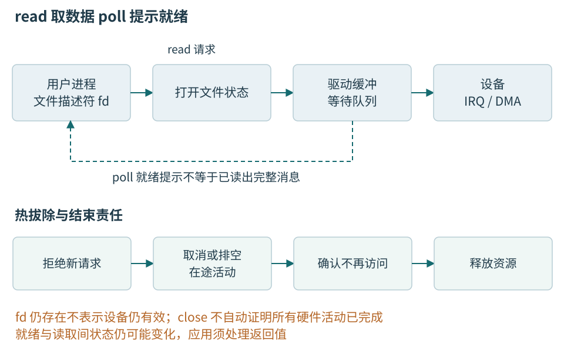
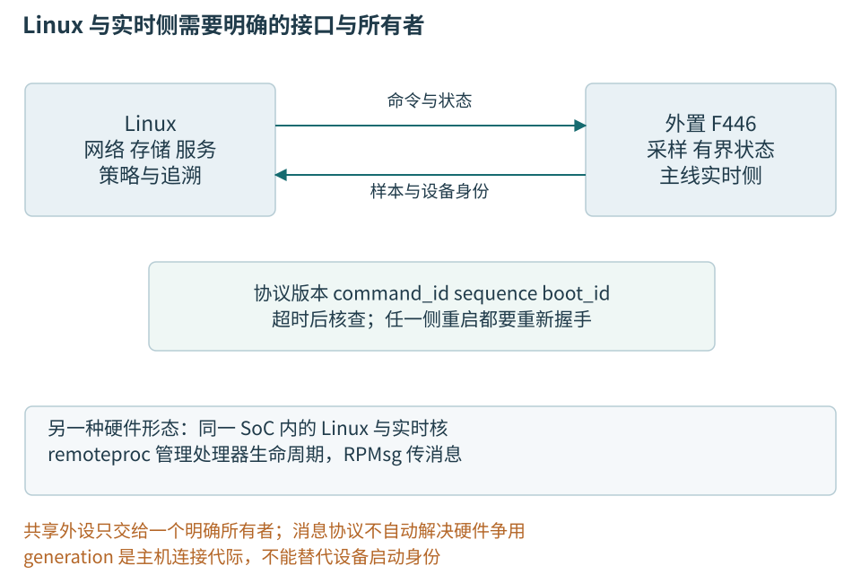

# 第二十二章 Linux设备访问与驱动边界

Linux应用通过受控制的接口访问设备。打开一个设备节点后获得的文件描述符，连接到内核中的打开状态、子系统和驱动，再由驱动管理寄存器、中断与DMA。应用看到的read、write或poll很简洁，但每个接口都有数据、等待、权限和生命周期契约。了解这些契约，才能把“打不开”“读不出”“读到旧值”和“拔掉后仍有回调”分成不同问题。

本章沿温度网关的串口接收走一条用户态主链，随后说明什么时候已有子系统足够，什么时候需要驱动工作，以及Linux与实时侧怎样协作。主线使用C++管理用户态资源，不把“用C++写Linux内核驱动”当成入门目标。内核机制参照Linux6.12，用户接口参照核验日Linux man-pages，设备权限参照systemd v256的udev规则。

全部代码、配置和命令都是未编译、未执行的教学文本，没有修改权限、加载模块、绑定设备或接入真实硬件。设备侧操作仍限定在隔离低压、接口电平和参考关系已确认的教学环境；不能因为经由一个文件描述符访问，就把未知工业设备的动作当成普通文件写入。

## 22.1 设备节点只是受控接口的名字

### 22.1.1 从路径到文件描述符再到设备

**设备节点**是文件系统中的特殊对象，常见字符设备和块设备两类。字符设备按驱动契约提供字节、记录或控制接口，并不意味着永远只能一次读一个字节；块设备适合按块组织存储。路径如/dev/ttyACM0帮助程序找到对象，主次设备号帮助内核连接到相应实现。

open成功返回的**文件描述符**是进程中的一个整数索引。它不是设备序列号，也不是永久身份。关闭后，同一个整数可能很快分配给别的文件；设备拔出后，旧描述符还可能存在，只是操作返回错误或挂断。重新出现的同名路径通常代表需要重新打开和握手的新会话。[open接口][S22-1]

一次打开具有相应内核状态，dup可共享同一个打开文件描述。应用应明确唯一所有者，避免一个线程关闭后另一个线程还拿旧整数读取，碰巧访问新复用的文件。

节点存在只说明接口已注册，还须检查初始化、权限和设备是否移除。有些传感器经hwmon属性提供值，网络设备经socket使用，并不都对应一个/dev数据文件。先确定正确子系统，再解释接口。

### 22.1.2 tty名字与物理设备身份不同

ttyACM0、ttyUSB0等编号通常与驱动和发现顺序有关。插入顺序变化、不同端口、系统重启或另一设备加入，都可能改变编号。产品应依据已验证的设备属性建立稳定查找，再通过应用握手确认目标身份和协议版本。

某些发行方案提供/dev/serial/by-id链接，极简系统未必生成，同型号设备也可能没有唯一序列号。只匹配USB厂商和产品编号，无法区分多个同型号适配器。

ST-LINK虚拟串口标识的是桥接器，业务握手标识目标温度设备。不能把适配器序列号直接当产品生产序列号，维修更换后的记录尤其要区分。

主机打开新连接时推进本地generation，并清除旧解析缓存、旧超时和过时回调。设备是否重启还要看握手的设备启动身份，不能从端口名字是否改变推断。sequence用于采样顺序，三者各自解决不同的复用问题。

### 22.1.3 权限失败不应该用永久root掩盖

传统设备访问受节点所有者、组、模式位以及可能的ACL控制，容器设备策略、服务隔离和强制访问控制还可能增加限制。EACCES通常指权限问题，但要核对实际路径和执行身份；ENOENT则可能是路径不存在；ENODEV、EIO等又可能来自设备或驱动状态。错误码是定位入口，不是跨所有驱动的完整故障说明。

udev根据设备事件与属性应用规则，建立权限和符号链接。下面只表达按准确设备限制访问的思路，其中vvvv、pppp和SERIAL_VERIFIED均为占位，不能原样安装。应先只读检查真实属性，再由获准配置流程写入相应规则。[udev规则手册][S22-2]

```text
# 教学规则，未安装；三个身份值必须换成已核实的属性。
SUBSYSTEM=="tty", ATTRS{idVendor}=="vvvv", \
  ATTRS{idProduct}=="pppp", ATTRS{serial}=="SERIAL_VERIFIED", \
  GROUP="tempnode", MODE="0660", SYMLINK+="tempnode"
```

规则把匹配设备授予专用组，不把所有串口设为全员可写。多条ATTRS匹配的父级关系也要按udev规则核对，不能从不同祖先节点随意拼字段。若硬件没有可靠唯一属性，就必须另选稳定连接位置和握手校验，不能编造一个序列号。

修改某个/dev节点的模式位可能在下一次插拔后丢失；加入设备组也不意味着现有进程已自动取得新组身份。服务还可能因PrivateDevices或设备策略看不到节点。应验证最终运行进程的身份与可见对象，最小权限改动只针对需要的设备和动作。

“临时root运行正常”只提示身份或权限差异，未确定具体限制。最终修正应缩到准确设备与服务账号，避免长期扩大应用出错时的影响范围。

## 22.2 读写接口需要处理部分进展

### 22.2.1 read返回的是本次取得的字节数

read(fd,buffer,count)尝试取得最多count字节，返回正数表示本次实际收到的数量。小于count不是错误，串口可能只到了帧头，管道也可能只有一部分内容。负数表示失败，errno说明原因；零的含义要结合对象和配置判断。普通文件常表示末尾，终端非规范模式的VMIN/VTIME及非阻塞条件也可能导致零返回。[read接口][S22-3] [termios接口][S22-4]

因此，温度网关不能要求一次read恰好返回16字节。它把正数范围内的字节送入有界解析器，按全书A5 5A、版本、类型、长度、sequence和CRC逐帧形成结果。最大载荷64字节，温度类型01的载荷恰好4字节；只在完整验证后产生temperature_mC。

read得到的数据只在调用者缓冲当前生命期内有效。若解析器异步保存一个指向局部数组的span，而读取函数返回后数组被重用，就重现了前章DMA指针寿命问题。同步feed可以在调用内消费，异步交接则应复制到拥有者存储，或建立明确借用期限。

write同样可能只接受部分字节。应用保存已提交偏移，继续处理剩余部分，遇到EINTR或EAGAIN按契约等待。返回完整长度通常表示进入相应内核或驱动路径，不等于线路发完，更不等于节点应用完成命令。应用确认、command_id与超时重试语义仍不能省略。

### 22.2.2 阻塞 非阻塞与错误要分别处理

阻塞read可以等待数据，优点是逻辑直接；缺点是必须有停止和超时方案。非阻塞描述符在暂时无数据时常返回EAGAIN或EWOULDBLOCK，表示现在不能完成，不代表设备永久损坏。EINTR表示调用在相应条件下被信号打断，也不能一律当成断连。

重试EINTR时要保留整体截止期。若每次被信号打断都重新获得完整5秒预算，持续信号可能让原本5秒的等待无限延长。应使用单调时间计算剩余预算，并在到期后返回明确超时，而不是只在每个系统调用上填一个常数。

同一个错误码在不同设备上可能有不同细节。USB串口拔出常见挂断或I/O错误，但具体顺序受驱动、缓冲和系统状态影响。应用应按设备契约识别终止，同时保留errno、poll事件、设备身份和时间，而不是硬编码“只要不是某一个错误就继续永远读”。

控制写超时可能发生在设备已接受之后，不能套用“失败就重来”。校准提交或参数设置必须通过事务身份判断重复副作用，不能照搬读取重试。

### 22.2.3 termios决定字节流有没有被终端规则改变

TTY接口原本服务终端，也可用于串口。**规范模式**可能按行收集并处理编辑字符，回显会把输入返回，换行转换和软件流控也可能改变字节。二进制温度帧若未切到适当原始模式，某些字节可能被当作控制字符处理。

配置应从tcgetattr取得当前状态，再有意识地修改波特率、数据位、奇偶校验、停止位、流控和读取策略，最后检查tcsetattr结果。cfmakeraw帮助关闭一组典型终端处理，但仍要按项目明确其他设置和平台扩展；它不是完整的串口产品初始化。

```cpp
// 教学片段；未编译、未运行；Linux termios接口。
// 前提：fd由本会话独占，电气条件已确认。
#include <termios.h>

bool submit_uart_config(int fd) noexcept {
    termios cfg{};
    if (tcgetattr(fd, &cfg) == -1) {
        return false;
    }
    cfmakeraw(&cfg);
    cfg.c_cflag &= ~(CSIZE | PARENB | CSTOPB | CRTSCTS);
    cfg.c_cflag |= CS8 | CLOCAL | CREAD;
    cfg.c_iflag &= ~(IXON | IXOFF | IXANY);
    cfg.c_cc[VMIN] = 1;
    cfg.c_cc[VTIME] = 0;
    if (cfsetispeed(&cfg, B115200) == -1 ||
        cfsetospeed(&cfg, B115200) == -1) {
        return false;
    }
    // 仅表示提交未报错；调用后还需回读核查关键字段。
    return tcsetattr(fd, TCSANOW, &cfg) == 0;
}
```

tcsetattr返回0可能只表示所请求的部分修改成功，因此上面的函数只提交配置。调用后必须再次tcgetattr，比较输入/输出波特率、字符格式、流控、原始模式及VMIN/VTIME等关键字段，全部符合约定后才进入握手；不能对整个结构体按字节memcmp。示例请求关闭硬件和软件流控，只适用于双方已约定无流控的链路。CRTSCTS和cfmakeraw具有平台特性与头文件宏条件，应由工具链支持清单确认。VMIN/VTIME与O_NONBLOCK组合的具体返回行为仍需按接口处理，不能由这里的1和0推导所有read都必定返回正数。

TCSANOW立即应用修改，真实产品若已有在途传输，需要先完成约定的停止和排空。tcflush会丢弃相应队列数据，不是无害的“修复串口”动作；打开或关闭时控制线变化也可能影响目标复位。初始化顺序、HUPCL等设置和板级连接要一起核对，不能在不了解副作用时照抄。

## 22.3 poll把等待对象放进同一个事件循环

### 22.3.1 就绪只表示值得再尝试一次

poll等待一组描述符出现指定条件，例如可读、可写或异常。它让一个线程同时等待串口、停止事件和其他输入，而不必轮询忙转。POLLIN表示可以尝试读取，POLLHUP表示挂断相关状态，POLLERR与POLLNVAL分别提示错误或无效描述符条件，具体组合需要处理。[poll接口][S22-5]

就绪不是对数据的永久预约。另一个消费者可能先读走数据，设备也可能改变状态，所以poll返回后read仍可得到EAGAIN。更根本的办法是让一个线程拥有本会话接收，避免多个消费者争抢同一字节流；但仍要正确处理接口允许的暂不可用结果。

挂断时可能仍有缓冲数据可读。看到POLLHUP就直接丢弃全部未消费字节，可能损失最后一份完整故障报告；反过来，读到一点残留数据也不能宣布设备仍在线。应用可先有界排空可读数据，再结束会话，最终状态与最后数据分开报告。



图22-1 poll提供就绪提示，read取得实际数据，close结束一个描述符引用。设备活动和内核对象可能有更长生命期，驱动必须先停止在途使用再释放。

### 22.3.2 一次可取消读取怎样表达结果

事件循环同时等待serial_fd与独立stop_fd。前者以O_NONBLOCK打开并完成终端配置，后者可以是受控eventfd或管道；两者由会话拥有者保持有效到工作线程退出。调用者使用有界小缓冲，并以单调时间维护整个等待的截止期。下面是接口步骤，不是已运行的完整C++程序。

```text
教学步骤 未执行
1 计算整体截止期剩余毫秒，已经到期则返回超时
2 poll同时等待串口POLLIN与停止事件POLLIN
3 poll返回0：超时；返回-1：保存errno
  EINTR回步骤1；其他错误进入故障处理
4 停止事件可读：进入有界收尾，不启动新读取
  停止描述符出现ERR/HUP/NVAL：报告停止通路故障
5 串口POLLNVAL：描述符无效，结束本会话
6 记录串口是否有POLLHUP/POLLERR，再做非阻塞read
7 read大于0：仅把实际字节数交给同步解析器
  有终止事件时有限排空残留，之后结束会话
8 read为0或EAGAIN/EWOULDBLOCK：本次没有取得数据
  有终止事件则收尾；否则按设备契约再次有界等待
9 read被EINTR打断：回步骤1，保留已经观察的终止状态
  其他错误：保留errno和事件，按驱动契约结束或恢复
```

这套步骤不把TTY零返回一律当EOF，也不把挂断后的残留字节当成重新在线。反复出现“可读却零进展”时应限制重试并记录，不能立即无休止地poll/read忙转。每次正数读取只交付当前缓冲范围；解析器若异步使用数据，必须取得独立存储，不能保留将被下一次read覆盖的借用。

停止事件在本轮优先；业务若必须保存尾部报告，可另外安排有总时限和字节上限的排空阶段，不能等到“设备不再发送”为止。O_CLOEXEC限制描述符继承，O_NOCTTY避免适用情况下成为控制终端，O_NONBLOCK防止read再次无限阻塞；这些标志不替代身份握手与完整退出协议。

### 22.3.3 close不是跨线程取消的万能按钮

另一个线程正在read或poll时直接close该描述符，存在对象引用、平台行为和整数复用问题。在Linux上，阻塞操作可能持有底层打开文件描述的引用并继续完成；旧整数还可能被其他open复用。因此，用独立停止事件唤醒拥有者，让它自行结束I/O并close，通常更容易说明责任。[close接口][S22-6]

C++ RAII适合表达文件描述符的唯一关闭责任，包装类型应禁止拷贝或明确复制语义，移动后旧对象变成无效状态。close返回错误也要有诊断，但在Linux上不能无脑重试close，因为原描述符可能已被释放并复用。析构通常不抛异常；需要报告持久化或协议结束错误，应先执行显式完成步骤。

串口关闭不撤销已经发到设备上的命令，也不保证远端停止采样。需要停止业务时先发送受支持停止请求并处理确认，再按本地退出期限清理；若确认未知，就把状态报告为未知或失联，不能仅凭close成功写“设备已停止”。

## 22.4 选择现有接口还是开发驱动

### 22.4.1 用户态首先使用已有子系统

Linux提供TTY串口、hwmon硬件监测、IIO工业I/O、输入、GPIO字符设备、I2C和SPI等不同接口。它们对数据、事件和配置各有约定。若已有合适驱动，不应为了少读一点文档绕到原始寄存器；现有子系统往往已经承担电源管理、并发与生命周期。

上一章TMP102例子在支持的内核驱动下可通过hwmon提供温度。hwmon常用固定点文本属性表达数值，但准确单位与个别例外应查对应ABI，不能对任何名字包含temp的文件无条件按毫摄氏度解释。hwmon编号也可能变化，应用需要核对name、设备路径和板级通道标签。[hwmon ABI][S22-7]

读取sysfs属性通常取得一个当前快照，不保证每次读取都触发新物理转换，也不自带样本序号和采样时刻。若驱动缓存结果或芯片更新率较低，应用每毫秒读一次仍可能重复同一测量。用于工站追溯时，要说明新鲜度、更新间隔和所用接口能提供的证据。

对普通GPIO，优先使用当前字符设备API及适合的库，按chip和line request管理资源；不要把过时sysfs GPIO接口作为新产品默认路线，也不要在已有串口、PWM或I2C驱动的引脚上用用户态循环模拟协议。[GPIO字符接口][S22-8]

### 22.4.2 原始I2C访问需要总线所有权

/dev/i2c-N暴露的是一个I2C适配器接口，不是唯一某个温度器件。适配器编号可变化，应通过系统描述确认物理总线。用户态必须检查控制器能力、准确地址和事务形式；某些设备需要重复START的组合事务，简单write后read可能在中间产生STOP而改变含义。[Linux I2C用户接口][S22-9]

I2C_RDWR等ioctl可以在支持条件下表达组合消息，SMBus辅助函数适合相应器件。应用不应把七位地址自行拼进普通数据缓冲后期待驱动按另一协议解释。能力查询、消息数量、长度和返回结果都要检查。

如果内核已有驱动拥有该器件，另一个原始用户态程序又改寄存器，就可能破坏驱动的配置和缓存假设。不要用强制访问选项绕过占用警告，也不要在未知总线上盲扫地址；探测动作对有些设备会产生真实事务和副作用。产品中应给每个器件确定一个控制权来源。

GPIO、I2C和SPI文件写入都可能控制真实电气信号。即使软件权限允许，也仍需确认低压、电平、供电与参考关系；本书不把原始接口开放给任意网络请求，更不把它接到运行中的工业网络作练习。

### 22.4.3 ioctl是一份需要长期维护的数据ABI

**ioctl**允许对打开对象执行设备相关控制，不是一条可以传任意C++对象的后门。用户指针属于用户地址空间，对象里可能包含虚表、内部指针和不稳定布局；内核不能把它当自己的对象直接使用。接口应定义固定宽度字段、合法范围和扩展规则。[ioctl设计文档][S22-10]

控制结构应使用固定宽度参数，保留字段初始化为零，size和flags只按既定向后兼容规则解释。新增语义优先使用新的ioctl命令号，并保留旧命令兼容；不能用version字段把同一个旧命令重新解释成另一操作。32位与64位的long、指针和对齐不同，也不应未经设计进入长期ABI；返回数据不得泄露未初始化填充字节。

扩展规则应说明未知字段、标志和命令如何处理，以及失败是否有部分副作用。设置周期后“参数接受”和“已按新周期产生首样”是两种确认。

sysfs适合按子系统约定表达属性，不适合随意塞入大块私有二进制协议；debugfs面向调试，不能把其路径和格式当稳定产品ABI。应用通过正则匹配内核日志中的一句话判断命令完成，也缺少可靠兼容与关联键。

### 22.4.4 什么工作确实需要进入内核

专用IRQ、DMA、电源管理或子系统集成可能需要新驱动，理由应具体到机制。用户态便于隔离和更新，内核态接近硬件，也承担更大的破坏范围，不能只凭“更快”决定。

Linux内核不是桌面C++运行环境，std::mutex、new、异常和标准线程库不能直接替代内核原语。C++主线在用户态；驱动遵循内核支持语言、锁、分配和子系统规则，不能把用户类改个编译选项就装进内核。

/dev/mem或任意物理地址映射会绕开驱动的控制权、电源与缓存组织，并可能触碰关键寄存器，不能作为“驱动还没好”的捷径。用户态驱动框架也要有平台支持和隔离设计。

## 22.5 驱动绑定之后仍有初始化和结束责任

### 22.5.1 模块存在 设备匹配与probe成功不同

Linux设备模型组织设备、驱动、总线和类别。USB、PCI等可通过枚举提供身份，某些板级设备通过设备树描述资源。驱动注册声明能处理什么设备，匹配后执行probe建立具体实例。模块已加载可能没有任何硬件匹配，内建驱动又不需要独立模块文件。[设备模型][S22-11]

probe需要取得寄存器、中断、时钟、电源、DMA能力和内存，初始化完成后才向用户公开服务。某个电源或时钟提供者未就绪时，驱动可以按框架返回延迟探测条件。它不是“设备随机坏了”，也不应通过无限立即重试占满CPU。

诊断依次确认硬件描述或枚举、ID匹配、驱动构建注册、依赖、probe与用户接口。接口出现后I/O失败，再查具体设备状态，不能用一个模块名字代表整条链通过。

### 22.5.2 devm只帮助资源释放 不停止异步访问

devm一类托管资源接口让内存或其他资源随设备生命周期释放，减少错误路径遗漏。它不自动证明工作队列、中断或DMA已经结束。设备移除时，先释放内存再停止DMA，硬件仍可能写进已交给别人的地址。[devres文档][S22-12]

正确结束需要阻止新请求，标记设备不可用，再按设备依赖协调在途I/O、中断、工作队列和DMA，最后释放资源。如果等待完成依赖某个中断，不能过早把该通知路径关掉；如果设备已物理消失，也不能无限读MMIO等待它回应。顺序由设备协议决定，而不是一个通用析构列表。

文件描述符、mmap映射和设备对象可能具有不同生命期。用户进程退出不意味着硬件已经完成所有访问，映射也可能在原描述符关闭后存在。驱动需要保持必要引用并定义撤销语义，应用则要处理设备消失和映射失效，不能把进程存在性当成DMA所有权证明。

### 22.5.3 内核上下文决定可以睡眠还是只能短处理

传统硬IRQ处理不能随意睡眠，普通mutex等可能阻塞的操作不适用；线程化中断和工作队列又有不同条件。共享IRQ还要求判断是否属于本设备。不能把所有“下半部”当作一种固定上下文，也不能从函数名推断它一定安全。[锁类型与PREEMPT_RT条件][S22-13]

自旋锁用于相应不能睡眠的短临界区，但同CPU任务持锁时若被会取同锁的中断打断，就需要正确的中断保存协议。关闭本地中断又不能排除其他CPU。PREEMPT_RT会改变某些锁的行为，仍保留特定原始自旋锁等边界，不能把非RT经验不加条件搬过去。

内核并发原语不是std::atomic的别名，具体实现遵循内核内存模型。x86上暂未出错也不能证明跨架构访问正确。

### 22.5.4 CPU地址与DMA地址不能互相强转

用户虚拟地址、内核虚拟地址、物理地址和设备DMA地址可能不同。IOMMU等机制还可改变设备看到的地址范围。Linux DMA API负责映射、设备寻址能力、方向和同步，驱动不能把一个CPU指针强转整数就交给硬件。[DMA映射指南][S22-14]

一致性分配与流式映射各有契约；一致性也不替多字段发布提供事务。映射失败、取消和完成后解除映射都要处理，零拷贝仍须保留缓冲到设备结束。

MMIO同样使用适当映射和访问器，不能以普通memcpy替代所有设备访问。某些总线写是延后到达的，必要读回或屏障必须按设备约定选择，不能读取带副作用的寄存器“随便刷新一下”。前章寄存器语义进入Linux后依然存在，只是由内核接口承担平台差异。[设备I/O访问][S22-15]

## 22.6 Linux与实时侧怎样分工

### 22.6.1 外置MCU让协议边界清楚可见

本书主例让外置F446按本地约束采样，Linux网关负责持久记录、网络和上位机服务。串口传输温度帧，应用握手确认设备身份、启动身份、协议和配置。Linux忙于磁盘或网络时，MCU仍可按自己的设计运行，但双方共享的电源和通信条件仍需评估，不能直接称为完全独立。

准确本地时序留在MCU，Linux发送受限配置或带期限请求。通信中断时MCU按约定继续、降级或停止发布，不无限等待Linux，也不把迟到命令当实时触发。

generation隔离主机连接，boot_id隔离设备启动，sequence观察样本缺口，command_id关联动作，calibration_version关联数值解释。不同时间尺度不能合并成一个万能序号。



图22-2 主例是外置F446串口，SoC内部实时核是另一种硬件形态。remoteproc负责受支持远端处理器管理，RPMsg负责消息；它们都不替应用定义业务兼容和安全授权。

### 22.6.2 remoteproc与RPMsg不是同一件事

某些SoC同时具有运行Linux的应用核和运行裸机或RTOS的实时核。**remoteproc**框架管理受支持远端处理器的固件、启动、停止等活动，平台驱动落实具体硬件；**RPMsg**提供处理器间消息通道。前者回答对端怎样运行，后者回答消息怎样交付。[remoteproc][S22-16] [RPMsg][S22-17]

固件资源表、保留内存、地址解释和通知机制必须配套。Linux与实时核若同时初始化同一UART或GPIO，会互相改写状态；共享内存若被Linux分配器当普通可用RAM，也会破坏实时固件。控制权需要同时进入设备树、链接布局、时钟和驱动配置，不只写在架构图上。

通道和端点只负责路由，不提供认证与协议兼容。远端可能有广泛硬件权限，用户消息必须受长度、操作范围、版本和启动代次约束。

RPMsg发送也不是无条件实时。Linux6.12文档描述的某些内核发送接口在没有缓冲时可以等待，这不是用户态接口通用时限承诺。关键采样闭环不应依赖一个可能长时间等缓冲的消息路径。产品在自己的时间尺度设计背压、丢弃、重连和失联行为。

### 22.6.3 换实时内核配置不会自动得到硬保证

PREEMPT_RT、调度策略、CPU亲和性和内存锁定等机制可能减少某些Linux延迟，但不能自动消除设备固件、总线、内存压力、驱动不可抢占段或共享硬件干扰。应用平均响应很快，也不等于规定条件下的最坏上界成立。

先确定时间精度和失败后果。允许几十毫秒显示抖动时，普通事件循环可能足够；精确采样边沿宜留给硬件或实时侧。极高实时优先级的无界循环会饿死其他任务，不能作为默认优化。

实时核仍可能共享电源、时钟和外设。验证须覆盖一侧重启、队列满、协议不匹配、共享资源失效和重新握手，否则不能承诺Linux崩溃绝不影响采样。

## 22.7 从一次设备读取失败形成完整解释

假设教学网关服务能启动，却一直没有有效温度。先区分有没有找到设备、open是否成功、termios是否配置、poll是否有事件、read是否返回字节、解析是否通过，以及握手是否确认正确设备。每层计数关联同一个会话，不能把不同启动的日志拼成一条因果链。

若open返回EACCES，优先核对运行账号、设备节点、组和unit隔离；若打开成功且持续有字节，但CRC大批失败，检查原始模式、双方串口格式、实际字节样本和是否混入调试文本；若CRC通过但sequence停滞，区分重复帧、旧缓存和设备采样停止。应用“无有效值”只是结果，首个断点才指导修正。

设模拟记录显示服务账号有正确权限，poll持续可读，接收数据中所有0x0D被改变且0x11/0x13附近常出现缺口。这个模式支持终端转换或软件流控设置的假设，应读取实际termios而不是只看初始化代码。若配置确实遗漏原始模式，修正后仍要用包含控制字符的协议样本验证，并保留硬件错误计数；不能凭一次正常温度帧宣布全部字节安全。

另一情境是拔插后出现上一台设备的迟到结果。设备节点名字复用，旧解析缓冲尚未清理，后台回调没有核对generation，都会造成这种现象。修正应由会话拥有者按顺序结束I/O、确认线程退出、推进代际、重新打开和握手；UI或工站只接受当前代际结果。依靠端口名字符串相等无法识别这是不同打开。

验收覆盖部分读取、一次多帧、合法最大长度、非法长度、CRC错误、信号打断、超时、设备移除、停止事件和重连。没有数据时CPU不应忙转；停止不能等待永远不会来的字符；权限不足应给准确错误；旧回调不能污染新设备记录。驱动或硬件尚未验证的部分要单独记录，本章没有执行这些测试。

**追问 有了poll为什么还要处理EAGAIN。** 就绪是瞬时状态，后续读取发生在另一个时刻，还可能有其他消费者或设备变化。非阻塞读保持最后一道“不把事件循环卡住”的边界，结果仍按契约处理。

**追问 mmap一定比read好吗。** 它可以少一次复制，但引入映射、页引用、缓存和设备移除的责任。对于每帧16字节的温度数据，管理成本可能超过复制收益。应先说明瓶颈和缓冲生命期，再讨论零拷贝。

**追问 什么时候该写驱动。** 当现有子系统无法表达所需硬件管理、IRQ/DMA或受控接口，而且用户态方案不能满足明确要求时，再新增必要的内核机制。业务策略尽量留在易隔离和更新的用户态，两个部分通过稳定、受限的数据ABI连接。

## 本章资料与核验范围

官方资料核验于2026-10-06。内核机制以Linux6.12为固定参照，man-pages为核验日接口文档，systemd规则以v256源码为准。代码没有编译、运行或验证设备行为；多平台返回顺序和驱动细节须在目标系统核对。

- [S22-1 open(2)][S22-1]；[S22-3 read(2)][S22-3]；[S22-4 termios(3)][S22-4]；[S22-5 poll(2)][S22-5]；[S22-6 close(2)][S22-6]
- [S22-2 systemd v256 udev手册][S22-2]，属性、权限与链接规则
- [S22-7 hwmon ABI][S22-7]；[S22-8 GPIO字符接口][S22-8]；[S22-9 I2C用户接口][S22-9]
- [S22-10 ioctl设计][S22-10]；[S22-11 设备模型][S22-11]；[S22-12 devres][S22-12]
- [S22-13 锁类型][S22-13]；[S22-14 DMA映射][S22-14]；[S22-15 设备I/O][S22-15]
- [S22-16 remoteproc][S22-16]；[S22-17 RPMsg][S22-17]

[S22-1]: https://man7.org/linux/man-pages/man2/open.2.html
[S22-2]: https://raw.githubusercontent.com/systemd/systemd/v256/man/udev.xml
[S22-3]: https://man7.org/linux/man-pages/man2/read.2.html
[S22-4]: https://man7.org/linux/man-pages/man3/termios.3.html
[S22-5]: https://man7.org/linux/man-pages/man2/poll.2.html
[S22-6]: https://man7.org/linux/man-pages/man2/close.2.html
[S22-7]: https://docs.kernel.org/6.12/hwmon/sysfs-interface.html
[S22-8]: https://docs.kernel.org/6.12/userspace-api/gpio/chardev.html
[S22-9]: https://docs.kernel.org/6.12/i2c/dev-interface.html
[S22-10]: https://docs.kernel.org/6.12/driver-api/ioctl.html
[S22-11]: https://docs.kernel.org/6.12/driver-api/driver-model/overview.html
[S22-12]: https://docs.kernel.org/6.12/driver-api/driver-model/devres.html
[S22-13]: https://docs.kernel.org/6.12/locking/locktypes.html
[S22-14]: https://docs.kernel.org/6.12/core-api/dma-api-howto.html
[S22-15]: https://docs.kernel.org/6.12/driver-api/device-io.html
[S22-16]: https://docs.kernel.org/6.12/staging/remoteproc.html
[S22-17]: https://docs.kernel.org/6.12/staging/rpmsg.html
