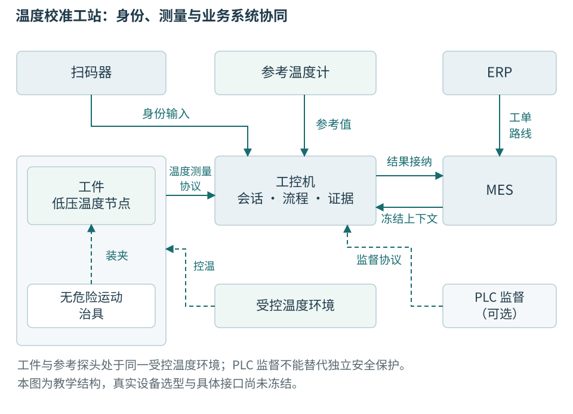
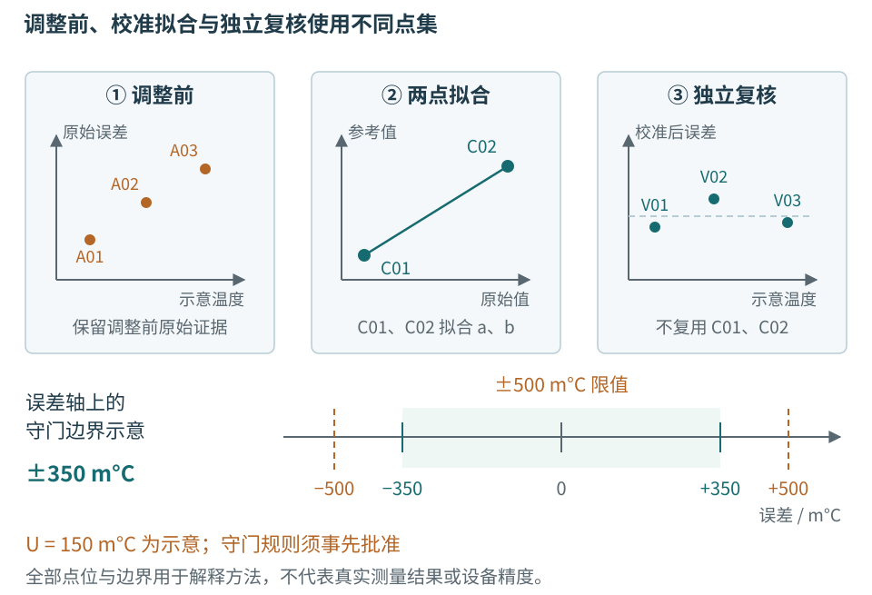
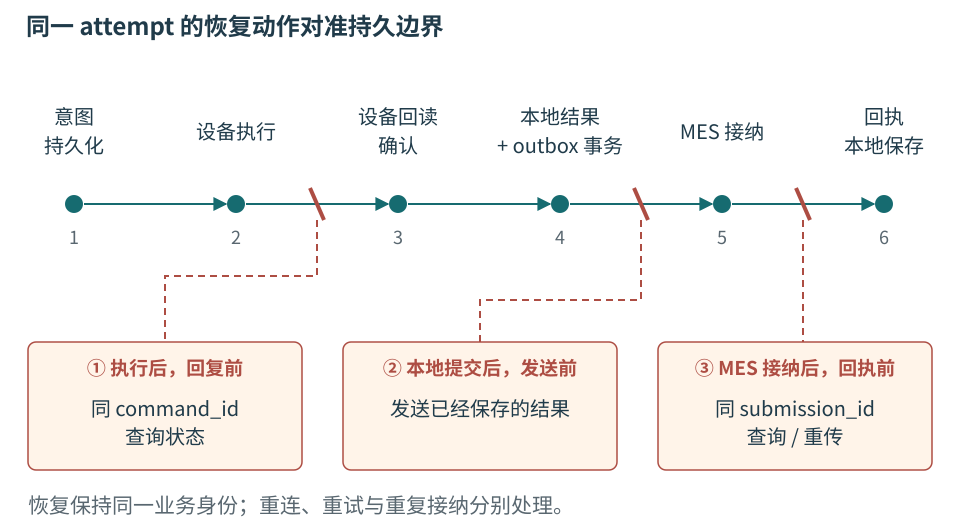

# 第二十三章 一个设备产品的测试校准工站

一件温度监测节点从板卡变成可交付产品，需要建立一条连续的证据：身份与标签一致，固件是批准版本，采样具有明确单位和时间，校准关系在规定条件下成立，独立复核满足判据，结果能够在电脑故障后恢复，并被生产系统按同一身份接纳。上位机与嵌入式在这里不是两套互不相干的技术，它们共同决定这条证据能否成立。

本章重建一座低压温度节点的烧录、校准与终检工站。节点只监测温度，不控制危险运动；治具只提供经确认的低压连接和定位。受控温度环境、参考仪器、电源及真实板卡还未选定并验证，因此本章不提供通电接线、危险温控操作或可直接用于生产的校准规程。所有工单、序列号、数值、公式和故障轨迹都是教学构造，没有烧录、测量、校准或MES提交的实际结果。

前文分别解释过对象、协议、Qt、固件和记录。本章不再按技术名称排列它们，而是沿一件工件的一次尝试，说明每个交接点需要什么证据。正常流程只是其中一条路径；设备已经执行而主机不知、本地已经保存而界面没显示、MES已接纳而回执丢失，都必须仍能被解释。

## 23.1 工站的物理对象和信息对象

### 温度节点只提供测量链的一部分

节点由低压供电、温度敏感元件或数字传感器、MCU、通信接口和有限的非易失存储组成。传感器把所处位置的温度转换成电信号或数字读数，固件经过配置、转换和校准处理，形成 temperature_mC。数值能够经过串口传到电脑，证明通信链的一部分可用，并不证明温度测量准确。

测试对象是装配后的产品，而不只是某个传感器芯片。传感器安装位置、热接触、封装、板上发热、采样配置和供电都会影响结果。工站记录必须绑定硬件修订和固件，不把裸芯片数据手册中的典型参数直接当作整机保证。

本章的治具给工件提供固定位置与已核对的低压接口，参考温度计测量与被测节点尽可能可比的温度条件。**参考**不是绝对没有误差的真值，它具有自己的校准结果、不确定度和适用条件。温控装置负责形成环境，参考仪器负责观察环境，两者不能混成“设定30°C，所以实际就是30°C”。

工控机运行 Qt Widgets 应用，设备会话接收节点与仪器数据，流程层冻结本次计划，判定器解释测量，存储层保存证据，MES发送者递交定稿结果。可选PLC提供工位状态和流程握手，不为展示更多技术而强行加入；若没有受PLC控制的需求，节点、参考器和电脑也能组成有边界的教学工站。



图 23-1 温度校准工站全景。实线分别标注数据和身份流；ERP、MES、工站和节点拥有不同事实。图为原创教学结构，没有声称这些设备已采购、连接或验证。

### 制造系统提供上下文 不替代本地测量

ERP管理企业计划与资源，工单经MES进入现场。MES可以告诉工站某件产品现在应在哪道工序、允许哪版计划，并接收质量结果；它通常不替本地采集器保存每个瞬时样本，也不能因为服务器在线就保证仪器有效。

工单安排的是一批工作，serial_number标记的是一件产品，workpiece_id是内部工件记录。device_id来自电子接口，必须核对与外部标签的绑定。一个工单可以包含多件工件，一件工件可以有多次尝试，一次尝试可以含多条设备命令；把这些层次分开，才不会让网络重传增加生产数量。

工业系统公开案例可以帮助理解这种连接需求。例如Siemens发布的Meccanotecnica Umbra案例把ERP工单、MES、质量与单件编码联系起来；这支持“质量需要绑定生产上下文”的现实背景，却不证明该企业采用本书的Qt、串口协议、outbox或断电恢复设计。其厂商报告的成效也不作为本书独立验证结果。[23-1]

## 23.2 为N240017建立一次不可混淆的尝试

### 扫描只是识别的开始

设操作员扫描标签N240017。程序先验证条码格式和产品命名空间，查询得到内部workpiece_id=WP-00017，再读取电子device_id=NODE-0017。只有两者按受控绑定关系一致，才继续读取型号、硬件修订、固件与运行代际。没有匹配关系时，应停止并保留差异，不自动重新贴上软件里的“正确名字”。

MES返回工单WO-41、路线NODE-ROUTE/3、工序CALTEST以及允许计划NODE-CAL/7。工站还需确认自己CAL-03被允许执行该工序，治具FX-02的修订与计划相容，参考仪器在有效的使用状态。断网时能否使用缓存上下文，由批准离线策略决定，不能由程序发现网络失败后自行放宽。

本次接纳后生成attempt_id=A0092，分配治具位置并冻结上下文。工件标签、电子身份、计划、限值和仪器条件成为这次尝试的输入。下一件扫码、管理员加载新限值或MES发布新计划都不会改写A0092；若必须撤回当前方案，应有明确的停止和处置记录。

```text
原创教学上下文，不是真实制造记录
workpiece_id       WP-00017
serial_number      N240017
device_id          NODE-0017
attempt_id         A0092
station_id         CAL-03
fixture_id         FX-02
work_order_id      WO-41
route_version      NODE-ROUTE/3
plan_version       NODE-CAL/7
limit_version      TEMP-LIMIT/3
```

station_id指受管理工站实例，不只是电脑主机名；fixture_id指治具，不是当前USB端口；limit_version指批准的判定规则，不是屏幕里一个可编辑数字。操作者身份和授权角色可按组织政策关联，但没有必要把个人敏感信息复制到每个数据包。

### 接纳点之前与之后有不同责任

若型号不匹配，在接纳前拒绝请求即可，留下必要事件，不形成假装已经测试过的产品结果。接纳之后，如果仪器故障或设备失联，需要结束或保持A0092，并保存已经发生的步骤和未确认动作。不能直接删除尝试，让下一次点击像什么也没发生过。

工站在接纳前检查可用存储和outbox积压。假设一天2000次尝试，每次原始温度窗口和记录平均200KB，原始新增量约400MB一天；保留30天约12GB，未含数据库索引、备份和诊断。这是容量演算，不是目标节拍。预算还需考虑异常重测、文件冗余和维护余量，不能把磁盘剩余量刚好等于平均一天就视为安全。

一个治具位置只属于一个活动尝试。并行工站需要全局路线或占用控制，本地进程锁不能阻止另一台电脑同时处理WP-00017。换机恢复时，旧工站是否仍可能继续发命令也要处理；没有资源端的权限或代际限制，就不能靠“我认为旧电脑已关机”授予新电脑无条件执行权。

### 方案中的终点必须可观察

NODE-CAL/7包含身份核对、固件检查或烧录、调整前测量、校准数据取得、参数计算与写入、独立复核、通信终检、定稿留档和MES接纳。每个步骤都应写明输入、允许状态、完成证据、超时与取消窗口，不把“调用函数返回”当作统一结束条件。

例如固件步骤结束需要设备报告并验证实际运行版本；校准写入结束需要同command_id的完成及参数读回；复核结束需要独立数据窗口和有效参考；留档结束需要本地事务按约定成功；MES结束需要业务回执。不同证据可以在不同时间到达，流程必须接受这一事实。

## 23.3 烧录把文件变成可运行固件

**烧录**是把程序镜像及必要数据写入目标非易失存储的过程。制造烧录可能经调试接口或设备下载协议完成，现场升级又可能走另一条链。写入工具进度达到100%，通常只覆盖工具声明的阶段，不自动证明镜像可启动、型号适配或业务健康。

A0092先读取当前固件。若已经是批准版本且策略允许复用，可以保留读取证据而不重复擦写；若需烧录，先验证镜像来源、内容身份、硬件适配和参数模式兼容。不得因为新文件名字包含“latest”，就覆盖冻结计划要求的版本。

有副作用的烧录命令在发出前保存command_id、目标设备、镜像摘要和所处阶段。记录意图不证明命令已经发送，也不证明没有发送；它让恢复器知道应查什么。真实下载工具若不支持稳定操作身份，应明确通过哪些可观测版本和存储状态恢复，无法确定时进入核查。

设备重启进入新镜像后，boot_id应改变，旧会话失效。主机重新识别device_id、运行固件、硬件和校准参数模式，再建立新generation。不能只看到串口再次出现，就把先前的对象状态复用为“烧录成功”。启动失败、回滚旧镜像和进入恢复模式都需要不同结果。

烧录还可能改变校准数据。若固件升级迁移参数，必须保存迁移前后版本及兼容关系；若擦除操作会清掉设备身份或工厂参数，需要特别的制造流程，而不是把整个Flash擦除当作通用准备动作。本章不提供具体烧录命令，真实目标手册、工具和授权尚未冻结。

### 参数生效与程序启动分别验证

新固件可能能够响应身份查询，但采样任务未启动、配置未加载或传感器初始化失败。健康确认要检查计划依赖的能力：有效采样、正确单位、校准版本和必要错误状态，而不是只有一条“hello”回复。

对于具有回滚机制的设备，候选镜像何时被确认、失败后回到哪里、持久数据是否仍兼容，都由第二十章的设备更新设计承担。工站记录实际结果，不以Qt上传窗口的状态代替设备启动状态。这样前文的嵌入式生命周期在制造中有了具体落点。

## 23.4 先建立可比较的温度测量

### 被测量要说清位置 条件和时间

本例希望验证节点报告温度与规定参考温度之间的关系。温度环境设定值、参考探头位置温度、节点敏感元件实际温度和节点数字读数，并非天然相等。热传导需要时间，空间可能不均匀，节点自身也可能发热。测量对象必须明确，才能知道误差包含哪些因素。

例如节点装在封装中，参考探头靠近外壳，二者在稳定环境下可能接近，在温度变化过程中却有不同热响应。若两路读数相差0.4°C，可能是节点偏差，也可能是尚未达到热平衡。软件不能只通过多取平均消除系统性的热滞后。

计划应规定参考器与节点的放置、允许环境、稳定判据、采样窗口和配对方法。实际操作需由相应设备资料和受控规程给出，本书不凭示意图规定温控装置安全使用方式。这里用抽象条件讨论软件怎样记录和验证这些前提。

### 稳定条件不能只看一个瞬时值

一个教学稳定规则可以要求参考温度在连续窗口内的极差、变化斜率和偏离目标量均在批准范围内，同时等待最小稳定时间。三个条件分别限制短期变化、趋势和位置；“读到目标值一次”不能满足它们。数值阈值必须来自设备热响应和测量方法验证，本书不提供通用毫秒或温差默认值。

参考稳定也不必然意味着工件内部稳定。计划可能需要节点读数趋势、环境稳定后的额外等待或经过验证的热模型。界面可以显示“环境已稳定，工件等待平衡”，让操作员知道这不是软件卡住。为了缩短节拍跳过等待，会改变测量方法，而非单纯性能优化。

稳定检测应使用原始或明确滤波后的数据，并保存滤波配置。如果先进行很强的平滑，再用平滑结果判极差，容易把真实波动隐藏掉。检测窗口不能跨boot_id、参数变更或数据缺口拼接；条件中断后如何重新计时，要由方案规定。

### 把两条测量流配成同一个窗口

节点样本有device_id、boot_id、sequence和接纳generation；参考器有自己的身份、状态和时间。基础节点帧没有源时间，因此若只靠主机接收时间配对，需要承认传输抖动和缓冲延迟。设备支持更好的源时标时，也需核对时钟域和同步误差，不能未经转换直接比较两个计数器。

本例在稳定平台上使用受控时间窗口，分别计算节点与参考统计量，并保存窗口起止、样本数量、缺口和质量。稳定条件减小部分配对误差，但不把时间问题变成零。动态温度验证需要更严格的时序模型，不能直接复用静态校准方案。

若计划要求至少n个有效样本，不能因为缺少一个就用上次值补齐。可以按预定规则延长窗口或判Invalid，并记录原因。无效参考、超量程、节点重启和校准版本变化都应终止该窗口的有效性，不能只在最后取一次“当前状态正常”覆盖中间异常。

## 23.5 校准 调整与独立复核分别做什么

**校准**建立测量指示与参考量值之间的关系，并保留相应不确定度。**调整**改变设备，使其指示或响应符合期望；**验证或复核**检查规定要求是否满足。三者可以出现在同一工站流程中，但不能把“写入两个系数”直接称为已经完成全部计量责任。这里采用概念性说明，不翻译或复制计量词汇原文。[23-2]

### 先保存调整前状态

A0092先读回现有calibration_version及参数，取得调整前测量。这样以后能看出设备原先的偏差、这次改变了什么，以及调整是否掩盖其他问题。如果只保存调整后的成功值，就无法调查返修原因，也难以区分原装配偏差与算法变化。

调整前数据不一定都用来拟合。计划可规定哪些点用于建模，哪些用于诊断，哪些只用于独立验证。样本集的用途在采集前决定，不能看到某个点不符合直线后把它改称“异常”并删除，除非已有可验证的异常规则和记录。

### 两点线性关系的教学推导

本小节的raw_count须由设备明确支持的独立诊断消息或校准数据模式取得；基础type=01温度帧只传temperature_mC，不能把其中四字节当成原始ADC计数。此处采用原始count输入，数值组与第十六章直接使用温度读数的示例不同，两组不能混作同一次校准。第十六章的30.72°C经该章关系修正约为30.02°C；这里另外构造原始计数，以展示固件换算与工站记录的衔接。为便于手算，假设原始传感读数x的单位为count，参考温度y使用m°C。第一个校准点为x1=1000、y1=20000，第二个为x2=3000、y2=40000。线性模型写成y=a×x+b，斜率a=(40000−20000)/(3000−1000)=10m°C/count，截距b=10000m°C。

这只是构造数据，不说明真实节点一定是线性的，也不说明两点就足以覆盖全部量程。两个点总能确定一条非退化直线，拟合残差为零并不证明模型正确。实际校准需要适合传感器、范围和风险的测点与模型，必要时还包括非线性、温漂和自热等影响。

计算入口要检查x2与x1是否相同或过近、输入是否有效、系数是否在允许范围、数值表示是否足够。若两点读数几乎相同，斜率会对误差非常敏感；程序不能只避免除零，就把巨大的系数当成合法校准。拒绝建模应保存原因，不用默认a=1、b=0假装成功。

```cpp
// C++20教学计算；未编译、未执行，不是计量软件验证结果。
struct LinearCalibration {
    double gain_mC_per_count{};
    double offset_mC{};
};

std::optional<LinearCalibration> fitTwoPoints(
    double x1, double y1_mC, double x2, double y2_mC,
    double minimum_span_count)
{
    if (!std::isfinite(x1) || !std::isfinite(x2) ||
        !std::isfinite(y1_mC) || !std::isfinite(y2_mC) ||
        !std::isfinite(minimum_span_count) ||
        minimum_span_count <= 0)
        return std::nullopt;
    const double dx = x2 - x1;
    if (!std::isfinite(dx) || std::abs(dx) < minimum_span_count)
        return std::nullopt;
    const double gain = (y2_mC - y1_mC) / dx;
    const double offset = y1_mC - gain * x1;
    if (!std::isfinite(gain) || !std::isfinite(offset))
        return std::nullopt;
    return LinearCalibration{gain, offset};
}
```

minimum_span_count来自经过批准的方法，不是代码作者随意设置的epsilon。完整实现还要检查物理系数范围、模型版本、输入单位与误差传播，并定义写入固件时的定点量化和舍入。计算机里的double结果与设备实际使用的参数格式可能不同，写入前后都要保留。

### 用同一个命令身份写入和查结果

本次参数集合分配calibration_version=CAL-A0092-1，写入意图使用command_id=A0092:write-cal:1。意图先持久记录，然后向已确认device_id的设备发送。若设备支持先写候选参数再原子激活，应按其明确契约执行；本书不假定所有MCU自动有双区参数存储。

设备回复完成后，主机读取参数内容或摘要及版本，核对与期望一致。读回证明的是相应存储或接口内容，仍需确认正在运行的采样算法实际使用这版参数。固件可能缓存旧系数，或读回接口读的是候选区而非活动区；接口必须明确这些含义。

写入回复丢失时，保持原command_id查询。若只能读到当前系数相同，却无法确认它是否由这次命令产生，可以得到“当前参数符合期望”的状态证据，但不应把它夸大为命令级恰好一次证明。恢复策略要看产品真正需要的是最终配置还是不可重复的执行历史。

### 独立复核不能重复使用拟合证据

本例选择30.000°C附近的独立条件，不把20°C和40°C两个拟合点再次代入后称作“独立验证”。假设另取的原始读数为2004count，主机按候选关系计算得到30040m°C。该计算只用于算术和实现交叉核对，不能替代产品实际指示的复核。产品复核必须读取调整后设备实际输出的temperature_mC，并与参考比较；本例额外假设设备实际输出也为30040m°C，参考为30000m°C，才得到示意误差+40m°C。若设备实际输出不同，应以其指示评价产品并调查活动参数、量化和算法，不能拿主机算值填补。所有数值仍是构造，不是实测精度。



图 23-2 校准、调整和复核。示意限值为±500m°C，示意扩展不确定度为150m°C；图中±350m°C仅用于说明一种预先批准的保守接纳规则，不能直接用于真实产品。

独立点可以暴露某些非线性或实现错误，却不能覆盖整个量程和所有环境。只有一个中间点通过，不足以证明低温端、高温端、长期漂移和动态响应均满足要求。生产终检、设计验证和型式评价各有范围，不能相互借用名字扩大结论。

## 23.6 测量不确定度怎样进入软件判断

### 分辨率 准确度与不确定度不同

界面显示30.040°C，只说明采用了某个数字格式。传感器输出步进、参考器分辨率、重复性和系统误差共同影响我们能对实际温度说什么。增加显示小数位不会提高测量能力，多测一百次也不会自动消除共同的参考偏差。

**测量不确定度**用于表达与测量结果相关的量值分散程度。它不是已经知道的某个误差，也不是随意加上的保险系数；需要由测量模型、数据和来源条件建立。误差示值可以是+40m°C，同时结果仍有相应不确定度，两者不矛盾。[23-3]

统计评估可以使用重复测量等数据，其他评估可以来自校准证书、分辨率、环境和经验资料。评估方法类别不等于误差来源类别，不能把“统计得到”简单叫随机误差、把“证书给出”简单叫系统误差。软件应保存来源和换算，不能只留最终一个U值。[23-4]

### 一个明确标为构造的预算

为了看清单位和组合，本例假设已把各影响换算成误差结果上的标准不确定度分量：参考40m°C、重复测量平均值30m°C、空间不均匀20m°C、模型与残余影响50m°C。这里假设模型可线性化、分量在该分析中不相关，并且没有重复计算同一来源。

| 示意分量 | 标准不确定度 | 真实项目所需依据 |
| --- | --- | --- |
| 参考量值 | 40m°C | 证书、修正和适用条件 |
| 重复测量平均值 | 30m°C | 原始窗口及统计假设 |
| 空间不均匀 | 20m°C | 装置与布置验证 |
| 模型残余等 | 50m°C | 独立数据与模型评估 |

在这些假设下，合成标准不确定度约为sqrt(40²+30²+20²+50²)=73.5m°C。若方法采用覆盖因子k=2，示意扩展不确定度约147m°C，本教学方法预先约定向上取整为150m°C，作为后续决策使用的示意值，并将这项取整规则写入方法版本；它不只是显示修约，界面格式变化不能暗改判据。k=2不能无条件解释为精确95%覆盖概率，覆盖含义还依赖分布、有效自由度和方法条件。[23-3][23-4]

若两个分量共享同一参考或处理链，就不能简单平方和忽略相关性。参考器修正、校准拟合和复核都可能使用共同数据，某些影响会相互关联。真实方法应建立测量模型与灵敏度关系，并避免把同一个证书分量在多个名称下重复加入，或反过来完全遗漏。

重复测量的标准差也不应机械除以sqrt(n)。这个缩减对应对平均值的特定统计假设；连续温度样本常受滤波和热惯性影响而相关，有效独立信息量可能少于样本数量。若工站每毫秒读取一次同一缓存值，n看起来很大，测量信息却没有增加。

### 不确定度不是用来修饰通过率的参数

设产品误差要求为±500m°C。只比较|e|≤500，是一种简单接纳规则；若还要求考虑不确定度，可以事先批准其他决策规则。规则决定如何在误接纳与误拒绝等风险间取舍，应在测试前约定，不能看到结果接近边界后临时选有利方法。[23-5]

本例仅展示一种保守接纳条件：|e|+U≤500m°C。在e=40、U=150时，190≤500，满足该条件；等价的示意接纳带为±350m°C。若e=400、U=150，测得误差仍在±500内，但不能满足这条保守接纳条件。此时应记录按该规则未获接纳或待处置，不凭这一条不等式直接断言产品真实误差一定超限。

实际流程可以规定完整的通过、拒绝和不确定区域，也可以采用其他明确规则。第十四章的纯比较函数只演示“给定边界与有效性后的比较”，不替方法决定该边界应当怎样形成。程序必须保存原规格限值、采用的接纳边界、不确定度及规则版本，避免只留下调整后的±350而丢掉为什么缩窄。

保护带不是删掉接近限值数据的方法。若某件处于需处置区，应保留全部原始值并按批准流程决定复核、返修或其他措施。增加测量次数是否能降低不确定度，需要根据主导分量判断；参考系统偏差占主导时，无限重复同一操作并不会改变事实。

## 23.7 用一次有效测量形成逐步结果

### 采集窗口有开始 结束和完整性条件

A0092的复核步骤先确认活动calibration_version和固件，再等待稳定条件，最后打开一个明确的采集窗口。窗口记录首末sequence、boot_id、generation、样本数量和缺口，参考数据记录相同用途的时间区间及质量。第十一章的显示邮箱可以覆盖中间值，正式记录通道则不能依此丢弃判定所需样本。

若节点重启、参考质量变Bad、记录队列溢出或关键数据缺失，该窗口不再有效。流程可以按计划允许重新取得一个窗口，但需要保留失效原因和重取身份；不能静默重开直到成功。重复测量的停止条件应由方法决定，而不是由屏幕最后出现的颜色决定。

**完整性**也要有范围。sequence连续只能支持未观察到相应序号缺口；如果固件在采样前就漏触发而仍连续编号，主机无法仅靠序号发现。设备端计数定义、采样时钟和错误标记也需验证。端到端完整性来自多段契约，不是某一个计数器的魔法。

### 判定保留原值和方法身份

复核条目分别保存2004count、主机交叉核对算值30040m°C、额外假设的设备实际输出temperature_mC=30040、参考30000m°C、活动系数、由设备实际输出比较得到的+40m°C误差、所用U和限值规则。小数显示可以是30.040°C，但存储仍保留明确单位。必须保存设备实际输出的temperature_mC及固件和参数版本，必要时另外保存原始count用于诊断；不能用主机算值代替设备读数。

流程汇总各必需步骤时，不把所有“不通过”都记为产品不良。参考失效使结果Invalid，写入未知使操作Unknown，有效测量明确不满足批准判据才形成相应质量决定；路线拒绝和MES拒绝另有状态。整件结果必须说明哪些步骤完成、哪些有效、哪些仍需处置。

```json
{
  "workpiece_id": "WP-00017",
  "serial_number": "N240017",
  "attempt_id": "A0092",
  "step_id": "independent-verification",
  "command_id": "A0092:verify:1",
  "plan_version": "NODE-CAL/7",
  "limit_version": "TEMP-LIMIT/3",
  "calibration_version": "CAL-A0092-1",
  "raw_count": 2004,
  "host_calculated_mC": 30040,
  "temperature_mC": 30040,
  "reference_mC": 30000,
  "error_mC": 40,
  "expanded_uncertainty_mC": 150,
  "specification_abs_limit_mC": 500,
  "acceptance_abs_limit_mC": 350,
  "validity": "Valid",
  "decision": "Passed",
  "evidence_status": "TeachingDataOnly"
}
```

这份缩小记录省略完整仪器、时间和原始窗口，并明确TeachingDataOnly，不能作为实际校准证书。真实记录还需保存不确定度预算版本、覆盖说明、规则授权、固件构建、原始证据及摘要。JSON字段的存在不建立计量溯源，溯源需要相应校准链及其不确定度证据。

### 通信终检验证不同的性质

测量复核之后，可按计划验证节点通过受控接口或隔离网关上传已知身份的样本。终检检查单位、device_id、boot_id、sequence、重复处理和错误状态，不只看“收到一行文字”。基础帧没有设备身份或校准版本，这些必须来自已确认会话或受控扩展消息。

网关可能把同一样本重传两次，服务器应按经协议定义的运行样本身份去重。32位sequence可以在同一boot_id中回绕，device_id、boot_id、sequence的组合只在受约束窗口内不歧义，不能当永久唯一键。要么限制保留和最大迟到/重传窗口，保证序号复用时旧样本不再可能被接纳；要么采用设备协议提供、跨重连可核对的扩展计数或回绕代际。主机局部generation不能修复服务器长期身份，基础帧也没有这些扩展保证。样本身份与A0092不同：attempt_id追溯制造尝试，device_id、boot_id、sequence解释运行数据。把每次网络转发都生成新的样本身份，会把重传伪装成新采样；只用sequence又会在设备重启后混淆历史。

本次通信终检能证明规定条件下的链路功能，不保证所有现场网络或长期离线都不丢数据。设计验证需要覆盖更宽环境，工站逐件筛检只能覆盖其明确窗口。软件报告应如实写清测试范围，不能把一次短测扩展为整个产品生命周期保证。

## 23.8 从测量决定走到本地可恢复结果

### 流程对象持有尝试 窗口只显示进展

StationWorkflow拥有A0092和冻结计划，DeviceSession拥有节点身份与协议状态，InstrumentWorker拥有参考仪器配置与读取，MeasurementEvaluator形成决定，ResultStore保存证据。GUI显示这些角色已经确认的状态，不从当前下拉框或表格选中行反推正在执行的工件。

这些是责任划分，不要求机械地为每一步创建线程。短小纯计算可以在受控流程线程完成，仪器IO遵守其库与驱动约束，存储执行环境独立管理数据库连接。跨线程结果携带自己拥有的数据和业务身份；拿一个指向正在复用缓冲区的指针排队，不能让整条质量链成立。[23-6]

流程的事件入口先核对attempt_id、command_id和当前允许状态，再接纳结果。温度显示还会检查generation；但写校准迟到的确认不能只因旧代而丢弃，它需要进入A0092的恢复记录。界面新鲜度和生产证据的保留规则不同，不能共享一个“所有旧消息都不要”的简单过滤器。

```cpp
// 教学状态入口；未编译、未执行。
void StationWorkflow::onVerification(VerificationResult r)
{
    if (r.attempt_id != context_.attempt_id) {
        routeToRecovery(std::move(r));
        return;
    }
    if (state_ != State::Verifying ||
        r.command_id != expectedVerificationCommand_ ||
        r.window_id != expectedWindow_ ||
        r.step_id != "independent-verification") {
        recordUnexpectedResult(std::move(r));
        return;
    }
    if (!r.evidenceComplete) {
        finishInvalid(r.reason);
        return;
    }
    recordVerificationStep(context_, r);
    state_ = State::CommunicationCheck;
    beginRequiredCommunicationCheck();
}
```

片段中的函数都需要完整实现，尤其routeToRecovery不能成为无界垃圾队列。window_id是主机为本次复核窗口保存的业务标识，不是基础帧新增字段；同一尝试内获准重取窗口时更换，并与command_id和步骤绑定。复核完成先进入必需的通信终检，只有统一汇总入口证实所有必需步骤均有对应有效终态，才构造finalResult、进入Saving并请求持久保存，不能由单个evidenceComplete替整件宣布完成。状态应在调用可能同步回调的外部入口前建立一致性，避免重入时仍以Verifying接纳第二份结果。重复相同结果和同身份冲突内容也应分别处理。

NI公开资料中的结果收集、过程模型和结果处理插件，为这种分工提供参考：执行引擎收集步骤事实，报告或数据库输出消费它们。自研工站仍需实现自己的异常、持久化和MES恢复，不能因借鉴结构就宣称已有商用测试执行器的全部能力。[23-7]

### 存储确认早于最终留档提示

A0092的原始窗口可以存在本地数据库或独立不可变文件中。若使用独立文件，先完成受支持文件系统契约下的可靠保存及完整性核对，再在同一数据库事务中写入定稿结果和outbox。事务失败可能留下可调查孤儿文件，但不能主动设计成“数据库已承诺，文件以后再补”。

submission_id=A0092:submit-result:1在定稿时固定，连同结果内容身份一起保存。后台发送者只发送这份已冻结内容，不重新读取当前计划拼装。UI在收到明确本地提交成功后显示“已留档”；若事务失败，则保持测量决定和留档失败两个事实，不先亮最终放行再尝试补救。

SQLite可作为教学本地库，但其原子提交与持久性依赖具体日志、同步、文件系统和设备条件。不能仅由COMMIT这个词推出跨机器或跨文件的事务，也不能把内存中能够查到结果当作断电可恢复证据。[23-8]

### 结果定稿以后如何更正

如果后续发现录入的治具维护编号错误，应追加更正记录及依据，不改写原始样本。若发现判定算法有缺陷，需要保留原软件与规则版本，形成重新分析记录，并由批准流程决定对工件的影响。新计算结果不是“当时本来就是这样”的替代历史。

同一份报告重新排版或导出，不应生成新的生产结果身份。报告文件名和生成时间可以变化，attempt_id、原始结果及原判据保持关联。否则每次打印都可能被MES计为一次新测试，也会使追溯依赖文件创建日期而失真。

## 23.9 三个中断点怎样恢复同一件工件

### 设备已经执行 主机却没有收到回复

设A0092:write-cal:1已在节点写入并激活，回复刚发出时连接断开。工站本地已有动作意图，但没有完成证据。正确状态是该动作Unknown，工件保持待确认；把尝试直接标Failed会把“知识不足”误当成有效测量失败。

恢复时先确认仍是NODE-0017，由主机创建新的generation，并向设备查询boot_id。若boot_id没变且设备命令历史可查询，按原command_id取得已完成且内容相同的结果；若设备重启后仍保留该历史，也按其契约验证。若历史已丢失，只能依靠实际参数、版本和批准的核查流程进一步判断，不能从空表推断未执行。

若设备证明该命令未接纳，才按允许规则重传同一意图。证明“未执行”需要明确的设备契约，不是某次查询暂时返回未找到；记录可能尚在处理、复制或延迟可见。真实协议应定义查询状态、保留期和终态范围，让主机知道什么时候可以安全继续。

一种受限旧设备只提供“当前系数读回”。如果读回与目标相同，且产品只要求最终配置一致，批准流程也许可以接受这一状态证据，再执行独立复核；但不能据此声称原命令只发生一次。若重复写入有擦写寿命或额外副作用，恢复还必须考虑这些影响。

### 本地结果已提交 电脑在更新界面前崩溃

设原始数据、A0092结果与outbox已按约定提交，程序尚未把状态发到GUI就停止。操作员没有看见绿色，不代表测试没有完成；重启应按workpiece_id找到A0092，验证引用和内容，再继续上传已有结果，而非自动开始A0093。

若崩溃发生在事务提交前，恢复器按照数据库有效状态解释结果。单个原始文件存在，只证明某些字节曾被保存，不证明定稿已经提交；可以作为待恢复材料，不能直接作为正式Passed。缺失文件、摘要不符或不完整步骤也需明确记录，不靠文件名推断全部成功。

如果不能确认当前治具中的仍是N240017，软件必须重新识别物理工件。恢复界面可以显示“上次A0092已留档，当前工件待核对”，而不是把历史状态覆盖到新放入的节点。数据恢复与现场对象恢复是两个步骤。

### MES已接纳 回执却在网络里丢失

设MES按submission_id接纳A0092，但本地outbox仍Pending。恢复后先按同ID查询，或在接口保证下同ID同内容重传。若返回原回执且内容身份一致，本地记录Accepted；没有理由重新测量或重新分配提交ID。

同ID不同内容应进入冲突处置。可能是客户端重新拼装用了新限值，可能是本地记录损坏，也可能是接口命名空间错误。自动覆盖远端内容或生成新ID躲过冲突，都可能篡改生产事实。应保留双方可核对摘要及必要内容，按授权流程对账。



图 23-3 三个中断窗口。它们的恢复对象分别是动作、记录和提交；“重试”不能不加说明地同时指代三者。图为未执行的教学时序。

```text
原创教学轨迹，D1到D7只是顺序标签
D1 保存 command_id=A0092:write-cal:1 的意图
D2 节点激活 CAL-A0092-1，回复丢失，本地 Unknown
D3 同设备查询原命令，追加已完成且内容相同的确认
D4 独立复核有效，冻结 A0092 的测量与判据
D5 提交 Result(A0092)+Outbox(A0092:submit-result:1)
D6 MES接纳原submission_id，回执丢失
D7 按原submission_id查询，保存原回执，不增加新尝试
```

事务发件箱只把本地结果与发送意图纳入一个原子范围。发送者崩溃可以导致重复发送，远端去重和查询才决定重复的业务效果。设备端命令去重、本地存储、MES接纳各有保留条件，不能用一句“端到端恰好一次”覆盖尚未实现的全部边界。[23-9]

## 23.10 MES离线时产品放在哪里

“测量Passed、本地已留档、MES待确认”是一组完整而诚实的事实。是否允许从治具取出、放入隔离区、进入下一工序，取决于批准的生产和质量策略，三个物理处置也可以不同。上位机不能因屏幕不方便显示多状态，就把它们合并成“生产完成”。

离线策略应规定缓存计划的有效范围、最大离线时间、允许工件数量、重复工件控制、容量阈值和恢复对账。工单可能在离线期间关闭或路线改变，工站不能假定昨天取得的许可永远有效。若策略要求实时许可，则网络不可用时停止新接纳是正常结果，不是软件缺少重试。

MES明确拒绝与网络未知不同。工单关闭、工序重复或计划不被接受时，原始测量仍然存在，不能把它改成另一个工单结果上传。处置可以产生新的批准记录或重新执行，但必须保留因果，不让客户端“修数据直到能过接口”。

outbox积压应有可见指标：条数、字节、最老年龄、失败原因和剩余容量。超过上限时按策略停止接纳，已经保存的记录继续受保护。把最老未确认结果删掉以腾空间，会把明确的存储压力变成不可解释的生产缺口。

### 复测与重新发送的账不同

如果A0091因参考失效而Invalid，修复测量系统后获准开始A0092，是新的测试尝试；如果A0092结果已保存而只是网络重发，仍是同一attempt_id。返修后复测也需新的尝试，并保存返修关系、前次有效失败和新配置。

一个工件最终通过，不会删除此前的失败和无效记录。统计首次通过率时要明确按工件还是按尝试、是否排除无效、返修是否计入；通信重试和MES重发不能增加产量。第十四章的分母规则在此直接决定工站报表是否可信。

对于同一尝试内部允许的重复采样，计划还要说明怎样使用数据。预先规定的多次测量平均，与看到失败后反复测到一次通过，是不同方法。后者可能使通过率变好看，却改变被报告结论的统计意义；软件不应暗中采用。

## 23.11 生产证据怎样连接到现场运行

### 运行样本继承产品身份 不继承制造尝试序号

产品出厂后可能经网关上传。制造记录绑定workpiece_id和device_id，运行样本以device_id、boot_id、sequence及明确的回绕窗口/扩展身份契约解释来源。A0092能告诉我们这件产品在哪版固件和参数下通过规定终检，不能作为以后所有采样的唯一键。

现场升级改变固件或校准参数时，应保存维护事件及前后版本，并与产品身份关联。旧工站记录不因此失效或被改写，但新运行数据需说明当前使用的版本。若升级改变单位或模型，网关适配也需更新，不能继续按旧规则解释相同四字节负载。

节点离线缓存有限，需要明确满时策略。保留最新温度、优先保留告警、停止采样或丢弃最旧数据，各自有产品含义。断网恢复后，服务器收到的消息次数不等于采样次数；去重、缺口和原采样时间应保留，不把缓存重传画成实时新值。

### 功耗筛检与续航声明不同

工站可以增加一个明确范围的功耗步骤，但测量点和运行条件必须先定义。电池输入端的电流、某个内部电源轨电流与USB供电电流不是同一口径；来自不同电压的电流也不能直接相加。需要能量比较时，应考虑电压及转换效率。

低功耗节点的周期通常包含唤醒、传感器稳定、采样计算、通信和休眠。一个万用表平均读数可能看不到短时峰值，短暂低电流也不能证明整个周期预算。工站应记录窗口、量程、带宽、触发和是否连接调试器或USB，避免测试连接本身改变低功耗状态。

原书给过一个理想周期预算：60秒中采样计算0.12秒、8mA，发送0.08秒、35mA，其余59.8秒、0.02mA。同一电池输入端、忽略重叠和其他损耗时，周期电荷为4.956mA·s，平均0.0826mA。这仅是按构造条件做的算术，不是本工站测量值，也不应填入A0092的真实报告。

即使用1000mAh名义容量除以该平均值，得到约504天，也仍不是实际寿命。电池可用容量、温度、自放电、弱信号重传、启动失败和峰值供电能力都会改变结果。生产筛检、设计验证、长期寿命评估需要不同证据，不能因每件短测Passed就承诺这个天数。

若发射瞬间压降使节点复位，平均功耗可以仍很低。boot_id反复变化、发送计数增加和电流峰值应一起调查；只降低休眠电流不解决供电峰值。第十六至二十章的硬件、调度和功耗知识在这里共同决定恢复，而不是由一条“低电量”日志概括。

## 23.12 这座工站怎样验收

### 先证明数据和状态 再接真实测量

第一层是离线的纯逻辑证据：用固定字节回放解析器，用冻结上下文驱动状态机，用独立计算核对转换与边界，检查重复事件、旧代结果和版本冲突。它能发现软件结构错误，但不能证明实际串口电平、热稳定或仪器不确定度。

第二层是主机和存储证据：在固定Windows与Linux环境中编译，检查Qt对象归属与安全关闭，测试磁盘错误、事务中断、outbox重复和安装回退。只有实际执行并保留制品与日志，才能把这些条目标为通过。本书本轮尚未做这些工作。

第三层是受控硬件证据：冻结板卡、固件、接口、供电、仪器和环境，按批准程序进行电气、测量和故障验证。真实热场、接触、噪声和掉电行为不能靠桌面模拟补造；同样，真实温度值看起来正确，也不能代替后台寿命和本地事务测试。

### 故障位置需要精确到确认点

| 构造故障点 | 应保留的事实 | 不允许的替代做法 |
| --- | --- | --- |
| 校准已激活但回复丢失 | 原command_id和Unknown | 新ID再写直到回复 |
| 参考质量失效 | 原数据及Invalid原因 | 用最后正常值补齐 |
| 本地事务提交后进程停止 | 原结果和待发送意图 | 因UI未绿而自动重测 |
| MES接纳后回执丢失 | 原submission_id待确认 | 换ID新增结果 |
| 设备重启或工件被换走 | 身份变化和未确认步骤 | 只重开端口继续 |
| 原始文件不可恢复 | 证据缺失与保持处置 | 重算摘要接受现文件 |

每一项不只看最后状态，还要检查副作用次数、记录数量和历史身份。MES最终有一条正确结果，也可能中途曾产生重复报工；设备最后系数正确，也可能多次擦写；界面最后关闭，也可能曾访问已释放对象。最终快照不能覆盖过程中的违规事实。

测试触发位置要受控。请求发出前拔线，不能覆盖设备已执行后的丢回复；杀进程不能完全代替整机断电；虚拟设备返回错误不能证明真实驱动取消行为。报告应写明故障模型和观察范围，让未覆盖部分可见。

### 验收材料围绕同一工件组织

一份可读验收包可从WP-00017进入，列出A0091、A0092全部尝试及关系，再链接固件身份、校准输入、独立复核、原始数据、本地提交、MES回执和处置。各层日志格式可以不同，只要稳定身份能把它们连起来；不能要求读者凭几台机器看似相近的时间猜因果。

还要保存失败材料。一次Invalid参考窗口、一次未知命令的恢复、一个被拒绝的重复内容，比只有顺畅演示更能说明系统边界。真实硬件照片只帮助认识装置，波形和记录需要自己的仪器设置与运行身份，照片不能替代测量报告。

完成条件应由可检查的不变量表达：错误身份不进入当前尝试；无有效证据不宣布测量通过；未提交不宣布已留档；重复提交不新增同一业务效果；旧方案仍能解释历史；恢复不盲目重做外部动作。这些要求的真实验证比技术栈列表更重要。

## 23.13 从关键决定继续追问

### 为什么不把所有逻辑放进一个窗口

因为窗口选择、设备会话和工件尝试的生命期不同。一个用户可以切换页面，同时A0092仍在保存；一个工作线程可以已经退出，但MES提交仍待确认。把全部状态放在MainWindow里，会让关窗、页面切换和业务完成互相牵连。

合理的简单实现可以是少量清楚的对象和函数，不必建立庞大框架。流程持有尝试，IO持有资源，存储持有事务，视图持有呈现；跨界交付值和身份。是否进一步抽象取决于实际变化，例如替换仪器时能否局部修改，故障回放时能否控制输入。

继续问：“每个步骤都做成Strategy是不是更容易扩展？”只有行为确实需要替换且共同契约清楚时才有价值。纯限值变化通常更适合受控数据，少量判定可用函数；把不同阻塞和取消语义藏进同一个execute接口，会使抽象反而更不可靠。

### 为什么读回系数后还要复核

读回支持的是内容一致性，复核检验的是测量链在独立条件下的行为。固件可能读回候选区却使用旧活动区，系数量化可能与主机算法不同，传感器也可能在拟合点之间非线性。它们都能在“字节完全相同”的情况下影响测量。

继续问：“复核也用同一参考器，会不会仍有共同错误？”会。独立复核点减少对拟合数据的直接复用，但参考系统的共同偏差仍可能存在，因此需要参考校准与不确定度预算。所谓独立要说明在哪个维度独立，不能用一个词宣称消除全部相关性。

### 为什么不确定区域不直接算不良

因为“没有满足某种保守接纳规则”与“已经证实产品真实误差超差”不同。如何统计和处置由批准规则决定，软件应保存原误差、不确定度、规格和规则，而不是为了单一良率数字消除中间状态。

继续问：“这样会不会影响节拍？”可能。测量能力不足时，边界附近会产生更多需处置件。正确改进可能是提升参考与热场、改进方法或重新评估需求；把保护带取消而不更改承诺，只是把风险隐藏到统计之外。

### 为什么不能靠本地数据库宣称整个流程原子

数据库事务只管理它控制的记录。节点Flash、参考仪器和MES各自独立失败，本地回滚不会撤销已经写入的系数，也不会让已发出的MES结果消失。需要稳定身份、可查询状态和分阶段恢复，承认某些时刻观察者不知道终态。

继续问：“如果设备没有去重能力，项目是不是做不了？”仍可按有限目标设计，例如只读采集、可核对的最终配置或受控人工恢复，但必须公开降低的自动恢复能力。不能在客户端加一个map就声称解决设备重启后的副作用重复。

### 后来发现参考仪器可能失准 怎样追查

先按仪器身份、校准版本、适用量程和已知影响窗口查询相关步骤，再沿attempt_id展开工件、原始值、方法和处置。不要直接宣布所有关联工件不合格，相关性只是调查入口；质量人员依据影响和批准程序决定重新分析、复核或其他措施。

继续问：“只按报告生成日期筛选行不行？”不够。报告可能后来重导出，工站时钟也可能偏差；真正的测量窗口、仪器使用记录和稳定身份才是主链。如果历史只存最终PASS，没有原始值和参考身份，事后很难补出这些信息。

### 这份教学设计已经证明了什么

它证明的是责任可以被清楚表达，给出了可审查的数据、状态、确认和恢复关系，并用构造数字说明校准与判定如何关联。它没有证明真实设备精度、程序可编译、存储抗断电、生产节拍或现场安全。读者可以据此开展有边界的实现，仍需分别获得工具链、主机和硬件证据。

面试中可以说“我能解释为什么这些确认点必须分开，并展示某个已实际完成的验证”；不能把本文的A0092描述成自己交付过的真实产线。诚实区分设计、模拟、实测与部署，是工程能力的一部分，而不是降低作品价值。

## 本章资料与验证边界

[23-1] Siemens，[Meccanotecnica Umbra case study](https://resources.sw.siemens.com/en-US/case-study-meccanotecnica-umbra/)。仅作制造上下文、质量与单件追溯的公开案例，不借用其未公开实现和未经独立验证的效益。

[23-2] JCGM，[International Vocabulary of Metrology 200:2012](https://www.bipm.org/documents/20126/2071204/JCGM_200_2012.pdf)。校准、调整、验证及计量溯源概念；本文不是该文件的翻译、改编标准或认可声明。

[23-3] JCGM，[Guide to the Expression of Uncertainty in Measurement 100:2008](https://www.bipm.org/documents/20126/2071204/JCGM_100_2008_E.pdf)。测量模型、合成和扩展不确定度的概念依据；数值预算为原创教学构造。

[23-4] NIST，[Technical Note 1297](https://www.nist.gov/pml/nist-technical-note-1297)。标准不确定度评估、合成与报告；不将k=2无条件解释为精确覆盖概率。

[23-5] ILAC，[G8:09/2019 Guidelines on Decision Rules and Statements of Conformity](https://ilac.org/?ddownload=122722)。决策规则与符合性声明；本例保守接纳带不是任何真实产品的批准规则。

[23-6] Qt，[Threads and QObjects](https://doc.qt.io/qt-6.8/threads-qobject.html)。线程归属与GUI边界；关闭的具体限制沿用第十一章Qt 6.8.3核对范围。

[23-7] NI，[TestStand Report Generation and Customization](https://www.ni.com/en/support/documentation/supplemental/08/teststand-report-generation-and-customization.html) 与 [Process Model Development and Customization](https://www.ni.com/en/support/documentation/supplemental/08/teststand-process-model-development-and-customization.html)。执行、结果收集与处理边界，不提供本文MES保证。

[23-8] SQLite，[Atomic Commit](https://www.sqlite.org/atomiccommit.html) 与 [WAL](https://www.sqlite.org/wal.html)。本地提交和环境假设。

[23-9] AWS，[Transactional outbox pattern](https://docs.aws.amazon.com/prescriptive-guidance/latest/cloud-design-patterns/transactional-outbox.html)。事务发件箱与重复发送边界。

资料按2026-10-06核对。原书C58.2提供工站主线，本章重新从无硬件经验读者所需的物理对象、身份、测量和恢复展开；移除GPU、机器人与Agent案例。Qt API、协议、计量概念和存储资料分别支持相应局部事实，不能合成未经验证的整站保证。

本章尚未完成真实板卡和传感器选型冻结、完整工程、编译、协议联调、参考器选择、热场验证、不确定度评估、烧录、计量复核、断电、MES联调和安全验收。所有图和数值均明确是教学材料；任何正式交付都必须把这些未执行项转为独立证据，而不是删除标记。
