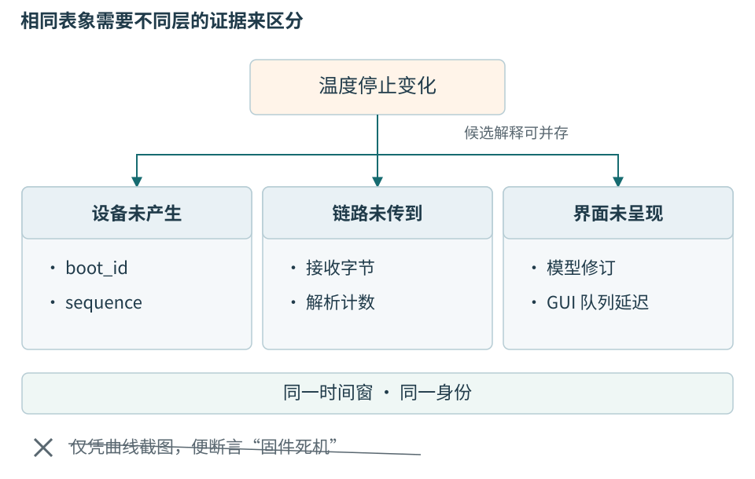
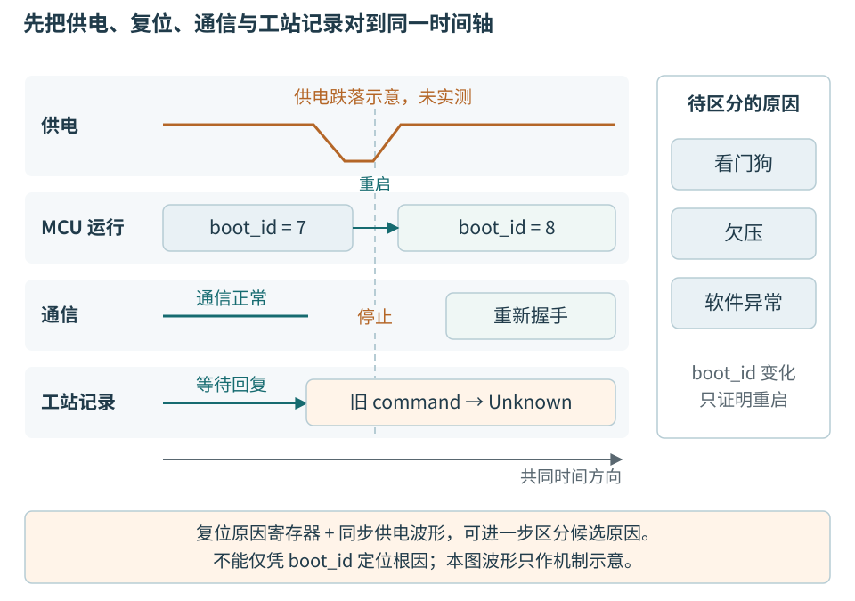

# 第二十四章 常见故障的推理与面试追问

工程判断不以记住多少错误名结束，而以能否把现象连接到机制，并用证据区分几个相似解释为准。对象悬空、界面卡顿、错帧、复位和重复结果都可能只留下一个“偶发异常”。若没有身份、时间和完成边界，增加日志、延长超时或更换框架也可能只是改变症状。

本章沿前文温度节点与工站，给出完整的诊断推理和已经回答的追问。所有故障、日志片段和数字均为构造情境，没有声称真实事故已经定位或测试已经通过。讨论中的验证方法是待执行方案，读者不能把它们改写成个人经历或生产成果。

技术面试只是这类推理的一种交流场景。回答应说明当前知道什么、哪些只是候选解释、什么观察能改变结论，以及怎样证明修复覆盖了必要范围；不需要把每个问题都扩成庞大架构，也不以冷门名词数量判断深度。

## 24.1 先确定观察到了哪个对象的什么状态

“温度不更新”可能表示传感器没有新转换、MCU没有提交样本、串口没送到、解析器没形成帧、流程拒绝旧代数据，或GUI没有绘制。它们最终都能产生一张静止曲线。故障描述应逐渐具体到：哪个device_id、哪次boot_id、哪个sequence之后、哪个generation、哪条尝试，以及停在哪一个处理边界。

**事实**是当前材料直接支持的观察，例如日志中最近接纳sequence=417；**假设**是可能解释观察的机制，例如后续字节因缓冲满而丢失；**结论**则需要证据排除足够的竞争解释。没有日志不等于没有发生，最后一条日志也不等于最后一条执行指令，因为缓冲和异步写入可能改变留下来的顺序。

同样，正常值不是完整健康证明。节点持续返回25.000°C，可能是环境稳定，也可能是缓存冻结；端口在线可以与采样任务停止同时成立；MES里已有结果可以与本地未收到回执同时成立。应先说明观察位置，再决定它能证明多少。



图 24-1 用观察点区分假设。源样本序号、接收字节、解析计数和模型修订属于不同边界；一张曲线截图不足以定位根因。

一个有效调查顺序是先保存版本与原现场，再选最能区分假设的观察，最后只改变必要条件。一次同时换线、加栈、改超时和重装软件，即使问题消失，也无法知道哪个机制起作用。恢复业务有时确需临时缓解，但报告应把缓解和根因修复分别写清。

面试中可以先用两三句建立对象：“我先区分设备是否继续产生样本与GUI是否继续呈现。需要同一身份下的sequence、接收字节计数和模型更新时间；若前两项前进而模型停住，就沿主机接纳与事件循环查。”这比立即说“加线程”更容易被核对，也给后续问题留下明确入口。

## 24.2 地址仍然非空 为什么读到了另一批数据

### 非拥有视图没有延长存储生命

设采集线程把局部vector转换成std::span，放进后台队列后返回。span保存的是访问范围，不拥有元素；复制span不会复制vector，也不会让局部容器活到后台真正读取。函数返回后再访问这段范围，可能已经悬空。C++20的span下标访问也不提供任意越界自动保护，调用方仍需遵守范围条件。[24-1]

```cpp
// 错误教学示意，不应执行。
void enqueueBad()
{
    std::vector<std::byte> local = receiveBatch();
    std::span<const std::byte> view{local};
    queue.push([view] { decode(view); });
} // local已销毁，view没有因此拥有数据
```

如果错误表现为“偶尔乱码、没有崩溃”，不能据此排除悬空。释放后的地址可能暂时仍可读，也可能被下一批覆盖。对象生命周期结束与操作系统是否回收页面不是同一个事件，未崩溃不证明语言层访问有效。

还要区分三种机制。第一种是所有者已销毁；第二种是vector仍在，但扩容使旧地址失效；第三种是地址一直有效，生产者把内容改成下一批，甚至与消费者形成未同步冲突。它们需要不同证据，也不能统一由const解决。[24-1]

### 沿取得 保留和最后使用画时间线

调查需要记录批次身份、产生位置、入队时刻、实际消费时刻、容器修改和回收。地址可以辅助关联，但地址可能复用，不能成为唯一批次身份。若消费日志中的batch_id已经是下一批，而任务仍标上一次请求，应检查内容复用协议，而不只检查指针非空。

AddressSanitizer可帮助发现许多释放后使用和越界问题，ThreadSanitizer可帮助发现某些实际执行路径上的数据竞争。它们有平台与构建限制，未报告错误不构成所有交错正确的证明，也不识别全部“地址合法但业务批次错误”的情况。[24-2][24-3]

一种修复是让任务拥有批次：把vector移动进任务，直到decode结束后再释放。另一种是复制小快照，或用有明确归还协议的缓冲池。修复选择要看数据量和保留时间，不必为了“零复制”让初学实现承担复杂回收责任。

```cpp
// 拥有批次的教学方向；队列接口需实际支持此任务类型。
void enqueueOwned()
{
    auto bytes = receiveBatch();
    queue.push([bytes = std::move(bytes)] {
        decode(std::span<const std::byte>{bytes});
    });
}
```

这段代码只解决批次存续的一部分。queue是否有界、拒绝时谁处理错误、停止后是否还会消费、decode是否把span再次保存到更晚，都仍需定义。即使捕获vector的lambda可以复制，复制大量排队任务也可能造成额外内存；真正的队列契约不能省略。

### 追问shared_ptr为什么也可能失败

shared_ptr可以保活对象，但不自动保护对象内容。若多个线程拿着同一可变vector，一个写、一个读，仍需同步；若发布后还有可变别名继续修改，共享const视图也无法阻止别处写入。更容易审查的发布协议是构造完成后不再变更，由消费者只读共享。

共享拥有还会使积压任务保留大量批次。假设每批1MiB、每秒100批、消费者停顿5秒，可能新增约500MiB有效载荷，还未计入对象开销。这是容量演算，不是实测。修复悬空同时要限制队列，决定满时减速、拒绝或记录数据不完整。

验收应覆盖源函数立即返回、容器扩容、延迟消费、队列满、提交与关闭并发、取消后仍有任务等路径。通过条件不仅是“不崩溃”，还应确认每个消费结果属于原批次，所有已接纳任务有明确去向，关闭后没有迟到访问。

## 24.3 界面卡住不等于设备停止

### 先检查GUI在计算 等锁还是等另一个线程

温度仍在设备侧产生，但窗口无法响应停止。候选原因包括GUI执行长解析、同步等待IO、表格更新量过大、锁等待或退出依赖环。需要同一时刻的各线程堆栈、事件处理耗时和队列年龄；CPU占用低不能排除等待死锁，CPU占用高也不能自动定位绘图。

一个常见错误是GUI发出stop后立即thread->wait，而Worker的结束路径还要把quit排队给属于GUI的QThread对象。GUI等工作线程，工作线程等GUI处理退出，形成环。没有两把mutex，也能死锁。第十一章已经给出其完整时序，这里应识别依赖而非背一个“不要wait”的口号。[24-4]

另一种长槽位于Worker中：开发者把读取移入后台，却在槽里循环等待几秒，排队stop仍无法运行。此时GUI可能响应正常，但停止请求不前进。线程隔离改变了谁被占住，事件循环仍需要槽返回，不能因为类名叫Worker就获得自动取消。

### 解除等待环并建立明确的结束汇合

合理修复让GUI保持事件处理，Worker先停止新输入并按契约清理资源，随后线程退出，控制器确认必要结果和回收条件再允许窗口关闭。线程退出、业务终态和持久结果可以是不同事实，不应从“线程没了”补造采集成功。

第11章基于Qt 6.8.3特别限制了等待结论：按已核对实现，可支持示例Worker子树在相应清理点后被回收，不能把finished或某次wait成功扩张为任意C++ thread_local析构、厂商SDK尾部回调和外部副作用全部结束。换库或接SDK时必须重新核对结束契约。[24-4]

“等待五秒，超时就delete QThread”不是修复。超时只说明还没取得完成证据，随后删除运行中的普通QThread会引入新的风险。应保留资源和未结束状态，继续诊断或按产品批准的受控退出策略处置，不能把时限当作安全释放证明。

### 追问为何不在循环里processEvents

processEvents可能让旧操作尚未恢复不变量时执行新的开始、停止或关闭逻辑。它减少表面卡顿，却引入重入。若某个函数持有“当前工件指针”，中途处理事件切换了工件，后半段可能继续使用过期上下文；单线程也会出现这种逻辑交错。

把工作切成明确阶段，或交给能独立结束的执行者，通常更容易验证。显示通过有界快照更新，原始记录经独立有界通道保存。更新频率减少并不等于记录丢失，只要两条责任确实分开；把唯一原始数组裁成最近一百点则改变了数据承诺。

验收应故意让GUI停顿、让Worker处理半帧、让端口初始化失败，并连续点击关闭。观察请求、Worker终态、线程回收与窗口结束的顺序，不只拍一张程序已经消失的截图。还要检查重复connect是否使一次请求被处理多次，否则负载和退出状态会随着重连次数恶化。

## 24.4 错帧和错温度不能用同一个修复

### 字节损坏与解释错误要分层

假设界面偶尔显示极大温度。可能是传输字节损坏、解析边界错误、有符号解释错误、单位转换重复，或旧会话数据进入当前窗口。CRC失败支持某一层检错发现问题；CRC通过并不排除其余解释，更不证明传感器测量正确。

共同帧中temperature_mC使用32位二补码小端。25000的负载是A8 61 00 00，-1000是18 FC FF FF。若接收方按大端或无符号解释，会得到错误数值；若再把毫摄氏度当摄氏度显示，量级又放大一千倍。解决办法是明确逐字段编码，不能直接memcpy进未规定布局的结构体。

同样，原始count与temperature_mC不是一种量。第23章校准示例的raw_count来自另外的受控诊断数据模式，不能把基础温度帧中的30040当成ADC计数再次乘系数。重复补偿可能产生稳定而貌似合理的偏差，比明显乱码更难察觉。

### 分块不应改变解析结果

接收回调一次给八字节或八十字节，只改变处理批次，不改变字节流意义。可用同一有效流按每个可能边界分割，也可把多帧连在一起回放。若改变分块后解码结果变化，优先检查累计缓冲、解析游标和剩余字节调度，而不是立即换线。[24-5]

同步字节可能跨两个回调，负载也可能包含看起来像同步的字节。解析器应按规范验证版本、长度和CRC，再决定如何重同步；不能遇到A5 5A就无条件接受后续数据。非法长度在分配前拒绝，缓冲、处理工作和半帧等待都有上限。

若按预算暂停解析，内部还有完整帧，就要安排后续工作。只等下次readyRead可能永久滞留剩余帧，因为未必有新字节到来。反过来，连续垃圾输入不能让每次重扫整个历史缓冲，造成CPU工作随输入累积失控。

### 追问收到TCP完整消息为什么还超时

“完整”要先说明：是收到了长度规定的全部字节，还是业务响应已通过身份与语义核验？一条无关心跳可能完整，却不能结束当前写校准等待；一个旧command_id的成功也不能完成新命令。deadline属于具体请求，不应被任意输入无限刷新。

如果字节和业务响应都正确，却仍超时，检查事件排队和接纳顺序。可能响应已进入某线程队列，主流程截止事件先被处理；这时应按协议定义迟到结果如何保存，不能简单丢掉仍有副作用意义的成功。显示期限过了不代表业务事实消失。

验收包含长度上限、负数、零、版本未知、重复序号、序号回卷、重启和旧代迟到。对CRC失败率还需真实线缆、供电和速率证据；离线回放只能验证软件对给定字节的处理，不能证明电气环境没有丢失。

## 24.5 偶发复位要同时看供电 启动与软件进展

### 最后日志停在通信任务不是根因

设节点在发送数据附近偶发复位，空闲时未观察到；万用表显示供电接近标称，日志最后一行属于通信任务。现在还不能确定欠压、看门狗、栈溢出或异常中的任何一个。日志可能尚未刷新，通信也可能只是与真实触发条件同时发生。

应先保全硬件修订、固件构建、复位计数、boot_id和芯片允许读取的复位原因。复位标志可能保持、需要显式清除或允许多个原因并存，必须按实际芯片手册解释，不能把一个位当作跨所有MCU统一诊断。记录应尽早完成，避免后续初始化覆盖现场。

供电观察也需要合适时间尺度。万用表的显示更新或积分未必捕捉到短暂压降；示波器可观察波形，但测点、接地、探头衰减、带宽和触发条件都会影响结论。只在资料完整的受控低压板上按仪器规范操作，不能因调试软件就忽略测量安全。



图 24-2 复位的跨层证据。波形与事件为教学示意，不是实测欠压；boot_id变化证明运行段改变，不独立证明为什么重启。

### 看门狗描述恢复机制 不一定描述最早原因

若记录指向看门狗，说明其规定的进展条件未被满足。原因可能是任务饥饿、死锁、驱动等待、异常路径或内存破坏，也可能先有电气扰动导致外围卡住。仅延长喂狗间隔可能让症状晚一点出现，并没有恢复失去的进展。

喂狗应与关键任务的实际健康有关。一个独立高优先级定时器始终喂狗，即使采样与记录全停了也能维持“不复位”，这种设计可能掩盖故障。反过来，一个低优先级健康任务因合理短突发延迟就触发复位，则需要评估时限与预算。具体机制取决于产品的失效策略。

栈水位有助于发现某些路径中接近上限，不能证明所有路径的最大使用量。异常处理、嵌套中断、库调用和优化会改变需求；加大栈后现象消失，也可能只是改变内存布局而暂时隐藏越界。需要结合静态预算、保护机制和实际触发路径。

### 追问接上调试器就不复位能说明什么

说明观察条件改变后未复现。调试器可能改变供电、复位、睡眠、看门狗冻结或时序，断点也会改变任务交错。它可以帮助调查，但不能把“带调试器稳定”写成独立运行根因已消除。

可以比较独立供电和调试连接条件，使用目标允许的持久故障记录、有限环形日志或外部观察，尽量减少干扰。任何调试功能是否改变目标行为，都应进入记录。真实设备测试还要覆盖相应供电容差、负载峰值和唤醒路径，而非只在桌上空闲运行。

验收最终回到原触发条件与独立条件。若根因是供电峰值，软件限速只是缓解，硬件修订仍需验证；若根因是死锁，要证明锁顺序和停止路径都得到修复。报告应区分已定位原因、暂时缓解、未覆盖范围和受影响批次。

## 24.6 平均CPU很低 为什么仍错过时限

### 时限约束一条具体工作链

采样任务每10ms应交付一次结果，不是说所有任务平均各用一点CPU就够了。从外设事件、ISR、队列、任务处理到提交之间的等待都属于端到端延迟。低平均利用率可以与短时阻塞、较长不可抢占区或优先级干扰同时存在。

假设处理本身需要0.5ms，却在互斥量后等待12ms，那么10ms期限已经失守；把计算优化到0.2ms仍不足以解决。应测或分析最坏可能等待来源，包括低优先级持锁、驱动临界区、中断屏蔽、队列积压和更高优先级任务，而不是只看一次函数的CPU时间。

RTOS提供任务、调度与同步机制，但不自动证明实时性。FreeRTOS互斥量可具有优先级继承等机制，其适用对象和限制按内核文档解释；二值信号量与互斥量也不能当作完全等价工具。实际任务模型、端口、中断优先级和驱动需要一起分析。[24-6]

### 一个小时间线怎样暴露优先级反转

低优先级任务L持有仪器资源锁，高优先级任务H需要该锁而阻塞，中优先级任务M不断运行，L迟迟得不到CPU释放锁。H等待的直接对象是L，实际干扰来自M，这就是需要关注的优先级反转关系。仅把H优先级再提高，并不能让一个仍被占用的资源立即可用。

互斥量优先级继承可以在适用条件下帮助持锁者前进，但不能缩短其真正的外部IO时间，也不能修复锁依赖环。若L持锁等待一个数十毫秒仪器响应，H仍可能违约。更好的设计可能缩小临界区，分离资源所有者任务，或让H不在关键路径依赖该资源。

每种方案都有代价。消息化把共享锁变成队列和所有者调度责任；复制快照减少读者等待但有新鲜度边界；提高缓冲容量吸收突发却增加最坏等待。应从要求的交付期限和数据完整性出发，而非把“无锁”作为不经测量的终点。

### 追问DMA减少CPU为什么还会丢数据

DMA减少CPU搬运，但缓冲仍需要所有权交接。外设正在填充的区间、任务正在处理的区间和可重用区间不能混用。ISR发通知后，若任务尚未取走，DMA下一轮已经覆盖同一缓冲，地址完全合法，内容却属于新批次。

双缓冲也不是无限能力。两个缓冲只能覆盖相应处理与到达关系，持续处理慢于产生仍会溢出。必须给出块大小、产生速率、最大处理延迟、队列容量和满时策略；有cache的目标还需按实际芯片处理一致性，不能把无cache的Cortex-M示例直接搬到所有型号。

验收需要标记硬件完成、ISR交付、任务开始、消费结束和归还缓冲，核对序号及覆盖。日志本身不能严重改变时序，测量方法也要说明；运行中观察到的最大延迟只是当前负载样本，不自动成为所有条件下的数学上界。

### 性能比较必须保持同一承诺

若优化前保存每条原始数据，优化后只保存最后值，吞吐上升不属于同一完整性契约的纯改进。若通过更早报告成功跳过持久同步，响应变快也改变了故障保证。应把功能或承诺变化单独说明，不用一个百分比掩盖取舍。

报告应包含失败分母。只统计成功请求的平均延迟，会把最慢的超时删掉；系统越差，剩下成功样本反而可能越快。可以报告期限内完成比例、超时与无效数量，以及成功样本的条件分布，但不要把它们伪装成全部工作的同一指标。

## 24.7 同一结果重复出现 先问重复的是哪一层

### 重复报文 重复测量和重复报工不同

网关重发一个样本，可能只是重复传输；节点真的再次采样，是新的运行事件；工站获准复测，是新的attempt_id；MES重复新增同一次提交，是业务错误。界面看见两行相同温度，无法单独判断是哪一种。

先在协议约定的有限回绕/迟到窗口内用device_id、boot_id、sequence检查运行样本，长期去重则须有设备可验证的扩展身份或明确限制；32位sequence不能当作同一次启动中永不重用。再用attempt_id和command_id检查工站动作，最后用submission_id检查远端结果。timestamp相近只能提供线索，相同内容也不必是同一意图：用户可以合法要求两次参数相同的独立测试。

如果客户端超时后每次更换submission_id，服务端可能合理地新增两份结果。修复应保留稳定意图与内容，而不是依靠“同序列号同温度就合并”；后者可能把合法复测错误去重。若相同ID仍执行两次，就继续检查服务端原子接纳和保留期。[24-7]

### 查询不存在 再执行仍可能重复

两个执行者可以同时查到去重表不存在，然后都执行设备动作。问题在检查与副作用之间没有共同原子边界，而不是map查找速度不够。即使本地数据库唯一键决定了一个记录写入者，设备动作在事务外时仍需要设备协作。

对支持稳定command_id的设备，可以传递同一身份并查询终态；对缺少能力的旧设备，自动恢复范围就有限。不能把外部动作包进一个C++ Command类，就认为它天然可撤销或可重试。类封装保存意图，协议决定真实世界能怎样恢复。

去重记录也不能随意过期。若允许一周后重传，设备只保存一天历史，旧命令可能再次生效。保留期限、过期结果和人工恢复应进入契约；无限保留有成本，但成本不能靠隐藏弱保证解决。

### 追问先确认MES再写本地是不是更稳

那会留下MES已接纳而本地结果尚未保存的窗口。先写本地再发送如果没有持久outbox，又会留下已保存但忘记发送的窗口。第十四章采用同事务结果加outbox，解决本地发送意图丢失；远端重复仍由幂等或查询处理。[24-7]

验收应覆盖“设备动作后回复前”“本地提交后界面通知前”“MES接纳后回执前”三个窗口。分别检查副作用、持久记录与远端业务数量，不能只看最后一次请求返回成功。恢复的目标是解释原事实，而非让屏幕尽快变绿。

## 24.8 全部数值在限值内 为什么还不能放行

### 有效性是比较之前的条件

原始值25.000°C看起来合理，参考器却已失效；或者连续窗口缺了关键样本，曲线用直线连接掩盖缺口。此时比较函数可能算出“在范围内”，但缺少支撑合格决定的有效证据。Invalid与Failed必须分开，不能把前者算成设备真实不良，也不能当作Passed。

计划版本也可能不适用。UI当前限值比开始时宽松，若槽里读取最新文本框比较，会让同一次尝试前后采用不同规则。正确判定依据冻结上下文，报告保存当时的limit_version；后来按新规则重分析，应生成明确的新分析而不改写历史。

不确定度进一步影响接纳规则。第23章示意误差400m°C在±500m°C规格内，但U=150m°C时不满足|e|+U≤500的保守接纳条件。这不是软件浮点误差，而是预先批准的决策规则。不能看到通过率下降，就在现场把U改小或删除保护带。

### 测量判定 本地保存和MES接纳继续分开

即使测量有效并满足规则，本地磁盘满仍会阻止可靠留档；MES业务拒绝还可能阻止路线继续。状态应表达“测量通过，留档失败”或“已留档，MES待确认”，而不是一个模糊Error抹掉已经成立的事实。

不同放行条件也可能不同。允许将工件从治具取下，不一定等于允许进入下一工序；允许放入隔离区，也不等于批准出货。软件实施具体策略，不替质量或生产角色自行决定。当规则不明确时，技术人员应指出需要的决定，而不是用默认绿色补齐。

### 追问多测几次总能减少不确定度吗

不一定。独立重复测量对某些平均值统计分量有帮助，参考共同偏差、热场不均匀和模型不适用不会因为重复同一操作自动消失。连续温度样本还可能高度相关，不能机械把标准差除以sqrt(n)后宣布精度大幅提升。[24-8]

若要改进测量能力，先找主导分量和模型假设，再比较更好参考、改善热接触、延长稳定或改变方法。每个改动都可能影响节拍与适用范围，需要独立验证。用拟合数据再验证拟合结果，只证明算法能解释训练输入，不能替代独立复核。

验收不仅检查数值边界，还要注入参考失效、缺样、版本变更、参数读回不一致和时间不可信。应确认无效证据不进入合格判断，未知动作不被偷偷转为失败，历史判据仍能恢复。

## 24.9 跨平台正常启动 仍不是交付完成

Windows工站运行、Linux也能打开窗口，只证明一部分启动路径。串口权限、厂商SDK、平台插件、DPI、数据目录和休眠恢复各自可能不同。现场故障应先确认实际构建、加载依赖、账户与设备入口，不能把平台差异全部归因于Qt“跨平台不可靠”。

例如Windows开发机有SDK路径，安装包却没有相应库；Linux普通用户打不开串口，root却能打开；更新后换了数据目录，历史看起来消失。这些现象对应依赖、权限和定位问题，不应统一用“重新安装”解决。原现场应保留，避免重装覆盖配置与质量记录。

崩溃栈需要匹配符号。使用另一次构建的PDB或调试信息，可能给出看似具体的错误行号。诊断包应绑定程序、Qt、SDK、固件与配置版本，并限制敏感内容收集；完整内存转储可能含凭据和生产数据，不能默认公开上传。

面试追问：“用户愿意以管理员运行，还需要修权限吗？”需要评估风险和实际需求。把整个GUI、插件和第三方库都提升权限，可能扩大一个局部设备访问问题。受控安装步骤与日常运行分开，最小权限更容易维护，不能用用户的一次同意掩盖长期架构缺陷。

继续问：“更新失败换回旧exe就能恢复？”数据模式可能已经迁移，新记录也可能已经产生。回退需要程序、数据和未确认动作的共同策略，不能用昨天备份覆盖今天所有记录。第十五章的交付验证应保留这类失败路径，而不是只演示安装完成。

## 24.10 怎样把项目讲成可核对的能力

### 从交付对象说明个人责任

上位机岗位的项目介绍可以先说：“我负责把节点的一次测量形成可追溯结果，处理断线、退出和本地保存。”嵌入式岗位则可以说：“我负责采样到通信的缓冲和时限，说明重启后身份与参数如何恢复。”随后指出自己实际完成、仅参与和未执行的范围，不用技术名词堆满开头。

如果材料来自教学设计，应明确说“设计或原型”。没有真实硬件也可以提供协议回放、静态推理和完整验证计划，但不能写“产线稳定运行”“达到某精度”或“降低多少故障率”。小项目中的一条可靠链，比借用团队或教材的全部成果更可信。

同一问题可以自然向深处解释。以队列为例，先说它保存待处理批次，再说为什么要有界，接着解释满与关闭的谓词，然后分析死锁或丢批次，最后比较复制、移动和池化及实际验收。深度来自条件和因果，不在于每次都使用更复杂术语。

### 不知道时给出可推进的边界

如果没有用过某厂商SDK，可以说：“我不能确认它的cancel返回是否代表所有回调退出，需要查完成契约；在明确之前会保留缓冲和拥有者，不在取消返回后立即释放。”这既没有冒充经验，也没有停在不会，给出了直接影响正确性的下一步。

当对方补充条件，应只调整受影响部分。例如“设备不保存命令历史”会改变自动恢复能力，但不推翻本地outbox和界面代际的价值；“采集不可暂停”会改变背压策略，但不意味着可以无限扩大队列。指出哪些结论保留，比立刻换整套架构更清楚。

不必把所有脑中分支全部说出。先给当前建议、依据和一个关键反例，再按追问展开。面对未知故障，最重要的是展示怎样用少量观察缩小问题，而不是同时列十几种可能后不再做选择。

### 修复报告应区分原因 缓解和验收

一份简洁复盘可写明：观察到什么，在哪个版本，最初有哪些可区分假设，哪份证据支持当前原因，修改消除了哪条错误关系，回归覆盖了哪些条件，还有什么未知。没有实际运行时，最后一项必须写成待验证，而不是预期结果改成过去时。

例如“加notify_all后正常”不够，需要说明关闭状态与两类等待者的谓词、通知何时发生、队列满和空的路径是否都覆盖。又如“重连修复”不够，需要说明旧generation如何拒绝、原command_id如何恢复、是否可能重复副作用。改变一行代码也可能是重要修复，但机制必须讲清。

比较方案时说出代价。复制快照增加内存却简化存续；批量保存提升吞吐却增加等待与故障窗口；保守接纳减少某些风险却增加需处置件；独立服务让GUI可退出，却增加跨进程协议和部署复杂度。没有硬约束之外的普遍赢家，选择应回到目标。

### 结束条件回到一个可检查承诺

对于对象问题，结束条件是最后一次使用之前资源存续且没有未经同步冲突；对于界面问题，是事件能够前进且关闭不留下无主活动；对于协议，是输入边界、身份和语义正确；对于测量，是有效证据按冻结方法形成结论；对于提交，是故障后仍能解释原意图和确认状态。

这些条件可以在一个小温度节点中全部出现，也能迁移到更复杂设备。入门不要求一次实现所有生产能力，却应学会不把未知包装成成功，不把局部接口保证扩大到整套系统，也不把漂亮画面当作可靠结果。

## 本章资料与验证边界

[24-1] ISO C++委员会，[C++20工作草案N4861](https://www.open-std.org/jtc1/sc22/wg21/docs/papers/2020/n4861.pdf)。span、vector失效和数据竞争概念；公开工作草案不冒充后续标准新增能力。

[24-2] LLVM，[AddressSanitizer](https://clang.llvm.org/docs/AddressSanitizer.html)。可检测错误与构建条件。

[24-3] LLVM，[ThreadSanitizer](https://clang.llvm.org/docs/ThreadSanitizer.html)。数据竞争检测范围，未在本书运行。

[24-4] Qt，[Threads and QObjects](https://doc.qt.io/qt-6.8/threads-qobject.html) 与 [Qt 6.8.3 QThread Windows实现](https://github.com/qt/qtbase/blob/v6.8.3/src/corelib/thread/qthread_win.cpp)、[Unix实现](https://raw.githubusercontent.com/qt/qtbase/v6.8.3/src/corelib/thread/qthread_unix.cpp)。具体退出限制沿用已核对的第11章，不推广任意TLS或SDK清理保证。

[24-5] Qt，[QSerialPort](https://doc.qt.io/qt-6.8/qserialport.html) 与 IETF [RFC 9293](https://www.rfc-editor.org/rfc/rfc9293.html)。字节访问与流式交付；基础帧为本书教学约定。

[24-6] FreeRTOS，[Mutexes](https://github.com/FreeRTOS/FreeRTOS-Kernel-Book/blob/main/ch08.md)。互斥量和优先级继承边界；目标端口和版本仍需冻结。

[24-7] AWS，[Idempotent APIs](https://aws.amazon.com/builders-library/making-retries-safe-with-idempotent-APIs/) 与 [Transactional outbox](https://docs.aws.amazon.com/prescriptive-guidance/latest/cloud-design-patterns/transactional-outbox.html)。稳定意图、去重和本地双写边界。

[24-8] NIST，[Technical Note 1297](https://www.nist.gov/pml/nist-technical-note-1297)。测量不确定度评估；本书构造温度数值不构成真实计量证据。

资料按2026-10-06核对，面试回答和故障情境为原创教学展开，不使用或宣称拥有任何企业内部题库。没有执行诊断工具、故障注入、线程测试、板上测量或生产恢复；结束条件和预期行为用于指导后续验证，不能当作已经取得的成绩。
