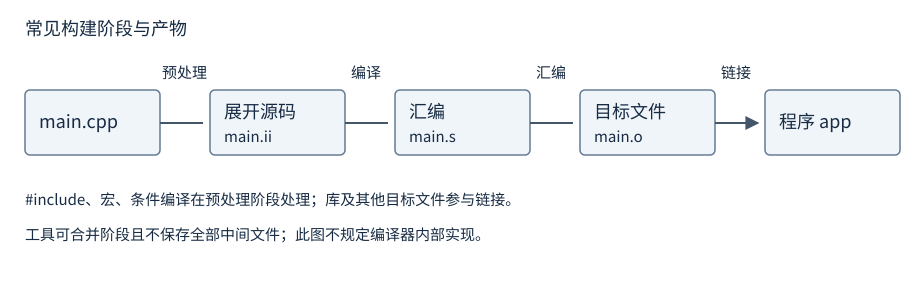
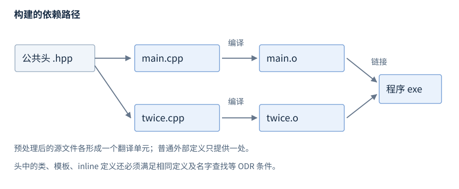

# 程序结构与编译

C++ 程序由源文件、声明和定义组成；构建工具把源码翻译并链接成可执行程序。本章从计算和输出一个结果开始，再介绍翻译阶段、多文件组织和最短调试入口。

**版本**：C++17。语言规则适用于符合标准的实现；命令示例分别标为 GCC 和 GDB 的工具用法。工程构建由[构建与工程交付](R30-build.zh-CN.md)展开。

## 源文件与 main

**基础操作**。下面的程序调用 `twice` 计算 21 的两倍，并输出 `result=42`。保存为 `main.cpp`：

```cpp
#include <iostream>
int twice(int value);             // 函数声明
int main() {
    std::cout << "result=" << twice(21) << '\n';
    return 0;
}
int twice(int value) {            // 函数定义
    return value * 2;
}
```

`<iostream>` 提供标准输入输出声明，`std::cout` 是标准输出流；`std::` 表明名字属于标准命名空间。函数声明让调用位置知道参数和返回类型，函数定义提供实际操作。`main` 是通常宿主环境中的入口，返回类型为 `int`；返回零表示成功，非零状态由程序约定。到达 `main` 末尾等价于返回零。本例固定输入 21，结果处于 `int` 的最低保证范围内。[C++17 main](https://timsong-cpp.github.io/cppwp/n4659/basic.start.main)。

完整的[计算结果检查程序](../examples/r01-program-build.cpp)保留在配套源码中；正文的最小程序只展示声明、调用、定义和输出。

## 编译与运行命令

**基础操作 · GCC 工具**。在保存 `main.cpp` 的目录执行：

```sh
g++ -std=c++17 -Wall -Wextra -Wpedantic main.cpp -o app
```

这条命令完成翻译和链接，成功后生成名为 `app` 的程序。类 Unix Shell 通常以 `./app` 运行；Windows 工具链通常生成 `app.exe`，PowerShell 中以 `./app.exe` 运行。先确认构建成功，再运行新程序，避免把以前留下的制品当成本次结果。

| 参数 | 含义 | 常用场景 |
| --- | --- | --- |
| `-std=c++17` | 选择 C++17 模式 | 不依赖编译器默认语言版本 |
| `-Wall -Wextra -Wpedantic` | 启用常用诊断及严格模式诊断 | 发现可疑写法；不代表已经证明程序正确 |
| `-o app` | 指定输出名称 | 控制可执行程序或中间产物名称 |
| `-g` | 生成调试信息 | 配合断点、变量和调用栈查询 |
| `-O0` | 关闭大部分优化 | 便于首次源代码级调试 |

语言标准、编译器支持与标准库支持分别影响可用功能。上述参数是 GCC 驱动的接口，不是 C++ 语法；其他工具链使用相应参数。参考 [GCC 输出与阶段选项](https://gcc.gnu.org/onlinedocs/gcc/Overall-Options.html)。常见工程操作见[构建](R30-build.zh-CN.md)。

## 翻译单元与构建阶段

**机制解释**。翻译单元（translation unit）可理解为一个源文件及其包含内容经过预处理后的单位。头文件被包含进每个使用它的翻译单元，通常不单独编译。



图：常见工具链的四个阶段及中间产物；驱动可合并阶段，也不必实际保存全部中间文件。这是工具流程图，C++ 标准的详细翻译阶段并不等同于四个外部命令。

1. 预处理处理 `#include`、宏和条件编译，得到展开后的源码。
2. 编译检查语法、名字、类型和语义，通常生成汇编形式或等价中间表示。
3. 汇编产生目标文件，包含代码、数据及供后续解析的符号信息。
4. 链接组合目标文件和库，解析跨翻译单元引用，生成程序或库。

**GCC 工具**：以下是分别查看产物的命令；`-c` 执行生成目标文件所需的阶段但不链接。

```sh
g++ -std=c++17 -E main.cpp -o main.ii
g++ -std=c++17 -S main.cpp -o main.s
g++ -std=c++17 -c main.cpp -o main.o
g++ main.o -o app
```

使用 `g++` 驱动链接 C++ 程序，可由驱动加入相应 C++ 运行库。修改公共头后，依赖它的源文件需要重新翻译；增量构建工具维护这些依赖。[C++17 翻译阶段](https://timsong-cpp.github.io/cppwp/n4659/lex.phases)。

## 声明与定义

**基础操作**。声明（declaration）把名字及属性引入程序；定义（definition）是为实体提供完整内容的声明。函数定义提供函数体，变量定义建立对象。每个定义也是声明，反向不成立。

| 类别 | 写法 | 含义 |
| --- | --- | --- |
| 函数声明 | `int twice(int);` | 提供调用接口，无函数体 |
| 函数定义 | `int twice(int n) { return n * 2; }` | 提供接口与实现 |
| 普通变量定义 | `int count = 0;` | 建立对象并初始化 |
| 外部变量声明 | `extern int count;` | 声明已有或其他单元中的实体 |
| 带初始化器的 extern 声明 | `extern int count = 0;` | 仍是变量定义 |
| 类定义 | `struct Point { int x; int y; };` | 给出类的完整成员描述 |

头文件通常保存接口声明，以及需要在使用处可见的类、模板和适用的 `inline` 定义；普通函数实现放源文件。公共头应包含自己需要的声明依赖，使包含者无需先碰巧包含其他头。[C++17 声明与定义](https://timsong-cpp.github.io/cppwp/n4659/basic.def)。

## 作用域、命名空间与链接属性

**基础操作**。作用域规定名字在哪里可见；命名空间组织名字；链接属性（linkage）规定不同作用域或翻译单元中的声明是否能表示同一实体。

```cpp
namespace math {
    int twice(int value) { return value * 2; }
}
int answer = math::twice(21);    // 用限定名调用
```

| 链接类别或设施 | 常见写法 | 实体关系 |
| --- | --- | --- |
| 外部链接 | 命名空间作用域的普通非 static 函数 | 可由其他单元的匹配声明表示同一实体 |
| 内部链接 | 命名空间作用域 `static`、匿名命名空间中的名字 | 每个翻译单元拥有自己的实体 |
| 无链接 | 常见块作用域局部变量 | 不据此由另一个声明跨单元表示同一实体 |
| `inline` 函数/变量 | `inline int version = 1;`（变量为 C++17） | 可在多个单元定义，但仍须满足 ODR |

`inline` 是定义组织规则中的属性，不承诺强制机器码内联。命名空间作用域的非模板非 volatile 的 `const` 变量通常具有内部链接；`extern`、`inline` 或先前具有外部链接的声明等会改变结论。共享常量应使用明确的接口形式。[C++17 链接属性](https://timsong-cpp.github.io/cppwp/n4659/basic.link)。

## 头文件与包含保护

**基础操作**。标准头使用尖括号，项目头通常使用双引号；具体搜索路径由实现和工具选项控制。包含保护防止同一个头在同一翻译单元被重复展开：

```cpp
#ifndef HANDBOOK_TWICE_HPP
#define HANDBOOK_TWICE_HPP
int twice(int value);
#endif
```

`#pragma once` 是广泛支持的实现设施，不是标准 C++ 的包含保护语法。头的扩展名不决定链接规则。公共头避免 `using namespace std;`，因为它会改变所有包含者的未限定名字查找。

## 单一定义规则与多文件程序

**基础操作**。单一定义规则（One Definition Rule，ODR）约束哪些实体可以有多少份定义。普通外部函数可有多份匹配声明，但其程序级定义应按规则只提供一处；把普通函数定义放进同时被两个源文件包含的头，会产生重复定义问题。包含保护只能避免单个翻译单元内重复包含，不能解决这个跨单元问题。

将首例拆成三个文件：`twice.hpp` 保存上面的声明，`twice.cpp` 定义函数，`main.cpp` 包含头并调用。

```cpp
// twice.cpp
#include "twice.hpp"
int twice(int value) { return value * 2; }
```

```sh
g++ -std=c++17 main.cpp twice.cpp -o app
```

此时 `main.cpp` 用 `#include "twice.hpp"` 取代自己手写的函数声明，并删除文件末尾 `twice` 的定义。两个源文件都包含同一个接口头，便于发现签名不一致；不以 `#include "twice.cpp"` 代替正常链接。



图：公共头进入两个源文件，各自产生目标文件，再组合为程序。阶段细节由上一幅图维护。

**进阶后查**。同一翻译单元内不能重复定义规定的实体；被 odr-use 的普通非 `inline` 函数或变量在整个程序中需要相应定义。odr-use 表示按标准规定的使用需要实体定义，例如通常的函数调用或变量取址；不是所有只提到名字的场合都需要定义。类、模板和 `inline` 实体允许满足条件的多单元定义，包括相同记号序列及相应名字查找一致；某些跨单元违例不要求诊断。类内定义的成员函数隐式 `inline`，类外定义另行判断。[C++17 ODR](https://timsong-cpp.github.io/cppwp/n4659/basic.def.odr)。

## GDB 最小调试会话

**基础操作 · GDB 工具**。准备已安装的 GCC/GDB，以调试信息构建首例，然后启动调试器；这些是工具操作示例，不要求读者使用特定本机路径：

```sh
g++ -std=c++17 -g -O0 main.cpp -o app
gdb ./app
```

进入 GDB 后依次输入：

```text
break twice
run
print value
next
bt
continue
quit
```

`break twice` 设置函数断点；`run` 启动程序并在 `twice` 停下；`print value` 此时查看参数，应为 21。`next` 在源代码层单步，`bt` 查看当前调用栈，`continue` 继续运行，程序完成后可退出。调试信息和优化会影响变量是否可见及单步表现。`step` 用于尝试进入被调用函数，更多命令与调查方法见[调试与正确性检查](R31-debug.zh-CN.md)及 [GDB 单步命令](https://sourceware.org/gdb/current/onlinedocs/gdb.html/Continuing-and-Stepping.html)。

## 构建诊断

**基础操作**。按最早的一条有意义诊断、其源位置和构建阶段调查；后续报错可能是连带结果。

| 典型现象 | 主要调查位置 | 常见原因 |
| --- | --- | --- |
| 未声明标识符、类型不匹配 | 编译 | 缺声明、包含遗漏、接口使用不当 |
| `undefined reference` 等未解析符号 | 链接输入及签名 | 缺定义、漏源文件或库、声明定义不一致 |
| `multiple definition` 等重复定义 | 多文件定义组织 | 普通外部定义出现多次 |
| 程序报告失败 | 应用定义的状态与运行条件 | 输入、资源或运行时契约不满足 |

诊断文字随工具链变化。复现时保留命令、语言版本、首条诊断和预期行为；警告能发现部分问题，无警告不等于没有未定义行为。初始化见[初始化与类型推导](R03-initialization-deduction.zh-CN.md)，运行时表达式规则见[表达式与类型转换](R04-expressions-conversions.zh-CN.md)。
