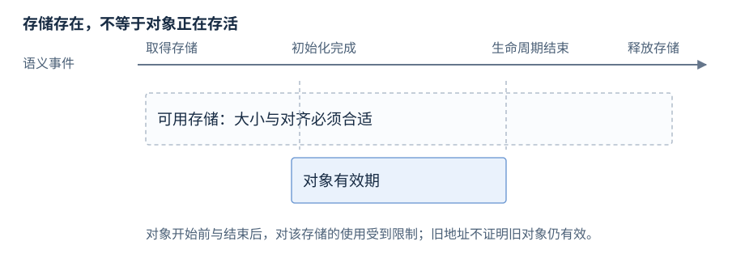
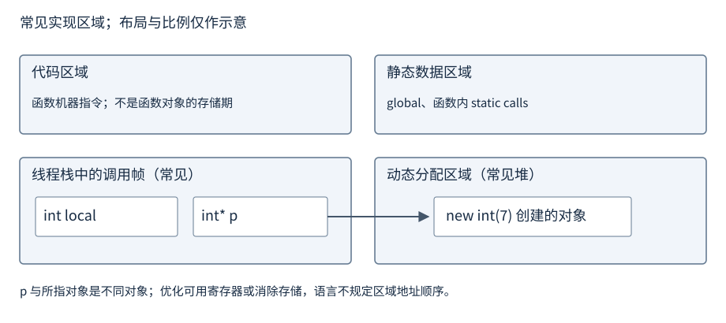
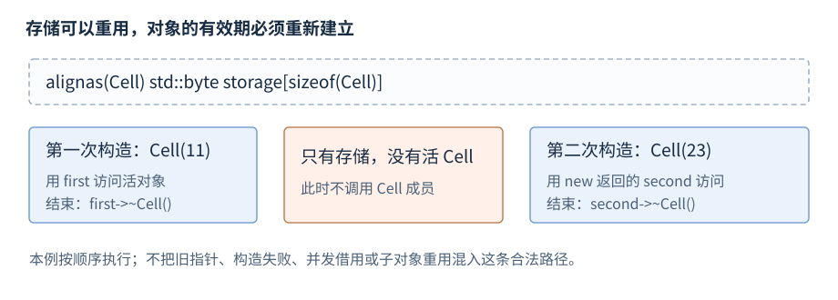

# 类型与对象

类型规定值的集合与允许的操作；对象（object）是具有类型、占用存储并处于一定生命周期内的实体。本章先介绍具体基础类型，再解释数组、对象存储和底层表示。

**版本**：C++17。**先修**：[程序结构与编译](R01-program-build.zh-CN.md)。基础路径是基础类型、数组、存储期与作用域；对象表示和存储重用供底层接口后查。函数和引用不是对象类型，引用为另一个实体提供别名。

## 基础类型分类

**基础操作**。基础类型（fundamental types）包括整数、浮点、`void` 和空指针类型。字符类型和 `bool` 也属于整数类型；枚举、数组、指针和类属于其他类型类别，枚举在本章另设入口。

| 类别 | 具体类型 | 常用用途 |
| --- | --- | --- |
| 有符号整数 | `signed char`、`short`、`int`、`long`、`long long` | 整数值和允许负数的计数 |
| 无符号整数 | 上述各类型对应的 `unsigned` 形式 | 位运算、明确的模运算 |
| 字符 | `char`、`wchar_t`、`char16_t`、`char32_t` | 字符编码单元；不等同于用户看见的字符 |
| 布尔 | `bool` | `true` 与 `false` |
| 浮点 | `float`、`double`、`long double` | 近似实数计算 |
| 无值/空指针 | `void`、`std::nullptr_t` | 不返回值；专门的空指针值类型 |

`short int` 可简写为 `short`，`long long int` 可简写为 `long long`，未写 `unsigned` 的这几种普通整数名表示有符号类型。`char`、`signed char`、`unsigned char` 是三个不同类型。[C++17 基础类型](https://timsong-cpp.github.io/cppwp/n4659/basic.fundamental)。

## 整数类型的大小与范围

**基础操作**。C++ 字节是 `sizeof` 的计量单位，包含 `CHAR_BIT` 位；`CHAR_BIT` 至少为 8。`sizeof(char) == 1`，不代表所有实现的字节都为八位。下表列标准最低保证，实际类型可以更宽；最低位数包含符号位，但不能据此排除实现的填充位。

| 类型 | 最低位数 | 标准至少覆盖的范围 |
| --- | --- | --- |
| `signed char` | 8 | −127 至 127 |
| `unsigned char` | 8 | 0 至 255 |
| `short` | 16 | −32767 至 32767 |
| `unsigned short` | 16 | 0 至 65535 |
| `int` | 16 | −32767 至 32767 |
| `unsigned int` | 16 | 0 至 65535 |
| `long` | 32 | −2147483647 至 2147483647 |
| `unsigned long` | 32 | 0 至 4294967295 |
| `long long` | 64 | −9223372036854775807 至 9223372036854775807 |
| `unsigned long long` | 64 | 0 至 18446744073709551615 |

标准规定 `sizeof(char) <= sizeof(short) <= sizeof(int) <= sizeof(long) <= sizeof(long long)`，对应有符号与无符号类型的大小和对齐相同。C++17 允许不同有符号表示，不能把二进制补码的额外负数端点当最低保证；有符号溢出行为未定义，无符号算术按值位数的模数回绕。这里的最低范围来自 C++17 引用的 C 整数限制；完整最低限制可查 [C 草案 N1570 §5.2.4.2.1](https://www.open-std.org/jtc1/sc22/wg14/www/docs/n1570.pdf)。

**实现示例**。ABI（Application Binary Interface，应用二进制接口）规定具体平台的调用约定、对象布局等。以下是常见数据模型下的大小示例，统一假设八位字节；它们是模型对比，不是本机测量或语言保证。

| 类型 | ILP32 字节数 | LP64 字节数 | LLP64 字节数 |
| --- | --- | --- | --- |
| `char` / `signed char` / `unsigned char` | 1 | 1 | 1 |
| `short` / `unsigned short` | 2 | 2 | 2 |
| `int` / `unsigned int` | 4 | 4 | 4 |
| `long` / `unsigned long` | 4 | 8 | 4 |
| `long long` / `unsigned long long` | 8 | 8 | 8 |
| 对象指针（如 `int*`） | 4 | 8 | 8 |

这些模型的名称以 `int`、`long`、指针宽度命名；不同 ABI 仍可能有额外布局规定。若使用无填充二进制补码，有符号 16/32/64 位的实际范围分别为 −32768 至 32767、−2147483648 至 2147483647、−9223372036854775808 至 9223372036854775807；相应无符号范围为 0 至 2 的位数次幂减一。可移植代码查询当前实现，不按操作系统名字推断 `long`。

## 字符、布尔与空指针类型

**基础操作**。字符字面量初始化一个编码单元；一个 `char` 不一定表示一个完整的 Unicode 字符。

```cpp
char letter = 'A';
unsigned char byte = 0x7Fu;
char16_t unit16 = u'A';
char32_t unit32 = U'A';
bool ready = true;
int* absent = nullptr;
```

| 类型 | 大小与表示要求 | 值与用途 |
| --- | --- | --- |
| `char` | 1 字节；与 signed/unsigned char 大小及对齐相同 | 与其中一种同范围，选择由实现定义 |
| `wchar_t` | 大小、符号与某一整数类型相同，由实现选择 | 宽字符编码单元，不保证 16 或 32 位 |
| `char16_t` | 与 `uint_least16_t` 的大小、符号和对齐一致 | 至少 16 位的字符编码单元 |
| `char32_t` | 与 `uint_least32_t` 的大小、符号和对齐一致 | 至少 32 位的字符编码单元 |
| `bool` | 大小由实现定义，至少 1 字节 | 只有 false/true，不以原生字节布局定义协议 |
| `std::nullptr_t`（`<cstddef>`） | 与 `void*` 大小相同 | `nullptr` 的类型，可转换为适用的空指针 |
| `void` | 不完整且不能完成，无 `sizeof(void)` | 无值返回、`void*` 通用对象地址接口 |

C++20 增加独立的 `char8_t`，用于 UTF-8 编码单元；C++17 的 `u8` 字符串仍使用 `char`。字符编码与字符串长度的区别见[字符串与视图](R12-strings-views.zh-CN.md)。

## 浮点类型

**基础操作**。浮点类型近似表示实数，`double` 的精度和范围不少于 `float`，`long double` 不少于 `double`；三者不是固定字节数的别名。常用字面量 `1.5f`、`1.5`、`1.5L` 分别具有这三种类型。

| 类型 | 标准大小/精度关系 | 常见表示示例（非标准保证） |
| --- | --- | --- |
| `float` | 字节数由实现定义 | IEEE 754 binary32，4 个八位字节，24 位有效二进制精度 |
| `double` | 值集合包含 float | IEEE 754 binary64，8 个八位字节，53 位有效二进制精度 |
| `long double` | 值集合包含 double | 可与 double 相同，或用扩展/四倍精度；存储可为 8、12、16 字节等 |

典型 binary32 最大有限值约为 3.4028235×10³⁸，最小正正规值约为 1.1754944×10⁻³⁸；binary64 分别约为 1.7976931×10³⁰⁸、2.2250739×10⁻³⁰⁸。若支持次正规数，最小正值还可更小。`long double` 没有单一可通用填写的范围，应查询实现；存储中的填充也不增加有效精度。

`numeric_limits<T>::min()` 对浮点表示最小正正规值，`lowest()` 表示最负有限值，`max()` 表示最大有限值。`epsilon()` 是 1 附近相邻可表示值的距离，不是所有数量级的统一误差容限。NaN 等特殊值若实现支持，会改变通常的相等和大小比较；浮点容器键的比较器仍须满足相应排序要求，见[关联容器](R14-associative-adaptors.zh-CN.md)。

## 类型性质查询与定宽整数

**基础操作**。需要 `<climits>`、`<limits>`、`<cstddef>`。下面片段可在函数体内查询类型，不预设输出数字：

```cpp
std::size_t bytes = sizeof(long);
std::size_t storage_bits = sizeof(long) * CHAR_BIT;
int value_bits = std::numeric_limits<long>::digits; // 有符号类型不含符号位
long minimum = std::numeric_limits<long>::lowest();
long maximum = std::numeric_limits<long>::max();
int precision = std::numeric_limits<double>::digits;
```

`storage_bits` 包括可能的填充；`digits` 表示值精度，含义随整数和浮点不同。`<cstdint>` 的 `int32_t`、`uint64_t` 等只有实现存在适用的精确宽度类型时才提供；`int_least32_t` 要求至少相应宽度，`int_fast32_t` 偏向实现认为高效的适用类型。`std::size_t` 是 `sizeof` 结果类型，`std::ptrdiff_t` 用于适用的指针差；不要把它们固定成 `unsigned int` 或 `long`。[numeric_limits](https://timsong-cpp.github.io/cppwp/n4659/numeric.limits)、[定宽类型](https://timsong-cpp.github.io/cppwp/n4659/cstdint.syn)。

## 枚举类型

**基础操作**。枚举为一组命名值建立类型；作用域枚举 `enum class` 不隐式转换为整数，枚举名需以类型限定。

```cpp
enum class State : unsigned char { idle = 0, ready = 1 };
State current = State::ready;
unsigned code = static_cast<unsigned>(current); // 1
```

可显式指定底层整数类型；未指定底层类型的作用域枚举使用 `int`，非作用域枚举另有选择规则。枚举属于独立类型类别，不能混入基础整数表；底层类型允许表示某个值，不代表它就是业务上有效的命名状态。转换规则见[static_cast](R04-expressions-conversions.zh-CN.md#static_cast)。

## 数组与类型别名

**基础操作**。`T a[N]` 建立 N 个连续的 T 对象。`using Name = T` 给已有类型一个别名，不产生防混用的新类型。

```cpp
using Count = unsigned long;
int values[3] = {3, 5, 7};
int* first = values;           // 数组到首元素指针
int (&whole)[3] = values;      // 绑定整个数组
std::size_t length = sizeof(values) / sizeof(values[0]); // 3，需 <cstddef>
```

数组在许多表达式中转换为指针，长度随之丢失；`sizeof`、取地址和绑定数组引用等场合保留数组身份。函数参数 `int a[3]` 调整为指针参数，不保证调用者传了三个元素。`sizeof(first) / sizeof(*first)` 只是指针与元素的大小比，不是长度。数组不能像标量一样整体赋值；整体赋值和标准接口可使用[顺序容器中的 array](R13-sequence-containers.zh-CN.md)。

数组元素各有自己的初始化、构造和析构。需要固定长度的接口可用数组引用模板，运行时长度则明确传入长度或范围；有终止符的接口必须保证终止符确实在有效范围内。区分用户 ID 和订单 ID 时，用不同包装类而非两个相同整数别名。

参考资料：[数组声明](https://timsong-cpp.github.io/cppwp/n4659/dcl.array)、[数组转换](https://timsong-cpp.github.io/cppwp/n4659/conv.array)。

## 存储期、对象生命周期与作用域

**基础操作**。存储是可容纳对象的内存；存储期（storage duration）规定这块存储存在多久；生命周期（lifetime）规定对象何时存在并可按对象规则使用；作用域（scope）规定名字可见的位置。这些区间相关但不同。

| 存储期 | 常见对象 | 存储覆盖范围 |
| --- | --- | --- |
| 自动 | 普通块作用域局部变量 | 按块执行规则取得和结束 |
| 静态 | 命名空间变量、局部 static | 程序执行期间 |
| 线程 | `thread_local` 变量 | 相应线程执行期间 |
| 动态 | new 创建的对象 | 按动态分配与释放规则控制 |

```cpp
int global = 1;               // 静态存储期
void work() {
    static int calls = 0;      // 名字只在 work 内可见，对象跨调用保留
    int local = 2;            // 自动存储期
    ++calls;
}
```

对象生命周期一般在获得足够大小、正确对齐的存储并完成初始化后开始，到析构开始、存储释放或被重用等规定事件结束；构造析构和子对象还有专门规则。内层同名变量会隐藏外层名字，不销毁外层对象；保存一个地址不会延长所指对象寿命。



图：一块存储可先后容纳不同对象；存储尚在不代表旧对象仍活着。类型与初始化合法也不等于某次访问的生命周期有效。[C++17 生命周期](https://timsong-cpp.github.io/cppwp/n4659/basic.life)、[存储期](https://timsong-cpp.github.io/cppwp/n4659/basic.stc)。

## 常见进程存储区域

**机制解释 · 实现概览**。常见进程地址空间中有代码、静态数据、动态分配区域和线程栈。栈（stack）常承载调用帧与自动局部对象；堆（heap）常承载动态分配对象。它们是实现及 OS 的组织方式，C++ 没有规定这些区域的地址顺序，也不要求每个局部变量真的写入栈内存。



图：局部指针和它所指的动态对象是两个不同对象；静态变量与代码另有常见区域。优化可能把值保存在寄存器或消除存储。图不规定真实地址、堆增长方向或连续布局。

自动/静态/线程/动态是语言存储期，栈/静态数据/堆是常见实现区域，两套分类不完全一一对应。局部静态变量虽声明在函数里，仍常放在静态数据区域；动态对象可由不同分配器管理。更详细的页、映射和地址空间见[进程与虚拟内存](R25-process-virtual-memory.zh-CN.md)，目标文件的节与装载段见[链接与装载](R27-linking-loading-libraries.zh-CN.md)。

## sizeof、alignof 与对象表示

**机制解释**。`sizeof(T)` 返回对象表示占用的 C++ 字节数，包括填充；`alignof(T)` 返回对齐要求。结构成员之间及末尾可以有填充，不保证成员大小之和等于结构大小。

```cpp
struct Record { char tag; int value; };
std::size_t size = sizeof(Record);       // 需 <cstddef>
std::size_t alignment = alignof(Record);
```

对象表示是 `sizeof(T)` 个字节，值表示是其中参与值的位。可通过 `char`、`unsigned char` 或 `std::byte` 访问对象表示；任意类型的指针转换则不消除对齐、生命周期和类型访问条件。不能依靠普通结构体的 `memcmp` 判断语义相等，因为填充字节可能不同。字节序由[CPU 与内存机制](R24-cpu-memory-cost.zh-CN.md)维护。[对象表示](https://timsong-cpp.github.io/cppwp/n4659/basic.types)、[对齐](https://timsong-cpp.github.io/cppwp/n4659/basic.align)。

## 类型特征与字节复制

**机制解释**。`<type_traits>` 的特征回答特定语言问题，不能把“简单结构”当作所有底层操作都合法的证明。

| 特征 | 可以判断 | 不保证 |
| --- | --- | --- |
| `is_trivially_copyable_v<T>` | 适用对象可使用规定的字节复制保证 | 外部字节有效、可跨进程传指针、格式稳定 |
| `is_standard_layout_v<T>` | 满足标准布局条件，适用时可用 offsetof | 无填充、固定大小或跨编译器 ABI 一致 |
| `is_trivial_v<T>` | 平凡默认构造等更强条件 | 默认初始化得到业务有效值 |

下面在两个已经构造的同类型完整对象间复制表示，得到相同值；需要 `<cstring>`、`<type_traits>`，放在函数体内：

```cpp
struct Record { int value; unsigned char tag; };
static_assert(std::is_trivially_copyable_v<Record>);
Record source{7, 2}, copy{};
std::memcpy(&copy, &source, sizeof source); // copy.value 为 7，tag 为 2
```

C++17 保证符合条件的平凡可复制对象可复制到字符/字节数组再恢复，或在适用的现存同类型对象之间复制；基类子对象等有排除条件。本例使用非 volatile 的完整对象，源目标不重叠。标准布局与平凡可复制不能互换；带指针的平凡可复制记录仍可能借用同一个目标。`string`、`vector`、多态资源对象的复制应使用类型提供的操作。[字节复制条件](https://timsong-cpp.github.io/cppwp/n4659/basic.types)、[类型特征](https://timsong-cpp.github.io/cppwp/n4659/meta.unary.prop)。

## placement new 与存储重用

**进阶后查**。普通 `new T(...)` 安排分配和初始化；标准 placement new `::new (address) T(...)` 在调用者提供的存储中建立对象，不取得这块存储。以下展示先后两次构造，需要 `<cstddef>`、`<new>`，放在函数体内：

```cpp
struct Cell { int value; explicit Cell(int v) noexcept : value(v) {} };
alignas(Cell) std::byte storage[sizeof(Cell)];
Cell* first = ::new (static_cast<void*>(storage)) Cell(11);
int first_value = first->value;    // 11
first->~Cell();
Cell* second = ::new (static_cast<void*>(storage)) Cell(23);
int second_value = second->value;  // 23
second->~Cell();
```

按以下过程管理存储，条件跟随各阶段：

1. 准备足够大小、正确对齐且存储期足够长的空间。
2. 执行 placement 构造，保存返回的新指针；若构造抛出异常，该次对象未完成构造。
3. 在对象生命周期内访问，并遵守类型访问和同步要求。
4. 对需清理的类型执行析构，结束借用；析构不释放这里的字节数组。
5. 重用时重新构造，或按原存储来源释放；不能对数组槽中的 placement 对象调用普通 `delete`。



图：两次构造之间没有存活的 Cell；每次使用当次构造返回的指针。手工槽位需维护是否有活对象，构造失败和异常退出也要清理已存在对象；普通代码优先使用[RAII](R09-raii-memory.zh-CN.md)。

C++17 旧指针自动指向替换对象的条件涉及完整对象、const 和子对象等。`std::launder` 只在规定条件下取得指向新对象的指针，不创建对象、不修正对齐，也不修复悬垂借用。

参考资料：[生命周期与重用](https://timsong-cpp.github.io/cppwp/n4659/basic.life)、[字节数组提供存储](https://timsong-cpp.github.io/cppwp/n4659/intro.object)、[launder](https://timsong-cpp.github.io/cppwp/n4659/ptr.launder)。完整[字节复制与存储重用程序](../examples/r02-object-storage.cpp)保留析构计数等组合说明。

## 对象复制与序列化

**机制解释**。普通复制在当前程序中按类型契约复制值或资源；序列化把业务数据编码为外部格式，它们有不同目标。

| 任务 | 操作 | 主要条件 |
| --- | --- | --- |
| 当前程序复制业务对象 | 拷贝构造、赋值或 clone | 值语义、所有权、异常保证 |
| 适用完整记录的表示复制 | 标准保证范围内的字节复制 | 类型性质、对象存在、长度及不重叠 |
| 文件、网络、进程间交换 | 逐字段编码和解码 | 宽度、字节序、长度、单位、版本、合法值 |

平凡可复制也不等于可直接跨平台保存。填充、指针、位域和 ABI 布局没有自动成为协议；外部数据长度由格式规定，解码先检查边界和值再构造业务对象。标准位/字节工具见[数值、随机与位工具](R33-numeric-random-bits.zh-CN.md)，流式分帧见[socket 编程](R29-sockets-production.zh-CN.md)。

## 结构化绑定

**基础操作 · C++17**。结构化绑定为聚合、数组或支持 tuple 协议的对象建立一组名字。下面直接拆解简单记录：

```cpp
struct Point { int x; int y; };
Point point{3, 5};
auto [x, y] = point;            // 隐含对象持有副本，x/y 关联其成员
auto& [rx, ry] = point;         // 借用已有对象
rx = 9;                        // point.x 为 9，x 仍为 3
```

`auto` 形式并非把每个名字都各自当普通独立变量声明；它先建立隐含对象，再将名字与所拆解部分关联。引用形式仍要求原对象存活。完整[数组身份与结构化绑定程序](../examples/r02-types-objects.cpp)保留数组引用和聚合拆解组合示例。[结构化绑定规则](https://timsong-cpp.github.io/cppwp/n4659/dcl.struct.bind)。
