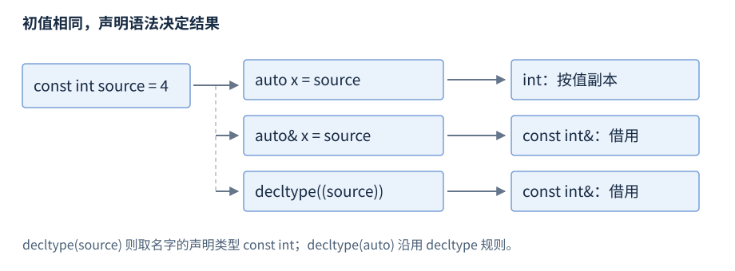

# 第3章 初始化与类型推导

**版本**：核心为 C++17；consteval、constinit 为 C++20，只作为版本化条目。**先修**：R02。首次阅读初始化与 auto；返回引用、静态对象和常量接口的设计再查第3至5节。初始化建立一个新对象的初始状态，赋值修改一个已经存在的对象；名称相似的语法未必选择相同构造函数。

## 1 初始化形式不能机械替换

| 写法 | 类别与常见效果 | 必须核对 |
| --- | --- | --- |
| `int n;` | 自动局部标量默认初始化，不进行初始化 | 读取未确定值在本基线通常是未定义行为 |
| `int n{};` / `int n = 0;` | 列表初始化／拷贝初始化，值为零 | 类型不同会改变构造与转换选择 |
| `T x(arg);` | 直接初始化 | 允许考虑 explicit 构造；可能遭遇函数声明歧义 |
| `T x = arg;` | 拷贝初始化 | 不等于必然产生一次额外复制 |
| `T x{args};` | 直接列表初始化 | 优先涉及 initializer_list 重载，并拒绝规定的窄化 |
| `T x = {args};` | 拷贝列表初始化 | 最终选中 explicit 构造时不合法 |
| `T x{};` | 空列表，按类型走聚合或值初始化等规则 | 用户提供默认构造不保证标量成员都归零 |

静态存储期标量即使没有显式初值，也先经历零初始化，不能把这条规则移用于自动局部变量。`T x();` 声明函数而不是默认构造变量，可改为 `T x{};`。[初始化](https://timsong-cpp.github.io/cppwp/n4659/dcl.init)、[列表初始化](https://timsong-cpp.github.io/cppwp/n4659/dcl.init.list)。

列表初始化的窄化检查很实用，例如 `int n{2.5};` 必须被诊断；整数到较窄整数在常量表达式且实际值可表示等条件下可获例外。但花括号也会改变重载选择，vector 的 `(3,7)` 是三个 7，`{3,7}` 是两个元素，不是统一“更安全”的替换。

initializer_list 的底层元素是 const，接收它的容器通常从这些元素拷贝；所以用花括号直接列出多个 unique_ptr 并不能靠 move 绕过不可拷贝限制。需要移动专有资源时，逐个 emplace 或使用合适的可移动区间。初始化列表本身只是对一个临时数组的轻量描述，复制这个描述不复制元素，也不会无条件保活原数组，不能把局部初始化列表视图长期保存。

## 2 聚合初始化与成员默认值

C++17 的聚合条件涉及构造函数、访问控制、基类和虚函数；C++20 又调整构造函数相关条件，升级语言版本可能使原本的聚合代码不再成立。对简单 `struct Point { int x; int y=5; };`，`Point p{2};` 将 x 设为 2、y 使用成员默认初始化器。省略成员若无默认初始化器，按相应规则从空列表初始化，不能概括成任意类都自动清零。[C++17 聚合](https://timsong-cpp.github.io/cppwp/n4659/dcl.init.aggr)、[C++20 聚合](https://timsong-cpp.github.io/cppwp/n4861/dcl.init.aggr)。

成员初始化器适合提供一致缺省值；类构造函数仍应建立不变量，不能让调用者记住“先调用 init 才能用”。C++20 指定成员初始化使用 `.x=...`，顺序必须符合声明顺序，不能直接照搬 C 的任意顺序和混合写法。

## 3 auto、decltype 与括号

auto 使用类似模板参数推导的规则。按值推导通常移除顶层 const 和引用；`auto&` 保留绑定对象的 const，`auto&&` 可根据初值推导为左值或右值引用。指向 const 的指针中的底层 const 不会因此消失。需要借用时明确写引用，否则 auto 可能复制一个代价很大的容器。[auto 推导](https://timsong-cpp.github.io/cppwp/n4659/dcl.spec.auto)。

C++17 中 auto 的花括号也有自己的规则：`auto a{1};` 得到 int，`auto b={1};` 得到 `initializer_list<int>`；直接列表形式不能用多个元素任意推导一个容器。若几个元素类型不一致，复制列表推导可能失败。写出容器类型可以让意图明确，尤其是公开接口和持久存储。



图3-1：图中 source 是 const int 左值。类型推导是语言保证，不意味着编译器一定保留某个物理副本；优化不能改变可观察行为。

`decltype(name)` 对未加括号的名字取其声明类型；其他表达式依据值类别得到 T、T& 或 T&&。因此 `decltype(source)` 是 const int，`decltype((source))` 是 const int&。decltype(auto) 使用这套规则，不使用按值 auto 的规则。[decltype](https://timsong-cpp.github.io/cppwp/n4659/dcl.type.simple)。

危险边界出现在返回语句：decltype(auto) 返回 `(local)` 会推导成引用，函数退出后悬垂；返回 `local` 可能推导为值。不要靠删括号掩盖接口不清晰，应先确定所有权和返回类型，参考 R05。

函数返回 auto 需要从返回表达式推导，多个可达返回语句必须按规则得到相同类型，不能假定编译器再找一个共同转换类型。调用者也需要在使用推导返回类型前看到相应定义。对跨模块 API，显式返回类型常更便于保持兼容和理解所有权；对小型局部泛型辅助函数，推导可减少重复声明。

## 4 const 与编译期设施

const 禁止通过该对象修改其值，但初始化可以发生在运行期，且对指针的 const 需区分所指对象与指针本身。constexpr 变量要求常量初始化并成为 const；constexpr 函数表示满足条件的调用可参与常量表达式，不意味着每次调用都在编译期执行。[constexpr](https://timsong-cpp.github.io/cppwp/n4659/dcl.constexpr)。

C++20 consteval 声明立即函数，规定场合的调用必须产生常量表达式；C++20 constinit 要求具有静态或线程存储期的变量满足静态初始化，既不把变量变成 const，也不保证它可用作常量表达式。constinit 与 constexpr 不能在同一声明中组合使用。[C++20 声明说明符](https://timsong-cpp.github.io/cppwp/n4861/dcl.spec)、[C++20 constexpr 与立即函数](https://timsong-cpp.github.io/cppwp/n4861/dcl.constexpr)。

## 5 工作例子与初始化顺序

代码与 `examples/r03-initialization-deduction.cpp` 一致，预期输出 `zero=0 repeated=3 listed=2`，失败非零。使用 R01 的 C++17 命令定向编译。

```cpp
#include <iostream>
#include <type_traits>
#include <vector>

int main() {
    int zero{};
    const int source = 4;
    auto copy = source;
    auto& alias = source;
    decltype(auto) borrowed = (source);
    std::vector<int> repeated(3, 7);
    std::vector<int> listed{3, 7};
    static_assert(std::is_same_v<decltype(copy), int>);
    static_assert(std::is_same_v<decltype(alias), const int&>);
    static_assert(std::is_same_v<decltype(borrowed), const int&>);
    if (zero != 0 || repeated.size() != 3 ||
        repeated[2] != 7 || listed.size() != 2 || listed[0] != 3) {
        return 1;
    }
    std::cout << "zero=0 repeated=3 listed=2\n";
}
```

静态对象先经历静态初始化，必要时再动态初始化；跨翻译单元的动态初始化顺序存在复杂条件，不能把源文件排序当依赖机制。局部 static 在首次控制经过声明时初始化，C++11 起并发初始化有同步保证；初始化抛异常后下次经过会重试，递归重入正在初始化的声明仍是危险边界。[静态初始化](https://timsong-cpp.github.io/cppwp/n4659/basic.start.static)、[动态初始化](https://timsong-cpp.github.io/cppwp/n4659/basic.start.dynamic)、[局部 static](https://timsong-cpp.github.io/cppwp/n4659/stmt.dcl)。

优先用明确依赖的构造参数或函数内静态入口管理顺序，并同时考虑程序退出时的销毁顺序。成员初始化的先后由声明顺序决定，见 R07；常量求值与模板条件见 R10。
