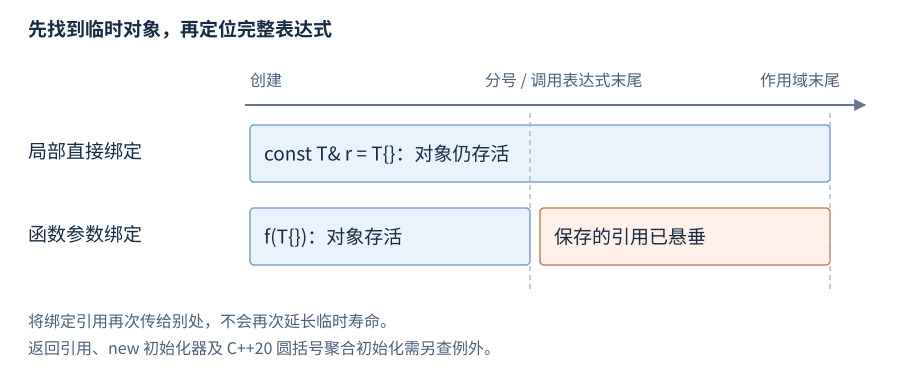

# 指针与引用

指针（pointer）保存指向对象或函数的位置，引用（reference）为对象或函数提供别名。本章先给声明、访问和传参，再解释数组区间、临时对象与借用寿命。

**版本**：C++17；C++20 聚合圆括号初始化的临时寿命差异单独标注。**先修**：[类型与对象](R02-types-objects.zh-CN.md)、[初始化](R03-initialization-deduction.zh-CN.md)、[值类别](R04-expressions-conversions.zh-CN.md#值类别)。所有权由[RAII 与内存管理库](R09-raii-memory.zh-CN.md)维护。

## 指针声明、取址与解引用

**基础操作**。`T* p` 声明指向 T 的指针，`&object` 取地址，`*p` 访问所指对象；对类指针 `p->member` 等价于适用的 `(*p).member`。

```cpp
int value = 7;
int* p = &value;
int observed = *p;             // 7
*p = 9;                       // value 为 9
int other = 3;
p = &other;                   // 改变指向，value 仍为 9
```

指针本身和所指对象是两个不同对象，改变指针不会复制或销毁原目标。声明 `int* p, q;` 中只有 p 是指针；分别声明可避免误读。非空指针仍须指向可访问的有效对象，正确类型、寿命、对齐和边界是访问条件。

## nullptr 与可选借用

**基础操作**。`nullptr` 是专门的空指针常量，可以初始化适用指针，也可以与指针比较。用空指针表达没有可选对象：

```cpp
void increment_if_present(int* value) {
    if (value != nullptr) ++*value;
}
// 使用片段
int count = 3;
increment_if_present(&count); // count 为 4
increment_if_present(nullptr); // 不修改任何对象
```

用 `nullptr` 避免整数 `0` 带来的重载歧义。普通自动局部指针 `int* p;` 没有确定初值，不能通过 `if (p)` 使它有效；声明时给适用地址或 nullptr。空指针不能解引用，也不能据其构造一个可用引用。[空指针转换](https://timsong-cpp.github.io/cppwp/n4659/conv.ptr)。

## 左值引用与右值引用

**基础操作**。`T&` 声明左值引用，通常绑定既有左值；`T&&` 声明右值引用，通常绑定右值。`const T&` 可只读绑定既有对象或适用临时。

```cpp
int value = 7;
int& alias = value;
alias = 9;                    // 修改 value，不重新绑定 alias
const int& read_only = value;
int&& temporary = 42;         // 绑定临时 int，局部寿命延长
int snapshot = temporary;     // temporary 名称表达式是左值，读取为 42
```

引用定义通常需要初值，绑定后不重新绑定；参数/返回类型声明、某些成员与 extern 声明允许省略初值。赋值给引用是修改被引用对象。引用没有用来表示缺对象的合法空状态；“必选借用”仍要求调用方提供活对象。右值引用的移动/转发用途见[拷贝与移动](R08-copy-move.zh-CN.md)。

| 声明形式 | 主要语义 | 初始化后的常见操作 |
| --- | --- | --- |
| `T*` | 可为空、可重新指向 | 解引用有效目标，或改变指向 |
| `const T*` | 通过此路径只读目标 | 可改变指针指向 |
| `T* const` | 指针本身固定 | 可修改适用的非 const 目标 |
| `T&` | 绑定对象、通常可修改 | 赋值修改目标，不能重新绑定 |
| `const T&` | 只读绑定 | 可绑定适用临时，不保证任意借用长寿 |
| `T&&` | 右值引用 | 名称是左值；消费需适用移动操作 |

参考资料：[引用声明](https://timsong-cpp.github.io/cppwp/n4659/dcl.ref)、[引用初始化](https://timsong-cpp.github.io/cppwp/n4659/dcl.init.ref)。

## const 与多级指针

**基础操作**。const 在 `*` 左侧限制目标，在右侧限制该指针；可同时限制两者。

```cpp
int value = 7, other = 9;
const int* view = &value;
view = &other;                // 合法，指针可改
int* const fixed = &value;
*fixed = 8;                   // 合法，目标可改
const int* const fixed_view = &value; // 指针和目标访问均受限
```

多级指针需逐层分析。`T**` 不能直接转换为 `const T**`，否则可以把 const 对象指针写回原本允许修改目标的指针槽；适用的限定转换需要更完整的逐层 const 条件。不要用 cast 绕过保护后写入。[限定转换](https://timsong-cpp.github.io/cppwp/n4659/conv.qual)。

## 数组区间与指针算术

**基础操作**。数组的元素地址与尾后地址组成有效区间；尾后指针可形成和作终点，但不可解引用。

```cpp
int values[3] = {2, 4, 6};
int* first = values;
int* last = values + 3;
int total = 0;
for (int* p = first; p != last; ++p) total += *p; // 12
std::ptrdiff_t length = last - first;             // 3，需 <cstddef>
```

指针加减必须保持在同一数组及其尾后范围；相减要求来自同一数组，差值可由 `std::ptrdiff_t` 表示。单个非数组对象在这些规则中视作长度一的数组；碰巧相邻的变量不成为一个数组。指针仅携带地址，接口无法从任意两个地址自动证明它们组成有效区间。

C++20 `span` 可保存范围长度但仍借用底层对象；访问仍须满足寿命和边界。查找一个整数可用下面的半开区间接口，它要求输入来自同一有效数组、元素已经初始化，空区间不解引用：

```cpp
int* find_value(int* first, int* last, int wanted) {
    for (; first != last; ++first)
        if (*first == wanted) return first;
    return nullptr;
}
```

成功返回匹配元素的地址，失败返回空；调用者的数组存活和相应失效条件决定返回借用能用多久。[指针加减规则](https://timsong-cpp.github.io/cppwp/n4659/expr.add)。

## 临时对象与寿命延长

**机制解释**。普通临时对象通常在所在完整表达式末尾销毁；适用的直接引用绑定可延长它的寿命。需 `<string>`，局部例子：

```cpp
const std::string& kept = std::string("alive");
std::size_t length = kept.size(); // 5；临时活到 kept 所在作用域结束
```

局部 `const T& r = T{};` 或 `T&& r = T{};` 的适用直接绑定可延长临时；规定的直接成员访问等路径还可延长完整临时对象。重新绑定一个引用不继续延长寿命，通过返回引用的访问函数取得成员也不自动保活临时所有者。



图：直接局部绑定的临时跨越分号；函数引用参数所绑定的临时只到调用所在完整表达式末尾。横轴是语义事件，不是耗时。

**进阶后查**。返回语句绑定返回引用的临时不因返回类型延长寿命；函数引用形参的临时只活到调用完整表达式结束；`new` 初始化器中的引用成员不保活临时到动态对象寿命。构造函数成员初始化器把引用成员绑定到临时是非法程序。

**C++20 差异**。含引用成员的聚合，用花括号初始化可按规则延长所绑定临时；圆括号聚合初始化中的临时只到完整表达式末尾。先给所有者清晰名字，通常更容易看清引用关系。

参考资料：[C++17 临时对象](https://timsong-cpp.github.io/cppwp/n4659/class.temporary)、[C++20 临时对象](https://timsong-cpp.github.io/cppwp/n4861/class.temporary)。

## 返回借用与非拥有成员

**机制解释**。借用（borrowing）是通过指针、引用或视图访问由别处负责保活的对象，不转移所有权。以下返回调用者对象的成员；需 `<string>`，类与函数在命名空间作用域：

```cpp
struct Owner { std::string text; };
const std::string& text_of(const Owner& owner) { return owner.text; }
// 使用片段
Owner owner{"alive"};
const std::string& view = text_of(owner); // owner 活着时借用成员
```

不能返回局部对象的地址或引用；从临时 string 保存 `data()` 指针，跨越完整表达式后也会悬垂。接口说明借用到何时、哪些修改使其失效、是否允许空及并发条件。地址仍有效和逻辑元素身份未变是两个问题，容器失效见[顺序容器](R13-sequence-containers.zh-CN.md)。

类的默认复制会复制指针/引用成员的借用关系，两份视图仍访问同一个外部对象；移动也不必改变借用目标。需要自足对象时保存值或拥有者，刻意的视图则不能比所有者活得更久。

## 类型访问与配套例子

**进阶后查**。类型访问规则约束可通过哪些类型访问对象。把 `float*` 转成 `int*` 并解引用，不能靠大小相同获得合法性；字节观察、`memcpy` 或满足条件的 C++20 `bit_cast` 有各自保证。[类型与对象](R02-types-objects.zh-CN.md)维护对象表示与存储重用，[数值与位工具](R33-numeric-random-bits.zh-CN.md)维护标准工具。

完整[借用查找与临时保活程序](../examples/r05-pointers-references.cpp)组合展示 `find_value` 修改调用者元素、失败空返回，以及 Owner 直接局部绑定的寿命延长。返回地址不会拥有数组；其有效性仍由数组寿命和元素失效条件决定。[C++17 类型访问规则](https://timsong-cpp.github.io/cppwp/n4659/basic.lval)。
