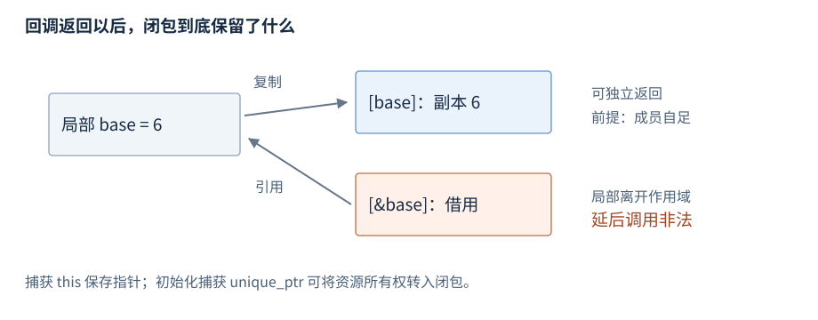

# 语句与函数

语句（statement）控制执行、声明对象或计算表达式；函数（function）以参数接收输入，并通过返回值或状态变化提供结果。本章分别介绍控制语句、函数接口和可调用对象。

**版本**：C++17，包括 if 初始化器、泛型 lambda、初始化捕获和 `std::invoke`。**先修**：[初始化](R03-initialization-deduction.zh-CN.md)、[表达式](R04-expressions-conversions.zh-CN.md)、[指针与引用](R05-pointers-references.zh-CN.md)。异常控制由[错误处理](R11-errors-exception-safety.zh-CN.md)维护。

## 控制语句分类

**基础操作**。复合语句 `{ ... }` 把多条语句组成一个块，也形成局部作用域。下面按控制任务分类；各对象在后续条目有常用语法和短例。

| 类别 | 语句 | 主要作用 |
| --- | --- | --- |
| 选择 | `if/else`、`switch` | 按条件或值选择分支 |
| 循环 | `for`、`while`、`do-while`、范围 for | 重复执行循环体 |
| 跳转 | `break`、`continue`、`return` | 退出循环/选择、进入下一轮、返回函数 |
| 编译期选择 | C++17 `if constexpr` | 在适用场景丢弃一个分支，见模板章 |

`goto` 和标签仅作为低频索引：它们执行显式跳转，但受不能跨越禁止的初始化等规则约束；本书基础路径不展开。嵌套块名字隐藏与对象寿命见[类型与对象](R02-types-objects.zh-CN.md#存储期对象生命周期与作用域)。

## if 与 else

**基础操作**。语法形状是 `if (条件) 语句 else 语句`，`else` 可以省略。局部例子：

```cpp
int score = 75;
int level = 0;
if (score >= 90) {
    level = 2;
} else if (score >= 60) {
    level = 1;
} else {
    level = 0;
}
```

结果 `level` 为 1。条件进行布尔转换，只执行选中的分支。`else` 关联最近的未配对 if，使用花括号可明确嵌套结构。

**C++17 基础操作**。初始化器的变量在条件及两分支中可见，if 结束后离开作用域：

```cpp
if (int value = 7; value > 0) {
    int doubled = value * 2; // 14，只在本块中可见
}
```

## switch

**基础操作**。`switch (整数或枚举条件)` 在匹配 `case` 处开始执行，没有匹配时进入可选的 `default`。

```cpp
int command = 2, result = 0;
switch (command) {
case 1: result = 10; break;
case 2: result = 20; break;
default: result = -1; break;
}
```

结果 `result` 为 20。`case` 是适用的常量表达式标签，不能重复；没有 break 时可以贯穿到后续分支，刻意贯穿可用 C++17 `[[fallthrough]];` 表达。case 标签本身不形成块，分支有局部初始化声明时用花括号隔开，避免跨越初始化的非法跳转。

## for

**基础操作**。形状是 `for (初始化; 条件; 迭代表达式) 循环体`：先初始化，再逐轮判断条件、执行循环体、执行迭代表达式。

```cpp
int total = 0;
for (int i = 1; i <= 3; ++i) {
    total += i;
}
```

结果为 6；这里 `i` 只在循环范围内可见。条件省略视作真，`for (;;) { ... }` 可表示持续循环，需要明确退出路径。

## while 与 do-while

**基础操作**。`while (条件)` 先判断再执行；`do { ... } while (条件);` 先执行一次再判断。

```cpp
int remaining = 3;
while (remaining > 0) --remaining; // 最后为 0
int attempts = 0;
do {
    ++attempts;
} while (attempts < 1);            // 即使首次条件不成立也执行一次
```

两个循环都需要使退出条件有机会成立；do-while 末尾的分号是语法的一部分。

## 范围 for

**基础操作**。形状是 `for (元素声明 : 范围) 循环体`。按值声明复制元素，引用声明访问既有元素；下面使用数组，无需头文件：

```cpp
int values[] = {1, 2, 3};
for (int& value : values) value *= 2; // 元素变为 2、4、6
int total = 0;
for (int value : values) total += value; // 12
```

常见泛型声明是 `auto`、`auto&`、`const auto&`、`auto&&`，根据是否复制/修改选择。循环体修改容器可能使遍历的迭代器或终点失效，见各容器条目。

**机制解释**。C++17/20 范围表达式建立隐含绑定，不自动保活其中所有嵌套临时；从临时所有者的访问函数取得成员引用作为范围可能悬垂。先给所有者一个名字再迭代，可明确寿命。[C++17 范围 for](https://timsong-cpp.github.io/cppwp/n4659/stmt.ranged)。

## break、continue 与 return

**基础操作**。break 退出最近的循环或 switch；continue 进入最近循环的下一轮（for 会继续执行迭代表达式）；return 结束整个当前函数。

```cpp
int total = 0;
for (int i = 1; i <= 5; ++i) {
    if (i == 2) continue;
    if (i == 4) break;
    total += i;
} // total 为 4，只累加了 1 和 3
```

`return expression;` 形成返回结果，`void` 函数可用 `return;`。正常离开作用域销毁相应自动对象；返回引用不能指向已经销毁的局部对象。[跳转语句](https://timsong-cpp.github.io/cppwp/n4659/stmt.jump)。

## 函数声明、定义与调用

**基础操作**。形状为 `返回类型 函数名(参数列表)`；声明以分号结束，定义提供函数体。函数可有零个或多个参数：

```cpp
int add(int left, int right);       // 声明
int add(int left, int right) {      // 定义
    return left + right;
}
// 使用片段
int answer = add(20, 22);           // 42
```

调用前需要可见声明，参数接受对应实参，返回值用于初始化结果。声明中的参数名可省略，类型须一致；多个源文件共享声明的方式见[声明与定义](R01-program-build.zh-CN.md#声明与定义)。函数本身不是对象，但函数指针是对象。参数求值顺序见[求值顺序](R04-expressions-conversions.zh-CN.md#求值顺序与副作用)。

## 参数与返回值

**基础操作**。参数是调用时初始化的实体；按值提供独立对象，引用和指针通常提供借用。需要 `<string>` 的定义片段：

```cpp
int twice(int value) { return value * 2; } // 适合便宜值
void increment(int& value) { ++value; }    // 修改调用者
std::size_t length(const std::string& text) { return text.size(); }
```

| 参数形式 | 输入关系 | 常见接口意图 |
| --- | --- | --- |
| `T` | 建立独立参数对象 | 便宜值或需要自己的副本 |
| `const T&` | 只读借用 | 避免复制，调用中需要对象有效 |
| `T&` | 可修改借用 | 直接改变调用者对象 |
| `T*` | 适用时可为空的借用 | 可选对象，需约定是否拥有及长度 |

需要保留一份资源时，可按值接收再移动到成员；const 引用的间接访问和别名仍可能有成本。返回值通常表达独立结果，C++17 适用的复制消除见[拷贝与移动](R08-copy-move.zh-CN.md)。返回引用或指针必须说明所有者及失效条件。[函数调用](https://timsong-cpp.github.io/cppwp/n4659/expr.call)。

## 默认实参与函数重载

**基础操作**。默认实参在调用点补足省略的尾部参数，声明必须对调用者可见：

```cpp
int scale(int value, int factor = 2) { return value * factor; }
// 使用片段
int a = scale(3);              // 6
int b = scale(3, 4);           // 12
```

默认实参不是函数类型的一部分，也不参与决定最佳重载。虚函数的实现可动态分派，但默认实参根据调用处静态类型选择；它不会随 override 自动切换。

函数重载使用相同名字及不同适用参数列表，不能仅以返回类型区分：

```cpp
int magnitude(int value) { return value < 0 ? -value : value; }
double magnitude(double value) { return value < 0 ? -value : value; }
// 使用片段
int a = magnitude(-3);         // int 重载，3
double b = magnitude(-2.5);    // double 重载，2.5
```

本例整数输入不为最低值。重载决议收集候选、检查可行性和转换、选择最佳匹配；没有唯一最佳就产生歧义。默认参数可使一参和带默认值的两参重载同时可行，返回变量类型不能替调用选函数。模板/非模板也不能脱离转换质量概括为总优先某一类。[默认实参](https://timsong-cpp.github.io/cppwp/n4659/dcl.fct.default)、[重载决议](https://timsong-cpp.github.io/cppwp/n4659/over.match)。

## lambda 表达式

**基础操作**。lambda 创建闭包（closure）对象，即保存捕获状态并具有调用运算符的匿名类对象。常用形状是 `[捕获](参数) mutable -> 返回类型 { 函数体 }`，mutable 和返回类型可按需要省略。

```cpp
int base = 6;
auto add = [base](int value) { return base + value; };
int answer = add(4);           // 10
base = 100;
int still = add(4);            // 仍为 10，捕获的是原值副本
```

无捕获写 `[]`；泛型 lambda 的参数可写 `auto`（C++14 起），其调用运算符按参数类型实例化。返回类型通常按返回表达式推导。

## lambda 捕获

**基础操作**。按值保存副本，按引用借用原对象，初始化捕获可直接建立闭包中的资源：

```cpp
int count = 0;
auto increment = [&count] { ++count; };
increment();                  // count 为 1
auto local = [count]() mutable { return ++count; };
int own = local();            // 2，外部 count 仍为 1
```

| 捕获形式 | 闭包保存的关系 | 延后调用的条件 |
| --- | --- | --- |
| `[x]` | x 的副本 | 副本中指针/引用仍可能借用外部 |
| `[&x]` | 对 x 的引用 | x 必须存活，跨线程访问需同步 |
| `[this]` | this 指针 | 原对象必须存活 |
| C++17 `[*this]` | 当前对象副本 | 是否自足取决于成员所有权 |
| `[p = std::move(owner)]` | 初始化捕获对象 | 可转入所有权，闭包可能不可拷贝 |

按值闭包的调用运算符默认 const，mutable 允许改其副本；引用捕获允许修改借用目标。`[=]` 中使用成员可能隐式捕获 this，不能据按值默认捕获推导原对象被复制。复制闭包分别复制其捕获成员；mutable 状态可产生独立计数器，但并发调用同一个闭包仍需同步。



图：整数副本可独立存活，引用捕获依赖原对象。语言不规定闭包中的物理布局。[C++17 lambda](https://timsong-cpp.github.io/cppwp/n4659/expr.prim.lambda)。

## 函数对象与函数指针

**基础操作**。定义 `operator()` 的类对象称为函数对象；它可以保存状态。以下定义和使用片段：

```cpp
struct Add {
    int base;
    int operator()(int value) const { return base + value; }
};
Add add{6};
int answer = add(4);           // 10
int (*twice)(int) = [](int n) { return n * 2; }; // 无捕获 lambda 转函数指针
int doubled = twice(3);        // 6
```

无捕获 lambda 可按规则转换为相应函数指针；带捕获通常不能。C 回调接口若另有上下文指针，要同时管理状态对象寿命与注销协议，不能保存函数退出后仍会使用的局部闭包地址。

## std::invoke

**基础操作 · C++17 · `<functional>`**。声明摘要省略约束和异常说明：`template<class F, class... Args> decltype(auto) invoke(F&& f, Args&&... args)`。它统一调用普通可调用对象和成员指针，返回目标操作的结果。

```cpp
struct Counter { int value = 7; int add(int n) const { return value + n; } };
Counter counter;
int answer = std::invoke(&Counter::add, counter, 3); // 10
int& member = std::invoke(&Counter::value, counter); // 借用成员
member = 9;                   // counter.value 为 9
```

可接受适用对象、指针或 `reference_wrapper` 等形式；它不延长对象寿命，也不吞掉目标异常，同步调用的异常传播给调用者。[invoke 规则](https://timsong-cpp.github.io/cppwp/n4659/func.invoke)。

## std::function

**基础操作 · `<functional>`**。声明形状是 `template<class R, class... Args> class function<R(Args...)>`；模板实参是调用签名。它通过类型擦除（type erasure）把不同类型的可调用目标保存在同一种包装类型中。

```cpp
std::function<int(int)> callback = [base = 6](int n) { return base + n; };
int answer = callback(4);      // 10
std::function<int(int)> empty;
bool present = static_cast<bool>(empty); // false
callback = nullptr;           // 清空目标
```

构造/赋值接收适用的可调用目标；复制包装器复制目标，目标在 C++17 必须可拷贝。`operator()` 调用目标，空包装器调用抛出 `std::bad_function_call`；`operator bool` 检查有无目标，`swap` 交换目标，赋值 `nullptr` 清空。可能发生分配，不能假定零成本。`target_type/target<T>` 用于低频目标查询，本书仅索引。

捕获 `unique_ptr` 的闭包通常不可拷贝，不能在 C++17 直接保存进 std::function；局部用 auto 或模板形参可保留原闭包类型。共享所有权的捕获仍可能造成循环。[function 接口](https://timsong-cpp.github.io/cppwp/n4659/func.wrap.func)。

## 延后回调与配套例子

**机制解释**。回调是交由另一段逻辑在规定时机调用的可调用对象。接口需要定义保存方、调用次数/线程、取消是否确认以及异常接收方；取消后仍在途的调用不能访问已销毁的目标。

完整[值捕获与拥有资源闭包程序](../examples/r06-statements-functions.cpp)保留 `make_adder` 和初始化捕获的组合：返回的整数副本捕获仍有效，`make_unique` 的资源被转入不可拷贝闭包，再通过 invoke 调用。若把函数局部参数改成引用捕获，函数返回后该借用失效。

跨线程和 C 回调边界具有额外异常/寿命约定，类型擦除不自动保存异常结果。资源所有权见[RAII](R09-raii-memory.zh-CN.md)，任务关闭见[异步执行](R23-async-execution.zh-CN.md)，异常传播见[错误处理](R11-errors-exception-safety.zh-CN.md)。
