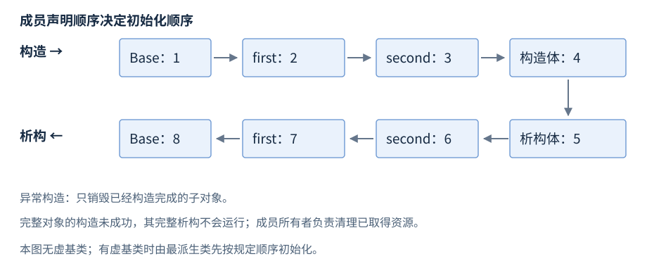

# 第7章 类与对象生命周期

**版本**：C++17。**先修**：R03、R05、R06。首次阅读成员初始化、特殊成员和组合；继承与多态用于有实际接口层次的场景。类应把数据与维持其不变量的操作放在一起，使构造成功就代表对象可用；资源释放交给成员所有者与析构，避免调用者额外记住收尾步骤。

## 1 class、struct 与不变量

class 和 struct 的主要语法区别是默认成员访问及默认继承访问分别为 private 与 public，其余能力相同。简单记录可公开数据；存在跨字段约束的对象应通过构造函数和成员操作维持约束。const 成员函数不能通过 this 修改普通非 mutable 成员，但成员指针指向的外部对象不因此变成 const，线程安全也没有随 const 自动获得。[类与成员](https://timsong-cpp.github.io/cppwp/n4659/class)、[成员函数](https://timsong-cpp.github.io/cppwp/n4659/class.mfct)。

构造函数初始化列表初始化基类与成员；函数体内 `member=...` 是在成员已经初始化后赋值。引用和 const 成员通常必须在初始化阶段绑定或设值。explicit 防止构造函数参与规定的隐式转换，适合不应自动把单个数字当作对象的接口；它不禁止显式直接构造。

委托构造函数先让同类的目标构造函数完成，然后再执行委托构造体；不能在同一个委托初始化列表中同时初始化其他成员。集中建立不变量可以减少不同构造入口的差异，但若委托体再做会失败的操作，仍要核查已取得资源的清理路径。不要允许对象先发布给外界、再完成它必须满足的状态。

## 2 构造与析构顺序

| 阶段 | 固定顺序 | 不能依赖什么 |
| --- | --- | --- |
| 虚基类 | 最派生类负责，按规定遍历顺序 | 中间类的虚基类初始化器不一定执行 |
| 直接基类 | 基类列表中的顺序 | 初始化列表的书写排列 |
| 非静态数据成员 | 类内声明顺序 | 先写在初始化列表就先初始化 |
| 构造函数体 | 基类和成员完成后 | 函数体赋值不能替代前述初始化 |
| 正常析构 | 先执行析构体，再逆序销毁成员及基类 | 不能在成员已销毁后继续借用它们 |

若 first 的初始化依赖 second，而 first 在类内声明得更早，改变初始化列表顺序没有用。调整声明顺序或消除初始化依赖，启用编译器重排警告。[基类与成员初始化](https://timsong-cpp.github.io/cppwp/n4659/class.base.init)、[析构](https://timsong-cpp.github.io/cppwp/n4659/class.dtor)。



图7-1：示例没有虚基类，按 Base、first、second、Derived 函数体构造，逆向清理。图表达调用顺序，不规定成员的物理地址或是否存在虚表。

非委托构造失败时，已经完成构造的子对象会被销毁，正在失败的完整对象的析构函数不会被调用。委托构造另有条件：目标构造函数已经完成后，委托构造函数体抛出异常，会调用该对象的析构函数。资源若仅以未管理裸指针存入尚未完成构造的对象，不能等它的完整析构函数来补救；应让资源从取得起就有 RAII 所有者。[构造失败与委托构造清理](https://timsong-cpp.github.io/cppwp/n4659/except.ctor)。

## 3 特殊成员与 Rule of Zero

默认构造、析构、拷贝构造、拷贝赋值、移动构造和移动赋值称为特殊成员。编译器按条件隐式声明或定义它们，但不承诺每个类都有可用的六个操作。例如 unique_ptr 成员使隐式拷贝不可用；引用成员使默认赋值存在限制。[拷贝与移动声明条件](https://timsong-cpp.github.io/cppwp/n4659/class.copy)。

`=default` 请求按成员和基类的规则生成实现，仍可能被定义为删除；`=delete` 显式禁止某操作，删除函数仍会参与重载决议。用户声明析构函数会抑制隐式移动的生成，即使写的是 `~T()=default`；不能看到右值调用成功便认定发生移动，它可能走拷贝。

默认生成的操作也会带上成员造成的失败与限制：复制一个 string 可能分配并抛异常，复制一个引用成员仍绑定原对象。继承层次里，派生类默认复制会复制各子对象，不等同于“克隆任意动态类型”。需要多态复制时应提供有明确返回所有权的 clone 协议，并在每个派生类实现，而非把 Base 按值返回。

Rule of Zero 的做法是让 string、vector、unique_ptr 等成员管理资源，不手写资源型特殊成员。必须自管资源时要整体审查复制、转移、赋值、自赋值和异常安全；不是机械写齐五个函数。自定义析构、拷贝与移动的关系见 R08，资源封装见 R09。

## 4 组合、继承与多态边界

组合表达“拥有一个”，继承主要表达可替代的接口关系。虚函数通过指针或引用对完整有效对象动态分派；override 要求确实覆盖基类虚函数，可发现签名或 const 限定写错。按值把派生对象传给 Base 会切片，只保留基类部分；其后无法恢复已丢弃的派生状态。[虚函数](https://timsong-cpp.github.io/cppwp/n4659/class.virtual)。

若要通过 Base* 删除动态派生对象，基类通常必须有可访问虚析构函数；否则这条 delete 路径行为未定义。仅供非拥有借用的接口可选择受保护非虚析构，但要确保不允许外部经基类删除。构造和析构期间的虚调用按当前构造或销毁的类处理，不调用尚未构造或已经销毁的更派生部分；别在基类构造中依赖派生类 override 来建立状态。[构造析构中的虚调用](https://timsong-cpp.github.io/cppwp/n4659/class.cdtor)、[delete](https://timsong-cpp.github.io/cppwp/n4659/expr.delete)。

纯虚函数用 =0 声明，使含有尚未覆盖纯虚函数的类成为抽象类；纯虚析构函数仍需要定义，因为派生销毁仍经过基类析构。构造或析构中调用纯虚函数还有专门的危险条件，应避免这种依赖。常见虚表和虚指针帮助理解实现成本，但标准并不规定必须采用这套布局，也不能把 memcpy 一个多态对象当作合法复制。

## 5 完整对象、子对象与常见多态实现

派生对象中包含基类子对象和非静态成员子对象。指向完整对象的指针与指向某个基类子对象的指针，可以代表不同位置；多重继承等布局下，正确的派生到基类转换可能需要调整地址。通过语言支持的转换获取指针，不把数值地址或 `reinterpret_cast` 当成通用继承转换。[对象与子对象](https://timsong-cpp.github.io/cppwp/n4659/intro.object)、[派生到基类转换](https://timsong-cpp.github.io/cppwp/n4659/conv.ptr)。


图7-2：左侧是语言允许依赖的分派；右侧仅是一种实现模型。虚指针的位置、虚表数目、条目内容及指针调整取决于具体 ABI，不是 C++17 标准规定。

常见实现让多态对象持有指向分派表的状态，再按虚调用找到相应实现；优化器在有充分信息时也可能直接调用或内联。不能因为源码用了 virtual，就承诺每次调用必有相同的间接跳转成本。对象中额外的分派状态也不能用“所有对象都多一个指针”概括，多重/虚继承与具体 ABI 会改变布局。

| 操作 | 语言层含义 | 应避免的推断 |
| --- | --- | --- |
| `Base& ref = derived` | 借用派生对象中的基类部分，保留规定的动态分派 | 引用取得整个对象的释放权 |
| `Base value = derived` | 新建一个 Base 值，派生部分不参与该对象的状态 | 新对象继续保留派生动态类型 |
| 虚析构 + 经 Base* 删除 | 按合法路径销毁完整派生对象 | 所有非拥有 Base* 都应调用 delete |
| 成员改变或增加虚函数 | 修改类型定义与可能的 ABI | private 成员不影响二进制布局 |

RTTI 是运行时类型信息；对多态对象的 `dynamic_cast` 可在允许的层次关系中检查转换，指针失败返回空，引用失败抛 `std::bad_cast`。RTTI、虚调用与所有权是三种不同责任。正确取得派生指针仍需原对象存活，跨库的 RTTI 与布局也需工具链契约。[dynamic_cast](https://timsong-cpp.github.io/cppwp/n4659/expr.dynamic.cast)、[typeid](https://timsong-cpp.github.io/cppwp/n4659/expr.typeid)。

## 6 切片、克隆与序列化的选择

如果容器要保存混合动态类型，`vector<Base>` 存的是 Base 值，会丢掉派生部分；`vector<unique_ptr<Base>>` 可以保存具有明确所有权的多态对象，仍需要适当虚析构。若需要独立复制动态类型，设计 `clone` 返回拥有者，并让各派生类负责复制自己的完整状态。另一种选择是类型集合固定时使用 R17 的 variant，避免开放继承层次。

普通复制处理类型的成员和基类，不是把虚指针或分配器状态按字节复制。用 memcpy 复制多态对象，无法替代合法构造和资源复制。向文件写入这种对象的内存，也不能在下一次进程中恢复虚表地址、指针目标和所有权。外部表示应写明类型标签、字段与版本，再通过受控工厂或解析结果构造对象。库边界见 R27，字节复制条件见 R02。

构造与析构阶段只能在相应规则下访问对象的已存在部分。回调中保存 this，必须把注册、注销、在途回调结束与对象销毁连接起来；“析构函数注销了”也不自动证明另一个线程正在执行的回调已经结束。R23 将通过任务关闭流程展示同一个生命周期要求。

## 7 工作例子：同时检查分派与清理

与 `examples/r07-classes-lifetime.cpp` 一致，按 R01 编译，核对分派与清理。固定事件缓冲避免在析构记录时动态分配，预期输出 `order=1,2,3,4,5,6,7,8`。

```cpp
#include <array>
#include <cstddef>
#include <iostream>

std::array<int, 8> events{};
std::size_t count = 0;
void record(int event) noexcept {
    if (count < events.size()) events[count] = event;
    ++count;
}

struct Part {
    int end;
    Part(int begin, int finish) : end(finish) { record(begin); }
    ~Part() { record(end); }
};

struct Base {
    Base() { record(1); }
    virtual ~Base() { record(8); }
    virtual int value() const { return 0; }
};

struct Derived : Base {
    Part first{2, 7};
    Part second{3, 6};
    Derived() { record(4); }
    ~Derived() override { record(5); }
    int value() const override { return 42; }
};

int main() {
    {
        Derived object;
        const Base& view = object;
        if (view.value() != 42) return 1;
    }
    const std::array<int, 8> expected{1, 2, 3, 4, 5, 6, 7, 8};
    if (count != expected.size() || events != expected) return 2;
    std::cout << "order=1,2,3,4,5,6,7,8\n";
}
```
