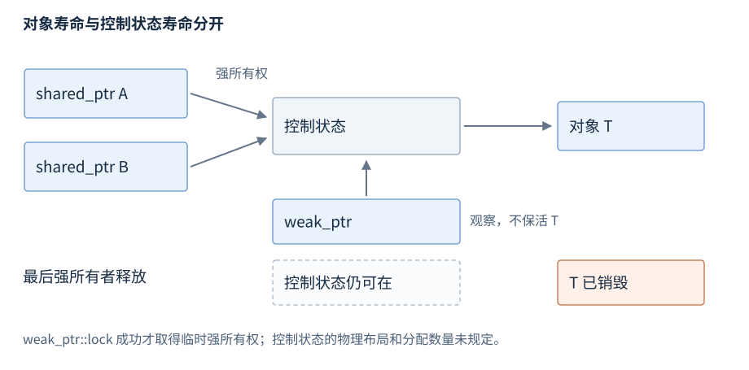

# 第9章 RAII 与内存管理库

**版本**：C++17，包括 polymorphic_allocator 与 pmr。**先修**：R05、R07、R08。首次阅读所有权与三个智能指针；分配器作为后查入口。RAII 把资源取得绑定到对象构造，把释放绑定到析构，因此正常退出与异常展开共用清理路径。资源可以是内存、锁、文件或系统句柄，不必只是一段堆内存。

## 1 分配、构造与释放分别负责什么

new 表达式通常先取得存储，再构造对象；构造失败时会按规则调用匹配的释放函数。delete 表达式先销毁对象再释放相应存储。分配函数 operator new 本身不等于构造；placement new 可在已有存储中构造，调用者仍须管理大小、对齐、寿命和释放，不能把 delete 用在任意预留缓冲上。[new](https://timsong-cpp.github.io/cppwp/n4659/expr.new)、[delete](https://timsong-cpp.github.io/cppwp/n4659/expr.delete)。

new[] 与 delete[] 配对，new 与 delete 配对，malloc/free 另有自己的接口；混用不是一种可移植的释放策略。优先容器、值对象与 make_unique；只有必须跨接口转移时才暴露裸拥有指针，并把释放方、失败责任和模块边界写清楚。析构清理通常必须不抛，失败的 flush/close 等业务结果应在显式操作中报告，见 R11。

取得资源之后到交给所有者之前的间隙，要避免可能抛出的操作；构造 RAII 拥有者后再做后续工作。release 适合把所有权交给明确接收它的接口，若调用失败且不接收资源，调用者仍须重新接管并清理。get 只取得借用指针，不能传给另一个将独立释放它的接口而继续保留原拥有者。

DLL、插件或不同运行库间传资源时，应按接口规定由对应模块或提供的删除器释放；C++ 标准不保证任意 ABI 与运行库兼容。内存池归还、对象析构和 RSS 降低也不是同一事件。系统内存与模块接口见 R24，异常清理见 R11。

## 2 三种智能指针的职责

| 类型 · `<memory>` | 所有权与常用接口 | 失败或失效边界 |
| --- | --- | --- |
| `unique_ptr<T,D>` | 独占，移动转交；get、reset、release | release 只交出指针，不释放；空指针不可解引用 |
| `shared_ptr<T>` | 共享，复制增加共同所有权；reset、use_count | 从同一裸指针独立构造两份会双重管理 |
| `weak_ptr<T>` | 观察共享所有权；lock、expired | 不保活对象；lock 失败返回空 shared_ptr |

unique_ptr 的删除器 D 是类型的一部分，适合使用正确平台释放函数包装资源；删除器所需的外部上下文也必须活到删除时。默认删除器实际删除 T 时要求 T 完整；使用前置声明的 PImpl 时，通常把析构定义放在 T 完整可见的 cpp 中。数组用 `unique_ptr<T[]>`，但长度仍需另行保存。[unique_ptr](https://timsong-cpp.github.io/cppwp/n4659/unique.ptr)。

shared_ptr 的共享所有权与存储指针并非同一概念，别名构造可共享整个所有者却指向子对象。判断相同 get() 不足以判断相同所有权，use_count 也不是可靠的并发互斥条件。[shared_ptr](https://timsong-cpp.github.io/cppwp/n4659/util.smartptr.shared)。

## 3 控制块、weak_ptr 与循环



图9-1：最后一个强所有者离开使对象被销毁；仍有 weak_ptr 时，维持观察所需的控制状态继续存在。计数与控制块位置是常见实现说明，标准不要求具体字段布局或恰好一次分配。

make_shared 常见实现把对象与控制状态一起分配，减少分配次数；因此对象虽已析构，尚存弱引用可能使整块分配保持较久。不要把“析构执行”当作“所有相关分配立即归还操作系统”。

weak_ptr::lock 将检查与取得临时强所有权作为一个操作；先 expired 再用某个裸指针，会留下竞态窗口。lock 得到非空 shared_ptr 后保活对象，不代表对象内部数据可无锁并发访问。[weak_ptr](https://timsong-cpp.github.io/cppwp/n4659/util.smartptr.weak)。

A、B 相互保存 shared_ptr 会形成强所有权环，外部所有者离开后两者仍不能释放。把反向关系改为 weak_ptr 或非拥有借用，同时定义失效处理。enable_shared_from_this 可从已经适当纳入共享所有权的对象取得共享句柄；不能用 shared_ptr(this) 新建独立控制关系，也不能在尚未建立该关系时假设 shared_from_this 可用。


图9-2：两条强边足以让外部所有者离开后仍保活两端。弱反向边切断强环，访问时必须处理 lock 失败；节点布局只是示意。

不同 shared_ptr 实例的控制状态更新可安全并发，不等于同一个 shared_ptr 变量可随意并发读写，更不等于所指 T 自动线程安全。同步与原子共享指针的版本边界见 R22。

use_count 适合诊断所有权关系，不能用一次读取证明下一时刻无人访问对象。即使数值为一，其他线程也可能通过 weak_ptr 取得新的强句柄；裸借用更不会体现在计数内。需要修改共享数据时，使用既定同步协议或不可变对象发布方式，而不是让引用计数充当读写锁。

## 4 allocator 与 pmr 的使用入口

allocator 把存储分配策略与容器元素生命周期管理分开，容器通过 allocator_traits 使用相应操作。自定义分配器需满足类型、相等性及传播条件，不能只实现一个 allocate 就推导所有移动和 swap 安全。

C++17 的 `std::pmr::vector<T>` 等别名使用 polymorphic_allocator，把分配请求转给 memory_resource。monotonic_buffer_resource 适合一批对象共同寿命：单次 deallocate 不回收个别块，整体 release 或资源销毁统一释放。它不会替使用者调用所有元素析构，故要先结束容器和对象寿命，再释放底层资源。[内存资源](https://timsong-cpp.github.io/cppwp/n4659/mem.res)、[polymorphic_allocator](https://timsong-cpp.github.io/cppwp/n4659/mem.poly.allocator.class)。

容器借用 resource，resource 通常必须比容器活得更久。局部缓冲用尽后资源可转向上游，并不自然保证“全程不分配”；需要硬上限时可配置 null_memory_resource 并处理 bad_alloc。未同步池不能直接多线程共享使用；同步池也不保护容器的业务访问。

## 5 工作例子与释放检查

本例与 `examples/r09-raii-memory.cpp` 一致，使用 R01 的命令。它明确检查 unique_ptr 转移、临时 lock 保活、最后一个强所有者释放及总存活数。

```cpp
#include <iostream>
#include <memory>
#include <utility>

struct Item {
    static int live;
    int value;
    explicit Item(int n) : value(n) { ++live; }
    ~Item() { --live; }
};
int Item::live = 0;

int main() {
    std::weak_ptr<Item> observer;
    {
        auto owner = std::make_unique<Item>(7);
        auto moved = std::move(owner);
        if (owner || moved->value != 7 || Item::live != 1) return 1;
        auto shared = std::make_shared<Item>(42);
        observer = shared;
        auto locked = observer.lock();
        if (!locked || locked->value != 42 || Item::live != 2) return 2;
        shared.reset();
        if (observer.expired()) return 3;
        locked.reset();
        if (!observer.expired() || Item::live != 1) return 4;
    }
    if (Item::live != 0 || observer.lock()) return 5;
    std::cout << "released=all weak=expired\n";
}
```

预期 `released=all weak=expired`，失败返回非零。这里 reset 释放一个共享句柄时，locked 仍使 Item 存活；最后 weak_ptr 不会阻止析构。错误做法是 `shared_ptr<Item>(shared.get())`：新建的所有权关系不知道原关系，两次释放可能发生，绝不运行这种程序来证明。
