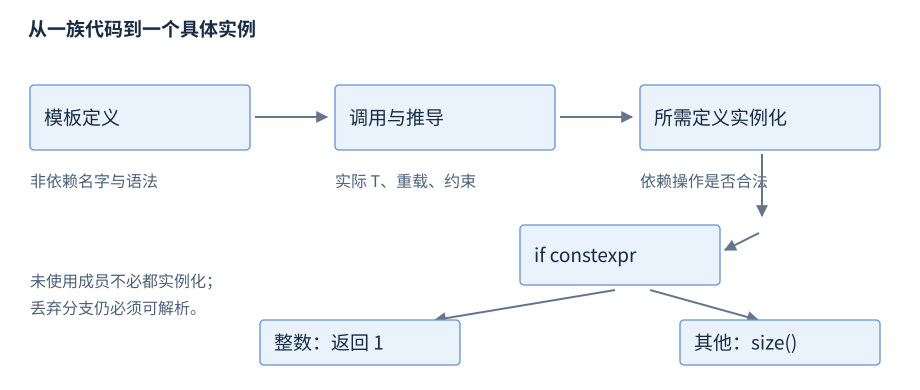

# 第10章 模板与编译期编程

**版本**：工作例子为 C++17；concepts 与 requires 摘录为 C++20。**先修**：R03、R06、R08。本章以接口后查为主，首次只读第1、3节。模板描述一族声明或定义，使用实参形成具体类型或函数；编译期选择可以避免不适用的分支，但不自动保证数值正确、对象长寿或线程安全。

## 1 推导、实例化与定义可见性

函数模板常从函数实参推导模板参数，也可显式指定；返回类型通常不能单独用于函数调用推导。类模板参数一般在使用时给定，C++17 提供类模板实参推导，但需要适用的推导规则或指引，不能据一个成员类型随意推导所有参数。[函数模板推导](https://timsong-cpp.github.io/cppwp/n4659/temp.deduct.call)、[类模板推导](https://timsong-cpp.github.io/cppwp/n4659/over.match.class.deduct)。

模板定义通常放在头文件，让隐式实例化点能看到实现；只把声明放头、定义放 cpp，调用另一个 cpp 中的新类型实例化时往往缺少可生成的定义。也可用显式实例化集中生成已知类型组合，并配合 extern template 控制重复工作，但需要覆盖实际使用的类型，不是通用隐藏实现方式。[实例化](https://timsong-cpp.github.io/cppwp/n4659/temp.inst)、[显式实例化](https://timsong-cpp.github.io/cppwp/n4659/temp.explicit)。



图10-1：先检查模板本身可确定的语法与非依赖名字，使用时再推导、匹配并实例化所需部分。图是诊断关系，不承诺编译器阶段的物理先后或每个成员都即时生成机器码。

实例化类模板不意味着所有成员函数体都立即实例化；未使用成员可能暂未暴露其中依赖具体 T 的错误。因此“某类型能声明一个 Box”不证明它能使用 Box 的所有操作。模板仍受 ODR 约束，相同头受不同宏影响产生不同定义也可能出问题，见 R01。

## 2 特化、依赖名与 ADL

| 机制 | 使用目的 | 常见误区 |
| --- | --- | --- |
| 全特化 | 为确切模板实参提供实现 | 特化应在触发相关隐式实例化前可见 |
| 类模板偏特化 | 为指针等一族形状选择实现 | 函数模板不能偏特化；通常用重载 |
| `typename T::value_type` | 告知依赖名字是类型 | 不把任意不存在的成员变成合法类型 |
| `obj.template f<U>()` | 让依赖成员调用按模板语法解析 | 不解决参数或访问权限错误 |
| ADL | 将实参相关类和命名空间加入函数查找 | 不等于在所有命名空间搜索同名函数 |

模板定义中不依赖参数的名字通常在定义处查找；依赖名字有相应实例化规则。需要读懂 typename 和 template 的解析用途，不能用它们掩盖错误的成员接口。[依赖名字](https://timsong-cpp.github.io/cppwp/n4659/temp.dep)、[typename](https://timsong-cpp.github.io/cppwp/n4659/temp.res)、[实参相关查找](https://timsong-cpp.github.io/cppwp/n4659/basic.lookup.argdep)。

C++17 常见的 SFINAE 表示模板实参替换在规定的直接上下文中失败时，候选退出而不立即形成整个程序的硬错误。它并不吞掉函数体中任意错误，也不吞掉为了替换而触发的另一实例化中的错误。enable_if 适合限制候选，但若错误已经在函数体内发生，给外层再加一个 catch 或返回码并不能解决编译失败。[推导失败条件](https://timsong-cpp.github.io/cppwp/n4659/temp.deduct)。

常见泛型 swap 写 `using std::swap; swap(a,b);`，让一般版本与 ADL 定制共同参加重载；直接限定 std::swap 会关闭相应的非限定查找路径。不要任意向 std 命名空间添加普通重载，标准允许的特化与定制点要逐个核对。

## 3 参数包、折叠表达式与 if constexpr

参数包 `T...` 表示零个或多个模板参数；包展开在指定模式中为各元素生成形式。C++17 折叠表达式将一个运算符反复用于包，但并非所有一元折叠都接受空包。例子用二元左折叠 `(0 + ... + values)` 给空包显式起点，返回零；起点类型还会影响通常算术转换，不能把它当任意高精度求和。[参数包](https://timsong-cpp.github.io/cppwp/n4659/temp.variadic)、[折叠表达式](https://timsong-cpp.github.io/cppwp/n4659/expr.prim.fold)。

type_traits（`<type_traits>`）提供 is_integral、is_same 等特征；它们描述类型属性，不检查运行时输入。if constexpr 的条件为常量表达式，在模板实例化中确定后会丢弃另一分支，使本例整数不必有 size()。丢弃分支仍要能解析，非依赖错误不能随意隐藏；模板外的分支也不能当“编译器不看”的文本注释。[constexpr if](https://timsong-cpp.github.io/cppwp/n4659/stmt.if)。

static_assert 可检查模板内部必须满足的条件，在本章基线中，针对不支持类型的断言宜让条件依赖模板参数，使它在相应实例化时产生有用诊断。约束检查入口资格，断言解释实现所依赖的不变量，二者角色不同。返回类型和参与计算的中间类型也应检查；编译期生成结果同样可能发生不允许的溢出或访问。

## 4 C++20 concepts 与 requires

以下是 C++20 接口摘录，需要 `<concepts>`；本章 C++17 核心程序不包含它。

```cpp
template<std::integral T>
T increment(T value) {
    return value + T{1};
}
```

std::integral 依据整数类型特征约束，bool 也满足它；且 signed 最大值加一的运行时边界仍未解决。概念约束描述可接受类型或表达式条件，不能替代输入验证。

requires 表达式可检查类型、操作表达式、嵌套条件；复合要求还能检查 noexcept 或结果类型约束。这些表达式用于判定可用性，不执行其中的运行时操作。约束影响候选可行性与偏序，改动一个概念可能改变重载选择；同样“看起来等价”的布尔式在约束归一化下也未必建立同样的包含关系。[C++20 约束](https://timsong-cpp.github.io/cppwp/n4861/temp.constr)、[requires 表达式](https://timsong-cpp.github.io/cppwp/n4861/expr.prim.req)。

## 5 工作例子与读报错方法

与 `examples/r10-templates-compile-time.cpp` 一致，预期 `sum=6 extent=1,3 box=9`，失败返回非零。按 R01 的 C++17 命令核验，不依赖编译器对 concepts 的支持。

```cpp
#include <cstddef>
#include <iostream>
#include <string>
#include <type_traits>

template<class... T>
auto sum(T... values) {
    return (0 + ... + values);
}

template<class T>
std::size_t extent(const T& value) {
    if constexpr (std::is_integral_v<T>) {
        return 1;
    } else {
        return value.size();
    }
}

template<class T>
struct Box {
    using value_type = T;
    T value;
};

template<class B>
typename B::value_type read(const B& box) {
    return box.value;
}

int main() {
    Box<int> box{9};
    if (sum() != 0 || sum(1, 2, 3) != 6 ||
        extent(42) != 1 || extent(std::string("abc")) != 3 ||
        read(box) != 9) {
        return 1;
    }
    std::cout << "sum=6 extent=1,3 box=9\n";
}
```

extent 对非整数类型要求存在可转换为 size_t 的 size()；传入 double 会在实际实例化时失败。这是接口的明确失败边界，不是所有类型都能用的万能函数。正式泛型接口可在 C++17 用检测惯用法或 SFINAE 表达约束，在 C++20 直接用概念描述要求。

读长诊断时先找自己的调用点与实际 T，再看首个未满足操作、转换或约束；一长串实例化栈是依赖路径，不是几十个独立故障。减少层层转发后获得一个最小实例，有助于区分类型契约失败与编译器版本限制。转发见 R08，算法要求见 R16。

头文件中的模板可能在很多单元重复解析和实例化；这影响构建时间和诊断噪声，不等于运行时一定更快。稳定的非泛型部分可移出模板，少数已知类型可考虑显式实例化，公共约束尽量给出可读的名字。优化编译成本不能以藏起定义、造成调用处缺少实例化条件为代价。
