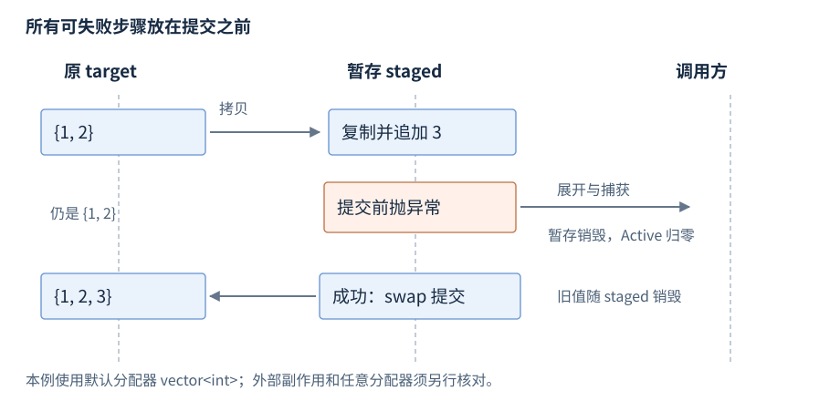

# 第11章 错误处理与异常安全

**版本**：C++17；C++23 expected 只作为 R17 的查阅入口。**先修**：R07至R09。首次阅读栈展开、析构边界与保证等级；错误表示用于跨库接口设计后查。错误处理首先规定失败时留下什么状态，再选择异常或返回结果；只有正常路径正确的函数，尚没有完成资源和失败契约。

## 1 throw、catch 与栈展开

throw 构造异常对象并寻找匹配处理器；寻找路径经过调用栈，退出相应作用域时销毁已完成构造的自动对象，称为栈展开。推荐按 const 引用捕获需要观察的异常，避免复制与切片；派生类处理器放在基类处理器前，否则先被基类接住。[处理器匹配](https://timsong-cpp.github.io/cppwp/n4659/except.handle)、[栈展开](https://timsong-cpp.github.io/cppwp/n4659/except.ctor)。

处理器中的 `throw;` 重新抛出当前异常；`throw e;` 会按 e 的静态类型重新构造异常对象，可能切片。catch(...) 适合边界处统一清理或记录后再抛，不能无条件吞掉未知失败然后继续使用破坏不变量的状态。异常对象不必派生 std::exception，使用该基类是一种实用接口约定。

处理器本身也可以失败，例如日志字符串构造分配失败。清理资源应在进入处理器前由 RAII 完成，报告路径则尽量保持简单并设定最后的终止或降级策略。不要在 catch 中继续调用刚失败且未给出有效状态保证的对象；能恢复意味着已经知道失败留下的状态和下一步合法操作。

构造失败仅清理已成功构造的基类和成员；失败对象的完整析构不会运行。函数抛异常以前已经执行的外部操作也不会自动撤销。栈展开负责对象清理，不提供数据库、文件或网络事务。

## 2 noexcept 与析构边界

noexcept 表达的是异常不逃出该函数的契约；noexcept(false) 允许传播。noexcept(expr) 是不求值的查询，反映表达式的潜在抛出属性，不证明所有输入都满足前置条件。C++17 起异常说明参与函数类型。[异常说明](https://timsong-cpp.github.io/cppwp/n4659/except.spec)。

异常逃出 noexcept 函数会调用 terminate；在调用前栈是否完全、部分或不展开有规定的实现空间，不能靠“最终会析构”做清理方案。析构函数通常按成员与基类的异常属性隐式不抛；即使某析构可抛，在已有异常展开时再让异常逃出也会终止程序。[异常终止](https://timsong-cpp.github.io/cppwp/n4659/except.terminate)。

资源析构应完成必要释放并保持不抛，需向调用者报告的持久化、刷新和提交失败用显式成员函数返回或抛出。析构可作最后的尽力清理，但不得把失败从正常业务流程中抹去。给移动加 noexcept 前，要核查每个成员操作及删除器的真实条件。

## 3 错误码、异常和结果对象怎样选

| 表示方式 | 合适边界 | 调用方责任 |
| --- | --- | --- |
| 异常 | 难以在每层处理、失败应越过多层调用 | 在能恢复或终结请求的边界捕获，保持不变量 |
| error_code / 状态码 | 平台接口、可预期失败、明确无异常接口 | 检查每次返回；不能只查看过期的旧错误 |
| `optional<T>` | 缺值本身足够描述结果 | 不能区分多个错误原因；取值前检查 |
| variant / 自定义结果 | 值或带信息错误 | 定义可达状态、处理所有分支 |
| C++23 `expected<T,E>` | 值或错误的直接建模 | 仍需说明 E 与失败后的状态，详见 R17 |

采用返回值不自然获得不抛保证：错误对象构造、字符串分配或记录日志仍可能抛。异常也不自然实现强保证。跨 C ABI 或明确禁止异常逃出的模块接口，应在边界捕获并转换为约定结果，转换自身的失败路径同样要设计。不要把 noexcept 与“永远成功”混为一谈。[标准库异常约定](https://timsong-cpp.github.io/cppwp/n4659/res.on.exception.handling)、[error_code](https://timsong-cpp.github.io/cppwp/n4659/syserr.errcode)。

错误类型最好同时表达调用者可以采取的行动：输入非法、资源暂时不足、对象状态不适用和内部不变量损坏，未必适合相同的重试策略。返回值中的“失败”不应与合法的零长度或空结果混用；错误码还需保留所属类别，不同库里相同整数可能具有不同含义。把预期缺值建模为 optional，另把真正失败建模为带原因结果，有助于避免吞错。

## 4 基本、强与不抛保证

| 保证 | 失败后的承诺 | 设计检查 |
| --- | --- | --- |
| 基本保证 | 不泄漏、相关不变量保持，状态可能变化 | 部分修改后仍可正常销毁和按契约使用 |
| 强保证 | 操作失败对约定状态无效果 | 所有可能失败步骤先完成，提交不可失败 |
| 不抛保证 | 操作不会向外传播异常 | 核对所有内部调用及失败处理 |
| 无明确保证 | 状态与责任无法可靠推导 | 先补契约，再让调用者依赖 |

保证范围必须写清，是某个对象的值、资源数量还是全部外部效果。强保证常采用“暂存修改，再不抛提交”；如果提交可能抛，或暂存复制共享可变外部资源，这个方案不必然成立。回滚也要能完成，不能在 catch 中安排一个可能再次失败的恢复操作后宣称强保证。

强保证并非所有操作的唯一合理选择。对大型批量任务，复制全部状态可能代价过高；接口可提供基本保证并返回完成进度，让调用者从明确边界续作。关键是部分状态仍满足不变量，不能把“出了错但继续运行”称为基本保证。若某操作承担释放锁等基础清理责任，则真实的不抛保证比保留旧业务值更重要。



图11-1：例子先在副本上追加，注入失败只销毁暂存副本；成功时用默认分配器 `vector<int>` 的 swap 提交。箭头表示状态与清理事件，不保证复杂类型或任意 allocator 的 swap 都适用。

## 5 工作例子：检查失败后的状态

与 `examples/r11-errors-exception-safety.cpp` 一致。默认分配器 `vector<int>` 的拷贝或追加失败均不修改 target；成功前仅修改 staged，最终 swap 是不抛提交。Active 记录作用域内资源活动，两个路径都检查其归零。[vector 的 swap](https://timsong-cpp.github.io/cppwp/n4659/vector.special)、[容器 swap 要求](https://timsong-cpp.github.io/cppwp/n4659/container.requirements.general)。

```cpp
#include <iostream>
#include <stdexcept>
#include <vector>

struct Active {
    int& count;
    explicit Active(int& value) : count(value) { ++count; }
    ~Active() { --count; }
};

void append_transaction(std::vector<int>& target, int value,
                        bool inject_failure, int& active) {
    Active guard(active);
    auto staged = target;
    staged.push_back(value);
    if (inject_failure) throw std::runtime_error("before commit");
    target.swap(staged);
}

int main() {
    std::vector<int> values{1, 2};
    int active = 0;
    bool caught = false;
    try {
        append_transaction(values, 3, true, active);
    } catch (const std::runtime_error&) {
        caught = true;
    } catch (...) {
        return 1;
    }
    if (!caught || values != std::vector<int>{1, 2} || active != 0) return 2;
    try {
        append_transaction(values, 3, false, active);
    } catch (...) {
        return 3;
    }
    if (values != std::vector<int>{1, 2, 3} || active != 0) return 4;
    std::cout << "rollback=ok commit=ok active=0\n";
}
```

预期 `rollback=ok commit=ok active=0`，失败非零。注入点在提交之前，实际分配失败也会沿同样的清理结构传播；本例不宣称已经模拟所有分配点。对自定义分配器，swap 的相等性与传播条件要重新核验；对向文件或服务写出的操作，复制一个 vector 无法回滚外部效果。

处理部分成功时，可把已完成数量、可重试标记或幂等键纳入结果协议；重试前确认前次副作用是否已生效。工作中先写失败契约，再检查可能抛出位置和清理所有者，最后用故障注入核对关键状态，而非只捕获异常看程序继续运行。容器异常例外见 R13，系统写入见 R25，服务重试见 R27。
