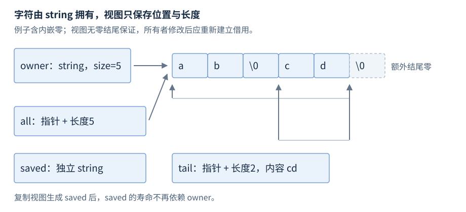

# 第12章 字符串与非拥有视图

字符串接口首先回答两个问题：谁保存字符，谁仅记录一段字符的位置。只有所有者持续存在、字符存储没有失效，借用者才能读写那段内容。

**版本**：`string` 是既有设施，`string_view` 从 C++17 起，`span` 从 C++20 起。**先修**：R05 的借用与 R09 的所有权。首次阅读第1至3条；处理二进制缓冲、C 接口或 Unicode 时再查第4至6条。

## 1 所有者、视图与传参选择

| 类型与头文件 | 拥有与元素 | 典型接口用途 |
| --- | --- | --- |
| `std::string` · `<string>` | 拥有连续 char 序列；末尾另有零字符 | 保存结果、修改文本、跨越调用保存数据 |
| `std::string_view` · `<string_view>`，17 | 借用连续 const char 序列；指针与长度 | 同步读取文本，不需复制 |
| `std::span<T, N>` · `<span>`，20 | 借用连续 T 序列；可固定或动态长度 | 数组、缓冲区的带长度参数 |
| `const char*` | 单独的指针没有长度与保活能力 | 按约定使用零结尾 C 字符串 |

传 `string_view` 的成本不随文本长度增长；它允许接收 string、字面量和指针长度对，不能因此推断输入编码或生存期。接收端若要保存到成员、任务队列或异步回调，应复制为 string，或建立可证明的外部保活协议。按值传视图只是复制描述符，不复制字符。



图12-1：字符位置与描述符的机制示意；string 的短字符串优化、分配位置和对象布局均未规定。两个视图共享字符，但各自保存长度。

## 2 string 的构造、长度与修改

常用形式省略分配器及 const 重载；`size_type` 是无符号长度类型。

| 常用形式 | 参数、返回与条件 |
| --- | --- |
| `string(p, n)` / `string(p)` | 前者复制 n 个字符，p 必须指向有效范围；后者扫描至零 |
| `size()` / `capacity()` / `reserve(n)` | 长度／存储容量／预留存储；reserve 不创建字符 |
| `resize(n, c)` | 缩短或补字符 c；单参数形式补零字符 |
| `char& operator[](i)` / `char& at(i)` | 正文字符要求 i < size；at 越界抛 out_of_range |
| `append(s)` / `insert(pos, s)` / `erase(pos, count)` | 修改自身并返回 string&；合法 pos 可等于 size |
| `substr(pos, count)` | 返回独立 string；pos > size 抛 out_of_range |
| `find(s, pos)` | 返回首次匹配下标，未找到返回 npos |

带长度构造能保存内嵌零，`string("ab\0cd", 5)` 长度为5；指针单参数形式只得到长度2。不要把 npos 转成有符号下标再运算，先与 npos 比较。substr 的 count 会裁到剩余长度，pos 的越界不会自动裁剪。字符串截取的拷贝工作与结果长度相关；中间修改还可能移动后缀，不能称为常数成本。查找的单字符与子串重载也不应混为一次 O(1) 访问。[N4659 字符串操作](https://timsong-cpp.github.io/cppwp/n4659/string.ops)。

size 不含结尾零。string 的 `operator[](size())` 可读取零字符；不要据此把一般下标边界写成 i ≤ size，尤其视图在此位置已越界。reserve 在 C++17 对小于现容量的请求可视为非约束缩容请求；C++20 改变了这个重载的规则，维护旧代码时须按版本判断。shrink_to_fit 是请求，可能重分配。[N4659 容量](https://timsong-cpp.github.io/cppwp/n4659/string.capacity)。

## 3 string_view 的截取与失效

`string_view(p, n)` 要求 [p, p+n) 有效，常数时间构造；`string_view(p)` 要求有效零结尾序列，需线性扫描。`substr(pos, count)` 常数时间返回另一视图；`remove_prefix(n)` 和 `remove_suffix(n)` 只调整本视图，要求 n ≤ size。`at(i)` 检查边界，而 `operator[](i)` 要求 i < size；front/back 要求非空。[N4659 视图构造和访问](https://timsong-cpp.github.io/cppwp/n4659/string.view)。

视图的 const 元素不禁止所有者修改字符。所有者用合法下标改写时，视图会观察到新值；并发改写仍须同步。所有者销毁会悬垂，重新分配会使旧视图失效。string 的非 const 修改接口有各自的失效规则，不能搬用 vector 的“未扩容就保留前缀”结论；借用跨过修改时，重新取得视图最便于审计。[N4659 string 借用失效](https://timsong-cpp.github.io/cppwp/n4659/string.require)。

典型错误是把 `owner.substr(...)` 的结果赋给 string_view：string 的 substr 创建临时所有者，完整表达式结束后借用悬垂。正确写法是在 owner 持续存在时先构造视图，再对视图 substr；若结果要独立保存，直接用 string。字面量对应静态存储，借用它则没有这一临时对象问题。

维护借用时可把规则写到函数契约中：“输入只在本次调用中读取，函数不保存视图”；若函数返回输入的子视图，还要写“返回值借用原输入”。这让调用方知道返回值不能比输入所有者活得更久。参数类型表达了访问能力，注释补足保存策略，两者共同构成接口。

不要通过移动 string 来证明旧视图安全：短文本可能位于 string 对象内部，移动不保证像独立堆对象那样转移同一地址。保存视图到临时结果、把局部 string 的视图作为返回值、在 lambda 中只复制视图而未保活所有者，都是同一类生命周期错误。修复时先确定谁应当拥有数据，再决定复制、共享所有权或缩短使用范围。

视图的比较按字符序列内容执行，不按 data 地址；两段相同内容可以位于不同缓冲。把 string_view 作为 map 或 unordered_map 的键尤其要小心：即使容器本身保留键对象，键所指字符仍可能被销毁或改写，随后比较与哈希结果就不再稳定。长期键通常应保存为 string。

## 4 span 的可写性与边界（C++20）

常用形式为 `span<T>{pointer, count}`、`span<T>{array}`，以及 `first(n)`、`last(n)`、`subspan(offset, count)`。固定 extent 要求输入长度匹配；动态 extent 不编码编译期长度。`size()` 返回元素数，`size_bytes()` 返回字节数；这些成员为常数时间。

`span<const T>` 禁止经该视图修改元素，`const span<T>` 只让描述符为 const，仍能修改 T。span 不扩容、不释放存储；下标在 C++20 没有 at，必须先确保 i < size，子范围也须落在原范围内。vector 扩容、元素删除和所有者销毁仍可能使 span 失效。span 不接受 list 或一般 deque，因为随机访问不代表连续。[N4861 span](https://timsong-cpp.github.io/cppwp/n4861/views.span)。

语法摘录（C++20，假设 `int a[3]{1,2,3};` 且已包含 `<span>`）：`std::span<int> s(a); s.subspan(1)[0] = 9;`，结果 a[1] 为9。此摘录未在当前 g++10.3 的标准库中运行。

## 5 C 字符串与 UTF-8

`c_str()` 提供零结尾读取；C++17 的非 const `data()` 可改写 [0,size) 字符，但不能把末尾零改成非零，也不能把 capacity 当可写长度。C API 若需要“缓冲地址＋容量＋实际写入数”，先 resize 建立字符，再检查返回长度并调整 string；若需要“只读零结尾”，传 c_str 并遵守它的借用有效期。[N4659 字符缓冲入口](https://timsong-cpp.github.io/cppwp/n4659/string.accessors)。

视图 data 不保证零结尾，截取中间一段尤其如此。需要 C 字符串时创建 `string(view)` 再传 c_str；内嵌零仍会使只按零扫描的接口提前停止。它是接口表示差异，不能通过多写一个零解决全部二进制数据问题。

UTF-8 以1至4个八位字节编码一个 Unicode 标量值，非法序列、过长编码与代理码点不能作为合法 UTF-8 接受。string 只存 char 序列，不验证编码；size 和 substr 按元素位置工作，不识别码点边界。一个显示字符还可能由多个码点组成，逐字节截断或逐码点计数均不等于显示宽度。[RFC 3629 UTF-8](https://www.rfc-editor.org/rfc/rfc3629)。C++20 的 `u8"…"` 元素类型为 char8_t，对应 u8string，不能无条件直接传给接受 const char* 的接口；文本转换、规范化和字素分割应由明确的 Unicode 库契约处理。[N4861 字符串字面量](https://timsong-cpp.github.io/cppwp/n4861/lex.string)。

## 6 完整例子与检索入口

以下 C++17 程序验证内嵌零、共享字符、边界异常及保存副本。修改所有者后不再读取旧视图。

```cpp
#include <iostream>
#include <stdexcept>
#include <string>
#include <string_view>

int main() {
    std::string owner("ab\0cd", 5);
    std::string_view all(owner.data(), owner.size());
    auto tail = all.substr(3);
    if (owner.size() != 5 || tail != "cd" || all[2] != '\0') return 1;
    owner[3] = 'X';
    if (tail != "Xd") return 2;
    std::string saved(tail);
    bool checked = false;
    try { (void)all.at(5); }
    catch (const std::out_of_range&) { checked = true; }
    if (!checked) return 3;
    owner.append(100, '!');
    // all and tail are not used after modifying owner.
    if (saved != "Xd") return 4;
    std::cout << "bytes=5 saved=Xd boundary=checked\n";
}
```

配套文件：[`r12-strings-views.cpp`](../examples/r12-strings-views.cpp)。预期输出：`bytes=5 saved=Xd boundary=checked`；任一语义检查失败返回非零。Windows g++10.3，使用 `-std=c++17 -Wall -Wextra -pedantic` 核验。

速查：保存数据查 string；只读借用查 string_view；连续缓冲查 span；零结尾查 c_str；截取查 substr；查找失败查 npos；编码长度查第5条。所有权延伸见 R09，连续容器失效见 R13，解析范围见 R18。
