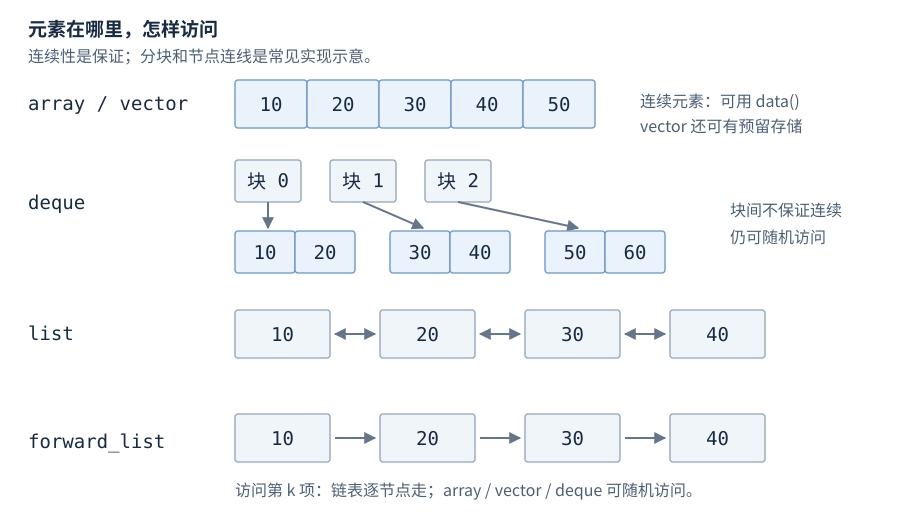
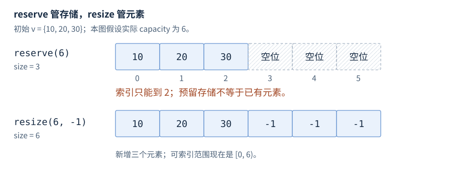
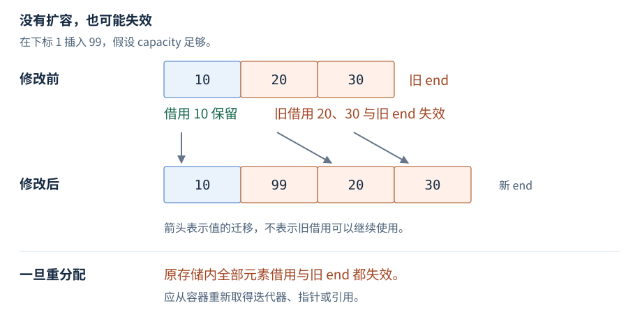
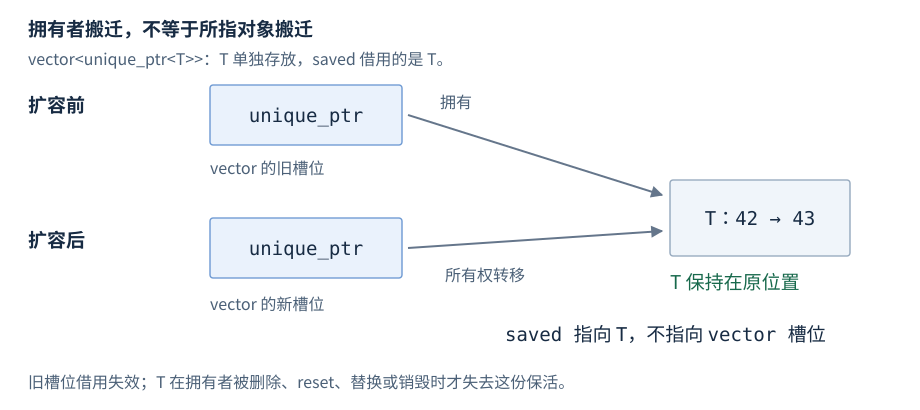

# 第13章 顺序容器

顺序容器把同一种类型的对象按位置组织起来。选型时先看数据如何访问、在哪里增删、是否要保存元素地址；不要只比较一个插入操作的复杂度。

**版本**：本章核心接口适用于 C++17；`std::erase_if` 单独标为 C++20。**先修**：引用、对象生命周期、拷贝与移动。文中的“失效”表示旧指针、引用或迭代器不再能按原来的元素借用使用，不是“它的数值变成了空”。

## 1 容器选型速查

| 类型与头文件 | 保证与访问方式 | 优先考虑的场景 | 主要限制 |
| --- | --- | --- | --- |
| `std::array<T, N>` · `<array>` | 固定 N，元素连续，支持下标 | 编译期固定长度的缓冲与小表 | 无扩容与插删；存放在栈还是堆由对象所在位置决定 |
| `std::vector<T>` · `<vector>` | 动态长度，除 bool 特化外元素连续 | 批处理、扫描、排序、尾部追加 | 扩容与中间修改会影响借用 |
| `std::deque<T>` · `<deque>` | 随机访问；不保证整体连续 | 频繁在两端增删，同时需要下标 | 不能当连续数组传给 C 接口 |
| `std::list<T>` · `<list>` | 双向迭代；插入不使既有元素借用失效 | 已持有位置、需要稳定节点或拼接 | 无下标；找位置仍要遍历 |
| `std::forward_list<T>` · `<forward_list>` | 单向迭代；围绕前驱修改 | 明确需要单向节点链的场景 | 无 size、back、push_back；需维护前驱 |

长度固定先看 `array`，普通动态序列先看 `vector`。再用两端操作、节点稳定性或拼接需求证明换容器的必要性。这是选型起点，不是性能结论。[顺序容器要求](https://timsong-cpp.github.io/cppwp/n4659/sequence.reqmts)、[array](https://timsong-cpp.github.io/cppwp/n4659/array)、[vector](https://timsong-cpp.github.io/cppwp/n4659/vector.overview)、[deque](https://timsong-cpp.github.io/cppwp/n4659/deque.overview)、[list](https://timsong-cpp.github.io/cppwp/n4659/list.overview)、[forward_list](https://timsong-cpp.github.io/cppwp/n4659/forwardlist.overview)。



图13-1：连续性是 array 和一般 vector 的保证；deque 的分块索引、list 的双向节点和 forward_list 的单向节点是常见实现示意，不规定块大小、节点布局或额外内存的数量。

### 操作成本

n 为当前元素数；以下插删只修改一个元素。链表 O(1) 以已经持有正确位置为前提，forward_list 还需要前驱。

| 操作 | array | vector | deque | list | forward_list |
| --- | --- | --- | --- | --- | --- |
| 找第 k 个元素 | O(1) | O(1) | O(1) | O(k)，遍历 | O(k)，遍历 |
| 尾部追加 | 不提供 | 摊还 O(1)，扩容单次 O(n) | O(1) | O(1) | 无 push_back |
| 头部插入 | 不提供 | O(n)，使用 insert | O(1) | O(1) | O(1) |
| 已知位置插入 | 不提供 | O(n)，受距尾部距离影响 | O(n)，受较近端距离影响 | O(1) | O(1)，已知前驱 |
| 已知位置删除 | 不提供 | O(n)，需处理后缀 | O(n)，受较近端距离影响 | O(1) | O(1)，已知前驱 |

“摊还”指一串操作的平均成本界限，不保证某一次追加耗时很短。标准复杂度按元素操作次数描述，不是微秒承诺；大对象的移动、分配器、缓存和负载还会影响实测时间。[容器复杂度定义](https://timsong-cpp.github.io/cppwp/n4659/container.requirements.general)、[vector 操作](https://timsong-cpp.github.io/cppwp/n4659/vector.modifiers)、[deque 操作](https://timsong-cpp.github.io/cppwp/n4659/deque.modifiers)、[list 插删](https://timsong-cpp.github.io/cppwp/n4659/list.modifiers)。

## 2 vector 的构造与核心接口

`vector<T, Allocator = std::allocator<T>>` 管理一段元素存储。以下针对一般 vector，不含 vector<bool> 特化。下列为常用接口形式，省略 const 重载；`size_type` 是容器的无符号长度类型，`iterator` 是它的迭代器类型。

| 接口 | 用途与返回值 | 必须记住的条件 |
| --- | --- | --- |
| `size_type size() const noexcept` | 已存在的元素数 | 不等于已分配容量 |
| `size_type capacity() const noexcept` | 不扩容能容纳的元素数 | size ≤ capacity；增长倍率未规定 |
| `T& operator[](size_type i)` | 访问第 i 个元素 | 必须 i < size；C++17/20 越界行为未定义，不保证抛异常 |
| `T& at(size_type i)` | 带边界检查的访问 | i ≥ size 抛 `std::out_of_range` |
| `T* data() noexcept` | 元素缓冲入口 | 只按 size 个元素使用；空容器不保证返回 nullptr |
| `void push_back(const T& x)` / `void push_back(T&& x)` | 尾部加入一个元素 | 复制插入／从右值插入，可能扩容；后者不保证调用移动构造 |
| `template<class... Args> T& emplace_back(Args&&... args)` | 用参数构造尾部元素 | C++17 起返回引用；不能免除旧元素迁移 |
| `iterator insert(const_iterator pos, const T& x)` | 在 pos 前插入，返回新元素位置 | pos 来自本容器，可为 end；元素类型需满足该重载要求 |
| `iterator erase(const_iterator pos)` | 删除元素，返回其后的新位置 | pos 必须可解引用，不能是 end |
| `void pop_back()` / `void clear() noexcept` | 删除最后一个／全部元素 | pop_back 要求非空；不释放 capacity 所代表的存储 |

其他 `insert` 重载可移动单元素、插入若干副本或外部区间。`erase(first, last)` 删除半开区间，空区间允许。对默认分配器而言，拷贝插入需要 T 可拷贝构造，vector 删除通常还需要 T 可移动赋值；完整的类型要求随重载变化。[vector 声明](https://timsong-cpp.github.io/cppwp/n4659/vector.overview)、[区间与类型要求](https://timsong-cpp.github.io/cppwp/n4659/sequence.reqmts)、[data](https://timsong-cpp.github.io/cppwp/n4659/vector.data)。

### 初始化不是可互换的写法

```cpp
std::vector<int> a(3, 7);   // 三个 7：{7, 7, 7}
std::vector<int> b{3, 7};   // 两个元素：{3, 7}
std::array<int, 3> c{};     // 三个 0
```

花括号优先涉及 initializer_list 重载；不能把 `()` 机械改为 `{}`。未初始化的局部 `std::array<int, 3> c;` 不会自动把整数清零。[vector 构造](https://timsong-cpp.github.io/cppwp/n4659/vector.cons)、[聚合与 array](https://timsong-cpp.github.io/cppwp/n4659/array)。

### reserve 与 resize

| 接口 | 改 size | 对容量与元素的影响 | 使用目的 |
| --- | --- | --- | --- |
| `void reserve(size_type n)` | 否 | n > capacity 才重分配；成功后 capacity ≥ n | 预估元素数，减少后续扩容 |
| `void resize(size_type n)` | 是 | 增大时补元素；缩小时销毁尾部元素，不缩 capacity | 让序列具有 n 个元素 |
| `void resize(size_type n, const T& value)` | 是 | 增大时补 value 的副本 | 同上，指定新增值 |
| `void shrink_to_fit()` | 否 | 请求缩容量，但实现可以不执行；可能重分配 | 确有需求时尝试释放多余存储 |

```cpp
std::vector<int> v{10, 20, 30};
v.reserve(6);              // size 仍为 3，capacity 至少为 6
v.push_back(40);           // 创建第 4 个元素
v.resize(6, -1);           // {10, 20, 30, 40, -1, -1}
v.resize(2);               // {10, 20}；capacity 不变
```

`reserve(6)` 后直接写 `v[5] = 42` 仍是越界：容量不是可索引的元素数。用于 C 接口填充的 vector 应先 `resize` 到允许写入的元素数，再传 `data()` 与相应长度。不要每次追加前都 `reserve(size()+1)`；这会干扰容器自身的增长策略，并可能造成累计线性搬迁的平方级成本。[容量与调整长度](https://timsong-cpp.github.io/cppwp/n4659/vector.capacity)。



图13-2：示意容量取 6。本图在 reserve 后直接 resize，未执行上例的 push_back(40)。reserve(6) 不保证实际容量恰为 6；新增的 -1 是已构造元素，虚线空位不可通过下标访问。

## 3 vector 的失效与异常边界

借用包括指针、引用、迭代器和基于它们构造的视图。表中“保留”只针对容器自身这次修改，不延长所有者生命周期，也不提供跨线程同步。

| 成功执行的操作 | 已有元素借用 | 旧 end |
| --- | --- | --- |
| reserve，不重分配 | 保留 | 保留 |
| reserve 或 shrink_to_fit，发生重分配 | 全部失效 | 失效 |
| 尾部 push_back/emplace_back，不重分配 | 保留 | 失效 |
| insert/emplace，不重分配 | 插入点之前保留；该点及之后失效 | 失效 |
| 任意插入导致重分配 | 全部失效 | 失效 |
| erase 或 pop_back | 删除点之前保留；该点及之后失效 | 失效 |
| resize 缩小 | 保留前缀；被销毁的尾部借用失效 | 失效 |
| resize 增大 | 按尾部插入及重分配规则处理 | 失效 |
| clear | 元素借用全部失效 | 失效 |

`end()` 是尾后位置，不是最后一个元素，不能解引用。表中 resize 增大／缩小指长度确有变化；相同长度不是一次插入或删除。无重分配的 shrink_to_fit 不使借用失效。赋值、assign、swap 与带自定义分配器的移动另有规则，不能套用“扩容才失效”。[vector 容量](https://timsong-cpp.github.io/cppwp/n4659/vector.capacity)、[vector 修改](https://timsong-cpp.github.io/cppwp/n4659/vector.modifiers)、[clear 与 assign](https://timsong-cpp.github.io/cppwp/n4659/sequence.reqmts)。



图13-3：即使容量够用，在中间插入也会使插入点及后缀的旧借用失效。不能根据某个地址仍能读到整数，就把它视为原逻辑元素的稳定句柄。

### 失败是否保留原序列

`reserve(n)` 的 n 超过 max_size 时抛 `length_error`；分配失败可以抛异常。reserve、shrink_to_fit 与单参数 resize 通常在异常时无效果，但**不可拷贝且移动构造可能抛异常的 T**存在例外，不能无条件称为强保证。vector 尾部单元素插入在 T 可拷贝插入或移动构造不抛时，异常无效果；中间插入及 erase 不应直接套用这个结论，erase 可以因 T 的赋值而抛异常。[容量异常条件](https://timsong-cpp.github.io/cppwp/n4659/vector.capacity)、[修改异常条件](https://timsong-cpp.github.io/cppwp/n4659/vector.modifiers)。

生产中不要把 `noexcept` 当优化开关随意加到可能失败的移动构造上。先建立真实的不抛保证；扩容对现有 T 使用拷贝还是移动，应按类型能力和实现分析，而不是假定 emplace_back 就一定没有搬迁。

## 4 删除元素时如何继续遍历

删除后使用返回的新位置，不对失效迭代器做递增。

```cpp
std::vector<int> v{1, 2, 3, 4, 5};
for (auto it = v.begin(); it != v.end(); ) {
    if (*it % 2 == 0) {
        it = v.erase(it);
    } else {
        ++it;
    }
}                         // {1, 3, 5}
```

这是迭代器使用正确的写法，但逐次删除可能反复搬移后缀，大量删除时最坏累计 O(n²)。批量过滤通常使用下面的 erase-remove 写法：

```cpp
v.erase(std::remove_if(v.begin(), v.end(),
                      [](int x) { return x % 2 == 0; }),
        v.end());         // C++17；还需要 <algorithm>
```

remove_if 把保留值压到前缀，返回“逻辑新尾部”，**并不缩小容器**；尾部元素仍存在，但其值不应当作过滤结果。erase 再销毁那个尾部。C++20 可写 `std::erase_if(v, pred)`，返回删除数量。过滤会改写元素，即使某些迭代器未失效，也不能假定它仍代表原来的业务对象。[remove 算法](https://timsong-cpp.github.io/cppwp/n4659/alg.remove)、[C++20 vector erasure](https://timsong-cpp.github.io/cppwp/n4861/vector.erasure)。

## 5 deque 的两端操作

`deque<T>` 提供 `push_front/back`、`emplace_front/back`、`pop_front/back`、`operator[]` 与 `at`，但没有 vector 的 `reserve`、`capacity`、`data`。随机访问不等于连续存储。

| 成功执行的操作 | 元素引用与指针 | 迭代器与旧 end |
| --- | --- | --- |
| 两端插入 | 既有元素的借用保留 | 全部失效，包括旧 end |
| 中间插入 | 全部失效 | 全部失效 |
| 只删除头部，且未删除最后元素 | 只失效被删元素 | 只失效被删元素的迭代器；旧 end 保留 |
| 删除尾部，含删除最后元素 | 只失效被删元素 | 被删元素的迭代器和旧 end 失效 |
| 删除内部区间，不涉及首尾 | 全部失效 | 全部失效，包括旧 end |

```cpp
std::deque<int> q{10, 20};
int& first = q.front();
q.push_back(30);
first = 11;               // 有效：引用保留，q 为 {11, 20, 30}
// 若之前保存了 q.begin()，这里不可再使用那个旧迭代器。
```

这是“引用保留、迭代器失效”可以同时成立的例子。标准不规定 deque 迭代器的内部格式；分块索引只是帮助理解的一种实现。表中删除情况是常用头、尾、内段形式，不替代任意混合范围的逐项判断。[deque 接口](https://timsong-cpp.github.io/cppwp/n4659/deque.overview)、[deque 修改与失效](https://timsong-cpp.github.io/cppwp/n4659/deque.modifiers)。

## 6 list 与 forward_list 的位置契约

### list 的稳定节点与 splice

list 插入不使既有迭代器和引用失效；删除只使被删除元素的借用失效。已持有位置时，单元素插删是 O(1)；`std::next(begin, k)` 找位置仍为 O(k)。list 用成员 `sort()` 排序，不符合 `std::sort` 的随机访问要求。[list 插删](https://timsong-cpp.github.io/cppwp/n4659/list.modifiers)、[list 专用操作](https://timsong-cpp.github.io/cppwp/n4659/list.ops)、[sort 的要求](https://timsong-cpp.github.io/cppwp/n4659/alg.sort)。

```cpp
std::list<int> ready{10, 20};
std::list<int> active;
auto item = ready.begin();
active.splice(active.end(), ready, item);
// ready = {20}，active = {10}；item 仍指向 10，但属于 active。
```

| splice 形式 | 转移内容 | 复杂度与限制 |
| --- | --- | --- |
| `splice(pos, other)` | 整个 other | O(1)；other 不可为自身 |
| `splice(pos, other, it)` | it 所指元素 | O(1)；it 必须可解引用 |
| `splice(pos, other, first, last)` | [first, last) | 同表 O(1)，跨表 O(k)；pos 不得位于转移区间 |

所有形式要求两表的分配器比较相等；否则行为未定义。转移不复制或移动 T 本身，元素地址保持。转移后的迭代器属于目标表，不能再交给源表 erase。[splice 条件](https://timsong-cpp.github.io/cppwp/n4659/list.ops)。

### forward_list 修改的是前驱之后

`before_begin()` 是首元素前的不可解引用位置，用它可以统一处理头部。单点 `erase_after(prev)` 要求 prev 的后继是元素；返回被删元素之后的位置。范围形式 `erase_after(first, last)` 删除 **(first, last)**，两个端点都不删除，不是普通算法的 [first, last)。

```cpp
std::forward_list<int> f{1, 2, 3, 4};
auto prev = f.before_begin();
auto cur = f.begin();
while (cur != f.end()) {
    if (*cur % 2 == 0) {
        cur = f.erase_after(prev);
    } else {
        prev = cur;
        ++cur;
    }
}                         // {1, 3}
```

insert_after、emplace_after、splice_after 的目标可以是 before_begin 或元素位置，不能是 end。插入保留既有借用；删除只使被删节点借用失效。

splice_after 的单节点形式转移源迭代器的后继，该后继必须可解引用；范围形式转移 (first, last)，目标不得位于转移范围。整表形式不可自拼接，且为 O(n)；单节点 O(1)，范围操作线性。各形式要求分配器相等，不要照搬 list 的参数含义与整表 O(1)。[forward_list 接口](https://timsong-cpp.github.io/cppwp/n4659/forwardlist.overview)、[修改](https://timsong-cpp.github.io/cppwp/n4659/forwardlist.modifiers)、[转移](https://timsong-cpp.github.io/cppwp/n4659/forwardlist.ops)。

## 7 工作中的选型与排障

### 需要稳定的是哪个对象

如果外部要保存 T 的地址，但容器需要动态追加，可以考虑 `vector<unique_ptr<T>>`。vector 存的是拥有者；扩容会使这些拥有者自身的借用失效，却不会因移动拥有者而搬迁其所指 T。

```cpp
std::vector<std::unique_ptr<int>> owners;
owners.push_back(std::make_unique<int>(42));
int* saved = owners.front().get();     // 借用所指对象，不是 &owners[0]
owners.reserve(owners.capacity() + 1); // 此处强制重分配
*saved = 43;                          // 有效：该对象仍被拥有
```



图13-4：稳定的是所指 T，不是 vector 的槽位、unique_ptr 的地址或迭代器。删除、reset、替换相应拥有者或销毁容器，仍会结束 T 的生命周期；多线程访问另需同步。[unique_ptr 移动](https://timsong-cpp.github.io/cppwp/n4659/unique.ptr.single.ctor)、[所有权替换](https://timsong-cpp.github.io/cppwp/n4659/unique.ptr.single.asgn)。

代价是额外分配和间接访问，T 也不再作为连续对象存储。它解决一个地址稳定性需求，不是 vector 的通用升级版。若需要长期业务句柄，还应区分“位置”“地址”“业务 ID”：下标可能因插删改变含义，裸指针不负责保活，ID 则需要自己的查找与有效性管理。

### 典型现象与检查点

| 现象或需求 | 优先检查 | 不要直接得出的结论 |
| --- | --- | --- |
| 追加之后旧指针崩溃 | 是否扩容；借用是否跨过所有者销毁 | 不能靠“预留过容量”证明永远安全 |
| 容量够用，中间插入仍读错对象 | 插入点及后缀的失效规则 | 没扩容不等于全部借用稳定 |
| deque 引用可用，迭代器却出错 | 是否在两端插入 | 随机访问容器不都遵循 vector 规则 |
| 删除后 RSS 没降 | capacity、分配器缓存、OS 回收策略 | clear 不等于把内存归还 OS |
| 链表插删快，但总体更慢 | 找位置、节点分配、访问局部性；按真实负载测量 | O(1) 不承诺比 O(n) 更低的实际延迟 |
| 需要严格有界的延迟或容量 | 分配、迁移、元素构造的最坏路径 | reserve 与摊还 O(1) 不是实时性保证 |

缓存与 RSS 的分析是工程检查方向，不是 C++ 标准保证。正确性先按规则核对，再测量性能。不要为避免一个失效问题，换容器后忽略新的同步、生命周期或内存成本。

## 8 符号索引与进一步查阅

| 想查的问题 | 本章入口 |
| --- | --- |
| 固定数组、连续存储、容器选型与复杂度 | 第1节 |
| at、data、push_back、emplace_back、初始化 | 第2节 |
| size、capacity、reserve、resize、shrink_to_fit | 第2节 |
| 引用、迭代器、end 失效与异常保证 | 第3节 |
| erase、remove_if、erase_if、遍历删除 | 第4节 |
| deque、push_front、pop_front | 第5节 |
| list、splice、forward_list、before_begin、erase_after | 第6节 |
| 稳定地址、unique_ptr、性能与资源排查 | 第7节 |

进一步查阅：[cppreference 顺序容器入口](https://en.cppreference.com/cpp/container)、[C++17 N4659 标准公开草案](https://www.open-std.org/jtc1/sc22/wg21/docs/papers/2017/n4659.pdf)、[C++20 N4861 标准公开草案](https://www.open-std.org/jtc1/sc22/wg21/docs/papers/2020/n4861.pdf)。

相邻主题：非拥有视图见 R12，迭代器与 ranges 见 R15，算法前提见 R16，RAII 与分配器见 R09，并发访问见 R20 至 R22。本章不覆盖所有重载、分配器传播及并发容器设计。
