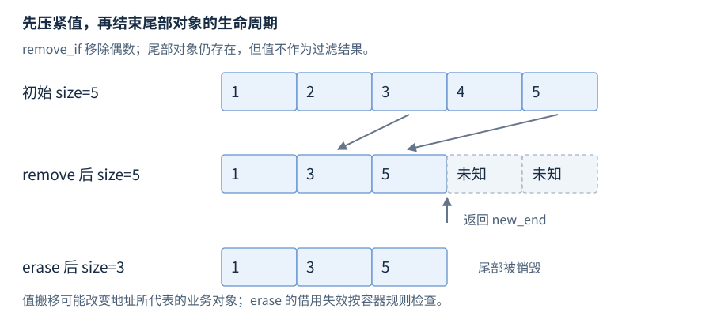
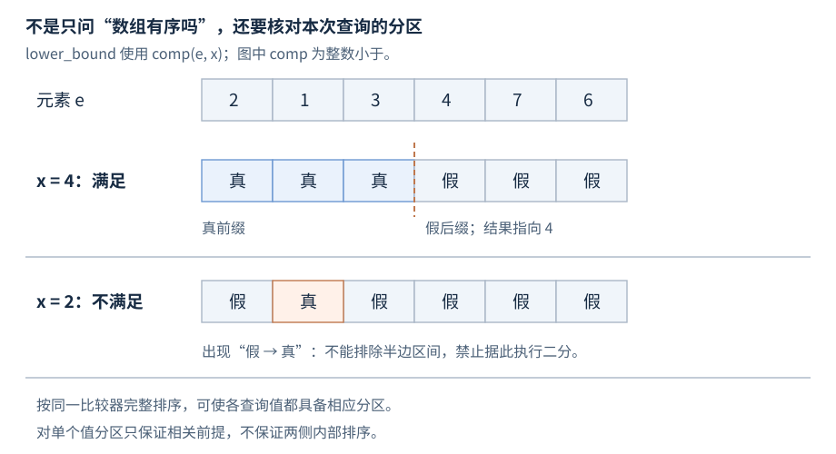

# 第16章 算法库

算法把“在哪个区间做什么”与容器分开。选对名称之后，还必须核对区间、迭代器能力、排序关系和目标存储；满足这些条件，复杂度与结果才有意义。

**版本**：核心算法与数值操作以 C++17 为准；`std::erase_if` 和 ranges 算法单独标 C++20。**先修**：R15 区间、R14 比较契约。首次读取第1至3条；数值累计和并行执行查第4至5条。

## 1 扫描、变换与目标区间

| 接口族与头文件 | 返回、工作与复杂度 |
| --- | --- |
| `find(first,last,value)`、`find_if(first,last,pred)` · `<algorithm>` | 首个命中位置或 last；最多 n 次比较／谓词调用 |
| `count`、`count_if` | 匹配数，difference_type；恰 n 次比较／谓词调用 |
| `all_of`、`any_of`、`none_of` | bool，最多 n 次谓词调用；空区间依次 true、false、true |
| `copy(first,last,out)` | 输出终点；复制 n 个值，目标必须足够且满足重叠条件 |
| `transform(first,last,out,op)` | 输出终点；n 次 op；不调整目标容器长度 |
| `for_each(first,last,f)` | 传统形式返回 f；可修改所指对象，不能以结构性修改破坏区间 |

二元 transform 还需要第二输入区间至少够长。reserve 只预留存储，不能让 out.begin() 后方自动出现元素；需 resize 或输出插入迭代器。输入区间与输出重叠只在具体算法允许的条件下使用，例如一元 transform 可以就地变换，但不能由此推断 copy 支持任意重叠。

用户谓词的代价也计入真实工作：每次扫描都做网络请求不会因算法“线性”而低延迟。传统非策略 for_each 对调用次序有保证；其他算法和带策略形式不能从顺序 for 循环类推。需要可预测的副作用顺序时，显式写顺序循环更便于审计。

## 2 remove、unique 与实际删除

`remove(first,last,value)` 和 `remove_if(first,last,pred)` 以保持相对顺序的方式压紧保留元素，返回逻辑新尾部；`unique` 只压紧相邻等价元素，不自动去掉全局重复。它们要求可写且满足相关移动赋值要求的迭代器，不能改 map 的 const 键。处理 n 元素的 remove 调用 n 次比较／谓词，unique 对非空区间作 n−1 次比较。[N4659 移除算法](https://timsong-cpp.github.io/cppwp/n4659/alg.remove)。



图16-1：机制示意；remove 后尾部仍是存在的对象，其值不作为结果解释，不保证图示数值。erase 才改变容器长度，并按容器规则使借用失效。

对 vector 使用 `v.erase(std::remove_if(v.begin(),v.end(),pred),v.end())`；C++20 的 `std::erase_if(v,pred)` 返回删除数。list 可以用成员 remove_if，避免移动值；C++17 该成员返回 void，C++20 改为返回删除数。想保留原数据则用 copy_if 到新的序列。

remove 未失效的迭代器可能已指向被改写的值；地址有效不代表业务身份不变。谓词需观察元素是否应移除，不应在内部删除容器元素或破坏算法正在遍历的结构。

## 3 排序、二分、集合与堆的前提

| 接口族 | 必需前提 | 复杂度与结果 |
| --- | --- | --- |
| `sort(first,last,comp)` | 随机访问，可重排，comp 严格弱序 | O(n log n) 比较；相等元素相对次序不保证 |
| `stable_sort` | 同上 | 相等元素稳定；额外内存足够时 O(n log n)，否则 O(n log² n) 比较 |
| `nth_element(first,nth,last,comp)` | 随机访问；nth 可为 last | 无策略形式平均线性；两侧不保证内部排序 |
| `partial_sort(first,middle,last,comp)` | 随机访问，可重排 | 排好最小的 k=middle−first 个值；约 n log k 次比较（k>1） |
| `partition` / `stable_partition` | 可写的相应迭代器 | 返回分界；后者保留组内相对次序 |
| `lower_bound` / `upper_bound` | 对对应谓词已经分区 | O(log n) 比较；非随机访问的递增可为 O(n) |
| `set_union/intersection/difference` | 两输入按同一关系排序；输出符合重叠限制 | 线性比较；重复值按各操作的计数语义处理 |
| `make_heap` / `push_heap` / `pop_heap` | 随机访问；push 前缀、pop 全区间已是堆 | 建堆 O(n)，调整 O(log n) 比较 |

严格弱序要求 comp(x,x) 为假、严格关系传递、等价关系也传递。`a <= b` 不是合格比较器；含 NaN 的普通浮点 < 在任意混合数据上不形成所需关系，应先排除 NaN 或设计明确全序策略。比较器不得在排序中因计数、时钟或外部状态改变同一对象的相对顺序。[N4659 排序要求](https://timsong-cpp.github.io/cppwp/n4659/alg.sorting)。

### 线性查找与二分查找：谁提供排除依据

find／find_if 不要求有序，因为它逐个检查候选，最坏要看完整段。二分在中点判断后排除一侧，因此必须已有分区依据，算法本身不会先替你分区。对查询值 x，各接口的最低条件如下；“分区”表示谓词真值是一个连续前缀，随后全为假。

| 二分接口 | 要预先满足的分区 | 返回值解释 |
| --- | --- | --- |
| lower_bound | `comp(e,x)` | 首个不小于 x 的位置，或 last |
| upper_bound | `!comp(x,e)` | 首个大于 x 的位置，或 last |
| equal_range／binary_search | 以上两个分区，并使 `comp(e,x)` 蕴含 `!comp(x,e)` | 等价半开区间／是否存在等价值 |

这里的“大小”都按 comp 解释。整段按同一严格弱序排序可以使这些条件对各查询值成立；最低前提却不要求每一侧内部有序。只满足 lower_bound 的单个分区，不足以自动调用 binary_search；返回位置也不能自动解释为命中。确认存在等价值时需检查 != last，并满足所用等价判断的前提。[N4659 二分接口的逐项前提](https://timsong-cpp.github.io/cppwp/n4659/alg.binary.search)。



图16-2：`{2,1,3,4,7,6}` 对 x=4 满足 lower_bound 的真前缀／假后缀，结果在 4；对 x=2 出现“假后再真”，不满足前提。图中无效一行只用来判断条件，不执行非法调用。

```cpp
std::vector<int> v{2, 1, 3, 4, 7, 6};
auto p = std::lower_bound(v.begin(), v.end(), 4); // 有效：p 指向下标 3 的 4
// lower_bound(..., 2) 不满足分区前提，不能以某次运行结果解释其语义。
```

二分最小化的是比较次数。随机访问序列可直接到中点；前向／双向迭代器需走到中点，导航总量可能 O(n)。有序 map 调用成员 lower_bound，才能使用树索引的对数查找；迭代器能力与访问成本见 R15 第2条。

### 堆算法：范围变换与容器长度各管一步

堆的父子关系与 priority_queue 接口见 R14 第5条。常见实现把新增末尾值沿祖先上移；pop 则将原根送到末尾，再把留在根的候选向下调整，使剩余前缀恢复堆。一次路径高度为 O(log n)，但 make_heap 不等于逐个 push_heap：常见自底向上建堆先处理靠近叶子的短子树，多数节点只需很短的下沉，累计为 O(n)。这些上移／下沉是机制说明；标准给出 make_heap 至多 3n 次比较、push_heap 至多 log₂n、pop_heap 至多 2log₂n 次比较。[N4659 堆定义与操作界](https://timsong-cpp.github.io/cppwp/n4659/alg.heap.operations)、[libstdc++ GCC 10.3 的自底向上建堆实现](https://gcc.gnu.org/onlinedocs/gcc-10.3.0/libstdc++/api/a00608_source.html)。

| 接口 | 调用前的有效范围 | 成功后 |
| --- | --- | --- |
| make_heap(first,last,comp) | 可重排的随机访问区间 | 全区间是堆；没有完整排序 |
| push_heap(first,last,comp) | 非空，`[first,last−1)` 已是堆；末尾是新值 | 全区间恢复堆；不创建元素 |
| pop_heap(first,last,comp) | 非空全区间已是堆 | 原顶在 last−1，`[first,last−1)` 是堆；不删除元素 |
| sort_heap(first,last,comp) | 全区间已是堆 | 按 comp 排序；通常不再维持原堆关系 |

push 前先 push_back，再把扩大的区间交给 push_heap；pop 后先读取 back，再 pop_back。比较器在建堆、调整和检查时必须保持一致。算法对容器的结构没有直接访问权，这与 remove／erase 的分工一致。标准的比较次数界没有承诺这些算法的额外空间上界；常见实现原地调整并使用少量临时状态，若有硬性空间预算应检查所用实现。

排序前后都应保持同一比较关系：按某个字段排完序，再按另一个字段调用二分没有所需分区前提。若比较器有相等组，二分命中应用双向比较确认等价，不能无条件用 operator== 替换容器或排序定义的等价关系。is_sorted 可检查当前区间是否有序，is_partitioned 可检查某一谓词的分区；这些检查自身通常线性，适合边界校验，不能假定是免费断言。

### 排序、选择与分区：只建立结果需要的顺序

| 需求 | 入口 | 结果与成本边界 |
| --- | --- | --- |
| 只找最小／最大位置 | min_element／max_element | 不重排；非空时 n−1 次比较 |
| 全部按序读取 | sort；等价项要稳定则 stable_sort | 全序列有序；O(n log n) 等相应比较界 |
| 只要某个排名位置 | nth_element | nth 处等于完全排序后的该排名值；无策略形式平均 O(n) |
| 最小 k 个且前缀要有序 | partial_sort | 前缀有序，后缀次序未规定；约 O(n log k)，k>1 |
| 只按谓词分两组 | partition | 真组在前；不建立组内顺序，也不求某个排名 |

nth_element 的两侧满足跨分界次序，却不保证各自排序，等价值也不保持身份顺序；取排名必须区分“位置上的值”和“同值对象是谁”。取最小 k 个后若还要顺序输出，可用 nth_element 划分后只 sort 前缀，但应处理 k=0、k=n 及 nth==last，避免解引用尾后位置。稳定排序解决等价元素的相对顺序，不会修正依赖易变外部字段的比较器。[N4659 排名选择](https://timsong-cpp.github.io/cppwp/n4659/alg.nth.element)、[partial_sort 与 stable_sort](https://timsong-cpp.github.io/cppwp/n4659/alg.sort)、[最小／最大值](https://timsong-cpp.github.io/cppwp/n4659/alg.min.max)。

这些复杂度通常计算比较／谓词调用，不能直接当作字节搬运量或内存预算。sort 的具体策略和工作空间不由其 O(n log n) 比较界推出；stable_sort 的比较界明确随额外内存是否足够变化。只需要某个排名时可避免全排序，减少建立无用顺序的工作，但这不承诺每份输入都更快。

集合算法中的“集合”是有序序列模型，允许重复元素。set_union 对重复值保留两输入计数的较大者，set_intersection 保留较小者；不能把它们直接当 unordered_set 的插入接口。输出与输入的重叠限制、剩余空间和排序关系须同时满足。

## 4 累计、归约与扫描

`<numeric>` 提供 `accumulate(first,last,init,op)`、`inner_product`、`iota`，C++17 增加 reduce、transform_reduce、exclusive_scan、inclusive_scan。accumulate 按顺序累计到 init 的类型；`0` 推导 int，`0LL` 才使累计类型为 long long，仍须证明结果不会超过范围。

reduce 即使未传执行策略也允许重新分组和排序归约。只有在操作满足所需结合／交换性质、结果类型闭合且不溢出时，才能期待与顺序累计一致；浮点加法不严格结合，结果可能变化。有符号整数溢出仍是未定义行为，算法名称不能提供自动大整数。scan 返回每个前缀结果，目标同样需具备足够空间。[N4659 数值操作](https://timsong-cpp.github.io/cppwp/n4659/numeric.ops)。

性能检查时记录累计类型、数据范围、误差容忍与重复计算，不只记录最终一个“看起来合理”的数字。若业务要求固定舍入顺序，优先采用明确顺序并为精度选择合适的累计方法。

## 5 执行策略的可移植边界（C++17）

`<execution>` 的 seq、par、par_unseq 只适用于提供策略重载的算法；C++20 再增加 unseq。策略重载常需至少前向迭代器。par 允许并行，par_unseq 还允许向量化及非顺序执行；实现允许回退为顺序，传 par 不承诺启动多个线程。

回调不能依赖调用次序或共享无保护状态。par_unseq 中使用阻塞同步等向量化不安全操作不符合要求；不能把给每个回调加互斥锁视为通用补救。对标准策略重载，用户调用抛异常通常导致 terminate；内部分配失败可抛 bad_alloc，不能期待外层 catch 能恢复所有回调异常。[N4659 策略与异常](https://timsong-cpp.github.io/cppwp/n4659/algorithms.parallel.exec)。

本章不运行并行示例；部分标准库实现需要额外后端，编译器支持 C++17 不代表并行后端可用。线程安全、退出与资源上限见 R20 至 R22。

## 6 完整例子与检索入口

```cpp
#include <algorithm>
#include <iostream>
#include <iterator>
#include <numeric>
#include <vector>

int main() {
    std::vector<int> v{5, 2, 4, 1, 3};
    auto new_end = std::remove_if(v.begin(), v.end(),
                                  [](int x) { return x % 2 == 0; });
    if (v.size() != 5 || std::distance(v.begin(), new_end) != 3) return 1;
    v.erase(new_end, v.end());
    std::sort(v.begin(), v.end());
    if (v != std::vector<int>{1, 3, 5}) return 2;
    auto pos = std::lower_bound(v.begin(), v.end(), 3);
    if (pos == v.end() || *pos != 3) return 3;
    const auto sum = std::accumulate(v.begin(), v.end(), 0LL);
    if (sum != 9) return 4;
    std::cout << "size=3 sorted=1,3,5 sum=9\n";
}
```

配套文件：[`r16-algorithms.cpp`](../examples/r16-algorithms.cpp)，C++17。预期输出 `size=3 sorted=1,3,5 sum=9`；检查失败非零。Windows g++10.3，以 `-std=c++17 -Wall -Wextra -pedantic` 核验。

第3条另有完整例子 [`r16-search-selection-heap.cpp`](../examples/r16-search-selection-heap.cpp)：检查未全排序但已按 x=4 分区的 lower_bound、nth_element 的排名与两侧条件，以及 pop_heap 不改变 size 的分工。C++17；Windows TDM-GCC 10.3，以 `-std=c++17 -Wall -Wextra -pedantic` 编译运行，预期 `bound=4 rank2=3 popped=9 size=4`，失败返回非零。只断言标准规定的结果，不断言 nth_element 的内部排列或堆的全部数组布局。

速查：复制容量查第1条；过滤长度查第2条；二分未命中查第3条；0 与 0LL 查第4条；par 异常查第5条。迭代器能力见 R15，容器删除失效见 R13。

### 查找、选择与堆的联合检查

下面是配套 [r16-search-selection-heap.cpp](../examples/r16-search-selection-heap.cpp) 的完整程序，C++17。检查的是查询分区、排名与跨分界关系、堆性质和实际容器长度，不检查实现未规定的内部排列。

```cpp
#include <algorithm>
#include <iostream>
#include <vector>

int main() {
    std::vector<int> partitioned{2, 1, 3, 4, 7, 6};
    if (!std::is_partitioned(partitioned.begin(), partitioned.end(),
                             [](int x) { return x < 4; })) return 1;
    auto bound = std::lower_bound(partitioned.begin(), partitioned.end(), 4);
    if (bound != partitioned.begin() + 3 || *bound != 4) return 2;

    std::vector<int> values{8, 2, 7, 1, 5, 3};
    auto nth = values.begin() + 2;
    std::nth_element(values.begin(), nth, values.end());
    if (*nth != 3) return 3;
    for (auto left = values.begin(); left != nth; ++left) {
        for (auto right = nth; right != values.end(); ++right) {
            if (*right < *left) return 4;
        }
    }

    std::vector<int> heap{4, 1, 7, 3};
    std::make_heap(heap.begin(), heap.end());
    if (!std::is_heap(heap.begin(), heap.end()) || heap.front() != 7) return 5;
    heap.push_back(9);
    std::push_heap(heap.begin(), heap.end());
    if (!std::is_heap(heap.begin(), heap.end()) || heap.front() != 9) return 6;
    std::pop_heap(heap.begin(), heap.end());
    if (heap.size() != 5 || heap.back() != 9 ||
        !std::is_heap(heap.begin(), heap.end() - 1)) return 7;
    const int popped = heap.back();
    heap.pop_back();
    if (heap.size() != 4 || heap.front() != 7) return 8;
    std::cout << "bound=" << *bound << " rank2=" << *nth
              << " popped=" << popped << " size=" << heap.size() << '\n';
}
```

预期 `bound=4 rank2=3 popped=9 size=4`；各语义检查失败返回非零。该例未对不满足前提的区间调用二分，也不把 nth_element 的两侧当成已排序。
