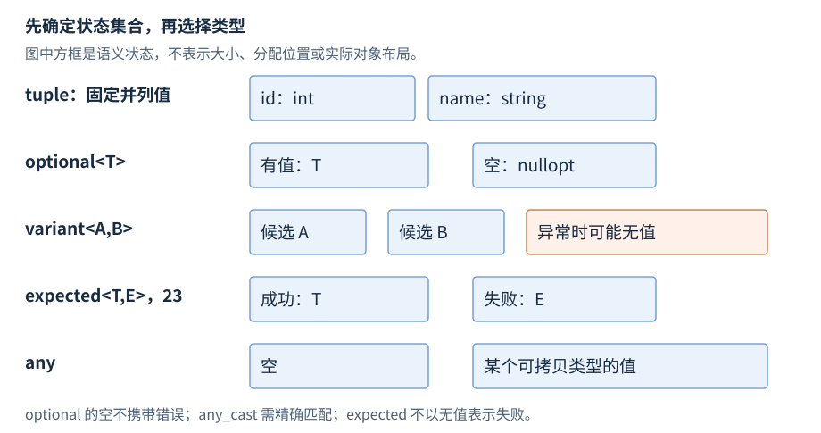

# 通用工具与结果类型

固定多值由 `pair`、`tuple` 表示；缺失、候选类型、开放类型与成功/失败分别由 `optional`、`variant`、`any`、`expected` 表示。本章展开这些类型的构造、访问和状态修改；结构化绑定的语言规则参见 [R06](R06-statements-functions.zh-CN.md)。

**基线**：操作短例使用 C++17；`pair` 从 C++98、`tuple` 从 C++11 引入；`optional`、`variant`、`any` 从 C++17 引入，`expected` 与这里列出的单子操作从 C++23 引入。**先修**：[初始化](R03-initialization-deduction.zh-CN.md)、[移动与转发](R08-copy-move.zh-CN.md)、[异常](R11-errors-exception-safety.zh-CN.md)。先读各类型的基础操作，再查异常状态与借用机制。

## std::pair

**基础操作**。二元组在 `<utility>` 中保存两个值，元素类型分别由 `T1`、`T2` 决定。关联容器的元素和“迭代器、是否插入”返回值常用它。公开声明摘要如下，省略构造约束、赋值和比较重载：

```cpp
namespace std {
    template<class T1, class T2> struct pair {
        T1 first;
        T2 second;
        // 构造、赋值、swap 等省略
    };
}
```

### pair 的构造与访问

默认构造对两个元素进行值初始化；整数元素成为零。双参数构造分别初始化 `first` 与 `second`；复制、移动的可用性取决于两种元素类型。以下摘录需要 `<utility>`、`<string>`：

```cpp
std::pair<int, std::string> empty;          // {0, ""}
std::pair<int, std::string> item{7, "Ada"};
item.first = 8;
const std::string& name = item.second;      // 借用第二个元素
const int id = std::get<0>(item);           // 得到 8
```

`std::get<0/1>(p)` 按编译期位置取元素；`std::get<T>(p)` 要求 `T` 在两个元素中恰好出现一次。返回引用的 const 性与值类别随 `p` 变化。`std::make_pair(a,b)` 通常衰减参数并保存值，`std::reference_wrapper` 参数会解包成引用。

### pair 的修改与分解

赋值逐元素赋值，`swap` 逐元素交换；二者都需要对应元素操作有效。下面摘录继续使用 `item`，需要 `<utility>`、`<string>`：

```cpp
std::pair<int, std::string> other{9, "Lin"};
item.swap(other);                           // item 成为 {9, "Lin"}
auto [copy_id, copy_name] = item;           // 隐藏对象复制 item
auto& [live_id, live_name] = item;          // 引用 item 的元素
live_id = 10;                              // item.first 成为 10
```

结构化绑定的 `auto` 形式先为分解创建隐藏对象，引用形式借用原对象；不能从绑定语法推断深拷贝或独立所有权。`piecewise_construct` 将两个元组的参数分别转发给两个元素构造函数，属于进阶构造入口，参见 [N4659 pair](https://timsong-cpp.github.io/cppwp/n4659/pairs)。

## std::tuple

**基础操作**。元组在 `<tuple>` 中保存编译期确定的若干元素，各元素可以具有不同类型；`Ts...` 是元素类型包，允许为空。公开声明摘要省略成员约束和重载：

```cpp
namespace std {
    template<class... Ts> class tuple;
    template<size_t I, class... Ts>
        tuple_element_t<I, tuple<Ts...>>& get(tuple<Ts...>&);
    template<class... Ts> tuple<Ts&...> tie(Ts&...) noexcept;
}
```

### tuple 的构造与元素访问

默认构造值初始化各元素；元素参数构造逐项初始化，参数个数必须与元素数相符。以下摘录需要 `<tuple>`、`<string>`：

```cpp
std::tuple<int, std::string, double> row{7, "Ada", 92.5};
std::get<0>(row) = 8;
const auto& name = std::get<std::string>(row);
const auto count = std::tuple_size<decltype(row)>::value; // 3
```

`get<I>` 的 `I` 必须是编译期常量且小于元素数；`get<T>` 要求类型恰好出现一次。不存在统一元素类型，所以没有运行期 `operator[]`。`tuple_element<I,Tuple>::type` 查询元素类型。直接声明 `tuple<int&>` 可以保存引用，但不会延长被引用整数的寿命。

### make_tuple、tie 与 apply

`make_tuple(args...)` 建立值元组，通常衰减参数并对 `reference_wrapper` 解包。`tie(vars...)` 建立引用元组，向它赋值会写回原变量；`ignore` 可忽略相应位置。`apply(f,t)` 从 C++17 起把元组元素展开成 `f` 的参数，并返回调用结果。以下摘录需要 `<tuple>`、`<string>`：

```cpp
int id = 0;
std::string name;
std::tie(id, name) = std::make_tuple(7, std::string("Ada"));
auto dimensions = std::make_tuple(3, 4);
int area = std::apply([](int w, int h) { return w * h; }, dimensions);
```

结果为 `id == 7`、`name == "Ada"`、`area == 12`。`apply` 要求展开后的调用有效，元素的引用类别取决于传入的元组。`tuple_cat` 连接多个元组，`make_from_tuple<T>` 用元组参数构造 `T`；这两项仅作相关接口索引。

**进阶后查**。`forward_as_tuple` 建立转发引用元组，不拥有实参；保存含临时值引用的结果可能在完整表达式结束后悬垂。接口中的字段有稳定业务名称时，命名 `struct` 能避免调用者依赖位置含义。[N4659 tuple](https://timsong-cpp.github.io/cppwp/n4659/tuple)。

## std::optional

**基础操作**。可选值（optional）在 `<optional>` 中保存零个或一个 `T`。空状态表示缺失；有值状态拥有并管理内部 `T` 的生命周期，`optional` 本身不会为这个 `T` 单独动态分配存储。`T` 必须是可析构的对象类型，不能是引用，也不能是 `nullopt_t` 或 `in_place_t`。

公开声明摘要仅列本节使用的接口，省略 const/右值、初始化列表、转换与比较重载；注释中的省略部分不是可编译的完整类定义：

```cpp
namespace std {
    template<class T> class optional {
    public:
        using value_type = T;
        optional() noexcept;
        optional(nullopt_t) noexcept;
        template<class... Args> explicit optional(in_place_t, Args&&...);
        bool has_value() const noexcept;
        explicit operator bool() const noexcept;
        T& operator*() &;
        T* operator->();
        T& value() &;
        template<class U> T value_or(U&&) const&;
        template<class... Args> T& emplace(Args&&...);
        void reset() noexcept;
        // 值构造、复制/移动、赋值、swap 等省略
    };
}
```

### optional 的构造与初始化

| 构造形式 | 示例 | 初始状态 |
| --- | --- | --- |
| 默认或 `nullopt` | `optional<int> a;` | 空，不构造 `int` |
| 用值构造 | `optional<int> b{0};` | 有值，内部整数是零 |
| 原位构造 | `optional<string> c{in_place, 3, 'x'};` | 有值，内部字符串是 `"xxx"` |
| 复制或移动包装 | `optional<string> d{c};` | 跟随源的有值状态，复制/移动内部值 |

以下摘录需要 `<optional>`、`<string>`，逐项演示不同构造用途：

```cpp
std::optional<int> missing;
std::optional<int> count{0};
std::optional<std::string> text{std::in_place, 3, 'x'};
auto answer = std::make_optional(42);       // optional<int>
std::optional<bool> enabled{false};         // 有值，值为 false
```

移动构造不会自动把源变成空；源仍有值时，其 `T` 处于该类型规定的移动后状态。`optional<bool>{false}` 的状态检查返回真，因为检查的是存在性。

### optional 的状态检查与访问

| 接口组 | 参数与结果 | 关键条件 |
| --- | --- | --- |
| `has_value()`、`bool(o)` | 无参数，返回是否有值 | 不判断内部值的真假 |
| `*o`、`o->member` | 得到内部值的引用/指针 | 要求有值；C++17 不检查空状态 |
| `o.value()` | 返回内部值的引用 | 空时抛 `bad_optional_access` |
| `o.value_or(fallback)` | 返回一个 `T` 值 | 备用值可转换为 `T`；复制或移动需有效 |

查询时先检查状态，再借用内部值。以下摘录需要 `<optional>`：

```cpp
std::optional<int> count{0};
if (count.has_value()) *count += 2;
const int& checked = count.value();        // 2
std::optional<int> missing;
int result = missing.value_or(10);         // 10
```

`value_or` 的 const 左值重载在有值时复制内部值，右值重载在有值时移动内部值；两者都返回新的 `T`，不能用于取得原值引用。备用表达式在进入调用前求值，即使已有值也会执行，因此它不适合作为昂贵的惰性工厂；可用 `if` 明确分支。[N4659 optional observers](https://timsong-cpp.github.io/cppwp/n4659/optional.observe)。

### optional 的赋值、重建与清空

给包装赋值可以改变值与存在状态；给已有值的包装赋普通 `T` 时，通常使用 `T` 的赋值操作。`emplace(args...)` 先销毁旧值，再用参数原位构造新值，返回新值的 `T&`；`reset()` 或赋 `nullopt` 销毁旧值并置空，已空时不产生值。

以下摘录需要 `<optional>`、`<string>`：

```cpp
std::optional<std::string> label;
label = std::string("old");                // 空 -> 有值
std::string& current = label.emplace(3, 'x'); // 销毁 old，构造 xxx
current += '!';                            // 内部值为 xxx!
label.reset();                             // 有值 -> 空
// current 的借用到此失效，不能继续访问
```

`emplace` 所需的构造函数必须可用；新值构造抛出异常时，旧值已经销毁，包装为空。这与对已有 `T` 赋值的异常保证不同。`swap` 交换两个包装的状态和值，要求 `T` 可移动构造和可交换；一空一有值时发生值的转移与销毁。[N4659 optional assignment](https://timsong-cpp.github.io/cppwp/n4659/optional.assign)、[reset](https://timsong-cpp.github.io/cppwp/n4659/optional.mod)。

### optional 的机制与扩展

**机制解释**。内部 `T` 的寿命受包装管理；清空、重建、包装销毁会结束相应寿命。`optional<string_view>` 虽然拥有视图对象，字符仍由其他对象拥有；借用规则见 [R12](R12-strings-views.zh-CN.md)。`optional<reference_wrapper<T>>` 可以显式表达可选借用，但包装不会延长 `T` 的寿命。

**C++23 扩展**。`and_then(f)` 仅在有值时调用返回 `optional` 的 `f`；`transform(f)` 将有值映射成另一个可选值；`or_else(f)` 在空时调用返回可选值的替代操作。C++17 不提供这些成员。本章以构造、观察、修改作为展开范围；转换构造与比较的全部约束按 [N4950 optional](https://timsong-cpp.github.io/cppwp/n4950/optional) 后查。

## std::variant

**基础操作**。变体在 `<variant>` 中拥有编译期确定的候选类型之一。`Ts...` 至少含一个满足相应析构条件的对象类型；不能以引用、数组或 `void` 为候选。公开声明摘要省略成员与约束：

```cpp
namespace std {
    template<class... Ts> class variant;
    struct monostate;
    template<class T, class... Ts> bool holds_alternative(const variant<Ts...>&) noexcept;
    template<size_t I, class... Ts>
        variant_alternative_t<I, variant<Ts...>>& get(variant<Ts...>&);
    template<size_t I, class... Ts>
        add_pointer_t<variant_alternative_t<I, variant<Ts...>>>
        get_if(variant<Ts...>*) noexcept;
}
```

### variant 的构造、检查与候选访问

默认构造第零个候选，因此它必须可默认构造；用值构造须能唯一选择有效候选。`in_place_type<T>` 按唯一类型构造，`in_place_index<I>` 按索引构造，适合类型重复的情况。以下摘录需要 `<variant>`、`<string>`：

```cpp
std::variant<int, std::string> value;       // 第 0 支，整数 0
std::variant<int, std::string> text{std::in_place_type<std::string>, "Ada"};
const auto branch = text.index();          // 1
if (auto p = std::get_if<std::string>(&text)) p->append("!");
const bool is_text = std::holds_alternative<std::string>(text); // true
```

`index()` 返回当前分支的 `size_t` 索引；异常无值时为 `variant_npos`。`get<I/T>` 返回候选引用，不匹配时抛 `bad_variant_access`；`get_if<I/T>(&v)` 返回候选指针，不匹配或输入空指针时返回 `nullptr`。按类型访问要求该类型恰好出现一次，索引必须合法。`variant<monostate,T...>` 用显式第零支表示普通业务空状态。

### variant 的修改与 visit

值赋值可更新或切换候选；`emplace<I/T>(args...)` 销毁旧候选，再构造指定候选，返回候选引用。`visit(visitor,v...)` 把各变体的活动值交给访问器，并返回调用结果。以下摘录需要 `<variant>`、`<string>`、`<type_traits>`：

```cpp
std::variant<int, std::string> value{7};
value.emplace<std::string>("Ada");
auto text = std::visit([](const auto& x) -> std::string {
    using T = std::decay_t<decltype(x)>;
    if constexpr (std::is_same_v<T, int>) return std::to_string(x);
    else return x;
}, value);                                // "Ada"
```

访问器须能接受全部候选组合；C++17 各组合的调用结果必须有相同类型和值类别。对单个变体，访问器调用分派具有常数时间要求；多个变体没有同样的一般复杂度承诺。

**进阶后查**。类型改变的赋值或 `emplace` 可能因异常留下 `valueless_by_exception()` 状态。此时 `get`、`visit` 抛 `bad_variant_access`，`get_if` 返回空指针；它不是默认候选，也不是业务空状态。候选重建会结束旧值寿命，旧借用失效。[N4659 variant](https://timsong-cpp.github.io/cppwp/n4659/variant)。

## std::any

**基础操作**。`any` 在 `<any>` 中保存空状态或一个满足可复制构造要求的类型。类型擦除（type erasure）隐藏具体类型，读取时再按类型检查。它没有模板参数；纯移动类型不能作为内部值。公开声明摘要省略模板构造、赋值、const 和初始化列表重载：

```cpp
namespace std {
    class any {
    public:
        any() noexcept;
        bool has_value() const noexcept;
        const type_info& type() const noexcept;
        template<class T, class... Args> T& emplace(Args&&...);
        void reset() noexcept;
        void swap(any&) noexcept;
    };
}
```

### any 的构造、检查与读取

默认构造为空；值构造保存衰减后的实参类型；`in_place_type<T>` 原位构造内部 `T`。`type()` 有值时返回内部类型的 `type_info`，空时返回 `typeid(void)`。以下摘录需要 `<any>`、`<string>`：

```cpp
std::any empty;
std::any number = 7;
std::any text{std::in_place_type<std::string>, 3, 'x'};
if (auto p = std::any_cast<int>(&number)) *p += 1;
const int value = std::any_cast<int>(number); // 8
```

指针形式 `any_cast<T>(&a)` 在类型不匹配或输入空指针时返回 `nullptr`；值/引用形式在不匹配时抛 `bad_any_cast`。检查是类型匹配，不做数值转换；内部是 `int` 时，`any_cast<double>` 失败。值形式复制/移动出一个值，引用形式如 `any_cast<int&>(a)` 借用内部对象。

### any 的修改与存储机制

值赋值可以替换类型；`emplace<T>(args...)` 销毁旧值并构造新值，返回新值引用；构造抛异常时变空。`reset()` 清空，`swap` 交换两个包装。以下摘录需要 `<any>`、`<string>`：

```cpp
std::any box = 7;
auto& label = box.emplace<std::string>("Ada");
label += '!';                              // 内部字符串为 Ada!
box.reset();                               // label 的借用失效
```

**机制解释**。小对象是否在包装内部存储属于实现选择，不能承诺所有 `any` 都无分配。类型开放并不附带业务相等或序列化协议；已知有限候选可使用 `variant`，需要行为多态时可使用接口类。[N4659 any](https://timsong-cpp.github.io/cppwp/n4659/any)。

## std::expected

**C++23，基础操作**。`expected<T,E>` 在 `<expected>` 中保存成功值 `T` 或错误值 `E`，以有名称的状态表达成功/失败；`T` 可以是 `void`，`E` 是符合要求的非数组对象类型。`T` 不能是引用；`E` 不能是 cv 限定类型、`unexpected` 或标记类型。这里展开值分支版本，全部类型约束后查标准。公开声明摘要省略约束与重载：

```cpp
namespace std {
    template<class T, class E> class expected;
    template<class E> class unexpected;
    template<class E> class bad_expected_access;
}
```

### expected 的构造与分支访问

默认构造值初始化成功值，要求 `T` 可默认构造；值构造为成功，`unexpected<E>` 或 `unexpect` 原位构造为失败。`expected<void,E>{}` 表示不带数据的成功。以下摘录需要 `<expected>`、`<string>`，要求支持 C++23 的标准库：

```cpp
std::expected<int, std::string> ok{42};
std::expected<int, std::string> failed = std::unexpected(std::string("invalid"));
if (ok.has_value()) *ok += 1;               // 成功值为 43
if (!failed) {
    const std::string& message = failed.error(); // "invalid"
}
```

`has_value()`、`bool(r)` 判断成功；`*r`、`r->member` 要求成功，`error()` 要求失败。`value()` 成功时返回值引用，失败时抛携带错误的 `bad_expected_access<E>`，其可用性还受错误类型构造约束。`value_or(fallback)` 返回成功值的复制/移动或转换后的备用值；它不返回借用，也不会惰性求值备用表达式。

### expected 的修改与结果组合

赋值可以保持或改变成功/失败分支，受 `T`、`E` 的构造、赋值和异常约束限制；它没有 `reset()` 或“第三个空状态”。`emplace(args...)` 构造成功值并返回 `T&`，值分支版本要求相应 `T` 构造不抛异常，因此不能把任意 `optional::emplace` 写法照搬过来。

单子操作（monadic operations）按状态调用下一步：`and_then` 要求函数返回错误类型与原结果相同的 `expected`；`transform` 映射成功值；`or_else` 处理失败并返回成功类型与原结果相同的 `expected`；`transform_error` 映射错误值。以下摘录需要 `<expected>`、`<string>`，沿用 `ok`：

```cpp
auto doubled = ok.transform([](int x) { return x * 2; });
auto checked = doubled.and_then([](int x) -> std::expected<int, std::string> {
    if (x > 100) return std::unexpected(std::string("too large"));
    return x;
});                                        // 成功值为 86
```

**机制解释**。`expected` 总在成功或失败分支中，操作约束使其没有 `variant` 式异常无值状态。包装仍不决定重试或记录策略；`E` 应承载调用方需要的错误分类。移动出成功值后，分支仍可能为成功，内部值按 `T` 的移动后规则解释。[N4950 expected](https://timsong-cpp.github.io/cppwp/n4950/expected)。C++23 接口摘录需要提供该版本设施的标准库。

## 结果状态与借用

**机制解释**。包装拥有内部对象，不意味着内部对象拥有所有来源。`tuple<int&>` 借用整数，`optional<string_view>` 借用字符，`any` 中的裸指针也不保活所指对象。复制这些包装按内部类型的复制语义处理，不自动深拷贝来源；生命周期与资源所有权分别见 [R05](R05-pointers-references.zh-CN.md)、[R09](R09-raii-memory.zh-CN.md)。



图：状态语义示意，不描绘内存布局。`optional` 的空状态是普通缺失，`variant` 的异常无值状态由失败的状态切换产生；`expected` 的失败支保存业务错误。

查找无记录时可返回 `optional<Record>`，需要错误载荷时可返回 `expected<Record,ParseError>`。`variant<Record,ParseError>` 也能容纳这两个类型，但其分支名称和访问接口不自动赋予成功/失败契约。

## 比较与哈希

**进阶后查**。`pair`、`tuple` 的比较按元素顺序进行；`optional` 比较区分空/有值并比较内部值；`variant` 比较先看候选索引再看同类型值。元素比较必须有效。`any` 没有一般相等接口，`expected` 提供相等比较但不提供一般排序关系。

不能假定这些类型都有通用 `std::hash`：C++17 的 `pair`、`tuple` 没有标准通用哈希特化；`optional`、`variant` 的哈希可用性受内部类型限制。比较/等价与哈希的契约见 [R14](R14-associative-adaptors.zh-CN.md)，定制约束见 [N4659 hash requirements](https://timsong-cpp.github.io/cppwp/n4659/unord.hash)。

[配套 C++17 程序](../examples/r17-utility-results.cpp) 组合元组分解、可选值、访问器和类型擦除；分类与进一步重载可查 [cppreference utility library](https://en.cppreference.com/w/cpp/utility.html)。
