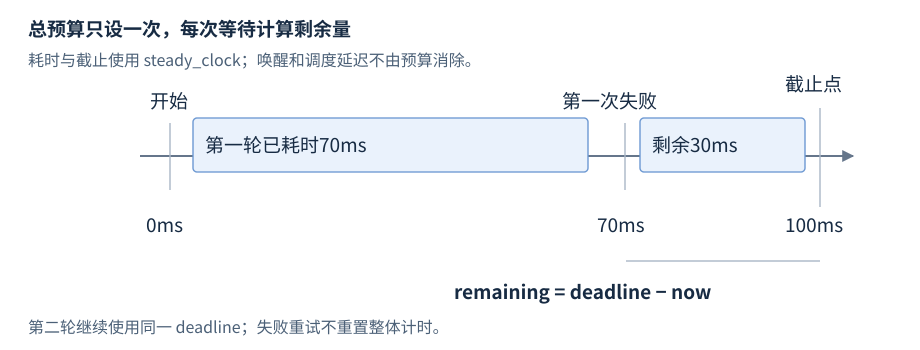

# 第19章 时间与文件接口

时间接口负责计量与表达截止点，文件接口负责访问路径和报告读写状态。它们提供可移植基础，但系统调度、崩溃持久化与文件并发更新需要额外的平台契约。

**版本**：以 C++17 chrono、iostream、filesystem 为基线；日历与时区扩展属 C++20。**先修**：R11 错误处理、R09 资源释放。首次查第1至3条；文件更新策略再查第4至5条。

## 1 duration、time_point 与时钟

`<chrono>` 的 `duration<Rep,Period>` 表示次数及单位，`time_point<Clock,Duration>` 表示某时钟的一个点。两点相减得到 duration；点加 duration 得到新点。不同 Clock 的 time_point 不能直接相减，类型隔离防止把不兼容纪元混用。

| 常用类型／接口 | 用途与边界 |
| --- | --- |
| `milliseconds`、`seconds` 等 duration | 强类型单位；count() 取表示值，丢失单位信息 |
| `duration_cast<D>(d)` | 显式转换；整数目标会向零截断，要检查表示范围 |
| `floor<D>`、`ceil<D>`、`round<D>`，17 | 向下／向上／最近舍入；round 中点取偶数 |
| `Clock::now()` | 该时钟当前 time_point；取时精度、成本由实现决定 |
| `system_clock` | 现实世界时间；可调整，不保证单调 |
| `steady_clock` | 保证单调，适合耗时与截止；无通用日历纪元 |
| `high_resolution_clock` | tick 周期较短的时钟；可以是前两者别名 |

period 是刻度单位，不保证实际每个 tick 都可准确观测；high_resolution 不保证单调，也不承诺所有平台最佳测量。对时间戳用 system_clock，对耗时用 steady_clock，并分别标出单位与来源。[N4659 时钟](https://timsong-cpp.github.io/cppwp/n4659/time.clock)。

duration_cast 不能避免底层 Rep 的溢出。浮点 duration 转整数若输入 NaN、无穷或超出范围，会越出合法转换边界；来自外部的超时参数先验证再转换。输出 count 时带上单位，避免毫秒与秒在日志中混淆。[N4659 duration](https://timsong-cpp.github.io/cppwp/n4659/time.duration)。

## 2 总预算与绝对截止

一次操作的预算若为100ms，先取 `deadline = steady_clock::now() + 100ms`，每次重试从同一 deadline 计算剩余时间。每轮都从 now 重新加100ms 会把总体等待无限延长。若 now ≥ deadline，就停止新的工作；否则剩余量为 deadline−now，并按底层等待接口需要的粒度转换。



图19-1：假设总预算100ms，第一次失败发生在70ms，下一次最多只剩30ms。时间线是预算机制示意，不保证等待函数精确在截止点返回；调度、唤醒与取消仍有延迟。

`sleep_for`、`sleep_until` 在 `<thread>`，不是精密定时器。条件变量的 wait_until 还须循环检查谓词并处理虚假唤醒；超时不证明任务已经停止，更不代表远端取消成功。把等待、取消请求与确认退出区分开，见 R20、R21、R27。

记录日志可同时保留现实时间戳和稳态测得的耗时。系统时间回拨会让两个 system_clock 时间戳相减失去耗时含义；steady_clock 的原始 count 也不适合持久存储为跨进程通用时间戳。跨机器截止通常需要协议约定、时钟误差预算或传相对预算，而不是直接传本机 steady_clock 的纪元数。

## 3 stream 的状态、文本与二进制

`<iostream>`、`<fstream>`、`<sstream>` 提供标准流。输入循环使用 `while (stream >> value)`，让本次操作的结果决定是否使用 value；`while (!eof())` 在下一次读取失败前仍可能进入循环。

| 状态与接口 | 含义 |
| --- | --- |
| goodbit／good() | 没有错误位；good() 要求状态完全为零 |
| eofbit／eof() | 某次输入发现尾端；不是读取前预告 |
| failbit／fail() | 提取或格式失败；fail() 也检查 badbit |
| badbit／bad() | 底层输入输出错误等更严重失败 |
| `operator bool()` | !fail()；仅 eofbit 不必为 false |
| `clear()` | 重置错误位；不消耗导致失败的字符 |
| `exceptions(mask)` | 命中掩码时抛 ios_base::failure；设置时也可能立即抛 |

读到最后一个合法数时可能同时设 eofbit 而仍成功；下一次提取才失败，不能把所有 eof 当损坏。恢复格式错误时先 clear，再按策略消耗或处理问题字符；只 clear 后重新提取同类型会再次失败。将正常尾端、非法字段与设备错误分别报告。[N4659 流状态](https://timsong-cpp.github.io/cppwp/n4659/iostate.flags)。

`read(char*,n)` 读取指定数量字节，`gcount()` 返回实际提取数量；不足 n 时也需正确处理已得到的前缀。`write(p,n)` 写原始字符，失败看流状态。格式化 >> 会按 locale 分析文本并跳过相应空白，getline 读一行且移除分隔符；先 >> 再 getline 要处理尚未消费的换行。

二进制 openmode 用于避免平台文本转换，不提供对象序列化。直接写 struct 的 sizeof 字节会携带 padding、端序和表示差异，也不能重建其中指针或动态对象。约定字段宽度、编码和长度后逐项读写，见 R18。输出析构不能让调用者可靠检查 close 错误；关键文件显式 flush/close 并核对状态。

## 4 filesystem 路径与错误

`<filesystem>` 从 C++17 起提供 `std::filesystem::path`，它用平台路径规则表示名称，不要求以 UTF-8 存储。用 `base / child` 拼接，filename、parent_path、extension 提取组件；若 child 是绝对路径或带平台根语义，拼接可能替换原基底，不能当安全沙箱验证。

| 常用操作 | 返回／条件 |
| --- | --- |
| `exists(p[,ec])`、`status(p[,ec])` | bool／file_status；需区分不存在与查询失败 |
| `file_size(p[,ec])` | uintmax_t；错误码形式失败有哨兵返回，先看 ec |
| `create_directories(p[,ec])` | 是否新建，目录已存在与失败分别处理 |
| `directory_iterator(p[,ec])` | 遍历目录；构造成功不保证以后递增不失败 |
| `rename(from,to[,ec])` | 更名；源目标类别与系统限制仍可能导致失败 |

无 ec 重载通常通过 filesystem_error 报告文件系统错误；带 ec 重载把相关 OS 错误放入 error_code，并在成功时清除它，但不能泛称所有重载都 noexcept，内存分配等还可能抛异常。逐个检查实际签名。[N4659 filesystem 错误报告](https://timsong-cpp.github.io/cppwp/n4659/fs.err.report)。

exists 后再 open 存在时间窗口，名称可被其他进程替换；canonical/lexically_normal 也不能把整个后续访问变成原子操作。需要防目录穿越、可靠权限检查或跟踪同一文件对象时，应使用平台句柄及相应打开选项，见 R25。

## 5 文件更新、持久化与 C++20 扩展

常见更新策略是写同目录临时文件、检查全部输出并关闭，再 rename 到目标。rename 有标准规定的更名行为及目标替换条件，仍会受权限、文件占用、不同文件系统等因素限制；符号链接更名针对链接本身。[N4659 rename](https://timsong-cpp.github.io/cppwp/n4659/fs.op.rename)。

这是一种工程提交策略，不能只靠 ofstream.flush 或 rename 宣称掉电后必定保存。flush 将流缓冲提交给下层，不等于介质持久化；完整崩溃一致性还需平台同步文件／目录和错误处理。替换与多个写者并发时的胜出规则、元数据保留也要单独定义。需要直接追加日志、事务数据库或网络共享时，不应机械搬用同一流程。

C++20 chrono 增加 year_month_day、sys_days、时区数据库与 zoned_time 等。墙上时间可能因夏令时出现不存在或重复的本地时刻；从当地时间转绝对时间需明确歧义策略。库可用性和时区数据库来源依实现，不以 -std=c++20 自动推断支持。本章仅建立版本入口，未运行这些扩展。[N4861 日历](https://timsong-cpp.github.io/cppwp/n4861/time.cal)、[N4861 时区](https://timsong-cpp.github.io/cppwp/n4861/time.zone)。

文件错误最好携带正在执行的操作、路径和 error_code，不只保留一段本地化消息。读取配置时可先得到完整候选内容，解析与校验成功后再替换内存中的配置；这样坏文件不会把运行状态更新成半个结果。文件写入和内存提交若必须一起成立，需要更高层的事务设计，两个成功调用不自动构成一个事务。

文件流打开成功只说明打开这一刻的结果，磁盘耗尽、连接的共享目录失联或后续关闭失败仍可能发生。文本行还可能包含空行、末尾没有换行、超长字段与非预期编码。对外部文件规定长度上限与编码策略，按实际提取结果检查，不把“打开成功”作为整段输入可信的证据。

## 6 完整例子与检索入口

```cpp
#include <chrono>
#include <filesystem>
#include <iostream>
#include <sstream>
#include <string>
#include <system_error>

int main() {
    using namespace std::chrono;
    const steady_clock::time_point start{};
    const auto deadline = start + milliseconds(100);
    const auto retry_now = start + milliseconds(70);
    if (duration_cast<milliseconds>(deadline - retry_now).count() != 30) return 1;
    std::istringstream input("10 20 bad");
    int value = 0, sum = 0;
    while (input >> value) sum += value;
    if (sum != 30 || !input.fail() || input.eof()) return 2;
    input.clear();
    std::string token;
    input >> token;
    if (token != "bad") return 3;
    std::filesystem::path p = std::filesystem::path("logs") / "run.txt";
    if (p.filename() != "run.txt") return 4;
    std::error_code ec;
    (void)std::filesystem::status(p, ec);
    // The path may or may not exist; no write is performed.
    std::cout << "remaining=30ms sum=30 invalid=bad file=run.txt\n";
}
```

配套文件：[`r19-time-files.cpp`](../examples/r19-time-files.cpp)，C++17。预期输出 `remaining=30ms sum=30 invalid=bad file=run.txt`；检查失败非零。Windows g++10.3，以 `-std=c++17 -Wall -Wextra -pedantic` 核验。时间计算使用固定 time_point 以避免调度抖动；文件例子只作路径和状态查询，不写用户文件，也不验证持久化。

速查：耗时查 steady_clock；重试预算查 deadline；非法输入查 failbit 与消费策略；文件查询查 ec；落盘保证查平台接口 R25；时区查 C++20 版本支持。
