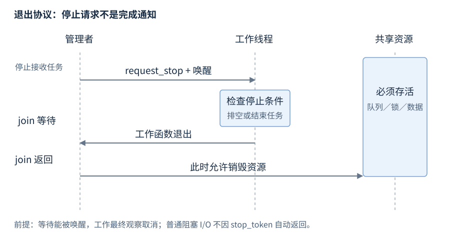

# 第20章 线程与异步任务

线程决定工作在哪里执行；future 决定结果如何交付。二者的生命周期必须分别设计：拿到结果不总是意味着底层线程已退出，发出停止请求也不意味着工作已经停止。

**版本**：thread、future、promise、packaged_task、async 本章按 C++17；jthread 与 stop_token 为 C++20。**先修**：RAII、lambda 捕获、异常、对象生命周期。首次读第1、2、4节；排查退出卡住时查第3、5节。

## 1 thread：谁负责收回执行中的工作

`<thread>` 中 `std::thread(f, args...)` 启动执行，参数按衰变后的类型保存；引用参数需要 `std::ref`（`<functional>`），且调用者保证所引对象存活。捕获 this 或引用不会自动保活对象。构造可能因资源不足抛 system_error；工作函数的未捕获异常调用 terminate，不会由主线程的 catch 接住。

`joinable()` 表示 thread 仍关联一个线程，已经执行完的线程也可能 joinable。成功 `join()` 等待执行结束，并建立线程完成到 join 返回的同步；它不能从当前线程加入自身。不能让多个线程同时操作同一个 thread 对象。析构时仍 joinable 会 terminate，异常路径也必须处理。[构造规则](https://timsong-cpp.github.io/cppwp/n4659/thread.thread.constr)、[成员与 join](https://timsong-cpp.github.io/cppwp/n4659/thread.thread.member)、[析构规则](https://timsong-cpp.github.io/cppwp/n4659/thread.thread.destr)。

| 操作 | 对象状态 | 生命周期责任 |
| --- | --- | --- |
| 默认构造／已移动源 | 不关联线程 | 不需要 join |
| join 成功 | 不再关联线程 | 可以销毁工作所借用的对象 |
| detach 成功 | thread 对象不再关联 | 工作仍可能运行；另需保活、停止和完成协议 |
| 移动到另一个 thread | 所有权转移 | 目标接手 join；不能覆盖仍 joinable 的目标 |
| 工作函数返回 | 关联状态未自动清除 | 仍需 join 或 detach |

detach 不提供“后台任务已经安全退出”的确认。服务关闭、插件卸载或测试结束时，游离任务可能访问已销毁对象；通常应由上层持有执行对象并明确等待。线程函数中使用栈对象的引用，至少要使其生命期覆盖执行与 join。

传参时区分调用者的对象与执行端保存的副本。把 vector 以值传入 thread 会复制或移动到线程参数存储；把引用传进去则仍由外部拥有。线程构造成功前参数准备的异常发生在启动端；工作端的结果不能靠普通 return 交回 thread，使用结果通道或受同步保护的状态。接口同时给出谁负责 join、谁持有数据，才能判断捕获是否安全。

std::thread 的移动赋值若目标仍 joinable，会终止程序；管理线程集合时，应先收回旧工作再替换槽位。不要在工作线程内销毁一个会 join 当前工作线程的拥有者：这属于自身等待问题，即使采用 RAII 也无法使依赖关系正确。

## 2 future：一次结果与异常通道

`<future>` 的 `std::future<T>` 可移动、不可复制。`wait()` 等待就绪而不取值；`get()` 等待并取走结果或重新抛出已保存异常，之后 valid 为 false。无有效共享状态时调用 get/wait 在本章基线下不满足要求，不要依赖实现抛 no_state。多个读者使用 shared_future 并各自持有副本；取到 T& 仍需管理对象寿命和并发访问。[future](https://timsong-cpp.github.io/cppwp/n4659/futures.unique_future)。

| 提供者 | 怎样完成共享状态 | 与执行资源的关系 |
| --- | --- | --- |
| `promise<T>` | set_value 或 set_exception，只满足一次 | 自己启动线程／回调；get_future 只取一次 |
| `packaged_task<R(Args...)>` | 调用包装函数，保存值或异常 | 创建包装器不会启动线程，适合交给执行器 |
| async | 按策略调用函数，保存返回或异常 | 可能异步，也可能延迟执行 |

提供者放弃尚未就绪的共享状态，会使读者得到 broken_promise；set_value 两次会报 promise_already_satisfied。用它区分“计算失败”与“计算者消失”，不要让读者无限等待一个从未安排执行的 packaged_task。[promise](https://timsong-cpp.github.io/cppwp/n4659/futures.promise)、[共享状态](https://timsong-cpp.github.io/cppwp/n4659/futures.state)、[packaged_task](https://timsong-cpp.github.io/cppwp/n4659/futures.task)。

## 3 async 的启动策略与隐式等待

默认策略允许 async 或 deferred，实现可以选择。需要并发时明确 `std::launch::async`；它也可能因无法创建执行资源而抛异常。deferred 由第一次非定时等待者执行函数，`wait_for` 可返回 future_status::deferred，不能把它当普通超时反复轮询。

异步共享状态的最后一次释放可能等待任务完成，因此丢弃 async 返回的临时 future，可能立即等待而使一连串调用实际串行。普通 promise 产生的 future 析构没有这个 async 线程等待规则。不要在持有任务所需 mutex 时销毁可能等待的 future，否则可能形成互等。[C++17 async 的策略、同步与析构边界](https://timsong-cpp.github.io/cppwp/n4659/futures.async)。

下面完整例子检查结果、get 后状态和异常传递；失败任务使用 deferred，刻意展示“异步结果类型”不保证另起线程。

```cpp
#include <exception>
#include <future>
#include <iostream>
#include <stdexcept>

int main() {
    try {
        auto value = std::async(std::launch::async, [] { return 6 * 7; });
        auto failure = std::async(std::launch::deferred, []() -> int {
            throw std::runtime_error("task failed");
        });
        if (value.get() != 42 || value.valid()) return 1;
        bool caught = false;
        try {
            (void)failure.get();
        } catch (const std::runtime_error&) {
            caught = true;
        }
        if (!caught || failure.valid()) return 2;
        std::cout << "result=42 exception=checked\n";
    } catch (const std::exception& e) {
        std::cerr << e.what() << '\n';
        return 3;
    }
}
```

源文件：[r20-async-result.cpp](../examples/r20-async-result.cpp)。构建：`g++ -std=c++17 -Wall -Wextra -pedantic -pthread r20-async-result.cpp -o r20-async-result`。预期：`result=42 exception=checked`；检查失败返回非零。

定时等待的返回值是 ready、timeout 或 deferred；ready 后 get 仍可抛工作异常。`future<void>` 传递操作已完成或失败，不是没有返回值就可以忽略失败。共享状态的就绪同步覆盖产生结果之前的操作；提供者 set_value 后继续修改外部普通对象，读者不能依赖 get 保护这些后续修改。

取消与结果语义需配套：未开始、已取消、已成功和失败通常是不同业务状态。取消与成功同时到达时，应规定哪个状态最终交付，且只交付一次。future 没有通用 cancel 成员，wait_for 超时也不会向任务发送停止信号。

## 4 jthread 与协作取消：请求、观察、退出

C++20 的 `std::jthread`（`<thread>`）析构时若 joinable，先 request_stop 再 join；若可调用对象接受 stop_token，构造会传入令牌。`<stop_token>` 的 stop_source 发请求、stop_token 观察、stop_callback 注册响应。请求是单向状态变化，既不强制终止线程，也不自动打断阻塞 OS I/O。[jthread](https://timsong-cpp.github.io/cppwp/n4861/thread.jthread.class)、[停止状态](https://timsong-cpp.github.io/cppwp/n4861/thread.stoptoken)。

取消的工作用法是：停止接受新任务；使等待者醒来；在安全检查点观察取消；结束或交付已有任务；等待退出；最后销毁共享资源。需要分清“排空队列”和“丢弃未开始任务”两种策略，并给调用者最终结果。stop_callback 可在请求线程上同步执行，回调不能假定运行在工作线程，不应持有可能互相等待的锁。



图20-1：停止观察只是工作循环的条件；图假定阻塞等待有唤醒路径。先 join 再销毁被借用资源，才完成退出协议。本章 C++20 接口是经草案核验的条目，当前 GCC 10.3 环境未实测 jthread。

## 5 任务粒度与退出诊断

C++17/20 没有通用标准线程池。大量短任务不宜逐个启动 OS 线程；使用有限工作者和有界待办队列，记录排队时间、执行时间与拒绝数量。hardware_concurrency 只是提示，可能为 0，也不能据它推出最佳并发数；阻塞 I/O 与 CPU 任务需要分别估算资源。

| 现象 | 先检查 | 工作处理 |
| --- | --- | --- |
| 主线程 catch 无效，直接终止 | 线程入口是否抛出异常；thread 是否仍 joinable | 入口交付异常；用 RAII 覆盖退出 |
| 析构卡住 | worker 等待的锁、条件变量、I/O | 在 join 前建立可达的退出路径 |
| async 看起来串行 | 默认策略；临时 future 的析构 | 保存 future，明确策略，再测量 |
| future 一直不就绪 | packaged_task 是否执行；promise 是否仍被持有 | 追踪提供者，给队列取消和失效语义 |
| 过载时内存上升 | 待办数量与每任务持有资源 | 有界队列、拒绝或降级，见 R21 |

相邻：共享状态的锁见 R21；发布与数据竞争见 R22；截止时间见 R19；阻塞 I/O 的取消需要平台接口，见 R26、R29。
