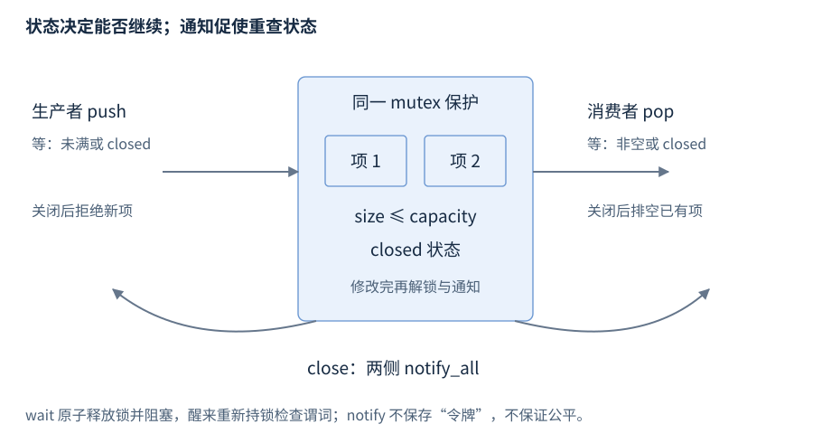

# 第21章 互斥与线程协作

锁保护共享不变量；条件变量让线程等待不变量变成允许继续的状态。通知不是一份被保存的任务，条件变量本身也不保存“队列已经有数据”的事实。

**版本**：核心示例 C++17；semaphore、latch、barrier 为 C++20。**先修**：RAII、thread/future、数据竞争的基本概念。首次读第1至3节；同步器和故障查第4、5节。

## 1 锁的所有权与不变量

`<mutex>` 的 std::mutex 不允许同一线程递归锁定；lock 可以阻塞或抛 system_error，unlock 必须由拥有锁的线程调用。保护对象应说明“这些字段在这个锁下共同满足什么关系”，不能只锁写端而让读端无锁读取普通字段。[mutex](https://timsong-cpp.github.io/cppwp/n4659/thread.mutex.class)。

| 工具 | 常用形式 | 适用条件 |
| --- | --- | --- |
| `lock_guard<mutex>` | guard(m) | 构造锁定、析构释放；整个小作用域持锁 |
| `unique_lock<mutex>` | lock(m)，unlock/lock | 可移动，支持延后／尝试锁定；条件变量等待需要它 |
| `scoped_lock<M1,M2>` | guard(a,b) | C++17，多把锁按避免死锁的算法取得 |
| `shared_lock<shared_mutex>` | read(m) | C++17，读者共享；写者用独占锁 |
| adopt_lock / defer_lock | 声明已经持有／暂不锁定 | 必须遵守标签前提，不能把它们当优化开关 |

`std::scoped_lock guard(a, b);` 的变量名不可漏掉：匿名临时量会在语句末尾销毁。多锁获取应统一顺序，或使用多锁工具；scoped_lock 避免的是该次取得锁的死锁，不消除持锁回调、等待 future、递归进入等循环依赖。[scoped_lock](https://timsong-cpp.github.io/cppwp/n4659/thread.lock.scoped)、[unique_lock](https://timsong-cpp.github.io/cppwp/n4659/thread.lock.unique)。

锁内避免外部回调和长 I/O；把需要的数据取到局部后再执行。若返回指向受保护容器的引用，锁释放后仍可能发生失效或竞争，应返回副本、保活对象或明确的锁持有句柄。

unique_lock 的 owns_lock 与关联 mutex 是两件事：延后锁定的对象可以关联 mutex 却尚未拥有锁；向 wait 传它之前必须真正取得锁。try_lock 失败是未取得所有权，不可读取由这把锁保护的字段。RAII 保证合法作用域退出时释放已经取得的锁，但无法消除其他线程遗留的借用。

锁粒度应与一致性要求对齐。队列长度与内容由同一把锁修改，才不会让计数有项但容器为空被其他线程观察到。拆成两把锁可能增加并发，也增加跨锁不变量的证明负担；先按完整操作建立正确性，再测量临界区是否成为瓶颈。

## 2 条件变量必须配谓词

`<condition_variable>` 的 `cv.wait(lock, pred)` 等价于在持锁时反复检查 pred，不满足则等待。等待原子地释放锁并阻塞，被通知或虚假唤醒后重新取得锁；函数返回时持锁。对同一 condition_variable 同时等待的线程必须使用同一 mutex。

谓词所读状态要在这把锁下修改。先修改状态再 notify；通知可在释放锁后进行，减少被唤醒者立即争锁。notify_one 只唤醒某个等待者，不保证公平，不保证这个线程重获锁后谓词仍成立。无谓词的 wait 即使“运行一直正确”也可能因虚假唤醒或另一消费者抢先取走数据而出错。[wait、谓词和通知](https://timsong-cpp.github.io/cppwp/n4659/thread.condition.condvar)。

需要超时时使用 steady_clock 的绝对截止时间和 wait_until 的谓词形式。每次唤醒重新 wait_for 完整时长，可能把总等待延长；超时与状态更新可能并发，最终判断仍要在锁下看谓词。超时不负责取消产生结果的任务。



图21-1：同一 mutex 保护容量、内容与 closed。生产者等“未满或关闭”，消费者等“非空或关闭”。通知只促使再次检查，队列里的数据才是事实。

## 3 有界队列：背压与关闭一起设计

下面 capacity 为 2；push 在满时阻塞，关闭后拒绝；pop 在空时等待，关闭后仍排空已有项，最后返回 false。close 唤醒两类等待者且可以重复调用。销毁前必须使调用者全部退出，不能让析构与 wait 并发。

```cpp
#include <exception>
#include <condition_variable>
#include <cstddef>
#include <deque>
#include <future>
#include <iostream>
#include <mutex>
#include <utility>

class Queue {
    std::mutex mutex_;
    std::condition_variable readable_, writable_;
    std::deque<int> items_;
    bool closed_ = false;
    static constexpr std::size_t capacity_ = 2;
public:
    bool push(int value) {
        std::unique_lock<std::mutex> lock(mutex_);
        writable_.wait(lock, [&] {
            return closed_ || items_.size() < capacity_;
        });
        if (closed_) return false;
        items_.push_back(value);
        lock.unlock();
        readable_.notify_one();
        return true;
    }
    bool pop(int& value) {
        std::unique_lock<std::mutex> lock(mutex_);
        readable_.wait(lock, [&] { return closed_ || !items_.empty(); });
        if (items_.empty()) return false;
        value = items_.front();
        items_.pop_front();
        lock.unlock();
        writable_.notify_one();
        return true;
    }
    void close() {
        {
            std::lock_guard<std::mutex> lock(mutex_);
            closed_ = true;
        }
        readable_.notify_all();
        writable_.notify_all();
    }
};

int main() {
    try {
        Queue queue;
        auto consumer = std::async(std::launch::async, [&] {
            int value = 0, sum = 0, count = 0;
            while (queue.pop(value)) { sum += value; ++count; }
            return std::pair<int, int>{sum, count};
        });
        try {
            for (int i = 1; i <= 5; ++i) {
                if (!queue.push(i)) { queue.close(); return 1; }
            }
        } catch (...) {
            queue.close();
            throw;
        }
        queue.close();
        const auto result = consumer.get();
        if (result.first != 15 || result.second != 5) return 2;
        std::cout << "count=5 sum=15 closed=drained\n";
    } catch (const std::exception& e) {
        std::cerr << e.what() << '\n';
        return 3;
    }
}
```

源文件：[r21-bounded-queue.cpp](../examples/r21-bounded-queue.cpp)。构建：`g++ -std=c++17 -Wall -Wextra -pedantic -pthread r21-bounded-queue.cpp -o r21-bounded-queue`。预期：`count=5 sum=15 closed=drained`。它核对数量与总和，生产失败时先关闭以使消费者退出；这个 int 队列不承诺泛型元素移动异常的强保证。

有界队列把过载传播给提交者，但工作者向同一满队列递归提交，也可能把所有消费者堵在 push。生产接口需要明确选择：阻塞、截止时间、立即拒绝或丢弃策略。按条目数设限还不足以限制内存；大消息应另限累计字节数、单项尺寸与连接数量。否则“容量100”也能持有巨量资源。

示例只启动一个消费者，任务完成由 future::get 确认；关闭与排空使有限输入有确定终点。队列不保证每个生产者公平取得位置。改成多个消费者时，只要每次成功入队通知一名消费者、关闭通知全部，数据仍按各次持锁修改推进；输出处理顺序却未必与取出顺序相同。

若业务选择取消时丢弃剩余项，应在锁下转移或清除未开始项，并将其失败状态交付给提交者。关闭后立即销毁 mutex 或条件变量，仍会破坏尚未退出的等待者；先等待调用者完成，再释放队列。条件变量析构要求没有线程仍阻塞于它，还需防止新等待进入。

## 4 共享锁与 C++20 同步器速查

读锁只适用于真只读的共享状态；读者更新缓存、延迟初始化或调用会修改对象的 const 接口，仍需同步。shared_mutex 不保证公平或无饥饿，不能无条件认为“读多就快”；短临界区的协调成本可能更高。标准共享锁没有通用原子升级接口，释放读锁再取得写锁后必须重新核验条件。[shared_mutex](https://timsong-cpp.github.io/cppwp/n4659/thread.sharedmutex.requirements)。

| 同步器与头文件 | 等待的事实 | 工作边界 |
| --- | --- | --- |
| counting_semaphore · `<semaphore>` | 许可计数大于零 | acquire 消耗许可，release 增加；不绑定线程所有权，不能超过 max |
| binary_semaphore · `<semaphore>` | 至多一个许可 | 适合一次授权；try_acquire 可虚假失败 |
| latch · `<latch>` | 一次性计数降到零 | count_down 不可超过剩余计数；不能复位 |
| barrier · `<barrier>` | 本阶段参与者到齐 | 可重复阶段；arrive_and_drop 调整后续人数 |
| condition_variable | 自定义谓词成立 | 能表达队列内容、关闭、超时的组合条件 |

semaphore 不保护队列容器本身；许可数量和真实队列状态需保持一致。barrier 的完成步骤有线程和异常约束，完成函数要满足不抛要求；少一个参与者到达会让全阶段无法结束。不可把工作者异常退出留给 barrier 永久等待。[semaphore](https://timsong-cpp.github.io/cppwp/n4861/thread.sema)、[latch](https://timsong-cpp.github.io/cppwp/n4861/thread.latch)、[barrier](https://timsong-cpp.github.io/cppwp/n4861/thread.barrier)。当前例子仅实测 C++17 队列，未实测这三个 C++20 同步器。

## 5 从现象回到等待条件

| 现象 | 检查依据 | 常见误判 |
| --- | --- | --- |
| 偶发空队列 front 崩溃 | wait 后是否重新检查谓词 | 一次 notify 不代表一项数据归该线程 |
| 关闭时进程不退出 | 两类等待者是否都被唤醒 | closed=true 自身不会唤醒 wait |
| 多线程都阻塞 | 锁顺序、持锁等待、递归提交 | 换 recursive_mutex 不能解决循环依赖 |
| 队列满后吞吐骤降 | 消费耗时、累计字节、提交阻塞时间 | 增大容量只能延后过载表现 |
| 读锁下仍有竞争 | 真正修改点和借用寿命 | const 与共享锁都不自动保证无写入 |

记录“哪个线程等待哪个状态、谁能够修改它”。若修改者也在等待同一组资源，先修复等待依赖，再讨论线程数。内存模型见 R22，执行资源退出见 R20，网络背压见 R29。
