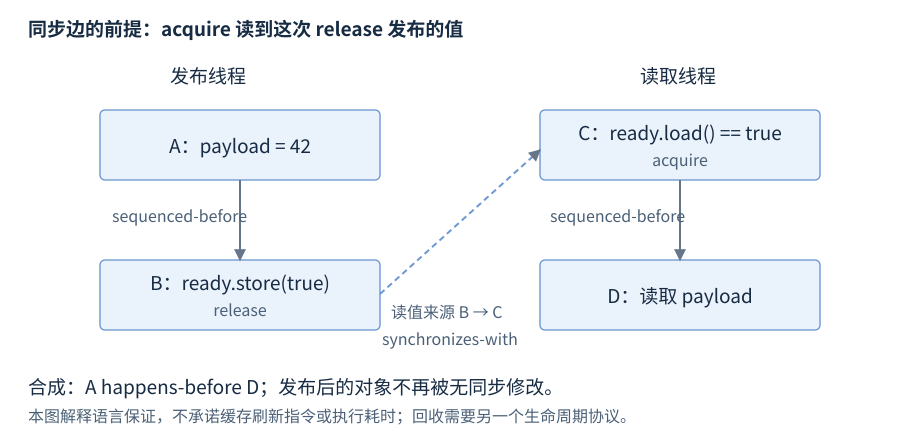

# 第22章 原子与内存序

原子操作解决特定存储位置的不可分割访问；内存序决定哪些跨线程操作建立顺序。把指针变成 atomic，不会顺带保护所指对象、容器不变量或对象回收。

**版本**：示例 C++17；语言规则同时核对 C++20，涉及 release sequence 和 CAS 表示的版本差异另注。**先修**：对象生命周期、线程、锁。首次读第1、2、4节；修改内存序和无锁结构前读全章。

## 1 数据竞争与 happens-before

两个操作访问同一存储位置，其中至少一个修改（或开始／结束重叠对象的生命周期），它们冲突。不同线程中的潜在并发冲突，若至少一方非原子且既无必要的 happens-before，又不属于标准例外，会形成数据竞争，行为未定义。普通 `int++` 不是原子操作；volatile 也不提供线程同步。

happens-before 是语言定义的先行关系，不是墙上时钟的先后。线程内 sequenced-before、线程间 synchronizes-with 及其组合使读写可有根据地排序。典型同步边包括 unlock 到随后成功取得该 mutex 的 lock、线程完成到成功 join，以及匹配的 release/acquire。[C++20 冲突、竞争与顺序关系](https://timsong-cpp.github.io/cppwp/n4861/intro.races)。

不同 vector 元素通常可并行修改，但 `vector<bool>` 位打包例外；同时扩容与访问既有元素不安全。多个字段即使各自 atomic，也不让“余额加总不变”之类复合不变量成为原子事务。需要整体一致性时优先锁或不可变快照。

## 2 atomic 的接口与最小内存序

`<atomic>` 的 `std::atomic<T>` 不可复制；一般模板要求符合其平凡可复制等类型约束。显式初始化 `std::atomic<int> n{0};`，避免依赖 C++17 默认构造的未初始化状态。`load` 读取，`store` 替换，`exchange` 替换并返回旧值；整数 `fetch_add` 等读改写操作返回修改前的值。`n = n + 1` 是分开的读与写，仍可能丢更新。

| 内存序 | 用法 | 不承诺的内容 |
| --- | --- | --- |
| relaxed | 独立统计计数等，只需该原子的原子性和修改顺序 | 不发布旁边的普通对象 |
| release | store，或读改写的写侧 | 不用于单纯 load |
| acquire | load，或读改写的读侧 | 只有读到匹配发布等条件满足时才同步 |
| acq_rel | 读改写，同时承担读侧与写侧 | 不用于单纯 load/store |
| seq_cst | 默认；还建立此类操作的共同全序 | 不会修复非原子数据竞争或回收错误 |

load 不接受 release/acq_rel；store 不接受 acquire/consume/acq_rel。consume 在本章不用于新代码模式，选择 acquire 并明确同步关系。降低默认内存序需有证明和测量，不能依据“这台 x86 上测过”推断语言保证。[原子操作](https://timsong-cpp.github.io/cppwp/n4659/atomics.types.operations)、[内存序](https://timsong-cpp.github.io/cppwp/n4659/atomics.order)。

## 3 CAS：成功写入，失败更新 expected

`compare_exchange_weak(expected, desired, success, failure)` 比较当前原子值和 expected，相等时写 desired 并返回 true；失败时把当前观测值写回 expected。weak 可虚假失败，通常放在循环；strong 避免这种虚假失败，但竞争仍会让它失败。desired 若依赖 expected，失败重试时必须重新计算，且不能在循环中重复不可撤销的外部副作用。

失败只有读，没有写，failure 不能用 release 或 acq_rel。本章 C++17/20 不沿用旧版“失败序不得强于成功序”的限制；实际选序仍需分别解释成功、失败分支的同步用途。单序重载为 acq_rel 时失败用 acquire，为 release 时失败用 relaxed。

C++17 比较对象表示，C++20 改为值表示相关规则；不能假定 CAS 等同 T 的 operator==。浮点表示、填充与同值多表示应另查草案。整数／指针是较易审核的入门对象。[C++17 CAS](https://timsong-cpp.github.io/cppwp/n4659/atomics.types.operations)、[C++20 CAS](https://timsong-cpp.github.io/cppwp/n4861/atomics.types.operations)。

## 4 安全发布：读到哪个写入至关重要

发布者先构造普通 payload，再对 ready 做 release store；读者 acquire load **读到该发布值**，则该 release 与 acquire 同步，先前构造到随后读取形成 happens-before。ready 只是标志，payload 在读者使用期间还必须存活且不被无同步修改。



图22-1：只画语言级顺序，不画缓存刷新。虚线是“读取来源”，实线合成 happens-before；若 acquire 仍读到初始 false，就没有这条发布同步边。例子只有一个发布者，且发布后不修改 payload。

```cpp
#include <exception>
#include <atomic>
#include <iostream>
#include <thread>

int main() {
    try {
        int payload = 0;
        std::atomic<bool> ready{false};
        std::thread publisher([&] {
            payload = 42;
            ready.store(true, std::memory_order_release);
        });
        while (!ready.load(std::memory_order_acquire)) {
            std::this_thread::yield();
        }
        const int observed = payload;
        publisher.join();
        if (observed != 42) return 1;
        std::atomic<int> counter{0};
        int expected = 0;
        if (!counter.compare_exchange_strong(expected, 7)) return 2;
        expected = 0;
        if (counter.compare_exchange_strong(expected, 9) || expected != 7)
            return 3;
        std::cout << "payload=42 CAS-failure-observed=7\n";
    } catch (const std::exception& e) {
        std::cerr << e.what() << '\n';
        return 4;
    }
}
```

源文件：[r22-release-acquire.cpp](../examples/r22-release-acquire.cpp)。构建：`g++ -std=c++17 -Wall -Wextra -pedantic -pthread r22-release-acquire.cpp -o r22-release-acquire`。预期：`payload=42 CAS-failure-observed=7`。payload 的读取在 join **之前**，安全来自 release/acquire；join 另保证销毁前工作已结束。yield 只是调度提示，同步仍由 atomic 建立。该忙等只适合解释规则，长等待用 R21 的阻塞协作；标准不给线程调度的固定延迟上界。

release sequence 是从一次 release 出发的原子修改序列规则；C++17 与 C++20 对后续普通写入的组成规定不同。维护协议优先用直接读取发布写入的模式，若依赖多线程读改写链，需按目标标准逐项证明，不能把本图套用到任意“最后 ready=true”。[C++17 顺序](https://timsong-cpp.github.io/cppwp/n4659/intro.multithread)、[C++20 顺序](https://timsong-cpp.github.io/cppwp/n4861/intro.races)。

审查发布方案应逐项写下：payload 在哪里构造；哪次操作发布；读端究竟观察哪个值；从构造到读取的顺序链如何组成；最后一个读者退出前谁负责保活。若只回答指针是原子变量，还有四个问题未解决。重复使用同一 ready 标志还引入轮次问题，读者可能把旧一轮 true 当新结果；需额外状态或明确的一次性约束。

多原子协议也要逐操作证明。对两个独立 relaxed 计数先后 load 是两次观察，不承诺来自同一时刻的快照；各值都合法，组合仍可能不满足业务关系。更强内存序不自动成为多字段事务，整体快照可采用锁或经审核的版本协议。

## 5 发布不等于回收，无锁不等于有限等待

读到有效指针只能说明那一刻的指针值；读者解引用期间，另一线程 delete 就可能结束对象生命周期。安全回收需要额外协议，例如锁保护借用、共享所有权、hazard pointer 或 epoch。后两者不是 C++17/20 的通用标准库设施，不能凭示意代码宣布可用于生产。

ABA 是值从 A 变成 B 又变成 A，CAS 只比较当前表示而误把变化当作“未变化”。地址复用会扩大这个问题；版本标记需要考虑回绕，且不独立解决已释放对象的读取。指针 atomic 不能替代节点保活。

`is_lock_free()` 查询此对象操作是否无锁，`is_always_lock_free` 是类型级实现属性；原子操作可由内部锁实现。即使底层操作无锁，整段算法仍可能分配、锁日志或反复重试。无锁通常讨论系统整体进展，不保证每个线程在有界步骤内完成，更不保证更快。[原子无锁属性](https://timsong-cpp.github.io/cppwp/n4659/atomics.types.generic)、[查询接口](https://timsong-cpp.github.io/cppwp/n4659/atomics.types.operations)。

| 现象或审查点 | 必须检查 | 不充分的理由 |
| --- | --- | --- |
| 计数偏小 | 是否用了独立 load 加 store | 每次访问原子，组合仍非原子 |
| ready 为真但读数据崩溃 | 匹配发布、后续写入、生命周期 | seq_cst 不负责保活 |
| 无锁队列偶发坏链 | ABA、节点回收、重试中的副作用 | CAS 成功不代表历史未变 |
| CPU 占用高、延迟不稳 | 争用与重试次数、忙等时间 | lock-free 不是 wait-free |
| 用缓存解释正确性 | 标准级同步边与所有者 | 缓存一致性图不足以证明 C++ 程序 |

相关：缓存与伪共享见 R23；锁保护对象见 R21；共享所有权见 R09。完整证明还需考虑进展、异常和关闭，不能靠压力测试一次成功代替规则审核。
