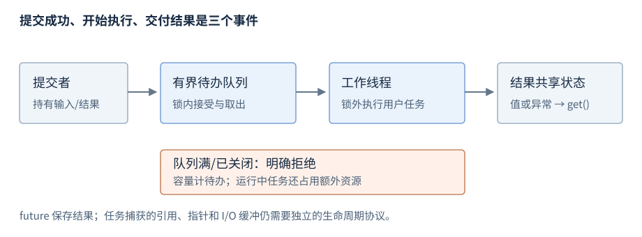
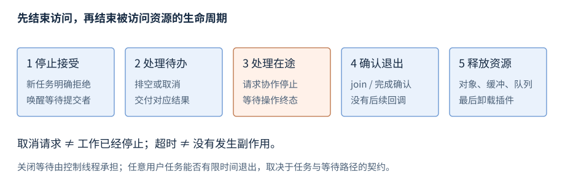

# 第23章 异步执行、事件循环与任务调度

一个异步操作包含执行工作、保存状态、交付结果和收回资源四种责任。创建线程或收到一个事件，只解决其中一部分。沿着任务生命周期检查每个责任，才能解释过载、取消、卡死与退出。

**基线**：配套程序 C++17；协程入口标 C++20。**先修**：R09 所有权、R19 截止时间、R20–R22 线程与同步。先读第1、2、5节；接手 I/O 程序再查第3、4节。平台事件契约见 R26/R29。本章的执行器是工程抽象，未宣称 C++17/20 标准库提供通用线程池。

## 1 线程、任务与执行器：分别由谁负责

| 名称 | 负责什么 | 不自动提供什么 |
| --- | --- | --- |
| OS 线程 | 承载实际执行，接受操作系统调度 | 任务结果、背压、业务取消协议 |
| 任务 | 一份工作及其捕获的输入/状态 | 固定执行线程、借用对象自动保活 |
| 执行器 | 接受工作并规定执行方式与关闭责任 | 任意任务都能立即运行或成功 |
| 线程池 | 用有限工作线程处理待办任务 | 最佳并发数、无限容量或有限完成时间 |
| 事件循环 | 根据事件推进多个操作的状态 | 所有业务回调都可阻塞、线程安全自动成立 |

异步描述调用与完成分离；并行描述工作同时推进；并发描述多个工作可交错推进。一个线程也可管理多个等待 I/O 的操作；一个线程池也可能因为锁、队列或任务依赖而串行等待。future 是结果通道，不是调度器，更不表示一定有新线程，见 R20。

接口应说明：提交成功表示进入了哪里，任务在哪些线程执行，是否允许内联执行，执行次数，异常去向，以及调用者还需保活哪些资源。仅给 `post(callback)` 一个名字不足以推断上述条件。



图23-1：队列容量与运行任务分别计数。执行回调期间不持队列锁；结果通道不延长回调所借用对象的生命周期。

## 2 队列、线程池与背压：等待也是资源消耗

有界队列限制待办工作，但还应计算执行中任务、每任务捕获的数据、结果尚未取走的状态以及外部 I/O 缓冲。仅限制条目数不能限制总字节数。工作量超过处理能力时，增加队列会把失败转成更长等待和更高内存。

| 提交策略 | 调用方观察 | 需要写明的边界 |
| --- | --- | --- |
| 立即拒绝 | 当前任务未进入执行队列 | 能否重试，是否已经有副作用 |
| 等待空位 | 提交者可能阻塞 | 截止时间、关闭唤醒、是否允许工作线程提交 |
| 丢弃/替换 | 某些工作不执行 | 哪些任务可丢、对应结果怎样完成 |
| 按优先级接受 | 高优先级先获得资源 | 低优先级饥饿、公平性与上限 |

不能让所有池内线程都同步等待必须由同一池执行的新任务：即使没有互斥锁，也可能耗尽执行能力。类似地，消费者向已经满的同一队列阻塞提交，可能使队列永远没人消费。选择异步串接、不同执行资源或明确禁止这种依赖。把队列等待与任务执行分开测量，才能区别算得慢和根本没开始。

工作线程通常在锁内取出任务，在锁外调用用户代码。否则慢任务、重入提交或异常会扩大锁范围。任务对业务对象的同步仍由它自己的契约承担；取队列锁不保护所有外部对象。

## 3 事件循环与状态机：一次通知不是整个操作

事件循环围绕“当前状态 + 本次事件 + 实际操作结果”推进。以接收长度前缀消息为例，状态可为读头、验证长度、读载荷、交付消息、继续读取或关闭。短读时保存偏移，不能丢掉已完成进度，也不能把一次 recv 当成一条完整消息，见 R29。

| 状态字段 | 为什么必须保存 | 何时可释放 |
| --- | --- | --- |
| 输入缓冲和已读偏移 | 下一次事件从尚未完成位置继续 | 没有操作和解析视图继续借用时 |
| 待发数据与写偏移 | 短写不能重复发送已完成部分 | 相应发送完成或被协议终结后 |
| 截止时间与终态 | 多次唤醒共享同一预算，只交付一次结果 | 终态交付与在途访问都结束后 |
| 操作身份/代次 | 旧事件可能在关闭、重建后才处理 | 所有旧操作已确认结束后 |

单线程事件循环可简化状态访问，但队列提交端、后台计算、I/O 完成线程或回调重入仍可能形成并发。对象状态到底归哪个线程访问，应写成规则；必要时把变更投递回所属循环。回调中同步调用能再次进入自己的接口，也要防止重入破坏正在修改的不变量。

事件回调应尽量短，把长计算交给受控执行资源；结果回到循环后要检查目标操作仍存活且代次匹配。不能保存裸 this 后默认用户界面、连接或插件一直存在。涉及 UI 线程的框架契约另查相应框架文档。

## 4 就绪与完成：Linux 与 Windows 的两条路径

| 模型 | 事件含义 | 后续工作 | 生命周期焦点 |
| --- | --- | --- | --- |
| Linux epoll 就绪 | fd 当前可能允许取得进展 | 调用非阻塞读写，根据字节数/EAGAIN等推进 | 连接状态、事件身份、关闭后旧事件 |
| Windows IOCP 完成 | 某个已提交异步操作交付完成状态 | 检查操作身份、状态与实际字节数 | OVERLAPPED、缓冲及操作状态保活至完成 |

epoll 边沿触发下通常需要非阻塞操作处理到 EAGAIN，并遵守具体注册模式的再挂规则；就绪不保证一次读完整消息，也不保证随后不会因竞争读者而暂时无数据。普通磁盘文件也不能直接当作 epoll 的通用异步完成来源。[Linux epoll](https://man7.org/linux/man-pages/man7/epoll.7.html)。

IOCP 完成包不等于操作成功；检查错误和字节数，再更新应用状态。取消请求与完成确认分开处理，不能在 CancelIoEx 返回后立即销毁仍可能被使用的缓冲。多个操作结果也不能未经协议就按提交顺序解释。[Windows IOCP](https://learn.microsoft.com/en-us/windows/win32/fileio/i-o-completion-ports)、[取消待处理 I/O](https://learn.microsoft.com/en-us/windows/win32/fileio/canceling-pending-i-o-operations)。

这两种模型可以都服务事件驱动程序，但缓冲、状态与取消责任不同，不应把一套 API 改名当成另一平台的实现。本章没有运行 epoll/IOCP 端点；配套程序验证的是任务队列协议。

## 5 超时、取消、完成与关闭

超时表示等待预算用完，取消表示请求工作停止，完成表示操作达到协议终态。它们不能互换。调用方 wait_for 超时后，任务可能仍在运行并持有资源。若业务已经返回失败，任务随后又提交副作用，还需要业务层去重或结果协调，见 R29。



图23-2：先阻止新任务进入，再处理队列与在途操作，确认工作退出后才销毁共享资源。请求停止与确认停止是不同事件。

| 阶段 | 需要达到的条件 | 常见遗漏 |
| --- | --- | --- |
| 停止接受 | 新提交得到明确拒绝 | 一边销毁队列一边仍允许提交 |
| 处理待办 | 排空，或按协议取消并交付结果 | 丢弃工作却永远不完成对应 future |
| 处理在途 | 工作观察取消，或正常完成 | 只改标志，未唤醒条件变量/I/O等待 |
| 确认退出 | join 或取得完整的操作终态确认 | 仅凭 close 句柄认定回调结束 |
| 清理资源 | 不再有任务、内核操作和回调借用 | 先销毁缓冲/插件，再等待工作 |

“排空”可能没有固定完成上界，因为用户任务可能等待外部服务或永不返回。需要有限关闭时间时，从任务设计开始给出可协作停止的等待路径，而非最后给 join 加个伪超时。执行器自己的工作线程不应调用等待自身退出的关闭接口；销毁与等待由控制线程负责。

同一操作的成功、超时与取消可能竞争，应在指定线程或同步保护下只提交一次终态。被取消任务的结果应能区分取消、失败与成功。关闭过程中产生的新回调也应遵循相同规则，不能形成永远排不空的新工作链。

## 6 最小有界执行器：拒绝、异常通道与排空

配套程序 [r23-executor.cpp](../examples/r23-executor.cpp) 使用一个工作线程、容量为2的待办队列和 `packaged_task<int()>`。只展示非阻塞提交与排空关闭，不支持优先级、取消在途任务或通用返回类型。关闭/析构只由创建它的控制线程调用，且对象销毁时没有外部提交者；用户任务不得等待同一个执行器中的后继任务。

```cpp
#include <condition_variable>
#include <cstddef>
#include <future>
#include <iostream>
#include <mutex>
#include <optional>
#include <queue>
#include <stdexcept>
#include <thread>
#include <utility>

class Executor {
    std::mutex mutex_;
    std::condition_variable changed_;
    std::queue<std::packaged_task<int()>> queue_;
    bool accepting_ = true;
    const std::size_t capacity_ = 2;
    std::thread worker_;
    void run() {
        for (;;) {
            std::packaged_task<int()> task;
            {
                std::unique_lock<std::mutex> lock(mutex_);
                changed_.wait(lock, [this] {
                    return !accepting_ || !queue_.empty();
                });
                if (queue_.empty()) return;
                task = std::move(queue_.front());
                queue_.pop();
            }
            task();
        }
    }
public:
    Executor() : worker_([this] { run(); }) {}
    Executor(const Executor&) = delete;
    Executor& operator=(const Executor&) = delete;
    ~Executor() { close_and_wait(); }
    template<class F>
    std::optional<std::future<int>> try_submit(F&& work) {
        std::packaged_task<int()> task(std::forward<F>(work));
        auto result = task.get_future();
        {
            std::lock_guard<std::mutex> lock(mutex_);
            if (!accepting_ || queue_.size() == capacity_)
                return std::nullopt;
            queue_.push(std::move(task));
        }
        changed_.notify_one();
        return std::optional<std::future<int>>(std::move(result));
    }
    void close_and_wait() {
        {
            std::lock_guard<std::mutex> lock(mutex_);
            accepting_ = false;
        }
        changed_.notify_all();
        if (worker_.joinable()) worker_.join();
    }
};

struct ReleaseGate {
    std::promise<void>& promise;
    bool released = false;
    void release() {
        if (!released) { promise.set_value(); released = true; }
    }
    ~ReleaseGate() { release(); }
};

int main() {
    std::promise<void> started, release;
    auto started_result = started.get_future();
    auto gate = release.get_future().share();
    Executor executor;
    ReleaseGate guard{release};
    auto first = executor.try_submit([&started, gate] {
        started.set_value();
        gate.wait();
        return 40;
    });
    if (!first) return 1;
    started_result.get();
    auto second = executor.try_submit([] { return 2; });
    auto failure = executor.try_submit([]() -> int {
        throw std::runtime_error("task failed");
    });
    const bool full_rejected = !executor.try_submit([] { return 99; });
    guard.release();
    executor.close_and_wait();
    const bool closed_rejected = !executor.try_submit([] { return 99; });
    if (!second || !failure || !full_rejected || !closed_rejected) return 2;
    const int result = first->get() + second->get();
    bool failed = false;
    try { static_cast<void>(failure->get()); }
    catch (const std::runtime_error&) { failed = true; }
    if (result != 42 || !failed) return 3;
    std::cout << "accepted=3 rejected=2 result=42 failures=1\n";
    return std::cout ? 0 : 4;
}
```

第一项工作通过 promise 通知“已经开始”，随后等待门闩；主线程由此确定两项待办填满队列，拒绝检查不依赖 sleep 和碰运气的调度顺序。ReleaseGate 在异常或提前返回时先开放门闩，再析构执行器，避免该测试等待自己的资源释放。

任务异常由 packaged_task 保存到共享状态，使用者在 get 时接收，工作线程继续处理队列。队列状态由 mutex 保护，用户任务在锁外执行。close_and_wait 使等待线程醒来，已接受任务排空后退出；重复由控制线程调用可发现 worker 已不 joinable。[条件变量与谓词](https://timsong-cpp.github.io/cppwp/n4659/thread.condition.condvar)、[packaged_task](https://timsong-cpp.github.io/cppwp/n4659/futures.task)、[join](https://timsong-cpp.github.io/cppwp/n4659/thread.thread.member)。

预期 `accepted=3 rejected=2 result=42 failures=1`；失败退出非零。构建入口为 `g++ -std=c++17 -Wall -Wextra -Wpedantic -pthread r23-executor.cpp -o r23-executor`。任务和队列分配仍可能失败并抛异常；立即拒绝在此只指满队列/关闭，不能理解为接口保证不抛。示例不是通用生产线程池，也没有对任意挂起任务提供有限时间退出保证。

## 7 C++20 协程：挂起不决定在哪里恢复

协程把可挂起函数的执行状态交给协程机制；`co_await` 的等待器参与决定是否挂起以及怎样安排恢复，`co_return` 通过 promise 类型交付结果。协程本身不提供通用事件循环、线程池、网络 I/O 或取消策略。恢复可能发生在不同执行环境，必须查所用库的约定。[C++20 协程](https://timsong-cpp.github.io/cppwp/n4861/dcl.fct.def.coroutine)、[co_await](https://timsong-cpp.github.io/cppwp/n4861/expr.await)。

跨挂起点保留的状态与所借用对象都需要合法生命周期；协程帧存在不表示引用参数的目标存在。句柄的恢复、销毁和在途事件必须协调，不能让仍可能恢复的任务先销毁帧。协程库还需定义错误、取消、线程切换和最终完成责任。本版给出查阅入口，未实现协程框架或运行其例子。

## 8 从故障回到状态与责任

| 现象 | 先收集的证据 | 首先修正的边界 |
| --- | --- | --- |
| CPU不高但任务延迟很大 | 排队时间、待办数、各工作线程栈 | 执行能力、阻塞依赖与过载策略 |
| 关闭永远不返回 | 仍运行任务、等待条件、未完成 I/O | 可达的退出路径与终态确认 |
| UI/连接关闭后偶发崩溃 | 回调身份、对象所有者、在途记录 | 借用保活、注销和代次校验 |
| 超时后仍产生副作用 | 任务开始/完成/响应时间 | 超时与取消、业务结果的分离 |
| 事件循环吞吐突然下降 | 回调持续时间、队列和工作负载 | 长计算转移、短回调和背压 |
| future 永不返回或报 broken_promise | 是否接受、执行、丢弃或销毁提供者 | 每个已接受任务的结果交付协议 |

任务状态机、资源所有权和执行环境应能在同一份记录中对应起来。先核对协议，再以 R31 的线程栈、R32 的等待与排队证据定位具体路径。资料核验：2026-10-08；平台实测范围见 BUILD-NOTES。
