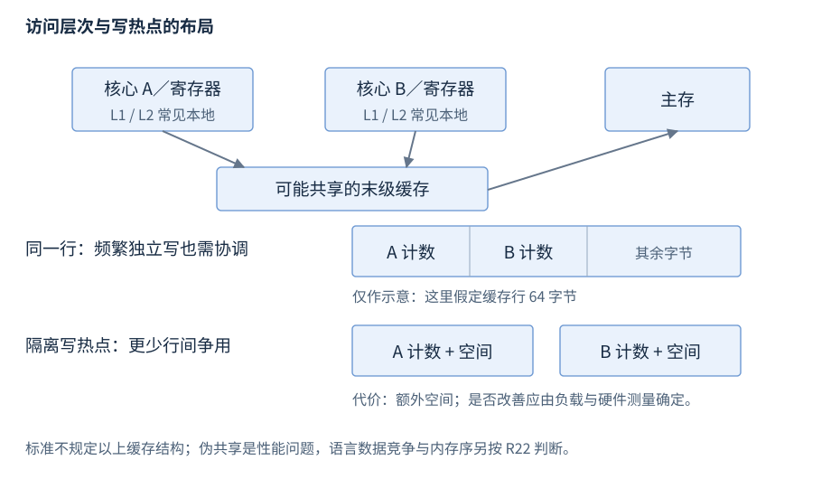

# 第23章 CPU 与程序执行成本

源码中的一次访问可能对应寄存器操作、缓存命中、页表查询或主存访问；相同复杂度的程序因此可以有不同成本。先确认程序满足 C++ 规则，再用目标机器证据解释时间差。

**版本**：对象与数值规则按 C++17/20；硬件图为常见多核系统示意。**先修**：类型、对象表示、容器、原子。首次读第1、2、4节；性能排查查第3、5节。

## 1 从源码到指令：寄存器不是变量的固定住所

编译器可以把值放在寄存器、折叠常量、消除不可观察工作、内联函数或重排不影响语言规定行为的操作。调试器里变量“被优化掉”不表示机器丢失数据；源码行也不对应固定指令数。需要比较生产性能时，使用相同优化、输入与目标架构，核查生成代码和实际热点。[C++17 抽象机器与可观察行为](https://timsong-cpp.github.io/cppwp/n4659/intro.execution)。

现代处理器常见流水线、推测和乱序执行，分支预测失败可能浪费已执行工作；成本受型号、路径分布和指令依赖影响。把 if 改成无分支表达式可能增加额外计算，不能据写法判快慢。寄存器宽度、指令吞吐与内存带宽各限制不同环节；CPU 占用100%也不说明算术单元始终有效工作。

volatile 的主要语言效果与访问的可观察性相关，不是强迫“每次从主存读取”，不提供线程互斥与发布。跨线程正确性按 R22 的顺序关系判断，机器重排序仅是实现需兑现规则的一部分。

## 2 缓存与局部性：先确定访问模式

常见机器按缓存行取数据，多级缓存的容量、共享范围与行大小由实现决定。时间局部性指近期访问的数据被重复使用；空间局部性指随后访问附近地址。连续扫描 vector 往往方便预取；链表追踪下一指针存在数据依赖，且节点可散布。但是否更快必须包括元素大小、工作集、分配方式和访问次数。



图23-1：上半为常见层次，不规定 L1/L2/L3 的共享与大小；下半假定一行64字节，仅说明两个独立计数落入同一行时的写入协调。不同硬件可有不同结构，不能据图推导 atomic 的 memory_order。

伪共享指逻辑独立、由不同核心频繁写入的对象落在同一缓存行，使一致性协议产生额外协调。它不同于两个线程修改同一变量，也不一定构成语言数据竞争。优先让各线程局部累积后合并；确有证据时再隔离热字段。隔离会增加内存占用和扫描成本，不能给每个对象盲目加64字节。[Linux 内核伪共享分析](https://www.kernel.org/doc/html/latest/kernel-hacking/false-sharing.html)。

C++17 的 `std::hardware_destructive_interference_size` 与 constructive 版本在 `<new>`，值由实现给出，提供布局建议而非运行时探测，也不保证编译器都实现。把该值用进公共结构布局会影响 ABI；跨模块应固定布局契约并核验编译选项。[C++20 干扰尺寸常量](https://timsong-cpp.github.io/cppwp/n4861/support.types.layout)。

## 3 对齐、填充与访问是否合法

`alignof(T)` 是类型的对齐要求；`alignas` 可加强合法对齐，不能削弱自然要求。`sizeof` 包括对象表示中的填充。struct 字段的排列可使尺寸增大，数组元素按 sizeof(T) 递进；不要把字段尺寸之和当作结构尺寸。[对齐](https://timsong-cpp.github.io/cppwp/n4659/basic.align)、[对象表示](https://timsong-cpp.github.io/cppwp/n4659/basic.types)。

将字节缓冲强转为 T*，即使地址对齐也不充分：还需存在适合的对象并满足别名规则。解析外部数据优先逐字段读取，或在满足平凡可复制等条件时 memcpy 到真实对象，再验证表示和取值。不得把本机 struct 直接当网络／磁盘协议，填充、大小、端序和字段表示都可能改变。

硬件支持未对齐访问不使 C++ 的错误指针合法；另一些架构会陷阱、拆分访问或付出不同代价。Linux 内核的未对齐访问文档是平台实现指导，不能替代用户程序的语言规则。[Linux 对齐边界](https://www.kernel.org/doc/html/latest/core-api/unaligned-memory-access.html)。

## 4 端序与数值：编码规则应写出来

端序是多字节值的字节排列；C++20 `std::endian`（`<bit>`）区分 little、big 和可能的混合情形，不能无条件断言 native 二选一。网络字段按协议编码，主机端序只影响如何实现转换。下面明示32位无符号字段、8位字节、大端序；它与本机字节布局无关。[endian](https://timsong-cpp.github.io/cppwp/n4861/bit.endian)。

```cpp
#include <array>
#include <climits>
#include <cstdint>
#include <iostream>

int main() {
    static_assert(CHAR_BIT == 8, "this wire format needs 8-bit bytes");
    const std::uint32_t value = 0x01020304u;
    std::array<unsigned char, 4> bytes{{
        static_cast<unsigned char>(value >> 24),
        static_cast<unsigned char>(value >> 16),
        static_cast<unsigned char>(value >> 8),
        static_cast<unsigned char>(value)
    }};
    std::uint32_t decoded = 0;
    for (unsigned char byte : bytes) decoded = (decoded << 8) | byte;
    if (bytes != std::array<unsigned char, 4>{{1, 2, 3, 4}} ||
        decoded != value) return 1;
    std::cout << "wire=1,2,3,4 roundtrip=checked\n";
}
```

源文件：[r23-byte-order.cpp](../examples/r23-byte-order.cpp)。构建：`g++ -std=c++17 -Wall -Wextra -pedantic r23-byte-order.cpp -o r23-byte-order`。预期：`wire=1,2,3,4 roundtrip=checked`。uint32_t 仅在存在精确32位无符号整数类型的实现提供；CHAR_BIT 检查限定了该演示格式。

无符号整数运算按其范围模回绕；有符号溢出行为未定义，不能由 CPU 的回绕现象推出 C++ 保证。浮点不保证每个平台都是 IEEE 754；使用 numeric_limits 检查 is_iec559、digits、范围与舍入相关属性。即便二进制浮点遵循 IEEE，十进制0.1仍可能不能精确表示；比较、累计误差与 NaN 应按业务误差界设计。优化选项允许忽略 NaN 或改变结合律时，还要核查工具链契约。[基础类型](https://timsong-cpp.github.io/cppwp/n4659/basic.fundamental)、[numeric_limits](https://timsong-cpp.github.io/cppwp/n4659/numeric.limits)。

字节解码时先提升到足够宽的无符号类型再移位组合；窄有符号字符的提升与符号扩展可能污染字段。位宽、移位计数、长度与目标范围要独立验证，不能用机器都是64位代替协议字段检查。memcpy 可以读取对象表示，但表示可复制不等于任意外部字节都代表有效值。

固定宽度协议还需明确数值单位与缩放。时间字段是秒还是毫秒、有符号还是无符号，与端序是独立条件；转换成功仍可能因单位错误产生业务偏差。

## 5 性能现象与检查依据

| 现象 | 先找的证据 | 常见误判 |
| --- | --- | --- |
| 增加线程后变慢 | 每线程工作量、争用、带宽、伪共享 | 多核不使任意工作线性加速 |
| 连续扫描变慢 | 工作集、访问跨度、实际字节量 | O(n) 不能说明缓存命中率 |
| 链表插入快、整体慢 | 找位置、分配、指针依赖 | 只测已知位置插入会遗漏主成本 |
| Debug 远慢于 Release | 优化、检查、内联与输入差异 | 不能用调试构建作生产结论 |
| 加 padding 后改善 | 重复基准与目标架构计数 | 单次波动不能证明伪共享 |
| 数值“偶尔为负” | 溢出、窄化、并发读写 | 先核查语言错误，不能先归因硬件 |

测量应防止结果未使用而被消除，记录构建方式、机器和负载；微基准不代表端到端收益。缓存与指令计数等工具数据是诊断线索，结合热路径解释，见 R30。虚拟地址、缺页与 RSS 见 R24，原子正确性见 R22。
